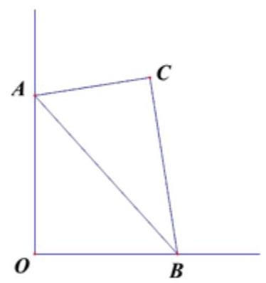
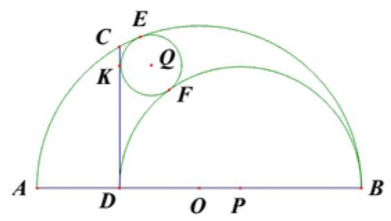
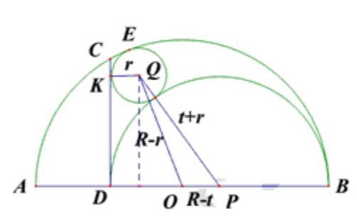
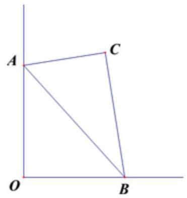
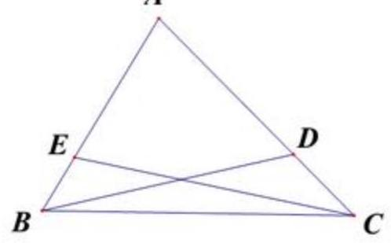
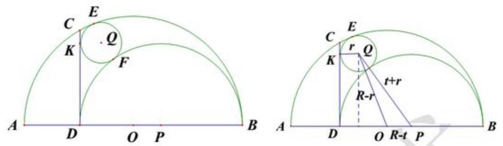
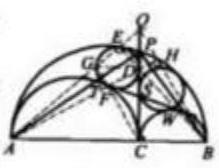
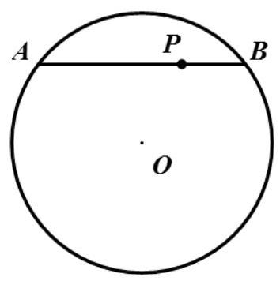

## 2017 年上海市初中数学竞赛(大同中学杯)试卷

## 一、填空题 (每题 10 分, 共 80 分)

1. 已知抛物线 $y = a{x}^{2} + {bx} + c$ 过点 $\left( {0,0}\right) ,\left( {{22.5},{2020.5}}\right) ,\left( {{62.5},{1812.5}}\right)$ ,则抛物线与 x 轴的另一交点的横坐标为_____(精确到 0.001)。

2. 已知实数 $\mathrm{x}$ ,则 $\frac{x - 1}{{x}^{2} - x + 1}$ 的最小值为_____。

3. 如图, Rt $\bigtriangleup  \mathrm{{ABC}}$ 中, $\angle \mathrm{C} = {90}^{ \circ  }$ , AC=4, BC=5,现点A, B分别在 y 轴, x 轴正半轴上运动,则 C 点的运动轨迹的长度为_____。

4. 已知 $\mathrm{m}$ 为整数,关于 $\mathrm{x}$ 的二次方程 $\left( {{m}^{2} + {4m}}\right) {x}^{2} + \left( {{m}^{2} + {2m} + {24}}\right) x + 6\left( {m - 4}\right)  = 0$ 有两个不同的正整数根,则 m 的值为_____。

5. 在 $1,2,3,\cdots ,{2017}$ 这 2017 个数中,数码中有 2 或 4 的数有_____个。

6. 已知在 $\bigtriangleup \mathrm{{ABC}}$ 中, AB=2, AC=3,点D、E在边AC、AB上,且 $\angle \mathrm{{ABD}} = 4\angle \mathrm{{DBC}}$ , $\angle \mathrm{{ACE}} = 4\angle \mathrm{{ECB}}$ , ${AC} \times  {BD} = {AB} \times  {CE}$ ,则 $\bigtriangleup  \mathrm{{ABC}}$ 的面积为_____。

7. 已知正整数 $\mathrm{n}$ 满足 ${n}^{3}$ 的个位、百位、万位上的数码都是 7,则 $\mathrm{n}$ 的最小值是_____。

8. 已知 $\mathrm{a}\text{、}\mathrm{\;b}\text{、}\mathrm{c}\text{、}\mathrm{\;d}$ 四个不相等的实数,满足 $\mathrm{c}\text{、}\mathrm{\;d}$ 是方程 ${x}^{2} - {8ax} - {9b} = 0$ 的两实数根, $\mathrm{a}\text{、}\mathrm{\;b}$ 是方程 ${x}^{2} - {8cx} - {9d} = 0$ 的两实数根,则 $a + b + c + d =$ _____。

## 二、解答题 (第 9 题、第 10 题 15 分, 第 11 题、第 12 题 20 分)

9. 如图, $\odot  Q$ 与 $\odot  O$ 内切于点 $\mathrm{E}$ ,与 $\mathrm{{CD}}$ 相切于点 $\mathrm{K}$ ,与 $\odot  P$ 外切于点 $\mathrm{F}, \odot  P$ 与 $\mathrm{{CD}}$ 相切于点 $\mathrm{D}$ ,内切于 $\odot  O$ 上的 $\mathrm{B}$ 点, $\mathrm{{AB}}$ 为 $\odot  O$ 直径,若 $\odot  O$ 半径为 $\mathrm{R}, \odot  Q$ 的半径为 $\mathrm{r}$ ,则 $\mathrm{{CD}}$ 为多少?

10. 已知 $\mathrm{x}\text{、}\mathrm{y}$ 为非负实数,满足 $\sqrt{1 - \frac{{x}^{2}}{4}} + \sqrt{1 - \frac{{y}^{2}}{16}} = \frac{3}{2}$ ,求 ${xy}$ 的最大值。

11. 已知有 20 个红球, 17 个白球, 红球和白球总质量相等, 但小于 340 克, 每个球的质量为整数克数, 证明: 可以拿出一些红球和白球 (可以是一个但不可以是全部), 使拿出的红球与白球质量相等。

12. 已知 $\mathrm{p}$ 为素数,问: 是否存在 $\mathrm{p}$ 使 $a + b, b + c, c + a$ 的最小公倍数能整除 $\mathrm{{pc}}(\mathrm{a},\mathrm{b},\mathrm{c}$ 为两两不同的正整数),若存在,请求出素数 $\mathrm{p}$ 的最小值,若不存在,请说明理由并证明。

## 2017 年上海市初中数学竞赛 (大同中学杯) 参考答案

## 一. 填空题

1. 已知抛物线 $y = a{x}^{2} + {bx} + c$ 过点 $\left( {0,0}\right) ,\left( {{22.5},{2020.5}}\right) ,\left( {{62.5},{1812.5}}\right)$ ,则抛

物线与 $x$ 轴的另一交点的横坐标为_____(精确到 0.001)

【答】 81.579

【解析】用计算器, 或者暴力死算, 或者拉格朗日插值公式

$0 = \frac{\left( {x - 0}\right) \left( {x - {22.5}}\right) }{\left( {{62.5} - 0}\right) \left( {{62.5} - {22.5}}\right) } \times  {1812.5} + \frac{\left( {x - 0}\right) \left( {x - {62.5}}\right) }{\left( {{22.5} - 0}\right) \left( {{22.5} - {62.5}}\right) } \times  {2020.5} + \frac{\left( {x - {22.5}}\right) \left( {x - {62.5}}\right) }{\left( {0 - {22.5}}\right) \left( {0 - {62.5}}\right) } \times  0$

也即 $\frac{x - {22.5}}{62.5} \times  {1812.5} = \frac{x - {62.5}}{22.5} \times  {2020.5} \Rightarrow  x = \frac{1550}{19} \approx  {81.579}$

2. 已知实数 $x$ ,求 $\frac{x - 1}{{x}^{2} - x + 1}$ 的最小值_____

【答】-1

【解析】当 $x \geq  1$ 原式 $\geq  0$ ,

当 $x < 1$ ,原式 $= \frac{1}{x - 1 + \frac{1}{x - 1} + 1} = \frac{1}{-1 - \left( {1 - x + \frac{1}{1 - x} - 2}\right) } \geq  \frac{1}{-1 - 0} =  - 1$

$x = 0$ 时可取等.

3. 如图, ${Rt}\bigtriangleup {ABC}$ 中, $\angle C = {90}^{ \circ  },{AC} = 4,{BC} = 5$ ,现点 $A, B$ 分别在 $y$ 轴, $x$ 轴

正半轴上运动,则 $C$ 点的运动轨迹的长度为_____

【答】 $\sqrt{41} - 4$

【解析】由题意 ${AOBC}$ 共圆 $\Rightarrow  \angle {COB} = \angle {CAB}$ 为定值,

而 ${OC} = \sin \angle {CBO} \times  {AB},\angle {CBA} \leq  \angle {CBO} \leq  {180}^{ \circ  } - \angle {CAB} < {180}^{ \circ  } - \angle {CBA}$

$\Rightarrow  \frac{4}{\sqrt{41}} = \sin \angle {CBA} \leq  \sin \angle {CBO} \leq  1 \Rightarrow  4 \leq  {OC} \leq  \sqrt{41},\sqrt{41} - 4$ 为所求

## 注 1: 此题为学而思暑假高联一试班第 15 讲例 3 类似题

【例题3】 $\rightarrow  \bigtriangleup {ABC}, C = {90}^{ \circ  }, A = {60}^{ \circ  },{AB} = {10}$ ,把 $\bigtriangleup {ABC}$ 放到直角坐标系中,使得 $A, B, C$ 成顺时针, 并且 $A$ 可以在 $x$ 轴正半轴 (含原点) 运动, $B$ 可以在 $y$ 轴正半轴 (含原点) 运动,求 ${AB}$ 中点 $D$ 的轨迹方程, $C$ 的轨迹方程.

【分析】 $\rightarrow  D$ 的轨迹方程为 $\left\{  \begin{array}{l} {x}^{2} + {y}^{2} = {25} \\  x \geq  0, y \geq  0 \end{array}\right.$ , $C$ 的轨迹方程 $y = \frac{\sqrt{3}}{3}x, x \in  \left\lbrack  {\frac{5\sqrt{3}}{2},5\sqrt{3}}\right\rbrack  \psi$

## 4. 已知 $m$ 为整数,关于 $x$ 的二次方程 $\left( {{m}^{2} + {4m}}\right) {x}^{2} + \left( {{m}^{2} + {2m} + {24}}\right) x + 6\left( {m - 4}\right)  = 0$ 有 两个不同的正整数根,则 $m$ 的值为_____

【答】-3

【解析】因为两根和 $> 0,{m}^{2} + {2m} + {24} > 0 \Rightarrow  {m}^{2} + {4m} < 0 \Rightarrow  m =  - 1, - 2, - 3$ ,

若 $m =  - 1, - 3{x}^{2} + {23x} - {30} = 0$ 舍,

若 $m =  - 2, - 4{x}^{2} + {24x} - {36} = 0 \Rightarrow$ 两根相同舍,

若 $m =  - 3, - 3{x}^{2} + {27x} - {42} = 0 \Rightarrow  x = 2$ 或 7,综上 $m =  - 3$

5. 在 $1,2,3,\ldots ,{2017}$ 这 2017 个数中,数码中有 2 或 4 的数有_____个

## 【答】 994

【解析】2000以内无2,4有 $2 \times  8 \times  8 \times  8 - 1 = {1023}$ 个(去掉 0 ),

于是共 ${2000} - {1023} + {2017} - {2000} = {994}$ 个

6. 已知在 $\bigtriangleup {ABC}$ 中, ${AB} = 2,{AC} = 3$ ,点 $D, E$ 在边 ${AC},{AB}$ 上,

且 $\angle {ABD} = 4\angle {DBC},\angle {ACE} = 4\angle {ECB},{AC} \times  {BD} = {AB} \times  {CE}$ ,则 $\bigtriangleup {ABC}$ 的面积为_____

【答】 $\frac{3}{2}$

【解析】设 $\angle {DBC} = x,\angle {ECB} = y \Rightarrow  \frac{\sin \left( {{5y} + x}\right) }{\sin \angle A} = \frac{AC}{CE} = \frac{AB}{BD} = \frac{\sin \left( {{5x} + y}\right) }{\sin \angle A}$

显然 $x \neq  y, \Rightarrow  {6x} + {6y} = {180}^{ \circ  } \Rightarrow  \angle A = {180}^{ \circ  } - {5x} - {5y} = {30}^{ \circ  }$ ,

$S = \frac{1}{2} \times  2 \times  3 \times  \sin {30}^{ \circ  } = \frac{3}{2}$

## 7. 已知正整数 $n$ 满足 ${n}^{3}$ 的个位,百位,万位上的数码都是 7 ,则 $n$ 的最小值是_____

【答】 83

【解析】 ${n}^{3} \equiv  \overline{7x7y7}\left( {\;\operatorname{mod}\;{10}^{5}}\right)$

由 ${n}^{3} \equiv  \overline{7x7y7}\left( {\;\operatorname{mod}\;5}\right)$ 得 $n = {5k} + 3, n$ 为奇数可设 $n = {10t} + 3,{n}^{3} > {70000} \Rightarrow  t \geq  4$ ,

$\Rightarrow  {100}{t}^{3} + {90}{t}^{2} + {27t} + 2 \equiv  \overline{7x7y}\left( {\;\operatorname{mod}\;{10}^{4}}\right)  \Rightarrow  {10}{t}^{2} + {7t} + 2 \equiv  \overline{1y}\left( {\;\operatorname{mod}\;{20}}\right)$

当 $t$ 为偶数, ${7t} + 2 \equiv  \overline{1y}\left( {\;\operatorname{mod}\;{20}}\right) , t$ 代入 4 进原式不成立,故至少为 8,

当 $t$ 为奇数, ${7t} + {12} \equiv  \overline{1y}\left( {\;\operatorname{mod}\;{20}}\right)$ , $t$ 至少为 9, ${83}^{3} = {571787}$ 符合条件。

8. 已知 $a, b, c, d$ 四个不相等的实数,满足 $c, d$ 是方程 ${x}^{2} - {8ax} - {9b} = 0$ 的两实根, $a, b$ 是方程 ${x}^{2} - {8cx} - {9d} = 0$ 的两实根,则 $a + b + c + d =$ _____

【答】 648

【解析】

$\left\{  {\begin{array}{l} c + d = {8a} \\  {cd} =  - {9b} \\  a + b = {8c} \\  {ab} =  - {9d} \end{array} \Rightarrow  \left\{  {\begin{array}{l} c\left( {{8a} - c}\right)  + 9\left( {{8c} - a}\right)  = 0 \\  a\left( {{8c} - a}\right)  + 9\left( {{8a} - c}\right)  = 0 \end{array} \Rightarrow  {a}^{2} - {c}^{2} + {81}\left( {c - a}\right)  = 0 \Rightarrow  a + c = {81}}\right. }\right.$

$$
\Rightarrow  a + b + c + d = 8\left( {a + c}\right)  = {648}
$$

## 注 2:此题为 2017 年新静安区赛类似题, 决赛前有将回忆版发在九年级 QQ 群内让同学们做, 认真复习的同学理应记得的哦.

2017大同区选徐汇,静安:zip

## 二、解答题 (第 9、10 题, 每题 15 分; 第 11、12 题每题 20 分, 共 70 分)

9. 设 $a\text{、}b\text{、}c\text{、}d$ 为四个不同的实数,若 $a\text{、}b$ 为方程 ${x}^{2} - {10cx} - {11d} = 0$ 的解, $c\text{、}d$ 为

方程 ${x}^{2} - {10ax} - {11b} = 0$ 的解. 求 $a + b + c + d$ 的值.

【分析】根据韦达定理 $a + b = {10c},{ab} =  - {11d}, c + d = {10a},{cd} =  - {11b}$ . 消去 $a, b$ 得 $c\left( {c + d}\right)  = {1210},\frac{121}{c} - \frac{cd}{11} = {10c}$ ,消去 $d$ ,得 $\left( {c + {11}}\right) \left( {{c}^{2} - {121c} + {121}}\right)  = 0$ . 若 $c =  - {11}$ 此时因为 ${ac} = {121}$ 得 $a = c$ 矛盾. 所以 $a, c$ 为方程 ${x}^{2} - {121x} + {121} = 0$ 两根, $a + c = {121}, b + d = 9\left( {a + c}\right)$ . $a + b + c + d = {1210}$

## 二. 解答题

9. 如图, $\odot  Q$ 与 $\odot  O$ 内切于点 $E$ ,与 ${CD}$ 相切于点 $K$ ,与 $\odot  P$ 外切于点 $F, \odot  P$ 与 ${CD}$ 相切于点 $D$ ,内切于 $\odot  O$ 上的 $B$ 点, ${AB}$ 为 $\odot  O$ 直径,若 $\odot  O$ 半径为 $R, \odot  Q$ 半径为 $r$ ,则 ${CD}$ 为多少?

【答】 $2\sqrt{Rr}$

【解析】设圆 $P$ 半径为 $t$ ,则

$$
{\left( t + r\right) }^{2} - {\left( t - r\right) }^{2} = {\left( R - r\right) }^{2} - {\left( 2t - R - r\right) }^{2} \Rightarrow  {tr} = \left( {t - r}\right) \left( {t - R}\right)  \Rightarrow  {t}^{2} - {tR} + {Rr} = 0
$$

$$
C{D}^{2} = {AD} \times  {DB} = {R}^{2} - O{D}^{2} = {R}^{2} - {\left( 2t - R\right) }^{2} = {4tR} - 4{t}^{2} = {4Rr} \Rightarrow  {CD} = 2\sqrt{Rr}
$$

## 注 3: 此题原型在著名书籍《几何瑰宝》中有原型 一鞋匠皮刀形问题

鞋匠皮刀形问题 如图 3.222,设 $C$ 为半圆直径 ${AB}$ 上的一点,并设 ${AB} =$ ${2r},{AC} = 2{r}_{1},{CB} = 2{r}_{2}$ . 在形内分别以 ${AC},{BC}$ 为直径作两个半圆,再作 ${CQ} \bot$

${AB}$ ,交半圆 ${AB}$ 于 $P$ . 设 ${TW}$ 为半圆 ${AC}$ 和 ${CB}$ 的公切线,且与 ${CP}$ 交于 $S$ ,则①

图 3.222

(1) 皮刀形 ${ATCWBP}$ 的面积(记为 ${S}_{1}$ )等于以 ${CP}$ 为直径的圆面积 (记为 ${S}_{2}$ ).

(2) ${CP}$ 与 ${TW}$ 相等,且互相平分于 $S$ ,即 $C, T, P, W$ 四点共圆,它的圆心为 $S$ .

(3) 三点 $A, T, P$ 共线, $B, W, P$ 也共线.

(4)外切于半圆 ${AC}$ (或半圆 ${CB}$ )和内切于半圆 ${AB}$ 以及 ${CP}$ 的两个圆必相等.

该图形出现于阿基米德所著的《引理集》(也可能是后人收集整理阿基米德研究过的一些初等几何问题而成), 它具有许多奇妙的性质, 曾为许多人研究过, 如马查, 西蒙等.

(1) ${S}_{1} = \frac{1}{2}\pi {r}^{2} - \frac{1}{2}\pi {r}_{1}^{2} - \frac{1}{2}\pi {r}_{2}^{2} =$

$$
\frac{1}{2}\pi \left( {{\left( {r}_{1} + {r}_{2}\right) }^{2} - {r}_{1}^{2} - {r}_{2}^{2}}\right)  = \frac{1}{4}\pi \left( {2{r}_{1} \cdot  2{r}_{2}}\right)  =
$$

$$
\frac{1}{4}{\pi C}{P}^{2} = \pi  \cdot  {\left( \frac{CP}{2}\right) }^{2} = {S}_{2}
$$

( 2 )因为 $C{P}^{2} = 4{r}_{1}{r}_{2}, T{W}^{2} = {\left( {r}_{1} + {r}_{2}\right) }^{2} - {\left( {r}_{1} - {r}_{2}\right) }^{2} = 4{r}_{1}{r}_{2}$ ,所以 ${CP} =$ ${TW}$ . 又 ${SW} = {SC},{SC} = {ST}$ ,所以 ${SC} = {SP}$ . 故 $C, T, P, W$ 四点共圆,它的圆心为 $S$ .

10. 已知 $x, y$ 为非负实数,满足 $\sqrt{1 - \frac{{x}^{2}}{4}} + \sqrt{1 - \frac{{y}^{2}}{16}} = \frac{3}{2}$ ,求 ${xy}$ 的最大值.

【答】 $\frac{7}{2}$

【解析】 $\frac{3}{2} = \sqrt{1 - \frac{{x}^{2}}{4}} + \sqrt{1 - \frac{{y}^{2}}{16}} \leq  \sqrt{\left( {1 + 1}\right)  \times  \left( {1 - \frac{{x}^{2}}{4} + 1 - \frac{{y}^{2}}{16}}\right) } \leq  \sqrt{2 \times  \left( {2 - 2\sqrt{\frac{{x}^{2}{y}^{2}}{64}}}\right) }$

$\Rightarrow  {xy} \leq  \frac{7}{2}$ ,当 $x = \frac{\sqrt{7}}{2}, y = \sqrt{7}$ 时可取等

## 11. 已知有 20 个红球, 17 个白球, 红球和白球总质量相等, 但小于 340 克, 每个球的质量 为整数克数, 证明: 可以拿出一些红球和白球 (可以是一个但不可以是全部), 使拿出 的红球与白球质量相等

【解析】加强命题证明 $a$ 个红球, $b$ 个白球,总质量小于 ${ab}$ 时命题成立。

首先 $a = 2, b = 2$ 时显然成立,设 $a + b = n$ ,数归: 假设命题对小于 $n$ 成立,下证 $n$ 成立。

不妨设红球和白球重量分别为 ${x}_{1} \leq  {x}_{2} \leq  \ldots  \leq  {x}_{a},{y}_{1} \leq  {y}_{2} \leq  \ldots  \leq  {y}_{b}$ ,

若 ${x}_{a} = {y}_{b}$ 得证,不妨设 ${x}_{a} > {y}_{b}$ ,则 ${x}_{1},{x}_{2}\ldots ,{x}_{a} - {y}_{b}$ 和 ${y}_{1},{y}_{2},\ldots ,{y}_{b - 1}$ 共 $n - 1$ 个球,且 ${y}_{1} + \ldots  + {y}_{b - 1} \leq  \frac{b - 1}{b}\left( {{y}_{1} + \ldots  + {y}_{b}}\right)  < \frac{\left( {b - 1}\right) {ab}}{b} = a\left( {b - 1}\right)$ ,通过归纳,必有两组质量相等,若这两组中没有 ${x}_{a} - {x}_{b}$ ,则直接选取,否则,红球给 ${x}_{a} - {y}_{b}$ 补上 ${x}_{b}$ ,白球补上 ${y}_{b}$ 即可。取 $\left( {a, b}\right)  = \left( {{20},{17}}\right)$ 命题得证。(本题思路由复旦大学武炳杰老师提供)

## 12. 已知 $p$ 为素数,问: 是否存在 $p$ 使 $a + b, b + c, c + a$ 的最小公倍数能整出 ${pc}$ $\left( {a, b, c\text{为两两不同的正整数}}\right)$ 若存在,请求出素数 $p$ 的最小值,若不存在,请说明 理由并证明

【解析】显然 $a + b \mid  {pc}, a + c \mid  {pc}, b + c \mid  {pc}$ ,

若 $p = 2 \Rightarrow  a = c$ 矛盾,由 $a + c > c \Rightarrow  p\left| {a + c, p}\right| b + c$ ,

若 $p\left| {a + b \Rightarrow  p}\right| 2\left( {a + b + c}\right)  \Rightarrow  p\left| {a, p}\right| b, p\left| {c \Rightarrow  a + b}\right| c$ ,

$a, b, c$ 同除以最大公约数,可设 $\left( {a, b, c}\right)  = 1$ ,

设 $\left( {a, c}\right)  = {r}_{a},\left( {b, c}\right)  = {r}_{b}, a = {r}_{a}x, b = {r}_{b}y, c = {r}_{a}{r}_{b}z$ ,

显然 $\left( {{r}_{a},{r}_{b}}\right)  = \left( {x,{r}_{b}z}\right)  = \left( {y,{r}_{a}z}\right)  = 1$ ,

由 $a + c \mid  {pc} \Rightarrow  {r}_{a}x + {r}_{a}{r}_{b}z \mid  p{r}_{a}{r}_{b}z \Rightarrow  x + {r}_{b}z \mid  p{r}_{b}z \Rightarrow  x + {r}_{b}z \mid  p \Rightarrow  p = x + {r}_{b}z$

同理有 $p = x + {r}_{b}z = y + {r}_{a}z$ ,若 $x = y \Rightarrow  {r}_{a} = {r}_{b} \Rightarrow  a = b$ 矛盾,不妨设 $x > y \Rightarrow  x > z$ ,

由 $a + b\left| {c \Rightarrow  {r}_{a}x + {r}_{b}y}\right| {r}_{a}{r}_{b}z \Rightarrow  {r}_{a}x + {r}_{b}y \mid  z \Rightarrow  z > {r}_{a}x > {r}_{a}z$ 矛盾。证毕。

## 2016 年上海市大同杯初三数学竞赛试题

## (2016.12.04)

## 一、填空题

1. 计算: ${16}\left( {\frac{1}{5} - \frac{1}{3} \times  \frac{1}{{5}^{3}} + \frac{1}{5} \times  \frac{1}{{5}^{5}} - \frac{1}{7} \times  \frac{1}{{5}^{7}} + \frac{1}{9} \times  \frac{1}{{5}^{9}} - \frac{1}{11} \times  \frac{1}{{5}^{11}}}\right)  - 4\left( {\frac{1}{239} - \frac{1}{3} \times  \frac{1}{{239}^{3}}}\right)  =$

_____(精确到 8 位小数).

2. 一个四位数除以 433 ,商是 $a$ ,余数是 $r$ ( $a$ , $r$ 都是自然数),则 $a + r$ 的最大值是_____.

3. 已知点 $A\left( {-{0.8},{4.132}}\right)$ , $B\left( {{1.2}, - {1.948}}\right)$ , $C\left( {{2.8}, - {3.932}}\right)$ 在二次函数 $y = a{x}^{2} + {bx} + c$ 的图像上,则当图像上的点 $D$ 的横坐标 $x = {1.8}$ 时,它的纵坐标 $y$ 的值是_____.

4. 使等式 ${\left( {n}^{2} - 5n + 5\right) }^{n + 1} = 1$ 成立的整数 $n$ 的值是_____.

5. 如图,已知 $P$ 为e $O$ 的弦 ${AB}$ 上的点, ${AP} = m,{BP} = n$ ,且 $m > n$ ,当 ${AB}$ 沿 $\mathrm{e}O$ 运动一周时,点 $P$ 的轨迹是曲线 $C$ . 若 $\mathrm{e}O$ 与曲线 $C$ 之间所围成的图形的面积为 $\pi \left( {{m}^{2} - {n}^{2}}\right)$ ,这里 $\pi$ 是圆周率,则 $\frac{m}{n}$ 的值为_____.

6. 设 $\left\lbrack  x\right\rbrack$ 表示不超过实数 $x$ 的最大整数,

$S = \left\lbrack  \frac{1}{1}\right\rbrack   + \left\lbrack  \frac{2}{1}\right\rbrack   + \left\lbrack  \frac{1}{2}\right\rbrack   + \left\lbrack  \frac{2}{2}\right\rbrack   + \left\lbrack  \frac{3}{2}\right\rbrack   + \left\lbrack  \frac{4}{2}\right\rbrack   + \left\lbrack  \frac{1}{3}\right\rbrack   + \left\lbrack  \frac{2}{3}\right\rbrack   + \left\lbrack  \frac{3}{3}\right\rbrack   + \left\lbrack  \frac{4}{3}\right\rbrack   + \left\lbrack  \frac{5}{3}\right\rbrack   + \left\lbrack  \frac{6}{3}\right\rbrack   + \ldots$ ,直至 2016 项,其中分母为 $k$ 的一段共有 ${2k}$ 项 $\left\lbrack  \frac{1}{k}\right\rbrack  ,\left\lbrack  \frac{2}{k}\right\rbrack  ,\ldots ,\left\lbrack  \frac{2k}{k}\right\rbrack$ ,只有最后一段可能不足 ${2k}$ 项,则 $S$ 的值为_____.

7. 若实数 $a, b, c$ 使得二次函数 $f\left( x\right)  = a{x}^{2} + {bx} + c$ 当 $0 \leq  x \leq  1$ 时,恒有 $\left| {f\left( x\right) }\right|  \leq  1$ ,则 $\left| a\right|  + \left| b\right|  + \left| c\right|$ 的最大值为_____.

8. 已知 $a, b, c, d$ 为四个正的常数,则当实数 $x, y$ 满足 $a{x}^{2} + b{y}^{2} = 1$ 时, ${cx} + d{y}^{2}$ 的最小值为 _____.

## 二、解答题