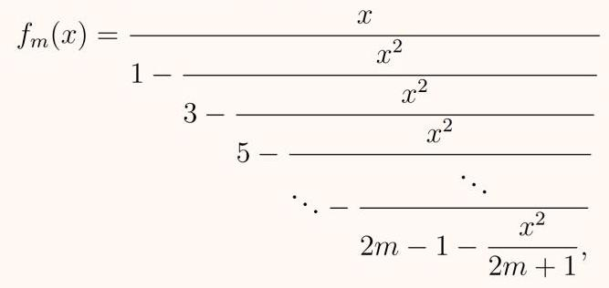
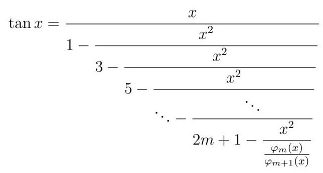
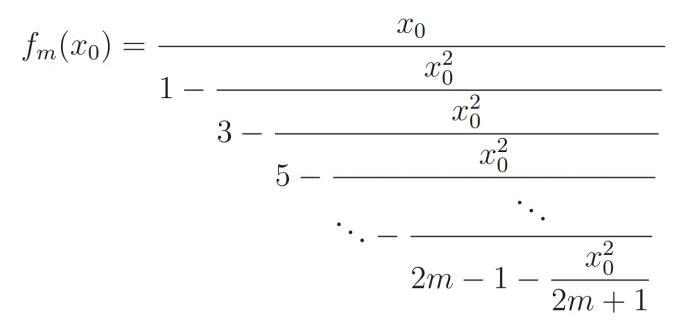

则称 (3) 式为 $f$ 的一个渐进多项式。

进一步,若存在一列实数 ${a}_{k}$ ,使得对任意的 $n \in  {\mathbb{N}}^{ * }$ 都有 (3) 式成立,则称 $\mathop{\sum }\limits_{{k = 0}}^{\infty }{a}_{k}{\varphi }_{k}\left( x\right)$ 为 $f$ 的一个渐进级数。

注 1: 由于 ${\varphi }_{k}$ 的选取不同,可见一般来说一个函数的渐进级数并不唯一。一般的,渐进级数也并不一定收敛,即使收敛,也不一定收敛到 $f$ 。

注 2:有时对余项没有很强的要求,我们也会写成 $O\left( {{\varphi }_{n}\left( x\right) }\right)$ 。

例题 1 我们知道 $\ln \left( {x + 1}\right)$ 在 0 处有 Taylor 展开

$$
\ln \left( {x + 1}\right)  = \mathop{\sum }\limits_{{k = 1}}^{n}\frac{{\left( -1\right) }^{k - 1}}{k}{x}^{k} + o\left( {x}^{n}\right) ,\forall n \in  {\mathbb{N}}^{ * }
$$

显然上式给出了 $\ln \left( {x + 1}\right)$ 在 $x \rightarrow  0$ 时的一个渐进多项式。

类似的,对 ${e}^{x} - 1$ 在 0 处有

$$
{e}^{x} - 1 = \mathop{\sum }\limits_{{k = 1}}^{n}\frac{1}{k!}{x}^{k} + o\left( {x}^{n}\right) ,\forall n \in  {\mathbb{N}}^{ * }
$$

注 求某个函数在某一点的 Taylor 多项式的过程事实上就是在寻找该函数在该点处的一个渐进多项式。

例题 2 熟知在 $x \rightarrow  0$ 时,有等价无穷小 ${\left( 1 + x\right) }^{\alpha } - 1 \sim  {\alpha x}$ 。于是自然可以得出如下的渐进多项式: ${\left( 1 + x\right) }^{\alpha } = 1 + {\alpha x} + o\left( x\right)$ 。

## $3\;\Gamma \left( x\right)$ 在 $x \rightarrow   + \infty$ 时的一阶渐进多项式

## 命题 2

在 $x \rightarrow   + \infty$ 时,有

$$
\Gamma \left( x\right)  = {x}^{x - \frac{1}{2}}{e}^{-x}\sqrt{2\pi }\left( {1 + O\left( \frac{1}{x}\right) }\right) . \tag{4}
$$

为证明这个估计式, 我们先证明如下若干引理。

## 引理 1

设 $n$ 为正整数,当 $x \rightarrow   + \infty$ 时,有

$$
\ln \Gamma \left( n\right)  = \left( {n - \frac{1}{2}}\right) \ln n - n + {C}_{0} + O\left( \frac{1}{n}\right) , \tag{5}
$$

其中 ${C}_{0}$ 是常数。0

证明: 由 $\Gamma$ 函数的递推公式,有 $\Gamma \left( n\right)  = \left( {n - 1}\right) !$ ,从而我们有以下计算:

$$
\ln \Gamma \left( n\right)  = \ln \left( {\left( {n - 1}\right) !}\right)  = \mathop{\sum }\limits_{{k = 1}}^{{n - 1}}\ln k
$$

$$
= \mathop{\sum }\limits_{{k = 1}}^{{n - 1}}\left( {{\int }_{k}^{k + 1}\ln {tdt} + {\int }_{k}^{k + 1}\left( {\ln k - \ln t}\right) {dt}}\right)
$$

$$
= {\int }_{1}^{n}\ln {tdt} - \mathop{\sum }\limits_{{k = 1}}^{{n - 1}}{\int }_{k}^{k + 1}\ln \left( \frac{t}{k}\right) {dt}
$$

$$
= {\left. \left( t\ln t - t\right) \right| }_{1}^{n} - \mathop{\sum }\limits_{{k = 1}}^{{n - 1}}{\int }_{0}^{1}\ln \left( {1 + \frac{t}{k}}\right) {dt}
$$

$$
= n\ln n - n + 1 - \mathop{\sum }\limits_{{k = 1}}^{{n - 1}}{\int }_{0}^{1}\left( {\frac{t}{k} + O\left( {\left( t/k\right) }^{2}\right) }\right) {dt}
$$

$$
= n\ln n - n + 1 - \mathop{\sum }\limits_{{k = 1}}^{{n - 1}}\frac{1}{2k} + O\left( {\mathop{\sum }\limits_{{k = 1}}^{{n - 1}}\frac{1}{{k}^{2}}}\right)
$$

$$
= n\ln n - n + 1 - \frac{1}{2}\ln n - \gamma  + O\left( {\mathop{\sum }\limits_{{k = 1}}^{\infty }\frac{1}{{k}^{2}}}\right)  + O\left( {\mathop{\sum }\limits_{{k = n}}^{\infty }\frac{1}{{k}^{2}}}\right)
$$

$$
= \left( {n - \frac{1}{2}}\right) \ln n - n + {C}_{0} + O\left( \frac{1}{n}\right) .
$$

## 引理 2

设 $a > 0$ ,则在 $x \rightarrow   + \infty$ 时,有以下渐进多项式

$$
\frac{\Gamma \left( x\right) }{\Gamma \left( {x + a}\right) } = {x}^{-a} + O\left( {x}^{-a - 1}\right) . \tag{6}
$$

证明: 先设 $a > 1$ 。 由 $\Gamma$ 函数和 $B$ 函数的关系,我们有

$$
\frac{\Gamma \left( x\right) \Gamma \left( a\right) }{\Gamma \left( {x + a}\right) } = B\left( {a, x}\right)
$$

$$
= {\int }_{0}^{1}{\left( 1 - t\right) }^{a - 1}{t}^{x - 1}{dt}
$$

$$
= {\int }_{0}^{\infty }{\left( 1 - {e}^{-s}\right) }^{a - 1}{e}^{-{sx}}{ds}
$$

$$
= \left( {{\int }_{0}^{1} + {\int }_{1}^{\infty }}\right) {\left( 1 - {e}^{-s}\right) }^{a - 1}{e}^{-{sx}}{ds}
$$

$$
= {I}_{1} + {I}_{2},
$$

下面我们分别估计 ${I}_{1}$ 和 ${I}_{2}$ 。

$$
{I}_{1} = {\int }_{0}^{1}{\left( 1 - {e}^{-s}\right) }^{a - 1}{e}^{-{sx}}{ds}
$$

$$
= {\int }_{0}^{1}{\left( s + O\left( {s}^{2}\right) \right) }^{a - 1}{e}^{-{sx}}{ds}
$$

$$
= {\int }_{0}^{1}{s}^{a - 1}{\left( 1 + O\left( s\right) \right) }^{a - 1}{e}^{-{sx}}{ds}
$$

$$
= {\int }_{0}^{1}{s}^{a - 1}\left( {1 + \left( {a - 1}\right) O\left( s\right)  + o\left( s\right) }\right) {e}^{-{sx}}{ds}
$$

$$
= {\int }_{0}^{1}{s}^{a - 1}\left( {1 + O\left( s\right) }\right) {e}^{-{sx}}{ds}
$$

$$
= {\int }_{0}^{x}{x}^{-a}{r}^{a - 1}\left( {1 + O\left( \frac{r}{x}\right) }\right) {e}^{-r}{dr}
$$

$$
= {x}^{-a}{\int }_{0}^{x}{r}^{a - 1}{e}^{-r}{dr} + {x}^{-a - 1}{\int }_{0}^{x}{r}^{a - 1}O\left( r\right) {e}^{-r}{dr}
$$

$$
= {x}^{-a}\Gamma \left( a\right)  - {x}^{-a}{\int }_{x}^{\infty }{r}^{a - 1}{e}^{-r}{dr} + O\left( {{x}^{-a - 1}{\int }_{0}^{x}{r}^{a}{e}^{-r}{dr}}\right)
$$

$$
= {x}^{-a}\Gamma \left( a\right)  + O\left( {{x}^{-a}{\int }_{x}^{\infty }{e}^{-r/2}{dr}}\right)  + O\left( {{x}^{-a - 1}\Gamma \left( {a + 1}\right) }\right)
$$

$$
= {x}^{-a}\Gamma \left( a\right)  + O\left( {x}^{-a - 1}\right) .
$$

$$
{I}_{2} = {\int }_{1}^{\infty }{\left( 1 - {e}^{-s}\right) }^{a - 1}{e}^{-{sx}}{ds}
$$

$$
= {\int }_{1}^{\infty }O\left( {e}^{-{sx}}\right) {ds}
$$

$$
= O\left( {{e}^{-x}/x}\right)  = O\left( {x}^{-a - 1}\right) \text{.}
$$

故

$$
\frac{\Gamma \left( x\right) }{\Gamma \left( {x + a}\right) } = {x}^{-a} + O\left( {x}^{-a - 1}\right) \Gamma \left( a\right)  = {x}^{-a} + O\left( {x}^{-a - 1}\right) .
$$

当 $0 < a \leq  1$ 时,有

$$
\frac{\Gamma \left( x\right) }{\Gamma \left( {x + a}\right) } = \frac{\left( {x + a}\right) \Gamma \left( x\right) }{\Gamma \left( {x + a + 1}\right) } = \left( {x + a}\right) \left( {{x}^{-a - 1} + O\left( {x}^{-a - 2}\right) }\right)  = {x}^{-a} + O\left( {x}^{-a - 1}\right) .
$$

命题2的证明:记 $n = \left\lbrack  x\right\rbrack  , a = \{ x\}$ 分别是 $x$ 的整数和小数部分。由 (5)式和(6) 式,有

$$
\ln \Gamma \left( x\right)  = \ln \Gamma \left( n\right)  - \ln \left( {{x}^{-a} + O\left( {x}^{-a - 1}\right) }\right)
$$

$$
= \ln \Gamma \left( n\right)  + a\ln x + \ln \left( {1 + O\left( {1/x}\right) }\right)
$$

$$
= \left( {n - \frac{1}{2}}\right) \ln n - n + {C}_{0} + O\left( {1/n}\right)  + a\ln x + O\left( {1/x}\right)
$$

$$
= \left( {x - a - \frac{1}{2}}\right) \ln \left( {x - a}\right)  - x + a + {C}_{0} + a\ln x + O\left( {1/x}\right)
$$

$$
= \left( {x - a - \frac{1}{2}}\right) \left( {\ln x + \ln \left( {1 - \frac{a}{x}}\right) }\right)  - x + a + {C}_{0} + a\ln x + O\left( {1/x}\right)
$$

$$
= \left( {x - \frac{1}{2}}\right) \ln x + \left( {x - a - \frac{1}{2}}\right) \ln \left( {1 - \frac{a}{x}}\right)  - x + a + {C}_{0} + O\left( {1/x}\right)
$$

$$
= \left( {x - \frac{1}{2}}\right) \ln x + \left( {x - a - \frac{1}{2}}\right) \left( {-\frac{a}{x} + O\left( {\left( a/x\right) }^{2}\right) }\right)  - x + a + {C}_{0} + O\left( {1/x}\right)
$$

$$
= \left( {x - \frac{1}{2}}\right) \ln x - x + {C}_{0} + O\left( {1/x}\right) .
$$

(*)

由 Legendre 加倍公式, 有

$$
\ln \Gamma \left( {2x}\right)  = \left( {{2x} - 1}\right) \ln 2 - \frac{1}{2}\ln \pi  + \ln \Gamma \left( x\right)  + \ln \Gamma \left( {x + \frac{1}{2}}\right) ,
$$

将 $\left( *\right)$ 式代入得

$$
\left( {{2x} - \frac{1}{2}}\right) \ln \left( {2x}\right)  - {2x} + {C}_{0} + O\left( {1/x}\right)  = \left( {{2x} - 1}\right) \ln 2 - \frac{1}{2}\ln \pi  + \left( {x - \frac{1}{2}}\right) \ln x - x + {C}_{0}
$$

$$
+ x\ln \left( {x + \frac{1}{2}}\right)  - \left( {x + \frac{1}{2}}\right)  + {C}_{0} + O\left( {1/x}\right) ,
$$

整理得

$$
\frac{1}{2}\ln \left( {2\pi }\right)  + \frac{1}{2} = x\ln \left( {1 + \frac{1}{2x}}\right)  + {C}_{0} + O\left( {1/x}\right) .
$$

令 $x \rightarrow   + \infty$ ,考虑到 $\mathop{\lim }\limits_{{x \rightarrow   + \infty }}x\ln \left( {1 + \frac{1}{2x}}\right)  = \frac{1}{2}$ ,可知 ${C}_{0} = \frac{1}{2}\ln \left( {2\pi }\right)$ 。代入 $\left( *\right)$ 式就有

$$
\ln \Gamma \left( x\right)  = \left( {x - \frac{1}{2}}\right) \ln x - x + \frac{1}{2}\ln \left( {2\pi }\right)  + O\left( {1/x}\right) ,
$$

即 (5) 式。

## 4 用阶的估计方法得到正项级数审敛法

记 $\mathop{\sum }\limits_{{n = 1}}^{\infty }{a}_{n}$ 是一个正项级数。下面我们利用阶的估计方法得出两个正项级数的审敛法。在正式给出之前,我们先回忆最简单的 d'Alembert 审敛法,事实上我们可以认为该方法的条件是给出了一个阶的估计式 ${a}_{n} = O\left( {1/{n}^{d}}\right)$ ,从而由 $\sum 1/{n}^{d}$ 的敛散性可以推导出 $\sum {a}_{n}$ 的敛散性。

## 命题 3

设 $\mathop{\lim }\limits_{{n \rightarrow  \infty }}{a}_{n} = 0,\mathop{\lim }\limits_{{n \rightarrow  \infty }}\sqrt[n]{{a}_{n}} = 1$ ,记 $l = \mathop{\lim }\limits_{{n \rightarrow  \infty }}\left( {1 - \sqrt[n]{{a}_{n}}}\right) \frac{n}{\ln n}$ (若存在),则级数 $\sum {a}_{n}$ 在 $l > 1$ 时收敛,在 $l < 1$ 时发散。 ♠

证明: $l > 1$ 时:

存在 $1 < k < l, N > 0$ 使得当 $n > N$ 时有 $\left( {1 - \sqrt[n]{{a}_{n}}}\right) \frac{n}{\ln n} > k$ 。则

$$
{a}_{n} < {\left( 1 - \frac{k\ln n}{n}\right) }^{n}
$$

$$
= \exp \left\{  {n\ln \left( {1 - \frac{k\ln n}{n}}\right) }\right\}
$$

$$
= \exp \left\{  {n\left( {-\frac{k\ln n}{n}}\right)  + O\left( {\left( \frac{k\ln n}{n}\right) }^{2}\right) }\right\}
$$

$$
= \exp \left\{  {-k\ln n + O\left( \frac{{\ln }^{2}n}{n}\right) }\right\}
$$

$$
= {n}^{-k}O\left( 1\right)  = O\left( {n}^{-k}\right) \text{.}
$$

而 $\sum 1/{n}^{k}$ 收敛,从而 $\sum {a}_{n}$ 收敛。

$l < 1$ 时:

存在 $l < k < 1, N > 0$ 使得当 $n > N$ 时有 $\left( {1 - \sqrt[n]{{a}_{n}}}\right) \frac{n}{\ln n} < k$ 。则由不等式 $\ln x + \frac{1}{x} \geq  1$ 得

$$
{a}_{n} > {\left( 1 - \frac{k\ln n}{n}\right) }^{n}
$$

$$
= \exp \left\{  {n\ln \left( {1 - \frac{k\ln n}{n}}\right) }\right\}
$$

$$
\geq  \exp \left\{  \frac{{kn}\ln n}{k\ln n - n}\right\}
$$

$$
= {n}^{-k/\left( {1 - k\ln n/n}\right) }\text{.}
$$

存在 $\delta  > 1$ 使得 ${k\delta } < 1$ ,且可以取 $N$ 充分大使得 $\frac{\ln n}{n} < \frac{1 - {k\delta }}{k}$ 。则

$$
{a}_{n} > {n}^{-k/\left( {1 - k\ln n/n}\right) } > {n}^{-1/\delta },
$$

故 $\sum {a}_{n}$ 发散。

命题 4

设 $\mathop{\lim }\limits_{{n \rightarrow  \infty }}{a}_{n} = 0,\mathop{\lim }\limits_{{n \rightarrow  \infty }}\sqrt[n]{{a}_{n}} = 1$ ,记 $l = \mathop{\lim }\limits_{{n \rightarrow  \infty }}\left( {1 - \frac{\ln n}{n} - \sqrt[n]{{a}_{n}}}\right) \frac{n}{\ln \ln n}$ (若存在),则级数 $\sum {a}_{n}$ 在 $l > 1$ 时收敛,在 $l < 1$ 时发散。

证明: $l > 1$ 时:

存在 $1 < k < l, N > 0$ 使得 $n > N$ 时有 $\left( {1 - \frac{\ln n}{n} - \sqrt[n]{{a}_{n}}}\right) \frac{n}{\ln \ln n} > k$ . 则

$$
{a}_{n} < \exp \left\{  {n\ln \left( {1 - \frac{\ln n}{n} - \frac{k\ln \ln n}{n}}\right) }\right\}
$$

$$
= \exp \left\{  {n\left( {-\frac{\ln n + k\ln \ln n}{n} + O\left( {\left( \frac{\ln n + k\ln \ln n}{n}\right) }^{2}\right) }\right) }\right\}
$$

$$
= \exp \{  - \ln n - k\ln \ln n + O\left( 1\right) \}
$$

$$
= O\left( \frac{1}{n{\ln }^{k}n}\right)
$$

而 $\sum \frac{1}{n{\ln }^{k}n}$ 收敛,从而 $\sum {a}_{n}$ 收敛。

$l < 1$ 时:

存在 $l < k < 1, N > 0$ 使得 $n > N$ 时有 $\left( {1 - \frac{\ln n}{n} - \sqrt[n]{{a}_{n}}}\right) \frac{n}{\ln \ln n} < k$ 。注意到 $x > 0$ 充分小时有不等式 $\ln \left( {1 - x}\right)  >  - x - {x}^{2}$ ,又有 $\mathop{\lim }\limits_{{n \rightarrow  \infty }}\frac{\ln n + k\ln \ln n}{n} = 0$ ,故可以取 $N$ 充分大使得 $\ln \left( {1 - \frac{\ln n + k\ln \ln n}{n}}\right)  >  - \frac{\ln n + k\ln \ln n}{n} - {\left( \frac{\ln n + k\ln \ln n}{n}\right) }^{2}$ . 进而有

$$
{a}_{n} > \exp \left\{  {n\ln \left( {1 - \frac{\ln n + k\ln \ln n}{n}}\right) }\right\}
$$

$$
> \exp \left\{  {n\left( {-\frac{\ln n + k\ln \ln n}{n} - {\left( \frac{\ln n + k\ln \ln n}{n}\right) }^{2}}\right) }\right\}
$$

$$
= \exp \left\{  {-\ln n - k\ln \ln n - \frac{{\left( \ln n + k\ln \ln n\right) }^{2}}{n}}\right\}  .
$$

注意到 $\frac{{\left( \ln n + k\ln \ln n\right) }^{2}}{n}$ 有上界,记为 $M$ ,于是

$$
{a}_{n} > \exp \{  - \ln n - k\ln \ln n - M\}  = \frac{{e}^{-M}}{n{\ln }^{k}n},
$$

而 $\sum \frac{1}{n{\ln }^{k}n}$ 发散,从而 $\sum {a}_{n}$ 发散。

## 5 结语

事实上, 在分析学的各种分支中, 阶的估计都是十分常见的, 与其说是一种方法, 它更像是我们在研究极限过程中的一种习惯。读者将会体会到, 真正困难的地方在于对各种函数的放缩, 以及求渐近展开式时的需要计算的极限。作为例子, 读者可以自行用阶的估计方法考察如下问题:

1. 通过将引理 1,引理 2 做更高阶的渐进多项式,将 $\Gamma$ 函数展开成更高阶的渐进多项式;

2. 模仿第 4 节的方法给出更精细的审敛法!

3. 函数光滑性对其 Fourier 级数的收敛性和极限的影响;

4．球面上的等周不等式。

# 正切函数的连分函数展开及其应用

## 作者:陈德豪 2020 级 数学与应用数学班

## 定理 1

在 $\left\lbrack  {-1,1}\right\rbrack$ 上有 ${f}_{m}\left( x\right)$ 一致收敛于 $\tan x$ ,其中0

## 定义 1

定义一类函数

$$
{\varphi }_{m}\left( x\right)  = \mathop{\sum }\limits_{{n = 0}}^{\infty }\frac{\left( {{2n} + 1}\right) !!}{\left( {{2n} + {2m} + 1}\right) !!}\frac{{\left( -{x}^{2}\right) }^{n}}{\left( {{2n} + 1}\right) !},
$$

由于

$$
\mathop{\lim }\limits_{{n \rightarrow  \infty }}\sqrt[{2n}]{\mathop{\sum }\limits_{{n = 0}}^{\infty }\frac{\left( {{2n} + 1}\right) !!}{\left( {{2n} + {2m} + 1}\right) !!}\frac{1}{\left( {{2n} + 1}\right) !}} = 0,
$$

因此原级数的收敛半径为 $+ \infty ,{\varphi }_{m}\left( x\right)$ 在 $\left( {-\infty , + \infty }\right)$ 上有定义。

特别地, 有

$$
{\varphi }_{0}\left( x\right)  = \frac{\sin x}{x},{\varphi }_{1}\left( x\right)  = \mathop{\sum }\limits_{{n = 0}}^{\infty }\frac{{\left( -{x}^{2}\right) }^{n}}{\left( {{2n} + 1}\right) !\left( {{2n} + 3}\right) }.
$$

## 引理 1

若 $x \in  \left\lbrack  {-1,1}\right\rbrack$ ,则成立不等式:

$$
\frac{{2m} + \frac{5}{2}}{\left( {{2m} + 3}\right) !!} \leq  {\varphi }_{m}\left( x\right)  \leq  \frac{1}{\left( {{2m} + 1}\right) !!}. \tag{0}
$$

证明 若 ${x}_{0} \in  \left\lbrack  {-1,1}\right\rbrack$ ,则

$$
\mathop{\sum }\limits_{{n = 0}}^{\infty }\frac{\left( {{2n} + 1}\right) !!}{\left( {{2n} + {2m} + 1}\right) !!}\frac{{\left( -{x}^{2}\right) }^{n}}{\left( {{2n} + 1}\right) !}
$$

是交错级数, 并且

$$
\mathop{\sum }\limits_{{n = 0}}^{\infty }\frac{\left( {{2n} + 1}\right) !!}{\left( {{2n} + {2m} + 1}\right) !!}\frac{{x}^{2n}}{\left( {{2n} + 1}\right) !}
$$

单调递减。

记

$$
{S}_{k} = \mathop{\sum }\limits_{{n = 0}}^{k}\frac{\left( {{2n} + 1}\right) !!}{\left( {{2n} + {2m} + 1}\right) !!}\frac{{\left( -{x}^{2}\right) }^{n}}{\left( {{2n} + 1}\right) !}
$$

因此有 $\left\{  {S}_{2k}\right\}$ 单调递减, $\left\{  {S}_{{2k} + 1}\right\}$ 单调递增,故

$$
{\varphi }_{m}\left( x\right)  = \mathop{\lim }\limits_{{k \rightarrow  \infty }}{S}_{2k} \leq  {S}_{0} = \frac{1}{\left( {{2m} + 1}\right) !!},
$$

$$
{\varphi }_{m}\left( x\right)  = \mathop{\lim }\limits_{{k \rightarrow  \infty }}{S}_{{2k} + 1} \geq  {S}_{1} = \frac{1}{\left( {{2m} + 1}\right) !!} - \frac{3!!{x}_{0}^{2}}{3!\left( {{2m} + 3}\right) !!} \geq  \frac{{2m} + \frac{5}{2}}{\left( {{2m} + 3}\right) !!}.
$$

## 引理 2

若 $x \in  \left\lbrack  {-1,1}\right\rbrack$ ,则成立不等式:

$$
\frac{{\varphi }_{m}\left( x\right) }{{\varphi }_{m + 1}\left( x\right) } = {2m} + 3 - \frac{{x}^{2}}{\frac{{\varphi }_{m + 1}\left( x\right) }{{\varphi }_{m + 2}\left( x\right) }}. \tag{0}
$$

证明 由引理证明 1 知 ${\varphi }_{m}\left( x\right)$ 在 $\left\lbrack  {-1,1}\right\rbrack$ 上无零点,故

$$
\frac{{\varphi }_{m}\left( x\right) }{{\varphi }_{m + 1}\left( x\right) } = \frac{{\varphi }_{m}\left( x\right)  = \mathop{\sum }\limits_{{n = 0}}^{\infty }\frac{\left( {{2n} + 1}\right) !!}{\left( {{2n} + {2m} + 1}\right) !!}\frac{{\left( -{x}^{2}\right) }^{n}}{\left( {{2n} + 1}\right) !}}{{\varphi }_{m + 1}\left( x\right)  = \mathop{\sum }\limits_{{n = 0}}^{\infty }\frac{\left( {{2n} + 1}\right) !!}{\left( {{2n} + {2m} + 3}\right) !!}\frac{{\left( -{x}^{2}\right) }^{n}}{\left( {{2n} + 1}\right) !}}
$$

$$
= {2m} + 3 + \frac{\mathop{\sum }\limits_{{n = 0}}^{\infty }\frac{\left( {{2n} + 1}\right) !!}{\left( {{2n} + 1}\right) !!}\left\lbrack  {\frac{1}{\left( {{2n} + {2m} + 1}\right) !!} - \frac{{2m} + 3}{\left( {{2n} + {2m} + 3}\right) !!}}\right\rbrack  {\left( -{x}^{2}\right) }^{n}}{\mathop{\sum }\limits_{{n = 0}}^{\infty }\frac{\left( {{2n} + 1}\right) !!}{\left( {{2n} + 1}\right) !}\frac{1}{\left( {{2n} + {2m} + 3}\right) !!}{\left( -{x}^{2}\right) }^{n}}
$$

$$
= {2m} + 3 + \frac{\mathop{\sum }\limits_{{n = 0}}^{\infty }\frac{\left( {{2n} - 1}\right) !!}{\left( {{2n} - 1}\right) !}\frac{{\left( -{x}^{2}\right) }^{n}}{\left( {{2n} + {2m} + 3}\right) !!}}{\mathop{\sum }\limits_{{n = 0}}^{\infty }\frac{\left( {{2n} + 1}\right) !!}{\left( {{2n} + 1}\right) !}\frac{{\left( -{x}^{2}\right) }^{n}}{\left( {{2n} + {2m} + 3}\right) !!}}
$$

$$
= {2m} + 3 - \frac{{x}^{2}{\varphi }_{m + 2}\left( x\right) }{{\varphi }_{m + 1}\left( x\right) }
$$

$$
= {2m} + 3 - \frac{{x}^{2}}{\frac{{\varphi }_{m + 1}\left( x\right) }{{\varphi }_{m + 2}\left( x\right) }}.
$$

$\tan x$ 可以利用上面构造的 ${\varphi }_{m}\left( x\right)$ 部分展开:

$$
\tan x = x\frac{\frac{\sin x}{x}}{\cos x} = \frac{x}{\frac{\mathop{\sum }\limits_{{n = 0}}^{\infty }\frac{{\left( -{x}^{2}\right) }^{n}}{\left( {2n}\right) !}}{\mathop{\sum }\limits_{{n = 0}}^{\infty }\frac{{\left( -{x}^{2}\right) }^{n}}{\left( {{2n} + 1}\right) !}}}
$$

$$
= \frac{x}{1 + \frac{\mathop{\sum }\limits_{{n = 1}}^{\infty }\frac{{\left( -{x}^{2}\right) }^{n}}{\left( {{2n} - 1}\right) !\left( {{2n} + 1}\right) }}{\mathop{\sum }\limits_{{n = 0}}^{\infty }\frac{{\left( -{x}^{2}\right) }^{n}}{\left( {{2n} + 1}\right) !}}}
$$

$$
= \frac{x}{1 + \frac{-{x}^{2}}{\frac{{\varphi }_{0}\left( x\right) }{{\varphi }_{1}\left( x\right) }}}.
$$

反复利用引理 2 , 得

## 引理 3

${f}_{m}\left( x\right)$ 在 $\left\lbrack  {-1,1}\right\rbrack$ 上始终有定义,即分母不为 0 。

证明 对 ${x}_{0} \in  \left\lbrack  {-1,1}\right\rbrack$

令

$$
m \geq  2,\;{\xi }_{m + 1} = {2m} + 1,\;{\xi }_{m} = {2m} - 1 - \frac{{x}_{0}^{2}}{{2m} + 1} > 1,
$$

$$
{\xi }_{m - 1} = {2m} - 3 - \frac{{x}_{0}^{2}}{{\xi }_{m}} > 1,
$$

利用

$$
{\xi }_{i} = {2i} - 1 - \frac{{x}_{0}^{2}}{{\xi }_{i + 1}} > 0, i \geq  1,
$$

递推可以归纳地证明

$$
i \geq  2{\xi }_{i} > 1,{\xi }_{1} = 1 - \frac{{x}_{0}^{2}}{{\xi }_{2}} > 0.
$$

${\xi }_{1},\cdots ,{\xi }_{m + 1}$ 为 ${f}_{m}\left( {x}_{0}\right)$ 所表示的连分式中的所有分母,均不为 0 。

注 $m = 1$ 时 ${f}_{m}\left( {x}_{0}\right)  = \frac{{x}_{0}}{1 - \frac{{x}_{0}^{2}}{3}}$ 分母也不为 0,但对于函数列的极限而言 $m \geq  2$ 的情况足矣.

## 下面来证明本节的定理:

证明 为了方便,仍用 ${\xi }_{1},\cdots ,{\xi }_{m + 1}$ 表示 ${f}_{m}\left( {x}_{0}\right)$ 的分母。

$$
\left| {\tan x - {f}_{m}\left( x\right) }\right|  = \left| {\frac{x}{1 - \frac{{x}^{2}}{\frac{{\varphi }_{0}\left( x\right) }{{\varphi }_{1}\left( x\right) }}} - \frac{x}{1 - \frac{{x}^{2}}{{\xi }_{2}}}}\right| ,
$$

$$
\left| x\right|  \leq  1,\frac{5}{6} \leq  {\varphi }_{0}\left( x\right)  \leq  1,\frac{3}{10} \leq  {\varphi }_{1}\left( x\right)  \leq  \frac{1}{3},0 \leq  \frac{{x}_{2}}{\frac{{\varphi }_{0}\left( x\right) }{{\varphi }_{1}\left( x\right) }} \leq  \frac{2}{5},
$$

$$
{\xi }_{2} = 3 - \frac{{x}_{0}^{2}}{{\xi }_{1}} > 2,\;0 < \frac{{x}^{2}}{{\xi }_{2}} < \frac{1}{2},
$$

令 $y\left( t\right)  = \frac{\left| x\right| }{1 - t}$ ,利用 Lagrange 中值定理:

存在 ${\eta }_{1}$ 介于 $\frac{{x}^{2}}{\frac{{\varphi }_{0}\left( x\right) }{{\varphi }_{1}\left( x\right) }}$ 与 $\frac{{x}^{2}}{{\xi }_{2}}$ 之间,显然 ${\eta }_{1} \in  \left( {0,\frac{1}{2}}\right)$ ,

原式

$$
= \frac{\left| x\right| }{{\left| 1 - {\eta }_{1}\right| }^{2}}\left| {\frac{{x}^{2}}{\frac{{\varphi }_{0}\left( x\right) }{{\varphi }_{1}\left( x\right) }} - \frac{{x}^{2}}{{\xi }_{2}}}\right|
$$

$$
= \frac{{\left| x\right| }^{3}}{{\left| 1 - {\eta }_{1}\right| }^{2}}\left| {\frac{1}{3 - \frac{{x}^{2}}{\frac{{\varphi }_{1}\left( x\right) }{{\varphi }_{2}\left( x\right) }}} - \frac{1}{3 - \frac{{x}^{2}}{{\xi }_{3}}}}\right| .
$$

反复利用 Lagrange 中值定理可得: 存在 ${\eta }_{k + 1}$ 介于 $\frac{{x}^{2}}{{\xi }_{k + 2}}$ 与 $\frac{{x}^{2}}{\frac{{\varphi }_{k}\left( x\right) }{{\varphi }_{k + 1}\left( x\right) }}$ 之间,显然 $0 <$

${\eta }_{k + 1} < 1$

使得

$$
\left| {\frac{1}{{2k} + 1 - \frac{{x}^{2}}{\frac{{\varphi }_{k}\left( x\right) }{{\varphi }_{k + 1}\left( x\right) }}} - \frac{1}{{2k} + 1 - \frac{{x}^{2}}{{\xi }_{k + 2}}}}\right|  = \frac{1}{{\left( 2k + 1 - {\eta }_{k + 1}\right) }^{2}}\left| {\frac{{x}^{2}}{\frac{{\varphi }_{k}\left( x\right) }{{\varphi }_{k + 1}\left( x\right) }} - \frac{{x}^{2}}{{\xi }_{k + 2}}}\right| ,
$$