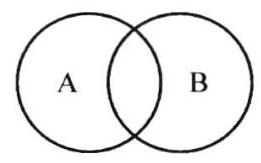
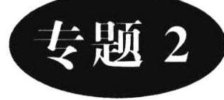

(2)描述法

把集合中元素的公共属性描述出来,写在大括号内,其模式为: $\{ x \mid  p\left( x\right) \}$ .

(3)图示法

用任意封闭曲线围成的图形表示集合. 图示法又称韦恩图法.

(4)字母、符号表示法

为了书写方便,规定以下几种常用的数集及其记法:

空集,记作 $\varnothing$ ;

自然数集 (或全体非负整数的集合),记作 $\mathbf{N}$ ;

正整数集,记作 ${\mathbf{N}}^{ * }$ (或 ${\mathbf{N}}_{ + }$ );

全体整数的集合通常简称为整数集,记作 $\mathbf{Z}$ ;

全体有理数的集合通常简称为有理数集,记作 $\mathbf{Q}$ ;

全体实数的集合通常简称为实数集,记作 $\mathbf{R}$ ;

全体复数的集合通常简称为复数集,记作 $\mathbf{C}$ .

## 3. 子集

(1)对于两个集合 $A$ 与 $B$ ,如果集合 $A$ 的任何一个元素都是集合 $B$ 的元素,那么 $A$ 称为 $B$ 的子集,记作 $A \subseteq  B$ (或 $B \supseteq  A$ ). 如果 $A$ 是 $B$ 的子集,且 $B$ 中至少有一个元素不属于 $A$ ,那么 $A$ 称为 $B$ 的真子集,记作 $A \subsetneqq  B$ .

(2)子集的性质

$A \subseteq  A;\varnothing  \subseteq  A;\varnothing  \subsetneq  A\left( {A \neq  \varnothing }\right)$ ;

若 $A \subseteq  B, B \subseteq  C$ ,则 $A \subseteq  C$ .

若 $A \subsetneqq  B, B \subseteq  C$ ,则集合 $A$ 与 $C$ 的关系怎样?

子集的个数: $n$ 元集有 ${2}^{n}$ 个子集; 有 ${2}^{n} - 1$ 个真子集; 有 ${2}^{n} - 1$ 个非空子集; 有 ${2}^{n} - 2$ 个非空真子集.

(3) $A \subseteq  B$ 且 $B \subseteq  A \Leftrightarrow  A = B$ .

4. 交集

(1)由所有属于集合 $A$ 且属于集合 $B$ 的元素组成的集合,叫做 $A$ 、 $B$ 的交集,记作 $A \cap  B$ ,即

$$
A \cap  B = \{ x \mid  x \in  A\text{,且 }x \in  B\} .
$$

(2)性质

$A \cap  A = A;A \cap  \varnothing  = \varnothing ;A \cap  B \subseteq  A;A \cap  B = B \cap  A;$

$A \cap  B = A \Leftrightarrow  A \subseteq  B$ .

## 5. 并集

(1)由所有属于集合 $A$ 或集合 $B$ 的元素所组成的集合叫做 $A$ 与 $B$ 的并集,记作 $A \cup$ $B$ ,即

$$
A \cup  B = \{ x \mid  x \in  A\text{ 或 }x \in  B\} .
$$

(2)性质

$A \cup  A = A;A \cup  \varnothing  = A;A \cup  B \supseteq  A;A \cup  B = B \cup  A;$

$A \cup  B = A \Leftrightarrow  B \subseteq  A$ .

6. 补集

(1)设全集为 $U$ ,集合 $A \subseteq  U$ ,则由 $U$ 中所有不属于 $A$ 的元素组成的集合,叫做集合 $A$ 在集合 $U$ 中的补集,记作 ${\complement }_{U}A$ ,即 ${\complement }_{U}A = \{ x \mid  x \in  U$ ,且 $x \notin  A\}$ .

(2)性质

$A \cup  {\complement }_{U}A = U;A \cap  {\complement }_{U}A = \varnothing ;{\complement }_{U}U = \varnothing ;{\complement }_{U}\varnothing  = U;{\complement }_{U}\left( {{\complement }_{U}A}\right)  = A.$

有时在运算时,还可用德·摩根运算律:

${\complement }_{U}\left( {A \cup  B}\right)  = \left( {{\complement }_{U}A}\right)  \cap  \left( {{\complement }_{U}B}\right)$ ;

${\complement }_{U}\left( {A \cap  B}\right)  = \left( {{\complement }_{U}A}\right)  \cup  \left( {{\complement }_{U}B}\right) .$

## 【分类举例】

例 1 判断下列四个集合是否为相等集合. $A = \left\{  {x \mid  y = {x}^{2} + 1}\right\}  ;B = \left\{  {y \mid  y = {x}^{2} + }\right.$ $1\} ;C = \left\{  {\left( {x, y}\right)  \mid  y = {x}^{2} + 1}\right\}  ;D = \left\{  {y = {x}^{2} + 1}\right\}$ .

解析 用描述法表示集合时,常把集合

写成如下形式: $\{ x \mid  x$ 具有公共属性 $P\}$ . 其中 $x$ 是“代表元”,这四个集合中前三个的代表元均不同. $A$ 为二次函数自变量 $x$ 的值的全体,即 $A = \mathbf{R};B$ 为二次函数值 $y$ 的全体,即 $B = \{ y \mid  y \geq  1\} ;C$ 为二次函数图象上所有点的全体组成的集合; 而 $D$ 为列举法表示,把二次函数 $y = {x}^{2} + 1$ 作为该集合元素,为单元素集. 故

这四个集合均为不同集合.

集合 $A = \{ x \mid  x > 1\}$ 与集合 $B = \{ y \mid  y > 1\}$ 是否为相同集合?

例 2 (2010・天津) 设集合 $A = \{ x\left| \right| x - a \mid   < 1, x \in  \mathbf{R}\} , B = \{ x\left| \right| x - b \mid   > 2$ , $x \in  \mathbf{R}\}$ . 若 $A \subseteq  B$ ,则实数 $a\text{、}b$ 必满足 (   ).

(A) $\left| {a + b}\right|  \leq  3$ (B) $\left| {a + b}\right|  \geq  3$

(C) $\left| {a - b}\right|  \leq  3$ (D) $\left| {a - b}\right|  \geq  3$

解析 由 $\left| {x - a}\right|  < 1$ 得, $- 1 < x - a < 1$ ,所以 $a - 1 < x < a + 1$ ,即 $A = (a - 1$ , 4 $a + 1)$ . 由 $\left| {x - 2}\right|  > 2$ 得, $x - b > 2$ 或 $x - b <  - 2$ ,所以 $x > b + 2$ 或 $x < b - 2$ ,即 $B =$ $\left( {b + 2, + \infty }\right)  \cup  \left( {-\infty , b - 2}\right)$ ,要使 $A \subseteq  B$ ,需 $b + 2 \leq  a - 1$ 或 $b - 2 \geq  a + 1$ .故

所以 $a - b \geq  3$ 或 $a - b \leq   - 3$ . 故 $\left| {a - b}\right|  \geq  3$ .
 
 

   选 D.
 

判断集合的关系及由子集关系确定参数的取值范围时. 要注意以下两个问题:①空集; ②端点.

例 3 (2009・江西) 已知全集 $U = A \cup  B$ 中有 $m$ 个元素, $\left( {{\complement }_{U}A}\right)  \cup  \left( {{\complement }_{U}B}\right)$ 中有 $n$ 个元素. 若 $A \cap  B$ 非空,则 $A \cap  B$ 的元素个数为 (   ).

(A) ${mn}$ (B) $m + n$ (C) $n - m$ (D) $m - n$

解析 由韦恩图不难得到, $\operatorname{card}\left( {A \cap  B}\right)  = \operatorname{card}\left( {A \cup  B}\right)  - \operatorname{card}\left\lbrack  {\left( {{\complement }_{U}A}\right)  \cup  \left( {{\complement }_{U}B}\right) }\right\rbrack   =$ $m - n$ . 故

选 D.

例 4 (2010・四川) 设 $S$ 为复数集 $\mathbf{C}$ 的非空子集. 若对任意 $x, y \in  S$ ,都有 $x + y, x -$ $y,{xy} \in  S$ ,则称 $S$ 的封闭集. 下列命题: ①集合 $S = \{ x\left| {x = }\right| a + {bi} \mid  , a, b$ 为整数, $i$ 为虚数单位\}为封闭集; ②若 $S$ 为封闭集,则一定有 $0 \in  S$ ; ③封闭集一定是无限集; ④若 $S$ 为封闭集,则满足 $S \subseteq  T \subseteq  \mathbf{C}$ 的任意集合 $T$ 也是封闭集. 其中真命题是_____.

解析 $S = \left\{  {x \mid  x = \sqrt{{a}^{2} + {b}^{2}}}\right\}$ ,即 $S$ 为整数开平方所得的非负数集,对 $x - y \in  S$ 不一定成立,故 ① 错；② 显然成立；如集合 $S = \{ 0\}$ ,满足 $x + y, x - y,{xy} \in  S$ 这三个条件, 但它为有限集,故 ③ 错误; 对于 ④,令 $S = \{ 0\} , T = \{ 0,1\}$ ,则 $S$ 是封闭集,且 $S \subseteq  T \subseteq$ C. 但 $0 - 1 =  - 1 \notin  T$ ,故 ④ 错误. 故

真命题为: ②.

例 5 (2006・湖南) 设函数 $f\left( x\right)  = \frac{x - a}{x - 1}$ ,集合 $M = \{ x \mid  f\left( x\right)  < 0\} , P = \{ x \mid$ $\left. {{f}^{\prime }\left( x\right)  > 0}\right\}$ ,若 $M \subsetneqq  P$ ,则实数 $a$ 的取值范围是 (   ).

(A) $\left( {-\infty ,1}\right)$ (B)(0,1)

(C) $\left( {1, + \infty }\right)$ (D) $\lbrack 1, + \infty )$

解析 设函数 $f\left( x\right)  = \frac{x - a}{x - 1}$ ,集合 $M = \{ x \mid  f\left( x\right)  < 0\}$ ,当 $a > 1$ 时, $M = \{ x \mid  1 <$ $x < a\}$ ; 当 $a < 1$ 时, $M = \{ x \mid  a < x < 1\}$ ; 当 $a = 1$ 时, $M = \varnothing$ ; 又因为 ${f}^{\prime }\left( x\right)  =$ $\frac{\left( {x - 1}\right)  - \left( {x - a}\right) }{{\left( x - 1\right) }^{2}} = \frac{a - 1}{{\left( x - 1\right) }^{2}} > 0$ ,所以当 $a > 1$ 时, $P = \{ x \mid  x \neq  1\} ;a \leq  1$ 时, $P = \varnothing$ . 因为 $M \subsetneqq  P$ ,

故选 C.

例 6 已知集合 $M = \left\{  {x \mid  {x}^{2} + {ax} + 1 = 0}\right\}  , N = \left\{  {x \mid  {x}^{2} - {3x} + 2 = 0}\right\}$ ,且 $M \cap$ $N = M$ ,求 $a$ 的取值范围.

解析 由 $M \cap  N = M$ 知, $M \subseteq  N$ . 因为 $N$ 为确定集合,所以应根据 $M \subseteq  N$ ,对 $M$ 的可能的情况进行分类讨论,其中 $M = \varnothing$ 不能忽略.

由 ${x}^{2} - {3x} + 2 = 0$ ,得 $x = 1$ 或 $x = 2$ ,所以 $N = \{ 1,2\}$ . 又由已知,得 $M \subseteq  N$ .

(1)若 $M = \varnothing$ ,即 ${x}^{2} + {ax} + 1 = 0$ 无实数解.

$\Delta  < 0$ ,此时 ${a}^{2} - 4 < 0$ ,即

$- 2 < a < 2$ 时,符合题意.

(2)若 $M \neq  \varnothing$ ,则 $M = \{ 1\}$ 或 $\{ 2\}$ 或 $\{ 1,2\}$ . 又 ${x}^{2} + {ax} + 1 = 0$ 的两根之积为 1,故 $M = \{ 1\}$ ,所以 ${x}^{2} + {ax} + 1 = 0$ 有两重根 1 . 所以 ${x}_{1} + {x}_{2} = 2 =  - a$ ,且满足 $\Delta  \geq  0$ . 综上所述: 

$- 2 \leq  a < 2$ .

$M$ 在 ${x}^{2} + {ax} + 1 = 0$ 有解的情况下,两根积为定值 1,为解题提供一条捷径.

例 7 (2006・全国 II) 设 $a \in  \mathbf{R}$ ,二次函数 $f\left( x\right)  = a{x}^{2} - {2x} - {2a}$ . 若 $f\left( x\right)  > 0$ 的解集为 $A, B = \{ x \mid  1 < x < 3\} , A \cap  B \neq  \varnothing$ ,求实数 $a$ 的取值范围.

解析 由 $f\left( x\right)$ 为二次函数知 $a \neq  0$ . 由 $f\left( x\right)  = a{x}^{2} - {2x} - {2a} = 0$ 知: $\Delta  = 4 + 8{a}^{2} >$ 0 . 则其两根为 ${x}_{1} = \frac{1}{a} - \sqrt{2 + \frac{1}{{a}^{2}}},{x}_{2} = \frac{1}{a} + \sqrt{2 + \frac{1}{{a}^{2}}}$ ,且易知 ${x}_{1} < 0,{x}_{2} > 0$ .

( 1 )当 $a > 0$ 时, $A = \left\{  {x \mid  x < {x}_{1}}\right\}   \cup  \left\{  {x \mid  x > {x}_{2}}\right\}  , A \cap  B \neq  \varnothing$ 的充要条件是 ${x}_{2} <$ 3,即 $\frac{1}{a} + \sqrt{2 + \frac{1}{{a}^{2}}} < 3$ ,解得 

$a > \frac{6}{7}$ .

(2)当 $a < 0$ 时, $A = \left\{  {x \mid  {x}_{1} < x < {x}_{2}}\right\}$ , $A \cap  B \neq  \varnothing$ 的充要条件是 ${x}_{2} > 1$ ,即 $\frac{1}{a} +$ $\sqrt{2 + \frac{1}{{a}^{2}}} > 1$ ,解得 $a <  - 2$ .

综上,使 $A \cap  B \neq  \varnothing$ 成立的 $a$ 的取值范围是 

$\left( {-\infty , - 2}\right)  \cup  \left( {\frac{6}{7}, + \infty }\right)$ .

## 基础训练

1. 已知集合 $A = \left\{  {\left( {x, y}\right)  \mid  y = {x}^{2}, x \in  \mathbf{R}}\right\}  , B = \{ \left( {x, y}\right)  \mid  y = \left| x\right| , x \in  \mathbf{R}\}$ ,则 $A \cap$ $B$ 中的元素个数为 (   ).

(A) 0 (B) 1 (C) 2 (D) 3

2. 设全集 $I = \left\{  {1,{2a} - 4,{a}^{2} - a - 3}\right\}  , A = \{ a - 1,1\} ,{\complement }_{I}A = \{ 3\}$ ,则 $a$ 的值为 (   ) .

(A) -2 (B) 3 (C) -2 或 3 (D) $\frac{7}{2}$

3. 已知集合 $A = \{ 2,3,4\} , B = \{ 2,4,6,8\} , C = \{ \left( {x, y}\right)  \mid  x \in  A, y \in  B$ ,且 $\left. {{\log }_{x}y \in  {\mathbf{N}}^{ * }}\right\}$ ,则 $C$ 中元素个数是 (   ).

(A) 9 (B) 8 (C) 3 (D) 4

4. 设集合 $S = \{ x\left| \right| x - 2 \mid   > 3\} , T = \{ x \mid  a < x < a + 8\} , S \cup  T = \mathbf{R}$ ,则 $a$ 的取值范围是(   ).

(A) $- 3 < a <  - 1$ (B) $- 3 \leq  a \leq   - 1$

(C) $a \leq   - 3$ 或 $a \geq   - 1$ (D) $a <  - 3$ 或 $a >  - 1$

5. 集合 $A = \{ y \mid  y = \lg x, x > 1\} , B = \{  - 2, - 1,1,2\}$ ,则下列结论中正确的是 (   ) .

(A) $A \cap  B = \{  - 2, - 1\}$ (B) $\left( {{\complement }_{\mathbf{R}}A}\right)  \cup  B = \left( {-\infty ,0}\right)$

(C) $A \cup  B = \left( {0, + \infty }\right)$ (D) $\left( {{\complement }_{\mathbf{R}}A}\right)  \cap  B = \{  - 2, - 1\}$

6. 已知函数 $f\left( x\right)  = {x}^{2} + x - 1$ ,集合 $M = \{ x \mid  x = f\left( x\right) \} , N = \{ y \mid  y = f\left( x\right) \}$ ,则 (   ).

(A) $M = N$ (B) $M \supsetneqq  N$ (C) $M \cap  N = \varnothing$ (D) $M \subsetneqq  N$

7. 已知 $P = \{ \overrightarrow{a} \mid  \overrightarrow{a} = \left( {1,0}\right)  + m\left( {0,1}\right) , m \in  \mathbf{R}\} , Q = \{ \overrightarrow{b} \mid  \overrightarrow{b} = \left( {1,1}\right)  + n\left( {-1,1}\right)$ , $n \in  \mathbf{R}\}$ ,是两个向量集合,则 $P \cap  Q =$ (   ).

(A) $\{ \left( {1,1}\right) \}$ (B) $\{ \left( {-1,1}\right) \}$ (C) $\{ \left( {1,0}\right) \}$ (D) $\{ \left( {0,1}\right) \}$

8. 设集合 $M = \left\{  {x\left| {\;x = \frac{k}{2} + \frac{1}{4}}\right. , k \in  \mathbf{Z}}\right\}  , N = \left\{  {x\left| {\;x = \frac{k}{4} + \frac{1}{2}}\right. , k \in  \mathbf{Z}}\right\}$ ,则(   ).

(A) $M = N$ (B) $M \subsetneqq  N$ (C) $M \subseteq  N$ (D) $M \cap  N = \varnothing$

9. 定义集合运算: $A * B = \{ z \mid  z = {xy}, x \in  A, y \in  B\}$ 设 $A = \{ 1,2\} , B = \{ 0,2\}$ ,则集合 $A * B$ 的所有元素之和为 (   ).

(A) 0 (B) 2 (C) 3 (D) 6

10. 

已知集合 $A = \left\{  {1,{2}^{a}}\right\}  , B = \{ a, b\}$ ,若 $A \cap  B = \left\{  \frac{1}{2}\right\}$ ,则 $A \cup  B$ 为_____.

11. 

已知集合 $A = \left\{  {a, b,2}\right\}  , B = \left\{  {2,{b}^{2},{2a}}\right\}$ ,且 $A \cap  B = A \cup  B$ ,则 $a =$ _____.

12. 设 $P = \left\{  {x \mid  {12} + x - {x}^{2} \geq  0}\right\}  , Q = \{ x \mid  m - 1 \leq  x \leq  {3m} - 2\}$ . 若 $Q \subseteq  P$ ,求实数 $m$ 的取值范围.

## 能力提高

13. 实数 $a\text{、}b$ 满足 $a > b > 0$ ,集合 $M = \left\{  {x\left| {\;b < x < \frac{a + b}{2}}\right. }\right\}  , N = \{ x \mid  \sqrt{ab} < x < a\}$ , 则集合 $\{ x \mid  b < x \leq  \sqrt{ab}\}$ 可表示为(   ).

(A) $M \cup  N$ (B) $M \cap  N$ (C) ${\complement }_{\mathrm{R}}M \cap  N$ (D) $M \cap  {\complement }_{\mathrm{R}}N$

14. 已知 $S = \{ 1,2,\cdots ,{2010}\} , A \subseteq  S$ 且 $A$ 中有三个元素,若 $A$ 中的元素可构成等差数列,则这样的集合 $A$ 共有(   ).

(A) ${\mathrm{C}}_{2010}^{3}$ 个 (B) ${\mathrm{A}}_{2010}^{3}$ 个 (C) $2{\mathrm{\;A}}_{1005}^{2}$ 个 (D) $2{\mathrm{C}}_{1005}^{2}$ 个

15. 对任意两个集合 $M\text{、}N$ ,定义 $M - N = \{ x \mid  x \in  M$ 且 $x \notin  N\} , M * N = \left( {M - N}\right)  \cup$ (N - M),设 $M = \left\{  {y \mid  y = {x}^{2}, x \in  \mathbf{R}}\right\}  , N = \{ y \mid  y = 3\sin x, x \in  \mathbf{R}\}$ 则 $M * N =$ (   ).

(A) $\left( {-\infty , - 3}\right)  \cup  (0,3\rbrack$ (B) $\lbrack  - 3,0) \cup  \left( {3, + \infty }\right)$

(C) $\left( {-3,0}\right)  \cup  \left( {3, + \infty }\right)$ (D) $\lbrack  - 3,0) \cup  \lbrack 3, + \infty )$

16. 定义: 设 $A$ 是非空实数集合,若 $\exists a \in  A$ ,使得对于 $\forall x \in  A$ ,都有 $x \leq  a\left( {x \geq  a}\right)$ ,则称 $a$ 是 $A$ 的最大 (小) 值. 若 $B$ 是一个不含零的非空实数集合,且 ${a}_{0}$ 是 $B$ 的最大值,则 (   ).

(A) 当 ${a}_{0} > 0$ 时, ${a}_{0}^{-1}$ 是集合 $\left\{  {{x}^{-1} \mid  x \in  B}\right\}$ 的最小值

(B) 当 ${a}_{0} > 0$ 时, ${a}_{0}^{-1}$ 是集合 $\left\{  {{x}^{-1} \mid  x \in  B}\right\}$ 的最大值

(C) 当 ${a}_{0} < 0$ 时, $- {a}_{0}^{-1}$ 是集合 $\left\{  {-{x}^{-1} \mid  x \in  B}\right\}$ 的最小值

(D) 当 ${a}_{0} < 0$ 时, $- {a}_{0}^{-1}$ 是集合 $\left\{  {-{x}^{-1} \mid  x \in  B}\right\}$ 的最大值

17. 

已知集合 $A = \left\{  {x \mid  {\log }_{2}x \leq  2}\right\}  , B = \left( {-\infty , a}\right)$ ,若 $A \subseteq  B$ ,则实数 $a$ 的取值范围是 $(c$ , $+ \infty )$ ,其中 $c =$ _____.

18. 已知集合 $A = \left\{  {x \mid  {x}^{2} - {ax} + {a}^{2} - {19} = 0}\right\}  , B = \left\{  {x \mid  {x}^{2} - {5x} + 6 = 0}\right\}  , C = \left\{  {x \mid  {x}^{2} + }\right.$ ${2x} - 8 = 0\}$ ,是否存在实数 $a$ ,使得 $A \cap  C = \varnothing ,\varnothing  \subsetneq  A \cap  B$ 同时成立?若存在,求出 $a$ 值; 若不存在,说明理由.

##

## 简易逻辑

## 【知识梳理】

逻辑是研究思维形式及其规律的一门学科,在学习数学的过程中,全面理解概念,正确进行表述、判断和推理都离不开逻辑知识, 因此它是我们认识问题、研究问题不可缺少的工具.

## 1. 逻辑连接词

(1)命题 可以判断真假的语句叫做命题.

(2)逻辑连接词 “或”、“且”、“非”这些词叫做逻辑连接词.

(3)简单命题 不含逻辑连接词的命题叫做简单命题.

(4)复合命题 由简单命题与逻辑连接词构成的命题叫做复合命题,复合命题由“ $p$ 且 $q$ ”、“ $p$ 或 $q$ ”或“非 $p$ ”构成.

简单命题常用小写拉丁字母 $p, q, r, s,\cdots$ 表示.

(5)判断复合命题的真假, 可用下表表示.

<table><tr><td>$p$</td><td>$q$</td><td>非 $p$</td><td>$p$ 或 $q$</td><td>$p$ 且 $q$</td></tr><tr><td>真</td><td>真</td><td>假</td><td>真</td><td>真</td></tr><tr><td>真</td><td>假</td><td>假</td><td>真</td><td>假</td></tr><tr><td>假</td><td>真</td><td>真</td><td>真</td><td>假</td></tr><tr><td>假</td><td>假</td><td>真</td><td>假</td><td>假</td></tr></table>

## 2. 四种命题

(1)四种命题

一般地,用 $p$ 和 $q$ 分别表示原命题的条件和结论,用 $\neg p$ 和 $\neg q$ 分别表示 $p$ 和 $q$ 的否命题. 于是四种命题的形式为:

原命题 若 $p$ 则 $q$ ;

逆命题 若 $q$ 则 $p$ ;

否命题 若 $\neg p$ 则 $\neg q$ ;

逆否命题 若 $\neg q$ 则 $\neg p$ .

(2)四种命题的关系

① 原命题 $\Leftrightarrow$ 逆否命题,它们之间存在逆否关系,且具有相同的真假性.

② 逆命题 $\Leftrightarrow$ 否命题,它们之间也互为逆否关系,且具有相同的真假性.

③ 原命题与逆命题、否命题的真假之间无一定联系,如原命题为真,则其逆命题与否命题未必为真. 思考: 你能指出否命题与命题的否定两者的区别吗? 并举例说明.

(3)反证法

① 用反证法证明命题的一般步骤为:

a. 假设命题的结论不成立,即假设命题结论的反面成立；

b. 从这个假设出发, 经过推理论证得出矛盾;

c. 由矛盾判断假设不正确, 从而肯定命题的结论正确.

思考: 你能说出推出矛盾可能出现的几种情况吗?

② 可用反证法证明的几种类型:

a. 结论本身是以否定形式出现的命题;

b. 有关结论是以“至多……”或“至少……”的形式出现的命题；

c. 有关唯一性、存在性的问题;

d. 结论的反面是比原结论更具体、更容易研究的命题.

思考:“至多……”,“至少……”,“都是”的否定形式是什么？

(4)充分条件和必要条件

① 命题 $A \Rightarrow  B$ 成立,则称:

$A$ 是 $B$ 的充分条件;

$B$ 是 $A$ 的必要条件;

$A$ 的必要条件是 $B$ ;

$B$ 的充分条件是 $A$ .

② 若 $A \Rightarrow  B$ 且 $B \Rightarrow  A$ ,则称 $A$ 是 $B$ 的充分且必要条件,简称充要条件,记作 $A \Leftrightarrow  B$ .

③ 若 $A \Rightarrow  B, B \Rightarrow  A$ ,称 $A$ 是 $B$ 的充分而不必要条件.

点击: 你能说出一些与充要条件同义的词语吗? 如: “当且仅当”, “必须且只需”等.

④ 判断所给命题的条件是结论成立的什么条件是常见的一类题型,解决这类问题的常用方法有:

a. 定义法 判断 $B$ 是 $A$ 什么条件,实际上就是判断 $B \Rightarrow  A$ 或 $A \Rightarrow  B$ 是否成立,只要 10 把题目中所给条件按逻辑关系画出箭头示意图,再利用定义即可判断.

b. 转换法 当所给命题的充要条件不易判定时, 可对命题进行等价转换, 例如改用其逆否命题进行判断.

c. 集合法 在命题的条件和结论间的关系判断有困难时, 有时可从集合的角度来考虑,记条件 $p\text{、}q$ 对应的集合分别为 $A\text{、}B$ ,则:

若 $A \subseteq  B$ ,则 $p$ 是 $q$ 的充分条件;

若 $A \subsetneqq  B$ ,则 $p$ 是 $q$ 的充分非必要条件;

若 $A = B$ ,则 $p, q$ 互为充要条件;

若 $A \nsubseteq  B$ 且 $B \nsubseteq  A$ ,则 $p$ 是 $q$ 的既非充分也非必要条件.

## 【分类举例】

例 1 判断下列语句是不是命题,若是,判断其真假；若不是,请说明理由.

(1)正方形是平行四边形吗？

(2)求证 $x \in  \mathbf{R}$ ,方程 ${x}^{2} + x + 1 = 0$ 无实根；

(3)大角所对的边大于小角所对的边；

(4)一个数不是合数就是质数；

(5) ${x}^{2} + {2x} - 3 > 0$ ;

(6) $5 \geq  5$ .

点击: 开语句、祈使句、疑问句、感叹句都不是命题.

解析 判断某一语句是不是命题,应从命题的定义出发,即看其可否判断真假.

(1)不是命题,因为它并没有对结论作出判断.

(2)不是命题,它为祈使句.

(3)是假命题,若在两个不同的三角形中,大角与小角与边之间无必然联系.

(4)是假命题,数 1 既不是质数也不是合数.

(5)不是命题,因为语句中含有变量 $x$ ,在不给定变量的范围之前,无法判断语句的真假.

(6)是命题. 且为真命题.

第(5)小题含变量的语句也叫开语句.

例 2 已知 $p$ : 方程 ${x}^{2} + {mx} + 1 = 0$ 有两个不等的负根; $q$ : 方程 $4{x}^{2} + 4\left( {m - 2}\right)  + 1 =$ 0 无实根,若 $p$ 或 $q$ 为真, $p$ 且 $q$ 为假,求实数 $m$ 的取值范围.

解析 由简单命题的真假可根据真值表来判断复合命题的真假, 反过来, 复合命题的真假亦可断定构成复合命题的简单命题真假的可能情况. 点击: 若“ $p$ 或 $q$ 为真”,则可判断有“ $p\text{、}q$ 中一真一假”及“ $p\text{、}q$ 均为真”两种情况. 又“ $p$ 且 $q$ 为假”,则 $p\text{、}q$ 必为一真一假.

若方程 ${x}^{2} + {mx} + 1 = 0$ 有两个不等的负根,则

$$
\left\{  \begin{array}{l} \Delta  = {m}^{2} - 4 > 0, \\  m > 0, \end{array}\right.
$$

解不等式组,得 $m > 2$ . 即 $p : m > 2$ .

若方程: $4{x}^{2} + 4\left( {m - 2}\right) x + 1 = 0$ 无实根,则

$$
\Delta  = {16}{\left( m - 2\right) }^{2} - {16} < 0,
$$

解不等式得 $1 < m < 3$ . 即 $q : 1 < m < 3$ .

由已知可判定 $p\text{、}q$ 为一真一假两命题,即: $p$ 真 $q$ 假,或 $p$ 假 $q$ 真两种情况. 故:

$$
\left\{  {\begin{array}{l} m > 2, \\  m \leq  1\text{ 或 }m \geq  3; \end{array}\text{ 或 }\left\{  \begin{array}{l} m \leq  2, \\  1 < m < 3. \end{array}\right. }\right.
$$

故 

$m$ 的取值范围为 $m \geq  3$ 或 $1 < m \leq  2$ .

例 3 写出以下原命题的逆命题、否命题、逆否命题,并判断其真假.

(1)若 $x = 3$ 或 $x = 7$ ,则 ${x}^{2} - {10x} + {21} = 0$ ；

(2)若 $m < 0$ ,则关于 $x$ 的方程 ${x}^{2} + x + m = 0$ 有实根.

解析 写出一个命题的逆命题、否命题及逆否命题的关键是正确找出原命题的大前提、条件和结论, 然后依照定义来写. 判断命题的真假可用互为逆否的两命题同真同假来判断.

点击: 逆命题与否命题亦是互为逆否命题, 它们同真或同假.

(1)逆命题:若 ${x}^{2} - {10x} + {21} = 0$ ,则 $x = 3$ 或 $x = 7$ . (真命题)

否命题: 若 $x \neq  3$ 且 $x \neq  7$ ,则 ${x}^{2} - {10x} + {21} \neq  0$ . (真命题)

逆否命题: 若 ${x}^{2} - {10x} + {21} \neq  0$ ,则 $x \neq  3$ 且 $x \neq  7$ . (真命题)

(2)逆命题:若关于 $x$ 的方程 ${x}^{2} + x + m = 0$ 有实根,则 $m < 0$ . (假命题)

否命题: 若 $m \geq  0$ ,则关于 $x$ 的方程 ${x}^{2} + x + m = 0$ 没有实根. (假命题)

逆否命题: 若关于 $x$ 的方程 ${x}^{2} + x + m = 0$ 没有实根,则 $m \geq  0$ . (真命题)

点击: $x = 3$ 或 $x = 7$ 的否定为: $x \neq  3$ 且 $x \neq  7$ ,这可借助集合思想来理解: ${\complement }_{I}\left( {A \cup  B}\right)  =$ $\left( {{\complement }_{I}A}\right)  \cap  \left( {{\complement }_{I}B}\right)$

例 4 (2010・北京) $\overrightarrow{a}$ 、 $\overrightarrow{b}$ 为非零向量. “ $\overrightarrow{a} \bot  \overrightarrow{b}$ ” 是“函数 $f\left( x\right)  = \left( {x\overrightarrow{a} + \overrightarrow{b}}\right)  \cdot  \left( {x\overrightarrow{b} - \overrightarrow{a}}\right)$ 为一次函数” 的(   ).