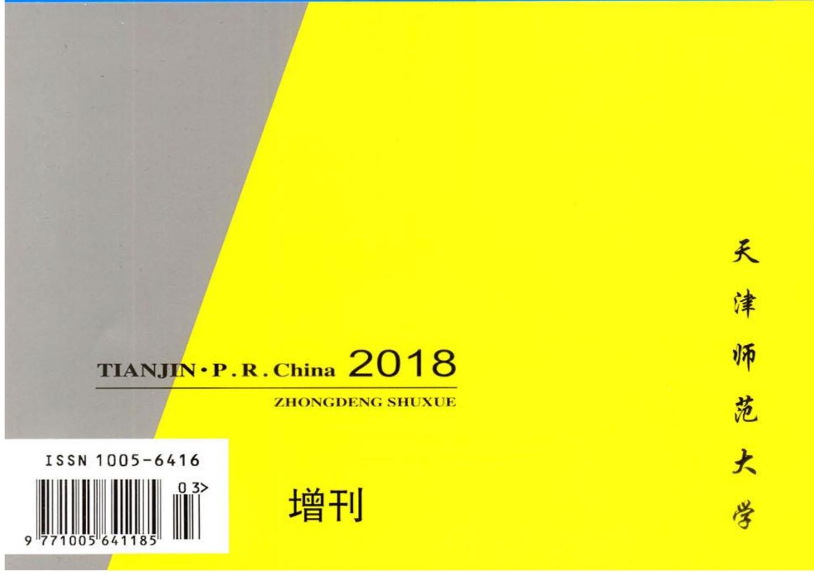
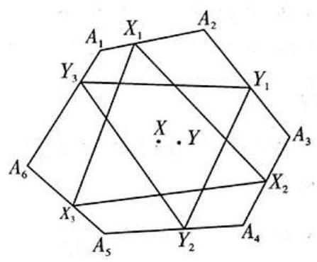
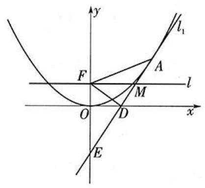
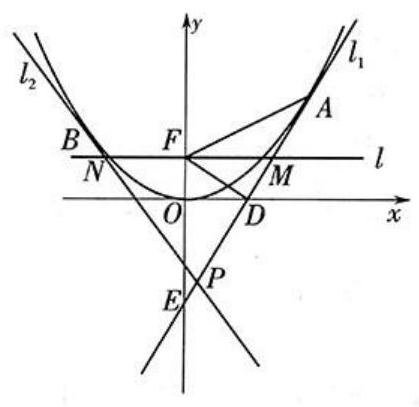

# 2018年3月 中等数学

High-School Mathematics

## 质心姐姐陪你学数竞:

1、关注【数学联赛】微信公众号

这里有数学联赛和自主招生的一切!联赛真题/模拟题/夏令营资讯/数学家八卦/科技前沿/答疑/

资料分享。要什么有什么,数学竞赛党一起来嗨！ 人 微信搜一搜

Q 数学联赛

2、更多干货资料分享尽在【质心数学竞赛交流群】 QQ群:978517821

3、质心数学免费知识点视频,线上直播课,请戳这个网站,记得添加到收藏夹哦

https://www.eduzhixin.com/?subject = math#publicize

学竞赛 到质心

## 致 读 者

数学奥林匹克试题是人类智慧的结晶,体现着精深的数学内容、独到的数学思想和方法。 数学奥林匹克资料的搜集、整理与传播, 对于加强奥林匹克数学命题工作的研究, 推动数学奥林匹克活动的普及、健康、深入地发展,是一件很有意义和价值的工作。

全国高中数学联赛是我国一项重要赛事。为帮助学生更好地准备全国高中联赛,也为向辅导教师提供更多的辅导资料,我编辑部连续多年出版了《全国高中数学联赛模拟题集萃》 (简称“专刊”)。专刊一经出版,深受读者的欢迎,并希望我们能够坚持办下去。应读者要求, 今年我们继续邀请了全国二十二个省市的一线教练员严格按照联赛大纲和新标准编拟了 22 套模拟题,呈现给读者。

参与本专刊编拟的作者有:李宝毅、潘铁(天津),陶平生(江西),王建伟(安徽),刘利益 (黑龙江),王久成(吉林),张雷、缠祥瑞(辽宁),张端阳(北京),江涛、雷勇(河北),王永喜(山西),刘康宁、杨运新(陕西),张锐、张甲(河南),龚红戈(山东),黄志军(江苏),赵斌(浙江), 唐立华(上海),龚梅勇、曹仁剑(福建),徐伟、代鹏(广东),苏林、张湘君、汤礼达(湖南),陈春 (湖北),肖志良(四川),宋晓宇(重庆),高维宗(甘肃)。

在此, 向他们表示由衷的感谢!

在专刊的编辑过程中,由于水平有限,加之时间紧迫,我们的工作难免有不当或疏漏之处, 欢迎广大读者指正。对于读者提出的有代表性的问题,我们将在《中等数学》上予以发表。

本专辑中出现的数学符号说明

1. $\left\lbrack  x\right\rbrack  \text{、}\lfloor x\rfloor$ 表示不超过实数 $x$ 的最大整数, $\lceil x\rceil$ 表示不小于实数 $x$ 的最小整数, $\{ x\}  = x - \left\lbrack  x\right\rbrack$

2. $\left| A\right|$ 表示有限集合 $A$ 的元素个数

3. $\left\lbrack  {a, b}\right\rbrack$ 表示正整数 $a$ 与 $b$ 的最小公倍数,(a, b)表示正整数 $a$ 与 $b$ 的最大公因数

4. $\mathbf{Z} \rightarrow$ 整数集 $\mathbf{N} \rightarrow$ 自然数集 $\mathbf{Q} \rightarrow$ 有理数集 $\mathbf{R} \rightarrow$ 实数集 $\mathbf{C} \rightarrow$ 复数集

5. 二表示轮换对称和, $\Pi$ 表示轮换对称积本册责任编辑 娄姗姗

<table><tr><td>中等数学 ZHONGDENG SHUXUE校区</td><td>主 编 李 发 地 址</td><td>编辑出版 中等数学编辑部 天津市西青区宾水西道 393 号:天津师范大学主</td></tr><tr><td>月刊</td><td>邮 编 印刷</td><td>300387 天津印艺通制版印刷有限责任公司</td></tr><tr><td>1982 年 11 月创刊</td><td>刊号</td><td>ISSN 1005 - 6416 CN 12 - 1121/01</td></tr><tr><td>主管单位 天津市教育委员会 主 办 天 津 师 范 大 学 天津市数学学会 协 办 中国数学会普及工作委员会</td><td>国外发行 国外代号 国内发行 零售订阅 发行代号</td><td>中国国际图书贸易总公司 BM 5102 天津市邮局 全国各地邮局 6 – 75 28.00 元</td></tr></table>

## 目 次

全国高中数学联赛模拟题 (1) 李宝毅 潘 铁(2) 中等数学

全国高中数学联赛模拟题(2) 陶平生( 11 ) High-School Mathematics

全国高中数学联赛模拟题(3) 王建伟(18) 2018 年增刊 (2018 年 3 月上旬出版)

全国高中数学联赛模拟题(4) 刘利益(24)

全国高中数学联赛模拟题(5) 王久成( 31 ) 主 编 李 炘

全国高中数学联赛模拟题(6) 张雷 缠祥瑞(37) 副 主 编 娄姗姗名誉编委(按姓氏笔画为序)

全国高中数学联赛模拟题(7) 张端阳( 44 ) 申 铁 杨亦君 苏 淳

全国高中数学联赛模拟题 (8) 江 涛 雷 勇(50) 李成章 李学武 李新暖 吴振奎 陈传理 庞宗昱

全国高中数学联赛模拟题(9) 王永喜( 55 ) 黄玉民 裘宗沪

全国高中数学联赛模拟题 (10) 刘康宁 杨运新(61) 编 委(按姓氏笔画为序) 丁龙云 王 浩 王延文

全国高中数学联赛模拟题 (11) 张锐张甲( 67 ) 冯志刚 冯祖鸣 朱华伟孙 力 刘诗雄 刘金英

全国高中数学联赛模拟题 (12) 龚红戈(72) 李 军 李 明 李 炘

全国高中数学联赛模拟题 (13) 黄志军( 77 ) 李 涛 李 赛 李伟固李宝毅 李建泉 李胜宏

全国高中数学联赛模拟题 (14) 赵斌(84) 吴建平 余红兵 冷岗松

全国高中数学联赛模拟题 (15) 宋宝莹 张 明 陈永高 唐立华(88) 段华贵 娄姗姗 姚一隽

全国高中数学联赛模拟题 (16) 龚梅勇 曹仁剑(93) 梁应德 梁哲云 熊 斌潘铁

全国高中数学联赛模拟题 (17) 徐 伟 代 鹏(99) 编辑部主任 王彦明

全国高中数学联赛模拟题 (18) 苏 林 张湘君 汤礼达(105) 编辑部电话 022-23540118

发行部电话 022-23542233

全国高中数学联赛模拟题 (19) 陈 春(110) 15822631163

全国高中数学联赛模拟题 (20) 肖志良(116) E-mail zdsxlx@ 163. com

全国高中数学联赛模拟题 (21) 宋晓宁(123)

全国高中数学联赛模拟题(22) 高维宗(131)

# 全国高中数学联赛模拟题(1)

李宝毅 ${}^{1}$ 潘 铁 ${}^{2}$

(1. 天津师范大学数学科学学院, 300387 2. 天津市实验中学, 300074)

## 第一试

## 一、填空题 (每小题 8 分, 共 64 分)

1. 设函数 $f\left( x\right)$ 的定义域为 $\mathbf{R}$ ,满足

$f\left( {x + 1}\right)  + f\left( x\right)  = 0$ .①

当 $x \in  \left( {0,1}\right)$ 时,

$f\left( x\right)  = \mathrm{e} - {\mathrm{e}}^{x}.$②

则 $f\left( {\ln {2018}}\right)  =$ _____.

2. 在钝角 $\bigtriangleup {ABC}$ 中, $\angle C > {90}^{ \circ  }$ ,三个内角 $\angle A\text{、}\angle B\text{、}\angle C$ 所对的边 $a\text{、}b\text{、}c$ 成等比数列. 则 $\frac{\sin A + \cos A \cdot  \tan C}{\sin B + \cos B \cdot  \tan C}$ 的取值范围是 _____.

3. 在抛物线 $y = a{x}^{2}\left( {a > 0}\right)$ 的上方,与该抛物线相切于顶点的圆面积的最大值为 _____.

4. 已知正三棱锥 $M - {ABC}$ 的底面是边长为 1 的正 $\bigtriangleup {ABC},{MA} = {MB} = {MC} = \frac{\sqrt{2}}{2}$ ,球心为 $M$ 的球与底面 ${ABC}$ 相切. 则球在正三棱锥内部的体积为_____.

5. 设非负实数 ${x}_{1},{x}_{2},\cdots ,{x}_{12}$ 满足 $\mathop{\sum }\limits_{{i = 1}}^{{12}}{x}_{i} = 1$ . 则 $S = \mathop{\sum }\limits_{{i = 1}}^{9}{x}_{i}{x}_{i + 1}{x}_{i + 2}{x}_{i + 3}$ 的最大值为_____.

6. 设 ${P}_{1}\text{、}{P}_{2}$ 为复平面上的两个点集,

${P}_{1} = \{ z \in  \mathbf{C} \mid  z\bar{z} + 3\left( {\bar{z} - z}\right) \mathrm{i} + m = 0, m \in  \mathbf{R}\} ,$

${P}_{2} = \left\{  {\omega  \in  \mathbf{C} \mid  \omega  = {2z}\mathrm{i}, z \in  {P}_{1}}\right\}  .$

当 ${P}_{1} \cap  {P}_{2} = \varnothing$ 时,实数 $m$ 的取值范围是 _____.

7. 已知两个盒子中均装有红、黑两色且形状相同的小球, 两个盒子中的小球总数为 25 , 每次随机地从两个盒子中各取一个球. 若所取出的两个球均为黑色的概率是 $\frac{27}{50}$ ,则所取出的两球均为红球的概率是_____.

8. 已知边长为 1 的正 $\bigtriangleup {ABC}$ 的边 ${BC}$ 上有 2018 等分点,沿点 $B$ 到点 $C$ 的方向,依次为 ${P}_{1},{P}_{2},\cdots ,{P}_{2017}$ . 若

${S}_{n} = \overrightarrow{AB} \cdot  \overrightarrow{A{P}_{1}} + \overrightarrow{A{P}_{1}} \cdot  \overrightarrow{A{P}_{2}} + \cdots  + \overrightarrow{A{P}_{2017}} \cdot  \overrightarrow{AC},$ 则 ${S}_{n} =$ _____.

## 二、解答题(56 分)

9. (16 分) 数列 $\left\{  {a}_{n}\right\}$ 满足:

${a}_{1} = 0$ ,

${a}_{n} = \mathop{\max }\limits_{{1 \leq  i \leq  n - 1}}\left\{  {i + {a}_{i} + {a}_{n - i}}\right\}  .$

求数列 $\left\{  {a}_{n}\right\}$ 的通项公式.

10. (20 分) 求实数 $a$ 的取值范围,使得

$\sin {2\theta } + \left( {2\sqrt{2} + \sqrt{2}a}\right) \sin \left( {\theta  - \frac{\pi }{4}}\right)  -$

$\frac{2\sqrt{2}}{\cos \left( {\theta  + \frac{\pi }{4}}\right) }$

$< {2a} + 3\left( {\theta  \in  \left\lbrack  {\frac{\pi }{2},\pi }\right\rbrack  }\right)$ .

11. (20 分) 设抛物线 $C : {x}^{2} = {2py}\left( {p > 0}\right)$ 的焦点为 $F$ ,抛物线 $C$ 上一点 $A$ 的横坐标为 ${x}_{1}\left( {{x}_{1} > 0}\right)$ ,过点 $A$ 作抛物线 $C$ 的切线 ${l}_{1}$ ,与 $x$ 轴交于点 $D$ ,与 $y$ 轴交于点 $E$ ,与直线 $l : y = \frac{p}{2}$ 交于点 $M$ . 当 $\left| {FD}\right|  = 2$ 时, $\angle {AFD} = {60}^{ \circ  }$ .

(1)证明: $\bigtriangleup {AFE}$ 为等腰三角形;

(2)求抛物线 $C$ 的方程；

(3)若 $B$ 为 $y$ 轴左侧抛物线 $C$ 上一点, 过 $B$ 作抛物线 $C$ 的切线 ${l}_{2}$ ,与直线 ${l}_{1}$ 交于点 $P$ ,与直线 $l$ 交于点 $N$ ,求 $\bigtriangleup {PMN}$ 面积的最小值,并求取到最小值时 ${x}_{1}$ 的值.

## 加试

一、(40 分) 设数列 $\left\{  {x}_{n}\right\}$ 满足:

${x}_{1} = 1,{x}_{n + 1} = 4{x}_{n} + \left\lbrack  {{x}_{n}\sqrt{11}}\right\rbrack$ .

求 ${x}_{2018}$ 的个位数码.

二、(40 分) 设 $n \in  {\mathbf{Z}}_{ + }$ . 证明: $\left\lbrack  {n - 4\sqrt{n}}\right.$ , $n + 4\sqrt{n}\rbrack$ 内存在可以表示为两个正整数的立方和的形式的正整数 $k$ .

三、(50 分) 如图 1,凸六边形 ${A}_{1}{A}_{2}{A}_{3}{A}_{4}{A}_{5}{A}_{6}$ 满足 ${A}_{1}{A}_{2} = {A}_{3}{A}_{4} = {A}_{5}{A}_{6},{A}_{2}{A}_{3} = {A}_{4}{A}_{5} = {A}_{6}{A}_{1}$ , 点 $X\text{、}Y$ 在凸六边形内部,且 $X$ 与 $Y$ 不重合, 点 $X$ 在 ${A}_{1}{A}_{2}\text{、}{A}_{3}{A}_{4}\text{、}{A}_{5}{A}_{6}$ 上的投影分别为 ${X}_{1}$ 、 ${X}_{2}\text{、}{X}_{3}$ ,点 $Y$ 在 ${A}_{2}{A}_{3}\text{、}{A}_{4}{A}_{5}\text{、}{A}_{6}{A}_{1}$ 上的投影分别为 ${Y}_{1}\text{、}{Y}_{2}\text{、}{Y}_{3}$ ,且满足 $X{X}_{1} = X{X}_{2} = X{X}_{3}, Y{Y}_{1}$ $= Y{Y}_{2} = Y{Y}_{3}$ . 设 $\bigtriangleup {X}_{1}{X}_{2}{X}_{3}\text{、}\bigtriangleup {Y}_{1}{Y}_{2}{Y}_{3}$ 的欧拉线分别为 ${l}_{1}\text{、}{l}_{2}$ . 证明: ${l}_{1}//{l}_{2}$ .

图 1

四、(50 分) 设 $\{ 1,2,\cdots , n\}$ 的子集 $X$ 满足: 对任意给定的 $a\text{、}b \in  X$ ,若 $\frac{a + b}{2} \in  \mathbf{Z}$ ,则 $\frac{a + b}{2} \in  X$ ,此时,称子集 $X$ 是 “好的”. 记 $A\left( n\right)$ 为 $\{ 1,2,\cdots , n\}$ 的好子集的个数. 例如, $A\left( 3\right)  = 7,\{ 1,2,3\}$ 的八个子集中只有 $\{ 1,3\}$ 不是好的. 计算

$$
A\left( {2018}\right)  - {2A}\left( {2017}\right)  + A\left( {2106}\right)
$$

的值.

## 参考答案  第一试

$- {1.} - \mathrm{e} + {2018}{\mathrm{e}}^{-7}$ .

由 $f\left( {x + 1}\right)  + f\left( x\right)  = 0$

$\Rightarrow  f\left( {x + 2}\right)  + f\left( {x + 1}\right)  = 0$

$\Rightarrow  f\left( {x + 2}\right)  = f\left( x\right)$

$\Rightarrow  f\left( x\right)$ 是周期为 2 的函数.

注意到, $\lg {2018} = 3 + \lg {2.018} \approx  {3.3}$ ,

$\lg \mathrm{e} \approx  {0.4343}$ .

故 $\left\lbrack  \frac{\lg {2018}}{\lg \mathrm{e}}\right\rbrack   = 7$

$\Rightarrow  7 < \frac{\lg {2018}}{\lg \mathrm{e}} < 8$

$\Rightarrow  7 < \ln {2018} < 8$

$\Rightarrow  0 < \ln {2018} - 7 < 1$ .

由于 $f\left( {x + 1}\right)  + f\left( x\right)  = 0$ ,于是,

$$
f\left( {\ln {2018} - 6}\right)  + f\left( {\ln {2018} - 7}\right)  = 0
$$

$$
\Rightarrow  f\left( {\ln {2018} - 6}\right)  =  - f\left( {\ln {2018} - 7}\right)
$$

$$
=  - \left( {\mathrm{e} - {\mathrm{e}}^{\ln {2018} - 7}}\right)  =  - \mathrm{e} + {2018}{\mathrm{e}}^{-7}
$$

$\Rightarrow  f\left( {\ln {2018}}\right)  = f\left( {\ln {2018} - 6}\right)$

$$
=  - \mathrm{e} + {2018}{\mathrm{e}}^{-7}\text{.}
$$

2. $\left( {\sqrt{\frac{1 + \sqrt{5}}{2}},\frac{1 + \sqrt{5}}{2}}\right)$ .

由已知可设 $b = {aq}, c = a{q}^{2}\left( {q > 1}\right)$ . 则

$$
\frac{\sin A + \cos A \cdot  \tan C}{\sin B + \cos B \cdot  \tan C}
$$

$$
= \frac{\sin A \cdot  \cos C + \cos A \cdot  \sin C}{\sin B \cdot  \cos C + \cos B \cdot  \sin C}
$$

$$
= \frac{\sin \left( {A + C}\right) }{\sin \left( {B + C}\right) } = \frac{\sin B}{\sin A} = q,
$$

且 $\left\{  \begin{array}{l} a + {aq} > a{q}^{2}, \\  {a}^{2} + {a}^{2}{q}^{2} < {a}^{2}{q}^{4}, \\  q > 1. \end{array}\right.$

故 $\left\{  \begin{array}{l} {q}^{2} - q - 1 < 0, \\  {q}^{4} - {q}^{2} - 1 > 0 \end{array}\right.$

$$
\Rightarrow  \sqrt{\frac{1 + \sqrt{5}}{2}} < q < \frac{1 + \sqrt{5}}{2}\text{.}
$$

$$
\text{3.}\frac{\pi }{4{a}^{2}}\text{.}
$$

设该圆的半径为 $r, P\left( {x, y}\right)$ 为抛物线上任意一点. 则在 $y \in  \lbrack 0, + \infty )$ 上恒有

$$
\sqrt{{x}^{2} + {\left( y - r\right) }^{2}} \geq  r
$$

$$
\Rightarrow  \frac{y}{a} + {y}^{2} - {2ry} + {r}^{2} \geq  {r}^{2}
$$

$$
\Rightarrow  y\left( {y - \left( {{2r} - \frac{1}{a}}\right) }\right)  \geq  0
$$

$$
\Rightarrow  {2r} - \frac{1}{a} \leq  0 \Rightarrow  r \leq  \frac{1}{2a}\text{.}
$$

从而,圆面积的最大值为 $\frac{\pi }{4{a}^{2}}$ .

4. $\frac{\sqrt{6}\pi }{216}$ .

设正三棱锥底面中心为 $O$ . 则

${MO} \bot$ 面 ${ABC} \Rightarrow  {MO} \bot  {OA}$ .

由于底面边长为 1 , 于是,

$$
{OA} = \frac{\sqrt{3}}{3},{AM} = \frac{\sqrt{2}}{2}
$$

$$
\Rightarrow  {OM} = \sqrt{\frac{1}{2} - \frac{1}{3}} = \frac{\sqrt{6}}{6}\text{.}
$$

注意到, ${MA}\text{、}{MB}\text{、}{MC}$ 两两垂直.

则球在正三棱锥内部的体积为球体积的 $\frac{1}{8}$ .

故 $V = \frac{1}{8}{V}_{\text{球 }} = \frac{1}{8} \cdot  \frac{4\pi }{3}{\left( \frac{\sqrt{6}}{6}\right) }^{3} = \frac{\sqrt{6}\pi }{216}$ .

5. $\frac{1}{256}$ .

注意到,

$$
S = \mathop{\sum }\limits_{{i = 1}}^{9}{x}_{i}{x}_{i + 1}{x}_{i + 2}{x}_{i + 3}
$$

$$
\leq  \left( {{x}_{1} + {x}_{5} + {x}_{9}}\right) \left( {{x}_{2} + {x}_{6} + {x}_{10}}\right)  \cdot
$$

$$
\left( {{x}_{3} + {x}_{7} + {x}_{11}}\right) \left( {{x}_{4} + {x}_{8} + {x}_{12}}\right)
$$

$$
\leq  {\left( \frac{1}{4}\mathop{\sum }\limits_{{i = 1}}^{{12}}{x}_{i}\right) }^{2} = \frac{1}{256}\text{.}
$$

6. $\left( {-\infty , - {36}}\right)  \cup  \left( {4, + \infty }\right)$ .

设 $z \in  {P}_{1}$ . 则

$$
z\bar{z} + 3\left( {z - \bar{z}}\right) \mathrm{i} + m = 0
$$

$$
\Rightarrow  \left( {z + 3\mathrm{i}}\right) \left( {\bar{z} - 3\mathrm{i}}\right)  = 9 - m
$$

$$
\Rightarrow  \left( {z + 3\mathrm{i}}\right) \left( \overline{z + 3\mathrm{i}}\right)  = 9 - m
$$

$$
\Rightarrow  {\left| z + 3\mathrm{i}\right| }^{2} = 9 - m\text{.}
$$

当 $m > 9$ 时, ${P}_{1} = \varnothing ,{P}_{1} \cap  {P}_{2} = \varnothing$ .

下设 $m \leq  9$ ,此时, ${P}_{1}$ 表示复平面上圆心为(0, - 3)、半径为 $\sqrt{9 - m}$ 的圆.

设 $\omega  \in  {P}_{2}$ . 则

$$
\omega  = {2z}\mathrm{i}\left( {z \in  {P}_{1}}\right)  \Rightarrow  z = \frac{\omega }{2\mathrm{i}}
$$

$$
\Rightarrow  {\left| \frac{\omega }{2\mathrm{i}} + 3\mathrm{i}\right| }^{2} = 9 - m
$$

$$
\Rightarrow  {\left| \omega  - 6\right| }^{2} = {36} - {4m}\text{.}
$$

故 ${P}_{2}$ 表示复平面上圆心为(6,0)、半径为 $2\sqrt{9 - m}$ 的圆.

又两圆的圆心距为 $3\sqrt{5}$ ,若 ${P}_{1} \cap  {P}_{2} =$ $\varnothing$ ,则

$$
\left| {{r}_{1} + {r}_{2}}\right|  = 3\sqrt{9 - m} < 3\sqrt{5},
$$

或 $\left| {{r}_{1} - {r}_{2}}\right|  = \sqrt{9 - m} > 3\sqrt{5}$ .

因此, $m \in  \left( {-\infty , - {36}}\right)  \cup  (4,9\rbrack$ .

综上, $m \in  \left( {-\infty , - {36}}\right)  \cup  \left( {4, + \infty }\right)$ .

7. $\frac{1}{25}$ .

记从两个盒子中取得黑球分别为事件 $A$ 与事件 $B$ . 则

$$
P\left( {A \cdot  B}\right)  = P\left( A\right)  \cdot  P\left( B\right)  = \frac{27}{50}.
$$

设一个盒子内有 $n\left( {n \leq  {12}}\right)$ 个球,其中有 $a$ 个黑球,另一个盒子内有 ${25} - n$ 个球,其中有 $b$ 个黑球. 则

$$
P\left( {A \cdot  B}\right)  = P\left( A\right)  \cdot  P\left( B\right)  = \frac{a}{n} \cdot  \frac{b}{{25} - n} = \frac{27}{50}
$$

$$
\Rightarrow  {50ab} = {27n}\left( {{25} - n}\right)
$$

$$
\Rightarrow  {50}\left| {n\left( {{25} - n}\right)  \Rightarrow  5}\right| n\text{.}
$$

故 $n = {10}, a = b = 9;n = 5, a = 3, b = {18}$ .

当 $n = {10}, a = b = 9$ 时,

$$
P\left( {\bar{A} \cdot  \bar{B}}\right)  = P\left( \bar{A}\right)  \cdot  P\left( \bar{B}\right)
$$

$$
= \left( {1 - P\left( A\right) }\right) \left( {1 - P\left( B\right) }\right)
$$

$$
= \frac{1}{10} \times  \frac{6}{15} = \frac{1}{25}\text{;}
$$

当 $n = 5, a = 3, b = {18}$ 时,

$P\left( {\bar{A} \cdot  \bar{B}}\right)  = P\left( \bar{A}\right)  \cdot  P\left( \bar{B}\right)$

$= \left( {1 - P\left( A\right) }\right) \left( {1 - P\left( B\right) }\right)$

$= \frac{2}{5} \times  \frac{2}{20} = \frac{1}{25}$ .

故所取出的两球均为红球的概率是 $\frac{1}{25}$ .

8. $\frac{3393603}{2018}$ .

考虑一般情形.

由 $\overrightarrow{A{P}_{k}} = \overrightarrow{AB} + \overrightarrow{B{P}_{k}} = \overrightarrow{AB} + \frac{k}{n}\overrightarrow{BC}$

$= \overrightarrow{AB} + \frac{k}{n}\left( {\overrightarrow{BA} + \overrightarrow{AC}}\right)$

$= \left( {1 - \frac{k}{n}}\right) \overrightarrow{AB} + \frac{k}{n}\overrightarrow{AC}\left( {k = 0,1,\cdots , n}\right)$ ,

则 $\overrightarrow{A{P}_{k - 1}} \cdot  \overrightarrow{A{P}_{k}}$

$$
= \left( {\left( {1 - \frac{k - 1}{n}}\right) \overrightarrow{AB} + \frac{k - 1}{n}\overrightarrow{AC}}\right) \left( {\left( {1 - \frac{k}{n}}\right) \overrightarrow{AB} + \frac{k}{n}\overrightarrow{AC}}\right)
$$

$= \left( {1 - \frac{k - 1}{n}}\right) \left( {1 - \frac{k}{n}}\right) {\left| \overrightarrow{AB}\right| }^{2} + \frac{k - 1}{n} \cdot  \frac{k}{n}{\left| \overrightarrow{AC}\right| }^{2} +$

$\left( {\left( {1 - \frac{k - 1}{n}}\right) \frac{k}{n} + \left( {1 - \frac{k}{n}}\right) \frac{k - 1}{n}}\right) \overrightarrow{AB} \cdot  \overrightarrow{AC}$

$= \left( {1 - \frac{k - 1}{n}}\right) \left( {1 - \frac{k}{n}}\right)  + \frac{k - 1}{n} \cdot  \frac{k}{n} +$

$\frac{1}{2}\left( {\left( {1 - \frac{k - 1}{n}}\right) \frac{k}{n} + \left( {1 - \frac{k}{n}}\right) \frac{k - 1}{n}}\right)$

$= 1 - \frac{{2k} - 1}{2n} + \frac{k\left( {k - 1}\right) }{{n}^{2}}$ .

故 ${S}_{n} = \mathop{\sum }\limits_{{k = 1}}^{n}\left( {1 - \frac{{2k} - 1}{2n} + \frac{{k}^{2} - k}{{n}^{2}}}\right)$

$= n - \frac{1}{2n}\mathop{\sum }\limits_{{k = 1}}^{n}\left( {{2k} - 1}\right)  + \frac{1}{{n}^{2}}\left( {\mathop{\sum }\limits_{{k = 1}}^{n}{k}^{2} - \mathop{\sum }\limits_{{k = 1}}^{n}k}\right)$

$= n - \frac{{n}^{2}}{2n} + \frac{\frac{n\left( {n + 1}\right) \left( {{2n} + 1}\right) }{6} - \frac{n\left( {n + 1}\right) }{2}}{{n}^{2}}$

$$
= n - \frac{n}{2} + \frac{\left( {n + 1}\right) \left( {{2n} + 1}\right)  - 3\left( {n + 1}\right) }{6n}
$$

$$
= \frac{n}{2} + \frac{{n}^{2} - 1}{3n} = \frac{5{n}^{2} - 2}{6n}\text{.}
$$

当 $n = {2018}$ 时,原式 $= \frac{3393603}{2018}$ .

## 二、9. 注意到,

${a}_{2} = 1 + {a}_{1} + {a}_{1} = 1,$

${a}_{3} = \max \left\{  {1 + {a}_{1} + {a}_{2},2 + {a}_{2} + {a}_{1}}\right\}   = 3,$

${a}_{4} = \max \left\{  {1 + {a}_{1} + {a}_{3},2 + {a}_{2} + {a}_{2},3 + {a}_{3} + {a}_{1}}\right\}$

$= 6$ ,

${a}_{5} = \max \left\{  {1 + {a}_{1} + {a}_{4},2 + {a}_{2} + {a}_{3},3 + {a}_{3} + }\right.$

$$
\left. {{a}_{2},4 + {a}_{4} + {a}_{1}}\right\}
$$

$= {10}$ .

猜想: ${a}_{n} = \frac{n\left( {n - 1}\right) }{2}$ .

用第二数学归纳法证明.

当 $n = 1$ 时, ${a}_{1} = \frac{1\left( {1 - 1}\right) }{2} = 0$ .

假设 $n \leq  k$ 时, ${a}_{n} = \frac{n\left( {n - 1}\right) }{2}$ .

则 $n = k + 1$ 时,

${a}_{k + 1} = \mathop{\max }\limits_{{1 \leq  i \leq  k}}\left\{  {i + {a}_{i} + {a}_{k + 1 - i}}\right\}$

$= \mathop{\max }\limits_{{1 \leq  i \leq  k}}\left\{  {i + \frac{i\left( {i - 1}\right) }{2} + \frac{\left( {k + 1 - i}\right) \left( {k - i}\right) }{2}}\right\}$

$= \mathop{\max }\limits_{{1 \leq  i \leq  k}}\left\{  {{i}^{2} - {ki} + \frac{k\left( {k + 1}\right) }{2}}\right\}$

$= \mathop{\max }\limits_{{1 \leq  i \leq  k}}\{ i\left( {i - k}\right) \}  + \frac{k\left( {k + 1}\right) }{2}$ .

因为 $1 \leq  i \leq  k$ ,所以,

$\mathop{\max }\limits_{{1 \leq  i \leq  k}}\{ i\left( {i - k}\right) \}  \leq  0.$

故 ${a}_{k + 1} = \frac{k\left( {k + 1}\right) }{2} = \frac{\left( {k + 1}\right) \left( {\left( {k + 1}\right)  - 1}\right) }{2}$ .

因此,命题成立.

10. 设 $x = \sin \theta  - \cos \theta ,\theta  \in  \left\lbrack  {\frac{\pi }{2},\pi }\right\rbrack$ . 则

$x = \sqrt{2}\sin \left( {\theta  - \frac{\pi }{4}}\right)  \in  \left\lbrack  {1,\sqrt{2}}\right\rbrack  .$

由 $\sin {2\theta } = 1 - {x}^{2}$ ,

$$
- \cos \left( {\theta  + \frac{\pi }{4}}\right)  = \sin \left( {\theta  - \frac{\pi }{4}}\right)  = \frac{x}{\sqrt{2}},
$$

知原不等式可化为

$$
1 - {x}^{2} + \left( {2\sqrt{2} + \sqrt{2}a}\right) \frac{x}{\sqrt{2}} + \frac{4}{x} < {2a} + 3
$$

$\Rightarrow  {x}^{2} + {2a} + 2 - \left( {2 + a}\right) x - \frac{4}{x} > 0$

$\Rightarrow  \left( {x - 2}\right) \left( {x + \frac{2}{x} - a}\right)  > 0$ .

由于 $x \in  \left\lbrack  {1,\sqrt{2}}\right\rbrack$ ,于是, $x - 2 < 0$ .

从而, $x + \frac{2}{x} < a$ .

令 $f\left( x\right)  = x + \frac{2}{x}$ .

易知, $f\left( x\right)$ 在区间 $\left\lbrack  {1,\sqrt{2}}\right\rbrack$ 上单调递减.

故 ${f}_{\max }\left( x\right)  = f\left( 1\right)  = 3 \Rightarrow  a \in  \left( {3, + \infty }\right)$ .

11. (1) 如图 2 .

图 2

注意到,抛物线 $C : {x}^{2} = {2py}\left( {p > 0}\right)$ 上以点 $A\left( {{x}_{1},\frac{{x}_{1}^{2}}{2p}}\right)$ 为切点的切线方程为

${l}_{1} : {x}_{1}x = {2p}\left( \frac{y + \frac{{x}_{1}^{2}}{2p}}{2}\right)$

$\Rightarrow  {x}_{1}x - {py} - \frac{{x}_{1}^{2}}{2} = 0$ .①

易知, $E\left( {0, - \frac{{x}_{1}^{2}}{2p}}\right) , F\left( {0,\frac{p}{2}}\right)$ .

于是, $\left| {EF}\right|  = \frac{{x}_{1}^{2}}{2p} + \frac{p}{2}$ .

又抛物线 $C$ 的准线方程为 $y =  - \frac{p}{2}$ ,则

$$
\left| {FA}\right|  = \frac{{x}_{1}^{2}}{2p} + \frac{p}{2}.
$$

故 $\bigtriangleup {AFE}$ 为等腰三角形.

(2) 由于 ${y}_{A} + {y}_{E} = 0$ ,于是, ${AD} = {DE}$ .

又因为 ${EF} = {FA}$ ,所以, ${FD} \bot  {AE}$ .

当 $\left| {FD}\right|  = 2$ 时, $\angle {AFD} = {60}^{ \circ  }$ ,此时,

$\angle {FDO} = {30}^{ \circ  },\left| {OF}\right|  = 1$ .

则抛物线 $C : {x}^{2} = {4y}$ .

( 3 )如图 3,设 $B\left( {{x}_{2},\frac{{x}_{2}^{2}}{2p}}\right) \left( {{x}_{2} < 0}\right)$ .

图 3

则以 $B$ 为切点的切线方程为

${l}_{2} : {x}_{2}x = {2p}\left( \frac{y + \frac{{x}_{2}^{2}}{2p}}{2}\right)$

$$
\Rightarrow  {x}_{2}x - {py} - \frac{{x}_{2}^{2}}{2} = 0\text{.}
$$

②

联立式①、②得

$$
{x}_{2}x - \frac{{x}_{2}^{2}}{2} = {x}_{1}x - \frac{{x}_{1}^{2}}{2}
$$

$$
\Rightarrow  \left( {{x}_{1} + {x}_{2} - {2x}}\right) \left( {{x}_{1} - {x}_{2}}\right)  = 0
$$

$\Rightarrow  {x}_{P} = \frac{{x}_{1} + {x}_{2}}{2},{y}_{P} = \frac{{x}_{1}{x}_{2}}{4}$ .

令 $y = 1$ ,得

$M\left( {\frac{{x}_{1}}{2} + \frac{2}{{x}_{1}},1}\right) , N\left( {\frac{{x}_{2}}{2} + \frac{2}{{x}_{2}},1}\right)$ .

则 $\left| {MN}\right|  = \left( {\frac{{x}_{1}}{2} + \frac{2}{{x}_{1}}}\right)  - \left( {\frac{{x}_{2}}{2} + \frac{2}{{x}_{2}}}\right)$ .

又点 $P$ 到 ${MN}$ 的距离 $d = 1 - \frac{{x}_{1}{x}_{2}}{4}$ ,故

$$
{S}_{\bigtriangleup {PMN}} = \frac{1}{2}\left| {MN}\right| \left( {1 - \frac{{x}_{1}{x}_{2}}{4}}\right)
$$

$$
= \frac{1}{4}\left( {{x}_{1} - {x}_{2}}\right) \left( {2 - \frac{4}{{x}_{1}{x}_{2}} - \frac{{x}_{1}{x}_{2}}{4}}\right) \text{.}
$$

设 ${l}_{AB} : y = {kx} + b\left( {b \geq  0}\right)$ . 则

$$
\left\{  {\begin{array}{l} y = {kx} + b, \\  {x}^{2} = {4y} \end{array} \Rightarrow  {x}^{2} - {4kx} - {4b} = 0.}\right.
$$

由韦达定理得

$$
\left\{  \begin{array}{l} {x}_{1} + {x}_{2} = {4k}, \\  {x}_{1}{x}_{2} =  - {4b} \end{array}\right.
$$

$\Rightarrow  \left| {{x}_{1} - {x}_{2}}\right|  = \sqrt{{\left( {x}_{1} + {x}_{2}\right) }^{2} - 4{x}_{1}{x}_{2}}$

$$
= 4\sqrt{{k}^{2} + b}\text{.}
$$

故 ${S}_{\bigtriangleup {PMN}} = \frac{1}{2}\left| {MN}\right| \left( {1 - \frac{{x}_{1}{x}_{2}}{4}}\right)$

$= \frac{1}{4}\left( {{x}_{1} - {x}_{2}}\right) \left( {2 - \frac{4}{{x}_{1}{x}_{2}} - \frac{{x}_{1}{x}_{2}}{4}}\right)$

$= \sqrt{{k}^{2} + b}\left( {2 + b + \frac{1}{b}}\right)$

$\geq  2\sqrt{b} + \frac{1}{\sqrt{b}} + b\sqrt{b}$ .

设 $t = \sqrt{b}, t \in  \lbrack 0, + \infty )$ ,记

$f\left( t\right)  = {t}^{3} + {2t} + \frac{1}{t}.$

则 ${f}^{\prime }\left( t\right)  = 3{t}^{2} - \frac{1}{{t}^{2}} + 2$ .

令 ${f}^{\prime }\left( t\right)  = 0$ ,得

${t}^{2} = \frac{1}{3} \Rightarrow  t = \frac{\sqrt{3}}{3}$ .

分类讨论情形如表 1 .

表 1

<table><tr><td>$t$</td><td>$\left\lbrack  {0,\frac{\sqrt{3}}{3}}\right)$</td><td>$\frac{\sqrt{3}}{3}$</td><td>$\left( {\frac{\sqrt{3}}{3}, + \infty }\right)$</td></tr><tr><td>${f}^{\prime }\left( t\right)$</td><td><0</td><td>0</td><td>$> 0$</td></tr><tr><td>$f\left( t\right)$</td><td>↘</td><td>极小值</td><td>↗</td></tr></table>

故 ${S}_{\bigtriangleup {PMN}} \geq  \frac{2\sqrt{3}}{3} + \sqrt{3} + \frac{\sqrt{3}}{9} = \frac{{16}\sqrt{3}}{9}$ .

当且仅当 $k = 0, b = \frac{1}{3}$ 时, $\bigtriangleup {PMN}$ 面积最小, 此时,

$$
\frac{{x}_{1}^{2}}{4} = \frac{1}{3} \Rightarrow  {x}_{1} = \frac{2\sqrt{3}}{3}\text{.}
$$

## 加 试

一、易知, ${x}_{2} = 7$ ,且对任意正整数 $n,{x}_{n}$ 为正整数.

由高斯函数性质得

$4{x}_{n} + {x}_{n}\sqrt{11} > {x}_{n + 1} = 4{x}_{n} + \left\lbrack  {{x}_{n}\sqrt{11}}\right\rbrack$

$> 4{x}_{n} + {x}_{n}\sqrt{11} - 1$ .

上式乘以 $4 - \sqrt{11}$ 得

$5{x}_{n} > \left( {4 - \sqrt{11}}\right) {x}_{n + 1} > 5{x}_{n} - \left( {4 - \sqrt{11}}\right)$

$\Rightarrow  4{x}_{n + 1} - 5{x}_{n} < {x}_{n + 1}\sqrt{11}$

$< 4{x}_{n + 1} - 5{x}_{n} + \left( {4 - \sqrt{11}}\right)$

$\Rightarrow  \left\lbrack  {{x}_{n + 1}\sqrt{11}}\right\rbrack   = 4{x}_{n + 1} - 5{x}_{n}$ .

故 ${x}_{n + 2} = 4{x}_{n + 1} + \left\lbrack  {{x}_{n + 1}\sqrt{11}}\right\rbrack$

$= 4{x}_{n + 1} + \left( {4{x}_{n + 1} - 5{x}_{n}}\right)  = 8{x}_{n + 1} - 5{x}_{n}.$

显然, ${x}_{n + 2} \equiv  {x}_{n}\left( {\;\operatorname{mod}\;2}\right)$ ,

${x}_{n + 2} \equiv  3{x}_{n + 1}\left( {\;\operatorname{mod}\;5}\right)$ .

结合 ${x}_{1} = 1,{x}_{2} = 7$ ,利用第二数学归纳法易证明: 对任意正整数 $n$ ,

$$
{x}_{n} \equiv  1\left( {\;\operatorname{mod}\;2}\right) \text{.}
$$

结合 ${x}_{2} = 7$ ,利用第一数学归纳法易证明: 对任意不小于 2 的正整数 $n$ ,

${x}_{n} \equiv  2 \times  {3}^{n - 2}\left( {\;\operatorname{mod}\;5}\right)$ .

利用 ${x}_{2018} \equiv  1\left( {\;\operatorname{mod}\;2}\right)$ ,

${x}_{2018} \equiv  2 \times  {3}^{2016}\left( {\;\operatorname{mod}\;5}\right)  \equiv  2\left( {\;\operatorname{mod}\;5}\right) ,$ 可得 ${x}_{2018}$ 的个位数字为 7 .

二、注意到,当 $1 \leq  n \leq  {16}$ 时,

$n - 4\sqrt{n} \leq  0, n + 4\sqrt{n} \geq  5$ .

因此, $k = 2 = {1}^{3} + {1}^{3}$ 符合题意.

接下来不妨设 $n \geq  {17}$ .

设 $A = \left\lbrack  \sqrt[3]{n}\right\rbrack  , a = \left\{  \sqrt[3]{n}\right\}$ . 则

$A = \sqrt[3]{n} - a \Rightarrow  {A}^{3} = {\left( \sqrt[3]{n} - a\right) }^{3}.$

显然, ${A}^{3} \leq  n < n + 4\sqrt{n}$ .

若 ${A}^{3} \geq  n - 4\sqrt{n}$ ,取 $k = {A}^{3} + {1}^{3}$ ,符合题意.

下面假设 ${A}^{3} < n - 4\sqrt{n}$ ,且 $\lbrack n - 4\sqrt{n}$ , $n + 4\sqrt{n}\rbrack$ 内不存在可以表示成两个正立方数