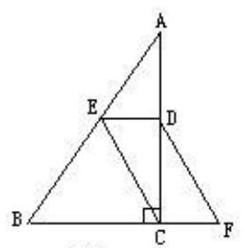
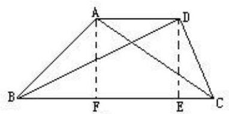
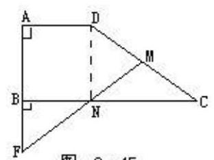
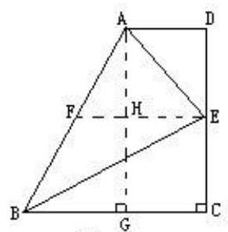
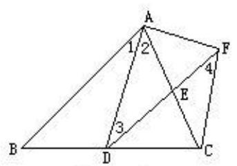
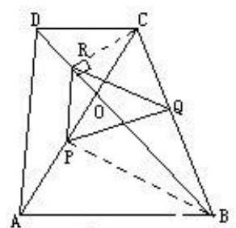
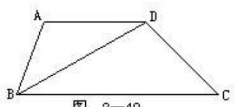
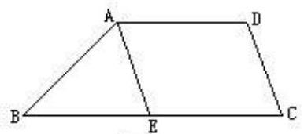
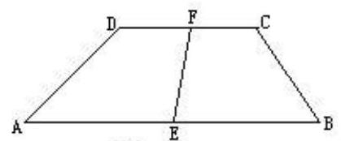
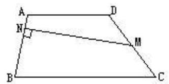

## 第十三讲 梯形

与平行四边形一样, 梯形也是一种特殊的四边形, 其中等腰梯形与直角梯形占有重要地位, 本讲就来研究它们的有关性质的应用.

例 1 如图 2-43 所示. 在直角三角形 ABC 中, E 是斜边 AB 上的中点, D 是 AC 的中点, DF // EC 交 BC 延长线于 F. 求证:四边形 EBFD 是等腰梯形.

图 2-43

分析 因为 $\mathrm{E},\mathrm{D}$ 是三角形 $\mathrm{{ABC}}$ 边 $\mathrm{{AB}},\mathrm{{AC}}$ 的中点,所以 $\mathrm{{ED}}//\mathrm{{BF}}$ . 此外, 还要证明(1)EB=DF; (2)EB不平行于 DF.

证 因为 $\mathrm{E},\mathrm{D}$ 是 $\bigtriangleup  \mathrm{{ABC}}$ 的边 $\mathrm{{AB}},\mathrm{{AC}}$ 的中点,所以

ED//BF.

又已知 $\mathrm{{DF}}//\mathrm{{EC}}$ ,所以 $\mathrm{{ECFD}}$ 是平行四边形,所以

$\mathrm{{EC}} = \mathrm{{DF}}.\;$ ①

又 $\mathrm{E}$ 是 $\mathrm{{Rt}} \bigtriangleup  \mathrm{{ABC}}$ 斜边 $\mathrm{{AB}}$ 上的中点,所以

$\mathrm{{EC}} = \mathrm{{EB}}$ . ②

由①, ②

$\mathrm{{EB}} = \mathrm{{DF}}$ .

下面证明 $\mathrm{{EB}}$ 与 $\mathrm{{DF}}$ 不平行.

若 $\mathrm{{EB}}//\mathrm{{DF}}$ ,由于 $\mathrm{{EC}}//\mathrm{{DF}}$ ,所以有 $\mathrm{{EC}}//\mathrm{{EB}}$ ,这与 $\mathrm{{EC}}$ 与 $\mathrm{{EB}}$ 交于 $\mathrm{E}$ 矛盾,所以 $\mathrm{{EB}}$ 双 $\mathrm{{DF}}$ .

根据定义, EBFD 是等腰梯形.

例 2 如图 2-44 所示. ABCD 是梯形, AD//BC, AD < BC, AB=AC 且 $\mathrm{{AB}} \bot  \mathrm{{AC}}$ , $\mathrm{{BD}} = \mathrm{{BC}}$ , $\mathrm{{AC}}$ , $\mathrm{{BD}}$ 交于 $\mathrm{O}$ . 求 $\angle \mathrm{{BCD}}$ 的度数.

图 2-44

分析 由于 $\bigtriangleup  \mathrm{{BCD}}$ 是等腰三角形,若能确定顶点 $\angle \mathrm{{CBD}}$ 的度数,则底角 $\angle \mathrm{{BCD}}$ 可求. 由等腰 Rt $\bigtriangleup  \mathrm{{ABC}}$ 可求知斜边 BC(即 BD)的长. 又梯形的高, 即 $\mathrm{{Rt}} \bigtriangleup  \mathrm{{ABC}}$ 斜边上的中线也可求出. 通过添辅助线可构造直角三角形, 求出 $\angle \mathrm{{BCD}}$ 的度数.

解 过 $\mathrm{D}$ 作 $\mathrm{{DE}}\bot \mathrm{{EC}}$ 于 $\mathrm{E}$ ,则 $\mathrm{{DE}}$ 的长度即为等腰 Rt $\bigtriangleup \mathrm{{ABC}}$ 斜边上的高 $\mathrm{{AF}}$ . 设 $\mathrm{{AB}} = \mathrm{a}$ ,由于 $\bigtriangleup  \mathrm{{ABF}}$ 也是等腰直角三角形,由勾股定理知

$$
{\mathrm{{AF}}}^{2} + {\mathrm{{BF}}}^{2} = {\mathrm{{AB}}}^{2}\text{,}
$$

即

$$
2{\mathrm{{AF}}}^{2} = {\mathrm{a}}^{2}\left( {\mathrm{{AF}} = \mathrm{{BF}}}\right) ,{\mathrm{{AF}}}^{2} = \frac{{\mathrm{a}}^{2}}{2},
$$

所以 $D{E}^{2} = \frac{{a}^{2}}{2}$ .

又

$$
{\mathrm{{BC}}}^{2} = {\mathrm{{AB}}}^{2} + {\mathrm{{AC}}}^{2} = 2{\mathrm{{AB}}}^{2} = 2{\mathrm{a}}^{2},
$$

由于 $\mathrm{{BC}} = \mathrm{{DB}}$ ,所以,在 $\mathrm{{Rt}} \bigtriangleup  \mathrm{{BED}}$ 中,

$$
\frac{{\mathrm{{DE}}}^{2}}{{\mathrm{{DB}}}^{2}} = \frac{{\mathrm{{DE}}}^{2}}{{\mathrm{{BC}}}^{2}} = \frac{\frac{{\mathrm{a}}^{2}}{2}}{2{\mathrm{a}}^{2}} = \frac{1}{4},
$$

所以 $\frac{DE}{DB} = \frac{1}{2}$

从而 $\angle {EBD} = {30}^{ \circ  }$ (直角三角形中 ${30}^{ \circ  }$ 角的对边等于斜边一半定理的逆定理). 在 $\bigtriangleup \mathrm{{CBD}}$ 中,

$$
\angle \mathrm{{BCD}} = \frac{1}{2}\left( {{180}^{ \circ  } - \angle \mathrm{{EBD}}}\right)  = {75}^{ \circ  }.
$$

例 3 如图 2-45 所示. 直角梯形 ABCD 中, AD//BC,∠A=90°,∠ $\mathrm{{ADC}} = {135}^{ \circ  },\mathrm{{CD}}$ 的垂直平分线交 $\mathrm{{BC}}$ 于 $\mathrm{N}$ ,交 $\mathrm{{AB}}$ 延长线于 $\mathrm{F}$ ,垂足为 $\mathrm{M}$ . 求证: $\mathrm{{AD}} = \mathrm{{BF}}$ .

图 2-45

分析 MF 是 DC 的垂直平分线,所以 ND=NC. 由 AD//BC 及 C ADC=135°知,∠C=45°,从而∠NDC=45°,∠DNC=90°,所以 ABND 是矩形,进而推知 $\bigtriangleup \mathrm{{BFN}}$ 是等腰直角三角形,从而 $\mathrm{{AD}} = \mathrm{{BN}} = \mathrm{{BF}}$ .

证 连接 DN. 因为 N 是线段 DC 的垂直平分线 MF 上的一点,所以 $\mathrm{{ND}} = \mathrm{{NC}}$ . 由已知, $\mathrm{{AD}}//\mathrm{{BC}}$ 及 $\angle \mathrm{{ADC}} = {135}^{ \circ  }$ 知

$$
\angle \mathrm{C} = {45}^{ \circ  }\text{,}
$$

从而

$$
\angle \mathrm{{NDC}} = {45}^{ \circ  }\text{.}
$$

在 $\bigtriangleup \mathrm{{NDC}}$ 中,

$$
\angle \mathrm{{DNC}} = {90}^{ \circ  }\left( { = \angle \mathrm{{DNB}}}\right) \text{,}
$$

所以 ABND 是矩形,所以

$$
\mathrm{{AF}}//\mathrm{{ND}},\angle \mathrm{F} = \angle \mathrm{{DNM}} = {45}^{ \circ  }\text{.}
$$

$\bigtriangleup \mathrm{{BNF}}$ 是一个含有锐角 ${45}^{ \circ  }$ 的直角三角形,所以 $\mathrm{{BN}} = \mathrm{{BF}}$ . 又

$$
\mathrm{{AD}} = \mathrm{{BN}}\text{,}
$$

所以 $\mathrm{{AD}} = \mathrm{{BF}}$ .

例 4 如图 2-46 所示. 直角梯形 ABCD 中, $\angle C = {90}^{ \circ  }$ , AD//BC, ${AD} + {BC} = {AB}, E$ 是 ${CD}$ 的中点. 若 ${AD} = 2,{BC} = 8$ ,求 $\bigtriangleup  {ABE}$ 的面积.

图 2-46

分析 由于 $\mathrm{{AB}} = \mathrm{{AD}} + \mathrm{{BC}}$ ,即一腰 $\mathrm{{AB}}$ 的长等于两底长之和,它启发我们利用梯形的中位线性质(这个性质在教材中是梯形的重要性质, 我们将在下一讲中深入研究它,这里只引用它的结论). 取腰 $\mathrm{{AB}}$ 的中点 $\mathrm{F}$ ,

连接EF. 由梯形中位线性质知: $\mathrm{{EF}} = \frac{1}{2}\left( {\mathrm{{AD}} + \mathrm{{BC}}}\right)  = 5$ ,且EF || AD

或 BC). 过 A 引 AG⊥BC 于 G,交 EF 于 H,则 AH, GH 分别是 $\bigtriangleup$ AEF 与 $\bigtriangleup \mathrm{{BEF}}$ 的高,所以

$$
{\mathrm{{AG}}}^{2} = {\mathrm{{AB}}}^{2} - {\mathrm{{BG}}}^{2} = {\left( 8 + 2\right) }^{2} - {\left( 8 - 2\right) }^{2} = {100} - {36} = {64},
$$

所以 $\mathrm{{AG}} = 8$ . 这样 ${\mathrm{S}}_{\bigtriangleup \mathrm{{ABE}}}\left( { = {\mathrm{S}}_{\bigtriangleup \mathrm{{AEF}}} + {\mathrm{S}}_{\bigtriangleup \mathrm{{BEF}}}}\right)$ 可求.

解 取 $\mathrm{{AB}}$ 中点 $\mathrm{F}$ ,连接 $\mathrm{{EF}}$ . 由梯形中位线性质知

EF//AD(或 BC),

$$
\mathrm{{EF}} = \frac{1}{2}\left( {\mathrm{{AD}} + \mathrm{{BC}}}\right)  = \frac{1}{2}\left( {2 + 8}\right)  = 5.
$$

过 $\mathrm{A}$ 作 $\mathrm{{AG}} \bot  \mathrm{{BC}}$ 于 $\mathrm{G}$ ,交 $\mathrm{{EF}}$ 于 $\mathrm{H}$ . 由平行线等分线段定理知, $\mathrm{{AH}} = \mathrm{{GH}}$ 且 $\mathrm{{AH}},\mathrm{{GH}}$ 均垂直于 $\mathrm{{EF}}$ . 在 $\mathrm{{Rt}} \bigtriangleup  \mathrm{{ABG}}$ 中,由勾股定理知

$$
A{G}^{2} = A{B}^{2} - B{G}^{2}
$$

$$
= {\left( AD + BC\right) }^{2} - {\left( BC - AD\right) }^{2}
$$

$$
= {10}^{2} - {6}^{2} = {8}^{2}\text{,}
$$

所以 $\mathrm{{AG}} = 8$ ,

从而 $\mathrm{{AH}} = \mathrm{{GH}} = 4$ ,

所以

$$
{\mathrm{S}}_{\bigtriangleup \mathrm{{ABE}}} = {\mathrm{S}}_{\bigtriangleup \mathrm{{AEF}}} + {\mathrm{S}}_{\bigtriangleup \mathrm{{BEF}}}
$$

$$
= \frac{1}{2}\mathrm{{EF}} \cdot  \mathrm{{AH}} + \frac{1}{2}\mathrm{{EF}} \cdot  \mathrm{{GH}}
$$

$$
= \frac{1}{2}\mathrm{{EF}} \cdot  \left( {\mathrm{{AH}} + \mathrm{{GH}}}\right)
$$

$$
= \frac{1}{2}\mathrm{{EF}} \cdot  \mathrm{{AG}} = \frac{1}{2} \times  5 \times  8 = {20}.
$$

例 5 如图 2-47 所示. 四边形 ABCF 中, AB//DF, $\angle 1 = \angle 2,{AC} = {DF}$ , $\mathrm{{FC}} < \mathrm{{AD}}$ .

图 2-47

( 1 )求证:ADCF 是等腰梯形；

(2)若 $\bigtriangleup \mathrm{{ADC}}$ 的周长为 16 厘米(cm), $\mathrm{{AF}} = 3$ 厘米, $\mathrm{{AC}} - \mathrm{{FC}} = 3$ 厘米,求四边形 ADCF 的周长.

分析 欲证 ADCF 是等腰梯形. 归结为证明 $\mathrm{{AD}}//\mathrm{{CF}},\mathrm{{AF}} = \mathrm{{DC}}$ ,不要忘了还需证明 AF 不平行于 DC. 利用已知相等的要素,应从全等三角形下手. 计算等腰梯形的周长,显然要注意利用 AC-FC=3 厘米的条件,才能将 $\bigtriangleup  \mathrm{{ADC}}$ 的周长过渡到梯形的周长.

解 (1)因为 ${AB}//{DF}$ ,所以 $\angle 1 = \angle 3$ . 结合已知 $\angle 1 = \angle 2$ ,所以 $\angle 2 = \angle 3$ , 所以

$$
\mathrm{{EA}} = \mathrm{{ED}}\text{.}
$$

又 $\mathrm{{AC}} = \mathrm{{DF}}$ ,

所以 $\mathrm{{EC}} = \mathrm{{EF}}$ .

所以 $\bigtriangleup  \mathrm{{EAD}}$ 及 $\bigtriangleup  \mathrm{{ECF}}$ 均是等腰三角形,且顶角为对顶角,由三角形内角和定理知 $\angle 3 = \angle 4$ ,从而 $\mathrm{{AD}}//\mathrm{{CF}}$ . 不难证明

$$
\bigtriangleup \mathrm{{ACD}} \cong  \bigtriangleup \mathrm{{DFA}}\left( \mathrm{{SAS}}\right) \text{,}
$$

所以 $\mathrm{{AF}} = \mathrm{{DC}}$ .

若 $\mathrm{{AF}}//\mathrm{{DC}}$ ,则 $\mathrm{{ADCF}}$ 是平行四边形,则 $\mathrm{{AD}} = \mathrm{{CF}}$ 与 $\mathrm{{FC}} < \mathrm{{AD}}$ 矛盾, 所以 $\mathrm{{AF}}$ 不平行于 $\mathrm{{DC}}$ .

综上所述, ADCF 是等腰梯形.

(2)四边形 ADCF 的周长=AD+DC+CF+AF.①

由于

$\bigtriangleup  {ADC}$ 的周长 $= {AD} + {DC} + {AC} = {16}$ (厘米),②

AF=3(厘米), ③

FC=AC-3, ④

将②,③,④代入①

四边形 ADCF 的周长=AD+DC+(AC-3)+AF

$$
= \left( {{AD} + {DC} + {AC}}\right)  - 3 + 3
$$

$$
\text{=16(厘米).}
$$

例 6 如图 2-48 所示. 等腰梯形 ABCD 中, AB//CD,对角线 AC, BD 所成的角 $\angle \mathrm{{AOB}} = {60}{}^{ \circ  }$ , P, Q, R 分别是 OA, BC, OD 的中点. 求证: $\bigtriangleup$ PQR 是等边三角形.

图 2-48

分析 首先从 P, R 分别是 OA, OD 中点知,欲证等边三角形 PQR 的边长应等于等腰梯形腰长之半,为此,只需证明 QR, QP 等于腰长之半即可. 注意到 $\bigtriangleup  \mathrm{{OAB}}$ 与 $\bigtriangleup  \mathrm{{OCD}}$ 均是等边三角形, $\mathrm{P},\mathrm{R}$ 分别是它们边上的中点,因此, BP⊥OA, CR⊥OD. 在 Rt△BPC 与 Rt△CRB 中, PQ, RQ 分别是它们斜边 BC(即等腰梯形的腰)的中线, 因此, PQ=RQ=腰 BC 之半. 问题获解.

证 因为四边形 ABCD 是等腰梯形,由等腰梯形的性质知,它的同一底上的两个角及对角线均相等. 进而推知, $\angle {OAB} = \angle {OBA}$ 及 $\angle {OCD} = \angle$ ODC. 又已知, AC 与 BD 成 60 ${}^{ \circ  }$ 角,所以, $\bigtriangleup  {ODC}$ 与 $\bigtriangleup  {OAB}$ 均为正三角形. 连接 $\mathrm{{BP}},\mathrm{{CR}}$ ,则 $\mathrm{{BP}}\bot \mathrm{{OA}},\mathrm{{CR}}\bot \mathrm{{OD}}$ . 在 Rt $\bigtriangleup \mathrm{{BPC}}$ 与 Rt $\bigtriangleup \mathrm{{CRB}}$ 中, PQ, $\mathrm{{RQ}}$ 分别是它们的斜边 $\mathrm{{BC}}$ 上的中线,所以

$$
\mathrm{{PQ}} = \mathrm{{RQ}} = \frac{1}{2}\mathrm{{BC}}.
$$

①

又 RP 是 $\bigtriangleup  \mathrm{{OAD}}$ 的中位线,所以

$$
\mathrm{{RP}} = \frac{1}{2}\mathrm{{AD}}.
$$

②

因为 $\mathrm{{AD}} = \mathrm{{BC}}$ ,③

由①,②,③得

$$
\mathrm{{PQ}} = \mathrm{{QR}} = \mathrm{{RP}}\text{,}
$$

即 $\bigtriangleup  \mathrm{{PQR}}$ 是正三角形.

说明 本题证明引人注目之处有二:

(1)充分利用特殊图形中特殊点所带来的性质,如正三角形 OAB 边 OA 上的中点 $\mathrm{P}$ ,可带来 $\mathrm{{BP}} \bot  \mathrm{{OA}}$ 的性质,进而又引出直角三角形斜边中线 $\mathrm{{PQ}}$ 等于斜边 BC 之半的性质.

(2)等腰梯形的“等腰”就如一座桥梁“接通”了“两岸”的髀关系,如 $\mathrm{{PQ}} = \frac{1}{2}\mathrm{{AD}},\mathrm{{PQ}} = \mathrm{{RQ}} = \frac{1}{2}\mathrm{{BC}}$ ,由于两腰 $\mathrm{{AD}},\mathrm{{BC}}$ 相等,从而 $\bigtriangleup \mathrm{{PQR}}$ 的三边相等.

## 

练习十三

1. 如图 2-49 所示. 梯形 ABCD 中, AD//BC, AB=AD=DC, BD⊥CD. 求 $\angle \mathrm{A}$ 的度数.

2. 如图 2-50 所示. 梯形 ABCD 中, AD//BC, AE//DC 交 BC 于 E, $\Delta \mathrm{{ABE}}$ 的周长 $= {13}$ 厘米, $\mathrm{{AD}} = 4$ 厘米. 求梯形的周长.

图 2-49

图 2-50

3. 如图 2-51 所示. 梯形 ABCD 中, AB//CD,∠A+∠B=90°, AB=p, $\mathrm{{CD}} = \mathrm{q},\mathrm{E},\mathrm{F}$ 分别为 $\mathrm{{AB}},\mathrm{{CD}}$ 的中点. 求 $\mathrm{{EF}}$ .

4. 如图 2-52 所示. 梯形 ABCD 中, AD//BC, M 是腰 DC 的中点, ${MN} \bot  {AB}$ 于 $N$ ,且 ${MN} = b,{AB} = a$ . 求梯形 ${ABCD}$ 的面积.

图 2-51

图 2-52

5. 已知:梯形 ABCD 中, DC//AB,∠A=36°,∠B=54°, M, N 分别是 $\mathrm{{DC}},\mathrm{{AB}}$ 的中点. 求证:

$$
\mathrm{{MN}} = \frac{1}{2}\left( {\mathrm{{AB}} - \mathrm{{CD}}}\right) .
$$

