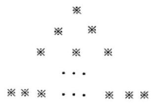
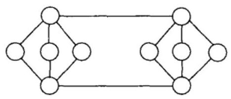
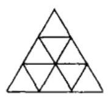
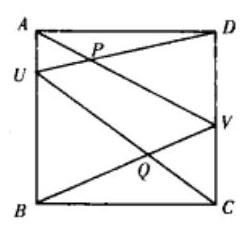
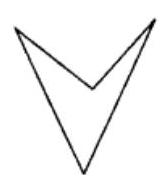

## 一、加拿大数学奥林匹克(1990-2009)试题

## 第 22 届加拿大数学奥林匹克(1990)

1 有 $n\left( {n \geq  2}\right)$ 名选手参加一项为期 $k$ 天的比赛,在每天的比赛中,选手可能得到的分数为 $1,2,3,\cdots , n$ ,且没有两个人的得分相同,当 $k$ 天比赛结束时,发现每名选手的总分都是 26 分. 试确定数对(n, k)的所有可能情况.

2 如图,将 $\frac{n\left( {n + 1}\right) }{2}$ 个不同的数随机排列成一个三角数阵, 设 ${M}_{k}$ 是从上往下数第 $k$ 行中的最大数,试求 ${M}_{1} < {M}_{2} < \cdots  < {M}_{n}$ 的概率.

1990. 2 图

3 圆内接四边形 ${ABCD}$ 的对角线 ${AC}$ 与 ${BD}$ 交于点 $X$ ,由 $X$ 向 ${AB}\text{、}{BC}\text{、}{CD}\text{、}{DA}$ 分别作垂线,垂足为 ${A}^{\prime }\text{、}{B}^{\prime }\text{、}{C}^{\prime }\text{、}{D}^{\prime }$ .

求证: ${A}^{\prime }{B}^{\prime } + {C}^{\prime }{D}^{\prime } = {A}^{\prime }{D}^{\prime } + {B}^{\prime }{C}^{\prime }$ .

4 一个质点在 $x$ 轴上的运动速度最大为 2 米/秒,在平面其他地方的运动速度最大为 1 米/秒. 试求该质点从原点出发在 1 秒钟内所能到达区域的边界曲线.

5 已知定义在正整数集上的函数 $f$ 满足:

$$
f\left( 1\right)  = 1, f\left( 2\right)  = 2,
$$

$$
f\left( {n + 2}\right)  = f\left( {n + 2 - f\left( {n + 1}\right) }\right)  + f\left( {n + 1 - f\left( n\right) }\right) \left( {n \geq  1}\right) .
$$

(1) 求证: $0 \leq  f\left( {n + 1}\right)  - f\left( n\right)  \leq  1$ ,并且当 $f\left( n\right)$ 为奇数时, $f\left( {n + 1}\right)  = f\left( n\right)  + 1$ ;

(2)试求适合 $f\left( n\right)  = {2}^{10} + 1$ 的所有 $n$ 的值,并证明你的结论.

## 第 23 届加拿大数学奥林匹克(1991)

1 证明方程

$$
{x}^{2} + {y}^{5} = {z}^{3}
$$

有无穷多组整数解,其中 ${xyz} \neq  0$ .

2 $n$ 为固定的正整数,求出所有具有以下性质的正整数的和:在二进制中,这个数恰有 ${2n}$ 个数字,其中 $n$ 个 $1, n$ 个 0 (首位数字不能为 0 ).

3 在平面上,设 $C$ 是一个圆, $P$ 是一给定的点,过 $P$ 作直线交 $C$ 于 $A\text{、}B$ 两点. 证明: 所有弦 ${AB}$ 的中点在一个圆上.

4 从数集 $\{ 0,1,2,\cdots ,{14}\}$ 中选出不同的数,填入下图中的 10 个小圆中,使得由线段连结的两个数之差的绝对值均不相同. 这可能吗? 请证明你的结论.

1991.4 图

5 如图,大三角形的边长为 3 ,由图中过各交点的直线所成的平行四边形的个数 $f\left( 3\right)  = {15}$ . 求边长为 $n$ 的三角形中相应的平行四边形的个数 $f\left( n\right)$ .

1991.5 图

## 第 24 届加拿大数学奥林匹克(1992)

1 证明: 前 $n$ 个正整数的乘积能被它们的和整除的充要条件是: $n + 1$ 不是一个奇素数.

2 已知 $x, y, z > 0$ ,证明不等式

$$
x{\left( x - z\right) }^{2} + y{\left( y - z\right) }^{2} \geq  \left( {x - z}\right) \left( {y - z}\right) \left( {x + y - z}\right) .
$$

并确定等号何时成立.

3 如图所示, ${ABCD}$ 为正方形, $U\text{、}V$ 分别是边 ${AB}\text{、}{CD}$ 内部的点. 确定使四边形 ${PUQV}$ 面积为最大时, $U\text{、}V$ 的所有可能情况.

1992. 3 图

4 解方程

$$
{x}^{2} + \frac{{x}^{2}}{{\left( x + 1\right) }^{2}} = 3.
$$

5 一副牌有 ${2n} + 1$ 张,其中一张 “王” 和 $1,2,\cdots , n$ 各两张. 把这 ${2n} + 1$ 张牌排成一行,使得 “王” 在正中间,且对每个 $k,1 \leq  k \leq  n$ ,两张 $k$ 之间恰有 $k - 1$ 张牌. 当 $n \leq  {10}$ 时,对怎样的 $n$ ,上述安排是可能的,对怎样的 $n$ ,上述安排是不可能的?

## 第 25 届加拿大数学奥林匹克(1993)

1 一个三角形的 3 条边长及一条高是 4 个连续的正整数, 且这条高将三角形分成的两个直角三角形的边长均为整数. 求这个三角形的三边长, 并证明这是唯一的.

2 证明: 实数 $x$ 是有理数的充要条件是: 能从数列 $x, x + 1, x + 2,\cdots$ 中选出 3 个不同的项, 组成等比数列.

3 $\bigtriangleup {ABC}$ 中, ${AC}$ 边上的中线 ${BD}$ 和 ${AB}$ 边上的中线 ${CE}$ 相互垂直,求证: $\cot B +$ $\cot C \geq  \frac{2}{3}$ .

4 若干个学校参加网球比赛,同一学校的选手相互不比赛,每两个学校的每两名选手之间都要比赛一场. 在两个男孩或两个女孩之间进行的比赛称为单打, 一个男孩和一个女孩之间的比赛称为混合单打. 男孩的人数与女孩的人数至多相差 1 ,单打的场数和混合单打的场数也至多相差 1 . 问有奇数个选手的学校至多有几个?

5 数列 ${y}_{1},{y}_{2},{y}_{3},\cdots$ 满足条件 ${y}_{1} = 1$ ,对于 $k > 0$ ,有

$$
{y}_{2k} = \left\{  \begin{array}{ll} 2{y}_{k}, & \text{ 若 }k\text{ 为偶数 } \\  2{y}_{k} + 1, & \text{ 若 }k\text{ 为奇数 } \end{array}\right.
$$

$$
{y}_{{2k} + 1} = \left\{  \begin{array}{ll} 2{y}_{k}, & \text{ 若 }k\text{ 为奇数 } \\  2{y}_{k} + 1, & \text{ 若 }k\text{ 为偶数 } \end{array}\right.
$$

证明: 每个自然数恰在数列 ${y}_{1},{y}_{2},{y}_{3},\cdots$ 中出现一次.

## 第 26 届加拿大数学奥林匹克(1994)

1 求和: $\mathop{\sum }\limits_{{n = 1}}^{{1994}}{\left( -1\right) }^{n}\frac{{n}^{2} + n + 1}{n!}$ .

2 求证: $\sqrt{2} - 1$ 的每个正整数次幂都具有 $\sqrt{m} - \sqrt{m - 1}$ 的形式,其中 $m$ 是某个正整数 (例如 ${\left( \sqrt{2} - 1\right) }^{2} = 3 - 2\sqrt{2} = \sqrt{9} - \sqrt{8}$ ).

3 25 个人围一圆桌而坐, 每小时进行一轮投票. 每人必须投“赞成票”或“反对票”. 每个人都按下述规则行事: 在第 $n$ 轮投票时,如果他和相邻的一人投同样的票,则在第 $n$ +1 轮投票时,他投与第 $n$ 轮一样的票. 在第 $n$ 轮投票时,如果他投的票与相邻的两人都不一样,则在第 $n + 1$ 轮投和第 $n$ 轮不同的票. 求证: 不论在第一轮投票时,各人投了什么票,总有一个时刻,从这时刻起,每个人在每一轮中投同样的票.

${4AB}$ 是圆 $\Omega$ 的直径, $P$ 为不在直线 ${AB}$ 上的一点. 直线 ${AP}$ 与 $\Omega$ 的交点为 $A$ 和 $U$ , 直线 ${PB}$ 与 $\Omega$ 的交点为 $B$ 和 $V$ (注意,在切线的情况下可能有 $A = U$ 或 $B = V$ ,且若 $P$ 在圆上,则 $P = U = V$ ). 设 $\left| {PU}\right|  = s\left| {PA}\right| ,\left| {PV}\right|  = t\left| {PB}\right| , s, t$ 为非负实数,用 $s, t$ 表示 $\angle {APB}$ 的余弦值.

5 锐角三角形 ${ABC}$ 中, ${AD}$ 是 ${BC}$ 边上的高, $H$ 是线段 ${AD}$ 内任一点, ${BH}$ 和 ${CH}$ 的延长线分别交 ${AC}\text{、}{AB}$ 于 $E$ 和 $F$ ,求证: $\angle {EDH} = \angle {FDH}$ .

## 第 27 届加拿大数学奥林匹克(1995)

1 设 $f\left( x\right)  = \frac{{9}^{x}}{{9}^{x} + 3}$ ,计算和

$$
f\left( \frac{1}{1996}\right)  + f\left( \frac{2}{1996}\right)  + \cdots  + f\left( \frac{1995}{1996}\right) .
$$

2 已知 $a, b, c$ 为正实数,求证:

$$
{a}^{a}{b}^{b}{c}^{c} \geq  {\left( abc\right) }^{\frac{a + b + c}{3}}.
$$

3 如果一个四边形任意一对边不相交,且有一个内角大于 ${180}^{ \circ  }$ ,那么我们就称它为 “镖形” (如图所示). 设 $C$ 是一个凸 $s$ 边形,将 $C$ 划分成 $q$ 个四边形,任意两个四边形不重叠 (也无空隙),设其中有 $b$ 个 “镖形”,证明: $q \geq  b$ $+ \frac{s - 2}{2}$ .

1995. 3 图

4 设 $n$ 是一个固定的正整数,证明: 对任何非负整数 $k$ ,下述不定方程

$$
{x}_{1}^{3} + {x}_{2}^{3} + \cdots  + {x}_{n}^{3} = {y}^{{3k} + 2}
$$

有无穷多个正整数解 $\left( {{x}_{1},{x}_{2},\cdots ,{x}_{n};y}\right)$ .

5 设 $u$ 为区间(0,1)内一实参数,定义

$$
f\left( x\right)  = \left\{  \begin{array}{ll} 0 & 0 \leq  x \leq  u, \\  1 - {\left( \sqrt{ux} + \sqrt{\left( {1 - u}\right) \left( {1 - x}\right) }\right) }^{2} & u \leq  x \leq  1. \end{array}\right.
$$

数列 $\left\{  {u}_{n}\right\}$ 如下递归定义:

$$
{u}_{1} = f\left( 1\right) ,{u}_{n} = f\left( {u}_{n - 1}\right) \left( {n > 1}\right) .
$$

求证:一定存在正整数 $k$ ,使得 ${u}_{k} = 0$ .

## 第 28 届加拿大数学奥林匹克(1996)

1 如果 $\alpha ,\beta ,\gamma$ 是方程 ${x}^{3} - x - 1 = 0$ 的根,求 $\frac{1 + \alpha }{1 - \alpha } + \frac{1 + \beta }{1 - \beta } + \frac{1 + \gamma }{1 - \gamma }$ 的值.

2 求方程组

$$
\left\{  \begin{array}{l} \frac{4{x}^{2}}{1 + 4{x}^{2}} = y, \\  \frac{4{y}^{2}}{1 + 4{y}^{2}} = z, \\  \frac{4{z}^{2}}{1 + 4{z}^{2}} = x, \end{array}\right.
$$

的所有实数解, 并证明你的结论.

$3{a}_{1},{a}_{2},\cdots ,{a}_{n}$ 是正整数 $1,2,\cdots , n$ 的任一排列. 设 $f\left( n\right)$ 是下述排列的数目,它们满足条件:

( i ) ${a}_{1} = 1$ ;

(ii) $\left| {{a}_{i} - {a}_{i + 1}}\right|  \leq  2, i = 1,2,\cdots , n - 1$ ,

试问 $f\left( {1996}\right)$ 能否被 3 整除.

4 已知等腰 $\bigtriangleup {ABC}$ 中, ${AB} = {AC},\angle B$ 的平分线与 ${AC}$ 交于 $D$ ,且 ${BC} = {BD} + {AD}$ , 求 $\angle A$ .

5 设 ${r}_{1},{r}_{2},\cdots ,{r}_{m}$ 是给定的 $m$ 个正有理数,且 $\mathop{\sum }\limits_{{k = 1}}^{m}{r}_{k} = 1$ . 对任意正整数 $n$ ,定义

$$
f\left( n\right)  = n - \mathop{\sum }\limits_{{k = 1}}^{m}\left\lbrack  {{r}_{k}n}\right\rbrack  .
$$

求 $f\left( n\right)$ 的最大值和最小值.

其中 $\left\lbrack  x\right\rbrack$ 表示不超过 $x$ 的最大整数.

## 第 29 届加拿大数学奥林匹克(1997)

1 有多少对正整数 $x, y$ 满足 $x \leq  y$ 并且最大公约数 $\left( {x, y}\right)  = 5!$ ,最小公倍数 $\left\lbrack  {x, y}\right\rbrack$ $= {50}!$ ?

2 闭区间 $A = \left\lbrack  {0,{50}}\right\rbrack$ 是有限个闭区间的并集,这些区间的长度均为 1,证明: 可以从中去掉一些闭区间,使得剩下的闭区间互不相交(即交集为空集),并且总长度 $\geq  {25}$ .

3 求证: $\frac{1}{1999} < \frac{1}{2} \cdot  \frac{3}{4} \cdot  \frac{5}{6} \cdot  \cdots  \cdot  \frac{1997}{1998} < \frac{1}{44}$ .

4 已知平行四边形 ${ABCD}$ 内一点 $O$ 满足 $\angle {AOB} + \angle {COD} = {180}^{ \circ  }$ ,求证: $\angle {OBC}$ $= \angle {ODC}$ .

5 将和式 $\mathop{\sum }\limits_{{k = 0}}^{n}\frac{{\left( -1\right) }^{k}{C}_{n}^{k}}{{k}^{3} + 9{k}^{2} + {26k} + {24}}$ 写成 $\frac{p\left( n\right) }{q\left( n\right) }$ 的形式,这里 $p\left( n\right) , q\left( n\right)$ 是 $n$ 的整系数多项式.

## 第 30 届加拿大数学奥林匹克(1998)

1 求满足下面方程的实数 $a$ :

$$
\left\lbrack  \frac{a}{2}\right\rbrack   + \left\lbrack  \frac{a}{3}\right\rbrack   + \left\lbrack  \frac{a}{5}\right\rbrack   = a.
$$

其中 $\left\lbrack  x\right\rbrack$ 表示不超过 $x$ 的最大整数.

2 在实数范围内解方程

$$
x = \sqrt{x - \frac{1}{x}} + \sqrt{1 - \frac{1}{x}}.
$$

3 已知自然数 $n \geq  2$ ,求证:

$$
\frac{1}{n + 1}\left( {1 + \frac{1}{3} + \cdots  + \frac{1}{{2n} - 1}}\right)  > \frac{1}{n}\left( {\frac{1}{2} + \frac{1}{4} + \cdots  + \frac{1}{2n}}\right) .
$$

4 在三角形 ${ABC}$ 中, $\angle {BAC} = {40}^{ \circ  },\angle {ABC} = {60}^{ \circ  }, D$ 和 $E$ 分别是边 ${AC}$ 和 ${AB}$ 上的点,使得 $\angle {CBD} = {40}^{ \circ  },\angle {BCE} = {70}^{ \circ  }, F$ 是直线 ${BD}$ 和 ${CE}$ 的交点. 证明: 直线 ${AF}$ 和直线 ${BC}$ 垂直.

5 设 $m$ 是一个正整数,数列 $\left\{  {a}_{n}\right\}$ 定义为:

$$
{a}_{0} = 0,{a}_{1} = m,{a}_{n + 1} = {m}^{2}{a}_{n} - {a}_{n - 1}, n \geq  1\text{.}
$$

证明:一个有序非负整数对(a, b)(其中 $a < b$ ) 是方程 $\frac{{a}^{2} + {b}^{2}}{{ab} + 1} = {m}^{2}$ 的解的充分必要条件是(a, b)具有 $\left( {{a}_{n},{a}_{n + 1}}\right)$ 的形式,其中 $n \geq  0$ .

## 第 31 届加拿大数学奥林匹克(1999)

1 求方程 $4{x}^{2} - {40}\left\lbrack  x\right\rbrack   + {51} = 0$ 的所有实数解.

这里 $\left\lbrack  x\right\rbrack$ 表示不超过 $x$ 的最大整数.

2 已知正三角形 ${ABC}$ 的高为 1,一个半径为 1 且圆心与 $C$ 在 ${AB}$ 同侧的圆沿线段 ${AB}$ 滚动.

证明: 该圆在三角形 ${ABC}$ 内的弧长为定值.

3 试求所有满足方程 $n = {\left( d\left( n\right) \right) }^{2}$ 的正整数 $n$ ,这里 $d\left( n\right)$ 表示 $n$ 的正因数的个数.

4 已知 $\left\{  {{a}_{1},{a}_{2},\cdots ,{a}_{8}}\right\}$ 为集合 $S = \{ 1,2,\cdots ,{17}\}$ 的一个 8 元子集.

( j ) 证明: 存在正整数 $k$ ,使得方程 ${a}_{i} - {a}_{j} = k\left( {1 \leq  i, j \leq  8}\right)$ 至少有三组不同的解;

(ii) 给出一个 7 元子集,使得对任意正整数 $k$ ,方程 ${a}_{i} - {a}_{j} = k$ 均不存在三组不同的解.

5 非负实数 $x, y, z$ 满足 $x + y + z = 1$ ,求证:

$$
{x}^{2}y + {y}^{2}z + {z}^{2}x \leq  \frac{4}{27},
$$

并确定等号成立的条件.