右圖為半徑為 3 公分的圓, $O$ 為圓心, $\overline{OA}$ 為半徑, $A$ 、 $B$ 、 $C$ 、 $D$ 、 $E$ 、 $F$ 、 $G$ 為圓周上的點。請利用書末附件分別量出 $\overset{⏜}{AB}\text{、}\overset{⏜}{AC}\text{、}\overset{⏜}{AD}\text{、}\overset{⏜}{AE}\text{、}\overset{⏜}{AF}$ 弧長是半徑 $\overline{OA}$ 的幾倍。以 $\overline{OA}$ 為始邊,逆時針方向測量,並回答以下問題:

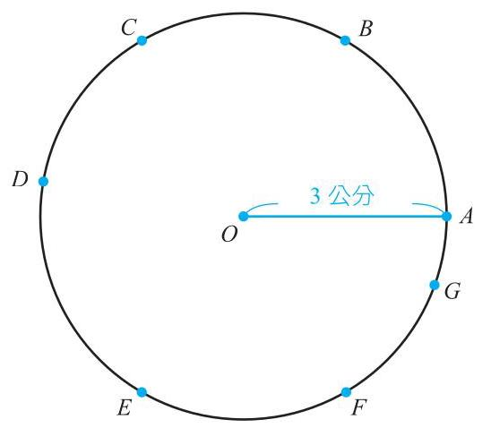

1. $\angle {AOB} \approx$ _____(弳)。

2. $\angle {AOC} \approx$ _____(弳)。

3. $\angle {AOE} \approx$ _____(弳)。

4. 3 ( 弳 ) ≈ ∠AO_____。

${5.6}\left( \text{ 弳 }\right)  \approx  \angle {AO}$ _____。

所以「弧度量」就是代表角 「度度量」和「弧度量」 張開多少個半徑,所以單位 我懂了,可是那如果想是「弳」；而以往熟知的「度 要把「度度量」換成「弧度量」也就代表張開多少個 度量」要怎麼做啊？ 1 度,所以單位是「度」。

由圓周長 $= {2\pi } \times$ 半徑,可知一整個圓的圓心角 ${360}^{ \circ  }$ 對應到的弧長是半徑 ${2\pi }$ 倍, 也就是 ${2\pi }$ 個弳,即 ${360}^{ \circ  } = {2\pi }$ 弳,可推得 ${180}^{ \circ  } = \pi$ 弳。因此可得底下重點:

## 講重點 KEY POINT

${1}^{ \circ  } = \frac{\pi }{180}$ 弳 0.0175 弳(可用計算機上的 π 鍵求出近似值)； 1 弳 = ( $\frac{180}{\pi }$ ) ~ 57.3 ° 。

${2\pi }\left( \text{ 强 }\right)  = {360}^{ \circ  }$ 。

由手腦並用 2 中可以看到, 3 弳的角很接近 ${180}^{ \circ  } = \pi$ 弳 $\approx  {3.14}$ 弳,而 6 弳的角很接近 ${360}^{ \circ  } = {2\pi }$ 弳 ≈6.28 弳。

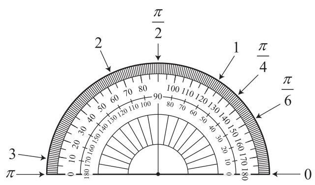

## 例題 1

(1)請分別將 18°、 120°、 270° 轉成弧度量。

(2) 請問 $\frac{\pi }{5} \cdot  \frac{7\pi }{6} \cdot  3$ 分别等於多少度? 解 由定義可得 (1)

<table><tr><td>${2\pi }\left( \text{ 弳 }\right)  \times  \frac{{18}^{ \circ  }}{{360}^{ \circ  }} = {2\pi }\left( \text{ 弳 }\right)  \times  \frac{1}{20} = \frac{\pi }{10}\left( \text{ 弳 }\right)$</td><td>  </td><td>${18}^{ \circ  }$ 張開 $\frac{1}{20}$ 個圓</td></tr><tr><td>${2\pi }$ (弳) $\times  \frac{{120}^{ \circ  }}{{360}^{ \circ  }} = {2\pi }$ (弳) $\times  \frac{1}{3} = \frac{2\pi }{3}$ (弳)</td><td>  </td><td>${120}^{ \circ  }$ 張開 $\frac{1}{3}$ 個圓</td></tr><tr><td>${2\pi }\left( \text{ 弳 }\right)  \times  \frac{{270}^{ \circ  }}{{360}^{ \circ  }} = {2\pi }\left( \text{ 弳 }\right)  \times  \frac{3}{4} = \frac{3\pi }{2}\left( \text{ 弳 }\right)$</td><td>  </td><td>${270}^{ \circ  }$ 張開 $\frac{3}{4}$ 個圓</td></tr></table>

(2)

<table><tr><td>${360}^{ \circ  } \times  \frac{\frac{\pi }{5}\left( \text{ 弳 }\right) }{{2\pi }\left( \text{ 弳 }\right) } = {360}^{ \circ  } \times  \frac{1}{10} = {36}^{ \circ  }$</td><td>  </td><td>$\frac{\pi }{5}$ 弳張開 $\frac{1}{10}$ 個圓</td></tr><tr><td>${360}^{ \circ  } \times  \frac{\frac{7\pi }{6}\left( \text{ 弳 }\right) }{{2\pi }\left( \text{ 弳 }\right) } = {360}^{ \circ  } \times  \frac{7}{12} = {210}^{ \circ  }$</td><td>  </td><td>$\frac{7\pi }{6}$ 弳張開 $\frac{7}{12}$ 個圓</td></tr><tr><td>${360}^{ \circ  } \times  \frac{3\left( \text{ 弳 }\right) }{{2\pi }\left( \text{ 弳 }\right) } \approx  {171.9}^{ \circ  }$</td><td>  </td><td>3 弳張開約 0.48 個圓</td></tr></table>

## 動動筆 1

(1)請分別將 60°、 150° 轉成弧度量。

(2) 請問 $\frac{\pi }{4} \cdot  \frac{2\pi }{3} \cdot  2$ 分别等於多少度?

## 動動筆 2

以下為常用的角度,請在空格中填入對應的度數或弳。

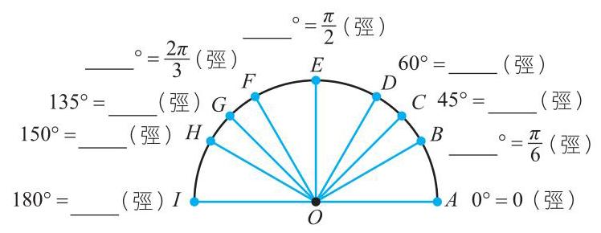

單位換算:

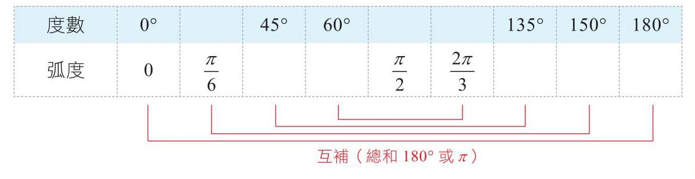

## 1-1.2 圓弧與圓面積的計算

讓我們來看看如何用弧度量算扇形弧長與面積。先複習一下國中學過的:

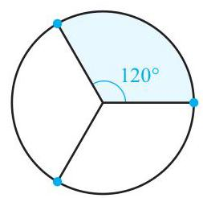

④ 圖 1-1-1

① 圓周長 $= {2\pi r}$ 。 ② 圓面積 $= \pi {r}^{2}$ 。

扇形的弧長和面積算法,和 P. 12 例題 1 一樣,可以用扇形占幾分之幾個圓來做計算,例如:圓心角 120 度的扇形占 $\frac{1}{3}$ 個圓,扇形的弧長就會是 $\frac{1}{3} \times  {2\pi r}$ ,而扇形面積就會是 $\frac{1}{3} \times  \pi {r}^{2}$ 。

## 办手工 中心

假設圓半徑為 $r$ ,請完成下表。

<table><tr><td>圓心角 (度)</td><td>圓心角 ( 弳 )</td><td>扇形 占圓比例</td><td>扇形弧長</td><td>扇形面積</td></tr><tr><td>${45}^{ \circ  }$</td><td/><td/><td/><td/></tr><tr><td>${90}^{ \circ  }$</td><td/><td/><td/><td/></tr><tr><td>${120}^{ \circ  }$</td><td>$\frac{2\pi }{3}$</td><td>$\frac{1}{3}$</td><td>$\frac{2}{3}{\pi r}$</td><td>$\frac{1}{3}\pi {r}^{2}$</td></tr><tr><td>${180}^{ \circ  }$</td><td/><td/><td/><td/></tr><tr><td>270°</td><td/><td/><td/><td/></tr><tr><td/><td>$\theta$</td><td/><td/><td/></tr><tr><td/><td/><td/><td/><td/></tr></table>

相信同學都已經會如何計算扇形面積與弧長了,手腦並用 3 表格最下面一列就是扇形弧長與面積的公式喔！假設圓半徑為 $r$ ,角度為 $\theta$ 的扇形占 $\frac{\theta }{2\pi }$ 個圓,扇形的弧長就會是 $\frac{\theta }{2\pi } \times  {2\pi r} = {r\theta }$ ,而扇形的面積會是 $\frac{\theta }{2\pi } \times  \pi {r}^{2} = \frac{1}{2}{r}^{2}\theta$ 。

## 講重點 KEY POINT

若圓半徑為 $r$ ,角度為 $\theta$ 的扇形,

(1)扇形的弧長 $= {r\theta }$ 。

( 2 )扇形的面積 $= \frac{1}{2}{r}^{2}\theta$ 。

## 例題 2

已知下列扇形的半徑與圓心角,求扇形的弧長與面積。

( 1 )扇形的半徑為 10( 公分)、圓心角為 $\frac{\pi }{5}$ ( 弳 )。

(2)扇形的半徑為 3(公分)、圓心角為 2(弳)。

解 (1) 扇形圆心角 $\theta  = \frac{\pi }{5}$ (弳) ,故

扇形弧長 $s = {r\theta } = {10} \times  \frac{\pi }{5} = {2\pi } \approx  {6.3}$ (公分)

扇形面積 $A = \frac{1}{2}{r}^{2}\theta  = \frac{1}{2} \times  {10}^{2} \times  \frac{\pi }{5} = {10\pi } \approx  {31.4}$ (平方公分)。

(2)扇形圓心角 θ = 2(弳),故

扇形弧長 $s = {r\theta } = 3 \times  2 = 6$ (公分)、

扇形面積 $A = \frac{1}{2}{r}^{2}\theta  = \frac{1}{2} \times  {3}^{2} \times  2 = 9$ (平方公分)。

## 動動筆 3

已知下列扇形的半徑與圓心角,求扇形的弧長與面積。

( 1 )扇形的半徑為 6(公分)、圓心角為 $\frac{\pi }{3}$ ( 弳 )。

( 2 )扇形的半徑為 5 ( 公分 )、圓心角為 2 ( 弳 )。

## 例题 3

墨規有一把最大可以展開到 120° 的扇子,扇骨從扣環處算起的長度是 30 公分,若扇布從扣環算起 10 公分處黏到扇骨頂端 30 公分處,再將扇子整個張開後平放在桌上,請問扇布蓋住桌面的面積為何？(四捨五入取至整數位)

解如右圖,扇布蓋住桌面的面積為紅色扇形面積 = 整個面積 - 黑色扇形面積, 而 ${120}^{ \circ  } = \frac{2\pi }{3}$ ,故所求爲 $\left( {\frac{1}{2} \times  {30} \times  {30} \times  \frac{2\pi }{3}}\right)  - \left( {\frac{1}{2} \times  {10} \times  {10} \times  \frac{2\pi }{3}}\right)$ $= \frac{800\pi }{3} \approx  {838}$ (平方公分)。

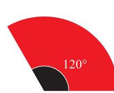

## 動動筆 4

有些扇子展開最大可以到 155° 圓心角,扇骨從扣環處算起長度有 20 公分,如右圖所示。若扇布從扣環算起 8 公分處黏到扇骨頂端 20 公分處,再將扇子整個張開後平放在桌上,請問扇布蓋住桌面的面積為何？ (四捨五入取至整數位)

## 1-1.3 廣義角與三角比

有了弧度量,那 還沒那麼快,我們要先學這樣才能畫圖啊！ 我現在終於可以 給了自變數 $x$ ,怎麼求出畫波形了嗎？ 三角函數應變數 $y$ 的值,

本章一開始我們複習過高一學的廣義三角比,以及介紹三角函數,接續學習了弧度量之後,我們便可使用弧度量來表示三角函數中的角度。讓我們來看幾個例題。

## 例題 4

分別求出當自變數 $x = \frac{\pi }{2}$ 及自變數 $x = \pi$ 時,三角函數 $\sin \left( x\right)$ 的值。

解 $\sin \left( \frac{\pi }{2}\right)  = \sin {90}^{ \circ  } = 1$ 、

$\sin \left( \pi \right)  = \sin {180}^{ \circ  } = 0$ 。

往後不產生混淆時,會省略 $\sin \left( x\right)$ 中的括號,寫成 $\sin x$ ,其他三角函數亦同。

## 例題 5

求 $\sin \frac{\pi }{4} \cdot  \cos \frac{2\pi }{3}$ 及 $\tan \frac{5\pi }{6}$ 。

解 $\sin \frac{\pi }{4} = \sin {45}^{ \circ  } = \frac{\sqrt{2}}{2}$ 、

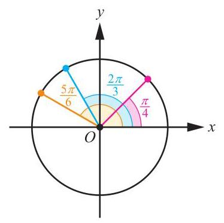

$\cos \frac{2\pi }{3} = \cos {120}^{ \circ  } =  - \frac{1}{2}$ 、

$\tan \frac{5\pi }{6} = \tan {150}^{ \circ  } =  - \frac{\sqrt{3}}{3}$ 。

## 動動筆 5

求 $\sin \frac{\pi }{6} \cdot  \cos \frac{3\pi }{4}$ 及 $\tan \frac{\pi }{3}$ 。

使用計算機也可以查得弧度量的三角函數值,首先要確認角度的單位, DEG (degree) 是度度量, RAD (radian) 是弧度量。這些會顯示在計算機螢幕上,通常使用 Mode 切換或是專用鍵 DEG 。接著先輸入角的大小,再按下函數即可。

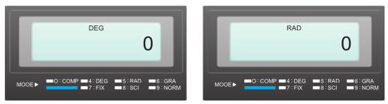

例如:在 RAD 時,輸入 1 → sin → 顯示 0.841470984 ,即為 sin1 的值。

輸入 $\pi  \rightarrow   \div   \rightarrow  6 \rightarrow   =  \rightarrow  \sin  \rightarrow$ 顯示 0.5 ,即為 $\sin \frac{\pi }{6}$ 。

在 DEG 時,輸入 3 0 → sin → 顯示 0.5 ,即為 sin30 的值。

## BATTOR

請記錄使用計算機得到的值,並回答下列問題:

( 1 )請利用計算機求 $\sin \frac{\pi }{6} =$ _____、 $\sin \frac{13\pi }{6} =$ _____、 $\sin \left( {-\frac{11\pi }{6}}\right)  =$ _____, 這三個值相等嗎？

( 2 )由計算機得到 $\sin \frac{\pi }{3} =$ _____,但 $\sin \frac{\pi }{3} = \sin {60}^{ \circ  } = \frac{\sqrt{3}}{2}$ ,這兩個值相等嗎？ 為什麼？

( 3 )由计算機得到 $\sin 1 =$ _____、 $\sin {1}^{ \circ  } =$ _____,這兩個值相等嗎？ 為什麼？

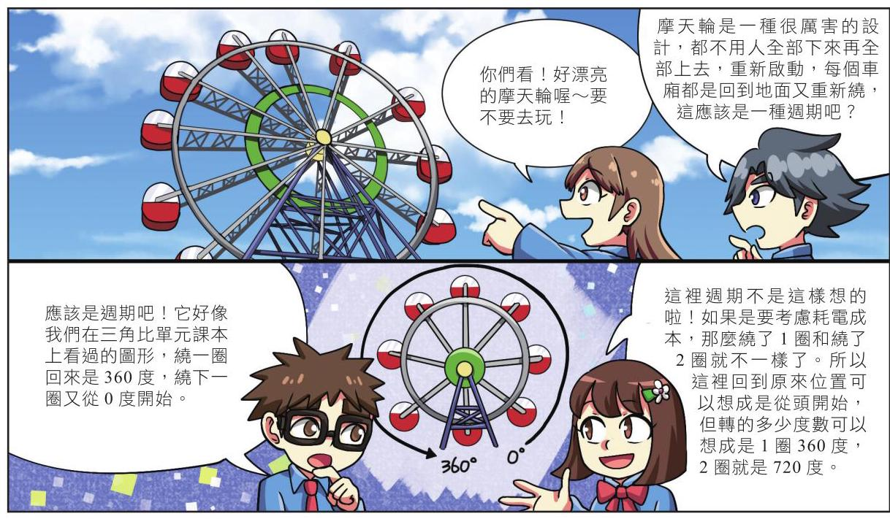

漫畫中不惑神說的其實就是高一下學過的同界角的觀念喔！也就是,兩個角的始邊與終邊都相同時就是同界角,所以轉 $\frac{\pi }{2}\left( {90}^{ \circ  }\right)$ 和轉 $\frac{\pi }{2} + {2\pi }\left( {{90}^{ \circ  } + {360}^{ \circ  }}\right)$ 是一樣的。

## 办

( 1 )請將下列角度依序填至圖形中相對應的位置。

$$
\frac{\pi }{4}\text{、}\frac{\pi }{2}\text{、}\frac{3\pi }{4}\text{、}\pi \text{、}\frac{5\pi }{4}\text{、}\frac{3\pi }{2}\text{、}\frac{7\pi }{4}\text{、}{2\pi }\text{、}\frac{9\pi }{4}\text{、}\frac{5\pi }{2}\text{、}\frac{11\pi }{4}\text{、}{3\pi }\text{、}\frac{13\pi }{4}\text{、}\frac{7\pi }{2}\text{、}\frac{15\pi }{4}\text{、}{4\pi }\text{。}
$$

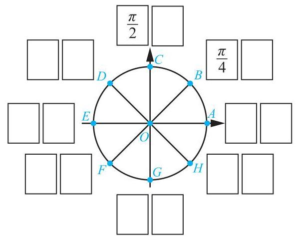

(2)請利用上圖求以下的三角比。

<table><tr><td/><td/><td/><td/><td/></tr><tr><td>$\theta$</td><td>$\frac{9\pi }{4}$</td><td>$\frac{11\pi }{4}$</td><td>$\frac{13\pi }{4}$</td><td>$\frac{15\pi }{4}$</td></tr><tr><td>$\sin \theta$</td><td/><td/><td/><td/></tr><tr><td>$\cos \theta$</td><td/><td/><td/><td/></tr></table>

所以這樣就可以想出 不只是兩圈以內,兩圈以 上或是反方向轉的,只要 角度在兩圈以內的特殊角三角比了耶！ 我們知道它的最後落點, 就能知道它的三角比。

## 例題 6

求 $\sin \frac{7\pi }{3} \cdot  \cos \left( {-\frac{2\pi }{3}}\right)$ 。

解 如右圖, $\sin \frac{7\pi }{3} = \sin \frac{\pi }{3} = \sin {60}^{ \circ  } = \frac{\sqrt{3}}{2}$ 。

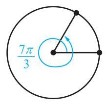

如右圖, $\cos \left( {-\frac{2\pi }{3}}\right)  = \cos \frac{4\pi }{3} = \cos {240}^{ \circ  } =  - \frac{1}{2}$ 。

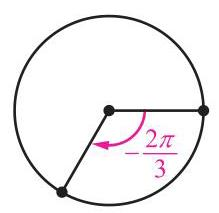

## 動動筆 6

求 $\sin \left( {-\frac{4\pi }{3}}\right)  \cdot  \cos \frac{13\pi }{6}$ 。