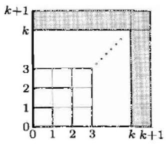
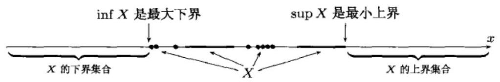
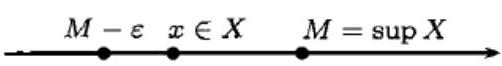
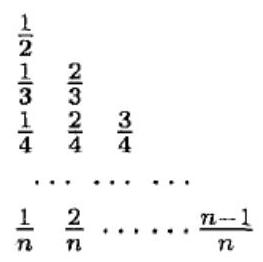
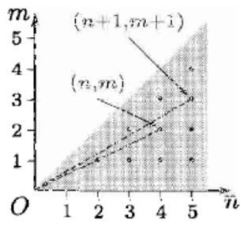

## 第一章 分析引论

内容简介 这一章的目的是为进入微积分学作准备工作, 其中包括实数、函数概念与图像、数列极限与函数极限、连续函数等内容.

## $§{1.1}$ 实 数 (习题 1-40)

内容简介 本节的习题可分为以下部分: 数学归纳法与若干恒等式和初等不等式、有理数集的戴德金分割与实数的定义、确界定义与性质、与绝对值有关的不等式和等式、绝对误差与相对误差. 按照以上内容分小节叙述. 最后的补注小节解答较难的习题, 对数学归纳法作补充, 并证明本书将经常使用的平均值不等式.

#### 1.1.1 数学归纳法 (习题 1-10)

数学归纳法是本书所用的基本方法之一.

这里的习题 1-5 是关于正整数 $n$ 的恒等式,习题 6-10 是关于 $n$ 的不等式,它们都是高等数学中经常使用的结果, 也是学习数学归纳法的好材料.

由于数学归纳法是中学数学的必修内容, 这里不再对它从头开始作介绍, 而只是作一些补充.

数学归纳法是用于数学证明的一种工具. 凡是与正整数 $n$ 有关的命题,不论是恒等式还是不等式, 都有可能用数学归纳法给出证明. 如果证明成功了, 则就认为该命题在数学上已经确认为真. 但是与正整数有关的命题也有很多不能用数学归纳法给出证明, 这就是说数学归纳法不是万能的.

作为复习, 下面先举中学数学教材中的一个例题, 并在附图中画出它的几何意义.

例题 证明从 1 开始的前 $n$ 个奇数之和恰好等于 ${n}^{2}$ .

解 这就是要证明与正整数 $n$ 有关的下列恒等式:

$$
1 + 3 + 5 + \cdots  + \left( {{2n} - 1}\right)  = {n}^{2}. \tag{1.1}
$$

恒等式 (1.1) 的附图

按照数学归纳法的规定, 分两步来做.

(1) 当 $n = 1$ 时,(1.1) 式的两边都是 1,因此成立.

( 2 )假设当 $n = k \geq  1$ 时 (1.1) 成立,即已经有

$$
1 + 3 + 5 + \cdots  + \left( {{2k} - 1}\right)  = {k}^{2},
$$

---

那么当 $n = k + 1$ 时就有

---

$$
1 + 3 + 5 + \cdots  + \left( {{2k} - 1}\right)  + \left\lbrack  {2\left( {k + 1}\right)  - 1}\right\rbrack
$$

$$
= 1 + 3 + 5 + \cdots  + \left( {{2k} - 1}\right)  + \left( {{2k} + 1}\right)
$$

$$
= {k}^{2} + \left( {{2k} + 1}\right)  = {\left( k + 1\right) }^{2}\text{.}
$$

可见 $n = k + 1$ 时 (1.1) 也成立 (附图中的阴影区的面积就是 ${2k} + 1$ ).

根据数学归纳法原理,(1.1) 对一切正整数 $n$ 成立.

数学归纳法只是证明的工具 (之一), 但并不是发现命题的方法. 数学归纳法要证明的命题是什么地方来的? 这与数学归纳法完全是两回事. 这些命题往往可能是一种猜测, 即从许多个别例子归纳出来的. 上述例题中所要证明的恒等式很可能就是从 $1 + 3 = {2}^{2},1 + 3 + 5 = {3}^{2}$ 等等“归纳”得到的,或者说猜到的. 这里重要的是不要将数学归纳法与平时经常使用的“归纳”方法相混淆. 后者是从特殊到一般的一种广泛使用的推理方法. 归纳得到的结论可能正确, 也可能错误.

本节的前 5 题与上述例题相同, 即是要证明以下恒等式:

$$
1 + 2 + \cdots  + n = \frac{n\left( {n + 1}\right) }{2},
$$

$$
{1}^{2} + {2}^{2} + \cdots  + {n}^{2} = \frac{n\left( {n + 1}\right) \left( {{2n} + 1}\right) }{6},
$$

$$
{1}^{3} + {2}^{3} + \cdots  + {n}^{3} = {\left( 1 + 2 + \cdots  + n\right) }^{2},
$$

$$
1 + 2 + {2}^{2} + \cdots  + {2}^{n - 1} = {2}^{n} - 1,
$$

$$
{\left( a + b\right) }^{\left\lbrack  n\right\rbrack  } = \mathop{\sum }\limits_{{m = 0}}^{n}{\mathrm{C}}_{n}^{m}{a}^{\left\lbrack  n - m\right\rbrack  }{b}^{\left\lbrack  m\right\rbrack  }.
$$

其中最后一题中引入了数学分析中不多见的特殊记号

$$
{a}^{\left\lbrack  0\right\rbrack  } = 1,\;{a}^{\left\lbrack  n\right\rbrack  } = a\left( {a - h}\right) \cdots \left\lbrack  {a - \left( {n - 1}\right) h}\right\rbrack  .
$$

该题的证明较难, 初学者可暂时跳过, 本书将在最后的补注小节中给出它的解答. 对于初学者来说,首先应当掌握的是 $h = 0$ 时的特殊情况. 这时上述恒等式就成为牛顿二项式定理 (或二项式公式). 这也是习题 5 中列出的后半题. 下面给出它的证明供参考.

习题 5 (后半题) 证明对实数 $a, b$ 和任何正整数 $n$ 成立

$$
{\left( a + b\right) }^{n} = {\mathrm{C}}_{n}^{0}{a}^{n} + {\mathrm{C}}_{n}^{1}{a}^{n - 1}b + \cdots  + {\mathrm{C}}_{n}^{r}{a}^{n - r}{b}^{r} + \cdots  + {\mathrm{C}}_{n}^{n}{b}^{n}.
$$

解 在这里采用高等数学中常用的求和简缩记号, 这就是将上述恒等式记为

$$
{\left( a + b\right) }^{n} = \mathop{\sum }\limits_{{k = 0}}^{n}{\mathrm{C}}_{n}^{k}{a}^{n - k}{b}^{k}. \tag{1.2}
$$

$n = 1$ 时,恒等式 (1.2) 显然成立. 现假定该恒等式于 $n$ 时成立,则对 $n + 1$ 可以作如下计算①:

$$
{\left( a + b\right) }^{n + 1} = \left( {\mathop{\sum }\limits_{{k = 0}}^{n}{\mathrm{C}}_{n}^{k}{a}^{n - k}{b}^{k}}\right)  \cdot  \left( {a + b}\right)
$$

$$
= \mathop{\sum }\limits_{{k = 0}}^{n}{\mathrm{C}}_{n}^{k}\left( {{a}^{n - k + 1}{b}^{k} + {a}^{n - k}{b}^{k + 1}}\right)  \tag{1.3}
$$

$$
= \mathop{\sum }\limits_{{k = 0}}^{n}{\mathrm{C}}_{n}^{k}{a}^{n - k + 1}{b}^{k} + \mathop{\sum }\limits_{{k = 1}}^{{n + 1}}{\mathrm{C}}_{n}^{k - 1}{a}^{n - k + 1}{b}^{k} \tag{1.4}
$$

$$
= {\mathrm{C}}_{n}^{0}{a}^{n + 1} + \mathop{\sum }\limits_{{k = 1}}^{n}\left( {{\mathrm{C}}_{n}^{k} + {\mathrm{C}}_{n}^{k - 1}}\right) {a}^{n - k + 1}{b}^{k} + {\mathrm{C}}_{n}^{n}{b}^{n + 1}
$$

$$
= \mathop{\sum }\limits_{{k = 0}}^{{n + 1}}{\mathrm{C}}_{n + 1}^{k}{a}^{n + 1 - k}{b}^{k}.\;\square
$$

---

① 本题的写法是常见的,即从 $n$ 时命题成立推出 $n + 1$ 时命题也成立,这与从 $n = k$ 时命题成立推出 $n = k + 1$ 时命题也成立的写法是同样有效的. 只是前者不必引入 $k$ ,比较简明一点. 特别在本题中不等式内部已经用了符号 $k$ ,因此更为合适. 否则就要再选定一个符号,例如 $i$ ,然后按照从 $n = i$ 时命题成立推出 $n = i + 1$ 时命题也成立的方式来写了.

---

注意其中的两个技巧: (1) 先将 (1.3) 写成两个和式, 然后将其中的第二个和式的指标 $k$ 换为 ${k}^{\prime } - 1$ ,因此当 $k$ 从 0 到 $n$ 时, ${k}^{\prime }$ 从 1 到 $n + 1$ ,然后又将 ${k}^{\prime }$ 记为 $k$ ,这样得到 (1.4); (2) 利用杨辉恒等式 (其中 $1 \leq  k \leq  n$ )

$$
{\mathrm{C}}_{n + 1}^{k} = {\mathrm{C}}_{n}^{k} + {\mathrm{C}}_{n}^{k - 1}. \tag{1.5}
$$

注 杨辉恒等式 (1.5) 是中学数学已有的内容, 这里重复一下. 它可以从组合数的计算公式直接推导如下:

$$
{\mathrm{C}}_{n}^{k} + {\mathrm{C}}_{n}^{k - 1} = \frac{n!}{k!\left( {n - k}\right) !} + \frac{n!}{\left( {k - 1}\right) !\left( {n - k + 1}\right) !}
$$

$$
= \frac{n!}{k!\left( {n - k + 1}\right) !} \cdot  \left( {n - k + 1 + k}\right)
$$

$$
= \frac{\left( {n + 1}\right) !}{k!\left( {n + 1 - k}\right) !} = {\mathrm{C}}_{n + 1}^{k}.
$$

另一种证明方法是从组合数的定义出发. 为了求出从 $n + 1$ 个不同元素中取出 $k\left( {1 \leq  k \leq  n}\right)$ 个元素的所有组合数,我们可以取定其中某一个元素,记为 $a$ ,然后将所有的组合分为两类,第一类是不含 $a$ 的组合,它一共有 ${\mathrm{C}}_{n}^{k}$ 种,第二类是含 $a$ 的组合,它一共有 ${\mathrm{C}}_{n}^{k - 1}$ 种. 可见 (1.5) 成立.

习题 6 和 7 中的两个伯努利不等式是今后常用的基本工具,

习题 6 (伯努利不等式) 证明

$$
\left( {1 + {x}_{1}}\right) \left( {1 + {x}_{2}}\right) \cdots \left( {1 + {x}_{n}}\right)  \geq  1 + {x}_{1} + {x}_{2} + \cdots  + {x}_{n},
$$

其中 ${x}_{1},{x}_{2},\cdots ,{x}_{n}$ 同号且大于 -1 .

解 用数学归纳法. 当 $n = 1$ 时两边相等,因此结论成立.

现假设该不等式于 $n = k$ 时成立,则对于 $n = k + 1$ 可作如下推导:

$$
\left( {1 + {x}_{1}}\right) \left( {1 + {x}_{2}}\right) \cdots \left( {1 + {x}_{k + 1}}\right)  \geq  \left( {1 + {x}_{1} + {x}_{2} + \cdots  + {x}_{k}}\right) \left( {1 + {x}_{k + 1}}\right)
$$

$$
= 1 + {x}_{1} + {x}_{2} + \cdots  + {x}_{k + 1} + \left( {{x}_{1} + \cdots  + {x}_{k}}\right) {x}_{k + 1}
$$

$$
\geq  1 + {x}_{1} + \cdots  + {x}_{k + 1}\text{.}
$$

注 注意关于 ${x}_{i}\left( {i = 1,2,\cdots , n}\right)$ 的关键条件,首先是都大于 -1,其次是同号,两者缺一不可. 前者保证了不等式左边非负,后者的重要性可以看 $n = 2$ . 这时不难看出, 若 ${x}_{1}{x}_{2} < 0$ ,则只能成立相反的不等式

$$
\left( {1 + {x}_{1}}\right) \left( {1 + {x}_{2}}\right)  = 1 + {x}_{1} + {x}_{2} + {x}_{1}{x}_{2} < 1 + {x}_{1} + {x}_{2}.
$$

可以看出, 下面的习题 7 中的不等式是习题 6 中的不等式的特例, 它也称为伯努利不等式 [6]. 若其中 $x \geq  0$ ,则可从二项式公式推出. 今后会发现,使用习题 7 中的不等式的机会要比习题 6 中的不等式多得多. 为此我们给出它的独立证明.

习题 7 (伯努利不等式) 证明,如果 $x >  - 1$ ,那么不等式

$$
{\left( 1 + x\right) }^{n} \geq  1 + {nx}\left( {n > 1}\right)
$$

成立,当且仅当 $x = 0$ 时等号成立.

解 用数学归纳法. 对于 $n = 2$ ,有

$$
{\left( 1 + x\right) }^{2} = 1 + {2x} + {x}^{2} \geq  1 + {2x},
$$

当且仅当 $x = 0$ 时等号成立.

现设 $n = k$ 时不等式成立,则当 $n = k + 1$ 时有

$$
{\left( 1 + x\right) }^{k + 1} = {\left( 1 + x\right) }^{k}\left( {1 + x}\right)
$$

$$
\geq  \left( {1 + {kx}}\right) \left( {1 + x}\right)  = 1 + \left( {k + 1}\right) x + k{x}^{2}
$$

$$
\geq  1 + \left( {k + 1}\right) x,
$$

同样从归纳假设和上式推导可知当且仅当 $x = 0$ 时等号成立.

注 这里有一个意外,当 $- 2 \leq  x \leq   - 1$ 时本题的伯努利不等式仍然成立. 证明留给读者.

下面结合数学归纳法的使用同时介绍在数学证明中的分析法和综合法.

先看习题 $9\left( \mathrm{\;b}\right)$ .

习题 9(b) 证明不等式

$$
\frac{1}{2} \cdot  \frac{3}{4}\cdots \cdots \frac{{2n} - 1}{2n} < \frac{1}{\sqrt{{2n} + 1}}. \tag{1.6}
$$

解 1 (分析法) 对 $n = 1$ 可以直接从 $\frac{1}{2} < \frac{1}{\sqrt{3}}$ 看出,因 $2 > \sqrt{3}$ 是明显的.

现设 $n = k$ 时不等式已经成立,则当 $n = k + 1$ 时需要证明下列不等式:

$$
\frac{1}{2} \cdot  \frac{3}{4}\cdots  \cdot  \frac{{2k} - 1}{2k} \cdot  \frac{2\left( {k + 1}\right)  - 1}{2\left( {k + 1}\right) } < \frac{1}{\sqrt{2\left( {k + 1}\right)  + 1}}. \tag{1.7}
$$

由于对 (1.7) 左边的前 $k$ 个因子的乘积可以用归纳假设,因此只要能够证明以下不

等式即可:

$$
\frac{1}{\sqrt{{2k} + 1}} \cdot  \frac{2\left( {k + 1}\right)  - 1}{2\left( {k + 1}\right) } < \frac{1}{\sqrt{2\left( {k + 1}\right)  + 1}}. \tag{1.8}
$$

这个不等式是否成立并不明显, 但我们可以将它两边平方后来观察, 这样就得到与 (1.8) 等价的

$$
\frac{1}{{2k} + 1} \cdot  \frac{{\left( 2k + 1\right) }^{2}}{{\left( 2k + 2\right) }^{2}} < \frac{1}{{2k} + 3}. \tag{1.9}
$$

这里已经可以看出 (1.9) 又等价于

$$
\left( {{2k} + 1}\right) \left( {{2k} + 3}\right)  < {\left( 2k + 2\right) }^{2},
$$

而将上式两边展开就知道它是成立的. 回溯上面的讨论, 从

$$
\left( {1.9}\right)  \Leftrightarrow  \left( {1.8}\right)  \Rightarrow  \left( {1.7}\right)
$$

可见证明已经完成 ${}^{\text{①}}$ .

上述证明是典型的分析法. 它的一般模式如下: 设条件为 $A$ ,结论为 $B$ ,为了证明 $A \Rightarrow  B$ ,设法寻找 $C$ ,使得 $C \Rightarrow  B$ (或者 $C \Leftrightarrow  B$ ). 然后只要设法证明 $A \Rightarrow  C$ 即可. 如果做不到, 还可以将以上方法继续用下去. 当然这不是一定能够成功的方法, 但确实是一种常用的思维方法.

与此相对的是综合法. 为了证明 $A \Rightarrow  B$ ,设法寻找 $C$ ,使得 $A \Rightarrow  C$ (或者 $A \Leftrightarrow  C$ ). 然后只要设法证明 $C \Rightarrow  B$ 即可. 如果做不到,还可以将以上方法继续用下去. 当然这也不是一定能够成功的方法.

由于分析法往往过程很长, 说起来也可能比较啰唆, 因此在书刊中的多数证明是用综合法写的. 由于它往往不是实际的思维过程, 而像是事后的总结, 因此容易使读者看懂之后仍然不知道“这是如何想出来的”.

分析法和综合法的起源很早, 读者可以在古希腊数学家帕普斯的《数学汇编》中找到对它们的论述 (其中译文见 [14] 的 193 页).

现在按照综合法写出习题 9(b) 的第二个证明.

解 2 (综合法) 对于 $n = 1$ 同解 1 . 现设 $n = k$ 时不等式 (1.6) 已经成立,则当 $n = k + 1$ 时就有

$$
\frac{1}{2} \cdot  \frac{3}{4} \cdot  \cdots  \cdot  \frac{{2k} - 1}{2k} \cdot  \frac{2\left( {k + 1}\right)  - 1}{2\left( {k + 1}\right) } < \frac{1}{\sqrt{{2k} + 1}} \cdot  \frac{{2k} + 1}{{2k} + 2}
$$

$$
= \frac{\sqrt{{2k} + 1}}{{2k} + 2} < \frac{1}{\sqrt{{2k} + 3}},
$$

其中最后一步利用了显然成立的不等式

$$
\left( {{2k} + 1}\right) \left( {{2k} + 3}\right)  = {\left( 2k + 2\right) }^{2} - {1}^{2} < {\left( 2k + 2\right) }^{2}.
$$

《习题集》中的习题 1-10 是学习数学归纳法的最基本材料, 凡是对此不很熟悉的初学者都应当将它们做出来. 这对于高等数学的进一步学习大有益处.

最后给出新版中增加的习题 10 的 4 道小题的解法. 在本节最后的补注小节中还会对于其中的三道题给出不用数学归纳法的解法, 以供比较.

习题 ${10}\left( \mathrm{a}\right)$ 证明不等式

$$
1 + \frac{1}{\sqrt{2}} + \frac{1}{\sqrt{3}} + \cdots  + \frac{1}{\sqrt{n}} > \sqrt{n}\left( {n \geq  2}\right) .
$$

---

① 在证明 $\left( {1.8}\right)  \Leftrightarrow  \left( {1.9}\right)$ 时,利用了在 $x, y \geq  0$ 的前提下, $x < y$ 与 ${x}^{2} < {y}^{2}$ 等价.

---

解 对于 $n = 2$ 可以从

$$
1 + \frac{1}{\sqrt{2}} > \sqrt{2} \Leftrightarrow  \sqrt{2} + 1 > 2
$$

直接看出成立.

现设 $n = k$ 时成立,则对 $n = k + 1$ 就有

$$
1 + \frac{1}{\sqrt{2}} + \cdots  + \frac{1}{\sqrt{k}} + \frac{1}{\sqrt{k + 1}} > \sqrt{k} + \frac{1}{\sqrt{k + 1}}
$$

$$
= \frac{1}{\sqrt{k + 1}} \cdot  \left( {\sqrt{k\left( {k + 1}\right) } + 1}\right)
$$

$$
> \frac{1}{\sqrt{k + 1}} \cdot  \left( {\sqrt{{k}^{2}} + 1}\right)  = \sqrt{k + 1}\text{. }
$$

习题 10 (b) 证明不等式

$$
{n}^{n + 1} > {\left( n + 1\right) }^{n}\left( {n \geq  3}\right) .
$$

解 对 $n = 3$ 即是 ${3}^{4} = {81} > {4}^{3} = {64}$ (对 $n = 2$ 不等式不成立).

现设 $n = k$ 时不等式成立,于是我们需要证明的是 $n = k + 1$ 时成立不等式

$$
{\left( k + 1\right) }^{k + 2} > {\left( k + 2\right) }^{k + 1}. \tag{1.10}
$$

为了利用归纳假设 ${k}^{k + 1} > {\left( k + 1\right) }^{k}$ ,将 (1.10) 的左边乘除 ${k}^{k + 1}$ ,即可推导如下:

$$
{\left( k + 1\right) }^{k + 2} = \frac{{\left( k + 1\right) }^{k + 2}}{{k}^{k + 1}} \cdot  {k}^{k + 1}
$$

$$
> \frac{(k + 1{)}^{k + 2}}{{k}^{k + 1}} \cdot  (k + 1{)}^{k} = {\left( \frac{(k + 1{)}^{2}}{k}\right) }^{k + 1}
$$

$$
> {\left( \frac{{k}^{2} + {2k}}{k}\right) }^{k + 1} = {\left( k + 2\right) }^{k + 1}.
$$

习题 ${10}\left( \mathrm{c}\right)$ 证明不等式

$$
\left| {\sin \left( {\mathop{\sum }\limits_{{k = 1}}^{n}{x}_{k}}\right) }\right|  \leq  \mathop{\sum }\limits_{{k = 1}}^{n}\sin {x}_{k}\left( {0 \leq  {x}_{k} \leq  \pi , k = 1,2,\cdots , n}\right) .
$$

解 对于 $n = 1$ 由于 $0 \leq  {x}_{1} \leq  \pi$ ,因此 $\sin {x}_{1} \geq  0$ ,不等式以等号成立.

现设 $n$ 时不等式成立,则当 $n + 1$ 时就有

$$
\left| {\sin \left( {\mathop{\sum }\limits_{{k = 1}}^{{n + 1}}{x}_{k}}\right) }\right|  = \left| {\sin \left( {\mathop{\sum }\limits_{{k = 1}}^{n}{x}_{k} + {x}_{n + 1}}\right) }\right|
$$

$$
= \left| {\sin \left( {\mathop{\sum }\limits_{{k = 1}}^{n}{x}_{k}}\right) \cos {x}_{n + 1} + \cos \left( {\mathop{\sum }\limits_{{k = 1}}^{n}{x}_{k}}\right) \sin {x}_{n + 1}}\right|
$$

$$
\leq  \left| {\sin \left( {\mathop{\sum }\limits_{{k = 1}}^{n}{x}_{k}}\right) \cos {x}_{n + 1}}\right|  + \left| {\cos \left( {\mathop{\sum }\limits_{{k = 1}}^{n}{x}_{k}}\right) \sin {x}_{n + 1}}\right|
$$

$$
\leq  \left| {\sin \left( {\mathop{\sum }\limits_{{k = 1}}^{n}{x}_{k}}\right) }\right|  + \left| {\sin {x}_{n + 1}}\right|  \leq  \mathop{\sum }\limits_{{k = 1}}^{{n + 1}}\sin {x}_{k}.
$$

这里最后一步利用了 $n = k$ 时的归纳假设,还利用了 $0 \leq  {x}_{n + 1} \leq  \pi$ 时 $\sin {x}_{n + 1} \geq  0$ .

习题 ${10}\left( \mathrm{\;d}\right)$ 证明不等式

$$
\left( {2n}\right) ! < {2}^{2n}{\left( n!\right) }^{2}.
$$

解 对 $n = 1$ 不等式就是 $2 < 4$ .

现设 $n = k$ 时不等式成立,则对 $n = k + 1$ 就有

$$
\left( {2\left( {k + 1}\right) }\right) ! = \left( {2k}\right) ! \cdot  \left( {{2k} + 1}\right) \left( {{2k} + 2}\right)
$$

$$
< {2}^{2k}{\left( k!\right) }^{2} \cdot  \left( {{2k} + 1}\right) \left( {{2k} + 2}\right)
$$

$$
< {2}^{2k}{\left( k!\right) }^{2} \cdot  {\left( 2k + 2\right) }^{2}
$$

$$
= {2}^{2\left( {k + 1}\right) }{\left\lbrack  \left( k + 1\right) !\right\rbrack  }^{2}\text{.}
$$

#### 1.1.2 有理数集的分割 (习题 11-13)

习题 11-14 是配合用戴德金分割方法建立实数系而设置的练习题. 关于这个理论的详细论述见三卷本的经典著作 [6] 的绪论 (长达 27 页). 实际上《习题集》在很多方面就是与这套教科书 (中的部分内容) 配合使用的习题课教材.

下面给出习题 11 的解答, 它有助于对戴德金方法的理解.

习题 11 设 $c$ 为正整数,且不是整数的完全平方数,而 $A/B$ 是确定实数 $\sqrt{c}$ 的分割,其中 $B$ 类中的正有理数 $b$ 都有 ${b}^{2} > c$ ,而 $A$ 类中是所有余下的有理数. 证明,在 $A$ 类中没有最大的数,而在 $B$ 类中没有最小的数.

解 由于 $c \geq  2$ ,因此就有 $1 \in  A$ . 于是 $A$ 中的非正数不会是 $A$ 的最大数.

现设 $a \in  A$ 且 $a > 0$ . 我们设法来找一个正整数 $n$ ,使得 $a + \frac{1}{n} \in  A$ ,从而也就证明了 $A$ 中的 $a > 0$ 不会是 $A$ 的最大数. 综合以上就知道 $A$ 中没有最大数.

现在的问题是如何找出这样的 $n$ . 从

$$
a + \frac{1}{n} \in  A \Leftrightarrow  {\left( a + \frac{1}{n}\right) }^{2} < c \Leftrightarrow  {a}^{2} + \frac{2a}{n} + \frac{1}{{n}^{2}} < c
$$

可以看出,只要解一个二次三项不等式就可以得到所需要的 $n$ . 然而还有更简单的方法, 这就是利用

$$
{a}^{2} + \frac{2a}{n} + \frac{1}{{n}^{2}} < {a}^{2} + \frac{2a}{n} + \frac{1}{n} < c \Leftrightarrow  \frac{{2a} + 1}{c - {a}^{2}} < n,
$$

可见只要 $n$ 充分大就一定能够满足 $a + \frac{1}{n} \in  A$ 的要求.

对于 $B$ 中无最小数的证明是类似的. 设正有理数 $b \in  B$ ,我们来证明一定存在某个正整数 $m$ ,使得 $b - \frac{1}{m} \in  B$ . 由于 $B$ 中的数都是正的,因此首先要求 $b > \frac{1}{m}$ ,也就是说要求成立 $m > \frac{1}{b}$ . 然后从

$$
b - \frac{1}{m} \in  B \Leftrightarrow  {\left( b - \frac{1}{m}\right) }^{2} > c \Leftrightarrow  {b}^{2} - \frac{2b}{m} + \frac{1}{{m}^{2}} > c
$$

可以看出, 与其求解最后一个二次三项不等式, 不如写出

$$
{b}^{2} - \frac{2b}{m} + \frac{1}{{m}^{2}} > {b}^{2} - \frac{2b}{m} > c,
$$

然后取 $m > \frac{2b}{{b}^{2} - c}$ 就足够了.

综合以上,对于 $b \in  B$ 只要取

$$
m > \max \left\{  {\frac{1}{b},\frac{2b}{{b}^{2} - c}}\right\}
$$

就足以保证有 $b - \frac{1}{m} \in  B$ . 因此 $B$ 中没有最小数.

由此可见, 若从几何上将所有有理数与解析几何中的数轴上的点一一对应起来, 则在 $A$ 和 $B$ 之间就出现了一个空隙. 这个空隙的位置当然就是实数 $\sqrt{c}$ 应当占有的位置. 这就是戴德金的分割方法的几何意义. 在有理数集 $\mathbb{Q}$ 中,用戴德金分割的方法引进无理数后即可建立起实数集 $\mathbb{R}$ .

今后将引入四则运算和大小关系的有理数集 $\mathbb{Q}$ 和实数集 $\mathbb{R}$ 分别称为有理数系和实数系. 这里有一个重要事实. 即若在实数系中继续用戴德金分割方法, 则不能产生新的数和数系. 这就是下面要叙述的戴德金定理.

首先定义 $\mathbb{R}$ 中的分割. 设将实数全体划分成 $A$ 和 $B$ 两个子集,且满足以下条件: (1)两个子集均非空；(2)每一个实数必属于且只能属于一个子集；(3) $A$ 中的任何一个实数均小于 $B$ 中的任何一个实数,那么就将这样的划分称为是实数系 $\mathbb{R}$ 的一个分割, 记为 $A/B$ ,并称 $A$ 为下集,称 $B$ 为上集.

戴德金定理 对于实数系 $\mathbb{R}$ 的任何一个分割 $A/B$ ,这时或者上集 $B$ 有最小数,或者下集 $A$ 有最大数,二者必居其一.

习题 12-13 也是用于学习戴德金分割方法的习题. 读者应当在学习 [6] 的绪论或类似的材料的基础上来做这两个习题. 习题 14 有特殊困难, 将放在补注小节的最后讨论.

#### 1.1.3 确界的定义与性质 (习题 15-20)

在做这几道题之前当然首先要知道确界的定义及其最基本的性质. 为读者方便起见, 简述如下.

我们知道, 一个实数集合 (今后简称为数集) 可以有上界但没有最大数, 同样可以有下界但没有最小数,例如开区间(0,1)就是如此.

然而若数集 $X$ 有上界,则比上界大的数都是 $X$ 的上界. 可以证明 (见习题 15),在 $X$ 的所有上界中一定有最小数,也就是 $X$ 的最小上界. 我们称它为 $X$ 的上确界,记为 $\sup X$ (参见下面的示意图).

关于上下确界的附图

于是若 $M = \sup X$ ,则对于任意一个正数 $\varepsilon  > 0$ ,数 $M - \varepsilon$ 比 $M$ 还小,因此它不可能是 $X$ 的上界. 这表明至少有一个 $x \in  X$ ,满足 $x > M - \varepsilon$ . 这就是上确界的最基本性质 (参见右图).

对每个 $\varepsilon  > 0$ ,有 $x \in  X$ ,使得 $x > M - \varepsilon$

关于上确界性质的附图

又将数集 $X$ 无上界记为 $\sup X =  + \infty$ . 于是上确界对任何非空数集都有意义,只不过说一个数集 $X$ 的上确界为正无穷大就是 $X$ 无上界的同义语.

与上确界类似,也可给出下确界的定义及其基本性质. 简述之,有下界的数集 $X$ 必有最大下界,记为 $m = \inf X$ . 于是对任意一个正数 $\varepsilon  > 0, m + \varepsilon$ 比 $m$ 还大,它不可能是 $X$ 的下界. 于是至少有一个数 $x \in  X$ ,使得 $x < m + \varepsilon$ (请读者仿照附图作出解释下确界的基本性质的示意图).

又将数集 $X$ 无下界记为 $\inf X =  - \infty$ .

现在我们来看《习题集》中关于确界的第一个习题, 即习题 15 . 实际上它不是什么练习题, 而是一条基本定理. 为此我们给该题加上说明其内容的标题: 确界存在定理.

习题 15 (确界存在定理) 证明: 所有下方有界的非空数集有下确界, 所有上方有界的非空数集有上确界.

学过数学分析的读者都知道, 这是实数系的基本定理之一. 说它是实数系的基本定理, 这是因为只有在建立了实数系之后才成立这个结论. 下面的证明也是建立在戴德金定理的基础上的.

习题 15 的解 只写出后半题的证明. 前半题留给读者.

设 $X$ 是有上界的数集,于是集合

$$
B = \{ x \in  \mathbb{R} \mid  x\text{ 是 }X\text{ 的一个上界 }\}
$$

非空,且以 $X$ 中的任何一个数为其下界. 然后定义

$$
A = \{ x \in  \mathbb{R} \mid  x \notin  B\} .
$$

不难看出这样定义的 $A, B$ 满足戴德金分割中的前两个条件. 下面验证它也满足第三个条件. 若 $a \in  A, b \in  B$ ,则由于 $a$ 不是 $X$ 的上界,因此存在某个 $x \in  X$ ,使得 $a < x$ . 于是就有 $a < x \leq  b$ 成立.

这时的一种可能性是 $B$ 有最小数,也就是 $X$ 有最小上界,即已经证明存在 $\sup X$ .

另一种可能性是 $A$ 有最大数. 将它记为 $\alpha$ . 这时可以证明每一个 $x \in  X$ 都有 $x \leq  \alpha$ ,否则,若某个有 ${x}_{0} \in  X$ ,且 ${x}_{0} > \alpha$ ,则 ${x}_{0}$ 和 $\frac{{x}_{0} + \alpha }{2}$ 都只能属于 $B$ . 另一方面从 $\frac{{x}_{0} + \alpha }{2} < {x}_{0} \in  X$ 可见 $\frac{{x}_{0} + \alpha }{2}$ 不是 $X$ 的上界,因此与它属于 $B$ 相矛盾.

于是我们已经证明: 若 $A$ 有最大数,则这个最大数也是 $X$ 的上界. 这表明它也属于 $B$ . 这与 $A$ 是 $B$ 的补集相矛盾. 因此这种情况不可能发生.

于是按照上述方式定义的数集 $B$ 一定有最小数,因此 $X$ 一定有最小上界,即 $X$ 存在上确界.

注 从《习题集》的安排来看, 习题 15 的求解用戴德金分割方法是自然的. 若读者所用的教科书不是用戴德金分割理论来建立实数系, 本题当然还可以有其他解法.

下面给出习题 16 的解.

习题 16 证明: 所有的有理真分数 $\frac{m}{n}$ (其中 $m$ 和 $n$ 是正整数,且 $0 < m < n$ ) 的集合没有最小的和最大的元素, 求这个集合的下确界和上确界.

习题 16 的附图 1

解 1 如左图所示,将所有有理真分数 $\frac{m}{n}$ 中分母相同的按照分子递增次序从左到右排成一行, 再按照分母的递增次序自上而下排列各行,这样就得到图中的三角形. 在附图中列出了 $n$ 行.

考虑分母 $\leq  n$ 的所有有理真分数. 从图可见,每行中最左 (最右) 元是分母相同的有理真分数中的最小 (最大) 数, 于是最后一行中的最左 (最右) 元就是这些最小 (最大) 数中的最小 (最大) 数. 它们分别是 $\frac{1}{n}$ 和 $\frac{n - 1}{n}$ .

于是就得到下列不等式:

$$
\frac{1}{n} \leq  \frac{m}{n} \leq  \frac{n - 1}{n} = 1 - \frac{1}{n}. \tag{1.11}
$$

由此可见只要增大分母,例如取分母为 $n + 1$ ,就有 $\frac{1}{n + 1} < \frac{m}{n}$ ,同时又有 $\frac{m}{n} <$ $\frac{n}{n + 1}$ . 因此可知真分数全体的集合中没有最小的数,也没有最大的数.

由于真分数在 0 到 1 之间,对任意给定的 $0 < b < c < 1$ ,只要 $n$ 充分大,就可使 $\frac{1}{n} < b,\frac{n - 1}{n} = 1 - \frac{1}{n} > c$ ,因此可知所有真分数集合的下确界为 0,上确界为 1 .

解 2 利用不等式

$$
\frac{m + 1}{n + 1} > \frac{m}{n} \tag{1.12}
$$

可见真分数中没有最大数.

又从

$$
\frac{{m}^{2}}{{n}^{2}} < \frac{m}{n} \tag{1.13}
$$

可见真分数中没有最小数. 关于真分数全体集合的上下确界的讨论与解 1 相同.

注 解 2 中所用的不等式 (1.12) 的正确性没有问题, 只要交叉相乘就发现它等价于 $0 < m < n$ . 同时与解 1 类似也可以从几何上对它作出形象化的解释.

如右图中那样考虑正整数坐标的格点(n, m). 由于 $0 <$ $m < n$ ,这些格点都在第一象限内,且满足 $0 < y < x$ ,即图中的阴影区. 于是 $0 < \frac{m}{n} < 1$ 就表明连结每个格点到原点的直线段的斜率必定大于 0 而小于 1 . 问题是证明在所有这些斜率中没有最大数和最小数.

习题 16 的附图 2

在图中以示意的方式分别作出了连结格点(n, m)和 $(n +$ $1, m + 1)$ 到原点的两个直线段. 它们的斜率满足不等式 (1.12) 所示的关系.

习题 17-20 是对于确界基本性质的练习题, 从略.