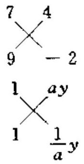
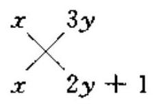
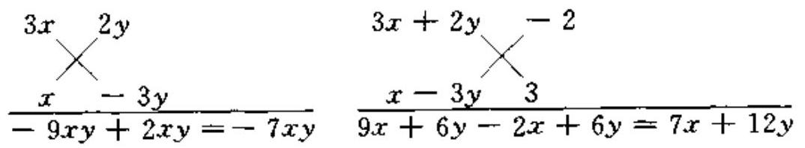
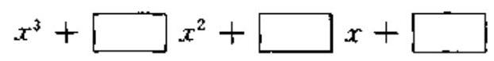

## 代数篇

## 第一讲 因式分解的方法 (一)

## 知识要点和基本方法

因式分解的基本方法有提公因式法、运用公式法、分组分解法和十字相乘法.

把一个多项式因式分解, 如果多项式的各项有公因式, 就先提取公因式, 公因式可以是数、单项式, 也可以是多项式; 如果各项没有公因式, 再看能否直接运用公式或用十字相乘法分解, 如果还不能分解, 就试用分组分解法或其他方法. 分解因式时, 必须进行到每一个多项式因式都不能再分解为止, 结果一定是乘积的形式, 每个因式都是整式,相同的因式的积要写成幂的形式.

考虑到与教科书同步, 本书中的因式分解 (第一讲至第四讲) 在有理数范围内进行. 凡在实数范围内可再分解的因式, 在说明中作了补充. 练习题和测试题只要求在有理数范围内求解.

## 例题精讲

例 1 把 ${\left( x - y\right) }^{{2n} + 1} - \left( {x - z}\right) {\left( x - y\right) }^{2n} + 2{\left( y - x\right) }^{2n}\left( {y - z}\right)$ 分解因式,其中 $n$ 是正整数.

解 ${\left( x - y\right) }^{{2n} + 1} - \left( {x - z}\right) {\left( x - y\right) }^{2n} + 2{\left( y - x\right) }^{2n}\left( {y - z}\right)$

$$
= {\left( x - y\right) }^{2n}\left\lbrack  {\left( {x - y}\right)  - \left( {x - z}\right)  + 2\left( {y - z}\right) }\right\rbrack
$$

$$
= {\left( x - y\right) }^{2n}\left( {y - z}\right) \text{.}
$$

说明 $n$ 是正整数时, ${2n}$ 是偶数, ${\left( x - y\right) }^{2n} = {\left( y - x\right) }^{2n};{2n} + 1$ 是奇数, ${\left( x - y\right) }^{{2n} + 1} =  - {\left( y - x\right) }^{{2n} + 1}$ .

例 2 把下列各式分解因式:

(1) ${\left( {a}^{2} + 9{b}^{2} - 1\right) }^{2} - {36}{a}^{2}{b}^{2}$ ;

(2) ${\left( ax - by\right) }^{3} + {\left( by - cz\right) }^{3} - {\left( ax - cz\right) }^{3}$ .

分析 观察两个多项式的特点, 第 (1) 题容易使人想到用平方差公式分解,第 (2) 题不妨用立方和 $\left\lbrack  {{a}^{3} + {b}^{3} = \left( {a + b}\right) \left( {{a}^{2} - {ab} + {b}^{2}}\right) }\right\rbrack$ 或立方差 $\left\lbrack  {{a}^{3} - {b}^{3} = \left( {a - b}\right) \left( {{a}^{2} + {ab} + {b}^{2}}\right) }\right\rbrack$ 公式试一试.

解 (1) ${\left( {a}^{2} + 9{b}^{2} - 1\right) }^{2} - {36}{a}^{2}{b}^{2}$

$$
= {\left( {a}^{2} + 9{b}^{2} - 1\right) }^{2} - {\left( 6ab\right) }^{2}
$$

$$
= \left( {{a}^{2} + 9{b}^{2} - 1 + {6ab}}\right) \left( {{a}^{2} + 9{b}^{2} - 1 - {6ab}}\right)
$$

$$
= \left\lbrack  {{\left( a + 3b\right) }^{2} - 1}\right\rbrack  \left\lbrack  {{\left( a - 3b\right) }^{2} - 1}\right\rbrack
$$

$$
= \left( {a + {3b} + 1}\right) \left( {a + {3b} - 1}\right) \left( {a - {3b} + 1}\right) \left( {a - {3b} - 1}\right) \text{.}
$$

(2) ${\left( ax - by\right) }^{3} + {\left( by - cz\right) }^{3} - {\left( ax - cz\right) }^{3}$

$$
= \left\lbrack  {\left( {{ax} - {by}}\right)  + \left( {{by} - {cz}}\right) }\right\rbrack  \left\lbrack  {{\left( ax - by\right) }^{2} - \left( {{ax} - {by}}\right) ({by}}\right.
$$

$$
- \left. {{cz}) + {\left( by - cz\right) }^{2}}\right\rbrack   - {\left( ax - cz\right) }^{3}
$$

$$
= \left( {{ax} - {cz}}\right) \left\lbrack  {{\left( ax - by\right) }^{2} - \left( {{ax} - {by}}\right) \left( {{by} - {cz}}\right)  + ({by} - }\right.
$$

$$
\left. {{cz}{)}^{2} - {\left( ax - cz\right) }^{2}}\right\rbrack
$$

$$
= \left( {{ax} - {cz}}\right) \left\lbrack  {{\left( ax - by\right) }^{2} - \left( {{ax} - {by}}\right) \left( {{by} - {cz}}\right) +({by} + }\right.
$$

$$
{ax} - {2cz})\left( {{by} - {ax}}\right) \rbrack
$$

$$
= \left( {{ax} - {cz}}\right) \left( {{ax} - {by}}\right) \left( {{3cz} - {3by}}\right)
$$

$$
= 3\left( {{ax} - {cz}}\right) \left( {{ax} - {by}}\right) \left( {{cz} - {by}}\right) \text{.}
$$

说明 第 (2) 题如果先由 ${\left( m + n\right) }^{3} = {m}^{3} + {n}^{3} + {3mn}\left( {m + n}\right)$ 推得 ${m}^{3} + {n}^{3} = {\left( m + n\right) }^{3} - {3mn}\left( {m + n}\right)$ ,把 ${ax} - {by}$ 视为 $m,{by} - {cz}$ 视为 $n$ ,则 $m + n = {ax} - {cz}$ ,从而能较简捷地将原式分解因式. 另外,由立方和公式可推得 ${\left( a + b + c\right) }^{3} = {a}^{3} + {b}^{3} + {c}^{3} + 3\left( {a + b}\right) (b$ $+ c)\left( {c + a}\right)$ ,变形得 ${a}^{3} + {b}^{3} + {c}^{3} = {\left( a + b + c\right) }^{3} - 3\left( {a + b}\right) (b +$ c) $\left( {c + a}\right)$ ,由这个公式也可将第 (2) 题分解因式.

例 3 把下列各式分解因式:

(1) ${x}^{3} + 2{x}^{2}y + {y}^{3} + {2x}{y}^{2}$ ;

(2) $\left( {x + y - {2xy}}\right) \left( {x + y - 2}\right)  + {\left( 1 - xy\right) }^{2}$ .

分析 (1)、(2)两题的多项式均无公因式可提取, 也不能直接用

2 / 奥数教程 $\cdot$ 初二年级公式法分解. 第 (1) 题从四项的特点看出应分组分解, 第 (2) 题宜把 $x + y\text{、}{xy}$ 各看成一个整体,去括号后再分组分解.

解 (1) ${x}^{3} + 2{x}^{2}y + {y}^{3} + {2x}{y}^{2}$

$$
= \left( {{x}^{3} + {y}^{3}}\right)  + \left( {2{x}^{2}y + {2x}{y}^{2}}\right)
$$

$$
= \left( {x + y}\right) \left( {{x}^{2} - {xy} + {y}^{2}}\right)  + {2xy}\left( {x + y}\right)
$$

$$
= \left( {x + y}\right) \left( {{x}^{2} + {xy} + {y}^{2}}\right) \text{.}
$$

(2) $\left( {x + y - {2xy}}\right) \left( {x + y - 2}\right)  + {\left( 1 - xy\right) }^{2}$

$$
= {\left( x + y\right) }^{2} - {2xy}\left( {x + y}\right)  - 2\left( {x + y}\right)  + {4xy} + 1 - {2xy}
$$

$$
+ {x}^{2}{y}^{2}
$$

$$
= \left\lbrack  {{\left( x + y\right) }^{2} - 2\left( {x + y}\right)  + 1}\right\rbrack   - {2xy}\left( {x + y - 1}\right)
$$

$$
+ {x}^{2}{y}^{2}
$$

$$
= {\left( x + y - 1\right) }^{2} - 2 \cdot  \left( {x + y - 1}\right)  \cdot  {xy} + {\left( xy\right) }^{2}
$$

$$
= {\left( x + y - 1 - xy\right) }^{2}
$$

$$
= {\left( x - 1\right) }^{2}{\left( y - 1\right) }^{2}\text{.}
$$

说明 将多项式分组的目的在于经过适当的分组后, 原多项式能转化为可提公因式, 或可运用公式, 或可用十字相乘等方法将其分解.

例 4 分解因式:

(1) ${63}{x}^{2} + {22x} - 8$ ;

(2) ${x}^{2} + \left( {a + \frac{1}{a}}\right) {xy} + {y}^{2}$ (其中 $a$ 是非零常数).

分析 第(1)题是二次三项式, 且不能用完全平方公式分解, 应试一试十字相乘法. 第(2)题中 ${xy}$ 的系数是 $a + \frac{1}{a}$ ,而 $a \cdot  \frac{1}{a} = 1$ ,所以可将 ${y}^{2}$ 化为 $\left( {ay}\right)  \cdot  \left( {\frac{1}{a}y}\right)$ ,再用十字相乘法分解.

解 (1) ${63}{x}^{2} + {22x} - 8$

$$
= \left( {{7x} + 4}\right) \left( {{9x} - 2}\right) \text{.}
$$

(2) ${x}^{2} + \left( {a + \frac{1}{a}}\right) {xy} + {y}^{2}$

$$
= \left( {x + {ay}}\right) \left( {x + \frac{1}{a}y}\right)
$$

$$
= \frac{1}{a}\left( {x + {ay}}\right) \left( {{ax} + y}\right) .
$$

例 5 分解因式:

(1) ${x}^{2} + x + 6{y}^{2} + {3y} + {5xy}$ ;

(2) $3{x}^{2} - {7xy} - 6{y}^{2} + {7x} + {12y} - 6$ .

分析 本题两个多项式是二元二次多项式, 可看作关于某个字母的二次三项式 (另一个字母看作常数), 运用十字相乘法分解; 也可把二次项作为一组先分解, 再用十字相乘法分解.

解 (1) ${x}^{2} + x + 6{y}^{2} + {3y} + {5xy}$

$$
= {x}^{2} + \left( {{5y} + 1}\right) x + \left( {6{y}^{2} + {3y}}\right)
$$

$$
= {x}^{2} + \left( {{5y} + 1}\right) x + {3y}\left( {{2y} + 1}\right)
$$

$$
= \left( {x + {3y}}\right) \left( {x + {2y} + 1}\right) \text{.}
$$

(2) $3{x}^{2} - {7xy} - 6{y}^{2} + {7x} + {12y} - 6$

$$
= \left( {{3x} + {2y}}\right) \left( {x - {3y}}\right)  + \left( {{7x} + {12y}}\right)  - 6
$$

$$
= \left( {{3x} + {2y} - 2}\right) \left( {x - {3y} + 3}\right) \text{.}
$$

例 6 已知二次三项式 ${x}^{2} - {mx} - 8\left( {m\text{是整数}}\right)$ 在整数范围内可以分解为两个一次因式的积,求 $m$ 的可能取值.

解 根据条件, 如果将 -8 分解为两个整数的积, 那么这两个整数的和即为 $- m$ .

因为 -8 分解为两个整数积的可能情形有

$$
\left( {-1}\right)  \times  8,\left( {-2}\right)  \times  4,\left( {-4}\right)  \times  2,\left( {-8}\right)  \times  1.
$$

所以 $- m$ 的可能值为

$$
\left( {-1}\right)  + 8,\left( {-2}\right)  + 4,\left( {-4}\right)  + 2,\left( {-8}\right)  + 1.
$$

故 $m$ 的可能取值有 $- 7, - 2,2,7$ 四个. 说明 如果题目的条件不是限定在整数范围内可以分解,那么 $m$ 的取值不能用本题的解法. 如果题目改为 ${x}^{2} - {8x} - m$ 在整数范围内可以分解因式,那么只要将 -8 拆成两个整数的和 (如 $- {50} + {42}, - 9 +$ 1). 这两个整数的积就等于 $- m$ ,因此,符合条件的 $m$ 有无数个.

例 7 在黑板上写有一个缺系数和常数项的多项式:

## 4 / 奥数教程 $\cdot$ 初二年级

现有两个人做填数字游戏: 第一个人在任一个空位内填上一个非零整数 (可正可负), 接着, 第二个人在剩下的二个空位置中任选一个填上一个整数, 最后, 第一个人在余下的空位上填一个整数.

求证:不管第二个人怎样填数,第一个人总能使所得到的多项式可分解为三个一次因式的积,并且每个因式的 $x$ 系数为 1,常数项为整数.

证明 因为第一个人有选择任一个空位的主动权, 所以他可以在 $x$ 前的框内填上-1,这样,原多项式变为

$$
{x}^{3} + \square {x}^{2} - x + \square
$$

第二个人不管在哪一个框内填数 $a$ ,第一个人只需在最后一个空框内填上第二个人所填数的相反数 $- a$ ；这样,原多项式就变成了

$$
{x}^{3} + a{x}^{2} - x - a\text{,或}{x}^{3} - a{x}^{2} - x + a\text{.}
$$

而 ${x}^{3} + a{x}^{2} - x - a$

$$
= x\left( {{x}^{2} - 1}\right)  + a\left( {{x}^{2} - 1}\right)
$$

$$
= \left( {x + a}\right) \left( {x + 1}\right) \left( {x - 1}\right) \text{.}
$$

$$
{x}^{3} - a{x}^{2} - x + a
$$

$$
= x\left( {{x}^{2} - 1}\right)  - a\left( {{x}^{2} - 1}\right)
$$

$$
= \left( {x - a}\right) \left( {x + 1}\right) \left( {x - 1}\right) \text{.}
$$

这就表明了第一个人总能使所填数符合要求.

## 练习 题

## A 组

## 一、选择题

1. 如果多项式 ${x}^{2} + {kx} + \frac{1}{9}$ 是一个完全平方式,那么 $k$ 的值

是 (   ).

(A) -3 (B) 3

(C) $\frac{1}{3}$ 或 $- \frac{1}{3}$ (D) $\frac{2}{3}$ 或 $- \frac{2}{3}$

2. 多项式 ${2a}\left( {{a}^{2} + a + 1}\right)  + {a}^{4} + {a}^{2} + 1$ 分解因式的结果为 (   ).

(A) ${\left( {a}^{2} + a - 1\right) }^{2}$ (B) ${\left( {a}^{2} - a + 1\right) }^{2}$

(C) ${\left( {a}^{2} + a + 1\right) }^{2}$ (D) ${\left( {a}^{2} - a - 1\right) }^{2}$

3. 已知 ${x}^{2} + {ax} - 6$ 可分解为两个一次因式的积,且 $a < 0$ ,则 $a$ 的值为 (   ).

(A) -2 和 -3 (B) -7 和 -4

(C) -1 或 -5 (D) 任意负有理数

## 二、把下列各式分解因式

4. ${\left( a + m\right) }^{5}{\left( n - b\right) }^{4} - {\left( b - n\right) }^{5}{\left( a + m\right) }^{5}$ .

5. ${x}^{3}\left( {x - {2y}}\right)  + {y}^{3}\left( {{2x} - y}\right)$ .

6. $\left( {x + y}\right) \left( {x - y}\right)  + 4\left( {y - 1}\right)$ .

7. ${x}^{2}y - {y}^{2}z + {z}^{2}x - {x}^{2}z + {y}^{2}x + {z}^{2}y - {2xyz}$ .

8. ${x}^{2} - \left( {{m}^{2} + {n}^{2}}\right) x + {mn}\left( {{m}^{2} - {n}^{2}}\right)$ .

## 三、解答题

9. 求出在 1 到 100 之间的整数 $n$ ,使 ${x}^{2} + x - n$ 能分解为两个整系数一次因式的乘积.

## B 组

## 四、把下列各式分解因式

10. ${\left( c - a\right) }^{2} - 4\left( {b - c}\right) \left( {a - b}\right)$ .

11. ${\left( 1 + x + {x}^{2} + {x}^{3}\right) }^{2} - {x}^{3}$ .

12. $\left( {{c}^{2} + {d}^{2} - {b}^{2} - {a}^{2}}\right)  - 4{\left( ab - cd\right) }^{2}$ .

13. ${x}^{2} - 6{y}^{2} - {12}{z}^{2} + {xy} - {xz} + {17yz}$ .

## 6 / 奥数教程・初二年级

14. ${a}^{4} + {b}^{4} + {c}^{4} - 2{a}^{2}{b}^{2} - 2{b}^{2}{c}^{2} - 2{a}^{2}{c}^{2}$

## 五、解答题

15. 已知乘法公式:

$$
{a}^{5} + {b}^{5} = \left( {a + b}\right) \left( {{a}^{4} - {a}^{3}b + {a}^{2}{b}^{2} - a{b}^{3} + {b}^{4}}\right) ,
$$

$$
{a}^{5} - {b}^{5} = \left( {a - b}\right) \left( {{a}^{4} + {a}^{3}b + {a}^{2}{b}^{2} + a{b}^{3} + {b}^{4}}\right) .
$$

利用上述公式,把 ${x}^{8} + {x}^{6} + {x}^{4} + {x}^{2} + 1$ 分解因式.

## 测 试 题

## 一、选择题

1. 如果 ${100}{x}^{2} - {kxy} + {49}{y}^{2}$ 是一个完全平方式,那么 $k$ 等于 (   ).

(A) 4900 (B) 700 (C) $\pm  {140}$ (D) $\pm  {70}$

2. 多项式 ${x}^{3} - 8,{x}^{3} - 7{x}^{2} + {10x},{x}^{4} - {16}$ 的公因式是 (   ).

(A) $x - 8$ (B) $x - 4$ (C) $x - 2$ (D) $x + 2$

3. 在多项式 ${x}^{3} + {x}^{2} - x - 1,{x}^{3} - 6{x}^{2} + {11x} - 6,{x}^{3} - 2{x}^{2}$ $+ {3x} - 2,{x}^{6} - {x}^{4} + 2{x}^{3} - 2{x}^{2}$ 中,有因式 $x - 1$ 的多项式的个数是(   ).

(A) 4 个 (B) 3 个 (C) 2 个 (D) 1 个

4. 已知二次三项式 ${21}{x}^{2} + {ax} - {10}$ 可分解为两个整系数的一次因式的积,那么 $a$ 一定是 (   ).

(A) 奇数 (B) 偶数 (C) 正数 (D) 负数

## 二、把下列各式分解因式

5. ${x}^{3} + 2{x}^{2} - {16x} - {32}$ .

6. $\left( {a - b}\right) {a}^{6} + \left( {b - a}\right) {b}^{6}$ .

7. $x\left( {x + 1}\right) \left( {x - 1}\right)  + {xy}\left( {x - y}\right)  - y\left( {y + 1}\right) \left( {y - 1}\right)$ .

8. $\left( {x + y}\right) \left( {x + y + {2xy}}\right)  + \left( {{xy} + 1}\right) \left( {{xy} - 1}\right)$ .

9. $2{a}^{2} - {5ab} - 3{b}^{2} + a + {11b} - 6$ .

## 三、解答题

10. 已知 ${21}{x}^{2} + {ax} + {21}$ 在正整数范围内可以分解为两个一次因式的积,求出满足条件的整数 $a$ .

## 第二讲 因式分解的方法 (二)

## 知识要点和基本方法

在这一讲里, 我们再学习几种因式分解的方法.

## 一、添项、拆项法

在分解因式时, 常要对多项式进行适当的变形, 使其能分组分解. 添项和拆项是两种重要的变形技巧. 所谓添项, 就是在要分解的多项式中加上仅仅符号相反的两项的和 (实际上是加上 0 , 并不改变原多项式的值),如把 ${a}^{4} + 4$ 添上 $4{a}^{2} + \left( {-4{a}^{2}}\right)$ ,得 ${a}^{4} + 4 = \left( {{a}^{4} + }\right.$ $\left. {4{a}^{2} + 4}\right)  - 4{a}^{2} = {\left( {a}^{2} + 2\right) }^{2} - {\left( 2a\right) }^{2}$ ,从而可将原多项式分解因式. 拆项是把多项式中某一项拆成两项或多项的代数和(相当于整式加法中合并同类项的逆运算), 再通过适当分组, 达到分解因式的目的.

## 二、换元法

有些复杂的多项式, 如果把其中某些部分看作一个整体, 用一个新的字母代替 (即换元), 不仅可使原式得到简化, 而且能使式子的特点更加明显. 这样先进行换元, 再将含 “新字母” 的多项式分解因式, 最后将“新字母”用原换的式子代回去, 得到原多项式的因式分解结果, 这种方法就是因式分解中的换元法, 或者说是换元法在因式分解中的应用.

## 三、待定系数法

有的多项式虽不能直接分解因式, 但可由式子的最高次数与系数的特点断定其分解结果的因式形式. 如只含一个字母的三次多项式分解的结果可能是一个一次二项式乘以一个二次三项式, 也可能是三个一次因式的积. 于是, 我们可以先假设要分解因式的多项式等于几个因式的积, 再根据恒等式的性质列出方程 (组), 进而确定其中的系数, 得到分解结果, 这种方法就称为待定系数法.

用待定系数法分解因式时需利用恒等式的如下重要性质:

如果 ${a}_{n}{x}^{n} + {a}_{n - 1}{x}^{n - 1} + \cdots  + {a}_{1}x + {a}_{0} \equiv  {b}_{n}{x}^{n} + {b}_{n - 1}{x}^{n - 1} + \cdots$ $+ {b}_{1}x + {b}_{0}$ ,那么 ${a}_{n} = {b}_{n},{a}_{n - 1} = {b}_{n - 1},\cdots ,{a}_{1} = {b}_{1},{a}_{0} = {b}_{0}$ . 即恒等式同次项的对应系数一定相等.

这里,“≡”表示“恒等于”,即对任何 $x$ 值,等式左边的值都等于右边的值.

## 四、利用因式定理分解

因式定理: 如果 $x = a$ 时,多项式 ${a}_{n}{x}^{n} + {a}_{n - 1}{x}^{n - 1} + \cdots  + {a}_{1}x +$ ${a}_{0}$ 的值为 0,那么 $x - a$ 是该多项式的一个因式.

对于系数全部是整数的多项式 ${a}_{n}{x}^{n} + {a}_{n - 1}{x}^{n - 1} + \cdots  + {a}_{1}x +$ ${a}_{0}$ ,如果 $x = \frac{q}{p}$ ( $p$ 、 $q$ 是互质的整数)时,该多项式的值为 0,也就是 $x - \frac{q}{p}$ 是该多项式的一个因式时,一定有 $p$ 是 ${a}_{n}$ 的约数, $q$ 是 ${a}_{0}$ 的约数.

对于 ${a}_{n} = 1$ 的特殊整系数多项式 (即系数全部是整数的多项式),如果 $x - q$ 是它的因式,那么 $q$ 一定是常数项的约数.

有了以上定理, 我们可以通过分解整系数多项式的最高次项系数和最低次项系数的因数, 组成一些分数, 并逐个试验, 找出整系数多项式的一个或几个因式, 然后再用多项式除以多项式的办法逐步分解.

## 例题精讲

例 1 把下列各式分解因式:

(1) ${x}^{4} + {x}^{2}{y}^{2} + {y}^{4}$ ;

(2) ${\left( 1 + y\right) }^{2} - 2{x}^{2}\left( {1 + {y}^{2}}\right)  + {x}^{4}{\left( 1 - y\right) }^{2}$ .

解 (1) ${x}^{4} + {x}^{2}{y}^{2} + {y}^{4}$

$$
= {x}^{4} + 2{x}^{2}{y}^{2} + {y}^{4} - {x}^{2}{y}^{2}
$$

$$
= {\left( {x}^{2} + {y}^{2}\right) }^{2} - {\left( xy\right) }^{2}
$$

10 / 奥数教程 $\cdot$ 初二年级