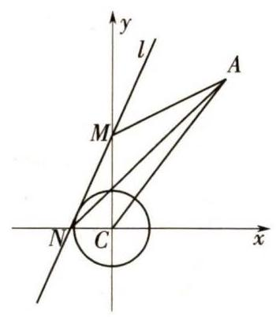
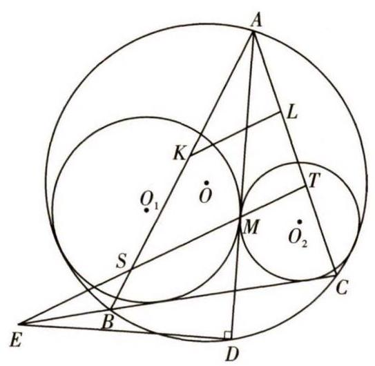
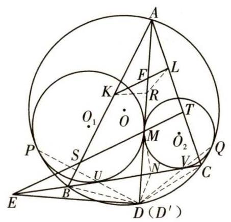
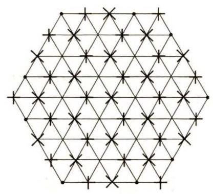
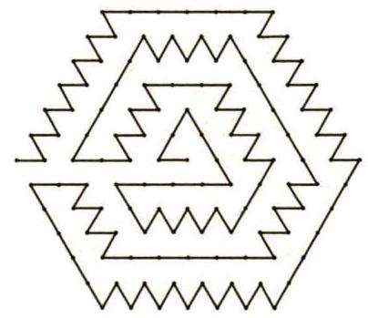
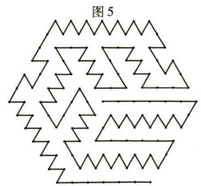

## 课外训练

# 数学奥林匹克高中训练题(247)

中图分类号:G424.79 文献标识码:A 文章编号:1005-6416(2020)01-0041-07

## 第一试

## 一、填空题(每小题 8 分,共 64 分)

1. 已知 $a\text{、}b$ 为不等的实数,且

${\left( \sqrt[3]{a} + \sqrt[3]{b}\right) }^{3} = {a}^{2}{b}^{2}.$

则 $\left( {{3a} + 1}\right) \left( {{3b} + 1}\right)  - 3{a}^{2}{b}^{2} =$ _____.

2. 在数列 $\left\{  {a}_{n}\right\}$ 中,

${a}_{1} = 1,{a}_{n + 1} + 2{a}_{n} + {3n} + 1 = 0,{b}_{n} = {a}_{n} + n.$

若 $2 \leq  m \leq  {100}, m \in  {\mathbf{Z}}_{ + }$ ,且

$\frac{{b}_{n} - m}{{b}_{n + 1} - m} = \frac{{b}_{m} + 2}{{b}_{m + 1} + 2},$

则 $m + n =$ _____.

3. 在三棱锥 $P - {ABC}$ 中, ${PA} = {BC} = 4,{PB}$ $= {AC} = 5,{PC} = {AB} = \sqrt{11}$ . 则三棱锥 $P - {ABC}$ 外接球的表面积为_____.

4. 已知 $m > 0$ ,关于 $x$ 的方程

$$
{\left( mx - 3 + \sqrt{2}\right) }^{2} - \sqrt{x + m} = 0
$$

在区间 $\left\lbrack  {0,1}\right\rbrack$ 上恰有两个不同的实根. 则实数 $m$ 的取值范围是_____.

5. 已知 $a > 0, b > 0, c > 1, a + b = 1$ . 则 $\left( {\frac{{2a} + b}{ab} - 3}\right) c + \frac{\sqrt{2}}{c - 1}$ 的最小值为_____.

6. 设 $a\text{、}b\text{、}c\text{、}d \in  \{  - 1,0,1\}$ . 若有序数组 (a, b, c, d)满足 $a + b\text{、}c + d\text{、}a + c\text{、}b + d$ 互不相同,则称(a, b, c, d)为 “好数组”. 所有的有序数组(a, b, c, d)中是好数组的概率为 _____.

7. 若不等式

$$
2{\sin }^{2}C + \sin A \cdot  \sin B > k\sin B \cdot  \sin C
$$

对任意的 $\bigtriangleup {ABC}$ 均成立,则实数 $k$ 的最大值为_____.

8. 已知一元三次方程

$$
{x}^{3} - {x}^{2} - {5x} - 1 = 0
$$

的三个不同的根为 ${x}_{1}\text{、}{x}_{2}\text{、}{x}_{3}$ . 则

$$
\left( {{x}_{1}^{2} - 4{x}_{1}{x}_{2} + {x}_{2}^{2}}\right) \left( {{x}_{2}^{2} - 4{x}_{2}{x}_{3} + {x}_{3}^{2}}\right) \left( {{x}_{3}^{2} - 4{x}_{3}{x}_{1} + {x}_{1}^{2}}\right)
$$

$=$ _____.

## 二、解答题(共 56 分)

9. (16 分) 已知函数 $f\left( x\right)  = x - \sqrt{x}$ . 若实数 $a\text{、}b$ 满足 $f\left( {a + 1}\right)  + f\left( {b + 2}\right)  = 3$ ,求 $a + b$ 的最大值和最小值.

10. (20 分) 如图 1, 在平面直角坐标系 ${xCy}$ 中,圆心在坐标原点 $C$ 、半径为 1 的圆的切线 $l$ 与 $x$ 轴交于点 $N$ 、与 $y$ 轴交于点 $M$ ,点 $A\left( {3,4}\right)$ ,且 $\overrightarrow{AC} =$ $x\overrightarrow{AM} + y\overrightarrow{AN}$ . 设点 $P\left( {x, y}\right)$ .

图 1

(1)求点 $P$ 的轨迹方程；

(2)求 $9{x}^{2} + {16}{y}^{2}$ 的最小值.

11. (20 分) 将 $1 \sim  {n}^{2}\left( {n \geq  2, n \in  \mathbf{N}}\right)$ 这 ${n}^{2}$ 个正整数随机填入 $n \times  n$ 方格表的 ${n}^{2}$ 个格中, 每格恰填一个数. 对于同行或同列的每一对数, 均计算较大数与较小数的比值, 在这 ${n}^{2}\left( {n - 1}\right)$ 个比值中的最小值,称为这一填数法的“特征值”. 证明: 对任意一种填数法, 其特征值不大于 $\frac{n + 1}{n}$ .

## 加试

一、(40 分) 设 $n \geq  2,{x}_{1},{x}_{2},\cdots ,{x}_{n}$ 为开区间(0,1)内的 $n$ 个两两不同的实数. 证明:

$$
\mathop{\sum }\limits_{{i = 1}}^{n}\mathop{\sum }\limits_{{j = 1}}^{n}{\left\{  {x}_{i} - {x}_{j}\right\}  }^{2} \geq  \frac{\left( {n - 1}\right) \left( {{2n} - 1}\right) }{6},
$$

其中, $\{ x\}  = x - \left\lbrack  x\right\rbrack  ,\left\lbrack  x\right\rbrack$ 表示不超过实数 $x$ 的最大整数.

二、(40 分) 如图 2, $\odot  {O}_{1}$ 与 $\odot  {O}_{2}$ 外切于点 $M$ ,且均与 $\odot  O$ 内切, ${AD}$ 为 $\odot  {O}_{1}\text{、} \odot  {O}_{2}$ 的内公切线,点 $A\text{、}D$ 在 $\odot  O$ 上, ${BC}$ 为 $\odot  {O}_{1}\text{、} \odot  {O}_{2}$ 的外公切线,点 $B\text{、}C$ 均在 $\odot  O$ 上. 点 $E$ 在 ${BC}$ 的延长线上,使得 ${DE} \bot  {AD}$ ,联结 ${EM}$ ,与 ${AB}$ 、 ${AC}$ 分别交于点 $S\text{、}T$ . 设 $K\text{、}L$ 分别为边 ${AB}\text{、}{AC}$ 上的旁切圆的切点. 证明: ${KL}//{ST}$ .

图 2

三、(50 分) 设 $p = {4n} + 1\left( {n \in  {\mathbf{Z}}_{ + }}\right)$ 为素数,集合 $\{ 1,3,5,\cdots , p - 2\}$ 中是模 $p$ 的二次剩余的数组成集合 $A$ ,不是模 $p$ 的二次剩余的数组成集合 $B$ . 求 ${\left( \mathop{\sum }\limits_{{a \in  A}}\cos \frac{a\pi }{p}\right) }^{2} + {\left( \mathop{\sum }\limits_{{b \in  B}}\cos \frac{b\pi }{p}\right) }^{2}$ .

四、(50 分) 在边长为 $n$ 的正六边形网格 (蜂巢产卵区) 中,六边形被划分成了 $6{n}^{2}$ 个边长为 1 的正三角形. 定义 “完美产程”: 一只蜂后从正六边形的中心出发, 每一次沿着三角形的边界走到某个顶点上, 在该顶点上产卵,蜂后不能重复经过产过卵的顶点,并且每一次到达一个顶点产卵后, 蜂后只能继续直爬或向左、右之一旋转 ${120}^{ \circ  }$ 爬行,在所有顶点产过卵且最后一次产卵的顶点是正六边形网格 (蜂巢产卵区) 边界上, 从而蜂后可以顺利离开产卵区.

(1)证明: 对于任意的 $n \equiv  1\left( {\;\operatorname{mod}\;3}\right)$ ,蜂后不可能有完美产程.

(2)当 $n = 6$ 时,蜂后有完美产程吗？若没有, 给出理由; 若有, 给出一个完美产程方案.

## 参考答案

## 第一试

-,1.1.

由 ${\left( \sqrt[3]{a} + \sqrt[3]{b}\right) }^{3} = {a}^{2}{b}^{2} \Rightarrow  \sqrt[3]{a} + \sqrt[3]{b} = \sqrt[3]{{a}^{2}{b}^{2}}$ .

令 $x = \sqrt[3]{a}, y = \sqrt[3]{b}, z = \sqrt[3]{{a}^{2}{b}^{2}}$ . 则

$x + y = z$ .

故 $\left( {{3a} + 1}\right) \left( {{3b} + 1}\right)  - 3{a}^{2}{b}^{2}$

$= 3\left( {a + b + {3ab} - {a}^{2}{b}^{2}}\right)  + 1$

$= 3\left( {{x}^{3} + {y}^{3} + {3xyz} - {z}^{3}}\right)  + 1$ .

由 ${x}^{3} + {y}^{3} + {3xyz} - {z}^{3}$

$= {x}^{3} + {y}^{3} + {3xy}\left( {x + y}\right)  - {\left( x + y\right) }^{3} = 0$

$\Rightarrow  \left( {{3a} + 1}\right) \left( {{3b} + 1}\right)  - 3{a}^{2}{b}^{2} = 1$ .

2.9 或 35 或 133 .

由题意知

$$
\frac{{b}_{n + 1}}{{b}_{n}} = \frac{{a}_{n + 1} + n + 1}{{a}_{n} + n}.
$$

因为 ${a}_{n + 1} + 2{a}_{n} + {3n} + 1 = 0$ ,所以,

${a}_{n + 1} =  - 2{a}_{n} - {3n} - 1$ .

则 $\frac{{b}_{n + 1}}{{b}_{n}} = \frac{-2{a}_{n} - {3n} - 1 + n + 1}{{a}_{n} + n}$

$= \frac{-2\left( {{a}_{n} + n}\right) }{{a}_{n} + n} =  - 2$

$\Rightarrow  {b}_{n} = {b}_{1}{q}^{n - 1} =  - {\left( -2\right) }^{n}$ .

又由题意知

$$
\frac{-{\left( -2\right) }^{n} - m}{-{\left( -2\right) }^{n + 1} - m} = \frac{-{\left( -2\right) }^{m} + 2}{-{\left( -2\right) }^{m + 1} + 2}
$$

$$
\Rightarrow  {\left( -2\right) }^{n + 1} - m{\left( -2\right) }^{m} = 0
$$

$$
\Rightarrow  m = {\left( -2\right) }^{n - m + 1}\text{.}
$$

因为 $2 \leq  m \leq  {100}, m \in  \mathbf{N}$ ,所以,

$2 \leq  {\left( -2\right) }^{n - m + 1} \leq  {100}.$

于是, $n - m + 1$ 的值为 2 或 4 或 6 .

当 $n - m + 1 = 2$ 时, $m = 4, n = 5$ ,符合题意,此时, $m + n = 9$ ;

当 $n - m + 1 = 4$ 时, $m = {16}, n = {19}$ ,符合题意,此时, $m + n = {35}$ ;

当 $n - m + 1 = 6$ 时, $m = {64}, n = {69}$ ,符合题意,此时, $m + n = {133}$ .

综上, $m + n$ 的值为 9 或 35 或 133 .

3. ${26\pi }$ .

由题意,知三棱锥 $P - {ABC}$ 为等腰四面体. 于是,其可内置于一个长为 $a$ 、宽为 $b$ 、高为 $c$ 的长方体中,长方体的体对角线为

$$
\sqrt{{a}^{2} + {b}^{2} + {c}^{2}} = \sqrt{26}\text{.}
$$

故所求外接球表面积为

$$
S = {4\pi }{R}^{2} = {26\pi }\text{.}
$$

4. $\left\lbrack  {3,{193} - {132}\sqrt{2}}\right\rbrack$ .

设 $f\left( x\right)  = {\left( mx - 3 + \sqrt{2}\right) }^{2}, g\left( x\right)  = \sqrt{x + m}$ .

结合图像知 $m$ 满足

$$
\left\{  \begin{array}{l} f\left( 0\right)  \geq  g\left( 0\right) , \\  f\left( 1\right)  \geq  g\left( 1\right) , \\  0 < \frac{3 - \sqrt{2}}{m} < 1. \end{array}\right.
$$

①

②

③

由式① $\Rightarrow  m \leq  {193} - {132}\sqrt{2}$ .

由式 ③ $\Rightarrow  m > 3 - \sqrt{2}$ .

由式②得

$$
{\left( m - 3 + \sqrt{2}\right) }^{2} \geq  \sqrt{1 + m},
$$

④

结合图像知 ${\left( m - 3 + \sqrt{2}\right) }^{2} = \sqrt{1 + m}$ 恰有两个实根 ${m}_{1}\text{、}{m}_{2}$ 且 ${m}_{1} < 3 - \sqrt{2} < {m}_{2}$ .

则由式 ④ $\Rightarrow   - 1 \leq  m \leq  {m}_{1}$ 或 $m \geq  {m}_{2}$ .

显然, ${m}_{2} = 3$ .

综上, $m \in  \left\lbrack  {3,{193} - {132}\sqrt{2}}\right\rbrack$ .

5. $4 + 2\sqrt{2}$ .

由题意知

$\frac{{2a} + b}{ab} - 3 = \frac{\left( {{2a} + b}\right) \left( {a + b}\right) }{ab} - 3$

$$
= \frac{2a}{b} + \frac{b}{a} \geq  2\sqrt{2}\text{.}
$$

则 $\left( {\frac{{2a} + b}{ab} - 3}\right) c + \frac{\sqrt{2}}{c - 1} \geq  2\sqrt{2}c + \frac{\sqrt{2}}{c - 1}$

$$
= 2\sqrt{2}\left( {c - 1}\right)  + \frac{\sqrt{2}}{c - 1} + 2\sqrt{2}
$$

$$
\geq  4 + 2\sqrt{2}\text{,}
$$

当 $a = \sqrt{2} - 1, b = 2 - \sqrt{2}, c = \frac{\sqrt{2}}{2} + 1$ 时,上式等号成立.

6. $\frac{16}{81}$ .

易知,总共有 ${3}^{4} = {81}$ 种不同的有序数对 (a, b, c, d).

对于好数对(a, b, c, d),知 $a \neq  d, b \neq  c$ , 而只有三个数可以选择, 必有两个数相同.

不妨假设 $a = b$ ,则 $c \neq  d$ . 于是, $b\text{、}c\text{、}d$ 两两不相同,且 $b \neq  0$ (若 $b = 0$ ,则 $c + d\text{、}a + c$ 、 $b + d$ 中必然有一个也为 0 ). 从而,只能

$$
\left( {a, b, c, d}\right)
$$

$$
= \left( {1,1,0, - 1}\right) ,\left( {1,1, - 1,0}\right) \text{,}
$$

$\left( {-1, - 1,0,1}\right) ,\left( {-1, - 1,1,0}\right)$ .

故好数对总共有 $4 \times  4 = {16}$ 种.

因此,所求概率为 $\frac{16}{81}$ .

7. $2\sqrt{2} - 1$ .

由题意知

$k < \frac{2{\sin }^{2}C + \sin A \cdot  \sin B}{\sin B \cdot  \sin C} = \frac{2{c}^{2} + {ab}}{bc}.$

又 $\frac{2{c}^{2} + {ab}}{bc} = \frac{2c}{b} + \frac{a}{c}$

$> \frac{2c}{b} + \frac{b - c}{c} = \frac{2c}{b} + \frac{b}{c} - 1$

$\geq  2\sqrt{2} - 1$ ,

从而, $k$ 的最大值为 $2\sqrt{2} - 1$ .

8. 444.

已知方程因式分解得

$\left( {x - {x}_{1}}\right) \left( {x - {x}_{2}}\right) \left( {x - {x}_{3}}\right)  = 0.$

则 ${x}_{1} + {x}_{2} + {x}_{3} = 1$ ,

${x}_{1}{x}_{2} + {x}_{2}{x}_{3} + {x}_{3}{x}_{1} =  - 5,{x}_{1}{x}_{2}{x}_{3} = 1$ .

又 ${x}_{1}^{3} = {x}_{1}^{2} + 5{x}_{1} + 1,{x}_{2}^{3} = {x}_{2}^{2} + 5{x}_{2} + 1$ ,

${x}_{3}^{3} = {x}_{3}^{2} + 5{x}_{3} + 1,$

得 ${x}_{1}^{2} - 4{x}_{1}{x}_{2} + {x}_{2}^{2} = \frac{{x}_{1}^{3} - {x}_{2}^{3}}{{x}_{1} - {x}_{2}} - 5{x}_{1}{x}_{2}$

$= \frac{\left( {{x}_{1}^{2} + 5{x}_{1} + 1}\right)  - \left( {{x}_{2}^{2} + 5{x}_{2} + 1}\right) }{{x}_{1} - {x}_{2}} - 5{x}_{1}{x}_{2}$

$= {x}_{1} + {x}_{2} + 5 - 5{x}_{1}{x}_{2} = 1 - {x}_{3} + 5 - \frac{5}{{x}_{3}}$

$=  - \frac{1}{{x}_{3}}\left( {{x}_{3}^{2} - 6{x}_{3} + 5}\right)$

$=  - \frac{1}{{x}_{3}}\left( {{x}_{3} - 1}\right) \left( {{x}_{3} - 5}\right)$ .

记 $f\left( x\right)  = {x}^{3} - {x}^{2} - {5x} - 1$

$= \left( {x - {x}_{1}}\right) \left( {x - {x}_{2}}\right) \left( {x - {x}_{3}}\right) .$

故 $\left( {{x}_{1}^{2} - 4{x}_{1}{x}_{2} + {x}_{2}^{2}}\right) \left( {{x}_{2}^{2} - 4{x}_{2}{x}_{3} + {x}_{3}^{2}}\right)$ .

$$
\left( {{x}_{3}^{2} - 4{x}_{3}{x}_{1} + {x}_{1}^{2}}\right)
$$

$=  - \frac{1}{{x}_{1}{x}_{2}{x}_{3}}f\left( 1\right) f\left( 5\right)$

$=  - f\left( 1\right) f\left( 5\right)  = {444}$ .

二、9. 由 $f\left( {a + 1}\right)  + f\left( {b + 2}\right)  = 3$ ,知

$a + b = \sqrt{a + 1} + \sqrt{b + 2}.$

又 $a + b = \sqrt{a + 1} + \sqrt{b + 2}$

$\leq  2\sqrt{\frac{a + 1 + b + 2}{2}} = 2\sqrt{\frac{a + b + 3}{2}}$ ,

故 $a + b \leq  1 + \sqrt{7}$ ,当 $a = 1 + \frac{\sqrt{7}}{2}, b = \frac{\sqrt{7}}{2}$ 时, $a + b$ 取到最大值 $1 + \sqrt{7}$ .

令 $m = \sqrt{a + 1}, n = \sqrt{b + 2}$ . 则

$a = {m}^{2} - 1, b = {n}^{2} - 2$ .

故 ${\left( m - \frac{1}{2}\right) }^{2} + {\left( n - \frac{1}{2}\right) }^{2} = \frac{7}{2}$ .

显然, $m \geq  0, n \geq  0$ .

又 $a + b = \sqrt{a + 1} + \sqrt{b + 2} = m + n$ ,结合图像知 $m + n$ 的最小值为 $\frac{1 + \sqrt{13}}{2}$ ,当 $a =  - 1$ , $b = \frac{3 + \sqrt{13}}{2}$ 或 $a = \frac{5 + \sqrt{13}}{2}, b =  - 2$ 时, $a + b$ 的最小值为 $\frac{1 + \sqrt{13}}{2}$ .

10. (1) 设点 $M\left( {0, m}\right) , N\left( {n,0}\right)$ .

由 $\overrightarrow{AC} = x\overrightarrow{AM} + y\overrightarrow{AN}$

$\Rightarrow  \left\{  \begin{array}{l} {3x} + \left( {3 - n}\right) y = 3, \\  \left( {4 - m}\right) x + {4y} = 4 \end{array}\right.$

$\Rightarrow  \left\{  \begin{array}{l} m = \frac{4\left( {x + y - 1}\right) }{x}, \\  n = \frac{3\left( {x + y - 1}\right) }{y} \end{array}\right.$

$$
\Rightarrow  1 = \frac{1}{{m}^{2}} + \frac{1}{{n}^{2}}
$$

$$
= {\left( \frac{x}{4\left( {x + y - 1}\right) }\right) }^{2} + {\left( \frac{y}{3\left( {x + y - 1}\right) }\right) }^{2}
$$

$$
\Rightarrow  \frac{{x}^{2}}{16} + \frac{{y}^{2}}{9} = {\left( x + y - 1\right) }^{2}\text{.}
$$

因为 $\left| m\right|  > 1$ 且 $\left| n\right|  > 1$ ,所以, $x \neq  0$ 且 $y \neq  0$ .

于是,点 $P$ 的轨迹方程为

$$
\frac{{x}^{2}}{16} + \frac{{y}^{2}}{9} = {\left( x + y - 1\right) }^{2}\left( {x \neq  0\text{ 且 }y \neq  0}\right) .
$$

(2)因为 $x$ 、 $y$ 满足

$$
\frac{{x}^{2}}{16} + \frac{{y}^{2}}{9} = {\left( x + y - 1\right) }^{2},
$$

所以, $9{x}^{2} + {16}{y}^{2} = {144}\left( {\frac{{x}^{2}}{16} + \frac{{y}^{2}}{9}}\right)  = {144}{\left( x + y - 1\right) }^{2}$ .

设 $z = x + y$ . 则

$$
\frac{{x}^{2}}{16} + \frac{{\left( z - x\right) }^{2}}{9} = {\left( z - 1\right) }^{2}.
$$

故 ${25}{x}^{2} - {32zx} + {16}{z}^{2} - {144}{\left( z - 1\right) }^{2} = 0$ 有解, 即

$$
\Delta  = {\left( -{32}z\right) }^{2} - 4 \times  {25}\left( {{16}{z}^{2} - {144}{\left( z - 1\right) }^{2}}\right)  \geq  0
$$

$$
\Rightarrow  z \geq  \frac{5}{4}\text{或}z \leq  \frac{5}{6}\text{.}
$$

从而,当 $x + y = \frac{5}{6}$ ,即 $x = \frac{8}{15}, y = \frac{3}{10}$ 时, $9{x}^{2} + {16}{y}^{2} = {144}{\left( x + y - 1\right) }^{2}$ 取得最小值 4 .

11. 不妨设 $A$ 为任意一种填数法,记此填数法的特征值为 $C\left( A\right)$ .

考虑含 $n + 1$ 个元素的集合

$$
B = \left\{  {{n}^{2},{n}^{2} - 1,{n}^{2} - 2,\cdots ,{n}^{2} - n}\right\}  .
$$

易知, 其中必有至少两个数处于同一行 (记为 ${x}_{1} < {x}_{2} \leq  {n}^{2}$ ),也必有至少两个数处于同一列 (设为 ${y}_{1} < {y}_{2} \leq  {n}^{2}$ ).

若 $\max \left\{  {{x}_{1},{y}_{1}}\right\}   \geq  {n}^{2} - n + 1$ ,则

$$
C\left( A\right)  \leq  \frac{{n}^{2}}{\max \left\{  {{x}_{1},{y}_{1}}\right\}  } \leq  \frac{{n}^{2}}{{n}^{2} - n + 1}
$$

$$
< \frac{{n}^{2} - 1}{{n}^{2} - n} = \frac{n + 1}{n}.
$$

若 $\max \left\{  {{x}_{1},{y}_{1}}\right\}   < {n}^{2} - n + 1$ ,则

$$
\max \left\{  {{x}_{1},{y}_{1}}\right\}   = {n}^{2} - n \Rightarrow  {x}_{1} = {y}_{1} = {n}^{2} - n
$$

$$
\Rightarrow  {x}_{2} \neq  {y}_{2} \Rightarrow  \min \left\{  {{x}_{2},{y}_{2}}\right\}   \leq  {n}^{2} - 1
$$

$$
\Rightarrow  C\left( A\right)  \leq  \frac{\min \left\{  {{x}_{2},{y}_{2}}\right\}  }{{n}^{2} - n} \leq  \frac{{n}^{2} - 1}{{n}^{2} - n} = \frac{n + 1}{n}.
$$

因此, 对任意一种填数法, 其特征值不大于 $\frac{n + 1}{n}$ .

## 加试

## 一、由对称性, 不妨设

$0 < {x}_{1} < {x}_{2} < \cdots  < {x}_{n} < 1$ .

将 ${x}_{i}$ 的角标按模 $n$ 理解. 则

$$
\mathop{\sum }\limits_{{i = 1}}^{n}\mathop{\sum }\limits_{{j = 1}}^{n}{\left\{  {x}_{i} - {x}_{j}\right\}  }^{2} = \mathop{\sum }\limits_{\substack{{1 \leq  i, j \leq  n} \\  {i \neq  j} }}{\left\{  {x}_{i} - {x}_{j}\right\}  }^{2}
$$

$$
= \mathop{\sum }\limits_{{r = 1}}^{{n - 1}}\mathop{\sum }\limits_{{i = 1}}^{n}{\left\{  {x}_{i + r} - {x}_{i}\right\}  }^{2}
$$

$$
\geq  \mathop{\sum }\limits_{{r = 1}}^{{n - 1}}\frac{1}{n}{\left( \mathop{\sum }\limits_{{i = 1}}^{n}\left\{  {x}_{i + r} - {x}_{i}\right\}  \right) }^{2}
$$

$$
= \frac{1}{n}\mathop{\sum }\limits_{{r = 1}}^{{n - 1}}{\left( \mathop{\sum }\limits_{{i = 1}}^{n}\left\{  {x}_{i + r} - {x}_{i}\right\}  \right) }^{2}
$$

$$
= \frac{1}{n}\mathop{\sum }\limits_{{r = 1}}^{{n - 1}}\left( {\mathop{\sum }\limits_{{i = 1}}^{{n - r}}\left( {{x}_{i + r} - {x}_{i}}\right)  + }\right.
$$

$$
{\left. \mathop{\sum }\limits_{{i = n - r + 1}}^{n}\left( 1 + {x}_{i + r} - {x}_{i}\right) \right) }^{2}
$$

$$
= \frac{1}{n}\mathop{\sum }\limits_{{r = 1}}^{{n - 1}}{\left( r + \mathop{\sum }\limits_{{i = 1}}^{n}{x}_{i + r} - \mathop{\sum }\limits_{{i = 1}}^{n}{x}_{i}\right) }^{2}
$$

$$
= \frac{1}{n}\mathop{\sum }\limits_{{r = 1}}^{{n - 1}}{r}^{2} = \frac{\left( {n - 1}\right) \left( {{2n} - 1}\right) }{6}\text{.}
$$

二、如图 3,设 $P\text{、}Q$ 分别为 $\odot  O$ 与 $\odot  {O}_{1}$ 、 $\odot  {O}_{2}$ 的切点, $\odot  {O}_{1}\text{、} \odot  {O}_{2}$ 与 ${BC}$ 的切点分别为 $U\text{、}V$ ,联结并延长 ${PU}\text{、}{QV}$ ,交于点 ${D}^{\prime }$ .

图 3

由位似的基本性质知

点 ${D}^{\prime }$ 在 $\odot  O$ 上,且 $\overset{⏜}{B{D}^{\prime }} = \overset{⏜}{C{D}^{\prime }}$

$\Rightarrow  \angle {PQ}{D}^{\prime } = \angle {CU}{D}^{\prime }$

$\Rightarrow  P\text{、}U\text{、}V\text{、}Q$ 四点共圆.

由 ${D}^{\prime }U \cdot  {D}^{\prime }P = {D}^{\prime }V \cdot  {D}^{\prime }Q$

$\Rightarrow$ 点 ${D}^{\prime }$ 在两圆根轴上

$\Rightarrow$ 点 $D$ 与 ${D}^{\prime }$ 重合.

联结 ${DB}\text{、}{DC}$ .

则 $\angle {CBD} = \angle {BPD}$

$\Rightarrow  B{D}^{2} = {DU} \cdot  {DP} = D{M}^{2}$

$\Rightarrow  {DM} = {BD}$ .

类似地, ${DM} = {DC}$ .

从而, $M$ 为 $\bigtriangleup {ABC}$ 的内心.

设 $N$ 为点 $M$ 在 ${BC}$ 上的垂足, $R$ 为 ${AD}$ 上一点使得 ${KR} = {LR},{KL}$ 与 ${AD}$ 交于点 $F$ .

设 $\bigtriangleup {ABC}$ 的 $\angle A\text{、}\angle B\text{、}\angle C$ 对应的边为 $a\text{、}b\text{、}c$ .

由内心、旁心性质得

$\frac{AK}{AL} = \frac{a - b + c}{a + b - c},\frac{BN}{NC} = \frac{a - b + c}{a + b - c}.$

于是, $\frac{AK}{AL} = \frac{BN}{NC}$ .

又 $M$ 为 $\bigtriangleup {ABC}$ 的内心

$\Rightarrow  \angle {KAF} = \angle {LAF}$ .

从而, $\frac{AK}{AL} = \frac{KF}{FL}$ .

故 $\frac{BN}{NC} = \frac{KF}{FL}$ .①

因为 $\angle {KAR} = \angle {LAR},{KR} = {LR}$ ,所以, $A$ 、 $K\text{、}R\text{、}L$ 四点共圆.

于是, $\angle {KRL} = \angle {BDC}$ .

从而, $\bigtriangleup {KRL} \backsim  \bigtriangleup {BDC}$ .

结合式①得 $\angle {KFR} = \angle {BND}$ .

由 $\angle {MDE} = \angle {MNE} = {90}^{ \circ  }$

$\Rightarrow  M\text{、}N\text{、}D\text{、}E$ 四点共圆

$$
\Rightarrow  \angle {END} = \angle {EMD}
$$

$$
\Rightarrow  \angle {KFR} = \angle {BND} = \angle {END} = \angle {EMD}
$$

$$
\Rightarrow  {KL}//{ST}\text{.}
$$

三、因为素数 $p$ 形如 ${4n} + 1$ ,所以,-1 为模 $p$ 的二次剩余.

于是,当整数 $a$ 为 (不为) 模 $p$ 的二次剩余时,同样 $p - a$ 为 (不为) 模 $p$ 的二次剩余.

记 ${A}^{\prime } = A \cup  \{ p - a \mid  a \in  A\}$ ,

$$
{B}^{\prime } = B \cup  \{ p - b \mid  b \in  B\} \text{.}
$$

则 ${A}^{\prime } \cup  {B}^{\prime }$ 构成模 $p$ 的一个简化剩余系, 且 ${A}^{\prime }$ 为其中的二次剩余的数, ${B}^{\prime }$ 为其中的二次非剩余的数.

令 $\omega  = {\mathrm{e}}^{\frac{\pi \mathrm{i}}{p}}$ ,记

$S = \mathop{\sum }\limits_{{a \in  A}}\cos \frac{a\pi }{p}, T = \mathop{\sum }\limits_{{b \in  B}}\cos \frac{b\pi }{p}.$

则 $S = \frac{1}{2}\mathop{\sum }\limits_{{a \in  A}}\left( {{\omega }^{a} + {\omega }^{-a}}\right)$

$$
= \frac{1}{2}\mathop{\sum }\limits_{{a \in  A}}\left( {{\omega }^{a} - {\omega }^{p - a}}\right)  = \frac{1}{2}\mathop{\sum }\limits_{{k \in  {A}^{\prime }}}{\left( -1\right) }^{k - 1}{\omega }^{k}.
$$

类似地, $T = \frac{1}{2}\mathop{\sum }\limits_{{t \in  {B}^{\prime }}}{\left( -1\right) }^{t - 1}{\omega }^{t}$ .

故 $S + T = \frac{1}{2}\mathop{\sum }\limits_{{k = 1}}^{{p - 1}}{\left( -1\right) }^{k - 1}{\omega }^{k}$

$$
= \frac{1}{2} - \frac{1}{2}\mathop{\sum }\limits_{{k = 0}}^{{p - 1}}{\left( -1\right) }^{k}{\omega }^{k} = \frac{1}{2}\text{.}
$$

对于任意的整数 $x$ ,记 $\phi \left( x\right)  = {\left( -1\right) }^{x}{\omega }^{x}$ .

易验证,当 ${x}_{1} \equiv  {x}_{2}\left( {\;\operatorname{mod}\;p}\right)$ 时,

$\phi \left( {x}_{1}\right)  = \phi \left( {x}_{2}\right) .$

则 ${ST} = \frac{1}{4}\mathop{\sum }\limits_{{x \in  {A}^{\prime }}}\mathop{\sum }\limits_{{y \in  {B}^{\prime }}}{\left( -1\right) }^{x + y}{\omega }^{x + y}$

$$
= \frac{1}{4}\mathop{\sum }\limits_{{k = 1}}^{{p - 1}}{c}_{k}\phi \left( k\right) ,
$$

其中, ${C}_{k} = \left\{  {\left( {x, y}\right)  \mid  x \in  {A}^{\prime }, y \in  {B}^{\prime }}\right.$ ,

$$
x + y \equiv  k\left( {\;\operatorname{mod}\;p}\right) \} ,
$$

${c}_{k} = \left| {C}_{k}\right|$ .

下面证明所有的 ${c}_{k} = n$ .

对每个 $k = 1,2,\cdots , p - 1$ ,构造一一映射 ${f}_{k} : {C}_{1} \rightarrow  {C}_{k}$ : 对每个整数 $x$ ,用 $\bar{x}$ 表示 $x$ 被 $p$ 除的余数.

(1) $k$ 为模 $p$ 的二次剩余.

则 ${f}_{k}\left( {x, y}\right)  = \left( {\overline{kx},\overline{ky}}\right)$ .

易验证, ${f}_{k}$ 为一一映射.

(2) $k$ 不为模 $p$ 的二次剩余.

则 ${f}_{k}\left( {x, y}\right)  = \left( {\overline{ky},\overline{kx}}\right)$ .

易验证, ${f}_{k}$ 为一一映射.

由 $\left( 1\right) \text{、}\left( 2\right)$ ,知所有的 ${c}_{k}$ 均相等.

又 $\mathop{\bigcup }\limits_{{k = 1}}^{{p - 1}}{C}_{k} = {A}^{\prime } \times  {B}^{\prime }$ ,于是,对每个 $k = 1,2$ , $\cdots , p - 1,{c}_{k} = \frac{{\left( 2n\right) }^{2}}{p - 1} = n$ . 则 ${ST} = \frac{1}{4}\mathop{\sum }\limits_{{k = 1}}^{{p - 1}}{c}_{k}\phi \left( k\right)  = \frac{n}{4}\mathop{\sum }\limits_{{k = 1}}^{{p - 1}}\phi \left( k\right)$ $= \frac{n}{4}\mathop{\sum }\limits_{{k = 1}}^{{p - 1}}{\left( -1\right) }^{k}{\omega }^{k}$ $= \frac{n}{4}\left( {\mathop{\sum }\limits_{{k = 0}}^{{p - 1}}{\left( -1\right) }^{k}{\omega }^{k} - 1}\right)$ $= \frac{n}{4}\mathop{\sum }\limits_{{k = 0}}^{{p - 1}}{\left( -1\right) }^{k}{\omega }^{k} - \frac{n}{4} =  - \frac{n}{4}$ . 故 ${\left( \mathop{\sum }\limits_{{a \in  A}}\cos \frac{a\pi }{p}\right) }^{2} + {\left( \mathop{\sum }\limits_{{b \in  B}}\cos \frac{b\pi }{p}\right) }^{2}$

$$
= {S}^{2} + {T}^{2} = {\left( S + T\right) }^{2} - {2ST}
$$

$$
= \frac{{2n} + 1}{4} = \frac{p + 1}{8}\text{.}
$$

四、(1) 由题意,知图中有 $3{n}^{2} + {3n} + 1$ 个顶点. 故

$$
3{n}^{2} + {3n} + 1 \equiv  1\left( {\;\operatorname{mod}\;3}\right) .
$$

将蜂后爬行 $k$ 次后的所在顶点记为 ${A}_{k}$ ( ${A}_{0}$ 为起始中心位置).

将 ${A}_{3i}\left( {i = 0,1,\cdots ,{n}^{2} + n}\right)$ 标为 “ $\times$ ”, $\times$ 代表红色;

将 ${A}_{{3i} + 1}\left( {i = 0,1,\cdots ,{n}^{2} + n - 1}\right)$ 不标记, 不标记代表白色;

将 ${A}_{{3i} + 2}\left( {i = 0,1,\cdots ,{n}^{2} + n - 1}\right)$ 标为 “+”,+代表蓝色.

对正六边形网格进行三染色, 每个点恰染一种颜色, 使得这种染法是较为均匀的 (如图 4).

图 4

于是, 对蜂后的完美产程:

(i)经过的顶点颜色必为红蓝白或红白蓝循环, 从而, 若存在完美产程, 则由

$$
3{n}^{2} + {3n} + 1 \equiv  1\left( {\;\operatorname{mod}\;3}\right) ,
$$

知红色的点为 ${n}^{2} + n + 1$ 个,蓝色、白色点为 ${n}^{2} + n$ 个.

(ii) 当 $n \equiv  1\left( {\;\operatorname{mod}\;3}\right)$ 时,据图 4 中的染色情况,不难计算得红色的点为 ${n}^{2} + n - 1$ 个, 蓝色、白色点为 ${n}^{2} + n + 1$ 个,与 (i) 矛盾.

因此, 不可能满足完美产程的要求, 对任意的 $n \equiv  1\left( {\;\operatorname{mod}\;3}\right)$ ,蜂后不可能有完美产程.

(2)当 $n = 6$ 时,蜂后有完美产程.

方案构造可以从 $n = 3$ 的情况拓展而来, 如图 5、图 6.

图 6

(巢中俊 四川省成都七中,610041)