例 (1) 一个月内,小明体重增加 $2\mathrm{\;{kg}}$ ,小华体重减少 $1\mathrm{\;{kg}}$ ,小强体重无变化,写出他们这个月的体重增长值;

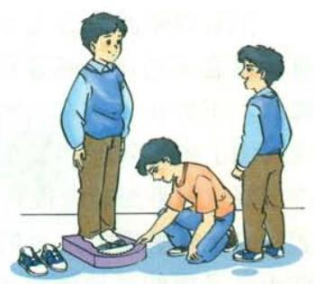

(2)某年,下列国家的商品进出口总额比上年的变化情况是:

美国减少 6.4%, 德国增长 1.3%,

法国减少 2.4%, 英国减少 3.5%,

意大利增长 0.2%, 中国增长 7.5%.

写出这些国家这一年商品进出口总额的增长率.

---

“负”与“正” 相对. 增长 -1 , 就是减少 1 ; 增长 $- {6.4}\%$ , 是什么意思?

什么情况下增长率是 0 ?

---

解:(1) 这个月小明体重增长 $2\mathrm{\;{kg}}$ ,小华体重增长 $- 1\mathrm{\;{kg}}$ ,小强体重增长 $0\mathrm{\;{kg}}$ .

(2)六个国家这一年商品进出口总额的增长率是:

美国 -6.4%, 德国 1.3%,

法国 -2.4%, 英国 -3.5%,

意大利 0.2%, 中国 7.5%.

## 归纳

如果一个问题中出现相反意义的量, 我们可以用正数和负数分别表示它们.

## 练习

1. 2010 年我国全年平均降水量比上年增加 ${108.7}\mathrm{\;{mm}}$ , 2009 年比上年减少 ${81.5}\mathrm{\;{mm}},{2008}$ 年比上年增加 ${53.5}\mathrm{\;{mm}}$ . 用正数和负数表示这三年我国全年平均降水量比上年的增长量.

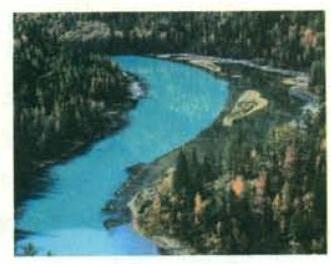

2. 如果把一个物体向右移动 $1\mathrm{\;m}$ 记作移动 $+ 1\mathrm{\;m}$ ,那么这个物体又移动了 $- 1\mathrm{\;m}$ 是什么意思? 如何描述这时物体的位置?

把 0 以外的数分为正数和负数, 它们表示具有相反意义的量. 随着对正数、负数意义认识的加深, 正数和负数在实践中得到了广泛应用. 在地形图上表示某地的高度时, 需要以海平面为基准 (规定海平面的海拔高度为 $0\mathrm{\;m}$ ),通常用正数表示高于海平面的某地的海拔高度, 用负数表示低于海平面的某地的海拔高度. 例如, 珠穆朗玛峰的海拔高度为 ${8844.43}\mathrm{\;m}$ ,吐鲁番盆地的海拔高度为 $- {155}\mathrm{\;m}$ . 记账时,通常用正数表示收入款额, 用负数表示支出款额.

---

0 是正数与负数的分界. $0{}^{ \circ  }\mathrm{C}$ 是一个确定的温度,海拔 $0\mathrm{\;m}$ 表示海平面的平均高度. 0 的意义已不仅是表示 “没有”.

---

## 思考

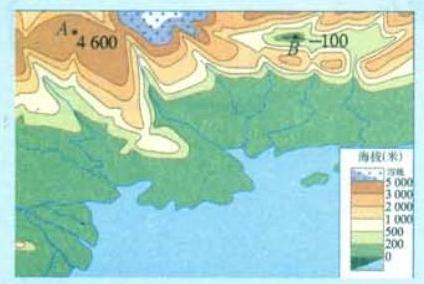

图 1.1-2

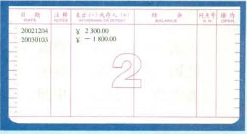

图 1.1-3

上面图中的正数和负数的含义是什么? 你能再举一些用正数、负数表示数量的实际例子吗?

## 练习

1. 读下列各数, 并指出其中哪些是正数, 哪些是负数.

$- 1,{2.5}, + \frac{4}{3},0, - {3.14},{120}, - {1.732}, - \frac{2}{7}$ .

2. 如果 ${80}\mathrm{\;m}$ 表示向东走 ${80}\mathrm{\;m}$ ,那么 $- {60}\mathrm{\;m}$ 表示_____.

3. 如果水位升高 $3\mathrm{\;m}$ 时水位变化记作 $+ 3\mathrm{\;m}$ ,那么水位下降 $3\mathrm{\;m}$ 时水位变化记作 _____ $\mathrm{m}$ ,水位不升不降时水位变化记作_____ $\mathrm{m}$ .

4. 月球表面的白天平均温度零上 ${126}^{ \circ  }\mathrm{C}$ ,记作_____ ${}^{ \circ  }\mathrm{C}$ ,夜间平均温度零下 150 °C,记作_____。_____。_____

## 第一章 有理数

## 习题 1.1

## 复习巩固

1. 下面各数哪些是正数, 哪些是负数?

$$
5, - \frac{5}{7},0,{0.56}, - 3, - {25.8},\frac{12}{5}, - {0.0001}, + 2, - {600}.
$$

2. 某蓄水池的标准水位记为 $0\mathrm{\;m}$ ,如果用正数表示水面高于标准水位的高度,那么

(1) ${0.08}\mathrm{\;m}$ 和 $- {0.2}\mathrm{\;m}$ 各表示什么?

(2)水面低于标准水位 ${0.1}\mathrm{\;m}$ 和高于标准水位 ${0.23}\mathrm{\;m}$ 各怎样表示？

3. “不是正数的数一定是负数, 不是负数的数一定是正数” 的说法对吗? 为什么?

## 综合运用

4. 如果把一个物体向后移动 $5\mathrm{\;m}$ 记作移动 $- 5\mathrm{\;m}$ ,那么这个物体又移动 $+ 5\mathrm{\;m}$ 是什么意思? 这时物体离它两次移动前的位置多远?

5. 测量一幢楼的高度,七次测得的数据分别是: ${79.4}\mathrm{\;m},{80.6}\mathrm{\;m},{80.8}\mathrm{\;m}$ , ${79.1}\mathrm{\;m},{80}\mathrm{\;m},{79.6}\mathrm{\;m},{80.5}\mathrm{\;m}$ . 这七次测量的平均值是多少? 以平均值为标准, 用正数表示超出部分, 用负数表示不足部分, 它们对应的数分别是什么?

6. 科学实验表明, 原子中的原子核与电子所带电荷是两种相反的电荷. 物理学规定, 原子核所带电荷为正电荷. 氢原子中的原子核与电子各带 1 个电荷, 把它们所带电荷用正数和负数表示出来.

## 拓广探索

7. 某地一天中午 12 时的气温是 $7{}^{ \circ  }\mathrm{C}$ ,过 $5\mathrm{\;h}$ 气温下降了 $4{}^{ \circ  }\mathrm{C}$ ,又过 $7\mathrm{\;h}$ 气温又下降了 $4{}^{ \circ  }\mathrm{C}$ ,第二天 0 时的气温是多少?

8. 某年,一些国家的服务出口额比上年的增长率如下:

<table><tr><td>美国</td><td>德国</td><td>英国</td><td>中国</td><td>日本</td><td>意大利</td></tr><tr><td>-3.4%</td><td>-0.9%</td><td>-5.3%</td><td>2.8%</td><td>-7.3%</td><td>7.0%</td></tr></table>

这一年, 上述六国中哪些国家的服务出口额增长了? 哪些国家的服务出口额减少了? 哪国增长率最高? 哪国增长率最低?

### 1.2 有理数

#### 1.2.1 有理数

## 思考

## 回想一下, 我们认识了哪些数?

我们学过的数有:

正整数,如 $1,2,3,\cdots$ ;

零, 0 ;

---

所有正整数组成正整数集合, 所有负整数组成负整数集合.

---

负整数,如 $- 1, - 2, - 3,\cdots$ ;

正分数,如 $\frac{1}{2},\frac{2}{3},\frac{15}{7},{0.1},{5.32},\cdots$ ;

负分数,如 $- {0.5}, - \frac{5}{2}, - \frac{2}{3}, - \frac{1}{7}$ , $- {150.25},\cdots$ .

---

因为这里的小数可以化为分数, 所以我们也把它们看成分数.

---

正整数、 0 、负整数统称为整数；正分数、负分数统称为分数.

整数和分数统称为有理数 (rational number).

从小学开始, 我们首先认识了正整数, 后来又增加了 0 和正分数, 在认识了负整数和负分数后, 对数的认识就扩充到了有理数范围.

## 练习

1. 所有正数组成正数集合, 所有负数组成负数集合. 把下面的有理数填入它属于的集合的圈内:

${15}, - \frac{1}{9}, - 5,\frac{2}{15}, - \frac{13}{8},{0.1}, - {5.32}, - {80},{123},{2.333}.$

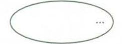

正数集合

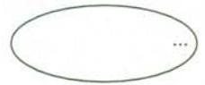

负数集合

## 6 第一章 有理数

2. 指出下列各数中的正数、负数、整数、分数:

$$
- {15}, + 6, - 2, - {0.9},1,\frac{3}{5},0,3\frac{1}{4},{0.63}, - {4.95}.
$$

#### 1.2.2 数轴

问题 在一条东西向的马路上,有一个汽车站牌,汽车站牌东 $3\mathrm{\;m}$ 和 ${7.5}\mathrm{\;m}$ 处分别有一棵柳树和一棵杨树,汽车站牌西 $3\mathrm{\;m}$ 和 ${4.8}\mathrm{\;m}$ 处分别有一棵槐树和一根电线杆, 试画图表示这一情境.

如图 1.2-1, 画一条直线表示马路, 从左到右表示从西到东的方向, 在直线上任取一个点 $O$ 表示汽车站牌的位置,规定 1 个单位长度 (线段 ${OA}$ 的长) 代表 $1\mathrm{\;m}$ 长. 于是,在点 $O$ 右边,与点 $O$ 距离 3 个和 7.5 个单位长度的点 $B$ 和点 $C$ ,分别表示柳树和杨树的位置; 点 $O$ 左边,与点 $O$ 距离 3 个和 4.8 个单位长度的点 $D$ 和点 $E$ ,分别表示槐树和电线杆的位置.

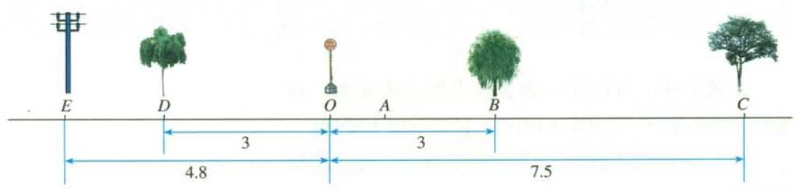

图 1.2-1

## 思考

怎样用数简明地表示这些树、电线杆与汽车站牌的相对位置关系(方向、距离)?

上面的问题中,“东”与“西”、“左”与“右”都具有相反意义. 如图 1.2-2,在一条直线上取一个点 $O$ 为基准点,用 0 表示它,再用负数表示点 $O$ 左边的点,用正数表示点 $O$ 右边的点. 这样,我们就用负数、 0 、正数表示出了这条直线上的点.

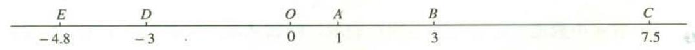

图 1.2-2

用上述方法, 我们就可以把这些树、电线杆与汽车站牌的相对位置关系表示出来了. 例如, -4.8 表示位于汽车站牌西侧 ${4.8}\mathrm{\;m}$ 处的电线杆, 等等.

---

你能说说图中其他数的实际意义吗?

---

## 思考

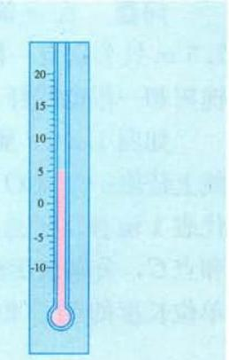

图 1.2-3

图 1.2-3 中的温度计可以看作表示正数、 0 和负数的直线. 它和图 1.2-2 有什么共同点, 有什么不同点?

在数学中, 可以用一条直线上的点表示数, 这条直线叫做数轴 (number axis), 它满足以下要求:

(1)在直线上任取一个点表示数 0 ,这个点叫做原点(origin)；

(2)通常规定直线上从原点向右(或上)为正方向, 从原点向左 (或下) 为负方向;

---

0 是正数和负数的分界点; 原点是数轴的 “基准点”.

---

(3)选取适当的长度为单位长度,直线上从原点向右, 每隔一个单位长度取一个点, 依次表示 1,2,3,· · ·；从原点向左,用类似方法依次表示 $- 1, - 2, - 3,\cdots$ (图 1.2-4).

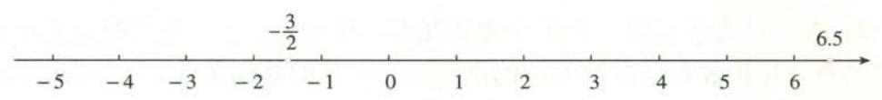

图 1.2-4

分数或小数也可以用数轴上的点表示, 例如从原点向右 6.5 个单位长度的点表示小数 6.5,从原点向左 $\frac{3}{2}$ 个单位长度的点表示分数 $- \frac{3}{2}$ (图 1.2-4).

## 8 第一章 有理数

## 归纳

一般地,设 $a$ 是一个正数,则数轴上表示数 $a$ 的点在原点的_____边, 与原点的距离是_____个单位长度；表示数一a 的点在原点的_____边,与原点的距离是_____个单位长度.

用数轴上的点表示数对数学的发展起了重要作用, 以它作基础, 可以借助图直观地表示很多与数相关的问题.

## 练习

1. 如图,写出数轴上点 $A, B, C, D, E$ 表示的数.

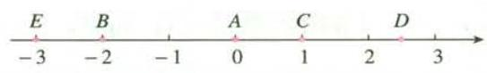

(第 1 题)

2. 画出数轴并表示下列有理数:

$$
{1.5}, - 2,2, - {2.5},\frac{9}{2}, - \frac{3}{4},0.
$$

3. 数轴上,如果表示数 $a$ 的点在原点的左边,那么 $a$ 是一个_____数；如果表示数 $b$ 的点在原点的右边,那么 $b$ 是一个_____数.

#### 1.2.3 相反数

## 探究

在数轴上, 与原点的距离是 2 的点有几个? 这些点各表示哪个数?

设 $a$ 是一个正数. 数轴上与原点的距离等于 $a$ 的点有几个? 这些点表示的数有什么关系?

可以发现, 数轴上与原点距离是 2 的点有两个, 它们表示的数是 -2 和 2.

## 归纳

一般地,设 $a$ 是一个正数,数轴上与原点的距离是 $a$ 的点有两个,它们分别在原点左右,表示 $- a$ 和 $a$ (图 1.2-5),我们说这两点关于原点对称.

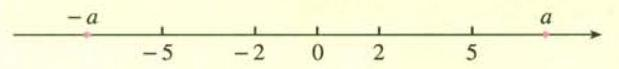

图 1.2-5

像 2 和 -2,5 和 -5 这样,只有符号不同的两个数叫做互为相反数 (opposite number). 这就是说, 2 的相反数是 -2 , -2 的相反数是 2 ; 5 的相反数是 -5, -5 的相反数是 5 .

一般地, $a$ 和 $- a$ 互为相反数. 特别地,0 的相反数是 0 . 这里, $a$ 表示任意一个数, 可以是正数、负数, 也可以是 0 . 例如:

当 $a = 1$ 时, $- a =  - 1,1$ 的相反数是 -1 ; 同时,-1 的相反数是 1 .

## 思考

设 $a$ 表示一个数, $- a$ 一定是负数吗?

容易看出, 在正数前面添上 “一” 号, 就得到这个正数的相反数. 在任意一个数前面添上 “一” 号, 新的数就表示原数的相反数. 例如,

$$
- \left( {+5}\right)  =  - 5, - \left( {-5}\right)  =  + 5, - 0 = 0.
$$

---

你能借助数轴说明 $- \left( {-5}\right)  =$ +5吗?

---

## 练习

1. 判断下列说法是否正确:

(1)-3 是相反数； (2) +3 是相反数;

(3) 3 是 -3 的相反数; (4)-3与 $+ 3$ 互为相反数.

2. 写出下列各数的相反数:

$$
6, - 8, - {3.9},\frac{5}{2}, - \frac{2}{11},{100},0.
$$

3. 如果 $a =  - a$ ,那么表示 $a$ 的点在数轴上的什么位置?

4. 化简下列各数:

$$
- \left( {-{68}}\right) , - \left( {+{0.75}}\right) , - \left( {-\frac{3}{5}}\right) , - \left( {+{3.8}}\right) \text{.}
$$

10 第一章 有理数

#### 1.2.4 绝对值

两辆汽车从同一处 $O$ 出发,分别向东、西方向行驶 ${10}\mathrm{\;{km}}$ ,到达 $A, B$ 两处 (图 1.2-6). 它们的行驶路线相同吗? 它们的行驶路程相等吗？

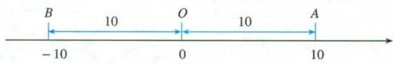

图 1.2-6

一般地,数轴上表示数 $a$ 的点与原点的距离叫做数 $a$ 的绝对值 (absolute value),记作 $\left| a\right|$ . 例如,图 1.2-6 中 $A, B$ 两点分别表示 10 和 -10,它们与原点的距离都是 10 个单位长度,所以 10 和 -10 的绝对值都是 10 , 即

$$
\left| {10}\right|  = {10},\left| {-{10}}\right|  = {10}.
$$

---

这里的数 $a$ 可以是正数、负数和 0 .

---

显然 $\left| 0\right|  = 0$ .

由绝对值的定义可知:

一个正数的绝对值是它本身；一个负数的绝对值是它的相反数；0 的绝对值是 0 . 即

(1)如果 $a > 0$ ,那么 $\left| a\right|  = a$ ;

(2)如果 $a = 0$ ,那么 $\left| a\right|  = 0$ ；

(3)如果 $a < 0$ ,那么 $\left| a\right|  =  - a$ .

## 练习

1. 写出下列各数的绝对值:

$$
6, - 8, - {3.9},\frac{5}{2}, - \frac{2}{11},{100},0.
$$

2. 判断下列说法是否正确:

(1)符号相反的数互为相反数；

(2)一个数的绝对值越大,表示它的点在数轴上越靠右；

(3)一个数的绝对值越大,表示它的点在数轴上离原点越远；

(4)当 $a \neq  0$ 时, $\left| a\right|$ 总是大于 0.

3. 判断下列各式是否正确:

(1) $\left| 5\right|  = \left| {-5}\right|$ ； (2) $- \left| 5\right|  = \left| {-5}\right|$ ； $\left( 3\right)  - 5 = \left| {-5}\right|$ .

我们已知两个正数 (或 0) 之间怎样比较大小, 例如

$$
0 < 1,1 < 2,2 < 3,\cdots \text{.}
$$

任意两个有理数 (例如 -4 和 -3,-2 和 0,-1 和 1) 怎样比较大小呢?

## 思考

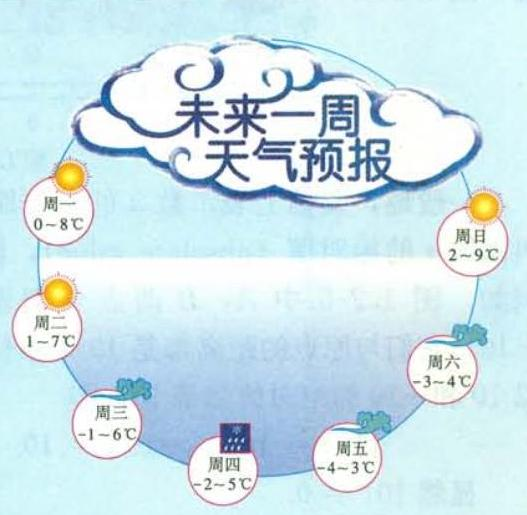

图 1.2-7

图 1.2-7 给出了未来一周中每天的最高气温和最低气温, 其中最低气温是多少? 最高气温呢? 你能将这七天中每天的最低气温按从低到高的顺序排列吗?

这七天中每天的最低气温按从低到高排列为

$$
- 4, - 3, - 2, - 1,0,1,2\text{.}
$$

按照这个顺序排列的温度, 在温度计上所对应的点是从下到上的. 按照这个顺序把这些数表示在数轴上, 表示它们的各点的顺序是从左到右的 (图 1.2-8).

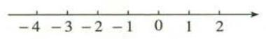

图 1.2-8

数学中规定: 在数轴上表示有理数, 它们从左到右的顺序, 就是从小到大的顺序, 即左边的数小于右边的数.

由这个规定可知

$$
- 6 <  - 5, - 5 <  - 4, - 4 <  - 3, - 2 < 0, - 1 < 1,\cdots \text{.}
$$

## 思考

对于正数、 0 和负数这三类数, 它们之间有什么大小关系? 两个负数之间如何比较大小? 前面最低气温由低到高的排列与你的结论一致吗?

## 12 第一章 有理数