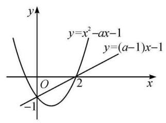
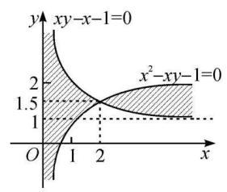
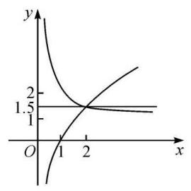
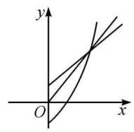
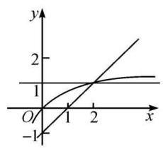
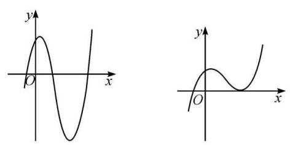
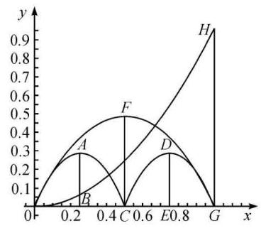

## 第一章 一题多解

### 1.1 函 数

【例 1】(2012 年高考浙江卷) 设 $a \in  \mathbf{R}$ ,若 $x > 0$ 时均有 $\left\lbrack  {\left( {a - 1}\right) x - 1}\right\rbrack  \left( {{x}^{2} - {ax} - 1}\right)  \geq  0$ ,求 $a$ 的值.

解法一 由等价关系

$\{ x \mid  f\left( x\right) g\left( x\right)  \geq  0\}  = \left\{  {x\left| {\;\left\{  \begin{array}{l} f\left( x\right)  \leq  0, \\  g\left( x\right)  \leq  0 \end{array}\right\}   \cup  \left\{  {x\left| {\;\left\{  \begin{array}{l} f\left( x\right)  \geq  0, \\  g\left( x\right)  \geq  0 \end{array}\right\}  ,}\right. }\right. }\right. }\right.$

可以把已知不等式变为以下两种情况:

( 1 ) $\left\{  \begin{array}{l} \left( {a - 1}\right) x - 1 \leq  0, \\  {x}^{2} - {ax} - 1 \leq  0 \end{array}\right. \left( {x > 0}\right)$ .

(2) $\left\{  \begin{array}{l} \left( {a - 1}\right) x - 1 \geq  0, \\  {x}^{2} - {ax} - 1 \geq  0 \end{array}\right. \left( {x > 0}\right)$ .

对 (1),有 $\left\{  {\begin{array}{l} x > 0, \\  a \leq  1 + \frac{1}{x}, \\  a \geq  x - \frac{1}{x} \end{array} \Rightarrow  \left\{  {\begin{array}{l} x > 0, \\  x - \frac{1}{x} \leq  1 + \frac{1}{x} \end{array} \Rightarrow  0 < x \leq  2}\right. }\right.$ .

这时,对 $0 < x \leq  2$ ,有 $x - \frac{1}{x} \leq  a < 1 + \frac{1}{x}$ .

易知,函数 $y = x - \frac{1}{x}$ 在 $(0,2\rbrack$ 上为增函数,在区间右端点取到最大值 ${y}_{\max } = 2 - \frac{1}{2} = \frac{3}{2}$ ;

函数 $y = 1 + \frac{1}{x}$ 在 $(0,2\rbrack$ 上为减函数,在区间右端点取到最小值 ${y}_{\min } = 1 + \frac{1}{2} = \frac{3}{2}$ .

有 $\frac{3}{2} = {\left( x - \frac{1}{x}\right) }_{\max } \leq  a \leq  {\left( 1 + \frac{1}{x}\right) }_{\min } = \frac{3}{2}$ ,得 $a = \frac{3}{2}$ .

对 (2),有 $\left\{  {\begin{array}{l} x > 0, \\  a \geq  1 + \frac{1}{x}, \\  a \geq  x - \frac{1}{x} \end{array} \Rightarrow  \left\{  {\begin{array}{l} x > 0, \\  x - \frac{1}{x} \geq  1 + \frac{1}{x} \end{array} \Rightarrow  x \geq  2}\right. }\right.$ .

这时,对 $x \geq  2$ ,有 $1 + \frac{1}{x} \leq  a \leq  x - \frac{1}{x}$ .

易知,函数 $y = 1 + \frac{1}{x}$ 在 $\lbrack 2, + \infty )$ 上为减函数,在区间左端点取到最大值 ${y}_{\max } = 1 + \frac{1}{2} = \frac{3}{2}$ ;

函数 $y = x - \frac{1}{x}$ 在 $\lbrack 2, + \infty )$ 上为增函数,在区间左端点取到最小值 ${y}_{\min } = 2 - \frac{1}{2} = \frac{3}{2}$ .

有 $\frac{3}{2} = {\left( 1 + \frac{1}{x}\right) }_{\max } \leq  a \leq  {\left( x - \frac{1}{x}\right) }_{\min } = \frac{3}{2}$ ,得 $a = \frac{3}{2}$ .

合并两种情况,求并集得 $a = \frac{3}{2}$ .

又当 $a = \frac{3}{2}$ 时,对 $x > 0$ 均有

$\left\lbrack  {\left( {a - 1}\right) x - 1}\right\rbrack  \left( {{x}^{2} - {ax} - 1}\right)  = \frac{1}{4}{\left( x - 2\right) }^{2}\left( {{2x} + 1}\right)  \geq  0.$

所以 $a = \frac{3}{2}$ 为所求.

解法二 将已知看成关于 $a$ 的不等式,对 $x > 0$ 有

$$
\left\lbrack  {a - \left( {1 + \frac{1}{x}}\right) }\right\rbrack  \left\lbrack  {a - \left( {x - \frac{1}{x}}\right) }\right\rbrack   \leq  0.
$$

比较 $x - \frac{1}{x}$ 与 $1 + \frac{1}{x}$ 的大小知,当 $0 < x \leq  2$ 时,有 $x - \frac{1}{x} \leq  1 + \frac{1}{x}$ ; 当 $x \geq  2$ 时,有 $x - \frac{1}{x} \geq$ $1 + \frac{1}{x}$ . 所以分两种情况讨论.

(1)当 $0 < x \leq  2$ 时,解关于 $a$ 的不等式,得 $x - \frac{1}{x} \leq  a \leq  1 + \frac{1}{x}$ .

有 $\frac{3}{2} = 2 - \frac{1}{2} = {\left( x - \frac{1}{x}\right) }_{\max } \leq  a \leq  {\left( 1 + \frac{1}{x}\right) }_{\min } = 1 + \frac{1}{2} = \frac{3}{2}$ ,得 $a = \frac{3}{2}$ .

(2) 当 $x \geq  2$ 时,解关于 $a$ 的不等式,得 $1 + \frac{1}{x} \leq  a \leq  x - \frac{1}{x}$ .

有 $\frac{3}{2} = 1 + \frac{1}{2} = {\left( 1 + \frac{1}{x}\right) }_{\max } \leq  a \leq  {\left( x - \frac{1}{x}\right) }_{\min } = 2 - \frac{1}{2} = \frac{3}{2}$ ,得 $a = \frac{3}{2}$ .

合并两种情况,求并集得 $a = \frac{3}{2}$ .

又当 $a = \frac{3}{2}$ 时,对 $x > 0$ 均有

$$
\left\lbrack  {\left( {a - 1}\right) x - 1}\right\rbrack  \left( {{x}^{2} - {ax} - 1}\right)  = \frac{1}{4}{\left( x - 2\right) }^{2}\left( {{2x} + 1}\right)  \geq  0.
$$

所以 $a = \frac{3}{2}$ 为所求.

解法三 将 ${ax}$ 看成主元,由原不等式可得

$\left\lbrack  {{ax} - \left( {x + 1}\right) }\right\rbrack  \left\lbrack  {{ax} - \left( {{x}^{2} - 1}\right) }\right\rbrack   \leq  0, x > 0.$

比较 $x + 1$ 与 ${x}^{2} - 1$ 的大小知,当 $0 < x \leq  2$ 时,有 ${x}^{2} - 1 \leq  x + 1$ ; 当 $x \geq  2$ 时,有 ${x}^{2} - 1 \geq  x$ +1. 所以分两种情况讨论.

(1)当 $0 < x \leq  2$ 时,解关于 ${ax}$ 的不等式,得 ${x}^{2} - 1 \leq  {ax} \leq  x + 1$ ,

即 $x - \frac{1}{x} \leq  a \leq  1 + \frac{1}{x}$ .

有 $\frac{3}{2} = 2 - \frac{1}{2} = {\left( x - \frac{1}{x}\right) }_{\max } \leq  a \leq  {\left( 1 + \frac{1}{x}\right) }_{\min } = 1 + \frac{1}{2} = \frac{3}{2}$ ,得 $a = \frac{3}{2}$ .

(2) 当 $x \geq  2$ 时,解关于 ${ax}$ 的不等式,得 $x + 1 \leq  {ax} \leq  {x}^{2} - 1$ ,

即 $1 + \frac{1}{x} \leq  a \leq  x - \frac{1}{x}$ .

有 $\frac{3}{2} = 1 + \frac{1}{2} = {\left( 1 + \frac{1}{x}\right) }_{\max } \leq  a \leq  {\left( x - \frac{1}{x}\right) }_{\min } = 2 - \frac{1}{2} = \frac{3}{2}$ ,得 $a = \frac{3}{2}$ .

合并两种情况,求并集得 $a = \frac{3}{2}$ .

又当 $a = \frac{3}{2}$ 时,对 $x > 0$ 均有

$$
\left\lbrack  {\left( {a - 1}\right) x - 1}\right\rbrack  \left( {{x}^{2} - {ax} - 1}\right)  = \frac{1}{4}{\left( x - 2\right) }^{2}\left( {{2x} + 1}\right)  \geq  0.
$$

所以 $a = \frac{3}{2}$ 为所求.

解法四 由原不等式可得 $\left\lbrack  {\frac{ax}{x + 1} - 1}\right\rbrack  \left\lbrack  {\frac{ax}{x + 1} - \left( {x - 1}\right) }\right\rbrack   \leq  0, x > 0$ .

易知,当 $0 < x \leq  2$ 时,有 $x - 1 \leq  1$ ; 当 $x \geq  2$ 时,有 $1 \leq  x - 1$ . 以下分两种情况讨论(同解法三).

解法五 分两种情况讨论.

(1)当 $a - 1 \leq  0$ 时,有 ${2a} - 3 \neq  0$ ,取 $x = 2 > 0$ ,得

$\left\lbrack  {\left( {a - 1}\right) x - 1}\right\rbrack  \left( {{x}^{2} - {ax} - 1}\right)  =  - {\left( 2a - 3\right) }^{2} < 0.$

这说明不大于 1 的 $a$ 不满足条件,此时无解.

(2)当 $a - 1 > 0$ 时,由已知有

$$
\left( {x - \frac{1}{a - 1}}\right) \left( {x - \frac{a - \sqrt{{a}^{2} + 4}}{2}}\right) \left( {x - \frac{a + \sqrt{{a}^{2} + 4}}{2}}\right)  \geq  0.
$$

又当 $x > 0$ 时,有 $\left( {x - \frac{a - \sqrt{{a}^{2} + 4}}{2}}\right)  > 0$ ,故由上式有

$$
\left( {x - \frac{1}{a - 1}}\right) \left( {x - \frac{a + \sqrt{{a}^{2} + 4}}{2}}\right)  \geq  0, x > 0.
$$

当且仅当 $\frac{1}{a - 1} = \frac{a + \sqrt{{a}^{2} + 4}}{2}$ 时,上式对 $x > 0$ 恒成立,这表明 $\frac{1}{a - 1}$ 是方程 ${x}^{2} - {ax} - 1 = 0$ 的解, 有

$$
\left( \frac{1}{a - 1}\right)  - \frac{a}{a - 1} - 1 = 0 \Rightarrow  2{a}^{2} - {3a} = 0,
$$

但 $a > 1$ ,故得 $a = \frac{3}{2}$ .

解法六 分三种情况讨论.

(1)当 $a - 1 = 0$ 时,原式为 $- \left( {{x}^{2} - x - 1}\right)  \geq  0$ ,这不能对 $x > 0$ 恒成立,此时无解.

(2)当 $a - 1 < 0$ 时,由已知有

$$
\left( {x - \frac{1}{a - 1}}\right) \left( {x - \frac{a - \sqrt{{a}^{2} + 4}}{2}}\right) \left( {x - \frac{a + \sqrt{{a}^{2} + 4}}{2}}\right)  \leq  0.
$$

又当 $x > 0$ 时,有 $x - \frac{1}{a - 1} > 0, x - \frac{a - \sqrt{{a}^{2} + 4}}{2} > 0$ ,故由上式有

$$
x - \frac{a + \sqrt{{a}^{2} + 4}}{2} \leq  0,
$$

这不能对 $x > 0$ 恒成立,此时无解.

(3)当 $a - 1 > 0$ 时,由已知有

$$
\left( {x - \frac{1}{a - 1}}\right) \left( {x - \frac{a - \sqrt{{a}^{2} + 4}}{2}}\right) \left( {x - \frac{a + \sqrt{{a}^{2} + 4}}{2}}\right)  \geq  0.
$$

又当 $x > 0$ 时,有 $\left( {x - \frac{a - \sqrt{{a}^{2} + 4}}{2}}\right)  > 0$ ,故由上式有

$$
\left( {x - \frac{1}{a - 1}}\right) \left( {x - \frac{a + \sqrt{{a}^{2} + 4}}{2}}\right)  \geq  0,
$$

当且仅当 $\frac{1}{a - 1} = \frac{a + \sqrt{{a}^{2} + 4}}{2}$ 时,上式对 $x > 0$ 恒成立,这表明 $\frac{1}{a - 1}$ 是方程 ${x}^{2} - {ax} - 1 = 0$ 的解, 有

$$
\left( \frac{1}{a - 1}\right)  - \frac{a}{a - 1} - 1 = 0 \Rightarrow  2{a}^{2} - {3a} = 0,
$$

但 $a > 1$ ,故得 $a = \frac{3}{2}$ .

又当 $a = \frac{3}{2}, x > 0$ 时,有

$\left\lbrack  {\left( {a - 1}\right) x - 1}\right\rbrack  \left( {{x}^{2} - {ax} - 1}\right)  = \frac{1}{4}{\left( x - 2\right) }^{2}\left( {{2x} + 1}\right)  \geq  0.$

所以得 $a = \frac{3}{2}$ .

解法七 (1) 当 $a - 1 = 0$ 时,原式化简 (降次) 为 $- \left( {{x}^{2} - x - 1}\right)  \geq  0$ ,这不能对 $x > 0$ 恒成立, 此时无解.

(2)当 $a - 1 \neq  0$ 时,由已知有

$$
\left( {a - 1}\right) \left( {x - \frac{1}{a - 1}}\right) \left( {x - \frac{a - \sqrt{{a}^{2} + 4}}{2}}\right) \left( {x - \frac{a + \sqrt{{a}^{2} + 4}}{2}}\right)  \geq  0.
$$

又当 $x > 0$ 时,有 $x - \frac{a - \sqrt{{a}^{2} + 4}}{2} > 0$ ,故上式可化简 (降次) 为

$$
\left( {a - 1}\right) \left( {x - \frac{1}{a - 1}}\right) \left( {x - \frac{a + \sqrt{{a}^{2} + 4}}{2}}\right)  \geq  0.
$$

设 $f\left( x\right)  = \left( {a - 1}\right) \left( {x - \frac{1}{a - 1}}\right) \left( {x - \frac{a + \sqrt{{a}^{2} + 4}}{2}}\right)$ ,则二次函数 $f\left( x\right)$ 有一个正零点 ${x}_{1} =$ $\frac{a + \sqrt{{a}^{2} + 4}}{2} > 0$ ,要 $x > 0$ 时恒有 $f\left( x\right)  \geq  0$ ,当且仅当开口向上,且两个零点重合.

$\left\{  \begin{array}{l} \left( {a - 1}\right)  > 0, \\  \frac{1}{a - 1} = \frac{a + \sqrt{{a}^{2} + 4}}{2}, \end{array}\right.$ 解得 $a = \frac{3}{2}$ .

又当 $a = \frac{3}{2}, x > 0$ 时,有 $\left\lbrack  {\left( {a - 1}\right) x - 1}\right\rbrack  \left( {{x}^{2} - {ax} - 1}\right)  = \frac{1}{4}{\left( x - 2\right) }^{2}\left( {{2x} + 1}\right)  \geq  0$ .

所以得 $a = \frac{3}{2}$ .

解法八 作出函数 $y = \left( {a - 1}\right) x - 1$ 与 $y = {x}^{2} - {ax} - 1$ 的图像 (如图 1-1-1 所示), 由图可见:

图 1-1-1

(1)两函数图像都过定点(0, - 1).

(2)在 $x > 0$ 的右半平面上,绕定点(0, - 1)旋转直线 $y = (a -$ 1) $x - 1$ 可以看到,两函数图像或者同时不在 $x$ 轴下方,或者同时不在 $x$ 轴上方. 满足条件的图形只能是: 两函数图像的另一交点在 $x$ 轴上 (三线共点),即 $\left\lbrack  {\left( {a - 1}\right) x - 1}\right\rbrack  \left( {{x}^{2} - {ax} - 1}\right)  \geq  0$ 对 $x > 0$ 恒成立的充要条件是

$\left\{  {\begin{array}{l} y = \left( {a - 1}\right) x - 1, \\  y = {x}^{2} - {ax} - 1, \\  y = 0 \end{array} \Rightarrow  \left\{  {\begin{array}{l} x =  - 1, \\  a = 0 \end{array}\text{ (舍去),}\left\{  \begin{array}{l} x = 2, \\  a = \frac{3}{2}. \end{array}\right. }\right. }\right.$

得 $a = \frac{3}{2}$ 为所求.

解法九 把 $a$ 改写为 $y$ ,如图 1-1-2 所示,作两函数 $y = 1 + \frac{1}{x}$ 与 $y = x$ $- \frac{1}{x}$ 在 $x > 0$ 时的图像 (即图中双曲线 ${xy} - x - 1 = 0$ 与 ${x}^{2} - {xy} - 1 = 0$ 在右半平面上的图形),则满足 $\left\{  \begin{array}{l} \left( {a - 1}\right) x - 1 \leq  0, \\  {x}^{2} - {ax} - 1 \leq  0 \end{array}\right.$ 或 $\left\{  \begin{array}{l} \left( {a - 1}\right) x - 1 \geq  0, \\  {x}^{2} - {ax} - 1 \geq  0 \end{array}\right.$ 的区域为图中的阴影部分. 由图可见, 当且仅当水平直线通过两图像的交点时(三线共点),整条射线 $\left( {x > 0}\right)$ 均落在阴影上,即 $\left\lbrack  {\left( {a - 1}\right) x - 1}\right\rbrack  \left( {{x}^{2} - {ax} - 1}\right)  \geq  0$ 对 $x > 0$ 恒成立的充要条件是

图 1-1-2

$\left\{  {\begin{array}{l} \left( {a - 1}\right) x - 1 = 0, \\  {x}^{2} - {ax} - 1 = 0 \end{array} \Rightarrow  \left\{  \begin{array}{l} x =  - 1, \\  a = 0 \end{array}\right. }\right.$ (舍去), $\left\{  \begin{array}{l} x = 2, \\  a = \frac{3}{2}. \end{array}\right.$

得 $a = \frac{3}{2}$ 为所求.

解法十 对 $x > 0$ ,已知条件可以变为关于 $a$ 的不等式

$$
\left\lbrack  {a - \left( {1 + \frac{1}{x}}\right) }\right\rbrack  \left\lbrack  {a - \left( {x - \frac{1}{x}}\right) }\right\rbrack   \leq  0.
$$

图 1-1-3

即直线 $y = a$ 介于两函数 $y = 1 + \frac{1}{x}$ 与 $y = x - \frac{1}{x}$ 的图像之间 (如图 1-1-3 所示),故直线 $y = a$ 过两图像 $y = 1 + \frac{1}{x}$ 与 $y = x - \frac{1}{x}$ 的交点 $\left( {2,\frac{3}{2}}\right)$ ,得 $a = \frac{3}{2}$ .

解法十一 将 ${ax}$ 看成主元,由原不等式可得

$$
\left\lbrack  {{ax} - \left( {x + 1}\right) }\right\rbrack  \left\lbrack  {{ax} - \left( {{x}^{2} - 1}\right) }\right\rbrack   \leq  0, x > 0.
$$

图 1-1-4

这表明 ${ax}$ 介于 $x + 1$ 与 ${x}^{2} - 1$ 之间. 即在右半平面上,直线 $y = {ax}$ 介于两函数 $y = x + 1$ 与 $y = {x}^{2} - 1$ 的图像之间 (如图 1-1-4 所示),故直线 $y = {ax}$ 过两图像 $y = x + 1$ 与 $y = {x}^{2} - 1$ 的交点(2,3),代入 $y = {ax}$ 有 $3 = {2a}$ , 得 $a = \frac{3}{2}$ .

解法十二 对 $x > 0$ ,已知条件可以变为

$$
\left\lbrack  {\frac{ax}{x + 1} - 1}\right\rbrack  \left\lbrack  {\frac{ax}{x + 1} - \left( {x - 1}\right) }\right\rbrack   \leq  0.
$$

图 1-1-5

即函数 $y = \frac{ax}{x + 1}$ 的图像介于两函数 $y = 1$ 与 $y = x - 1$ 的图像之间 (如图 1-1-5 所示),故 $y = \frac{ax}{x + 1}$ 过两函数 $y = 1$ 与 $y = x - 1$ 图像的交点 (2,1),代入 $y = \frac{ax}{x + 1}$ ,有 $1 = \frac{2a}{2 + 1}$ ,得 $a = \frac{3}{2}$ .

解法十三 (必要性) 既然是 $x > 0$ 时均有 $\left\lbrack  {\left( {a - 1}\right) x - 1}\right\rbrack  \left( {{x}^{2} - {ax} - 1}\right)  \geq  0$ ,特别地,取 $x = 1$ ,有 $a\left( {a - 2}\right)  \leq  0$ ,得 $0 \leq  a \leq  2$ .

取 $x = 2$ ,有 $- {\left( 2a - 3\right) }^{2} \geq  0$ ,得 $a = \frac{3}{2}$ .

反之 (充分性),当 $a = \frac{3}{2}, x > 0$ 时,有 $\left\lbrack  {\left( {a - 1}\right) x - 1}\right\rbrack  \left( {{x}^{2} - {ax} - 1}\right)  = \frac{1}{4}{\left( x - 2\right) }^{2}\left( {{2x} + 1}\right)  \geq  0$ .

所以 $a = \frac{3}{2}$ .

解法十四 (必要性) 取 $x = 2$ ,有 $- {\left( 2a - 3\right) }^{2} \geq  0$ ,得 $a = \frac{3}{2}$ .

反之 (充分性),当 $a = \frac{3}{2}, x > 0$ 时,有 $\left\lbrack  {\left( {a - 1}\right) x - 1}\right\rbrack  \left( {{x}^{2} - {ax} - 1}\right)  = \frac{1}{4}{\left( x - 2\right) }^{2}\left( {{2x} + 1}\right)  \geq  0$ .

评注 本例为 2012 年浙江高考填空题. 从“小题小做”的角度,解法十三和解法十四看上去是最优的. 但从解题的角度, 对问题进行全面解构有助于我们对问题本质的理解, 解法一至解法四是对问题代数结构的分析; 解法五、六进一步借助几何解释来明晰代数结构: 其几何解释是,当 $a > 1$ 时,一般情况下的三次函数 $f\left( x\right)  = \left( {x - \frac{1}{a - 1}}\right) \left( {x - \frac{a - \sqrt{{a}^{2} + 4}}{2}}\right) \left( {x - \frac{a + \sqrt{{a}^{2} + 4}}{2}}\right)$ 有 “一负两正”三个零点 (如图 1-1-6 所示),要使 $x > 0$ 时 $f\left( x\right)  \geq  0$ 恒成立,当且仅当两个正根重合为切点 (如图 1-1-6 所示). 解法七则进一步对问题进行了“降次”的处理. 解法八至解法十二则是数形结合解决问题的多角度切入,比如解法八与代数解法相对应,我们通过坐标系给出相应的几何解释. 主要有两个基本途径, 其一是把 $a$ 改写为 $y$ ,则已知条件可转化为双曲线 ${xy} - x - 1 = 0$ 与双曲线 ${x}^{2} - {xy} - 1 = 0$ 的组合图形; 其二是把 $a$ 看成几何参数,则已知条件可转化为直线 $y = \left( {a - 1}\right) x - 1$ 与抛物线 $y = {x}^{2} - {ax}$ -1 的组合图形. 更进一步地解读, 解法八实际是一个双流向的 “数形结合”, 首先是 “式子一函数 - 图像”一步步地“由数到形”,等把图形看清楚了、想明白了,再“图形特征一函数性质一方程求解”一步步地“由形到数”, 即是双流向的“数形结合”. 这个解法的成功基于对图像特征的洞察,关键是发现: “两函数图像或者同时不在 $x$ 轴上方,或者同时不在 $x$ 轴下方”, 从而三线共点. 而解法九中双流向的“数形结合”与解法八略有区别, 首先是“式子一曲线一区域” 一步步地“由数到形”,然后是“图形特征一区域性质一方程求解”一步步地“由形到数”. 解法十至解法十二则是对不同代数特征的图像解构. 本题涉及数形结合、函数与方程、转化与化归、不等式性质 (夹逼法)、参变置换等数学思想和方法.

图 1-1-6

【例 2】(2014 年全国高中数学联赛广西预赛) 函数 $y = 3\sqrt{x - 1} + \sqrt{8 - {2x}}$ 的最大值是_____.

解法一 因为 $y = 3\sqrt{x - 1} - \sqrt{8 - {2x}} \geq  0, x \in  \left\lbrack  {1,4}\right\rbrack$ ,

所以 ${y}^{\prime } = 3 \times  \frac{1}{2\sqrt{x - 1}} + \frac{-2}{2\sqrt{8 - {2x}}}$ .

令 ${y}^{\prime } = 0$ ,得 $x = \frac{38}{11}$ ,记 $f\left( x\right)  = 3\sqrt{x - 1} + \sqrt{8 - {2x}}, x \in  \left\lbrack  {1,4}\right\rbrack$ ,

因为 $f\left( \frac{38}{11}\right)  = \sqrt{33}, f\left( 1\right)  = \sqrt{6}, f\left( 4\right)  = 3\sqrt{3}$ ,所以 ${y}_{\max } = \sqrt{33}$ .

解法二 因为 $y = 3 \cdot  \sqrt{x - 1} + \sqrt{2} \cdot  \sqrt{4 - x}, x \in  \left\lbrack  {1,4}\right\rbrack$ ,

所以 $0 \leq  x - 1 \leq  3$ ,则 $0 \leq  \frac{x - 1}{3} \leq  1$ .

记 $\frac{x - 1}{3} = {\sin }^{2}\theta ,\theta  \in  \left\lbrack  {0,\frac{\pi }{2}}\right\rbrack$ ,所以 $x = 3{\sin }^{2}\theta  + 1$ ,

所以 $y = 3 \times  \sqrt{3{\sin }^{2}\theta } + \sqrt{2} \times  \sqrt{3 - 3{\sin }^{2}\theta } = 3\sqrt{3}\sin \theta  + \sqrt{6}\cos \theta  = \sqrt{33}\sin \left( {\theta  + \varphi }\right)$ ,

其中 $\tan \varphi  = \frac{\sqrt{6}}{3\sqrt{3}} = \frac{\sqrt{2}}{3}$ . 当 $\theta  + \varphi  = \frac{\pi }{2}$ 时, $y$ 有最大值 $\sqrt{33}$ .

解法三 因为 $y = 3\sqrt{x - 1} + \sqrt{8 - {2x}} \geq  0, x \in  \left\lbrack  {1,4}\right\rbrack$ ,由柯西不等式有

$y = 3 \cdot  \sqrt{x - 1} + \sqrt{2} \cdot  \sqrt{4 - x} \leq  \sqrt{{3}^{2} + {\left( \sqrt{2}\right) }^{2}} \cdot  \sqrt{{\left( \sqrt{x - 1}\right) }^{2} + {\left( \sqrt{4 - x}\right) }^{2}} = \sqrt{33},$

当且仅当 $\frac{3}{\sqrt{2}} = \frac{\sqrt{x - 1}}{\sqrt{4 - x}}$ ,即 $x = \frac{38}{11}$ 时,等号成立,所以 ${y}_{\max } = \sqrt{33}$ .

解法四 因为 $y = 3 \cdot  \sqrt{x - 1} + \sqrt{2} \cdot  \sqrt{4 - x}$ ,

所以构造平面向量 $\mathbf{\alpha } = \left( {3,\sqrt{2}}\right) ,\mathbf{\beta } = \left( {\sqrt{x - 1},\sqrt{4 - x}}\right)$ ,

则 $\left| \mathbf{\alpha }\right|  = \sqrt{11},\left| \mathbf{\beta }\right|  = \sqrt{3} \cdot  \mathbf{\alpha } \cdot  \mathbf{\beta } = 3 \cdot  \sqrt{x - 1} + \sqrt{2} \cdot  \sqrt{4 - x}$ .

因为 $\mathbf{\alpha } \cdot  \mathbf{\beta } = \left| \mathbf{\alpha }\right|  \cdot  \left| \mathbf{\beta }\right|  \cdot  \cos \langle \mathbf{\alpha } \cdot  \mathbf{\beta }\rangle  \leq  \left| \mathbf{\alpha }\right|  \cdot  \left| \mathbf{\beta }\right|$ ,当且仅当 $\mathbf{\alpha }$ 与 $\mathbf{\beta }$ 同向时取等号,

所以 $3 \cdot  \sqrt{x - 1} + \sqrt{2} \cdot  \sqrt{4 - x} \leq  \sqrt{11} \cdot  \sqrt{3} = \sqrt{33}$ ,

当且仅当 $\frac{3}{\sqrt{2}} = \frac{\sqrt{x - 1}}{\sqrt{4 - x}} > 0$ ,即 $x = \frac{38}{11}$ 时,等号成立,所以 ${y}_{\max } = \sqrt{33}$ .

解法五 因为 $y = 3 \cdot  \sqrt{x - 1} + \sqrt{8 - {2x}}, x \in  \left\lbrack  {1,4}\right\rbrack$ ,

令 $a = \frac{\sqrt{x - 1}}{3}, b = \frac{\sqrt{8 - {2x}}}{2}$ ,则 $y = {9a} + {2b}$ .

易知 9 个 $a$ 与 2 个 $b$ 的平均数为 $\bar{n} = \frac{y}{11}$ ,

方差为 ${S}^{2} = \frac{9{a}^{2} + 2{b}^{2}}{11} - {\left( \frac{y}{11}\right) }^{2} = \frac{3}{11} - {\left( \frac{y}{11}\right) }^{2} \geq  0$ ,

所以 $\frac{{y}^{2}}{11} \leq  3$ ,即 ${y}^{2} \leq  {33}$ ,当且仅当 $a = b = \frac{y}{11}$ ,即 $x = \frac{38}{11}$ 时, $y$ 有最大值 $\sqrt{33}$ .

解法六 因为 $y = 3 \cdot  \sqrt{x - 1} + \sqrt{8 - {2x}}, x \in  \left\lbrack  {1,4}\right\rbrack$ ,令 $a = \frac{\sqrt{x - 1}}{3}, b = \frac{\sqrt{8 - {2x}}}{2}$ ,

则 $y = {9a} + {2b}$ .

构造随机变量 $\xi$ 的概率分布列为 $P\left( {\xi  = a}\right)  = \frac{9}{11}, P\left( {\xi  = b}\right)  = \frac{2}{11}$ ,

所以 $E\left( \xi \right)  = a \cdot  \frac{9}{11} + b \cdot  \frac{2}{11} = \frac{y}{11}, E{\left( \xi \right) }^{2} = {a}^{2} \cdot  \frac{9}{11} + {b}^{2} \cdot  \frac{2}{11} = \frac{9{a}^{2} + 2{b}^{2}}{11} = \frac{3}{11}$ .

因为 $D\left( \xi \right)  = E\left( {\xi }^{2}\right)  - {\left( E\left( \xi \right) \right) }^{2} \geq  0$ ,故 $D\left( \xi \right)  = \frac{3}{11} - {\left( \frac{y}{11}\right) }^{2} \geq  0$ ,

所以 $\frac{{y}^{2}}{11} \leq  3$ ,即 ${y}^{2} \leq  {33}$ ,当且仅当 $a = b$ ,即 $x = \frac{38}{11}$ 时, $y$ 有最大值 $\sqrt{33}$ .

解法七 $y = 3 \cdot  \sqrt{x - 1} + \sqrt{2} \cdot  \sqrt{4 - x}, x \in  \left\lbrack  {1,4}\right\rbrack$ ,记 $u = 3 \cdot  \sqrt{4 - x} - \sqrt{2} \cdot  \sqrt{x - 1}$ ,

因为 $u$ 在 $\left\lbrack  {1,4}\right\rbrack$ 上单调递减,则 $- \sqrt{6} \leq  u \leq  3\sqrt{3}$ ,故 $0 \leq  {u}^{2} \leq  {27}$ .

又因为 ${y}^{2} + {u}^{2} = {\left( 3 \cdot  \sqrt{x - 1} + \sqrt{2} \cdot  \sqrt{4 - x}\right) }^{2} + {\left( 3 \cdot  \sqrt{4 - x} - \sqrt{2}\sqrt{x - 1}\right) }^{2} = {33}$ .

故 ${y}^{2} = {33} - {u}^{2}$ .

因为 $6 \leq  {33} - {u}^{2} \leq  {33}$ ,故 $6 \leq  {y}^{2} \leq  \sqrt{33}$ ,所以 $y \leq  \sqrt{33}$ . 故 $y$ 有最大值 $\sqrt{33}$ .

解法八 因为 $y = 3\sqrt{x - 1} + \sqrt{2}\sqrt{4 - x}, x \in  \left\lbrack  {1,4}\right\rbrack$ .

设 $u = \sqrt{x - 1} \in  \left\lbrack  {0,\sqrt{3}}\right\rbrack  , v = \sqrt{4 - x} \in  \left\lbrack  {0,\sqrt{3}}\right\rbrack$ .

故 ${u}^{2} + {v}^{2} = {\left( \sqrt{x - 1}\right) }^{2} + {\left( \sqrt{4 - x}\right) }^{2} = 3$ .

$y = {3u} + \sqrt{2}v > 0,$

所以目标直线 $y = {3u} + \sqrt{2}v$ 与圆 ${u}^{2} + {v}^{2} = 3$ 在第一象限的图形相切时取得最大值,

由 $d = \frac{\left| -y\right| }{\sqrt{9 + 2}} = \frac{y}{\sqrt{11}} = \sqrt{3}$ 得 $y = \sqrt{33}$ ,即为所求的最大值.

评注 本题的八种解法分别采用了求导法、三角换元、柯西不等式、构造向量、构造方差、构造概率分布列、构造对偶式、数形结合的解题策略,这也是解决这一类问题常用的方法.

【例 3】(2014 年高考浙江卷) 已知函数 $f\left( x\right)  = {x}^{3} + a{x}^{2} + {bx} + c$ ,且 $0 < f\left( {-1}\right)  = f\left( {-2}\right)$ $= f\left( {-3}\right)  \leq  3$ ,则 (   )

A. $c \leq  3$ B. $3 < c \leq  6$ C. $6 < c \leq  9$ D. $c > 9$

解法一 由 $f\left( {-1}\right)  = f\left( {-2}\right)  = f\left( {-3}\right)$ 得

$\left\{  {\begin{array}{l}  - 1 + a - b + c =  - 8 + {4a} - {2b} + c, \\   - 8 + {4a} - {2b} + c =  - {27} + {9a} - {3b} + c \end{array} \Rightarrow  \left\{  {\begin{array}{l}  - 7 + {3a} - b = 0, \\  {19} - {5a} + b = 0 \end{array} \Rightarrow  \left\{  \begin{array}{l} a = 6, \\  b = {11}. \end{array}\right. }\right. }\right.$

则 $f\left( x\right)  = {x}^{3} + 6{x}^{2} + {11x} + c$ ,而 $0 < f\left( {-1}\right)  \leq  3$ ,故 $0 <  - 6 + c \leq  3$ ,所以 $6 < c \leq  9$ ,故选 C.

解法二 设 $f\left( {-1}\right)  = f\left( {-2}\right)  = f\left( {-3}\right)  = k$ ,则 $0 < k \leq  3$ .

设 $f\left( x\right)  = \left( {x + 1}\right) \left( {x + 2}\right) \left( {x + 3}\right)  + k$ ,则 $c = k + 6$ ,所以 $6 < c \leq  9$ ,故选 C.

解法三 由题意, $f\left( x\right)  = \left( {x + 1}\right) \left( {x + 2}\right) \left( {x + 3}\right)  + c - 6$ ,得 $0 < c - 6 \leq  3$ ,所以 $6 < c \leq  9$ ,故选 C.

解法四 取 $f\left( {-1}\right)  = f\left( {-2}\right)  = f\left( {-3}\right)  = 3$ ,则 $c = 9$ ,故选 C.

评注 解法一直接利用已知条件求出系数 $a\text{、}b$ ,代入后求解不等式,为常规解法,运算量较大；解法四为特殊值法,有一定的偶然性,较之解法一简洁,是一种行之有效的解决选择题的方法,此处也可取 $f\left( {-1}\right)  = 1$ 等值；解法二、三则蕴含了函数的零点与解析式之间的关系结构,是问题解决的基本方法,并可将问题结构转化为类似的更高次数的函数问题.

【例 4】(2014 年高考浙江卷) 设函数 ${f}_{1}\left( x\right)  = {x}^{2},{f}_{2}\left( x\right)  = 2\left( {x - {x}^{2}}\right) ,{f}_{3}\left( x\right)  = \frac{1}{3}\left| {\sin {2\pi x}}\right|$ , ${a}_{i} = \frac{i}{99}, i = 0,1,2,\cdots ,{99}$ ,记 ${I}_{k} = \left| {{f}_{k}\left( {a}_{1}\right)  - {f}_{k}\left( {a}_{0}\right) }\right|  + \left| {{f}_{k}\left( {a}_{2}\right)  - {f}_{k}\left( {a}_{1}\right) }\right|  + \cdots  +  \mid  {f}_{k}\left( {a}_{99}\right)  -$ ${f}_{k}\left( {a}_{98}\right)  \mid  , k = 1,2,3$ . 则 (   )

A. ${I}_{1} < {I}_{2} < {I}_{3}$ B. ${I}_{2} < {I}_{1} < {I}_{3}$ C. ${I}_{1} < {I}_{3} < {I}_{2}$ D. ${I}_{3} < {I}_{2} < {I}_{1}$

解法一 由于 $\left| {{\left( \frac{i}{99}\right) }^{2} - {\left( \frac{i - 1}{99}\right) }^{2}}\right|  = \frac{{2i} - 1}{{99}^{2}}\left( {i = 1,2,\cdots ,{99}}\right)$ ,

故 ${I}_{1} = \frac{1}{{99}^{2}}\left( {1 + 3 + 5 + \cdots  + 2 \times  {99} - 1}\right)  = \frac{{99}^{2}}{{99}^{2}} = 1$ .

由于 $2\left| {\frac{i}{99} - \frac{i - 1}{99} - {\left( \frac{i}{99}\right) }^{2} + {\left( \frac{i - 1}{99}\right) }^{2}}\right|  = \frac{2}{{99}^{2}}\left| {{100} - {2i}}\right| \left( {i = 1,2,\cdots ,{99}}\right)$ ,

故 ${I}_{2} = \frac{2}{{99}^{2}} \times  2 \times  \frac{{50} \times  \left( {{98} + 0}\right) }{2} = \frac{{100} \times  {98}}{{99}^{2}} = \frac{{99}^{2} - 1}{{99}^{2}} < 1$ ;

${I}_{3} = \frac{1}{3}\left\lbrack  {\left( {{f}_{3}\left( {a}_{24}\right)  - {f}_{3}\left( {a}_{0}\right) }\right)  + \left( {{f}_{3}\left( {a}_{25}\right)  - {f}_{3}\left( {a}_{49}\right) }\right)  + \left( {{f}_{3}\left( {a}_{75}\right)  - {f}_{3}\left( {a}_{99}\right) }\right) }\right\rbrack$

$\approx  \frac{1}{3}\left\lbrack  {\sin \left( {\frac{24}{99} \times  {2\pi }}\right)  + \sin \left( {\frac{25}{99} \times  {2\pi }}\right)  - \sin \left( {\frac{74}{99} \times  {2\pi }}\right)  - \sin \left( \frac{75}{99}\right)  \times  {2\pi }}\right\rbrack   \approx  \frac{4}{3} > 1$ .

所以 ${I}_{2} < {I}_{1} < {I}_{3}$ ,故选 B.

解法二 对单调的数列 ${a}_{i}$ ,若 $f\left( {a}_{i}\right)$ 也单调,则有

$I = \mathop{\sum }\limits_{{i = 1}}^{n}\left| {f\left( {a}_{i}\right)  - f\left( {a}_{i - 1}\right) }\right|  = \left| {f\left( {a}_{n}\right)  - f\left( {a}_{1}\right) }\right|$ ,则 ${I}_{1} = {f}_{1}\left( 1\right)  - {f}_{1}\left( 0\right)  = 1$ .

又 ${f}_{2}\left( x\right)$ 在区间 $\left\lbrack  {0,\frac{1}{2}}\right\rbrack$ 和 $\left\lbrack  {\frac{1}{2},1}\right\rbrack$ 上分别单调,

所以 ${I}_{2} = {f}_{2}\left( \frac{49}{99}\right)  - {f}_{2}\left( 0\right)  + {f}_{2}\left( \frac{50}{99}\right)  - {f}_{2}\left( 1\right)  = 1 - \frac{1}{{99}^{2}} < 1$ .

同理对 ${f}_{3}\left( x\right)$ 有 ${I}_{3} = 2{f}_{3}\left( \frac{25}{99}\right)  + 2{f}_{3}\left( \frac{74}{99}\right)  = \frac{4}{3}\sin \left( \frac{49\pi }{99}\right)  > 1$ . 所以 ${I}_{2} < {I}_{1} < {I}_{3}$ ,故选 B.

解法三 对于 ${I}_{1},{f}_{1}\left( {a}_{i + 1}\right)  - {f}_{1}\left( {a}_{i}\right)  > 0$ ,

故 ${I}_{1} = {f}_{1}\left( {a}_{99}\right)  - {f}_{1}\left( {a}_{0}\right)  = 1 - 0 = 1$ ;

对于 ${I}_{2}$ ,由于 ${f}_{2}\left( x\right)$ 关于 $x = \frac{1}{2}$ 对称,

因此当 $x \leq  \frac{1}{2}$ 时, ${f}_{1}\left( {a}_{i + 1}\right)  - {f}_{1}\left( {a}_{i}\right)  > 0$ ,

故 ${I}_{2} = 2 \times  2{f}_{2}\left( {a}_{49}\right)  = 2 \times  2 \times  \frac{49}{99} \times  \frac{50}{99} < 1$ ;

对于 ${I}_{3}$ ,根据三角函数的对称性,

${I}_{3} \approx  \frac{1}{3} \times  4{f}_{3}\left( {a}_{24}\right)  \approx  \frac{4}{3}\sin \frac{48}{99}\pi  \approx  \frac{4}{3} > 1.$

所以 ${I}_{2} < {I}_{1} < {I}_{3}$ ,故选 B.

解法四 对于本题, $M\left( a\right)  - m\left( a\right)$ 的几何意义如图 1-1-7 所示,

图 1-1-7

${I}_{1} = {f}_{1}\left( 1\right)  - {f}_{1}\left( 0\right)  = {GH} = 1.$

又 ${f}_{2}\left( x\right)$ 在区间 $\left\lbrack  {0,\frac{1}{2}}\right\rbrack$ 和 $\left\lbrack  {\frac{1}{2},1}\right\rbrack$ 上分别单调,

所以 ${I}_{2} < {2CF} = 2 \times  \frac{1}{2} = 1$ .

同理对 ${f}_{3}\left( x\right)$ 有 ${I}_{3} \approx  {2AB} + {2ED} = {4AB} = 4 \times  \frac{1}{3} > 1$ .

所以 ${I}_{2} < {I}_{1} < {I}_{3}$ ,故选 B.

评注 解法一根据数列的求和公式通过化简计算最后的结果, 思路清晰, 但较烦琐; 解法二则是利用函数的对称性与单调性对问题进行了适当的简化; 解法三则充分利用函数图像的特征(尤其是对称性)进行化简并使用了估算法；解法四则充分把握了函数问题的几何意义,通过观察法快速得出答案,其中还隐含了对斜率几何意义的理解,折射出问题的本质.

【例 5】已知二次函数 $f\left( x\right)  = a{x}^{2} + {2x} + c$ 的最小值为 -1,且函数图像被 $x$ 轴所截的线段长为 2,求 $f\left( x\right)$ 的解析式.

解法一 由已知得 $\left\{  \begin{array}{l} a > 0, \\  \frac{{4ac} - 4}{4a} =  - 1, \\  \left| {{x}_{2} - {x}_{1}}\right|  = \frac{-2 + \sqrt{4 - {4ac}}}{2a} - \frac{-2 - \sqrt{4 - {4ac}}}{2a} = \frac{\sqrt{4 - {4ac}}}{a} = 2, \end{array}\right.$

解得 $\left\{  \begin{array}{l} a = 1, \\  c = 0. \end{array}\right.$

所以 $f\left( x\right)  = {x}^{2} + {2x}$ .