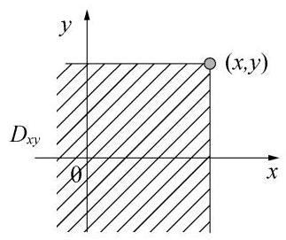
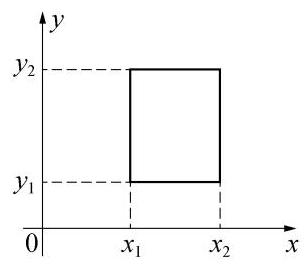
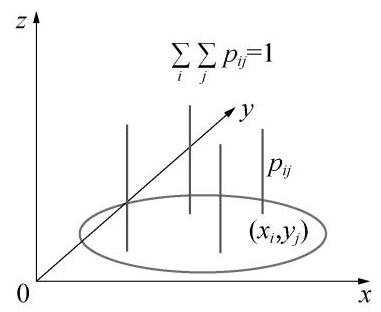
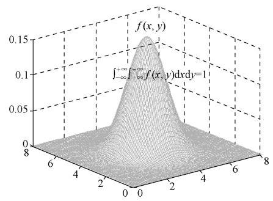
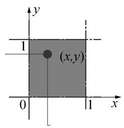
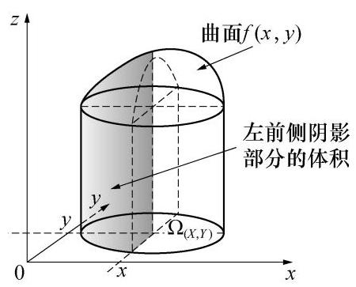
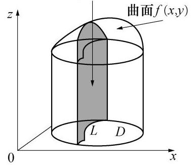
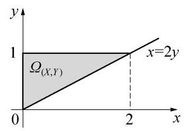
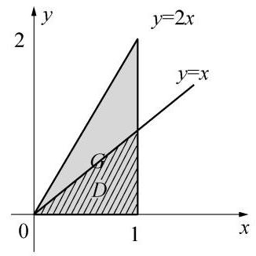
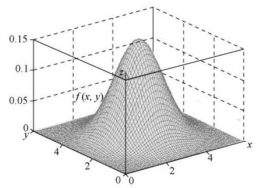

可将二维随机变量的定义推广至 $n$ 维.

定义 2 设有随机试验 $E$ ,其样本空间为 $\Omega$ . 若对 $\Omega$ 中的每一个样本点 $\omega$ 都有一组有序实数列 $\left( {{X}_{1}\left( \omega \right) ,{X}_{2}\left( \omega \right) ,\cdots ,{X}_{n}\left( \omega \right) }\right)$ 与其对应. 则称 $\left( {{X}_{1},{X}_{2},\cdots ,{X}_{n}}\right)$ 为 $n$ 维随机变量或 $n$ 维随机向量. 称 $\left( {{X}_{1},{X}_{2},\cdots ,{X}_{n}}\right)$ 的取值范围为它的值域,记为 ${\Omega }_{\left( {X}_{1},{X}_{2},\cdots ,{X}_{n}\right) }$ .

## 二、联合分布函数

对二维随机变量同样要讨论其分布. 和一维随机变量有所不同的是,(X, Y)的分布不仅要包含每个随机变量各自的分布信息, 还要包含两者之间相互关系的信息. 因此称它们的分布为联合分布. 首先给出联合分布函数的定义.

定义 3 设(X, Y)为二维随机变量,对任意的 $\left( {x, y}\right)  \in  {R}^{2}$ ,称

$$
F\left( {x, y}\right)  = P\left( {X \leq  x, Y \leq  y}\right)
$$

为随机变量(X, Y)的 (联合) 分布函数. 这里, $P\left( {X \leq  x, Y \leq  y}\right)$ 中的逗号表示对事件 $\{ X \leq  x\}$ 和事件 $\{ Y \leq  y\}$ 取积事件, $P\left( {X \leq  x, Y \leq  y}\right)  = P\left( {\{ X \leq  x\} \cap \{ Y \leq  y\} }\right)  =$ $P\left( {\left( {X, Y}\right)  \in  {D}_{xy}}\right)$ . 其中 ${D}_{xy}$ 区域如图 3.2 所示.

图 3.2 分布函数 $F\left( {x, y}\right)$ 对应的区域 ${D}_{xy}$

$F\left( {x, y}\right)$ 在点(x, y)处的函数值,即随机变量(X, Y)在区域 ${D}_{xy}$ 中取值的概率. 注意区别 $F\left( {x, y}\right)$ 的定义域与(X, Y)的值域 ${\Omega }_{\left( X, Y\right) }$ ,它们是两个不同的概念.

同样,可以给出 $n$ 维随机变量 $\left( {{X}_{1},{X}_{2},\cdots ,{X}_{n}}\right)$ 的联合分布函数的定义.

定义 4 设 $\left( {{X}_{1},{X}_{2},\cdots ,{X}_{n}}\right)$ 为 $n$ 维随机变量,对任意的 $\left( {{x}_{1},{x}_{2},\cdots ,{x}_{n}}\right)  \in  {R}^{n}$ ,称

$$
F\left( {{x}_{1},{x}_{2},\cdots ,{x}_{n}}\right)  = P\left( {{X}_{1} \leq  {x}_{1},\cdots ,{X}_{n} \leq  {x}_{n}}\right)
$$

为随机变量 $\left( {{X}_{1},{X}_{2},\cdots ,{X}_{n}}\right)$ 的 (联合) 分布函数.

和一维情形类似, 二维随机变量的联合分布函数具有下列性质.

定理 1 (联合分布函数的性质) 设 $F\left( {x, y}\right)$ 是二维随机变量(X, Y)的联合分布函数, 则

(1) $0 \leq  F\left( {x, y}\right)  \leq  1$ ;

(2)当固定 $y$ 值时, $F\left( {x, y}\right)$ 是变量 $x$ 的非减函数,

当固定 $x$ 值时, $F\left( {x, y}\right)$ 是变量 $y$ 的非减函数;

(3) $\mathop{\lim }\limits_{{x \rightarrow   - \infty }}F\left( {x, y}\right)  = 0,\mathop{\lim }\limits_{{y \rightarrow   - \infty }}F\left( {x, y}\right)  = 0,\mathop{\lim }\limits_{\substack{{x \rightarrow   - \infty } \\  {y \rightarrow   - \infty } }}F\left( {x, y}\right)  = 0,\mathop{\lim }\limits_{\substack{{x \rightarrow   + \infty } \\  {y \rightarrow   + \infty } }}F\left( {x, y}\right)  = 1$ ;

(4)当固定 $y$ 值时, $F\left( {x, y}\right)$ 是变量 $x$ 的右连续函数,

当固定 $x$ 值时, $F\left( {x, y}\right)$ 是变量 $y$ 的右连续函数;

(5) $P\left( {{x}_{1} < X \leq  {x}_{2},{y}_{1} < Y \leq  {y}_{2}}\right)  = F\left( {{x}_{2},{y}_{2}}\right)  - F\left( {{x}_{2},{y}_{1}}\right)  - F\left( {{x}_{1},{y}_{2}}\right)  + F\left( {{x}_{1},{y}_{1}}\right)$ .

证明

(1)函数 $F\left( {x, y}\right)$ 在点(x, y)处的函数值是事件 $\{ X \leq  x\}  \cap  \{ Y \leq  y\}$ 的概率,因此有性质 (1).

(2)固定 $y$ 值,当 ${x}_{1} < {x}_{2}$ 时,有 $\left\{  {X \leq  {x}_{1}, Y \leq  y}\right\}   \subset  \left\{  {X \leq  {x}_{2}, Y \leq  y}\right\}$ . 所以 $P\left( {X \leq  {x}_{1}}\right. , Y$ $\leq  y) \leq  P\left( {X \leq  {x}_{2}, Y \leq  y}\right)$ . 同理,固定 $x$ 值,当 ${y}_{1} < {y}_{2}$ 时,有 $P\left( {X \leq  x, Y \leq  {y}_{1}}\right)  \leq  P(X \leq  x$ , $\left. {Y \leq  {y}_{2}}\right)$ . 即性质 (2) 成立.

(3)性质(3)的证明见参考文献[1].

(4)性质(4)的证明见参考文献[1].

(5)因为

$$
\left\{  {{x}_{1} < X \leq  {x}_{2}}\right\}   \cap  \left\{  {{y}_{1} < Y \leq  {y}_{2}}\right\}   = \left( {\left\{  {X \leq  {x}_{2}}\right\}   \cap  \left\{  {Y \leq  {y}_{2}}\right\}  }\right)  - \left( {\left\{  {X \leq  {x}_{2}}\right\}   \cap  \left\{  {Y \leq  {y}_{1}}\right\}   - \left\{  {X \leq  {x}_{1}}\right\}   \cap  \left\{  {Y \leq  {y}_{1}}\right\}  }\right)  -
$$

$$
\left( {\left\{  {X \leq  {x}_{1}}\right\}   \cap  \left\{  {Y \leq  {y}_{2}}\right\}  }\right) \text{.}
$$

所以

$$
P\left( {{x}_{1} < X \leq  {x}_{2},{y}_{1} < Y \leq  {y}_{2}}\right)  = F\left( {{x}_{2},{y}_{2}}\right)  - \left( {F\left( {{x}_{2},{y}_{1}}\right)  - F\left( {{x}_{1},{y}_{1}}\right) }\right)  - F\left( {{x}_{1},{y}_{2}}\right)
$$

$$
= F\left( {{x}_{2},{y}_{2}}\right)  - F\left( {{x}_{2},{y}_{1}}\right)  - F\left( {{x}_{1},{y}_{2}}\right)  + F\left( {{x}_{1},{y}_{1}}\right) .
$$

即性质 (5) 成立 (见图 3.3).

注:

图 3.3 分布函数的矩形公式

(1)这 5 条性质是联合分布函数的本质特征,即有一个二元函数满足这 5 条性质, 那么它一定是某个二维随机变量的联合分布函数.

(2)除了性质(5),其他几条性质都可推广至高维随机变量的联合分布函数.

二维随机变量也分为离散型和非离散型, 如果它取值于平面上的一些离散的点, 就称为二维离散型随机变量. 非离散型中包含连续型, 我们着重讨论二维离散型随机变量和二维连续型随机变量, 怎样刻画它们的统计规律性是我们主要讨论的内容. 和一维的情形相似, 我们用联合分布律描述二维离散型随机变量的概率分布, 联合密度函数描述二维连续型随机变量的概率分布, 图 3.4 及图 3.5 分别给出了二维离散型和连续型随机变量的概率分布.

图 3.4 二维离散型随机变量的概率分布

图 3.5 二维连续型随机变量的概率分布

## 三、二维离散型随机变量及其联合分布律

这里先给出二维离散型随机变量及其联合分布律的定义. 多维情形类似.

定义 5 如果二维随机变量(X, Y)仅可能取有限个或可列无限个值,则称(X, Y)为

## 二维离散型随机变量.

---

[1] 李贤平. 概率论基础(第 3 版)[ M]. 北京: 高等教育出版社, 2010.

---

二维离散型随机变量(X, Y)的分布可用联合分布律表示.

定义 6 称 $P\left( {X = {x}_{i}, Y = {y}_{j}}\right)  = {p}_{ij}, i, j = 1,2,\cdots$ 为二维随机变量(X, Y)的联合分布律. 其中, ${p}_{ij} \geq  0, i, j = 1,2,\cdots ,\mathop{\sum }\limits_{i}\mathop{\sum }\limits_{j}{p}_{ij} = 1$ .

二维离散型随机变量(X, Y)的联合分布律可用表格法、公式法、图像法 (见图 3.4) 等方法表示,其中表格法最简洁,如下表所示. 表格中 ${x}_{1},{x}_{2},\cdots$ 和 ${y}_{1},{y}_{2},\cdots$ 自上而下, 自左而右, 按照从小到大的顺序排列.

<table><tr><td>$X$</td><td>${y}_{1}$</td><td>${y}_{2}$</td><td>...</td></tr><tr><td>${x}_{1}$</td><td>${p}_{11}$</td><td>${p}_{12}$</td><td>...</td></tr><tr><td>${x}_{2}$</td><td>${p}_{21}$</td><td>${p}_{22}$</td><td>...</td></tr><tr><td>$\vdots$</td><td>$\vdots$</td><td>$\vdots$</td><td/></tr></table>

二维离散型随机变量联合分布律的物理解释: 考虑 xoy 平面上单位质量的平面薄片, 在离散点 $\left( {{x}_{i},{y}_{j}}\right)$ 处分布着质点,其质量为 ${p}_{ij}, i, j = 1,2,\cdots$ . 这刻画了平面薄片的质量分布情况.

例 2 为分析一个年级的成绩分布, 定义随机变量

$$
X = \left\{  {\begin{array}{l} 1,\text{ 数学为优,} \\  0,\text{ 数学不为优,} \end{array}\;Y = \left\{  \begin{array}{l} 1,\text{ 语文为优,} \\  0,\text{ 语文不为优. } \end{array}\right. }\right.
$$

已知数学为优的占 20%,语文为优的占 10%,都为优的占 8%,求:

(1)(X, Y)的联合分布律；(2)(X, Y)的联合分布函数；(3)概率 $P\left( {X \leq  Y}\right)$ .

解 (1) 由已知得, $P\left( {Y = 1}\right)  = {0.1}, P\left( {X = 1, Y = 1}\right)  = {0.08}$ ,所以

$P\left( {X = 0, Y = 1}\right)  = P\left( {Y = 1}\right)  - P\left( {X = 1, Y = 1}\right)  = {0.02}$ .

又因为, $P\left( {X = 1}\right)  = {0.2}$ ,所以

$$
P\left( {X = 1, Y = 0}\right)  = P\left( {X = 1}\right)  - P\left( {X = 1, Y = 1}\right)  = {0.12}\text{.}
$$

因为 $\mathop{\sum }\limits_{i}\mathop{\sum }\limits_{j}{P}_{ij} = 1$ ,得 $P\left( {X = 0, Y = 0}\right)  = {0.78}$ . 故(X, Y)的联合分布律为

<table><tr><td>$Y$ $X$</td><td>0</td><td>1</td></tr><tr><td>0</td><td>0.78</td><td>0.02</td></tr><tr><td>1</td><td>0.12</td><td>0.08</td></tr></table>

图 3.6 ${\Omega }_{\left( X, Y\right) }$ 所围区域将 xoy 平面分为 9 个区域

(2)(X, Y)的值域 ${\Omega }_{\left( X, Y\right) } = \{ \left( {0,0}\right) ,\left( {0,1}\right) ,\left( {1,0}\right)$ , $\left( {1,1}\right) \}$ 中的四点所围区域将 xoy 平面分割为 9 个区域,如图 3. 6 所示,由 $F\left( {x, y}\right)  = P\left( {X \leq  x, Y \leq  y}\right)$ 得联合分布函数为

$$
F\left( {x, y}\right)  = \left\{  \begin{array}{ll} 0, & x < 0\text{ 或 }y < 0, \\  {0.78}, & 0 \leq  x < 1,0 \leq  y < 1, \\  {0.8}, & 0 \leq  x < 1, y \geq  1, \\  {0.9}, & x \geq  1,0 \leq  y < 1, \\  1, & x \geq  1, y \geq  1. \end{array}\right.
$$

(3) $P\left( {X \leq  Y}\right)  = 1 - P\left( {X > Y}\right)  = 1 - P\left( {X = 1, Y = 0}\right)  = 1 - {0.12} = {0.88}$ .

显然, 对二维离散型随机变量使用联合分布函数刻画其统计规律是比较复杂的, 通常我们使用联合分布律来描述二维离散型随机变量的取值规律. 若已知二维离散型随机变量的联合分布律就可以计算任意事件的概率.

例 1 续 把一枚骰子相互独立地上抛两次,设 $X$ 表示第一次出现的点数, $Y$ 表示两次出现点数的最小值. 试求: $\left( 1\right) \left( {X, Y}\right)$ 的联合分布律; $\left( 2\right) P\left( {X = Y}\right)$ 与 $P\left( {{X}^{2} + {Y}^{2} < 8}\right)$ .

解 (1) 由古典概率计算得(X, Y)的联合分布律为

<table><tr><td/><td/><td/><td/><td/><td/><td/></tr><tr><td>$Y$ $X$</td><td>1</td><td>2</td><td>3</td><td>4</td><td>5</td><td>6</td></tr><tr><td>1</td><td>$\frac{6}{36}$</td><td>0</td><td>0</td><td>0</td><td>0</td><td>0</td></tr><tr><td>2</td><td>$\frac{1}{36}$</td><td>$\frac{5}{36}$</td><td>0</td><td>0</td><td>0</td><td>0</td></tr><tr><td>3</td><td>$\frac{1}{36}$</td><td>$\frac{1}{36}$</td><td>$\frac{4}{36}$</td><td>0</td><td>0</td><td>0</td></tr><tr><td>4</td><td>$\frac{1}{36}$</td><td>$\frac{1}{36}$</td><td>$\frac{1}{36}$</td><td>$\frac{3}{36}$</td><td>0</td><td>0</td></tr><tr><td>5</td><td>$\frac{1}{36}$</td><td>$\frac{1}{36}$</td><td>$\frac{1}{36}$</td><td>$\frac{1}{36}$</td><td>$\frac{2}{36}$</td><td>0</td></tr><tr><td>6</td><td>$\frac{1}{36}$</td><td>$\frac{1}{36}$</td><td>$\frac{1}{36}$</td><td>$\frac{1}{36}$</td><td>$\frac{1}{36}$</td><td>$\frac{1}{36}$</td></tr></table>

(2) $P\left( {X = Y}\right)  = \mathop{\sum }\limits_{{i = 1}}^{6}P\left( {X = i, Y = i}\right)  = \frac{6}{36} + \frac{5}{36} + \frac{4}{36} + \frac{3}{36} + \frac{2}{36} + \frac{1}{36} = \frac{7}{12}$ ,

$P\left( {{X}^{2} + {Y}^{2} < 8}\right)  = P\left( {X = 1, Y = 1}\right)  + P\left( {X = 2, Y = 1}\right)  = \frac{7}{36}.$

## 四、二维连续型随机变量及其联合密度函数

定义 7 设二维随机变量(X, Y)的联合分布函数为 $F\left( {x, y}\right)$ ,如果存在一个二元非负实值函数 $f\left( {x, y}\right)$ ,使得对于任意 $\left( {x, y}\right)  \in  {R}^{2}$ 有

$$
F\left( {x, y}\right)  = {\int }_{-\infty }^{x}{\int }_{-\infty }^{y}f\left( {u, v}\right) \mathrm{d}u\mathrm{\;d}v
$$

成立,则称(X, Y)为二维连续型随机变量, $f\left( {x, y}\right)$ 为二维连续型随机变量(X, Y)的联合 (概率) 密度函数.

注: 定义 7 中 ${\int }_{-\infty }^{x}{\int }_{-\infty }^{y}f\left( {u, v}\right) \mathrm{d}u\mathrm{\;d}v$ 表示二重积分 ${\iint }_{{D}_{xy}}f\left( {u, v}\right) \mathrm{d}u\mathrm{\;d}v$ ,其中积分区域 ${D}_{xy} =$ $( - \infty , x\rbrack  \cdot  ( - \infty , y\rbrack$ .

图 3.7 给出了 $F\left( {x, y}\right)$ 的几何含义.

二维连续型随机变量联合密度函数的物理解释: 考虑 ${xoy}$ 平面上单位质量的平面薄片,其在点(x, y)处的面密度为 $f\left( {x, y}\right)$ ,它刻画了平面薄片的质量分布情况.

定义 8 设 $n$ 维随机变量 $\left( {{X}_{1},{X}_{2},\cdots ,{X}_{n}}\right)$ 的联合分布函数为 $F\left( {{x}_{1},{x}_{2},\cdots ,{x}_{n}}\right)$ ,如果存在一个 $n$ 元非负函数 $f\left( {{x}_{1},{x}_{2},\cdots ,{x}_{n}}\right)$ ,使得对任意的 $\left( {{x}_{1},{x}_{2},\cdots }\right.$ , $\left. {x}_{n}\right)  \in  {R}^{n}$ 有

图 ${3.7F}\left( {x, y}\right)$ 的几何含义

$F\left( {{x}_{1},{x}_{2},\cdots ,{x}_{n}}\right)  = {\int }_{-\infty }^{{x}_{1}}\cdots {\int }_{-\infty }^{{x}_{n}}f\left( {{u}_{1},{u}_{2},\cdots ,{u}_{n}}\right) \mathrm{d}{u}_{1}\mathrm{\;d}{u}_{2}\cdots \mathrm{d}{u}_{n}$ 成立,则称 $\left( {{X}_{1},{X}_{2},\cdots ,{X}_{n}}\right)$ 为 $n$ 维连续型随机变量, $f\left( {{x}_{1},{x}_{2},\cdots ,{x}_{n}}\right)$ 为 $n$ 维连续型随机变量 $\left( {{X}_{1},{X}_{2},\cdots }\right.$ , $\left. {X}_{n}\right)$ 的联合 (概率) 密度函数.

类似于一维连续型随机变量的密度函数, 二维连续型随机变量的联合密度函数有下列性质.

定理 2 (联合密度函数的性质) 设 $f\left( {x, y}\right)$ 为二维连续型随机变量(X, Y)的联合密度函数, 则

(1)非负性 $f\left( {x, y}\right)  \geq  0, - \infty  < x, y <  + \infty$ ;

(2)规范性 ${\int }_{-\infty }^{+\infty }{\int }_{-\infty }^{+\infty }f\left( {x, y}\right) \mathrm{d}x\mathrm{\;d}y = 1$ .

联合密度函数的规范性意味着以曲面 $f\left( {x, y}\right)$ 为顶以整个 xoy 平面与 ${\Omega }_{\left( X, Y\right) }$ 的交集区域为底的曲顶柱体的体积为 1 .

定理 3 (连续型随机变量的性质) 设二维连续型随机变量(X, Y)的联合分布函数为 $F\left( {x, y}\right)$ ,联合密度函数为 $f\left( {x, y}\right)$ ,则

(1)对任意一条平面曲线 $L$ ,有 $P\left( {\left( {X, Y}\right)  \in  L}\right)  = 0$ ；

(2) $F\left( {x, y}\right)$ 为连续函数,在 $f\left( {x, y}\right)$ 的连续点处有

$$
\frac{{\partial }^{2}F\left( {x, y}\right) }{\partial x\partial y} = f\left( {x, y}\right) ;
$$

(3)对 xoy 平面上任一区域 $D$ (见图 3.8) 有

$$
P\left( {\left( {X, Y}\right)  \in  D}\right)  = {\iint }_{D}f\left( {x, y}\right) \mathrm{d}x\mathrm{\;d}y.
$$

截面面积 ${\iint }_{L}f\left( {x, y}\right) \mathrm{d}x\mathrm{\;d}y = 0$

图 3.8 连续型随机变量的性质

性质 (1) 表示以曲面 $f\left( {x, y}\right)$ 为顶,投影曲线 $L$ 为底的曲顶柱体的体积, 也即如图 3.8 所示阴影部分曲面的体积, 显然为零.

性质 (2) 中,在 $f\left( {x, y}\right)$ 的非连续点处 $F\left( {x, y}\right)$ 的偏导数不存在,在这些点可以用任意一个常数定义 $f\left( {x, y}\right)$ ,这不影响事件的概率值. 这是因为(X, Y)在这些点组成的集合上取值的概率都为零.

例 3 设二维随机变量(X, Y)的联合密度函数为

$$
f\left( {x, y}\right)  = \left\{  \begin{array}{ll} c{y}^{2}, & 0 < x < {2y},0 < y < 1, \\  0, & \text{ 其他. } \end{array}\right.
$$

计算 (1) 常数 $c$ ; (2) 联合分布函数 $F\left( {x, y}\right)$ ; (3) 概率 $P\left( {\left| X\right|  \leq  Y}\right)$ .

解 (1) ${\Omega }_{\left( X, Y\right) } = \{ \left( {x, y}\right)  : 0 < x < {2y},0 < y < 1\}$ ,如图 3.9 所示. 由联合密度函数的规范性得

$$
1 = {\int }_{-\infty }^{+\infty }{\int }_{-\infty }^{+\infty }f\left( {x, y}\right) \mathrm{d}x\mathrm{\;d}y = {\int }_{0}^{1}\mathrm{\;d}y{\int }_{0}^{2y}c{y}^{2}\mathrm{\;d}x = \frac{c}{2}.
$$

图 3.9 例 3 的 ${\mathbf{\Omega }}_{\left( X, Y\right) }$

所以 $c = 2$ .

(2)由已知得,

当 $x < 0$ 或 $y < 0$ 时, $F\left( {x, y}\right)  = 0$ ;

当 $0 \leq  x < {2y}$ 且 $0 \leq  y < 1$ 时, $F\left( {x, y}\right)  = {\int }_{0}^{x}\mathrm{\;d}u{\int }_{\frac{x}{2}}^{y}2{v}^{2}\mathrm{\;d}v = \frac{2}{3}x\left( {{y}^{3} - \frac{{x}^{3}}{32}}\right)$ ;

当 $0 \leq  x < 2$ 且 $y \geq  1$ 时, $F\left( {x, y}\right)  = {\int }_{0}^{x}\mathrm{\;d}u{\int }_{\frac{x}{2}}^{1}2{v}^{2}\mathrm{\;d}v = \frac{2}{3}x\left( {1 - \frac{{x}^{3}}{32}}\right)$ ;

当 $x \geq  {2y}$ 且 $0 \leq  y < 1$ 时, $F\left( {x, y}\right)  = {\int }_{0}^{y}\mathrm{\;d}v{\int }_{0}^{2y}2{v}^{2}\mathrm{\;d}u = {y}^{4}$ ;

当 $x \geq  2$ 且 $y \geq  1$ 时, $F\left( {x, y}\right)  = 1$ .

所以, 联合分布函数为

$$
F\left( {x, y}\right)  = \left\{  \begin{array}{ll} 0, & x < 0\text{ 或 }y < 0, \\  \frac{2}{3}x\left( {{y}^{3} - \frac{{x}^{3}}{32}}\right) , & 0 \leq  x < {2y},0 \leq  y < 1, \\  \frac{2}{3}x\left( {1 - \frac{{x}^{3}}{32}}\right) , & 0 \leq  x < 2, y \geq  1, \\  {y}^{4}, & x \geq  {2y},0 \leq  y < 1, \\  1, & x \geq  2, y \geq  1. \end{array}\right.
$$

(3) $P\left( {\left| X\right|  \leq  Y}\right)  = {\iint }_{\left| x\right|  \leq  y}f\left( {x, y}\right) \mathrm{d}x\mathrm{\;d}y = {\int }_{0}^{1}\mathrm{\;d}y{\int }_{0}^{y}2{y}^{2}\mathrm{\;d}x = {\int }_{0}^{1}2{y}^{3}\mathrm{\;d}x = \frac{1}{2}$ .

显然, 对二维连续型随机变量使用联合分布函数刻画其统计规律也是比较复杂的, 通常我们使用联合密度函数来描述二维连续型随机变量的概率分布. 已知二维连续型随机变量的联合密度函数就可以计算任意事件的概率.

## 习题 3-1

1. 一个箱子中装有 100 件同类产品, 其中一、二、三等品分别有 70, 20, 10 件. 现从中随机地抽取一件. 试求 $\left( {{X}_{1},{X}_{2}}\right)$ 的联合分布律. 其中 ${X}_{i} = \left\{  {\begin{array}{ll} 1, & \text{ 如果抽到 }i\text{ 等品,} \\  0, & \text{ 如果抽到非 }i\text{ 等品,} \end{array}i = 1,2}\right.$ .

2. 两名水平相当的棋手奕棋三盘. 设 $X$ 表示某名棋手获胜的盘数, $Y$ 表示他输赢盘数之差的绝对值. 假定没有和棋,且每盘结果是相互独立的. 试求(X, Y)的联合分布律.

3. 设二维随机变量(X, Y)的联合分布律为

<table><tr><td>$Y$</td><td>0</td><td>1</td></tr><tr><td>0</td><td>0.4</td><td>$a$</td></tr><tr><td>1</td><td>$b$</td><td>0.1</td></tr></table>

已知随机事件 $\{ X = 0\}$ 与 $\{ X + Y = 1\}$ 相互独立,求 $a\text{、}b$ 的值.

4. 袋中有 1 个红球、 2 个黑球与 3 个白球,现有放回地从袋中取两次,每次取一个球,以 $X, Y, Z$ 分别表示两次取球所得的红球、黑球与白球的个数. 求 (1) 二维随机变量 (X, Y)的联合分布律; (2) $P\left( {X = 1 \mid  Z = 0}\right)$ .

5. 假设随机变量 $Y$ 服从参数为 $\lambda  = 1$ 的指数分布,随机变量

$$
{X}_{k} = \left\{  {\begin{array}{ll} 0, & Y \leq  k, \\  1, & Y > k, \end{array}\;k = 1,2.}\right.
$$

求 $\left( {{X}_{1},{X}_{2}}\right)$ 的联合分布律.

6. 设(X, Y)的联合密度函数为

$$
f\left( {x, y}\right)  = \left\{  \begin{array}{ll} c\left( {6 - x - y}\right) , & 0 < x < 2,2 < y < 4, \\  0, & \text{ 其他. } \end{array}\right.
$$

(1)试确定常数 $c$ 的值；(2)求概率 $P\left( {X + Y < 4}\right)$ ；(3)求概率 $P\left( {X < 1 \mid  X + Y < 4}\right)$ .

7. 已知(X, Y)的联合密度函数为

$$
f\left( {x, y}\right)  = \left\{  \begin{array}{ll} c{\mathrm{e}}^{-\left( {x + {2y}}\right) }, & x > 0, y > 0, \\  0, & \text{ 其他. } \end{array}\right.
$$

(1)试确定常数 $c$ 的值；(2)求概率 $P\left( {X < 1, Y > 2}\right)$ .

8. 设(X, Y)的联合密度函数为

$$
f\left( {x, y}\right)  = \left\{  \begin{array}{ll} {cxy}, & \left( {x, y}\right)  \in  G, \\  0, & \text{ 其他. } \end{array}\right.
$$

其中,区域 $G = \{ \left( {x, y}\right)  : 0 < y < {2x}$ 且 $0 < x < 2\}$ . 试求 (1) 常数 $c$ ; (2) 概率 $P\left( {X + Y < 1}\right)$ .

## 第二节 常用的多维随机变量

## 一、二维均匀分布

定义 1 设二维随机变量(X, Y)的联合密度函数为

$$
f\left( {x, y}\right)  = \left\{  \begin{array}{ll} \frac{1}{{S}_{G}}, & \left( {x, y}\right)  \in  G, \\  0, & \text{ 其他. } \end{array}\right.
$$

其中 $G$ 是 ${xoy}$ 平面上的某个区域, ${S}_{G}$ 为 $G$ 的面积,则称(X, Y)服从区域 $G$ 上的二维均匀分布.

图 3.10 例 1 的区域 $G$ 和区域 $D$

例 1 设二维随机变量(X, Y)服从区域 $G$ 上的均匀分布 (见图 3.10), $G = \{ \left( {x, y}\right)  : 0 < x < 1$ 且 $0 < y < {2x}\}$ .

(1)写出(X, Y)的联合密度函数；(2)计算概率 $P\left( {Y \leq  X}\right)$ .

解 (1) 因为 ${S}_{G} = 1$ ,由二维均匀分布的定义得(X, Y)的联合密度函数为

$$
f\left( {x, y}\right)  = \left\{  \begin{array}{ll} 1, & 0 < x < 1,0 < y < {2x}, \\  0, & \text{ 其他. } \end{array}\right.
$$

(2) $P\left( {Y \leq  X}\right)  = P\left( {\left( {X, Y}\right)  \in  D}\right)  = {\iint }_{D}f\left( {x, y}\right) \mathrm{d}x\mathrm{\;d}y = {\iint }_{D}1\mathrm{\;d}x\mathrm{\;d}y = {S}_{D} = \frac{1}{2}$ . 其中区域 $D$ 见图 3.10. 或 $P\left( {Y \leq  X}\right)  = \frac{{S}_{D}}{{S}_{G}} = \frac{1}{2}$ .

## 二、二维正态分布 $N\left( {{\mu }_{1},{\mu }_{2},{\sigma }_{1}^{2},{\sigma }_{2}^{2},\rho }\right)$

定义 2 如果(X, Y)的联合密度函数为

$$
f\left( {x, y}\right)  = \frac{1}{{2\pi }{\sigma }_{1}{\sigma }_{2}\sqrt{1 - {\rho }^{2}}}\exp \left\{  {-\frac{1}{2\left( {1 - {\rho }^{2}}\right) }\left\lbrack  {\frac{{\left( x - {\mu }_{1}\right) }^{2}}{{\sigma }_{1}^{2}} - {2\rho }\frac{\left( {x - {\mu }_{1}}\right) \left( {y - {\mu }_{2}}\right) }{{\sigma }_{1}{\sigma }_{2}} + \frac{{\left( y - {\mu }_{2}\right) }^{2}}{{\sigma }_{2}^{2}}}\right\rbrack  }\right\}  ,
$$

$- \infty  < x, y <  + \infty$ ,则称(X, Y)服从二维正态分布,并记为 $\left( {X, Y}\right)  \sim  N\left( {{\mu }_{1},{\mu }_{2},{\sigma }_{1}^{2},{\sigma }_{2}^{2}}\right.$ , $\rho )$ . 其中 $- \infty  < {\mu }_{1},{\mu }_{2} <  + \infty ,{\sigma }_{1},{\sigma }_{2} > 0,\left| \rho \right|  < 1$ . 二维正态分布联合密度函数的图像如图 3. 11 所示.

图 3.11 二维正态分布的联合密度函数图像

二维正态分布的 5 个参数都有具体的意义, 将在后面逐一介绍.

## 习题 3-2

1. 设(X, Y)服从以原点为圆心的单位圆上的均匀分布,记

$$
U = \left\{  {\begin{array}{ll} 1, & X + Y \leq  0, \\  0, & X + Y > 0, \end{array}\;V = \left\{  \begin{array}{ll} 1, & X - Y \leq  0, \\  0, & X - Y > 0. \end{array}\right. }\right.
$$

试求(U, V)的联合分布律.

2. 设(X, Y)服从区域 $G$ 上的均匀分布,其中 $G$ 由直线 $y =  - x, y = x$ 与 $x = 2$ 所围成. ( 1 )写出(X, Y)的联合密度函数；( 2 )求概率 $P\left( {X + Y < 2}\right)$ .

3. 已知 $\left( {X, Y}\right)  \sim  N\left( {1, - 1,1,4,{0.5}}\right)$ ,试写出(X, Y)的联合密度函数.

## 第三节 边缘分布

如果已知二维随机变量(X, Y)的联合分布,那么其中一个随机变量的分布肯定能够得到, 其分布我们称为边缘分布.

## 一、边缘分布函数

定义 1 设二维随机变量(X, Y)的联合分布函数为 $F\left( {x, y}\right)$ ,称 ${F}_{X}\left( x\right)  = P\left( {X \leq  x}\right)$ $= P\left( {X \leq  x, Y \leq   + \infty }\right)  = F\left( {x, + \infty }\right) , - \infty  < x <  + \infty$ 为随机变量 $X$ 的边缘分布函数; 称 ${F}_{Y}\left( y\right)  = P\left( {Y \leq  y}\right)  = P\left( {X \leq   + \infty , Y \leq  y}\right)  = F\left( {+\infty , y}\right) , - \infty  < y <  + \infty$ 为随机变量 $Y$ 的边缘分布函数.

例 1 已知二维随机变量(X, Y)的联合密度函数为

$$
f\left( {x, y}\right)  = \left\{  \begin{array}{ll} c{y}^{2}, & 0 < x < {2y},0 < y < 1, \\  0, & \text{ 其他. } \end{array}\right.
$$

分别计算 $X$ 与 $Y$ 的边缘分布函数.

解 在第一节例 4 中已得(X, Y)的联合分布函数,由此, $X$ 与 $Y$ 的边缘分布函数分别为

$$
{F}_{X}\left( x\right)  = F\left( {x, + \infty }\right)  = \left\{  \begin{array}{ll} 0, & x < 0, \\  \frac{2}{3}x\left( {1 - \frac{{x}^{3}}{32}}\right) , & 0 \leq  x < 2, \\  1, & x \geq  2; \end{array}\right.
$$

$$
{F}_{Y}\left( y\right)  = F\left( {+\infty , y}\right)  = \left\{  \begin{array}{ll} 0, & y < 0, \\  {y}^{4}, & 0 \leq  y < 1, \\  1, & y \geq  1. \end{array}\right.
$$

## 二、二维离散型随机变量的边缘分布律

定义 2 设二维离散型随机变量(X, Y)的联合分布律为 $P\left( {X = {x}_{i}}\right.$ , $\left. {Y = {y}_{j}}\right)  = {p}_{ij}, i, j = 1,2,\cdots$ ,称概率 $P\left( {X = {x}_{i}}\right)  = P\left( {X = {x}_{i},\underset{j}{ \cup  }Y = {y}_{j}}\right)  =$ $\mathop{\sum }\limits_{j}P\left( {X = {x}_{i}, Y = {y}_{j}}\right)  = \mathop{\sum }\limits_{j}{p}_{ij}, i = 1,2,\cdots$ 为随机变量 $X$ 的边缘分布律, 记为 ${p}_{i}$ .,并有 ${p}_{i}. = P\left( {X = {x}_{i}}\right)  = \mathop{\sum }\limits_{j}{p}_{ij}, i = 1,2,\cdots$ . 类似地,称概率 $P\left( {Y = {y}_{j}}\right) , j = 1,2,\cdots$ 为随机变量 $Y$ 的边缘分布律,记为 ${p}_{\cdot j}$ ,并有 ${p}_{\cdot j} =$ $P\left( {Y = {y}_{j}}\right)  = \mathop{\sum }\limits_{i}{p}_{ij}, j = 1,2,\cdots .$

由定义知,求 $X$ 的边缘分布律即为求(X, Y)联合分布律表格中的行和,求 $Y$ 的边缘分布律即为求(X, Y)联合分布律表格中的列和. 因为边缘分布律位于联合分布律表格的边缘, 所以称其为边缘分布律.

例 2 在第一节例 3 中计算 $X$ 与 $Y$ 的边缘分布律.

解 直接在(X, Y)联合分布律表格中计算行和、列和得

<table><tr><td/><td/><td/><td/><td/><td/><td/><td/></tr><tr><td>$X$ $Y$</td><td>1</td><td>2</td><td>3</td><td>4</td><td>5</td><td>6</td><td>${p}_{i}$ .</td></tr><tr><td>1</td><td>$\frac{6}{36}$</td><td>0</td><td>0</td><td>0</td><td>0</td><td>0</td><td>$\frac{1}{6}$</td></tr><tr><td>2</td><td>$\frac{1}{36}$</td><td>$\frac{5}{36}$</td><td>0</td><td>0</td><td>0</td><td>0</td><td>$\frac{1}{6}$</td></tr><tr><td>3</td><td>$\frac{1}{36}$</td><td>$\frac{1}{36}$</td><td>$\frac{4}{36}$</td><td>0</td><td>0</td><td>0</td><td>$\frac{1}{6}$</td></tr><tr><td>4</td><td>$\frac{1}{36}$</td><td>$\frac{1}{36}$</td><td>$\frac{1}{36}$</td><td>$\frac{3}{36}$</td><td>0</td><td>0</td><td>$\frac{1}{6}$</td></tr><tr><td>5</td><td>$\frac{1}{36}$</td><td>$\frac{1}{36}$</td><td>$\frac{1}{36}$</td><td>$\frac{1}{36}$</td><td>$\frac{2}{36}$</td><td>0</td><td>$\frac{1}{6}$</td></tr><tr><td>6</td><td>$\frac{1}{36}$</td><td>$\frac{1}{36}$</td><td>$\frac{1}{36}$</td><td>$\frac{1}{36}$</td><td>$\frac{1}{36}$</td><td>$\frac{1}{36}$</td><td>$\frac{1}{6}$</td></tr><tr><td>${p}_{\cdot j}$</td><td>$\frac{11}{36}$</td><td>$\frac{9}{36}$</td><td>$\frac{7}{36}$</td><td>$\frac{5}{36}$</td><td>$\frac{3}{36}$</td><td>$\frac{1}{36}$</td><td>1</td></tr></table>

所以, $X$ 的边缘分布律为

<table><tr><td>$X$</td><td>1</td><td>2</td><td>3</td><td>4</td><td>5</td><td>6</td></tr><tr><td>概率</td><td>$\frac{1}{6}$</td><td>$\frac{1}{6}$</td><td>$\frac{1}{6}$</td><td>$\frac{1}{6}$</td><td>$\frac{1}{6}$</td><td>$\frac{1}{6}$</td></tr></table>

$Y$ 的边缘分布律为

<table><tr><td>$Y$</td><td>1</td><td>2</td><td>3</td><td>4</td><td>5</td><td>6</td></tr><tr><td>概率</td><td>$\frac{11}{36}$</td><td>$\frac{9}{36}$</td><td>$\frac{7}{36}$</td><td>$\frac{5}{36}$</td><td>$\frac{3}{36}$</td><td>$\frac{1}{36}$</td></tr></table>

## 三、二维连续型随机变量的边缘密度函数

设二维连续型随机变量(X, Y)的联合分布函数为 $F\left( {x, y}\right)$ ,联合密度函数为 $f(x$ , $y)$ ,根据 ${F}_{X}\left( x\right)  = F\left( {x, + \infty }\right) , - \infty  < x <  + \infty$ ,得

$$
{\int }_{-\infty }^{x}{f}_{X}\left( u\right) \mathrm{d}u = {\int }_{-\infty }^{x}\left\lbrack  {{\int }_{-\infty }^{+\infty }f\left( {u, y}\right) \mathrm{d}y}\right\rbrack  \mathrm{d}u,
$$

由 $x$ 的任意性知, ${f}_{X}\left( x\right)  = {\int }_{-\infty }^{+\infty }f\left( {x, y}\right) \mathrm{d}y$ ,因此有如下定义.

定义 3 设二维连续型随机变量(X, Y)的联合密度函数为 $f\left( {x, y}\right)$ ,则 $X$ 的边缘密度函数为

$$
{f}_{X}\left( x\right)  = {\int }_{-\infty }^{+\infty }f\left( {x, y}\right) \mathrm{d}y.
$$

类似地, $Y$ 的边缘密度函数为

$$
{f}_{Y}\left( y\right)  = {\int }_{-\infty }^{+\infty }f\left( {x, y}\right) \mathrm{d}x.
$$

例 3 在第一节例 4 中,计算 $\left( 1\right) X$ 的边缘密度函数; $\left( 2\right) Y$ 的边缘密度函数.