# 2014 年上海市初三数学竞赛

中图分类号:G424.79 文献标识码:A 文章编号:1005-6416(2015)04-0019-05

【说明】解答本试卷可使用科学计算器. 一、填空题 (每小题 10 分, 共 80 分) 1. 化简: $\frac{{a}^{3} - {a}^{2}b - a{b}^{2} + {b}^{3}}{{a}^{2} - 2\left| {ab}\right|  + {b}^{2}} =$ _____. 2. 若 $\frac{y}{x} + \frac{x}{z} = a,\frac{z}{y} + \frac{y}{x} = b,\frac{x}{z} + \frac{z}{y} = c$ , 则 $\left( {b + c - a}\right) \left( {c + a - b}\right) \left( {a + b - c}\right)  =$ _____.

3. 已知四边形 ${ABCD}$ 为等腰梯形, ${AB}//{CD},{AB} = 6,{CD} = {16}.\bigtriangleup {ACE}$ 为直角三角形, $\angle {AEC} = {90}^{ \circ  },{CE} = {BC} = {AD}$ . 则 ${AE}$ 的长为_____.

## 4. 方程

${xyz} + {xy} + {yz} + {zx} + x + y + z = {2014}$ 的非负整数解(x, y, z)有_____组.

5. 在 $\bigtriangleup {ABC}$ 中,已知 $\angle {ABC} = {44}^{ \circ  }, D$ 为边 ${BC}$ 上的一点,满足 ${DC} = {2AB},\angle {BAD} =$ ${24}^{ \circ  }$ . 则 $\angle {ACB}$ 的大小为_____.

6. 在直角坐标平面 ${xOy}$ 上,由不等式组

$\left\{  \begin{array}{l} \left| x\right|  \leq  2, \\  \left| y\right|  \leq  2, \\  \left| \right| x\left| -\right| y\left| \right|  \leq  1 \end{array}\right.$

确定的区域面积为_____.

7. 使得关于 $x$ 的方程

${a}^{2}{x}^{2} + {ax} + 1 - {13}{a}^{2} = 0$

有两个整数根的所有正实数 $a$ 为_____.

8. 设 ${2014}^{2}$ 的所有正约数为 ${d}_{1},{d}_{2},\cdots$ , ${d}_{k}$ . 则

$\frac{1}{{d}_{1} + {2014}} + \frac{1}{{d}_{2} + {2014}} + \cdots  + \frac{1}{{d}_{k} + {2014}}$ $=$ _____.

## 二、解答题 (70 分)

9. (15 分) 解关于 $x$ 的方程

$$
\sqrt{x + \sqrt{x}} - \sqrt{x - \sqrt{x}} = \left( {a + 1}\right) \sqrt{\frac{x}{x + \sqrt{x}}}.
$$

10. (15 分) 如图 1,在凸四边形 ${ABCD}$ 中, 已知 $\angle {ABC} + \angle {CDA} = {300}^{ \circ  },{AB} \cdot  {CD} = {BC} \cdot  {AD}$ . 证明: ${AB} \cdot  {CD} = {AC} \cdot  {BD}$ .

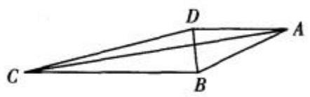

图 1

11. (20 分) 已知边长为 $a$ 的正方形 ${ABCD}$ 的内部有 $n$ 个圆,每个圆的面积均不大于 1,且与正方形 ${ABCD}$ 的边平行的直线均至多与一个圆相交. 证明: 这 $n$ 个圆的面积之和小于 $a$ .

12. (20 分) 证明: (1) 可以将全体正整数分成三组 ${A}_{1}\text{、}{A}_{2}\text{、}{A}_{3}$ ,使得对每一个整数 $n \geq  {15}$ ,在 ${A}_{1}\text{、}{A}_{2}\text{、}{A}_{3}$ 的每一组中均能取出两个不同的数,其和为 $n$ .

(2)将全体正整数任意分成四组 ${A}_{1}$ 、 ${A}_{2}$ 、 ${A}_{3}\text{、}{A}_{4}$ ,则存在整数 $n \geq  {15}$ ,在 ${A}_{1}\text{、}{A}_{2}\text{、}{A}_{3}\text{、}{A}_{4}$ 中一定有一组 ${A}_{i}$ ,在 ${A}_{i}$ 中不存在两个不同的数,其和为 $n$ .

## 参考答案

$$
\text{一、1.}\left\{  \begin{array}{ll} b, & a = 0, b \neq  0; \\  a + b, & {ab} > 0; \\  \frac{{\left( a - b\right) }^{2}}{a + b}, & {ab} < 0; \\  a, & a \neq  0, b = 0. \end{array}\right.
$$

原式 $= \frac{{a}^{2}\left( {a - b}\right)  - {b}^{2}\left( {a - b}\right) }{{\left| a\right| }^{2} - 2\left| a\right| \left| b\right|  + {\left| b\right| }^{2}}$

$$
= \frac{{\left( a - b\right) }^{2}\left( {a + b}\right) }{{\left( \left| a\right|  - \left| b\right| \right) }^{2}}
$$

$$
= \left\{  \begin{array}{ll} b, & a = 0, b \neq  0; \\  a + b, & {ab} > 0; \\  \frac{{\left( a - b\right) }^{2}}{a + b}, & {ab} < 0; \\  a, & a \neq  0, b = 0. \end{array}\right.
$$

2.8 .

注意到,

$b + c - a = \left( {\frac{z}{y} + \frac{y}{x}}\right)  + \left( {\frac{x}{z} + \frac{z}{y}}\right)  - \left( {\frac{y}{x} + \frac{x}{z}}\right)$

$= \frac{2z}{y}$ .

类似地, $c + a - b = \frac{2x}{z}, a + b - c = \frac{2y}{x}$ .

故 $\left( {b + c - a}\right) \left( {c + a - b}\right) \left( {a + b - c}\right)$

$= \frac{2z}{y} \cdot  \frac{2x}{z} \cdot  \frac{2y}{x} = 8$ .

3. $4\sqrt{6}$ . 如图 2,过 $A$ 作 ${AF} \bot  {CD}$ 于点 $F$ . 则

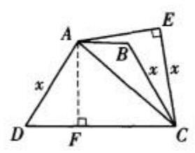

图 2

${DF} = 5,{CF} = {11}$ .

设 ${CE} = {BC}$

$= {AD} = x$ .

于是, $A{C}^{2} = {x}^{2} + A{E}^{2}$ ,

$A{C}^{2} = A{F}^{2} + {11}^{2} = {x}^{2} - {5}^{2} + {11}^{2}.$

故 ${x}^{2} + A{E}^{2} = {x}^{2} - {5}^{2} + {11}^{2}$

$\Rightarrow  A{E}^{2} = {96} \Rightarrow  {AE} = 4\sqrt{6}$ .

4.27.

原方程可变形为

$\left( {x + 1}\right) \left( {y + 1}\right) \left( {z + 1}\right)  = {2015} = 5 \times  {13} \times  {31}.$

若 $x\text{、}y\text{、}z$ 均为正整数,则有 $1 \times  2 \times  3 = 6$ 组解;

若 $x\text{、}y\text{、}z$ 中有一个为零,另两个为正整数,则有 $3 \times  6 = {18}$ 组解;

若 $x\text{、}y\text{、}z$ 中有两个为零,一个为正整数, 则有 3 组解;

故原方程有 $6 + {18} + 3 = {27}$ 组非负整数解.

5.22 %

易知, $\angle {ADC} = {44}^{ \circ  } + {24}^{ \circ  } = {68}^{ \circ  }$ .

如图 3, 作射线 ${AK}$ ,使 $\angle {DAK}$ $= {68}^{ \circ  }$ ,且与 ${DC}$ 交于点 $K$ . 则 ${AK} = {DK}$ .

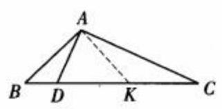

图 3

由 $\angle {AKD} = {180}^{ \circ  } - 2 \times  {68}^{ \circ  } = \angle B$ ,知

${AK} = {AB}$ .

故 ${DK} = {AB}$ .

因为 ${DC} = {2AB}$ ,所以,

${KC} = {AB} = {AK},\angle C = \frac{1}{2}\angle {AKD} = {22}^{ \circ  }$ .

6.12 .

显然,区域既关于 $x$ 轴对称,又关于 $y$ 轴对称. 因此,可先假定 $x \geq  0, y \geq  0$ .

由 $\left\{  \begin{array}{l} 0 \leq  x \leq  2, \\  0 \leq  y \leq  2, \\   - 1 \leq  x - y \leq  1 \end{array}\right.$ 画出区域在第一象限

(包括坐标轴) 的部分, 再对称作出整个区域, 如图 4.

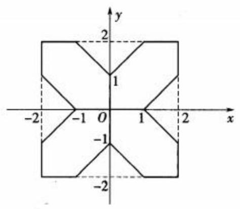

图 4

所求区域的面积是边长为 4 的正方形面积减去八个腰长为 1 的等腰直角三角形面积,即 ${4}^{2} - 8 \times  \frac{1}{2} = {12}$ .

7.1 . $\frac{1}{3}$ . $\frac{1}{4}$ .

设两个整数根为 $\alpha \text{、}\beta$ . 则由 $\alpha  + \beta  =  - \frac{1}{a}$ 为整数,知正数 $a = \frac{1}{n}$ ( $n$ 为正整数).

于是, 原方程可写成

${x}^{2} + {nx} + {n}^{2} - {13} = 0.$

由 $\Delta  = {n}^{2} - 4\left( {{n}^{2} - {13}}\right)  = {52} - 3{n}^{2} \geq  0$

$\Rightarrow  {n}^{2} \leq  \frac{52}{3}$ .

因此, $n$ 可取 $1\text{、}2\text{、}3\text{、}4$ .

当 $n = 1$ 时,原方程为 ${x}^{2} + x - {12} = 0$ ,有两个整数根;

当 $n = 2$ 时,原方程为 ${x}^{2} + {2x} - 9 = 0$ ,无整数根;

当 $n = 3$ 时,原方程为 ${x}^{2} + {3x} - 4 = 0$ ,有两个整数根;

当 $n = 4$ 时,原方程为 ${x}^{2} + {4x} + 3 = 0$ ,有两个整数根.

从而, $a$ 可取 $1\text{、}\frac{1}{3}\text{、}\frac{1}{4}$ .

8. $\frac{27}{4028}$ .

注意到, ${2014}^{2} = {2}^{2} \times  {19}^{2} \times  {53}^{2}$ .

于是, ${2014}^{2}$ 的正约数有 ${\left( 2 + 1\right) }^{3} = {27}$ 个,即 $k = {27}$ .

不妨设 $1 = {d}_{1} < {d}_{2} < \cdots  < {d}_{27} = {2014}^{2}$ .

从而, ${d}_{i}{d}_{{28} - i} = {2014}^{2}\left( {i = 1,2,\cdots ,{27}}\right)$ .

则 $\frac{1}{{d}_{i} + {2014}} + \frac{1}{{d}_{{28} - i} + {2014}}$

$= \frac{{d}_{i} + {d}_{{28} - i} + 2 \times  {2014}}{{d}_{i}{d}_{{28} - i} + {2014}\left( {{d}_{i} + {d}_{{28} - i}}\right)  + {2014}^{2}}$

$= \frac{1}{2014}$ .

故 $\frac{1}{{d}_{1} + {2014}} + \frac{1}{{d}_{2} + {2014}} + \cdots  + \frac{1}{{d}_{27} + {2014}}$

$$
= \frac{1}{2}\left\lbrack  {\left( {\frac{1}{{d}_{1} + {2014}} + \frac{1}{{d}_{27} + {2014}}}\right)  + }\right.
$$

$\left( {\frac{1}{{d}_{2} + {2014}} + \frac{1}{{d}_{26} + {2014}}}\right)  + \cdots  +$

$$
\left. \left( {\frac{1}{{d}_{27} + {2014}} + \frac{1}{{d}_{1} + {2014}}}\right) \right\rbrack
$$

$$
= \frac{1}{2} \times  {27} \times  \frac{1}{2014} = \frac{27}{4028}\text{. }
$$

## 二、9. 由已知得

$$
\left\{  \begin{array}{l} x \geq  0, \\  x - \sqrt{x} \geq  0, \Rightarrow  x \geq  1. \\  x + \sqrt{x} \neq  0 \end{array}\right.
$$

原方程等价于

$$
x + \sqrt{x} - \sqrt{{x}^{2} - x} = \left( {a + 1}\right) \sqrt{x}
$$

$$
\Leftrightarrow  \sqrt{x} + 1 - \sqrt{x - 1} = a + 1
$$

$$
\Leftrightarrow  \sqrt{x} - \sqrt{x - 1} = a
$$

①

$$
\Leftrightarrow  \frac{1}{\sqrt{x} + \sqrt{x - 1}} = a
$$

$$
\Leftrightarrow  \sqrt{x} + \sqrt{x - 1} = \frac{1}{a}\text{.}
$$

②

由 $x$ 的取值范围知

$$
\sqrt{x} + \sqrt{x - 1} \geq  \sqrt{1} + \sqrt{1 - 1} = 1
$$

$$
\Rightarrow  \frac{1}{a} \geq  1
$$

$\Rightarrow  0 < a \leq  1$ .③

此时, ① + ②得

$2\sqrt{x} = a + \frac{1}{a} \Rightarrow  x = {\left( \frac{{a}^{2} + 1}{2a}\right) }^{2}$ .

将 $x = {\left( \frac{{a}^{2} + 1}{2a}\right) }^{2}$ 代入式①,并结合式③得

左边 $= \frac{{a}^{2} + 1}{2a} - \sqrt{{\left( \frac{{a}^{2} + 1}{2a}\right) }^{2} - 1}$

$= \frac{{a}^{2} + 1}{2a} - \frac{1 - {a}^{2}}{2a} = a =$ 右边.

所以, $x = {\left( \frac{{a}^{2} + 1}{2a}\right) }^{2}$ 为原方程的解.

综上,当且仅当 $0 < a \leq  1$ 时,方程有解

$$
x = {\left( \frac{{a}^{2} + 1}{2a}\right) }^{2}.
$$

10. 如图 5,作正 $\bigtriangleup {BCE}$ ,联结 ${DE}$ .

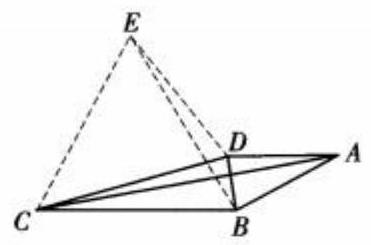

图 5

由 $\angle {ABC} + \angle {CDA} = {300}^{ \circ  }$ ,得

$\angle {BAD} + \angle {BCD} = {360}^{ \circ  } - {300}^{ \circ  } = {60}^{ \circ  }$ .

于是, $\angle {DCE} = {60}^{ \circ  } - \angle {BCD} = \angle {BAD}$ .

又由题设知

$\frac{AB}{BC} = \frac{AD}{CD} \Rightarrow  \frac{AB}{CE} = \frac{AD}{CD}$ .

则 $\bigtriangleup  {ABD} \backsim   \bigtriangleup  {CED}$

$\Rightarrow  \frac{AB}{CE} = \frac{AD}{CD} = \frac{BD}{ED},\angle {ADB} = \angle {CDE}$ .

于是, $\angle {BDE} = \angle {ADC}$ .

故 $\bigtriangleup  {BDE} \backsim   \bigtriangleup  {ADC}$

$\Rightarrow  \frac{BD}{BE} = \frac{AD}{AC} \Rightarrow  \frac{BD}{BC} = \frac{AD}{AC}$

$\Rightarrow  {AC} \cdot  {BD} = {BC} \cdot  {AD}$

$\Rightarrow  {AB} \cdot  {CD} = {AC} \cdot  {BD}$ .

11. 设第 $i\left( {i = 1,2,\cdots , n}\right)$ 个圆的直径为 ${d}_{i}$ . 则该圆的面积 ${S}_{i} = \frac{\pi }{4}{d}_{i}^{2}$ .

由题设知 ${S}_{i} \leq  1$ .

若 ${d}_{i} > 1$ ,则 ${S}_{i} \leq  1 < {d}_{i}$ ;

若 $0 < {d}_{i} \leq  1$ ,则 ${S}_{i} = \frac{\pi }{4}{d}_{i}^{2} \leq  \frac{\pi }{4}{d}_{i} < {d}_{i}$ .

故 ${S}_{1} + {S}_{2} + \cdots  + {S}_{n} < {d}_{1} + {d}_{2} + \cdots  + {d}_{n}$ . ①

如图 6,将这 $n$ 个圆垂直投影到边 ${AB}$ 上,得到长为 ${d}_{1},{d}_{2},\cdots ,{d}_{n}$ 的 $n$ 条线段, 由于与正方形 ${ABCD}$ 的边平行的直线至多与一个圆相交, 于是, 这 $n$ 条线段除端点外两两不相交. 从而,

$$
{d}_{1} + {d}_{2} + \cdots  + {d}_{n} \leq  {AB} = a.
$$

②

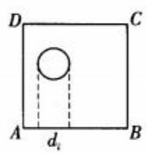

图 6

结合式①、②得

$$
{S}_{1} + {S}_{2} + \cdots  + {S}_{n} < a\text{.}
$$

12. (1) 将全体正整数分成如下三组:

$$
{A}_{1} = \{ 1,2,3,3 \times  3 + 3,3 \times  4 + 3,\cdots \} ,
$$

$$
{A}_{2} = \{ 4,5,6,3 \times  3 + 2,3 \times  4 + 2,\cdots \} \text{,}
$$

$$
{A}_{3} = \{ 7,8,9,3 \times  3 + 1,3 \times  4 + 1,\cdots \} \text{.}
$$

下面证明: 对每一个整数 $n \geq  {15}$ ,在 ${A}_{1}$ 、 ${A}_{2}\text{、}{A}_{3}$ 的每一组中均能取出两个不同的数, 其和为 $n$ .

对于整数 $n \geq  {15}$ ,可写成 ${3k} + 4\text{、}{3k} + 5$ 、 ${3k} + 6\left( {k \geq  3}\right)$ 中的一种,即可表示成 ${A}_{1}$ 中两个不同数的和; 也可写成 ${3k} + 6\text{、}{3k} + 7$ 、 ${3k} + 8\left( {k \geq  3}\right)$ 中的一种,即可以表示成 ${A}_{2}$ 中两个不同数的和; 又可写成 $7 + 8\text{、}7 + 9$ 或 ${3k} + 8\text{、}{3k} + 9\text{、}{3k} + {10}\left( {k \geq  3}\right)$ 中的一种,即可表示成 ${A}_{3}$ 中两个不同数的和.

(2)证法 1 用反证法.

若不然, 则存在一种将全体正整数分成四个组 ${A}_{1}\text{、}{A}_{2}\text{、}{A}_{3}\text{、}{A}_{4}$ 的一种分法,使得对每一个整数 $n \geq  {15},{A}_{i}\left( {i = 1,2,3,4}\right)$ 中均存在两个不同的数,其和为 $n$ .

将 ${A}_{1}\text{、}{A}_{2}\text{、}{A}_{3}\text{、}{A}_{4}$ 中小于或等于 23 的数组成的数组分别记为 ${B}_{1}\text{、}{B}_{2}\text{、}{B}_{3}\text{、}{B}_{4}$ ,则 ${B}_{1}$ 、 ${B}_{2}\text{、}{B}_{3}\text{、}{B}_{4}$ 中数的个数和为 23,并且对每个 $i\left( {i = 1,2,3,4}\right) ,{15},{16},\cdots ,{24}$ 这十个数均为 ${B}_{i}$ 中两个不同数的和,故 ${B}_{i}$ 中至少有五个数 (因为四个数两两不同的和至多六种可能). 从而, ${B}_{1}\text{、}{B}_{2}\text{、}{B}_{3}\text{、}{B}_{4}$ 中有一个恰有五个数 (否则, ${B}_{1}\text{、}{B}_{2}\text{、}{B}_{3}\text{、}{B}_{4}$ 中数的个数和大于或等于 $4 \times  6 = {24} > {23})$ .

不妨设 ${B}_{1}$ 有五个数,记 ${B}_{1} = \{ a, b, c, d, e\}$ . 则 ${A}_{1}$ 中的两个不同数的和表示 ${15},{16},\cdots ,{24}$ 恰为 ${B}_{1}$ 中五个数的两两和. 于是,

$$
4\left( {a + b + c + d + e}\right)  = {15} + {16} + \cdots  + {24},
$$

即 $4\left( {a + b + c + d + e}\right)  = {195}$ , 矛盾.

证法 2 用反证法.

若不然, 则存在一种将全体正整数分成四个组 ${A}_{1}\text{、}{A}_{2}\text{、}{A}_{3}\text{、}{A}_{4}$ 的一种分法,使得对每一个整数 $n \geq  {15},{A}_{i}\left( {i = 1,2,3,4}\right)$ 中均存在两个不同的数,其和为 $n$ .

若 ${15},{16},\cdots ,{20}$ 能表示成 $a + b(a\text{、}b$ 均为正整数, $a \neq  b)$ 的形式,则 $a\text{、}b$ 均不超过 19 .

在 $1,2,\cdots ,{19}$ 中,由抽屉原理,知存在某个 ${A}_{i}$ (不妨设为 ${A}_{1}$ ),它至多含有这 19 个数中的四个数,记 ${A}_{1}$ 中不超过 19 的四个数为 $a\text{、}b\text{、}c\text{、}d\left( {a < b < c < d}\right)$ . 则 $a\text{、}b\text{、}c\text{、}d$ 的两两和为 ${15}\text{、}{16}\text{、}{17}\text{、}{18}\text{、}{19}\text{、}{20}$ .

故 $a + b = {15}, a + c = {16}$ ,

$b + d = {19}, c + d = {20}$ ,

$\{ a + d, b + c\}  = \{ {17},{18}\}$ .

所以, $d - a = 4$ .

由 $d - a$ 为偶数,知 $a + d$ 为偶数.

因此, $a + d = {18}$ .

从而, $b + c = {17}$ .

于是, $a = 7, b = 8, c = 9, d = {11}$ .

由于 ${A}_{1}$ 不含 1,故 21 不能表示成 ${A}_{1}$ 中两个不同数的和, 矛盾.

(熊 斌 顾鸿达 李大元 刘鸿坤叶声扬 命题)

2013 上海市初中数学竞赛(新知杯)试题

(2013 年 12 月 8 日 上午 9:00~11:00)

<table><tr><td rowspan="2">题 号</td><td rowspan="2">一 $\left( {1 \sim  8}\right)$</td><td colspan="4">二</td><td rowspan="2">总 分</td></tr><tr><td>9</td><td>10</td><td>11</td><td>12</td></tr><tr><td>得 分</td><td/><td/><td/><td/><td/><td/></tr><tr><td>评 卷</td><td/><td/><td/><td/><td/><td/></tr><tr><td>复核</td><td/><td/><td/><td/><td/><td/></tr></table>

## 一、填空题(每题 10 分)

1. 已知 $a = \frac{1}{2 + \sqrt{7}}, b = \frac{1}{2 - \sqrt{7}}$ ,则 ${a}^{3} - a + {b}^{3} - b =$ _____.

2. 已知 ${l}_{1}//{l}_{2}//{l}_{3}//{l}_{4},{m}_{1}//{m}_{2}//{m}_{3}//{m}_{4},{S}_{ABCD} = {100},{S}_{ILKJ} = {20}$ ,则 ${S}_{EFGH} =$ _____.

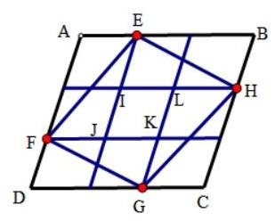

3. 已知 $\angle A = {90}^{ \circ  },{AB} = 6,{AC} = 8, E\text{、}F$ 在 ${AB}$ 上且 ${AE} = 2,{BF} = 3$ 过点 $E$ 作 ${AC}$ 的平行线交

${BC}$ 于 $D$ , ${FD}$ 的延长线交 ${AC}$ 的延长线于 $G$ ,则 ${GF} =$ _____.

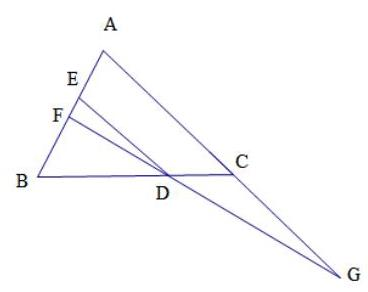

4. 已知凸五边形的边长为 ${a}_{1},{a}_{2},{a}_{3},{a}_{4},{a}_{5}, f\left( x\right)$ 为二次三项式; 当 $x = {a}_{1}$ 或者 $x = {a}_{2} + {a}_{3} + {a}_{4} + {a}_{5}$

时, $f\left( x\right)  = 5$ ,

当 $x = {a}_{1} + {a}_{2}$ 时, $f\left( x\right)  = p$ ,当 $x = {a}_{3} + {a}_{4} + {a}_{5}$ 时, $f\left( x\right)  = q$ ,则 $p - q =$ _____.

5.已知一个三位数是 35 的倍数且各个数位上数字之和为 15,则这个三位数为_____.

6. 已知关于 $x$ 的一元二次方程 ${x}^{2} + {ax} + \left( {m + 1}\right) \left( {m + 2}\right)  = 0$ 对于任意的实数 $a$ 都有实数根,则 $m$ 的取值范围是_____.

7. 已知四边形 ${ABCD}$ 的面积为 2013, $E$ 为 ${AD}$ 上一点, ${\Delta BCE},{\Delta ABE},{\Delta CDE}$ 的重心分别为

${G}_{1},{G}_{2},{G}_{3}$ ,那么 $\Delta {G}_{1}{G}_{2}{G}_{3}$ 的面积为_____.

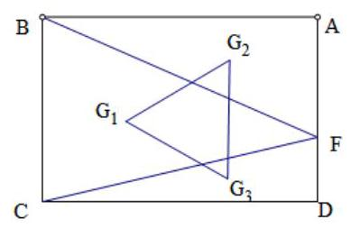

8. 直角三角形斜边 ${AB}$ 上的高 ${CD} = 3$ ,延长 ${DC}$ 到 $P$ 使得 ${CP} = 2$ ,过 $B$ 作 ${BF}\bot {AP}$ 交 ${CD}$ 于 $E$ ,

交 ${AP}$ 于 $F$ ,则 ${DE} =$ _____.

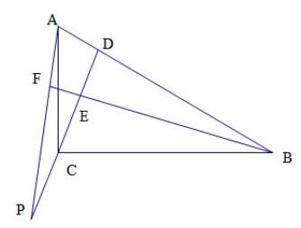

## 二、解答题 (第 9 题、第 10 题 15 分, 第 11 题、第 12 题 20 分)

9. 已知 $\angle {BAC} = {90}^{ \circ  }$ ,四边形 ${ADEF}$ 是正方形且边长为 1,求 $\frac{1}{AB} + \frac{1}{BC} + \frac{1}{CA}$ 的最大值.

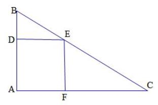

10. 已知 $a$ 是不为 0 的实数,求解方程组: $\left\{  \begin{array}{l} {xy} - \frac{x}{y} = a \\  {xy} - \frac{y}{x} = \frac{1}{a} \end{array}\right.$

11. 已知: $n > 1,{a}_{1},{a}_{2},{a}_{3},\Lambda ,{a}_{n}$ 为整数且 ${a}_{1} + {a}_{2} + {a}_{3} + \Lambda  + {a}_{n} = {a}_{1} \cdot  {a}_{2} \cdot  {a}_{3} \cdot  \Lambda  \cdot  {a}_{n} = {2013}$ ,求 $n$ 的最小值.

12. 已知正整数 $a$ 、 $b$ 、 $c$ 、 $d$ 满足 ${a}^{2} = c\left( {d + {13}}\right) ,{b}^{2} = c\left( {d - {13}}\right)$ ,求所有满足条件的 $d$ 的值.

## 2013 上海新知杯初中数学竞赛答案

${1.} - 2\frac{10}{27}\;{2.60}\;3.\sqrt{265}\;{4.0}\;{5.735}\;6. - 2 \leq  m \leq   - 1\;7.\frac{671}{3}\;8.\frac{9}{5}$

9. $\frac{1}{AB} + \frac{1}{BC} + \frac{1}{CA} \leq  1 + \frac{2\sqrt{2}}{4}\;$ 10. 经检验原方程组的解为: $\left\{  \begin{array}{l} x = \frac{\sqrt{{a}^{2} + 1}}{a}, \\  y = \sqrt{{a}^{2} + 1} \end{array}\right.$ , $\left\{  \begin{array}{l} x =  - \frac{\sqrt{{a}^{2} + 1}}{a} \\  y =  - \sqrt{{a}^{2} + 1} \end{array}\right.$ .

11.【解析】当 $n = 5,{a}_{1} = {a}_{2} =  - 1,{a}_{3} = {a}_{4} = 1,{a}_{5} = {2013}$ 满足题设等式,下证当 $n \leq  4$ 时,不存在满

足等式要求的整数,不妨设 ${a}_{1} \leq  {a}_{2} \leq  {a}_{3} \leq  \Lambda  \leq  {a}_{n}$ ,

(1)当 $n = 4$ 时, ${2013} = 3 \times  {11} \times  {61}$ ,当 ${a}_{1},{a}_{2},{a}_{3},{a}_{4}$ 中有负整数时,必为

${a}_{1} = {a}_{2} =  - 1, \Rightarrow  \left\{  \begin{array}{l} {a}_{3} + {a}_{4} = {2015} \\  {a}_{3}{a}_{4} = {2013} \end{array}\right.$ ,若 ${a}_{3} = 1,{a}_{4} = {2013}$ 不满足条件,当

${a}_{3} \geq  3, \Rightarrow  {a}_{4} \leq  {671} \Rightarrow  {a}_{3} + {a}_{4} \leq  2{a}_{4} < {2015}$ 无解.不可能,当 ${a}_{1},{a}_{2},{a}_{3},{a}_{4}$ 中无负整数时,显然

${a}_{4} \neq  {2013},{a}_{4} \leq  {671}$ ,容易验证等式不可能成立.

(2)当 $n = 3$ 时,当 ${a}_{1},{a}_{2},{a}_{3}$ 中有负整数时,必为 ${a}_{1} = {a}_{2} =  - 1$ ,显然等式不成立,当 ${a}_{1},{a}_{2},{a}_{3}$ 中无负整数时, 同上容易验证等式不可能成立.

(3)当 $n = 2$ 时, ${a}_{1},{a}_{2}$ 均为正整数,同上易验证等式不可能成立.

综上所述, $n$ 的最小值为 5 .

12. $d = {85}$