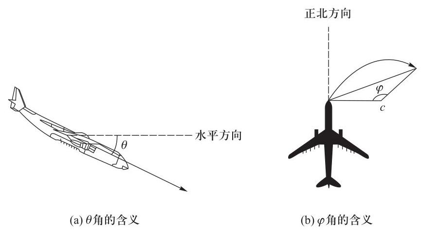
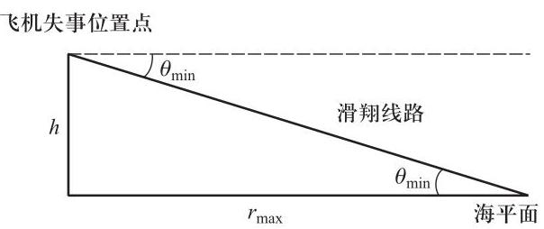
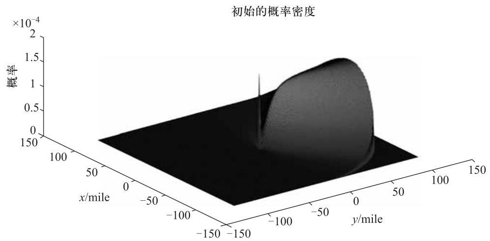
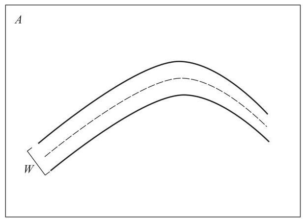
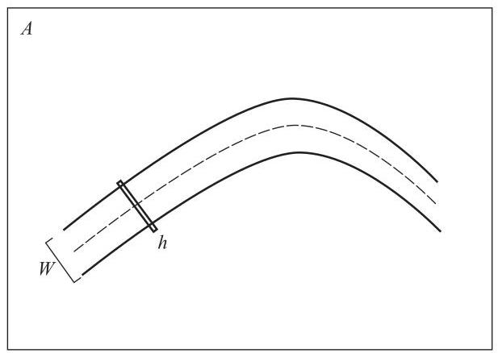

在这两起重大的空难中, 所有机组人员及乘客全部罹难, 很多国家和国际救援组织投入了大量的人力、物力和财力. 因此, 我们通过建立数学模型研究有效搜索失踪飞机的策略和还原飞机失事位置的方法, 试图缩短搜索与救援时间, 节约人力、物力和财力. 在这里将给出一系列搜索失踪飞机的数学模型及方法.

#### 2.1.1 问题的提出

## 1. 问题的背景

MH 370 是马来西亚航空公司航班, 该航班从马来西亚首都吉隆坡飞往中国首都北京, 飞机机型为波音 777-200 型, 该航班总共载客 227 人和 12 名机组人员, 2014 年 3 月 8 日凌晨 1:20 与航空管制中心失去联系. 航班于北京时间 2014 年 3 月 8 日 00:42 在马来西亚吉隆坡国际机场起飞, 计划 6:30 在北京首都国际机场降落. 但在当日 1:20 航班在马来西亚和越南的交接处与胡志明市航空管控中心失去联系, 而且也未收到失踪飞机的求救信号. 马航称, 这架燃料充足的波音 777 飞机可以比正常飞行时间多飞行 2 个小时, 这意味着即使该飞机失踪后仍在飞行,在北京时间 3 月 8 日上午 8:30 时也将耗尽全部燃油,完全失去动力.

## 2. 问题的描述

一架飞机从 A 地飞往 B 地, 需要飞越开阔的海域, 譬如大西洋、太平洋、印度洋、南冰洋或北冰洋时, 如若意外发生坠毁事故就需要搜救. 现在要求建立一个通用的数学模型, 帮助搜索者制定一个有效的搜索失踪飞机的方案.

假设飞机坠毁后不能发出任何信号, 要求模型应该考虑到被搜索飞机的机型有多种, 而且执行搜索任务的飞机机型也有多种, 这些执行搜索任务的飞机通常使用不同的电子设备或传感器.

问题的原文 ${}^{\left\lbrack  1\right\rbrack  }$ 如下:

## Searching for a Lost Plane

Recall the lost Malaysian flight MH 370. Build a generic mathematical model that could assist "searchers" in planning a useful search for a lost plane feared to have crashed in open water such as the Atlantic, Pacific, Indian, Southern, or Arctic Ocean while flying from Point A to Point B. Assume that there are no signals from the downed plane.

Your model should recognize that there are many different types of planes for which we might be searching and that there are many different types of search planes, often using different electronics or sensors. Additionally, prepare a 1-2 page non-technical paper for the airlines to use in their press conferences concerning their plan for future searches.

#### 2.1.2 问题的背景资料 ${}^{\left\lbrack  2\right\rbrack  }$

马航 MH 370 机型为波音 777-200 型, 到 2015 年为止是全球最大的双发动机宽体客机. 2015 年 1 月 29 日, 马来西亚民航局宣布, 马航 MH 370 航班失事, 并推定机上所有 239 名乘客和机组人员已遇难. 2015 年 7 月 31 日 (当地时间), 马来西亚官员证实, 在法属留尼汪岛找到的飞机残骸属于波音 777 型客机. 2015 年 8 月 6 日凌晨, 马来西亚确认, 7 月 29 日在留尼汪岛发现的飞机残骸来自马航 MH 370 航班, 2015 年 9 月 3 日法国巴黎地方检察官发布新闻公报也宣布了这一报告. 澳大利亚交通安全局 2016 年 11 月 2 日发布有关 MH 370 搜索的最新报告, 称在飞机坠入海中时, 处于无人控制的状态.

#### 2.1.3 问题的分析及主要工作

一旦飞机在海上失事, 搜索需要大量的资源和时间, 如何实现资源的有效配置、用最短时间搜索到失事飞机并进行救援工作, 是需要研究的主要问题. 我们将从以下几个方面进行讨论:

(1)根据飞机失事之前的已有信息, 即先验概率信息, 利用贝叶斯推理方法进行预测估计, 确定失事飞机可能坠毁的区域. 通过建立搜索模型, 求解计算后验概率, 并给出相应的搜索方案. 即建立基于贝叶斯推理的失踪飞机搜索模型.

(2)根据失事飞机最后与空中交通管理中心失去联系的位置, 确定飞机可能坠毁的区域范围. 搜索飞机采用不同的飞行路线对相应区域进行搜索, 不同的搜索飞行路线有不同的搜索效果和搜索效率, 通过比较分析选取最优的搜索飞行路线, 即建立基于飞行路线的失踪飞机搜索模型.

(3)根据飞机失事之前的基本信息以及最后的飞行位置和高度等,确定飞机可能坠毁的区域范围. 利用搜索论的方法建立数学建模, 给出搜索方案, 并通过模拟计算说明搜索模型的有效性和适用性, 即建立基于搜索论的失踪飞机搜索模型.

(4)根据失事飞机与空中交通管理中心失去联系之后的信息,确定飞机可能偏离预定飞行航线 (IFP) 的最大飞行距离. 由此, 建立一个二次的距离与包含概率的密度函数, 分析从与飞机最后一次接触点到飞机可能坠毁点的距离. 通过飞行轨迹和偏离 IFP 的概率, 确定一个搜索区域, 并确定搜索区域的包含概率 $\left( {P}_{OC}\right)$ ,即失踪飞机可能坠毁在该区域内的概率. 建立搜索模型,并求解计算出搜索方案的发现概率 $\left( {P}_{OD}\right)$ ,即建立基于发现概率的失踪飞机搜索模型.

### 2.2 基于贝叶斯推理的失踪飞机搜索模型

针对搜索海上失事飞机的问题, 我们建立一个通用的概率模型来预测飞机坠毁的位置, 以及在有效时间内最优的救援策略.

根据实际情况, 我们不妨假设飞机在坠毁前的信息和坠毁时间是已知的, 并且飞机失去动力后坠毁. 我们的主要思路如下:

( 1 )初始概率分布. 采用一个先验概率密度函数来模拟失事飞机的潜在位置. 这个分布仅依赖于飞机失事时刻的已知信息, 包括它的位置、载重、巡航高度和升阻比等.

(2)搜索模式. 采用 4 种独立搜索模式, 构建一个最优化算法来确定搜索模式的最有效方案, 并用找到坠机位置的全局概率来度量搜索模式的有效性.

(3)动态概率模型. 采用贝叶斯推理方法, 基于持续搜索收集到的信息来不断调整其概率分布, 即通过计算后验概率分布, 能够在随后的搜索中使用已有信息对模型进行提炼和修正.

(4)通用性. 通过模拟飞机坠毁的时间和搜索场景的变化情况, 来重现事故现场的真实情况. 通过调整反映实际环境的参数, 并依据特定的情况来实现通用性.

最后给出一个易于规模化集成作业、全方位的有效搜索模式, 例如矩形平行扫描, 随着时间的推移能够使得找到失踪飞机的概率最大化.

先给出如下假设:

(1)飞机在失事之前一直被精确跟踪直到坠毁. 在坠毁点, 飞机失去动力, 即引擎不再提供动力并且没有信号传出.

(2)飞机是在巡航阶段失事的. 飞机在坠毁的瞬间,只能有一个不大于 ${180}^{ \circ  }$ 的方向旋转, 并且这个方向旋转是在瞬间发生的, 因为这个旋转可能迷失的范围从理论上是可以忽略的.

(3)天气无风,海水没有流动,坠毁的飞机及残骸将自由地飘落.

(4)整个搜索区域都是在水面上,即搜索区域不会延伸到陆地上.

(5)每一架参与搜索的飞机仅在自己所负责的区域内搜索. 虽然它们都是从跑道起飞到指定的区域, 可能会经过其他的搜索区域, 可以认为飞机在此期间不进行搜索作业.

(6) 搜索飞机在飞行过程中可以立即转弯, 忽略转弯的过程.

(7) 不考虑地球的局部曲度, 即搜索区域是一个二维平面区域.

(8) 在一个给定的搜索日,每天搜索飞机的飞行时间为 ${12}\mathrm{\;h}$ . 同时,还可以给定一些搜索的环境参数, 这是为了给出一致的结论. 然而, 这些参数可以根据失事飞机的一个特定的情景做出相应的调整.

(9) 飞机失事时是向正北方向飞行, 位于飞机始发机场以北 400 英里①.

#### 2.2.1 搜索模型的相关理论

## 1. 先验概率: 随机下降

我们分析可能的坠机地点和相关概率. 假设飞机在失去跟踪信号之后也就失去了动力, 因而可用的先验信息包括坠机的位置、飞行方向和机型. 飞机最后的位置定义为区域 $R$ 的中点,将这个区域 $R$ 放在笛卡尔坐标系中, $y$ 轴方向指向正北, $x$ 轴方向指向正东. 坠机的两个特性参数升阻比 $\left( {L/D}\right)$ 和海拔高度(h) 对确定飞机位置很有用. 我们用 $\theta$ 表示水平线下的滑翔角度, $\varphi$ 表示相对于初始方位可能的改变角度, 如图 2-1 所示.

失事飞机的滑翔角度 $\theta$ 的最小值可通过飞机的升阻比 $L/D$ 来定义,即

$$
{\theta }_{\min } = {\tan }^{-1}\left( \frac{1}{L/D}\right) . \tag{2.1}
$$

波音 747 型客机是最常用的海上长时间飞行的机型, 该种飞机在其飞行生涯中通常飞行不少于 420 亿海里. 最常见的波音 747-400 型飞机的升阻比为 17, 巡航高度为 35000 英尺①. 由于该型飞机在海上飞行的频率高, 因此波音 747-400 型飞机是我们研究失踪飞机的首选机型. 我们给出的一般模型也适用于其他任意机型,只需要对飞机的升阻比 $L/D$ 值和巡航高度做相应的改变即可. 由 (2.1) 式可以计算出波音 747-400 型飞机的最小滑翔角度约为 ${3.37}^{ \circ  }$ ,其滑翔角的几何关系如图 2-2 所示. 由此可计算出失事飞机在无动力时的最大滑行距离为 ${r}_{\max }$ , 一般的滑行距离为

$$
{r}_{g} = h\cot \theta  \tag{2.2}
$$

---

(i) 1 英里 (mi) $\approx  {1.6}$ 千米 (km). 本书题目均来自 MCM/ICM 赛题,题目中单位多采用英制. 为了将重点关注内容集中在问题的讨论上, 故未将其转换为我国通用的国际单位制. 下文同.

---

图 2-1 失事飞机的滑翔角度和方位角度示意图

根据假设飞机是在巡航时失事,这里 $h$ 即为巡航高度,于是一架 747-400 型飞机的最大滑翔区域为长度近 113 英里范围的区域.

图 2-2 失事飞机滑翔角的几何关系

初始概率密度函数由每条可能坠机线路的可能性来决定,每条坠机线路由 $\theta$ 和 $\varphi$ 确定,这两个变量是相互独立的随机变量. 由于 $\theta$ 和 $\varphi$ 刻画了基于先验信息随机模拟飞行线路的不同方面,由概率函数所确定的最大可能区域 $R$ 可以由失事飞机按最大动力时的辐射范围计算得到, 即从失事点扫描所有可能的方向来确定. 下面分别给出变量 $\theta$ 和 $\varphi$ 的概率函数.

---

① 1 英尺 (ft) $= {0.3048}$ 米 (m).

---

当 $\theta$ 值接近于最小滑翔角度 ${\theta }_{\min }$ 时,即飞机完全失去动力,飞行员会采用这个角度滑行,因为这个角度可以让飞机有最大飞行距离. 当 $\theta$ 值接近于 ${90}^{ \circ  }$ 时, 就意味着发生了灾难性事故. 例如因突然失去升力而失速或发生爆炸时, 两者都会引起快速下降. $\theta$ 的概率分布由双正态分布模拟得到,即用最优滑翔和灾难性事故两种极端情况的正态分布加权和来表示. 二者的权重分别为突然坠落的概率 ${p}_{c}$ 和最优滑翔的概率 ${p}_{g},{p}_{g} = 1 - {p}_{c}$ .

$$
f\left( \theta \right)  = {p}_{c}f\left( {\theta }_{c}\right)  + {p}_{g}f\left( {\theta }_{g}\right)
$$

$$
= \frac{{p}_{c}}{{\sigma }_{1}\sqrt{2\pi }}{\mathrm{e}}^{-\frac{1}{2}{\left( \frac{\theta  - {\theta }_{\max }}{{\sigma }_{1}}\right) }^{2}} + \frac{{p}_{g}}{{\sigma }_{2}\sqrt{2\pi }}{\mathrm{e}}^{-\frac{1}{2}{\left( \frac{\theta  - {\theta }_{\min }}{{\sigma }_{2}}\right) }^{2}}, \tag{2.3}
$$

其中 ${\sigma }_{1}$ 和 ${\sigma }_{2}$ 分别为突然坠机和最优滑翔分布的标准差. 突然坠机的角度分布均值为 ${\theta }_{\max } = {90}^{ \circ  }$ ,最优滑翔角度分布的均值为 ${\theta }_{\min }$ .

由于 $\varphi$ 为随机变量,如果飞机失去动力后失去控制,或者由飞行员控制该数值用于能有效缓解损失的转弯度数, 其值是确定的. 然而, 在实际中失事飞机的可控性和当时飞行员做出什么样的决策都是未知的,我们无法确定 $\varphi$ 的取值. 为此,我们认为 $\varphi$ 服从于均值为 0 的正态分布,这对于不会改变航线的失事飞机是最可能出现的情况. 即

$$
f\left( \varphi \right)  = \frac{1}{{\sigma }_{3}\sqrt{2\pi }}{\mathrm{e}}^{-\frac{1}{2}{\left( \frac{\varphi }{{\sigma }_{3}}\right) }^{2}}, \tag{2.4}
$$

其中 ${\sigma }_{3}$ 表示 $\varphi$ 的概率分布的标准差. 我们反复选择 $\varphi$ 和 $\theta$ 的标准差来模拟实际中可能的各种情况, 针对失事飞机型号统计确定发生坠机的参数. 根据模拟结果,不妨取 ${\sigma }_{1} = {15}^{ \circ  },{\sigma }_{2} = {20}^{ \circ  },{\sigma }_{3} = {30}^{ \circ  }$ .

由于这两个变量是独立的随机变量,那么在 $\left( {\theta ,\varphi }\right)$ 坐标系下它们的联合概率分布可以由各自的 (边缘) 概率分布函数的乘积得到, 即

$$
p\left( {\theta ,\varphi }\right)  = f\left( \theta \right) f\left( \varphi \right) . \tag{2.5}
$$

我们关心的是在 $\left( {\theta ,\varphi }\right)$ 空间上的概率,然而将这个概率变换到笛卡尔直角坐标系(x, y)上会更有意义. 这种变换由下面的方程给出,即

$$
x = \sqrt{2{\rho }^{2}\left( {1 - \cos \varphi }\right) }\cos \frac{\pi  - \varphi }{2} + \left( {h\cot \theta  - \left| {\rho \varphi }\right| }\right) \sin \varphi , \tag{2.6}
$$

$$
y = \sqrt{2{\rho }^{2}\left( {1 - \cos \varphi }\right) }\sin \frac{\pi  - \varphi }{2} + \left( {h\cot \theta  - \left| {\rho \varphi }\right| }\right) \cos \varphi , \tag{2.7}
$$

其中 $\rho$ 表示失事飞机在 $\varphi$ 弧度上的转弯半径. 根据这些方程,其概率分布可以从 $p\left( {\theta ,\varphi }\right)$ 转换为 $p\left( {x, y}\right)$ . 方程 (2.6) 和 (2.7) 是 $\theta$ 和 $\varphi$ 在笛卡尔直角坐标系下的精确转换. 失事飞机的垂直下降和飞机可能的第一次转弯过程都会对海拔高度产生影响, 然而方程的简化将不能反映飞机转弯对海拔高度的影响情况, 但能够反映出飞机以任意角度滑翔的范围. 由于飞机转弯时对海拔高度的影响相对于总海拔高度是微不足道的, 所以对滑行线路的简化是可行的. 通过简化, 并将 $\rho  = 0$ 代入 (2.6) 和 (2.7) 式中,则飞机下降地点的初始概率分布就被映射到了笛卡尔直角坐标系中.

图 2-3 显示了我们所考虑的失事波音 747-400 型飞机在(x, y)空间中的初始概率分布的变化情况. 坐标原点在尖钉处, 对应于突然发生坠机情况下的概率, 概率从平面的初始点逐渐增加到最大滑翔区域的边界点处, 此处的概率降为 0 .

图 2-3 平面位置对应的初始概率分布

## 2. 贝叶斯定理

在初始概率分布确定之后, 我们要模拟搜索信息如何对这个概率分布产生影响. 为此, 我们要从搜索过程收集的信息中分离出搜索之前的已知信息, 即先验信息. 利用贝叶斯定理可以导出发现失事飞机残骸的概率表达式.

对事件 $A$ 和 $B$ 贝叶斯定理的数学表达式为

$$
P\left( {A \mid  B}\right)  = \frac{P\left( {B \mid  A}\right) P\left( A\right) }{P\left( B\right) }, \tag{2.8}
$$

其中 $P\left( A\right)$ 和 $P\left( B\right)$ 是事件 $A$ 和 $B$ 的概率, $P\left( {A \mid  B}\right)$ 是已知给定事件 $B$ 的条件下事件 $A$ 的概率. 在这里,用事件 $A$ 代表找到失事飞机残骸,事件 $B$ 代表失事飞机在所搜索的区域内. 在此后的表述中用符号 $q$ 表示 $P\left( {A \mid  B}\right)$ .

我们用贝叶斯定理来模拟搜索信息对概率分布的影响方式. 如果一个区域被搜索过后, 并未找到失事飞机, 那么在这个区域中搜索到飞机的概率并不为 0, 这是由于飞机可能在这个区域中, 只是没有被发现. 利用贝叶斯定理可以来模拟在一个区域被搜索过后, 但没有发现飞机的概率分布的变化情况. 对于一个网格搜索方式有

$$
{p}^{\prime } = \frac{p\left( {1 - q}\right) }{\left( {1 - p}\right)  + p\left( {1 - q}\right) }, \tag{2.9}
$$

其中 ${p}^{\prime }$ 是后验概率. 在我们所考虑的情况下, ${p}^{\prime }$ 是之前在某个区域内未搜索到失事飞机,之后在此区域内找到失事飞机的概率. 类似地, $p$ 是在任意给定区域内搜索到飞机的先验概率; $p\left( {1 - q}\right)$ 表示失事飞机在该区域内,但没有被搜索到的概率;(1 - p)表示飞机不在此区域内的概率. 将公式 (2.9) 应用于要搜索的区域,就可以导出后验概率 ${p}^{\prime }$ .

如果一个区域被搜索之后, 没有搜索到失事飞机, 则失事飞机在其他区域被搜索到的概率将会增大. 为此, 我们修正这个概率如下:

$$
{r}^{\prime } = \frac{r}{1 - {pq}} \tag{2.10}
$$

其中 ${r}^{\prime }$ 和 $r$ 分别为后验概率和先验概率,这类似于 (2.9) 式中的概率 ${p}^{\prime }$ 和 $p$ .

利用这些公式, 我们可以进行模拟搜索, 收集到的新数据不断修正概率分布, 保证在每一个时间段内都是适用的,使得失事飞机有 ${100}\%$ 的机会在整个搜索区域内被搜索到.

## 3. 后验概率: 搜索路径

在建立了初始概率分布模型和这个概率分布随着时间变化的理论之后, 现在研究失事飞机在一个已知区域内被搜索到的概率. 这个概率 $q$ 将被表示为横向搜索的范围、搜索工具 (飞机、舰船等) 行驶的总距离和一个搜索区域的面积这 3 个变量的函数.

设横向搜索的带宽为 $W$ ,它随着所使用电子设备的精度和搜索区域的可见度不同而变化. 在搜索中搜索工具行驶的总距离 $z$ 可以极大地影响搜索的成功率. 同样地,搜索网格区域的面积 $A$ 和网格区域,也会影响到搜索方案的有效性.

一个简单的搜索路径如图 2-4 所示,确定搜索带宽 $W$ .

图 2-4 确定搜索带宽 $W$

为了导出在网格区域面积为 $A$ 的区域内搜索到失事飞机的概率表达式,我们需要对搜索路线做一些简化. 首先失事飞机落在该区域内每一点的可能性是均等的; 其次不相交的带形区域在矩形区域内均匀独立分布; 最后在该搜索区域外不做搜索作业. 依据这三条假设来构建一个随机的搜索方案 ${}^{\left\lbrack  3\right\rbrack  }$ .

现在考虑搜索带宽为 $W$ 的线路上一个搜索步长 $h$ ,用 $g\left( h\right)$ 表示在之前未找到失事飞机的条件下,在一个搜索步长为 $h$ 的区域内找到飞机的概率. 搜索步长 $h$ 的扫描区域示意图如图 2-5 所示.

图 2-5 确定搜索步长 $h$ 的扫描区域示意图

这个概率表示为

$$
g\left( h\right)  = \frac{Wh}{A}, \tag{2.11}
$$

带宽和搜索步长越大, 搜索到目标的概率就越大; 但是随着整个区域面积的增大, 这个概率将变小.

为了导出后验概率 $q$ 的表达式,不妨设 $b\left( z\right)$ 表示搜索工具行驶距离 $z$ 后搜索到目标飞机的概率. 由贝叶斯定理知, $\left\lbrack  {1 - b\left( z\right) }\right\rbrack  \left\lbrack  {g\left( h\right) }\right\rbrack$ 是在长度为 $z$ 的区域内未搜索到目标飞机的概率 ${}^{\left\lbrack  3\right\rbrack  }$ . 然而,再经过步长为 $h$ 的区域搜索到目标飞机的可能性, 即概率为

$$
b\left( {z + h}\right)  = b\left( z\right)  + \left\lbrack  {1 - b\left( z\right) }\right\rbrack  \frac{W}{A}, \tag{2.12}
$$

则

$$
{b}^{\prime }\left( z\right)  = \mathop{\lim }\limits_{{h \rightarrow  \infty }}\frac{b\left( {z + h}\right)  - b\left( z\right) }{h} = \left\lbrack  {1 - b\left( z\right) }\right\rbrack  \frac{W}{A}. \tag{2.13}
$$

方程 (2.13) 是一个线性非齐次微分方程,其中初值条件为 $b\left( 0\right)  = 0$ . 于是它的解为

$$
b\left( z\right)  = 1 - {\mathrm{e}}^{-\frac{W}{A}z}. \tag{2.14}
$$

由此,我们定义搜索到失踪飞机的概率 $q = b\left( {z, W, A}\right)$ ,或将条件概率用于修正先验概率模型来定义.

## 4. 最优化原则

我们建模的主要目标是在任意给定搜索区域中发现目标的累积概率最大化. 在这里将通过最小化某个搜索区域的后验概率 ${p}^{\prime }$ 来实现,这是因为小后验概率就意味着对搜索区域更彻底的搜索方案. 一个彻底的搜索方案反映在模型中就表示为在给定的区域内搜索到失踪飞机的概率 $q$ 最大化.

由于初始模型给出二维平面上的一个初始概率密度, 在这里综合考虑在特定区域内搜索到目标飞机的全概率, 则有

$$
q\left( {z}^{ * }\right)  = \mathop{\max }\limits_{{z \in  R}}{\iint }_{A}b\left( z\right) \mathrm{d}A, \tag{2.15}
$$

其中 $A$ 表示需要搜索的网格区域,也表示相应的面积.

类似地, 根据贝叶斯定理, 在这个区域找到飞机的概率是飞机处于这个区域