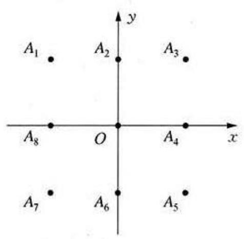
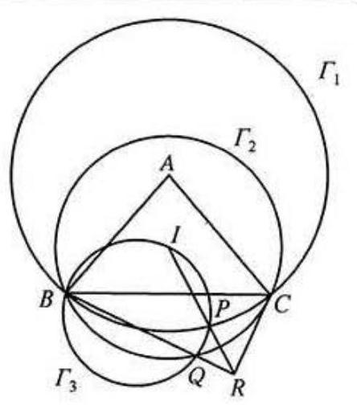
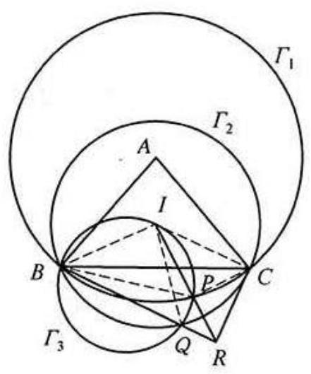

## A 卷第一试

## 一、填空题(每小题 8 分, 共 64 分)

1 设 $f\left( x\right)$ 是定义在 $\mathbf{R}$ 上的函数,对任意实数 $x$ 有

$$
f\left( {x + 3}\right)  \cdot  f\left( {x - 4}\right)  =  - 1.
$$

又当 $0 \leq  x < 7$ 时, $f\left( x\right)  = {\log }_{2}\left( {9 - x}\right)$ ,则 $f\left( {-{100}}\right)$ 的值为_____.

解 由条件知, $f\left( {x + {14}}\right)  =  - \frac{1}{f\left( {x + 7}\right) } = f\left( x\right)$ ,所以

$f\left( {-{100}}\right)  = f\left( {-{100} + {14} \times  7}\right)  = f\left( {-2}\right)  =  - \frac{1}{f\left( 5\right) } =  - \frac{1}{{\log }_{2}4} =  - \frac{1}{2}.$

2 若实数 $x$ 、 $y$ 满足 ${x}^{2} + 2\cos y = 1$ ,则 $x - \cos y$ 的取值范围是 _____.

解 由于

$$
{x}^{2} = 1 - 2\cos y \in  \left\lbrack  {-1,3}\right\rbrack  ,
$$

故 $x \in  \left\lbrack  {-\sqrt{3},\sqrt{3}}\right\rbrack$ .

由 $\cos y = \frac{1 - {x}^{2}}{2}$ 可知,

$$
x - \cos y = x - \frac{1 - {x}^{2}}{2} = \frac{1}{2}{\left( x + 1\right) }^{2} - 1.
$$

因此当 $x =  - 1$ 时, $x - \cos y$ 有最小值 -1 (这时 $y$ 可以取 $\frac{\pi }{2}$ ); 当 $x = \sqrt{3}$ 时, $x - \cos y$ 有最大值 $\sqrt{3} + 1$ (这时 $y$ 可以取 $\pi$ ). 由于 $\frac{1}{2}{\left( x + 1\right) }^{2} - 1$ 的值域是 $\left\lbrack  {-1,\sqrt{3} + 1}\right\rbrack$ ,从而 $x - \cos y$ 的取值范围是 $\left\lbrack  {-1,\sqrt{3} + 1}\right\rbrack$ . 002 / 走 向 IMO

3 在平面直角坐标系 ${xOy}$ 中,椭圆 $C$ 的方程为 $\frac{{x}^{2}}{9} + \frac{{y}^{2}}{10} = 1, F$ 为 $C$ 的上焦点, $A$ 为 $C$ 的右顶点, $P$ 是 $C$ 上位于第一象限内的动点,则四边形 ${OAPF}$ 的面积最大值为_____.

解 易知 $A\left( {3,0}\right) \text{、}F\left( {0,1}\right)$ . 设 $P$ 的坐标是

$$
\left( {3\cos \theta ,\sqrt{10}\sin \theta }\right) ,\theta  \in  \left( {0,\frac{\pi }{2}}\right) ,
$$

则

$$
{S}_{\text{四边形 OAPF }} = {S}_{\bigtriangleup {OAP}} + {S}_{\bigtriangleup {OFP}} = \frac{1}{2} \cdot  3 \cdot  \sqrt{10}\sin \theta  + \frac{1}{2} \cdot  1 \cdot  3\cos \theta
$$

$$
= \frac{3}{2}\left( {\sqrt{10}\sin \theta  + \cos \theta }\right)  = \frac{3\sqrt{11}}{2}\sin \left( {\theta  + \varphi }\right) .
$$

其中 $\varphi  = \arctan \frac{\sqrt{10}}{10}$ .

当 $\theta  = \arctan \sqrt{10}$ 时,四边形 ${OAPF}$ 面积的最大值为 $\frac{3\sqrt{11}}{2}$ .

4 若一个三位数中任意两个相邻数码的差均不超过 1 , 则称其为“平稳数”. 平稳数的个数是_____.

解 考虑平稳数 $\overline{abc}$ .

若 $b = 0$ ,则 $a = 1, c \in  \{ 0,1\}$ ,有 2 个平稳数.

若 $b = 1$ ,则 $a \in  \{ 1,2\} , c \in  \{ 0,1,2\}$ ,有 $2 \times  3 = 6$ 个平稳数.

若 $2 \leq  b \leq  8$ ,则 $a, c \in  \{ b - 1, b, b + 1\}$ ,有 $7 \times  3 \times  3 = {63}$ 个平稳数.

若 $b = 9$ ,则 $a, c \in  \{ 8,9\}$ ,有 $2 \times  2 = 4$ 个平稳数.

综上可知,平稳数的个数是 $2 + 6 + {63} + 4 = {75}$ .

5 正三棱锥 $P - {ABC}$ 中, ${AB} = 1,{AP} = 2$ ,过 ${AB}$ 的平面 $\alpha$ 将其体积平分,则棱 ${PC}$ 与平面 $\alpha$ 所成角的余弦值为_____.

解 设 ${AB}\text{、}{PC}$ 的中点分别为 $K\text{、}M$ ,则易证平面 ${ABM}$ 就是平面 $\alpha$ . 由中线长公式知

$$
A{M}^{2} = \frac{1}{2}\left( {A{P}^{2} + A{C}^{2}}\right)  - \frac{1}{4}P{C}^{2} = \frac{1}{2}\left( {{2}^{2} + {1}^{2}}\right)  - \frac{1}{4} \times  {2}^{2} = \frac{3}{2},
$$

所以

$$
{KM} = \sqrt{A{M}^{2} - A{K}^{2}} = \sqrt{\frac{3}{2} - {\left( \frac{1}{2}\right) }^{2}} = \frac{\sqrt{5}}{2}.
$$

又易知直线 ${PC}$ 在平面 $\alpha$ 上的射影是直线 ${MK}$ ,而 ${MC} = 1,{KC} = \frac{\sqrt{3}}{2}$ ,所以

$$
\cos \angle {KMC} = \frac{K{M}^{2} + M{C}^{2} - K{C}^{2}}{{2KM} \cdot  {MC}} = \frac{\frac{5}{4} + 1 - \frac{3}{4}}{\sqrt{5}} = \frac{3\sqrt{5}}{10},
$$

故棱 ${PC}$ 与平面 $\alpha$ 所成角的余弦值为 $\frac{3\sqrt{5}}{10}$ .

6 在平面直角坐标系 ${xOy}$ 中,点集 $K = \{ \left( {x, y}\right)  \mid  x, y =  - 1,0,1\}$ . 在 $K$ 中随机取出三个点,则这三点中存在两点之间距离为 $\sqrt{5}$ 的概率是 _____.

解 易知 $K$ 中有 9 个点,故在 $K$ 中随机取出三个点的方式数为 ${\mathrm{C}}_{9}^{3} = {84}$ 种.

(第 6 题图)

将 $K$ 中的点按右图标记为 ${A}_{1},{A}_{2},\cdots ,{A}_{8}$ , $O$ ,其中有 8 对点之间的距离为 $\sqrt{5}$ . 由对称性,考虑取 ${A}_{1}\text{、}{A}_{4}$ 两点的情况,则剩下的一个点有 7 种取法,这样有 $7 \times  8 = {56}$ 个三点组 (不计每组中三点的次序). 对每个 ${A}_{i}\left( {i = 1,2,\cdots ,8}\right) , K$ 中恰有 ${A}_{i + 3}\text{、}{A}_{i + 5}$ 两点与之距离为 $\sqrt{5}$ (这里下标按模 8 理解), 因而恰有

$$
\left\{  {{A}_{i},{A}_{i + 3},{A}_{i + 5}}\right\}  \left( {i = 1,2,\cdots ,8}\right)
$$

这 8 个三点组被记了两次. 从而满足条件的三点组个数为 ${56} - 8 = {48}$ ,进而所求概率为 $\frac{48}{84} = \frac{4}{7}$ .

7 在 $\bigtriangleup {ABC}$ 中, $M$ 是边 ${BC}$ 的中点, $N$ 是线段 ${BM}$ 的中点. 若 $\angle A =$ $\frac{\pi }{3},\bigtriangleup {ABC}$ 的面积为 $\sqrt{3}$ ,则 $\overrightarrow{AM} \cdot  \overrightarrow{AN}$ 的最小值为_____.

解 由条件知,

$$
\overrightarrow{AM} = \frac{1}{2}\left( {\overrightarrow{AB} + \overrightarrow{AC}}\right) ,\overrightarrow{AN} = \frac{3}{4}\overrightarrow{AB} + \frac{1}{4}\overrightarrow{AC},
$$

故

$$
\overrightarrow{AM} \cdot  \overrightarrow{AN} = \frac{1}{2}\left( {\overrightarrow{AB} + \overrightarrow{AC}}\right)  \cdot  \left( {\frac{3}{4}\overrightarrow{AB} + \frac{1}{4}\overrightarrow{AC}}\right)
$$

$$
= \frac{1}{8}\left( {3{\left| \overrightarrow{AB}\right| }^{2} + {\left| \overrightarrow{AC}\right| }^{2} + 4\overrightarrow{AB} \cdot  \overrightarrow{AC}}\right) .
$$

由于

$$
\sqrt{3} = {S}_{\bigtriangleup {ABC}} = \frac{1}{2} \cdot  \left| \overrightarrow{AB}\right|  \cdot  \left| \overrightarrow{AC}\right|  \cdot  \sin A = \frac{\sqrt{3}}{4} \cdot  \left| \overrightarrow{AB}\right|  \cdot  \left| \overrightarrow{AC}\right| ,
$$

所以 $\left| \overrightarrow{AB}\right|  \cdot  \left| \overrightarrow{AC}\right|  = 4$ ,进一步可得

$$
\overrightarrow{AB} \cdot  \overrightarrow{AC} = \left| \overrightarrow{AB}\right|  \cdot  \left| \overrightarrow{AC}\right|  \cdot  \cos A = 2,
$$

从而

$$
\overrightarrow{AM} \cdot  \overrightarrow{AN} \geq  \frac{1}{8}\left( {2\sqrt{3{\left| \overrightarrow{AB}\right| }^{2} \cdot  {\left| \overrightarrow{AC}\right| }^{2}} + 4\overrightarrow{AB} \cdot  \overrightarrow{AC}}\right)
$$

$$
= \frac{\sqrt{3}}{4}\left| \overrightarrow{AB}\right|  \cdot  \left| \overrightarrow{AC}\right|  + \frac{1}{2}\overrightarrow{AB} \cdot  \overrightarrow{AC} = \sqrt{3} + 1.
$$

当 $\left| \overrightarrow{AB}\right|  = \frac{2}{\sqrt[4]{3}},\left| \overrightarrow{AC}\right|  = 2 \times  \sqrt[4]{3}$ 时, $\overrightarrow{AM} \cdot  \overrightarrow{AN}$ 的最小值为 $\sqrt{3} + 1$ .

8 设两个严格递增的正整数数列 $\left\{  {a}_{n}\right\}  \text{、}\left\{  {b}_{n}\right\}$ 满足: ${a}_{10} = {b}_{10} < {2017}$ , 对任意正整数 $n$ ,有 ${a}_{n + 2} = {a}_{n + 1} + {a}_{n},{b}_{n + 1} = 2{b}_{n}$ ,则 ${a}_{1} + {b}_{1}$ 的所有可能值为_____.

解 由条件可知: ${a}_{1}\text{、}{a}_{2}\text{、}{b}_{1}$ 均为正整数,且 ${a}_{1} < {a}_{2}$ .

由于 ${2017} > {b}_{10} = {2}^{9} \cdot  {b}_{1} = {512}{b}_{1}$ ,故 ${b}_{1} \in  \{ 1,2,3\}$ . 反复运用 $\left\{  {a}_{n}\right\}$ 的递推关系知

$$
{a}_{10} = {a}_{9} + {a}_{8} = 2{a}_{8} + {a}_{7} = 3{a}_{7} + 2{a}_{6}
$$

$$
= 5{a}_{6} + 3{a}_{5} = 8{a}_{5} + 5{a}_{4} = {13}{a}_{4} + 8{a}_{3}
$$

$$
= {21}{a}_{3} + {13}{a}_{2} = {34}{a}_{2} + {21}{a}_{1}\text{,}
$$

因此

$$
{21}{a}_{1} \equiv  {a}_{10} = {b}_{10} = {512}{b}_{1} \equiv  2{b}_{1}\left( {\;\operatorname{mod}\;{34}}\right) ,
$$

而 ${13} \times  {21} = {34} \times  8 + 1$ ,故有

$$
{a}_{1} \equiv  {13} \times  {21}{a}_{1} \equiv  {13} \times  2{b}_{1} = {26}{b}_{1}\left( {\;\operatorname{mod}\;{34}}\right) .
$$

①

另一方面,注意到 ${a}_{1} < {a}_{2}$ ,有 ${55}{a}_{1} < {34}{a}_{2} + {21}{a}_{1} = {512}{b}_{1}$ ,故

$$
{a}_{1} < \frac{512}{55}{b}_{1}
$$

②

当 ${b}_{1} = 1$ 时,①、② 分别化为 ${a}_{1} \equiv  {26}\left( {\;\operatorname{mod}\;{34}}\right) ,{a}_{1} < \frac{512}{55}$ ,无解.

当 ${b}_{1} = 2$ 时,①、② 分别化为 ${a}_{1} \equiv  {52}\left( {\;\operatorname{mod}\;{34}}\right) ,{a}_{1} < \frac{1024}{55}$ ,得到唯一的正整数 ${a}_{1} = {18}$ ,此时 ${a}_{1} + {b}_{1} = {20}$ .

当 ${b}_{1} = 3$ 时,①、② 分别化为 ${a}_{1} \equiv  {78}\left( {\;\operatorname{mod}\;{34}}\right) ,{a}_{1} < \frac{1536}{55}$ ,得到唯一的正整数 ${a}_{1} = {10}$ ,此时 ${a}_{1} + {b}_{1} = {13}$ .

综上所述, ${a}_{1} + {b}_{1}$ 的所有可能值为 13、20 .

## 二、解答题(共 56 分)

9 (16 分)设 $k\text{、}m$ 为实数,已知不等式 $\left| {{x}^{2} - {kx} - m}\right|  \leq  1$ 对所有 $x \in  \left\lbrack  {a, b}\right\rbrack$ 成立. 证明: $b - a \leq  2\sqrt{2}$ .

解 令 $f\left( x\right)  = {x}^{2} - {kx} - m, x \in  \left\lbrack  {a, b}\right\rbrack$ ,则 $f\left( x\right)  \in  \left\lbrack  {-1,1}\right\rbrack$ . 于是

$$
f\left( a\right)  = {a}^{2} - {ka} - m \leq  1,
$$

①

$$
f\left( b\right)  = {b}^{2} - {kb} - m \leq  1,
$$

②

$$
f\left( \frac{a + b}{2}\right)  = {\left( \frac{a + b}{2}\right) }^{2} - k \cdot  \frac{a + b}{2} - m \geq   - 1.
$$

③

由 ①+② $- 2 \times$ ③ 知,

$$
\frac{{\left( a - b\right) }^{2}}{2} = f\left( a\right)  + f\left( b\right)  - {2f}\left( \frac{a + b}{2}\right)  \leq  4,
$$

故 $b - a \leq  2\sqrt{2}$ .

10 (20 分) 设 ${x}_{1}\text{、}{x}_{2}\text{、}{x}_{3}$ 是非负实数,满足 ${x}_{1} + {x}_{2} + {x}_{3} = 1$ ,求

$$
\left( {{x}_{1} + 3{x}_{2} + 5{x}_{3}}\right) \left( {{x}_{1} + \frac{{x}_{2}}{3} + \frac{{x}_{3}}{5}}\right)
$$

的最小值和最大值.

解 根据柯西不等式可列

$$
\left( {{x}_{1} + 3{x}_{2} + 5{x}_{3}}\right) \left( {{x}_{1} + \frac{{x}_{2}}{3} + \frac{{x}_{3}}{5}}\right)
$$

$$
\geq  {\left( \sqrt{{x}_{1}} \cdot  \sqrt{{x}_{1}} + \sqrt{3{x}_{2}} \cdot  \sqrt{\frac{{x}_{2}}{3}} + \sqrt{5{x}_{3}} \cdot  \sqrt{\frac{{x}_{3}}{5}}\right) }^{2}
$$

$$
= {\left( {x}_{1} + {x}_{2} + {x}_{3}\right) }^{2} = 1,
$$

当 ${x}_{1} = 1,{x}_{2} = 0,{x}_{3} = 0$ 时不等式等号成立,故欲求的最小值为 1 .

因为

$$
\left( {{x}_{1} + 3{x}_{2} + 5{x}_{3}}\right) \left( {{x}_{1} + \frac{{x}_{2}}{3} + \frac{{x}_{3}}{5}}\right)
$$

$$
= \frac{1}{5}\left( {{x}_{1} + 3{x}_{2} + 5{x}_{3}}\right) \left( {5{x}_{1} + \frac{5{x}_{2}}{3} + {x}_{3}}\right)
$$

$$
\leq  \frac{1}{5} \cdot  \frac{1}{4}{\left\lbrack  \left( {x}_{1} + 3{x}_{2} + 5{x}_{3}\right)  + \left( 5{x}_{1} + \frac{5{x}_{2}}{3} + {x}_{3}\right) \right\rbrack  }^{2}
$$

$$
= \frac{1}{20}{\left( 6{x}_{1} + \frac{14}{3}{x}_{2} + 6{x}_{3}\right) }^{2}
$$

$$
\leq  \frac{1}{20}{\left( 6{x}_{1} + 6{x}_{2} + 6{x}_{3}\right) }^{2} = \frac{9}{5},
$$

当 ${x}_{1} = \frac{1}{2},{x}_{2} = 0,{x}_{3} = \frac{1}{2}$ 时不等式等号成立,故欲求的最大值为 $\frac{9}{5}$ .

11 (20 分) 设复数 ${z}_{1}\text{、}{z}_{2}$ 满足 $\operatorname{Re}\left( {z}_{1}\right)  > 0,\operatorname{Re}\left( {z}_{2}\right)  > 0$ ,且 $\operatorname{Re}\left( {z}_{1}^{2}\right)  =$ $\operatorname{Re}\left( {z}_{2}^{2}\right)  = 2$ (其中 $\operatorname{Re}\left( z\right)$ 表示复数 $z$ 的实部).

(1) 求 $\operatorname{Re}\left( {{z}_{1}{z}_{2}}\right)$ 的最小值;

(2)求 $\left| {{z}_{1} + 2}\right|  + \left| {\overline{{z}_{2}} + 2}\right|  - \left| {\overline{{z}_{1}} - {z}_{2}}\right|$ 的最小值.

解 (1) 对 $k = 1,2$ ,设 ${z}_{k} = {x}_{k} + {y}_{k}\mathrm{i}\left( {{x}_{k},{y}_{k} \in  \mathbf{R}}\right)$ . 由条件知

$$
{x}_{k} = \operatorname{Re}\left( {z}_{k}\right)  > 0,{x}_{k}^{2} - {y}_{k}^{2} = \operatorname{Re}\left( {z}_{k}^{2}\right)  = 2.
$$

因此

-

$$
\operatorname{Re}\left( {{z}_{1}{z}_{2}}\right)  = \operatorname{Re}\left( {\left( {{x}_{1} + {y}_{1}\mathrm{i}}\right) \left( {{x}_{2} + {y}_{2}\mathrm{i}}\right) }\right)  = {x}_{1}{x}_{2} - {y}_{1}{y}_{2}
$$

$$
= \sqrt{\left( {{y}_{1}^{2} + 2}\right) \left( {{y}_{2}^{2} + 2}\right) } - {y}_{1}{y}_{2}
$$

$$
\geq  \left( {\left| {{y}_{1}{y}_{2}}\right|  + 2}\right)  - {y}_{1}{y}_{2} \geq  2\text{.}
$$

又当 ${z}_{1} = {z}_{2} = \sqrt{2}$ 时, $\operatorname{Re}\left( {{z}_{1}{z}_{2}}\right)  = 2$ . 这表明, $\operatorname{Re}\left( {{z}_{1}{z}_{2}}\right)$ 的最小值为 2 .

(2)对 $k = 1$ 、 2,将 ${z}_{k}$ 对应到平面直角坐标系 ${xOy}$ 中的点 ${P}_{k}\left( {{x}_{k},{y}_{k}}\right)$ ,记 ${P}^{\prime }{}_{2}$ 是 ${P}_{2}$ 关于 $x$ 轴的对称点,则 ${P}_{1}\text{、}{P}_{2}^{\prime }{}_{2}$ 均位于双曲线 $C : {x}^{2} - {y}^{2} = 2$ 的右支上.

设 ${F}_{1}\text{、}{F}_{2}$ 分别是 $C$ 的左、右焦点,易知 ${F}_{1}\left( {-2,0}\right) \text{、}{F}_{2}\left( {2,0}\right)$ .

根据双曲线的定义, 有

$$
\left| {{P}_{1}{F}_{1}}\right|  = \left| {{P}_{1}{F}_{2}}\right|  + 2\sqrt{2},\left| {{P}_{2}^{\prime }{F}_{1}}\right|  = \left| {{P}_{2}^{\prime }{}_{2}{F}_{2}}\right|  + 2\sqrt{2}\text{,}
$$

进而得

$$
\left| {{z}_{1} + 2}\right|  + \left| {\overline{{z}_{2}} + 2}\right|  - \left| {\overline{{z}_{1}} - {z}_{2}}\right|
$$

$$
= \left| {{z}_{1} + 2}\right|  + \left| {\overline{{z}_{2}} + 2}\right|  - \left| {{z}_{1} - \overline{{z}_{2}}}\right|
$$

$$
= \left| {{P}_{1}{F}_{1}}\right|  + \left| {{P}_{2}^{\prime }{F}_{1}}\right|  - \left| {{P}_{1}{P}_{2}^{\prime }}\right|
$$

$$
= 4\sqrt{2} + \left| {{P}_{1}{F}_{2}}\right|  + \left| {{P}^{\prime }{}_{2}{F}_{2}}\right|  - \left| {{P}_{1}{P}_{2}^{\prime }}\right|
$$

$$
\geq  4\sqrt{2}\text{,}
$$

当且仅当 ${F}_{2}$ 位于线段 ${P}_{1}{P}_{2}^{\prime }$ 上时等号成立 (例如,当 ${z}_{1} = {z}_{2} = 2 + \sqrt{2}\mathrm{i}$ 时, ${F}_{2}$ 恰是 ${P}_{1}{P}_{2}^{\prime }$ 的中点).

综上可知, $\left| {{z}_{1} + 2}\right|  + \left| {\overline{{z}_{2}} + 2}\right|  - \left| {\overline{{z}_{1}} - {z}_{2}}\right|$ 的最小值为 $4\sqrt{2}$ .

2017 年全国高中数学联赛 (A 卷、B 卷) / 009

## A 卷第二试

1 (40 分) 如图①,在 $\bigtriangleup  {ABC}$ 中, ${AB} =$ ${AC}, I$ 为 $\bigtriangleup {ABC}$ 的内心. 以 $A$ 为圆心, ${AB}$ 为半径作圆 ${\Gamma }_{1}$ ,以 $I$ 为圆心, ${IB}$ 为半径作圆 ${\Gamma }_{2}$ ,过点 $B\text{、}I$ 的圆 ${\Gamma }_{3}$ 与 ${\Gamma }_{1}\text{、}{\Gamma }_{2}$ 分别交于点 $P\text{、}Q$ (不同于点 $B$ ). 设 ${IP}$ 与 ${BQ}$ 交于点 $R$ .

(第 1 题图①)

证明: ${BR} \bot  {CR}$ .

解 连结 ${IB}\text{、}{IC}\text{、}{IQ}\text{、}{PB}\text{、}{PC}$ ,如图 ②.

由于点 $Q$ 在圆 ${\Gamma }_{2}$ 上,故 ${IB} = {IQ}$ ,所以

$$
\angle {IBQ} = \angle {IQB}\text{.}
$$

(第 1 题图 ②)

又 $B\text{、}I\text{、}P\text{、}Q$ 四点共圆,所以 $\angle {IQB} =$ $\angle {IPB}$ ,于是 $\angle {IBQ} = \angle {IPB}$ .

故 $\bigtriangleup {IBP} \backsim  \bigtriangleup {IRB}$ ,从而有 $\angle {IRB} = \angle {IBP}$ ,且

$$
\frac{IB}{IR} = \frac{IP}{IB}.
$$

注意到 ${AB} = {AC}$ ,且 $I$ 为 $\bigtriangleup {ABC}$ 的内心,故 ${IB} = {IC}$ ,所以

$$
\frac{IC}{IR} = \frac{IP}{IC},
$$

于是 $\bigtriangleup {ICP} \backsim  \bigtriangleup {IRC}$ ,故 $\angle {IRC} = \angle {ICP}$ .

又点 $P$ 在圆 ${\Gamma }_{1}$ 的 $\overset{⏜}{BC}$ 上,故 $\angle {BPC} = {180}^{ \circ  } - \frac{1}{2}\angle A$ ,因此

$$
\angle {BRC} = \angle {IRB} + \angle {IRC} = \angle {IBP} + \angle {ICP}
$$

$$
= {360}^{ \circ  } - \angle {BIC} - \angle {BPC}
$$

$$
= {360}^{ \circ  } - \left( {{90}^{ \circ  } + \frac{1}{2}\angle A}\right)  - \left( {{180}^{ \circ  } - \frac{1}{2}\angle A}\right)
$$

$$
= {90}^{ \circ  }\text{,}
$$

故 ${BR} \bot  {CR}$ .

2 (40 分)设数列 $\left\{  {a}_{n}\right\}$ 定义为 ${a}_{1} = 1$ ,

$$
{a}_{n + 1} = \left\{  {\begin{array}{l} {a}_{n} + n,{a}_{n} \leq  n, \\  {a}_{n} - n,{a}_{n} > n, \end{array}n = 1,2,\cdots .}\right.
$$

求满足 ${a}_{r} < r \leq  {3}^{2017}$ 的正整数 $r$ 的个数.

解 由数列的定义可知 ${a}_{1} = 1,{a}_{2} = 2$ . 假设对某个整数 $r \geq  2$ 有 ${a}_{r} = r$ , 我们证明对 $t = 1,\cdots , r - 1$ ,有

$$
{a}_{r + {2t} - 1} = {2r} + t - 1 > r + {2t} - 1,{a}_{r + {2t}} = r - t < r + {2t}.
$$

①

对 $t$ 归纳证明.

当 $t = 1$ 时,由于 ${a}_{r} = r \geq  r$ ,由定义可推

$$
{a}_{r + 1} = {a}_{r} + r = r + r = {2r} > r + 1,
$$

$$
{a}_{r + 2} = {a}_{r + 1} - \left( {r + 1}\right)  = {2r} - \left( {r + 1}\right)  = r - 1 < r + 2,
$$

结论成立.

设对某个 $1 \leq  t < r - 1$ ,①成立,则由定义可推

$$
{a}_{r + {2t} + 1} = {a}_{r + {2t}} + \left( {r + {2t}}\right)  = r - t + r + {2t} = {2r} + t > r + {2t} + 1,
$$

$$
{a}_{r + {2t} + 2} = {a}_{r + {2t} + 1} - \left( {r + {2t} + 1}\right)  = {2r} + t - \left( {r + {2t} + 1}\right)
$$

$$
= r - t - 1 < r + {2t} + 2,
$$

即结论对 $t + 1$ 也成立. 由数学归纳法知,①对所有 $t = 1,2,\cdots , r - 1$ 成立, 特别当 $t = r - 1$ 时,有 ${a}_{{3r} - 2} = 1$ ,从而

$$
{a}_{{3r} - 1} = {a}_{{3r} - 2} + \left( {{3r} - 2}\right)  = {3r} - 1.
$$

若将所有满足 ${a}_{r} = r$ 的正整数 $r$ 从小到大记为 ${r}_{1},{r}_{2},\cdots$ ,则由上面的结 2017 年全国高中数学联赛 (A 卷、B 卷) / 011