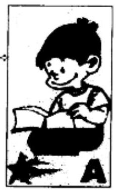
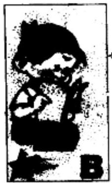
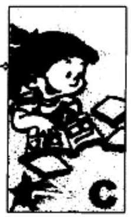
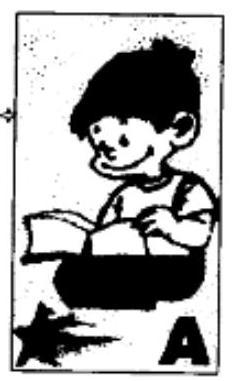
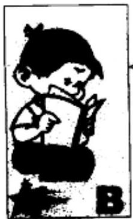
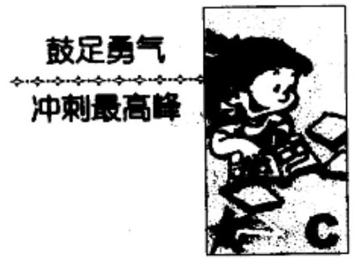
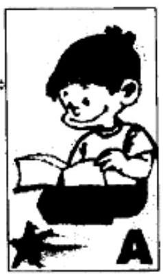
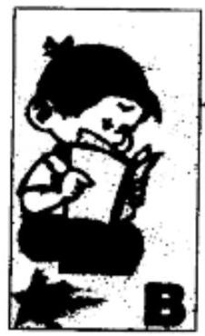
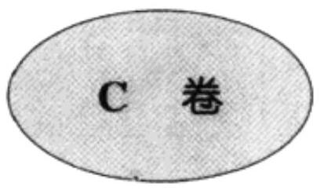
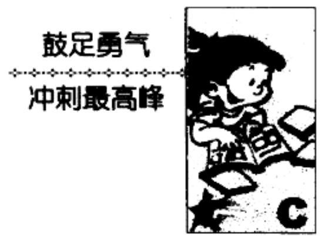

## 1. 因式分解(一)

## A 卷

## 夯实基础

_____ $\frac{dy}{dx} =  - \frac{{x}^{2} + 1}{2} =  - \frac{{x}^{2} + 1}{2} =  - \frac{{x}^{2} + 1}{2} =  - \frac{{x}^{2} + 1}{2} =  - \frac{{x}^{2} + 1}{2} =  - \frac{{x}^{2} + 1}{2} =  - \frac{{x}^{2} + 1}{2} =  - \frac{{x}^{2} + 1}{2} =  - \frac{{x}^{2} + 1}{2} =  - \frac{{x}^{2} + 1}{2} =  - \frac{{x}^{2} + 1}{2}$ 走好第一步

1. 下面各因式分解的结果正确的有_____.

(1) ${x}^{2} - {y}^{2} + 1 = \left( {x + y}\right) \left( {x - y}\right)  + 1$

(2) $- {x}^{2} + {xy} - {xz} =  - x\left( {x + y - z}\right)$

(3) ${a}^{4} - 2{a}^{2} + 1 = {\left( {a}^{2} - 1\right) }^{2}$

(4) ${a}^{3} + 3{a}^{2}b + {3a}{b}^{2} + {b}^{3} = {\left( a + b\right) }^{3}$

2. 用提取公因式法把下列各式分解因式:

( 1 ) $- m{x}^{3} + m{x}^{2}y - {mx}{y}^{2} =$ _____.

(2) $a\left( {x - y}\right)  - b\left( {y - x}\right)  + c\left( {x - y}\right)  =$ _____.

3. 用公式法把下列各式分解因式:

( 1 ) $- \frac{1}{4}{x}^{2} + {xy} - {y}^{2} =$ _____.

(2) ${\left( {a}^{2} + {b}^{2}\right) }^{2} - 4{a}^{2}{b}^{2} =$ _____.

(3) $\left( {{x}^{2} - {3x} + 9}\right)  = \frac{1}{3}{x}^{4} + {9x}$ .

4. 用分组分解法把下列各式分解因式:

(1) ${x}^{3} + {x}^{2} - {y}^{3} - {y}^{2} =$ _____.

( 2 ) ${16}{a}^{2} - 9{b}^{2} + {30bc} - {25}{c}^{2} =$ _____.

5. 计算下式的值:

(1) ${18.9} \times  \frac{13}{55} + {37.1} \times  \frac{13}{55} - \frac{13}{55} =$ _____.

(2) ${888}^{2} - {112}^{2} =$ _____.

6. 分解因式 $x{\left( x + 1\right) }^{3} + x{\left( x + 1\right) }^{2} + x\left( {x + 1}\right)  + x + 1 =$ _____.

7. 分解因式 ${\left( m + n\right) }^{t + 2} - {\left( m + n\right) }^{t} =$ _____. ( $t$ 是自然数).

8. 分解因式 $\left( {x + 3}\right) \left( {x - 5}\right)  + {x}^{2} - 9 =$ _____.

9. 分解因式 ${x}^{2} + {2xy} + {y}^{2} - {2x} - {2y} =$ _____.

10. 若 $A = {3x} - {5y}, B = x + {4y}$ ,则 ${A}^{2} + {B}^{2} + {2A} \cdot  B =$ _____.

## 再接再厉 跨上新台阶

## B 卷

1. 分解因式 ${64}{x}^{6} - {y}^{6} =$ _____.

2. 分解因式 ${x}^{3} + 3{x}^{2} + {3x} + 2 =$ _____.

3. 分解因式 $8{a}^{3} - {12}{a}^{2}b + {6a}{b}^{2} - {b}^{3} =$ _____.

4. 分解因式 ${a}^{2}\left( {b - c}\right)  + {b}^{2}\left( {c - a}\right)  + {c}^{2}\left( {a - b}\right)  =$ _____.

5. 用拆添项法分解下列因式:

(1) ${x}^{4} - {23}{x}^{2} + 1 =$ _____.

(2) ${x}^{4} + {x}^{3} + 6{x}^{2} + {5x} + 5 =$ _____.

6. 若 $a + \frac{1}{a} = m$ ,则 ${a}^{2} + \frac{1}{{a}^{2}} =$ _____； ${a}^{3} + \frac{1}{{a}^{3}} =$ _____.

7. 分解因式 ${x}^{3} + a{x}^{2} + {ax} + a - 1 =$ _____.

8. $\left( {{2}^{2} + 1}\right) \left( {{2}^{4} + 1}\right) \left( {{2}^{8} + 1}\right) \left( {{2}^{16} + 1}\right)  =$ _____.

9. 分解因式 ${x}^{4} + 2{x}^{2} + 9 =$ _____.

10. 分解因式 ${a}^{2} + {\left( a + 1\right) }^{2} + {\left( {a}^{2} + a\right) }^{2} =$ _____.

## 鼓足勇气

where a relative configuration is the configuration of the configuration of the configuration of the configuration.

冲刺最高峰

## C 卷

## 一、选择题

1. 若多项式 $f\left( x\right)$ 能被 $x - a$ 整除,则当 $x = a$ 时,多项式 $f\left( x\right)$ 的值为 (   ).

A. $a$ B. $x - a$ C. 0 D. 不确定

2. 若多项式 $3{x}^{4} + 7{x}^{3} - {15x} + m$ 除以 $x + 2$ 所得的余数为 2,则 $m$ 的值为 (   ).

A. -18 B. -20 C. -25 D. -32

3. 若 $m\text{、}n$ 是整数,且 ${n}^{2} + 3{m}^{2}{n}^{2} = {30}{m}^{2} + {517}$ ,则 $3{m}^{2}{n}^{2}$ 的值为 (   ).

A. 218 B. 588 C. 473 D. 643

4. 若多项式 $f\left( x\right)$ 除以 $x - 1, x - 2$ 所得的余数分别为 1,2,则 $f\left( x\right)$ 除以 $\left( {x - 1}\right) \left( {x - 2}\right)$ 所得的余式为 (   ).

A. $x + 1$ B. $x$ C. ${2x} + 1$ D. 2

## 二、填空题

1. 多项式 ${x}^{4} - 2{x}^{3} - {11}{x}^{2} + {12x} + {28}$ 除以 $x - 3$ 的商式为 _____,余数为_____.

2. 分解因式: ${x}^{3} - 4{x}^{2} + x + 6 =$ _____.

3. 若 $x + y + z = 0$ ,则分解因式 ${x}^{3} + {y}^{3} + {z}^{3} =$ _____.

4. 若多项式 $a{x}^{3} + b{x}^{2} - {47x} - {15}$ 可被 ${3x} + 1$ 和 ${2x} - 3$ 整除,则 $a =$ _____； $b =$ _____；分解因式得_____.

## 三、解答题

1. 证明: ${a}^{4} + 4\left( a\right.$ 是整数,且 $\left. {\left| a\right|  \neq  1}\right)$ 是一个合数.

2. 求证: ${x}^{2} - {xy} + {y}^{2} + x + y$ 不能分解成两个一次因式的乘积.

3. 一个整系数四次多项式 $f\left( x\right)$ ,有四个不同的整数 ${a}_{1},{a}_{2},{a}_{3}$ , ${a}_{4}$ ,使得

$$
f\left( {a}_{1}\right)  = f\left( {a}_{2}\right)  = f\left( {a}_{3}\right)  = f\left( {a}_{4}\right)  = 1
$$

求证: 任何整数 $\beta$ 都不能使 $f\left( \beta \right)  =  - 1$ .

## 2. 因式分解(二)

## A 卷

夯实基础走好第一步

1. 用十字相乘法分解因式:

( 1 ) ${a}^{2} + {21a} + {54} =$ _____.

(2) ${\left( {x}^{2} + 2\right) }^{2} - 9{x}^{2} =$ _____.

(3) ${m}^{2} - \frac{5}{6}m + \frac{1}{6} =$ _____.

2. 分解因式: $8{\left( x + 1\right) }^{2} + 6\left( {x + 1}\right)  - {27} =$ _____.

3. 分解因式: ${ab}{x}^{2} - \left( {{ac} - {b}^{2}}\right) x - {bc} =$ _____.

4. 分解因式 $: {x}^{2} + \left( {{3m} + {10}}\right) x - \left( {{4{m}^{2}} - {5m} - {21}}\right)  =$ _____.

5. 分解因式 $: {x}^{3} + 6{x}^{2} + {11x} + 6 =$ _____.

6. 分解因式: $\left( {{x}^{2} + {3x} + 2}\right) \left( {4{x}^{2} + {8x} + 3}\right)  - {90} =$ _____.

7. 分解因式: $4\left( {x + 5}\right) \left( {x + 6}\right) \left( {x + {10}}\right) \left( {x + {12}}\right)  - 3{x}^{2} =$ _____.

8. 分解因式: ${\left( x + 5\right) }^{4} + {\left( x + 3\right) }^{4} - {82} =$ _____.

9. 若 ${a}^{3} + {a}^{2} - {3a} + 2 = \frac{3}{a} - \frac{1}{{a}^{2}} - \frac{1}{{a}^{3}}$ ,则 $a + \frac{1}{a} =$ _____.

10. 计算: $\frac{\left( {{2000}^{2} - {2006}}\right) \left( {{2000}^{2} + {3997}}\right)  \times  {2001}}{{1997} \times  {1999} \times  {2002} \times  {2003}} =$ _____.

## 再接再厉

## 跨上新台阶

## B 卷

1. 设 $\bar{M} = {24} \times  {25} \times  {26} \times  {27} + 1$ ,则 $M$ 是_____的平方.

2. 分解因式 ${x}^{2} - {2xy} - 8{y}^{2} - {2x} + {14y} - 3 =$ _____.

3. 分解因式: $6{x}^{2} - {5xy} - 6{y}^{2} - {2xz} - {23yz} - {20}{z}^{2} =$ _____.

4. 分解因式: $\left( {x + 1}\right) \left( {x + 2}\right) \left( {x + 3}\right)  - 6 \times  7 \times  8 =$ _____.

5. 若 $a\text{、}b\text{、}c$ 是三角形三边长,且 ${a}^{2} - {16}{b}^{2} - {c}^{2} + {6ab} + {10bc} = 0$ , 则 ${2b} - a - c =$ _____.

6. 多项式 $8{x}^{2} - {2xy} - 3{y}^{2}$ 可写成两个整系数多项式 $M =$ _____、 $N =$ _____的平方差.

7. 当 $k =$ _____时,整系数多项式 ${x}^{4} - {x}^{3} + k{x}^{2} - {2kx} - 2$ 能分解成两个整系数二次多项式的乘积.

8. 若 $a - b =  - 1, c - b = 1$ ,则 ${a}^{2} + {b}^{2} + {c}^{2} - {ab} - {ac} - {bc} =$ _____.

9. 分解因式: $\left( {a + b - {2ab}}\right) \left( {a + b - 2}\right)  + {\left( 1 - ab\right) }^{2} =$ _____.

10. 若 $a$ 是自然数,且 ${a}^{4} - 3{a}^{2} + 9$ 是质数,则 $a$ 的值为_____.

## C 卷

## 一、选择题

1. 化简 $\frac{1234567890}{{1234567891}^{2} - {1234567890} \times  {1234567892}}$ 的值为(   ).

A. 1234567890 B. 1234567891

C. 1234567892 D. 1234567893

2. 已知 ${zx} - {zy} + {2xy} - {x}^{2} - {y}^{2} = 0$ ,则 ${x}^{3} - {x}^{2}y - {x}^{2}z - x{y}^{2} +$ $z{y}^{2} + {y}^{3}$ 的值为 (   ).

A. 3 B. 0 C. 2 D. 4

3. 若 $a + b + c + d = 0,{a}^{3} + {b}^{3} + {c}^{3} + {d}^{3} = 3$ ,则 ${abc} + {bcd} + {cda} +$ ${dab}$ 值为 (   ).

A. 0 B. 1 C. 3 D. 4

4. 若四个互不相等的正数 $x, y, m, n$ 中, $x$ 最小, $n$ 最大,且 $\frac{x}{y} =$ $\frac{m}{n}$ ,设 $S = x + n, T = y + m$ ,则 (   ) .

A. $S > T$ B. $S < T$ C. $S = T$ D. 不确定

## 二、填空题

1. 分解因式: ${\left( a + b + c\right) }^{3} - {a}^{3} - {b}^{3} - {c}^{3} =$ _____.

2. 分解因式: ${xy}\left( {{x}^{2} - {y}^{2}}\right)  + {yz}\left( {{y}^{2} - {z}^{2}}\right)  + {zx}\left( {{z}^{2} - {x}^{2}}\right)  =$ _____.

3. 分解因式: ${x}^{4}\left( {y - z}\right)  + {y}^{4}\left( {z - x}\right)  + {z}^{4}\left( {x - y}\right)  =$ _____.

4. 已知 $a, b, c$ 为非零数,且 ${a}^{2} + {b}^{2} + {c}^{2} = 1, a\left( {\frac{1}{b} + \frac{1}{c}}\right)  +$ $b\left( {\frac{1}{c} + \frac{1}{a}}\right)  + c\left( {\frac{1}{a} + \frac{1}{b}}\right)  =  - 3$ ,那么 $a + b + c =$ _____.

## 三、解答题

1. $n$ 支足球队参加循环赛,每两支足球队之间都要进行比赛,在循环过程中,第一支足球队胜 ${x}_{1}$ 场,负 ${y}_{1}$ 场; 第二支球队胜 ${x}_{2}$ 场,负 ${y}_{2}$ 场; 依此类推到第 $n$ 支球队 (不考虑平局). 求证:

$$
{x}_{1}^{2} + {x}_{2}^{2} + \cdots  + {x}_{n}^{2} = {y}_{1}^{2} + {y}_{2}^{2} + \cdots  + {y}_{n}^{2}.
$$

2. 已知: ${x}^{3} + b{x}^{2} + {cx} + d$ 为整系数多项式,若 ${bd} + {cd}$ 为奇数. 求证: 这个多项式不能分解为两个整系数多项式之积.

3. 若 $p\text{、}q$ 都是大于 5 的任意质数,求证: ${p}^{4} - {q}^{4}$ 总能被 80 整除.

## 3. 质数与质因数分解

夯实基础走好第一步

## A 卷

1. 自然数中既不是质数也不是合数的是_____；质数中偶数有 _____.

2. 最小的质数为_____,最小的奇质数为_____,最小的合数为_____.

3. 105 的约数有_____,质因数有_____.

4. 两个质数和为 42, 乘积最大值为_____.

5. 1125 的约数有_____个,它们的和是_____.

6. 边长为自然数,面积为 105 的形状不同的长方形共有_____ 种.

7. $p,{p}^{2} + 2$ 都是质数,则 ${p}^{4} + {2001} =$ _____.

8. 一个整数 $a$ 与 1080 的乘积是一个完全平方数,则 $a$ 的最小值为_____.

9. 两个质数的差是 27,则它们的和是_____.

10. 连续九个自然数中至多有_____个质数.

## 再接再厉

## 跨上新台阶

## B 卷

1. 有四个数, 一个是最小的奇质数, 一个是偶质数, 一个是小于 30 的最大质数,另一个是大于 70 的最小质数,这四个数的和为_____.

2. 使 ${a}^{4} - 3{a}^{2} + 9$ 为质数的自然数 $a$ 的个数为_____.

3. 若质数 $p$ 、 $q$ 满足 ${3p} + {5q} = {31}$ ,则 $p \cdot  q =$ _____.

4. 约数个数为 10 的最小正整数 $n$ 为_____.

5. $n = {4}^{343} + {343}^{4}$ 为_____(填质数或合数).

6. 若 $p \geq  5$ 是质数,且 ${2p} + 1$ 是质数,则 ${4p} + 1$ 是_____(填质数或合数).

7. 若 $n$ 是大于 2 的自然数,则 ${2}^{n} - 1$ 与 ${2}^{n} + 1$ 中至多有_____ 个是质数.

8. $a\text{、}b\text{、}c$ 为自然数, $a < b, b$ 为质数, $a + b = c - a = {1995}$ ,则 $a +$ $b + c$ 的最大值为_____.

9. 三个奇质数的乘积恰等于它们的和的 11 倍, 那么这三个奇质数为_____.

${10}.A\text{、}B$ 两数都恰有质因数 3 和 5,它们的最大公约数是 75,已知 $A$ 有 12 个约数, $B$ 有 10 个约数,那么 $A$ 、 $B$ 两数之和等于_____. 初二数学竞赛 ABC 卷及解析

## 一、选择题

1. 在不超过 100 的自然数中, 约数最多的数有 (   ) 个.

A. 3 B. 4 C. 5 D. 6

2. 设 $m = {n}^{4} + x$ ,其中 $n$ 为自然数, $x$ 为两位正整数,那么使 $m$ 为合数的 $x$ 值为 (   ).

A. 16 B. 61 C. 81 D. 64

3. 若 $p\text{、}p + {10}\text{、}p + {14}$ 同时为质数,则整数 $p$ 为(   ).

A. 存在且惟一 B. 不存在

C. 可取两个不同的值 D. 有无限多个值

4. 一个四位偶自然数的千位数是 1 , 当它分别被四个不同质数去除时,余数也都是 1,则满足这些条件的所有自然数的个数为(   ).

A. 3 B. 4 C. 5 D. 6

## 二、填空题

1. 对于一个自然数 $n$ ,如果能找到自然数 $a$ 和 $b$ ,使得 $n = a + b +$ ${ab}$ ,则称 $n$ 为一个 “好数”. 如 $3 = 1 + 1 + 1 \times  1$ ,则 3 是一个 “好数”,在 $1,2,3,\cdots ,{99},{100}$ 这 100 个自然数中,“好数”共有_____个.

2. 不能用三个不相等的合数之和表示的最大奇数为_____.

3. 若正整数 $n$ 的所有正约数的乘积等于 64,则 $n$ 的值为 _____.

4. 已知 $a\text{、}b\text{、}c$ 是质数,它们满足 $a \cdot  {b}^{b} \cdot  c + a = {2000}$ ,则 $a\text{、}b\text{、}c$ 的值是_____.

## 三、解答题

1. 设 $p > 3$ ,且 $p$ 与 ${2}^{n} + p$ 均为质数,求证: ${2}^{n + 1} + p$ 为合数.