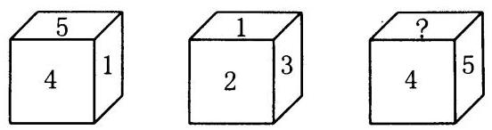
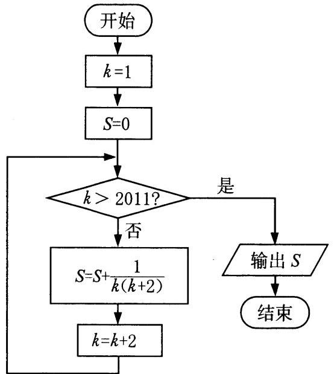
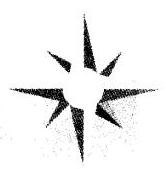
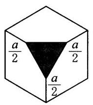
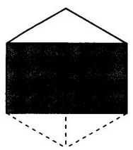
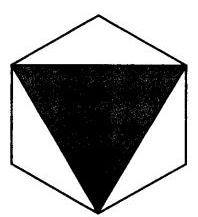
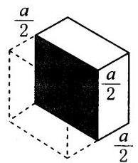
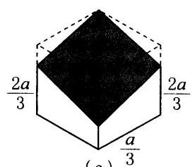
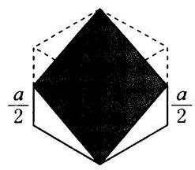
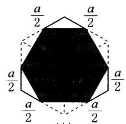

试题 答案

2013 年第四届陈省身杯全国高中数学奥林匹克试题 ( 61 ) ( 266 )

2014 年第五届陈省身杯全国高中数学奥林匹克试题 ( 62 )( 270 )

2012 年中国西部数学奥林匹克试题 ( 64 )( 276 )

2013 年中国西部数学奥林匹克试题 ( 64 ) ( 280 )

2014 年中国西部数学奥林匹克试题 ( 65 )( 284 )

2012 年第八届中国北方数学奥林匹克邀请赛试题 ( 67 ) ( 288 )

2013 年第九届中国北方数学奥林匹克邀请赛试题 ( 68 )( 293 )

2014 年第十届中国北方数学奥林匹克邀请赛试题 ( 69 ) ( 296 )

2012 年第九届中国东南地区数学奥林匹克试题 ( 70 ) ( 299 )

2013 年第十届中国东南地区数学奥林匹克试题 ( 71 )( 305 )

2014 年第十一届中国东南地区数学奥林匹克试题 ( 72 ) ( 311 )

2012 年第十一届女子数学奥林匹克试题 ( 75 )( 319 )

2013 年第十二届女子数学奥林匹克试题 ( 76 ) ( 326 )

2014 年第十三届女子数学奥林匹克试题 ( 77 ) ( 331 )

2011 年美国国家队选拔考试试题 ( 79 )( 336 )

2012 年美国国家队选拔考试试题 ( 80 )( 344 )

2013 年美国国家队选拔考试试题 ( 80 )( 353 )

1 | 1

## 2011 年希望杯数学邀请赛试题 (高一)

## 第一试

## 一、选择题

以下每题的四个选项中,仅有一个是正确的,请将正确答案前的英文字母写在每题后面的圆括号内.

1. 已知 $f\left( x\right)  = k{x}^{a}$ 是幂函数,它的图象过点 $\left( {4,\frac{1}{2}}\right)$ ,则 $k + a$ 的值等于(   )

(A) $- \frac{1}{2}$ (B) -2 (C) $\frac{1}{2}$ (D) 2

2. 设 $A = \frac{1}{{\log }_{\frac{1}{2}}\frac{1}{3}} + \frac{1}{{\log }_{\frac{1}{5}}\frac{1}{3}}$ ,则 $A$ 属于区间(   )

(A)(2,3) (B)(1,2) (C)(-2, - 1) (D)(-3, - 2)

3. 图 1 中给出一枚骰子的三种不同放法,则图中“?” 处的数字是(   ) (A) 1 (B) 2 (C) 3 (D) 6

图 1

4. 已知 $\sin \alpha  + \cos \alpha  =  - 1$ ,则 ${\sin }^{2011}\alpha  + {\cos }^{2011}\alpha$ 的值的集合是(   )

(A) $\{ 1\}$ (B) $\{ 0\}$ (C) $\{  - 1\}$ (D) $\{  - 1,1\}$

5. 已知 $a, b \in  {\mathbf{R}}_{ + }, a \neq  b$ ,设 $A = a + b = 2, B = {a}^{2} + {b}^{2}$ . 则 $A$ 与 $B$ 的大小关系是(   )

(A) $A > B$ (B) $A < B$ (C) $A = B$ (D) 无法确定的

6. 已知函数 $f\left( x\right)  = \left\{  \begin{array}{ll} \left( {5 - a}\right) x + a - 6, & x \leq  4, \\  2{a}^{x - 3}, & x > 4, \end{array}\right.$ 数列 $\left\{  {a}_{n}\right\}$ 满足 ${a}_{n} =$ $f\left( n\right) \left( {n \in  {\mathbf{N}}_{ + }}\right)$ ,且数列 $\left\{  {a}_{n}\right\}$ 是单调递增数列,则实数 $a$ 的取值范围是 (   )

(A)(1,5) (B)(2,5) (C) $\left( {\frac{14}{5},5}\right)$ (D) $\left\lbrack  {\frac{14}{5},5}\right)$

7. Two known vectors $\mathbf{a} = \left( {2\cos x,{\sin }^{2}x}\right) ,\mathbf{b} = \left( {2\sin x,{\cos }^{2}x}\right) \left( {x \in  \mathbf{R}}\right)$ , and $f\left( x\right)  = \left| \mathbf{a}\right|  - \left| \mathbf{b}\right|$ , then the maximum value of $f\left( x\right)$ is (   )

(A) 1 (B) 2 (C) 3.6 (D) 4

(英汉词典: vector 向量; maximum value 最大值)

8. 设函数 $f\left( x\right)  = \left| {{\log }_{2}\left( {1 - x}\right) }\right|$ ,当 $a < b < c < 1$ 时,有 $f\left( b\right)  < f\left( a\right)  <$

$f\left( c\right)$ ,则(   ) ( (A) ${ac} < 0$ (B) ${ab} < 0$ (C) ${ac} > 0$ (D) ${bc} > 0$

9. 已知 $m, l$ 是异面直线,给出以下四个命题:

① 一定存在平面 $\alpha$ 过 $m$ 且与 $l$ 平行. ② 一定存在平面 $\alpha$ 与 $m, l$ 都垂直.

③ 一定存在平面 $\alpha$ 过 $m$ 且与 $l$ 垂直. ④ 一定存在平面 $\alpha$ 与 $m, l$ 的距离都相等. 其中错误的命题个数是(   )

(A) 1 (B) 2 (C) 3 (D) 4

10. 对于数列 ${101},{10101},{1010101},{101010101},\cdots$ ,下列判断中正确的是 (   )

(A) 数列的所有项都是质数 (B) 数列的所有项都是合数

(C) 数列中有且仅有 1 个质数 (D) 数列中的质数不少于两个

二、A 组填空题

11. 四边形 ${ABCD}$ 中,若 $\overrightarrow{AB} \cdot  \overrightarrow{AD} + \overrightarrow{BA} \cdot  \overrightarrow{BC} + \overrightarrow{CB} \cdot  \overrightarrow{CD} + \overrightarrow{DC} \cdot  \overrightarrow{DA} = 0$ 成立, 则四边形 ABCD 是_____.(填“平行四边形”“长方形”“正方形”或“梯形”)

12. 设 $f\left( x\right)  + g\left( x\right)  = \sqrt{1 + x + {x}^{2}}$ ,且 $y = f\left( x\right)$ 和 $y = g\left( x\right)$ 分别是偶函数和奇函数,则 $f\left( 3\right)  =$ _____.

13. 已知 $\sin \alpha  + \sin \beta  = 1,\cos \alpha  + \cos \beta  = 0$ ,则 $\sqrt{\cos \left( {\alpha  + \beta }\right) \cos \left( {\alpha  - \beta }\right) } =$ _____.

14. 对集合 $A$ 和 $B$ ,定义下面的两种运算:

$A - B = \{ x \mid  x \in  A, x \notin  B\} , A * B = \left( {A - B}\right)  \cup  \left( {B - A}\right)$ .

若 $A = \left\{  {y \mid  y = {x}^{2} + {2x}, x \in  \mathbf{R}}\right\}  , B = \left\{  {y \mid  y = {\sin }^{2}x - 2\cos x, x \in  \mathbf{R}}\right\}$ ,则 $A * B$ $=$ _____.

15. 已知数列 $\left\{  {a}_{n}\right\}$ 满足 ${a}_{1} = 2,{a}_{n} =  - \frac{1}{{a}_{n - 1} + 1}\left( {n \geq  2\text{且}n \in  \mathbf{N}}\right)$ ,则 ${a}_{2010}$ 的值为_____.

图 2

16. 已知定义在 $\mathbf{R}$ 上的奇函数 $f\left( x\right)$ 满足 $f\left( {x + 4}\right)  =  - f\left( x\right)$ ,且在区间 $\left\lbrack  {0,2}\right\rbrack$ 上是增函数,若方程 $f\left( x\right)  = m\left( {m < 0}\right)$ 在区间 $\left\lbrack  {-4,8}\right\rbrack$ 上有四个不同的实数解 ${x}_{1},{x}_{2},{x}_{3}$ , ${x}_{4}$ . 则 ${x}_{1} + {x}_{2} + {x}_{3} + {x}_{4}$ 的值是_____.

17. 已知点 $M\left( {-2, - 1}\right)$ 和 $N\left( {1, - 5}\right)$ , 又点 $P$ 在圆 $C : {x}^{2} + {y}^{2} - {4x} - {2y} + 1 = 0$ 上运动,则 $\bigtriangleup {MNP}$ 面积的最大值是 _____.

18. 图 2 所示的程序框图的输出结果为_____.

19. 4 个平面可以将空间最多分成_____部分.

20. Define vectors $\mathbf{a} = \left( {\cos \alpha ,\sin \alpha }\right) ,\mathbf{b} = \left( {\cos \beta ,\sin \beta }\right)$ , and $\mathbf{c} = \mathbf{a} + k\mathbf{b}$ (real number $k \in  \left\lbrack  {-1,2}\right\rbrack$ ). If $\alpha  = \beta  + \frac{\pi }{3}$ , then the value range of $\left| \mathbf{c}\right|$ is _____.

三、B 组填空题

21. $\sqrt{{x}^{2} - {2x} + 5} + \sqrt{{x}^{2} - {8x} + {25}}$ 的最小值为_____,此时 $x =$ _____.

22. 已知 $f\left( x\right)  = 2\sin \frac{x}{2}\sin \left( {\theta  - \frac{x}{2}}\right)  - 1$ .

(1)若 $f\left( x\right)$ 是偶函数,则 $\cos \frac{\theta }{2} =$ _____；

(2)若 $f\left( x\right)$ 的最大值是 $\frac{1}{2}$ ,则 $\mathrm{{cos}}{2\theta } =$ _____.

23. 已知函数 $f\left( x\right)  = {4}^{x} + m \cdot  {2}^{x} + 1$ 有且仅有一个零点,则 $m$ 的取值范围是 _____,该零点为_____.

24. 不等式 $\frac{1 - \sqrt{1 - 4{x}^{2}}}{x} < 3$ 的解是_____. 在这个条件下,函数 $y =$ | $\sin x$ | 的图象关于_____成_____对称图形.

25. 已知 $x$ 是实数且 $x \neq  2,3$ . 若 $S = \min \left\{  {\frac{1}{\left| x - 2\right| },\frac{1}{\left| x - 3\right| }}\right\}$ ,那么 ${S}_{\max } =$ _____,此时 $x =$ _____.

## 第二试

## 一、选择题

以下每题的四个选项中,仅有一个是正确的,请将表示正确答案的英文字母写在每题后面的圆括号内.

1. 若直角三角形的三边的长是连续的正整数, 则这样的直角三角形的个数是(   )

(A) 1 (B) 2 (C) 3 (D) 4

2. 集合 $A = \left\{  {y \in  \mathbf{R} \mid  y = {\log }_{3}\left( {x + 1}\right) , x > 0}\right\}  , B = \{  - 3, - 1,1,3\}$ ,则下列结论中正确的是(   )

(A) $A \cap  B = \{  - 3, - 1\}$ (B) $A \cup  B = \left( {0, + \infty }\right)$

(C) $\left( {{\complement }_{\mathbf{R}}A}\right)  \cap  B = \{  - 3, - 1\}$ (D) $\left( {{\complement }_{\mathbf{R}}A}\right)  \cup  B = \left( {-\infty ,0}\right)$

3. 已知偶函数 $f\left( x\right)$ 在 $\lbrack 0, + \infty )$ 上单调递增,则满足 $f\left( {{2x} - 1}\right)  < f\left( \frac{1}{3}\right)$ 的 $x$ 的取值范围是 (   )

(A) $\left( {\frac{1}{3},\frac{2}{3}}\right)$ (B) $\left\lbrack  {\frac{1}{3},\frac{2}{3}}\right)$ (C) $\left( {\frac{1}{2},\frac{2}{3}}\right)$ (D) $\left\lbrack  {\frac{1}{2},\frac{2}{3}}\right)$

4. 设 $A\text{、}B$ 是锐角三角形的两个内角,则点 $P\left( {\cos B - \sin A,\sin B - \cos A}\right)$ 对应的点位于(   )

(A) 第一象限 (B) 第二象限 (C) 第三象限 (D) 第四象限

5. 已知非空集合 $S$ 的元素是实数,且满足: ① $1 \notin  S$ ; ② 若 $a \in  S$ ,则 $\frac{1}{1 - a} \in$ $S$ . 设集合 $S$ 的元素个数为 $n$ ,则 $n$ 的最小值是 (   )

(A) 2 (B) 3 (C) 4 (D) 5

6. 点 $D$ 在 $\bigtriangleup {ABC}$ 的边 ${BC}$ 上,使 $\overrightarrow{BD} = \lambda \overrightarrow{DC}\left( {\lambda  > 0}\right)$ . 若 $\overrightarrow{AC} = x\overrightarrow{AB} + (x +$ 2) $\overrightarrow{AD}, x \in  \mathbf{R}$ ,则 $\lambda$ 的值是 (   )

(A) 1 (B) 2 (C) $\frac{1}{2}$ (D) $\frac{1}{3}$

7. 有长为 $\sqrt{2}$ ,宽为 1 的矩形,以它的一条对角线所在的直线为轴旋转一周, 则所得到的旋转体的体积为(   )

(A) $\frac{3\sqrt{3}}{8}\pi$ (B) $\frac{2\sqrt{3}}{9}\pi$ (C) $\frac{{29}\sqrt{3}}{72}\pi$ (D) $\frac{{23}\sqrt{3}}{72}\pi$

8. 圆 $O : {x}^{2} + {y}^{2} = {r}^{2}\left( {r > 0}\right)$ 与 $x$ 轴正半轴交于点 $A$ ,且与直线 $l : y = {kx} +$ 2 交于点 $B$ 和 $C$ ( $B$ 在 $x$ 轴上方). 若 $\angle {ABC} = {60}^{ \circ  },{AC} = 4$ ,则原点 $O$ 到 $l$ 的距离是(   )

(A) 2 (B) $\frac{2}{3}$ (C) $\frac{2\sqrt{3}}{3}$ (D) $\frac{2\sqrt{13}}{13}$

9. Quadratic function $f\left( x\right)$ satisfies $f\left( {x - 2}\right)  = f\left( {-x - 2}\right) , x \in  \mathbf{R}$ , and the image of the segment intercepted on the $x$ -axis has a length of $2\sqrt{7}$ , and it also passes through point(2,9). Knowing that $A = \{ x \mid  \left| {f\left( x\right) }\right|  = k, k \in  \mathbf{R}\}$ , if card $\left( A\right)  = 4$ , then the values of $k$ is (   )

(A) $k > 7$ (B) $0 < k < 7$ (C) $0 < k \leq  7$ (D) $k = 7$

(英汉词典: quadratic function 二次函数)

10. 已知点的序列 ${A}_{n}\left( {{x}_{n},0}\right) , n \in  {\mathbf{N}}_{ + },{x}_{1} = 0,{x}_{2} = \frac{1}{2},{A}_{3}$ 是线段 ${A}_{1}{A}_{2}$ 的中点, ${A}_{4}$ 是线段 ${A}_{2}{A}_{3}$ 的中点, $\cdots ,{A}_{n}$ 是线段 ${A}_{n - 2}{A}_{n - 1}\left( {n \geq  3}\right)$ 的中点,设 ${a}_{n} = {x}_{n + 1} -$ ${x}_{n}$ ,则 $\left\{  {a}_{n}\right\}$ 的通项公式是 (   )

(A) ${a}_{n} = {\left( -\frac{1}{2}\right) }^{n}\left( {n \in  {\mathbf{N}}^{ + }}\right)$ (B) ${a}_{n} =  - {\left( \frac{1}{2}\right) }^{n}\left( {n \in  {\mathbf{N}}^{ + }}\right)$

(C) ${a}_{n} = {\left( \frac{1}{2}\right) }^{n}\left( {n \in  {\mathbf{N}}^{ + }}\right)$ (D) ${a}_{n} =  - {\left( -\frac{1}{2}\right) }^{n}\left( {n \in  {\mathbf{N}}^{ + }}\right)$

## 二、填空题

11. 若函数 $f\left( x\right)  = \frac{x}{1 + x}$ ,且 ${f}^{\left( n\right) }\left( x\right)  = \underset{n\text{ 个 }f}{\underbrace{f(f(f\cdots f}}\left( x\right) ))$ ,则 ${f}^{\left( {2011}\right) }\left( 1\right)  =$ _____.

12. 若集合 $A = \left\{  {x \mid  x \in  \mathbf{Z}}\right.$ ,且 $\left. {\frac{360}{a - x} \in  \mathbf{Z}, a \in  {\mathbf{N}}_{ + }}\right\}$ 的所有元素的和是 336, 则常数 $a =$ _____.

13. 某同学在解关于 $x$ 的不等式 $a{x}^{2} - {bx} + c > 0$ 时,误看作 $a{x}^{2} + {bx} + c >$ 0,得解集为 $\{ x \mid  2 < x < 3\}$ ,那么原不等式的解集是_____.

14. 已知集合 $A = \left\{  {\left( {x, y}\right)  \mid  {x}^{2} + {y}^{2} - {2x}\sin \alpha  + 2\left( {1 + \cos \alpha }\right) \left( {1 - y}\right)  = 0,\alpha  \in  }\right.$ $\mathbf{R}\} , B = \{ \left( {x, y}\right)  \mid  y = {kx} - 1\}$ . 若 $A \cap  B$ 是单元素集合,则 $k =$ _____.

15. 有位司机在正常行驶过程中,发现汽车里程表的示数是 ${15951}\mathrm{\;{km}}$ ,是左右对称的数. 两个小时后, 里程表上又出现了一个对称数. 若汽车行驶的平均时速不超过 ${140}\mathrm{\;{km}}$ ,那么司机行驶的正常平均时速可能是_____ $\mathrm{{km}}$ 或_____ $\mathrm{{km}}$ .

16. 方程 $\frac{1}{x} + \frac{1}{y} = \frac{1}{2011}$ 有_____组不同的正整数解,有_____组不同的整数解.

17. 已知平面内的点 $A\left( {4,1}\right)$ 和 $B\left( {0,4}\right)$ ,若直线 $l : {3x} - y - 1 = 0$ 上的点 $M$ , 使 $\left| {MA}\right|  - \left| {MB}\right|$ 最大,则点 $M$ 的坐标是_____.

18. 已知数列 $\left\{  {a}_{n}\right\}$ 的前 $n$ 项和为 ${S}_{n}$ ,对于任意的 $n \in  {\mathbf{N}}_{ + }$ 都有 ${S}_{n} = \frac{3}{4}{a}_{n} - \frac{1}{2}$ , 则 ${a}_{1} =$ _____；使 $- {2011} < {S}_{n} <  - 1$ 的 $n$ 的值为_____.

19. 曲线 ${x}^{2} + {y}^{2} - 5 = \left| {{2x} - 2}\right|$ 围成的图形的面积是_____.

20. 若 $x, y \in  \lbrack  - {2\pi },0)$ ,且 $2\sqrt{2}\left( {\cos x - \sin x}\right)  = {13} - {12}\sin y - 3\cos {2y}$ ,则 $\sin {2x}$ $- \cos {3y}$ 的值是_____.

三、解答题(每题都要写出推算过程.)

21. 设 $\alpha$ 是 $\bigtriangleup {ABC}$ 的最小内角,并且使关于 $x$ 的方程 ${x}^{2}\sin \alpha  + x\cos \alpha  + \beta  = 0(\beta  \in$ R) 无实数解.

证明: $\beta  > \frac{\sqrt{3}}{24}$ .

22. 设函数 $f\left( x\right)  = \left\{  \begin{matrix} {x}^{2} + {bx} + c, & x \leq  0, \\  2, & x > 0, \end{matrix}\right.$ 其中 $b > 0, c \in  \mathbf{R}$ . 当且仅当 $x =$ -2 时,函数 $f\left( x\right)$ 取得最小值 -2 .

(1)求函数 $f\left( x\right)$ 的表达式；

(2)若方程 $f\left( x\right)  = x + a\left( {a \in  \mathbf{R}}\right)$ 至少有两个不同的实数根,求 $a$ 的取值范围.

23. $A\text{、}B\text{、}C$ 三个围棋代表队各出 3 名选手参加三队之间的围棋擂台赛,规则如下:

(1)每队都排好 3 名选手的参赛顺序；

(2)每轮比赛只有两队各出一名队员比赛,另一队轮空；

(3)每名选手输一盘后则被淘汰,不再参加后面的比赛；

(4)每轮比赛获胜的选手将与本轮轮空代表队的一名选手进行下一轮比赛, 当轮空代表队没有可参赛选手时,则与本轮负队的另一名选手进行下一轮比赛；

(5)如果有两队的所有选手均被淘汰,那么第三队获胜.

经抽签, $A$ 队第一轮轮空. 则 $A$ 队获胜的可能情况有几种?

## 2012 年希望杯数学邀请赛试题 (高一)

## 第一试

## 一、选择题

以下每题的四个选项中,仅有一个是正确的,请将正确答案前的英文字母写在每题后面的圆括号内.

1. 集合 $M = \left\{  {x \mid  y = \sqrt{-{x}^{2} + {6x} + 7}, x, y \in  \mathbf{R}}\right\}  , N = \{ y \mid  y =$ $\sqrt{-{x}^{2} + {6x} + 7}, x, y \in  \mathbf{R}\}$ ,则集合 $M \cap  N =$ (   )

(A) $\varnothing$ (B) $\left\lbrack  {-1,4}\right\rbrack$ (C) $\left\lbrack  {-1,7}\right\rbrack$ (D) $\left\lbrack  {0,4}\right\rbrack$

2. 设 $m, n$ 是自然数,条件甲: ${m}^{3} + {n}^{3}$ 是偶数；条件乙: $m - n$ 是偶数,则甲是乙的(   )

(A) 充分不必要条件 (B) 必要不充分条件

(C) 充分且必要条件 (D) 既不充分也不必要条件

3. 已知二面角 $\beta  - l - \gamma$ ,直线 $a \subset$ 平面 $\beta$ ,直线 $b \subset$ 平面 $\gamma$ ,且 $a$ 和 $b$ 都不垂直于 $l$ ,那么, $a$ 与 $b$ (   )

(A) 可能垂直, 但不可能平行 (B) 不可能垂直, 但可能平行

(C) 可能垂直, 也可能平行 (D) 不可能垂直, 也不可能平行

4. 设 ${S}_{n}$ 是等比数列 $\left\{  {a}_{n}\right\}$ 前 $n$ 项的乘积,若 ${a}_{9} = 1$ ,则下面的等式中正确的是(   )

(A) ${S}_{1} = {S}_{19}$ (B) ${S}_{3} = {S}_{17}$ (C) ${S}_{5} = {S}_{12}$ (D) ${S}_{8} = {S}_{11}$

5. 已知数列 $\left\{  {a}_{n}\right\}$ 中, ${a}_{1} = 0$ , ${a}_{n + 1} = \frac{{a}_{n} - \sqrt{3}}{\sqrt{3}{a}_{n} + 1}\left( {n \in  {\mathbf{N}}^{ * }}\right)$ ,则 ${a}_{1} + {a}_{2} + \cdots  + {a}_{2012}$ $=$ (   )

(A) $- \sqrt{3}$ (B) 0 (C) $\sqrt{3}$ (D) ${1006}\sqrt{3}$

6. 在 $\bigtriangleup {ABC}$ 中, $\angle B = {60}^{ \circ  },{2AB} = {3BC}$ ,则 $\tan A$ 的值等于(   )

(A) $- \frac{\sqrt{2}}{2}$ (B) $- \frac{\sqrt{3}}{2}$ (C) $\frac{\sqrt{3}}{2}$ (D) $\pm  \frac{\sqrt{3}}{2}$

7. Suppose $\bigtriangleup {ABC}$ is a triangle with the side length of $2, D$ and $E$ are moving points no the sides ${BC}$ and ${AC},{AD} \bot  {BE}$ at point $M$ , then the length of M's trajectory is (   )

(A) $\frac{\pi }{2}$ (B) $\frac{\pi }{3}$ (C) $\frac{\pi }{4}$ (D) $\frac{\pi }{6}$

8. 若 $f\left( {1,1}\right)  = {1234}, f\left( {x, y}\right)  = k, f\left( {x, y + 1}\right)  = k - 3$ ,则 $f\left( {1,{2012}}\right)  =$ (   )

(A) -6033 (B) -4799 (C) 1235 (D) 2012

9. 下面判断正确的是(   )

(A) ${b}^{2} - {4ac} \geq  0$ 是方程 $a{x}^{2} + {bx} + c = 0$ 有解的充分且必要条件

(B) ${b}^{2} - {4ac} < 0$ 是方程 $a{x}^{2} + {bx} + c = 0$ 无解的充分且必要条件

(C) $c \neq  0$ 是方程 $a{x}^{2} + {bx} + c = 0$ 无解的必要不充分条件

(D) ${b}^{2} - {4ac} > 0$ 是方程 $a{x}^{2} + {bx} + c = 0$ 有解的必要不充分条件

10. 已知函数 $f\left( x\right)  = m\left| {x - 1}\right| \left( {m \in  \mathbf{R}, m \neq  0}\right)$ ,设向量 $\mathbf{a} = \left( {1,\cos \theta }\right) ,\mathbf{b} =$ $\left( {2,2\sin \theta }\right) ,\mathbf{c} = \left( {4\sin \theta ,1}\right) ,\mathbf{d} = \left( {\frac{1}{2}\sin \theta ,1}\right)$ ,当 $\theta  \in  \left( {0,\frac{\pi }{4}}\right)$ 时, $f\left( {\mathbf{a} \cdot  \mathbf{b}}\right)$ 与 $f\left( {\mathbf{c} \cdot  \mathbf{d}}\right)$ 的大小关系是(   )

(A) $f\left( {\mathbf{a} \cdot  \mathbf{b}}\right)  < f\left( {\mathbf{c} \cdot  \mathbf{d}}\right)$

(B) $f\left( {\mathbf{a} \cdot  \mathbf{b}}\right)  > f\left( {\mathbf{c} \cdot  \mathbf{d}}\right)$

(C) $m > 0$ 时, $f\left( {\mathbf{a} \cdot  \mathbf{b}}\right)  < f\left( {\mathbf{c} \cdot  \mathbf{d}}\right) ;m < 0$ 时, $f\left( {\mathbf{a} \cdot  \mathbf{b}}\right)  > f\left( {\mathbf{c} \cdot  \mathbf{d}}\right)$

(D) $m > 0$ 时, $f\left( {\mathbf{a} \cdot  \mathbf{b}}\right)  > f\left( {\mathbf{c} \cdot  \mathbf{d}}\right) ;m < 0$ 时, $f\left( {\mathbf{a} \cdot  \mathbf{b}}\right)  < f\left( {\mathbf{c} \cdot  \mathbf{d}}\right)$

## 二、A 组填空题

11. 设 $\alpha  \in  \lbrack 0,{2\pi })$ ,则在 $\lbrack 0,{2\pi })$ 内,终边与 $\alpha$ 角的终边关于 $x$ 轴对称的角是 _____.

12. 函数 $f\left( x\right)  = {3}^{-\left| {{\log }_{2}x}\right| } - 4\left| {x - 1}\right|$ 的值域是_____.

13. 若 $a, b, c$ 是三个互不相等的实数,且满足关系式 ${b}^{2} + {c}^{2} = 2{a}^{2} + {16a} + {14}$ , ${bc} = {a}^{2} - {4a} - 5$ ,则 $a$ 的取值范围是_____.

14. 若 $a, b$ 是正实数,且 $a + b = 2$ ,则 $\frac{1}{1 + a} + \frac{1}{1 + b}$ 的最小值是_____.

15. $y = a\sin \left( {{ax} + b}\right)  + b$ , if the minimum value of $y$ is $\frac{1}{2}$ , the maximum value is $\frac{5}{2}$ , then ${ab} =$ _____.

16. 设点 $G$ 是 ${ABC}$ 的重心, ${GA} = 2\sqrt{3},{GB} = 2\sqrt{2},{GC} = 2$ ,则 ${ABC}$ 的面积是_____.

17. 已知 ${0.8} < x < {0.9}$ ,若将 $x,{x}^{x},{x}^{{x}^{x}}$ 按从小到大的顺序排列,应当是 _____.

18. 已知等差数列 $\left\{  {a}_{n}\right\}$ 的前 $n$ 项之和是 ${S}_{n}$ ,若 ${S}_{8} \leq  5,{S}_{11} \geq  {23}$ ,则 ${a}_{10}$ 的最小值是_____.

19. 若 $a\# b = a + b - {ab}$ ,则下列等式中:

(1) $a\# b = b\# a$ ；(2) $a\# 0 = a$ ；(3)( $a\# b$ ) $\# c = a\# \left( {b\# c}\right)$ .

正确的是_____(填序号).

20. $\odot  O$ 与 $\odot  D$ 相交于 $A, B$ 两点, ${BC}$ 是 $\odot  D$ 的切线,点 $C$ 在 $\odot  O$ 上,且 ${AB} =$ ${BC}$ ,若 $\bigtriangleup  {ABC}$ 的面积为 $S$ ,则 $\odot  D$ 的半径最小值是_____.

## 三、B组填空题

21. 已知 $1 \leq  x \leq  8$ ,则函数 $f\left( x\right)  = \left| {x - 3}\right|  + \left| {x - 5}\right|  + \left| {x - 7}\right|$ 的最大值是_____,最小值是_____.

22. $\alpha ,\beta$ 是关于 $x$ 的方程 ${x}^{2} + 2\left( {m - 1}\right) x + {m}^{2} - 4 = 0$ 的两个实根,设 $y =$ ${\alpha }^{2} + {\beta }^{2}$ ,则 $y = f\left( m\right)$ 的解析式是_____,值域是_____.

23. 已知 $\bigtriangleup {ABC}$ 三条边长分别为 $a = {t}^{2} + 3, b =  - {t}^{2} - {2t} + 3, c = {4t},(t \in$ $\mathbf{R}$ ),则 $\bigtriangleup  {ABC}$ 最大内角是角_____,它的度数等于_____.

24. 方程 ${x}^{2} + {\log }_{16}x = 0$ 的解是_____；使不等式 ${x}^{2} - {\log }_{m}x < 0$ 在 $\left( {0,\frac{1}{2}}\right)$ 上恒成立的 $m$ 的取值范围是_____.

25. 若函数 $f\left( x\right)  = {\log }_{a}\left( {{x}^{2} - {2ax} + 1 - 2{a}^{2}}\right) \left( {a > 0, a \neq  1}\right)$ 在 $\mathbf{R}$ 上的最大值是 2,则 $a =$ _____, $f\left( x\right)$ 的单调递增区间是_____.

## 第二试

## 一、选择题

以下每题的四个选项中,仅有一个是正确的,请将表示正确答案的英文字母写在每题后面的圆括号内.

1. 设 $A, B$ 是同一个三角形的两个内角,则不是 $A < B$ 成立的充要条件的是 (   )

(A) $\sin A < \sin B$ (B) $\sin {2A} < \sin {2B}$

(C) $\cos A > \cos B$ (D) $\cos {2A} > \cos {2B}$

2. 函数 $f\left( x\right)  = \left| \lg \right| 2 - x\left| \right|$ 的单调增区间是(   )

(A) $\left( {-\infty ,1}\right)  \cup  \left( {3, + \infty }\right)$ (B) $\left( {1,2}\right)  \cup  \left( {3, + \infty }\right)$

(C) $\left( {-\infty ,1}\right)  \cup  \left( {2,3}\right)$ (D) $\left( {1,2}\right)  \cup  \left( {2,3}\right)$

3. 图 1 中的图形所表示的是将棱长为 $a$ 的立方体用一个平面切割后剩下的

几何体,则它的体积不等于原立方体体积一半的有(   )个

(a) (b) (c) (d) (e) (f) (j)

图 1

(A) 3 (B) 4 (C) 5 (D) 6

4. $\left\{  {a}_{n}\right\}$ 是公比不为 1 的等比数列, ${S}_{n}$ 是 $\left\{  {a}_{n}\right\}$ 的前 $n$ 项和. 给出下面 3 个命题: (1)若 $\left\{  {a}_{n}\right\}$ 中既有正数,又有负数,那么 $\left\{  {S}_{n}\right\}$ 中也既有正数,又有负数；

(2) $\left\{  {a}_{n}\right\}$ 不可能同时具有最大值和最小值；

(3) ${S}_{10}$ , ${S}_{20} - {S}_{10}$ , ${S}_{30} - {S}_{20}$ , ${S}_{40} - {S}_{30}$ ,… 构成等比数列.

其中,真命题的个数是(   )

(A) 0 (B) 1 (C) 2 (D) 3

5. 在正数数列 $\left\{  {a}_{n}\right\}$ 中, ${a}_{1} = \frac{1}{4}$ , ${a}_{n + 1} = {a}_{n} + \sqrt{{a}_{n}} + \frac{1}{4}$ ,则 ${a}_{2012} =$ (   )

(A) 1012025 (B) 1012036 (C) 1013025 (D) 1013036

6. 若存在 $x \in  \left\lbrack  {1,2}\right\rbrack$ ,使得 $\left| {a \cdot  {2}^{x} - 1}\right|  - 2 > 0$ ,则 $a$ 的取值范围是 ( )

(A) $\left( {-\frac{1}{2},\frac{3}{2}}\right)$ (B) $\left( {-\infty , - \frac{1}{2}}\right)  \cup  \left( {\frac{3}{2}, + \infty }\right)$

(C) $\left( {-\frac{1}{4},\frac{3}{4}}\right)$ (D) $\left( {-\infty , - \frac{1}{4}}\right)  \cup  \left( {\frac{3}{4}, + \infty }\right)$

7. 已知 $O$ 是坐标原点,动点 $M$ 在圆 $C : {\left( x - 4\right) }^{2} + {y}^{2} = 4$ 上,对该坐标平面内的点 $N$ 和 $P$ ,若 $2\overrightarrow{ON} + \overrightarrow{OM} = \overrightarrow{MC} + \overrightarrow{MP} = \mathbf{0}$ ,则 $\left| \overrightarrow{NP}\right|$ 的取值范围是(   )

(A) $\left\lbrack  {0,{12}}\right\rbrack$ (B) $\left\lbrack  {1,{11}}\right\rbrack$ (C) $\left\lbrack  {2,{11}}\right\rbrack$ (D) $\left\lbrack  {1,{12}}\right\rbrack$

8. 已知关于 $x$ 的方程 $a{x}^{3} + b{x}^{2} + {cx} + d = 0$ 有三个不同的实根,其中一个是 0,则它的系数中不能是 0 的仅有(   )

(A) $a, c$ (B) $b, c$ (C) $a, d$ (D) $b, d$

9. 已知集合 $A = \{ a \mid$ 关于 $x$ 的方程 $\frac{{2x} + a}{4{x}^{2} - 9} = 1$ 有唯一实数解 $\}$ ,则集合 $A$ 的