## 一、几何

### 1.1 常规几何题

1. 两圆 ${C}_{1}$ 和 ${C}_{2}$ 交于 $A$ 和 $B$ 两点,设 $P$ 是 ${C}_{1}$ 上的点, $Q$ 是 ${C}_{2}$ 上的点, $\angle {APB} + \angle {AQB} =$ ${90}^{ \circ  }$ . 证明: 如果 ${O}_{1}$ 是 ${C}_{1}$ 的圆心, ${O}_{2}$ 是 ${C}_{2}$ 的圆心,且 ${O}_{1},{O}_{2}$ 在直线 ${AB}$ 的异侧,则 $\bigtriangleup {O}_{1}A{O}_{2}$ 和 $\bigtriangleup {O}_{1}B{O}_{2}$ 都是直角三角形.

2. 在锐角 $\bigtriangleup {ABC}$ 中, $\angle A,\angle B$ 及 $\angle C$ 的内角平分线与 $\bigtriangleup {ABC}$ 的外接圆分别交于点 ${A}_{1}$ , ${B}_{1}$ 与 ${C}_{1}\left( {A \neq  {A}_{1}, B \neq  {B}_{1}, C \neq  {C}_{1}}\right)$ ,点 ${A}_{0},{B}_{0}$ 和 ${C}_{0}$ 分别是 $A{A}_{1}$ 与 ${B}_{1}{C}_{1}, B{B}_{1}$ 与 ${A}_{1}{C}_{1}$ 及 $C{C}_{1}$ 与 ${A}_{1}{B}_{1}$ 的交点,求证: $\bigtriangleup {ABC}$ 与 $\bigtriangleup {A}_{0}{B}_{0}{C}_{0}$ 的内心重合.

3. 设凸四边形 ${ABCD}$ 的四个顶点共圆,并且有另一个圆 $O$ ,它的圆心 $O$ 在边 ${AB}$ 上,且与 ${BC},{CD},{DA}$ 分别相切于 $M, N, P$ 点. 求证: ${AD} + {BC} = {AB}$ .

4. 在 $\bigtriangleup {ABC}$ 中, $\angle C = {30}^{ \circ  }, O$ 是外心, $I$ 是内心,边 ${AC}$ 上的点 $D$ 与 ${BC}$ 上的点 $E$ 使 ${AD} = {BE} = {AB}$ ,求证: ${OI} \mid  {DE}$ 且 ${OI} = {DE}$ .

5. 设 $\bigtriangleup {ABC}$ 的垂心为 $H, P$ 为其外接圆上任意一点,证明: 关于 $\bigtriangleup {ABC}$ 的点 $P$ 的西姆松线通过线段 ${PH}$ 的中点.

6. 圆 $C$ 外一点 $K$ ,到 $C$ 的切线是 ${KL}$ 和 ${KN}$ ,在 ${KN}$ 延长线上取一点 $M$ , $\bigtriangleup {KLM}$ 的外接圆和 $C$ 再在一点 $P$ 相交, $Q$ 是 $N$ 到 ${LM}$ 的垂足. 求证: $\angle {MPQ} = 2\angle {KML}$ .

7. 设 ${MN}$ 为两圆 $\odot  {O}_{1}, \odot  {O}_{2}$ 的一条外公切线,直线 ${O}_{1}{O}_{2}$ 顺次交两圆于 $A, B, C, D$ 四点, $\odot  O$ 为过点 $A, D$ 且和 $\odot  {O}_{1}, \odot  {O}_{2}$ 相交的圆,交点分别为 $E, F$ ,求证: $E, F, N$ , $M$ 四点共圆.

8. $\odot  O$ 为 $\bigtriangleup {ABC}$ 的外接圆, $\odot  {O}_{1}$ 与 ${AB},{AC}$ 相切于 $D$ 和 $E$ ,与 $\odot  O$ 内切于 $P$ . 证明: ${DE}$ 的中点 $M$ 为 $\bigtriangleup {ABC}$ 的内心.

9. 在直角 $\bigtriangleup {ABC}$ 中, $\angle C = {90}^{ \circ  },{CD} \bot  {AB}, D$ 为垂足, $\odot  {O}_{1}$ 和 $\odot  {O}_{2}$ 分别是 $\bigtriangleup {ADC}$ 和 $\bigtriangleup {BDC}$ 的内切圆,两圆的另外一条外公切线分别交 ${AC},{BC}$ 于 $P, Q$ . 求证: $P, A, B, Q$ 四点共圆.

10. ${AM}$ 是 $\bigtriangleup {ABC}$ 的 ${BC}$ 边上的中线,以 ${AM}$ 为直径作圆交 ${AB},{AC}$ 于 $D, E$ . 过 $D, E$ 作该圆的切线相交于 $P$ ,试证: ${PM} \bot  {BC}$ .

11. 在一个 $\bigtriangleup {ABC}$ 中, $\angle C = 2\angle B, P$ 为 $\bigtriangleup {ABC}$ 内满足 ${AP} = {AC}$ 及 ${PB} = {PC}$ 的一点. 求证: ${AP}$ 是 $\angle A$ 的三等分线.

12. 两圆相交于点 $A$ 和点 $B$ . 过 $A$ 作一直线,分别与两圆相交于点 $C$ 和点 $D$ ,设 $M$ 和 $N$ 分别是不含点 $A$ 的弧 ${BC}$ 和 ${BD}$ 的中点, $K$ 为线段 ${CD}$ 的中点. 证明: $\angle {MKN} = {90}^{ \circ  }$ .

13. $\bigtriangleup {ABC}$ 中, $\angle A$ 的平分线交 ${BC}$ 于 $D$ ,设 $\Gamma$ 和 $\Gamma$ ’分别是 $\bigtriangleup {ABD}$ 和 $\bigtriangleup {ACD}$ 的外接圆, $P, Q$ 是 ${AD}$ 与 $\Gamma ,{\Gamma }^{\prime }$ 的公切线的交点. 求证: $P{Q}^{2} = {AB} \cdot  {AC}$ .

14. 由 $\bigtriangleup {ABC}$ 向外作 $\bigtriangleup {BCD}$ 和 $\bigtriangleup {ACE}$ ,使得: ${AE} = {BD}$ 且 $\angle {BDC} + \angle {AEC} = {180}^{ \circ  }, F$ 是线段 ${AB}$ 上的一点满足 $\frac{AF}{FB} = \frac{DC}{CE}$ . 证明: $\frac{DE}{{CD} + {CE}} = \frac{EF}{BC} = \frac{FD}{AC}$ .

15. 给定锐角 $\bigtriangleup {ABC}$ ,在 $\bigtriangleup {ABC}$ 外部作正三角形 ${ABD}$ 和正三角形 ${ACE}$ . 假设 ${CD},{BE}$ 分别交 ${AB},{AC}$ 于 $F, G;{CD},{BE}$ 交于点 $P.\bigtriangleup {PBC}$ 与四边形 ${AFPG}$ 面积相等. 求 $\angle {BAC}$ .

16. $G$ 是 $\bigtriangleup {ABC}$ 的重心, $M, N$ 分别是 ${AC},{AB}$ 的中点. 设 $\bigtriangleup {ANC}$ 和 $\bigtriangleup {AMB}$ 的外接圆相交于 $A$ 和 $P,\bigtriangleup {AMN}$ 的外接圆交 ${AP}$ 于 $T$ . 求 ${AT} : {AP}$ .

### 1.2 几何等式

1. $P$ 为 $\bigtriangleup {ABC}$ 内部任意一点,设 ${AP},{BP},{CP}$ 分别交 ${BC},{CA},{AB}$ 于点 $D, E, F$ ,求证: ${S}_{\bigtriangleup {DEF}} = \frac{{2PD} \cdot  {PE} \cdot  {PF}}{{PA} \cdot  {PB} \cdot  {PC}} \cdot  {S}_{\bigtriangleup {ABC}}$ .

2. 设 $I$ 为 $\bigtriangleup {ABC}$ 的内心,角 $A, B, C$ 所对边分别为 $a, b, c$ ,求证: $\frac{I{A}^{2}}{bc} + \frac{I{B}^{2}}{ac} + \frac{I{C}^{2}}{ab} = 1$ .

3. 给定任一三角形 ${ABC}$ ,从 $C$ 点作 $n - 1$ 条射线,交线段 ${AB}$ 于 ${M}_{1},{M}_{2},{M}_{3},\cdots$ , ${M}_{n - 1}$ ,记 $\bigtriangleup {AC}{M}_{1},\bigtriangleup {M}_{1}C{M}_{2},\cdots ,\bigtriangleup {M}_{n - 1}{CB}$ 的内切圆半径分别为 ${r}_{1},{r}_{2},\cdots ,{r}_{n}$ ,它们与 ${AB}$ 边相切的旁切圆半径分别为 ${p}_{1},{p}_{2},\cdots ,{p}_{n},\bigtriangleup {ABC}$ 的内切圆半径为 $r,{AB}$ 边的旁切圆半径为 $p$ ,求证: $\frac{{r}_{1}}{{p}_{1}} \cdot  \frac{{r}_{2}}{{p}_{2}}\cdots \frac{{r}_{n}}{{p}_{n}} = \frac{r}{p}$ .

4. 凸四边形的四个角分别为 ${2\alpha },{2\beta },{2\gamma },{2\delta }$ ,四条边分别为 $l, m, n, k$ . 求证: 它的面积 $S = \frac{{\left( l + m + n + k\right) }^{2}}{4\left( {\operatorname{ctg}\alpha  + \operatorname{ctg}\beta  + \operatorname{ctg}\gamma  + \operatorname{ctg}\delta }\right) } - \frac{{\left( l + n - m - k\right) }^{2}}{4\left( {\operatorname{tg}\alpha  + \operatorname{tg}\beta  + \operatorname{tg}\gamma  + \operatorname{tg}\delta }\right) }$ .

5. 一个半径为 $P$ 的圆与 $\bigtriangleup {ABC}$ 的边 ${AB},{AC}$ 相切,圆心 $K$ 到 ${BC}$ 的距离为 $d$ . 证明: $a$ $\left( {P - d}\right)  = {2s}\left( {P - r}\right)$ . 这里 $r,{2s}$ 分别为 $\bigtriangleup {ABC}$ 的内切圆半径与周长,并约定 $K$ 与 $A$ 在 ${BC}$ 同侧时 $d > 0$ ,否则 $d \leq  0$ .

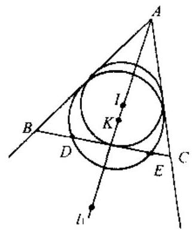

(第 6 题)

6. 如图,圆 $K$ 交 $\bigtriangleup {ABC}$ 的边 ${BC}$ 于 $D, E$ ,记 $\bigtriangleup {ABC}$ 内切圆, ${BC}$ 边上的旁切圆,圆 $K$ 半径分别为 $r.{r}_{1}, p$ . 证明: ${DE} =$ $\frac{4\sqrt{{r}_{1}\left( {p - r}\right) \left( {{r}_{1} - p}\right) }}{{r}_{1} - r}$ .

### 1.3 几何不等式与几何最值

1. 设 $P$ 是 $\bigtriangleup {ABC}$ 所在平面上的一点, $G$ 是 $\bigtriangleup {ABC}$ 的重心,求证: ${PA} + {PB} + {PC} > {3PG}$ .

2. 设 $\bigtriangleup {ABC}$ 的边长和面积分别为 $a, b, c$ 和 $\bigtriangleup$ ,记 $H$ $= \frac{1}{2}\left( {{a}^{2} + {b}^{2} + {c}^{2}}\right) , K = {ab} + {bc} + {ca}$ ,求证: $\frac{{\left( K - H\right) }^{2}}{12} \geq$ ${\bigtriangleup }^{2} \geq  \frac{\left( {K - H}\right) \left( {{3K} - {5H}}\right) }{12}$ ,并问等号何时成立?

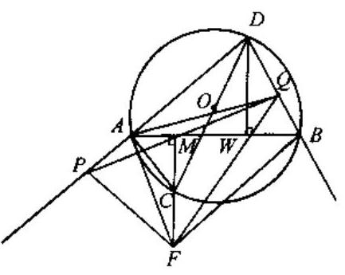

(第 3 题)

3. 已知 $\odot  O$ 的内接四边形 ${ABCD}$ 中, ${CD}$ 为直径, ${CM}$ $\bot  {AB}$ 于 $M$ ,过 $M$ 作直线与 $\angle {ADB}$ 的两边分别相交于 $P$ 和 $Q$ (如图). 求证: ${AB} < {PQ}$ .

4. 设 ${A}_{1}{B}_{1}{C}_{1}{D}_{1}$ 和 ${A}_{2}{B}_{2}{C}_{2}{D}_{2}$ 是圆内接凸四边形, ${A}_{i}{B}_{i} = {a}_{i},{B}_{i}{C}_{i} = {b}_{i},{C}_{i}{D}_{i} = {c}_{i},{D}_{i}{A}_{i} = {d}_{i}$ ,面积为 ${F}_{i}(i =$ $1,2)$ ,令 $K = 4\left( {{a}_{1}{b}_{1} + {c}_{1}{d}_{1}}\right) \left( {{a}_{2}{b}_{2} + {c}_{2}{d}_{2}}\right)  - \left( {{a}_{1}^{2} + {b}_{1}^{2} - }\right.$ $\left. {{c}_{1}^{2} - {d}_{1}^{2}}\right) \left( {{a}_{2}^{2} + {b}_{2}^{2} - {c}_{2}^{2} - {d}_{2}^{2}}\right)$ ,则 $K \geq  {16}{F}_{1}{F}_{2}$ ,等号当且仅当对应角 ${B}_{1} = {B}_{2}$ 时成立.

5. 已知 $\bigtriangleup {ABC}$ ,设 $I$ 是它的内心,角 $A, B, C$ 的内角平分线分别与其对边交于 ${A}^{\prime },{B}^{\prime },{C}^{\prime }$ . 求证: $\frac{5}{4} <$ $\frac{{AI} \cdot  {BI}}{A{A}^{\prime } \cdot  B{B}^{\prime }} + \frac{{BI} \cdot  {CI}}{B{B}^{\prime } \cdot  C{C}^{\prime }} + \frac{{CI} \cdot  {AI}}{C{C}^{\prime } \cdot  A{A}^{\prime }} \leq  \frac{4}{3}.$

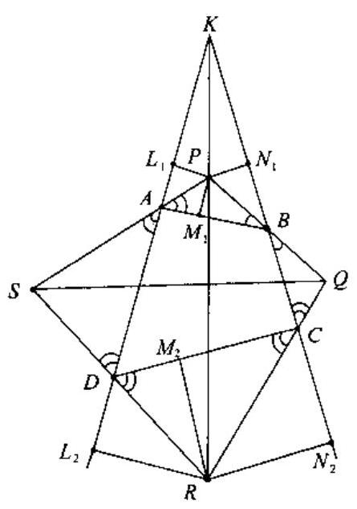

(第 6 题)

6. 凸四边形 ${ABCD}$ ,其四条外角平分线如图分别相交于 $P, Q, R, S$ . 求证: ${PR} + {QS} \geq  {AB} + {BC} + {CD} + {DA}$ , 并求等号成立的充要条件.

7. 设 $\bigtriangleup {ABC}$ 的外接圆半径为 $R$ ,内切圆半径为 $r, P$ 为 $\bigtriangleup {ABC}$ 内任一点, ${AP},{BP},{CP}$ 的延长线分别交对边及外接圆于 ${U}^{\prime }, U;{V}^{\prime }, V;{W}^{\prime \prime }, W$ . 记 $f\left( p\right)  = \frac{U{U}^{\prime }}{A{U}^{\prime }} + \frac{V{V}^{\prime }}{B{V}^{\prime }} +$ $\frac{W{W}^{\prime }}{C{W}^{\prime }}$ . 求 $f\left( p\right)$ 的最大值.

8. 设 $P$ 是正四面体 $T$ 内任一点,过 $P$ 作与 $T$ 的各面平行的 4 个平面,把 $T$ 分为 14 块,从这 14 块中去掉四面体和平行六面体,剩下各块体积之和记为 $f\left( p\right)$ ,这里所说 “剩下各块” 是指那些与 $T$ 的某棱邻接,但不和任一顶点邻接的块. 设 $T$ 的体积为 1,试求 $f$ (p)的最小上界和最大下界.

9. 在 $\bigtriangleup {ABC}$ 与 $\bigtriangleup {A}^{\prime }{B}^{\prime }{C}^{\prime }$ 中, $A \geq  B \geq  C,{A}^{\prime } \geq  {B}^{\prime } \geq  {C}^{\prime }$ ,证明: $\frac{1}{{h}_{a}{h}_{a}{}^{\prime }} + \frac{1}{{t}_{b}{t}_{b}{}^{\prime }} + \frac{1}{{m}_{c}{m}_{c}{}^{\prime }} \geq$ $\frac{12}{a{a}^{\prime } + b{b}^{\prime } + c{c}^{\prime }}$ . 其中 $a, b, c$ 是 $A, B, C$ 的对边, ${h}_{a}$ 是 $a$ 上的高, ${t}_{b}$ 是 $b$ 上的角平分线, ${m}_{c}$ 是 $c$ 的中线. 对于 $\bigtriangleup {A}^{\prime }{B}^{\prime }{C}^{\prime }$ ,情况类似.

10. 在平面上已给定一点 $O$ 和封闭折线 $F$ (未必是凸的). 设 $P$ 表示 $F$ 的周长,记从 $O$ 到 $F$ 的顶点距离之和为 $D$ ,从 $O$ 到 $F$ 的各边距离之和为 $H$ . 求证: ${D}^{2} - {H}^{2} \geq  \frac{{P}^{2}}{4}$ .

11. 设 ${ABCDEF}$ 是凸六边形,且 ${AB}//{DE},{BC}//{EF},{CD}//{FA}$ . 记 ${R}_{A},{R}_{C},{R}_{E}$ 分别是 $\bigtriangleup {FAB},\bigtriangleup {BCD},\bigtriangleup {DEF}$ 的外接圆半径. 求证: ${R}_{A} + {R}_{C} + {R}_{E} \geq  \frac{p}{2}$ ,其中 $p$ 是该六边形的周长.

12. 设 $\bigtriangleup {ABC}$ 为锐角三角形,外接圆半径为 $R$ ,圆心为 $O,{AO}$ 所在直线交过 $B, O, C$ 的圆于另一点 ${A}_{1}$ ,类似地定义 ${B}_{1},{C}_{1}$ . 求证: $O{A}_{1} \cdot  O{B}_{1} \cdot  O{C}_{1} \geq  8{R}^{3}$ .

13. 在锐角三角形 ${ABC}$ 中,求证: ${h}_{a} + {h}_{b} + {h}_{c} \leq  3\left( {R + r}\right)$ ,其中 ${h}_{a},{h}_{b},{h}_{c}$ 分别为 ${BC}$ , ${CA},{AB}$ 边上的高, $R$ 是三角形外接圆半径, $r$ 是内切圆半径.

14. 点 $P, Q, R$ 分别在 $\bigtriangleup {ABC}$ 的边 ${BC},{CA},{AB}$ 上,并且将周长三等分 (即 ${PC} + {CQ} = {QA}$ $+ {AR} = {RB} + {BP})$ . 证明 $\bigtriangleup {PQR}$ 的周长不小于 $\bigtriangleup {ABC}$ 的周长的一半.

### 1.4 几何计算

1. 已知边长分别为 $a, b, c$ 的 $\bigtriangleup {ABC}$ 内接于 $\odot  O, \odot  {O}_{1}$ 内切于 $\odot  O$ ,切点 $G$ 在 ${BC}$ 弧上,由点 $A, B, C$ 分别引 $\odot  {O}_{1}$ 的切线长顺次为 $\alpha ,\beta ,\gamma$ ,证明: ${a\alpha } = {b\beta } + {c\gamma }$ .

2. 在平面上任意放置边长为 $a$ 的正方形 ${A}_{1}{A}_{2}{A}_{3}{A}_{4}$ 与边长为 $b$ 的正方形 ${B}_{1}{B}_{2}{B}_{3}{B}_{4}\left( {A}_{1}\right.$ , ${A}_{2},{A}_{3},{A}_{4}$ 与 ${B}_{1},{B}_{2},{B}_{3},{B}_{4}$ 同为逆时针转向),顺次连接 ${A}_{1}{B}_{1},{A}_{2}{B}_{2},{A}_{3}{B}_{3},{A}_{4}{B}_{4}$ 的中点 ${P}_{1},{P}_{2},{P}_{3},{P}_{4}$ 得四边形 ${P}_{1}{P}_{2}{P}_{3}{P}_{4}$ .

( 1 )求证: ${P}_{1}{P}_{2}{P}_{3}{P}_{4}$ 为正方形；

( 2 )试求 ${P}_{1}{P}_{2}{P}_{3}{P}_{4}$ 的面积 $S$ 的最大值与最小值.

3. 过圆内接凸四边形 ${ABCD}$ 的顶点 $C$ 在四边形外任作 - 直线分别交 ${AB},{AD}$ 的延长线于 $E, F$ . 求证:

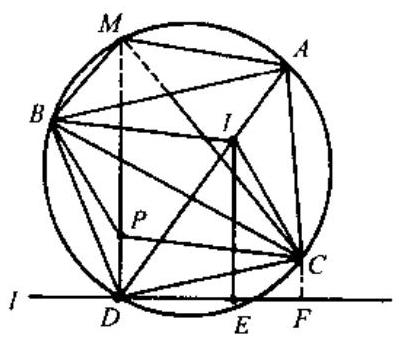

(第 4 题)

(1) ${AB} \cdot  {CE} \cdot  {DF} + {AD} \cdot  {BE} \cdot  {CF} = {BC} \cdot  {CD} \cdot  {EF}$ ;

(2) ${AE} \cdot  {CF} \cdot  {BC} = {AF} \cdot  {EC} \cdot  {CD}$ .

4. 如图, $I$ 为 $\bigtriangleup {ABC}$ 内心, $D$ 为 ${AI}$ 延长线与 $\bigtriangleup {ABC}$ 外接圆交点, ${PBIC}$ 是一个平行四边形,其中 ${PB}//{CI},{PC}//{BI}$ , ${DP}$ 延长线交 $\bigtriangleup {ABC}$ 外接圆于 $M$ . 求证: ${MC} = {MA} + {MB}$ .

5. ${ABCD}$ 是圆内接四边形, $E$ 在 ${AB}$ 边上, $F$ 在 ${CD}$ 边上,且 $\frac{AE}{EB} = \frac{CF}{FD}, P$ 点在线段 ${EF}$ 上且 $\frac{PE}{PF} = \frac{AB}{CD}$ . 求证: 三角形 ${APD}$ 与三角形 ${BPC}$ 的面积比是一个与 $E, F$ 位置无关的定值.

6. 三角形 ${ABC}$ 内有两点 $M$ 和 $N$ ,使得 $\angle {MAB} = \angle {NAC}$ 及 $\angle {MBA} = \angle {NBC}$ 成立. 求证: $\frac{{AM} \cdot  {AN}}{{AB} \cdot  {AC}} + \frac{{BM} \cdot  {BN}}{{BC} \cdot  {BA}} + \frac{{CM} \cdot  {CN}}{{CA} \cdot  {CB}} = 1.$

7. 凸六边形 ${ABCDEF}$ 中, $\angle B + \angle D + \angle F = {360}^{ \circ  }$ ,且 $\frac{{AB} \cdot  {CD} \cdot  {EF}}{{BC} \cdot  {DE} \cdot  {EA}} = 1$ . 求证: $\frac{{BC} \cdot  {AE} \cdot  {FD}}{{CA} \cdot  {EF} \cdot  {DB}} = 1.$

8. $\bigtriangleup {ABC}$ 中, $\angle {ACB} = 2\angle {ABC}$ ,在 ${BC}$ 边上取点 $D$ 使得 ${CD} = {2BD}$ ,延长 ${AD}$ 到 $E$ 使得 ${AD}$ $= {DE}$ . 求证: $\angle {ECB} + {180}^{ \circ  } = 2\angle {EBC}$ .

9. 直角坐标系 ${xOy}, n$ 个点 ${M}_{1}\left( {{x}_{1},{y}_{1}}\right) ,\cdots ,{M}_{n}\left( {{x}_{n},{y}_{n}}\right)$ 满足 ${y}_{1} > 0,\cdots ,{y}_{k} > 0$ , ${y}_{k + 1} < 0,\cdots ,{y}_{n} < 0\left( {1 \leq  k \leq  n}\right)$ . 横轴上排列有 $n + 1$ 个点 ${A}_{1},{A}_{2},\cdots ,{A}_{n + 1}$ ,并且对每个点 ${A}_{j}\left( {1 \leq  j \leq  n + 1}\right)$ 有 $\mathop{\sum }\limits_{{i = 1}}^{k}\angle {M}_{i}{A}_{j}X = \mathop{\sum }\limits_{{i = k + 1}}^{n}\angle {M}_{i}{A}_{j}X$ .

这里 $\angle {M}_{i}{A}_{j}X$ 是 $\overrightarrow{{A}_{j}{M}_{i}}$ 和横轴正方向之间的夹角 (角度的大小在 0 与 $\pi$ 之间).

证明: 点集 $\left\{  {{M}_{1},\cdots ,{M}_{n}}\right\}$ 关于横轴对称.

10. $\bigtriangleup {ABC}$ 的垂心为 $H$ ,在直线 ${AH},{BH},{CH}$ 上分别取 $L, M, N$ ,使 ${AL} = {BM} = {CN} =$ 定值 $x$ .

(1) 证明: $\bigtriangleup {LMN}$ 的面积为 $\frac{1}{2}\left( {\sin A + \sin B + \sin C}\right) \left( {{x}^{2} - {2Rx} + {2Rr}}\right)$ ,其中 $R, r$ 分别为 $\bigtriangleup {ABC}$ 的外接圆与内切圆半径.

( 2 )在直线 ${AH},{BH},{CH}$ 上分别取 ${L}_{1},{L}_{2},{M}_{1},{M}_{2},{N}_{1},{N}_{2}$ ,使 $A{L}_{1} = B{M}_{1} = C{N}_{1} =$ ${x}_{1}, A{L}_{2} = B{M}_{2} = C{N}_{2} = {x}_{2} \neq  {x}_{1}$ . 证明 ${S}_{\bigtriangleup {L}_{1}{M}_{1}{N}_{1}} = {S}_{\bigtriangleup {L}_{2}{M}_{2}{N}_{2}}$ 的充要条件是 ${x}_{1} + {x}_{2} = {2R}$ .

(3)符号同(2),若 ${L}_{1},{M}_{1},{N}_{1}$ 共线, ${L}_{2},{M}_{2},{N}_{2}$ 共线, 证明这两条直线的交点是 $\bigtriangleup {ABC}$ 的内心并且 ${L}_{1}{M}_{1} \bot  {L}_{2}{M}_{2}$ .

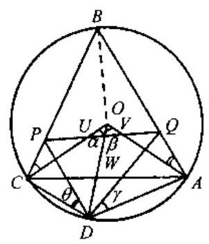

(第 14 题)

11. 平面上给定 $\bigtriangleup {A}_{1}{A}_{2}{A}_{3}$ 及点 ${P}_{0}$ ,定义 ${A}_{s} = {A}_{s - 3}, S \geq  4$ . 造点列 ${P}_{0},{P}_{1},{P}_{2},\cdots$ ,使得 ${P}_{k + 1}$ 为绕中心 ${A}_{k + 1}$ 顺时针旋转 ${120}^{ \circ  }$ 时 ${P}_{k}$ 所达到的位置, $k = 1,2,\cdots$ . 若 ${P}_{1986} = {P}_{0}$ ,证明: $\bigtriangleup {A}_{1}{A}_{2}{A}_{3}$ 为等边三角形.

12. 已知 $\odot  O$ 有三条直径 ${AD},{BE},{CF}$ 两两夹 ${60}^{ \circ  }$ 角,圆内一点 $P$ 使 $\left| {OP}\right|  < \frac{R}{2}$ ,过 $P$ 作与三角形垂直的弦与圆周交于六个点, 擦去三直径,将 $P$ 与 $A, B, C, D, E, F$ 相连,得到 12 块区域, 相间染成黑、白两色. 证明: ${S}_{\text{黑 }} = {S}_{\text{白 }}$ .

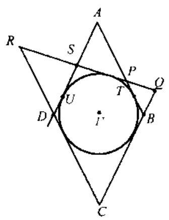

(第 15 题)

13. 在 $\bigtriangleup {ABC}$ 的 3 条边 ${BC},{CA},{AB}$ 上分别取点 $D, E, F$ , 使 $\bigtriangleup {DEF}$ 为等边三角形. $a, b, c$ 分别表示 $\bigtriangleup {ABC}$ 的三边长,而 $S$ 表示它的面积. 求证: ${DE} \geq  2\sqrt{2}S \cdot  {\left( {a}^{2} + {b}^{2} + {c}^{2} + 4\sqrt{3}S\right) }^{-\frac{1}{2}}$ .

14. 给定 $\odot  O$ 的一个内接三角形 ${ABC}, D$ 是 $\overset{⏜}{AC}$ 上的一个动点. $P, Q$ 分别是 ${BC},{BA}$ 上的两点,满足 $\angle {CDP} = \angle {QAO},\angle {ADQ} =$ $\angle {PCO},{PQ}$ 交 ${OC},{OD},{OA}$ 于点 $U, W, V$ . 求证: $\frac{UD}{VD} \cdot  \frac{OP}{OQ} =$ $\frac{PD}{QD} \cdot  \frac{OU}{OV}$ .

15. 如图,菱形 ${ABCD}$ 的内切圆 $\Gamma$ 切 ${AB}$ 于 $T$ ,圆 $\Gamma$ 的一条切线交 ${AB},{AD}$ 于 $P, S,{PS}$ 交 ${BC},{CD}$ 于 $Q, R$ .

求证: (a) $\frac{1}{PQ} + \frac{1}{RS} = \frac{1}{BT}$ ; (b) $\frac{1}{PS} - \frac{1}{QR} = \frac{1}{AT}$ .

## $\widetilde{M}$ 的数学奥林匹克题集

### 1.5 反演与配极

1. 如图, $N$ 与 $S$ 为圆 $\omega$ 的一组对径点, $l$ 为 $\omega$ 在 $S$ 点上的切线, ${NA}$ 与 $l$ 交于 $A$ ,与 $\omega$ 交于 $C,{NB}$ 与 $l$ 交于 $B$ ,与 $\omega$ 交于 $D.\omega$ 在 $C$ 点及 $D$ 点上的两条切线交于 $X.{NX}$ 交 $l$ 于 $Y$ . 求证: ${AY} = {YB}$ .

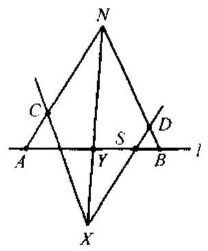

(第 1 题)

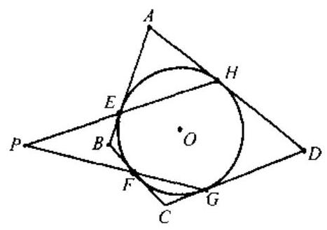

(第 2 题)

2. 凸四边形 ${ABCD}$ 外切于 $\odot  O,{AB},{BC},{CD},{DA}$ 上的切点分别是 $E, F, G, H$ ,直线 ${HE}$ 与 ${FC}$ 相交于点 $P$ ,求证: ${OP} \bot  {AC}$ .

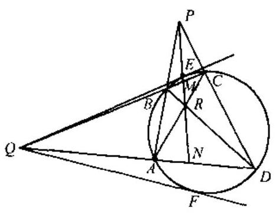

(第 3 题)

3. 四边形 ${ABCD}$ 内接于圆,其边 ${AB}$ 与 ${DC}$ 的延长线交于点 $P,{AD}$ 和 ${BC}$ 的延长线交于 $Q$ ,过 $Q$ 作该圆的两条切线,切点分别为 $E, F$ ,求证: $P, E, F$ 三点共线.

4. 凸四边形 ${ABCD}$ 外切于 $\odot  O,{AB},{BC},{CD},{DA}$ 边上的切点分别为 $S, T, U, V$ . 求证: ${AC},{BD},{SU}$ , ${TV}$ 共点.

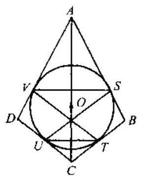

(第 4 题)

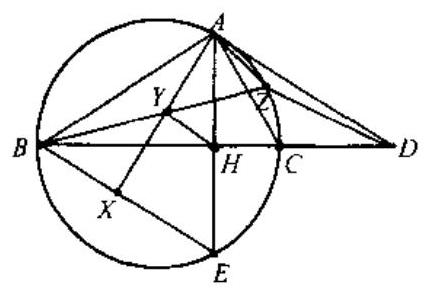

(第 5 题)

5. 三角形 ${ABC}$ 中, $\angle A = {90}^{ \circ  }$ ,且 $\angle B < \angle C$ . 过 $A$ 作 $\bigtriangleup {ABC}$ 外接圆 $W$ 的切线和 ${BC}$ 相交于 $D, E$ 是 $A$ 点关于 ${BC}$ 的对称点, $X$ 是 $A$ 到 ${BE}$ 上的垂足. $Y$ 是 ${AX}$ 中点. 直线 ${BY}$ 与 $W$ 再相交于 $Z$ . 求证: ${BD}$ 与 $\bigtriangleup {ADZ}$ 外接圆相切.

6. 两个半径不相等的圆 $\odot  {O}_{1}, \odot  {O}_{2}$ 相交于 $A, B$ ,以 $B$ 为圆心作一圆,交 $\odot  {O}_{1}$ 于 ${CD}$ ,交 $\odot  {O}_{2}$ 于 ${EF}$ ,直线 ${DE},{CF}$ 相交于 $M$ ,直线 ${DF},{CE}$ 相交于 $N$ . 证明: ${MAN}$ 共线.

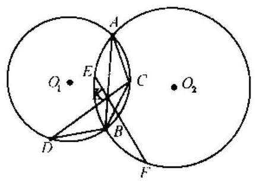

(第 6 题)

### 1.6 共点线与共线点

1. 以 $\bigtriangleup {ABC}$ 的两边 ${AB},{AC}$ 向外作正方形 ${ABED}$ , ${ACFG},\bigtriangleup {ABC}$ 的高为 ${AH}$ ,求证: ${AH},{BF},{CE}$ 交于一点.

2. 设 $\bigtriangleup {ABC}$ 是锐角三角形,三条直线 ${LA},{IB},{LC}$ 分别通过顶点 $A, B, C$ ,并以下述方式作出: 设 $H$ 是由 $A$ 向 ${BC}$ 所作垂线的垂足, ${S}_{A}$ 是以 ${AH}$ 为直径的圆, ${S}_{A}$ 与边 ${AB},{AC}$ 分别交于点 $M, N\left( {M, N\text{异于}A}\right) ,{LA}$ 为过 $A$ 点与 ${MN}$ 垂直的直线,直线 ${LB},{LC}$ 类似作出,证明: ${LA},{LB},{LC}$ 共点.

3. 锐角 $\bigtriangleup {ABC}$ 中,过 $B, C$ 的圆 $W$ 交 ${AB},{AC}$ 于 ${C}^{\prime },{B}^{\prime }$ ,记 $\bigtriangleup A{B}^{\prime }{C}^{\prime },\bigtriangleup {ABC}$ 的垂心分别为 ${H}^{\prime }, H$ . 证明: $B{B}^{\prime }, C{C}^{\prime }, H{H}^{\prime }$ 共点.

4. $H$ 是三角形 ${ABC}$ 的垂心, $O$ 是外心, $R$ 是外接圆半径. $D$ 是 $A$ 点关于 ${BC}$ 的对称点, $E$ 是 $B$ 点关于 ${CA}$ 的对称点, $F$ 是 $C$ 点关于 ${AB}$ 的对称点. 求证: ${OH} = {2R}$ 是 $D, E$ 和 $F$ 共线的充要条件.

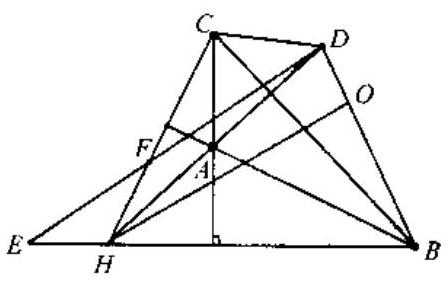

(第 4 题)

5. 在三角形 ${ABC}$ 的边 ${BC}$ 的延长线上取一点 $D$ ,使 ${CD}$ $= {AC}$ . 三角形 ${ACD}$ 的外接圆和以 ${BC}$ 为直径的圆再相交于 $P,{BP}$ 和 ${AC}$ 相交于 $E,{CP}$ 和 ${AB}$ 相交于 $F$ . 求证: $D, E$ 和 $F$ 共线.

6. 已知 $\bigtriangleup {ABC}$ 的内切圆切 ${AB},{AC},{BC}$ 于 $P, Q, R$ , ${PQ}$ 与 ${AB}$ 边上的中位线交于点 $X,{RQ}$ 与 ${BC}$ 边上的中位线交于点 $Y$ ,求证: $B, X, Y$ 三点共线.

### 1.7 立体几何

1. 四面体的内切球与一个面的切点恰为该面的内心, 与另一个面的切点恰为其垂心, 与第三个面的切点恰为其重心. 证明: 该四面体是正四面体.

2. 长方体 ${ABCD} - {A}_{1}{B}_{1}{C}_{1}{D}_{1}$ 的底面是边长为 $a$ 的正方形,过下底 ${ABCD}$ 的对角线 ${AC}$ 引与上底 ${A}_{1}{B}_{1}{C}_{1}{D}_{1}$ 相交的平面,分别以 $B,{D}_{1}$ 为顶点的三面角的内切球与该平面相切,内切球的半径 $r = \frac{1}{5}a$ 及 $R = \frac{1}{4}a$ ,求长方体的高度.

3. 有一个用柔软而坚韧的材料做成的薄壁圆柱 (例如一根喝汽水的吸管), 其内直径为 $d$ ,试问: 可以通过这个圆柱筒内部的最大正四面体的棱长是多少?

4. 我们把棱锥体的顶点处称为多面角. 试问: 是否存在一个四面体和一个 $n$ 棱锥 $\left( {n \geq  4}\right)$ ,使得该 $n$ 棱锥中有 4 个三面角分别对应相等于四面体的 4 个三面角?

## 高中数学奥林匹克题集

5. 空间中是否有一个正方体,它的 8 个顶点到某个平面的距离分别为0,1,2,3,4, 5, 6, 7?

6. 设 $P$ 为四面体 ${ABCD}$ 内部的一点,使得 ${PA} + {PB} + {PC} + {PD}$ 为最小. 证明:

(1)存在共点于 $P$ 的三条直线,每一条都与一组对棱相交,且平分 $P$ 点对该组对棱的张角;

(2) $P$ 点对每组对棱的张角各自相等.

### 1.8 杂题

1. 在凸五边形 ${ABCDE}$ 的边及对角线中没有相互平行的线段,在边 ${AB}$ 上画箭头,指向直线 ${AB}$ 及 ${CE}$ 的交点一侧; 在边 ${BC}$ 上画箭头,指向直线 ${BC}$ 及 ${AD}$ 的交点一侧; 在边 ${CD}$ , ${DE},{EA}$ 上的箭头的情况也类似作出. 证明: 必有两个箭头同时指向五边形的某个顶点.

2. 一个战士想要查遍一个正三角形区域及边界上有无地雷, 他的探测器的有效半径等于正三角形高的一半,这个战士从三角形的一个顶点开始探测,问:他循怎样的探测路线才能使查遍整个区域的路程最短?

3. 设 $H$ 是平面上 $\bigtriangleup {ABC}$ 区域的任一点, ${AH},{BH},{CH}$ 的延长线交 $\bigtriangleup {ABC}$ 三边于 $D, E, F$ ,求证: 在 $\bigtriangleup {ABC}$ 的区域,存在一个以 $\bigtriangleup {DEF}$ 的某两边为邻边的平行四边形.

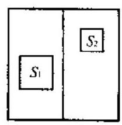

(第 4 题)

4. 在单位正方形内有两个互不相交的正方形 ${S}_{1}$ 和 ${S}_{2}$ ,记它们的边长分别为 ${a}_{1}$ 和 ${a}_{2}$ . 求证: ${a}_{1} + {a}_{2} < 1$ .

5. 证明或否定命题: 三边长和面积的数值都是整数的三角形, 必有一条高长为整数.

6. 设 $a, b, c, d$ 都是正数,证明: 存在一个三角形,其三边之长分别为 $\sqrt{{b}^{2} + {c}^{2}}$ , $\sqrt{{a}^{2} + {c}^{2} + {d}^{2} + {2cd}},\sqrt{{a}^{2} + {b}^{2} + {d}^{2} + {2ab}}$ ,并计算这个三角形的面积.

7. 切一个凸 $n$ 边形是指选出一对相邻的边 ${AB},{BC}$ ,切去 $\bigtriangleup {MBN}$ 得到一个凸 $n + 1$ 边形, 其中 $M, N$ 分别为 ${AB},{BC}$ 的中点. 把面积为 $S$ 的一个正六边形 ${P}_{6}$ ,切成七边形 ${P}_{7}$ ,再将 ${P}_{7}$ (用七种可能的切法之一) 切成八边形 ${P}_{8}$ ,如此继续下去. 证明: 不论怎么切,对所有 $n > 6,{P}_{n}$ 的面积大于 $\frac{1}{2}S$ .

## 二、代数

### 2.1 不等式与最值

1. 设 $x, y, z$ 都是实数,并满足 $x + y + z = a,{x}^{2} + {y}^{2} + {z}^{2} = \frac{{a}^{2}}{2}, a > 0$ . 证明: $0 \leq  x$ , $y, z \leq  \frac{2}{3}a$ .

2. 设 $0 < {x}_{1} < {x}_{2} \leq  \cdots  \leq  {x}_{n}$ ,并且 ${x}_{1} + {x}_{2} + \cdots  + {x}_{n} = 1$ . 这里 $n \geq  3$ 是个奇数. 证明: $\mathop{\sum }\limits_{\substack{{i + j = n + 2} \\  {i < j} }}{x}_{i}{x}_{j} + \mathop{\sum }\limits_{\substack{{i + j = n} \\  {i < j} }}{x}_{i}{x}_{j} + {x}_{1}{x}_{n} \leq  \frac{1}{n}.$

3. 设 $x, y$ 及 $z$ 为正实数而 ${xyz} = 1$ . 求证: $\frac{{x}^{3}}{\left( {1 + y}\right) \left( {1 + z}\right) } + \frac{{y}^{3}}{\left( {1 + z}\right) \left( {1 + x}\right) } +$ $\frac{{z}^{3}}{\left( {1 + x}\right) \left( {1 + y}\right) } \geq  \frac{3}{4}$ .

4. 设 ${x}_{k},{y}_{k} \in  R,{j}_{k} = {x}_{k} + i{y}_{k}\left( {k = 1,2,\cdots , n, i = \sqrt{-1}}\right) , r$ 是 $\pm  \sqrt{{j}_{1}^{2} + {j}_{2}^{2} + \cdots  + {j}_{n}^{2}}$ 的实部的绝对值. 求证: $r \leq  \left| {x}_{1}\right|  + \left| {x}_{2}\right|  + \cdots  + \left| {x}_{n}\right|$ .

5. 设 ${x}_{1},\cdots ,{x}_{n}$ 为非负实数, $a = \min \left\{  {{x}_{1},{x}_{2},\cdots ,{x}_{n}}\right\}$ . 证明: $\mathop{\sum }\limits_{{j = 1}}^{n}\frac{1 + {x}_{j}}{1 + {x}_{j + 1}} \leq  n +$ $\frac{1}{{\left( 1 + a\right) }^{2}}\mathop{\sum }\limits_{{j = 1}}^{n}{\left( {x}_{j} - a\right) }^{2}.$

6. 设 $\overrightarrow{a},\overrightarrow{b},\overrightarrow{c}$ 为任意向量,证明:

$$
\left| {\overrightarrow{a} + \overrightarrow{b} + \overrightarrow{c}}\right|  + \left| \overrightarrow{a}\right|  + \left| \overrightarrow{b}\right|  + \left| \overrightarrow{c}\right|  \geq  \left| {\overrightarrow{a} + \overrightarrow{b}}\right|  + \left| {\overrightarrow{b} + \overrightarrow{c}}\right|  + \left| {\overrightarrow{c} + \overrightarrow{a}}\right| .
$$

7. 已知 $a, b, c, d, m, n$ 都是正数,并且 $a + c = b + d = m + n = 1, p = {nc} + {md}$ , $q = {mb} + {na}$ . 证明:

(1) ${cd} + {ab} > {bd}$ ;

(2) ${c}^{2} + {a}^{2} + {ac} > {bc} + {ad}$ ;

(3) $\frac{1}{{m}^{2} + {mn} + {n}^{2}} > \frac{pq}{\left( {{mp} + {na}}\right) \left( {{mq} + {nc}}\right) }$ .

8. 已知 ${x}_{1}{x}_{2}\cdots {x}_{n} = {Q}^{n}$ ,其中 ${x}_{i} \geq  1\left( {i = 1,2,\cdots , n}\right)$ . 记 ${x}_{n + 1} = {x}_{1}$ ,证明: 当 $n$ 大于 2 时, $\mathop{\sum }\limits_{{i = 1}}^{n}{x}_{i}{x}_{i + 1} - \mathop{\sum }\limits_{{i = 1}}^{n}{x}_{i} \geq  \frac{n}{2}\left( {{Q}^{2} - 1}\right)$ .

9. 证明: $0 < x < y < z < \frac{\pi }{2}$ 时, $\sqrt{2} + 2\sin x\cos y + 2\sin y\cos z > \sin {2x} + \sin {2y} + \sin {2z}$ .

10. 正数 $a, b, c, A, B, C$ 满足 $a + A = b + B = c + C = k$ ,证明: ${aB} + {bC} + {cA} < {k}^{2}$ .

11. ${S}_{n} = 1 + \frac{1}{2} + \cdots  + \frac{1}{n}$ ,证明: $n{\left( n + 1\right) }^{\frac{1}{n}} - n < {S}_{n} < n - \left( {n - 1}\right) {n}^{-\frac{1}{n - 1}}$ .

12. $a, b, c$ 为正数,证明: $\frac{c}{a} + \frac{a}{b + c} + \frac{b}{c} \geq  2$ .

13. $a, b, c, d$ 为正数,证明: $\frac{a}{b + c} + \frac{b}{c + d} + \frac{c}{d + a} + \frac{d}{a + b} \geq  2$ .

14. ${a}_{i} \in  R\left( {i = 1,2,\cdots , n}\right) ,{b}_{k} = \frac{{a}_{1} + {a}_{2} + \cdots  + {a}_{k}}{k}\left( {k = 1,2,\cdots , n}\right) ,{C}_{n} =$ ${\left( {a}_{1} - {b}_{1}\right) }^{2} + {\left( {a}_{2} - {b}_{2}\right) }^{2} + \cdots  + {\left( {a}_{n} - {b}_{n}\right) }^{2},{D}_{n} = {\left( {a}_{1} - {b}_{n}\right) }^{2} + {\left( {a}_{2} - {b}_{n}\right) }^{2} + \cdots  + {\left( {a}_{n} - {b}_{n}\right) }^{2}$ . 证明: ${C}_{n} \leq  {D}_{n} \leq  2{C}_{n}.$

15. $n$ 个非负实数 ${x}_{1},{x}_{2},\cdots ,{x}_{n}$ 满足 ${x}_{1} + {x}_{2} + \cdots  + {x}_{n} = n$ ,证明: $\frac{{x}_{1}}{1 + {x}_{1}^{2}} + \cdots  + \frac{{x}_{n}}{1 + {x}_{n}^{2}} \leq$ $\frac{1}{1 + {x}_{1}} + \cdots  + \frac{1}{1 + {x}_{n}}$

16. 设 ${a}_{1},{a}_{2},\cdots ,{a}_{n}\left( {r \geq  3}\right)$ 是自然数,今知如下 $n$ 个比值 $\frac{{a}_{1} + {a}_{3}}{{a}_{2}},\frac{{a}_{2} + {a}_{4}}{{a}_{3}},\cdots$ , $\frac{{a}_{n - 2} + {a}_{n}}{{a}_{n - 1}},\frac{{a}_{n - 1} + {a}_{1}}{{a}_{n}},\frac{{a}_{n} + {a}_{2}}{{a}_{1}}$ 都是自然数. 现将这 $n$ 个比值的和记作 ${S}_{n}$ ,证明: ${2n} \leq  {S}_{n} < {3n}$ .

17. 设 ${a}_{1},{a}_{2},\cdots ,{a}_{n}$ 是 $n$ 个互不相同的自然数,证明: $\left( {{a}_{1}^{7} + {a}_{2}^{7} + \cdots  + {a}_{n}^{7}}\right)  + \left( {{a}_{1}^{5} + {a}_{2}^{5}}\right.$ $\left. {+\cdots  + {a}_{n}^{5}}\right)  \geq  2{\left( {a}_{1}^{3} + {a}_{2}^{3} + \cdots  + {a}_{n}^{3}\right) }^{2}$ .

18. 证明对 $\left| x\right|  < 1$ 和整数 $n \geq  2$ ,有如下的不等式成立: ${\left( 1 - x\right) }^{n} + {\left( 1 - x\right) }^{n} < {2}^{n}$ .

19. 以 $\left\lbrack  {b, c}\right\rbrack$ 表示自然数 $b$ 和 $c$ 的最小公倍数,设 ${a}_{0} < {a}_{1} < \cdots  < {a}_{n}$ 为自然数,证明: $\frac{1}{\left\lbrack  {a}_{0},{a}_{1}\right\rbrack  } + \frac{1}{\left\lbrack  {a}_{1},{a}_{2}\right\rbrack  } + \cdots  + \frac{1}{\left\lbrack  {a}_{n - 1},{a}_{n}\right\rbrack  } \leq  1 - \frac{1}{{2}^{n}}.$

20. 证明: 对任意 $n$ 个实数 ${a}_{1},{a}_{2},\cdots ,{a}_{n}$ 及任意 $n$ 个正数 ${b}_{1},{b}_{2},\cdots ,{b}_{n}$ ,都有如下的不等式成立:

$$
\frac{{a}_{1}^{2}}{{b}_{1}} + \frac{{a}_{2}^{2}}{{b}_{2}} + \cdots  + \frac{{a}_{n}^{2}}{{b}_{n}} \geq  \frac{{\left( {a}_{1} + {a}_{2} + \cdots  + {a}_{n}\right) }^{2}}{{b}_{1} + {b}_{2} + \cdots  + {b}_{n}}.
$$

21. 设正整数 ${x}_{1},{x}_{2},\cdots ,{x}_{504}$ 满足 ${x}_{1} + {x}_{2} + \cdots  + {x}_{504} = {x}_{1}{x}_{2}\cdots {x}_{504}$ ,证明: ${x}_{1} + {x}_{2} + \cdots  +$ ${x}_{504} \geq  {514}$ .

22. 给定 $n$ 个实数 ${x}_{1},{x}_{2},\cdots ,{x}_{n}$ ,证明: 存在一个实数 $y$ ,使得 $\left\{  {{x}_{1} - y}\right\}   + \left\{  {{x}_{2} - y}\right\}   + \cdots  +$ $\left\{  {{x}_{n} - y}\right\}   \leq  \frac{n - 1}{2}$ ,这里 $\{ x\}$ 表示实数 $x$ 的小数部分.

23. 设 $a, b, c$ 是实数 $\left( {a \neq  0}\right)$ ,满足 $\left\{  \begin{array}{l} a + {2b} + c > 0, \\  {2a} - 2\sqrt{2}b + c < 0. \end{array}\right.$