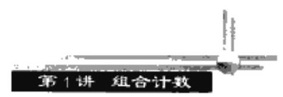
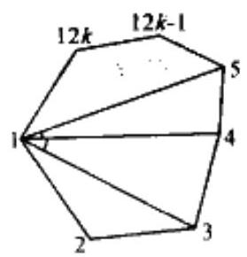

第 1 讲 组合计数

## 一、知识点金

组合计数就是要计算给定集合的元素个数. 它是组合数学的重要组成部分. 由于在具体问题中给出的集合有不同的约束条件, 因此, 解决有关计数问题时需要相当的技巧. 这也使它成为各类数学竞赛的命题热点.

计数中最基本的两个原理是分类计数原理与分步计数原理.

计数中的重要模型:

( 1 )相异元素的线排列:从 $n$ 个不同元素中取出 $m$ 个元素排成一排的排列数为 ${A}_{n}^{m}$ .

(2)相异元素的组合:从 $n$ 个不同元素中取出 $m$ 个元素的组合数为 ${C}_{n}^{m}$ .

(3) 可重复排列: 从 $n$ 个不同元素中取出 $m$ 个元素 (可以重复取) 的排列数为 ${n}^{m}$ .

(4)可重复组合:从 $n$ 个不同元素中取出 $m$ 个元素(可以重复取)的组合数为 ${C}_{n + m - 1}^{m}$ .

(5)不尽相异元素的全排列: 设 $n$ 个元素可以分成 $k$ 组,每组内元素相同,不同组元素不同,第 $i$ 组的元素有 ${n}_{i}\left( {i = 1,2,\cdots , k}\right)$ 个. 且 ${n}_{1} + {n}_{2} + \cdots  + {n}_{k} = n$ ,则这 $n$ 个元素的全排列数为 $\frac{n!}{{n}_{1}! \cdot  {n}_{2}!\cdots {n}_{k}!}$ .

(6)相异元素的圆排列:从 $n$ 个不同元素中取出 $m$ 个不同元素排成一个圈的排列数为 $\frac{{A}_{n}^{m}}{m} = \frac{n!}{\left( {n - m}\right) ! \cdot  m}$ .

(7) 错位排列: $n$ 个相异元素排成一排 ${a}_{1},{a}_{2},\cdots ,{a}_{n}$ ,且 ${a}_{i}\left( {i = 1,2,\cdots , n}\right)$ 不排在第 $i$ 位的排列数为 $n! \cdot  \left( {1 - \frac{1}{1!} + \frac{1}{2!} - \frac{1}{3!} + \cdots  + {\left( -1\right) }^{n}\frac{1}{n!}}\right)$ .

证明: 设 $1,2,\cdots , n$ 的全排列 ${t}_{1},{t}_{2},\cdots ,{t}_{n}$ 的集合为 $I$ ,而使 ${t}_{i} = i$ 的全排列的集合记为 ${A}_{i}\left( {1 \leq  i \leq  n}\right)$ .

则 ${D}_{n} = \left| I\right|  - \left| {{A}_{1} \cup  {A}_{2} \cup  \cdots  \cup  {A}_{n}}\right|$ .

所以 ${D}_{n} = n! - \left| {{A}_{1} \cup  {A}_{2} \cup  \cdots  \cup  {A}_{n}}\right|$ .

注意到 $\left| {A}_{n}\right|  = \left( {n - 1}\right) !,\left| {{A}_{i} \cap  {A}_{j}}\right|  = \left( {n - 2}\right) !,\cdots ,\left| {{A}_{1} \cap  {A}_{2} \cap  \cdots  \cap  {A}_{m}}\right|  = 0! = 1$ .

由容斥原理有:

$\left| {{A}_{1} \cup  {A}_{2} \cup  \cdots  \cup  {A}_{n}}\right|  = n \cdot  \left( {n - 1}\right) ! - {C}_{n}^{2} \cdot  \left( {n - 2}\right) ! + {C}_{n}^{3}\left( {n - 3}\right) ! - \cdots  + {\left( -1\right) }^{n - 1}{C}_{n}^{n} \cdot  0!$

$= n! \cdot  \left( {\frac{1}{1!} - \frac{1}{2!} + \frac{1}{3!} + \cdots  + {\left( -1\right) }^{n - 1}\frac{1}{n!}}\right) ,$

所以 ${D}_{n} = n! \cdot  \left( {1 - \frac{1}{1!} + \frac{1}{2!} - \frac{1}{3!} + \cdots  + {\left( -1\right) }^{n}\frac{1}{n!}}\right)$ .

## 例题精析

例 1 求由1,2,3,4,5,6六个数字构成的至少有三位数不同,且 1,6 不相邻的五位数的个数.

分析 根据题目条件进行分类.

解 先考察恰有两位数不同的五位数的个数为 ${C}_{5}^{2} \times  \left( {{2}^{5} - 2}\right)  = {450}$ 个,而各位数均相同的五位数有 ${C}_{6}^{1} = 6$ 个.

再考察至少有三位数不同且有 1,6 相邻的五位数的个数,分六种情况:

(1)五位数中有 2 个 1,2 个 6,另一个数设为 $a$ ,则仅有 ${11a66.66a11}$ 两种使 1,6 不相邻,又 $a$ 有 4 种取法,故有 $4 \times  \left( {{C}_{5}^{1}{C}_{4}^{2} - 2}\right)  = {112}$ 种.

(2)五位数中有 2 个 1,1 个 6 . 若 6 在第一位或最后一位,则 1 可取 3 个位置( 6 * $\square \square \square ,\square \square \square  * 6)$ ,有 ${C}_{3}^{2} \times  2$ 种使 1,6 不相邻；若 6 在 2,3,4 位,则 1 可取 2 个位置,有 ${C}_{2}^{2} \times  3$ 种使 1,6 不相邻. 故有 ${4}^{2} \times  \left( {{C}_{3}^{1} \cdot  {C}_{4}^{2} - {C}_{3}^{2} \times  2 - {C}_{2}^{2} \times  3}\right)$ 种使 1,6 相邻,即有 336 种.

(3) 2 个 6,1 个 1,同(2)有 336 种使 1,6 相邻的取法.

(4) 1 个 6,1 个 1,有 ${4}^{3} \times  {C}_{4}^{1} \times  {P}_{2}^{2} = {512}$ 种.

(5) 3 个 6,1 个 1,有 ${666} * 1,1 * {666}$ 两种使 1,6 不相邻. 故有 $4 \times  \left( {{C}_{5}^{1} \cdot  {C}_{4}^{1} - 2}\right)  = {72}$ 种使 1,6 相邻的取法.

(6) 3 个 1,1 个 6,同(5)有 72 种.

由上六种情况可知,至少有三位数不同,且有 1,6 相邻的五位数的个数一共有

${112} + {336} + {336} + {512} + {72} + {72} = {1440}$ 种.

由容斥原理, 所求的五位数的个数为

${6}^{5} - \left( {{1440} + {450} + 6}\right)  = {5880}$ 个.

例 2 从 $1,2,\cdots ,{14}$ 中取出三个数 ${a}_{1},{a}_{2},{a}_{3}$ ,使满足 ${a}_{1} \leq  {a}_{2} - 3,{a}_{2} \leq  {a}_{3} - 3$ . 有多少种不同取法? (1989 年全国联赛试题)

分析 设取出的三个数为 ${a}_{1},{a}_{2},{a}_{3}$ ,在 ${a}_{1}$ 之前有 $x$ 个数, ${a}_{1}$ 与 ${a}_{2}$ 之间有 $y$ 个数, ${a}_{2}$ 与 ${a}_{3}$ 之间有 $z$ 个数, ${a}_{3}$ 之后有 $w$ 个数,满足 $x + y + z + w = {11}$ .

解 该问题等价于从排成一排的 14 个不同小球中取出 3 个,并要求每两个之间至少相隔两个. 为解决这一问题, 可改变顺序: 先取出 4 个小球, 从 10 个小球中任取 3 个, 然后再在取出的 3 个中按顺序,每两个间插入 2 个小球,因此原问题等价于从 $1,2,\cdots ,{10}$ 中任意取出三个数的不同取法. 共有 ${C}_{10}^{3} = {120}$ 种.

(注 一般地,从 $1,2,\cdots , m$ 中取出 ${a}_{1},{a}_{2},{a}_{3}$ ,使 ${a}_{2} - {a}_{1} \geq  s,{a}_{3} - {a}_{2} \geq  t$ ,则不同取法种数有 $\left( {{2}_{m - 2 - k - 1}^{3}\text{种. }}\right)$

例 3 从 $1,2,\cdots ,{49}$ 中取出 6 个不同的数,使得其中至少有两个相邻,间共有多少种取法?

分析 可以按照条件 “ 6 个数至少两个相邻” 的不同情况进行分类, 较复杂. 这里先求出没有两个数相邻的取法总数.

解 首先,集合 $M = \{ 1,2,\cdots ,{49}\}$ 的所有不同的 6 元子集的个数为 ${C}_{49}^{6}$ . 但是,其中 6 个数不相邻的子集

---

$$
\left\{  {{a}_{1},{a}_{2},\cdots ,{a}_{6}}\right\}  ,{a}_{i} + 1 < {a}_{i + 1}, i = 1,2,3,4,5,
$$

---

①

不满足题中要求.

记满足①的所有 6 元子集的集合为 $A$ ,并令

$$
\left\{  {{a}_{1},{a}_{2},\cdots ,{a}_{n}}\right\}   \rightarrow  \left\{  {{b}_{1},{b}_{2},\cdots ,{b}_{6}}\right\}  ,
$$

②

其中 ${b}_{i} = {a}_{i} - i + 1, i = 1,2,3,4,5,6$ .

显然, ${b}_{1},{b}_{2},\cdots ,{b}_{6}$ 互不相同且有 $1 \leq  {b}_{1} < {b}_{2} < \cdots  < {b}_{6} \leq  {44}$ . 容易验证②定义的映射是由集合 $A$ 到集合 $\{ 1,2,\cdots ,{44}\}$ 的所有不同的 6 元子集的一一映射.

所以 $\left| A\right|  = \left| B\right|  = {C}_{44}^{6}$ .

故满足条件的取法共有 ${C}_{49}^{6} - {C}_{44}^{6}$ 种.

例 4 把 $n$ 个学生分成若干个小组 (每组个数不限) 的每一种分法称为 “ $n$ 分组”,不同的 $n$ 分组种数记作 ${a}_{n}$ ,至少有一组只有一个学生的不同的 $n$ 分组种数记作 ${b}_{n}$ . 求证: ${a}_{n} = {b}_{n} + {b}_{n - 1}.$

分析 运用配对原理构造两个集合的一一对应关系.

证明 假设 ${P}_{n}$ 为至少有一组恰有一名学生的某一个 $n$ 分组, ${Q}_{n}$ 为每一组至少有两名学生的某一个 $n$ 分组,又设不同的 ${Q}_{n}$ 有 ${c}_{n}$ 种. 显然有 ${a}_{n} = {b}_{n} + {c}_{n}$ . 下证 ${b}_{n - 1} = {c}_{n}$ .

由 ${h}_{n - 1}$ 与 ${c}_{n}$ 的定义可知,只要证明对给定的 $n$ ,能够建立由不同的 ${P}_{n - 1}$ 组成的集合与由不同的 ${Q}_{n}$ 组成的集合元素之间的一一对应关系就可以了.

事实上,假设 ${P}_{n - 1}$ 是编号为 $1,2,\cdots , n - 1$ 的学生的任意一个 $n - 1$ 分组,将 ${P}_{n - 1}$ 中只组合问题有一名学生的所有的小组与编号为 $n$ 的学生合并成新的一组. 由于 ${P}_{n - 1}$ 中至少有一组只有一名学生,因此得到的新的 $n$ 分组每组至少有两名学生,即得到一个 ${Q}_{n}$ .

反之,任取一个 ${Q}_{n}$ ,将编号为 $n$ 的学生所在的小组拆成只有一名学生的若干小组. 同时去掉 $n$ 号学生,就可得到一个 ${P}_{n - 1}$ .

我们已经建立了集合 $\left\{  {P}_{n}\right\}$ 与集合 $\left\{  {Q}_{n}\right\}$ 之间的一一对应关系,故 ${b}_{n - 1} = {c}_{n}$ ,从而证得 ${a}_{n} = {b}_{n} + {b}_{n - 1}$ .

例 5 求 $k$ 个红球 $m$ 个白球 $\left( {k \geq  m}\right)$ 的满足下列条件: 在每个位置前的红球数不少于白球数的排列数.

分析 运用配对原理, 构造两个集合的一一对应关系.

解 如果不考虑附加条件,排列数为 ${C}_{m + k}^{m}$ . 以下证明不满足附加条件的排列数为 ${C}_{m + k}^{m - 1}$ .

任取一个不满足条件的且有 $k$ 个红球, $m$ 个白球的排列,必定存在一个位置 ${2S} + 1$ , 这里 $S \geq  0$ ,使得排列在这一位上正好是白球,且在这一位前有 $S$ 个红球和 $S$ 个白球. 我们取满足这个条件的 $S$ 中的最小的一个,且在这个排列的最前面加一红球,这样就得到一个 $m$ 个白球, $k + 1$ 个红球的排列. 这个排列的第一个球是红球,且在前面 ${2S} + 2$ 个球中红白球数相同. 现在,再在前 ${2S} + 2$ 个位置上将红球换成白球,白球换成红球,得到一个 $m$ 个白球, $k + 1$ 个红球的,且第一个是白球的排列,这个排列同每个不满足条件的排列相对应, 现证明这是个一一映射:

$\{ k$ 个红, $m$ 个白的不满足条件的排列 $\}  \rightarrow  \{$ 白球在首, $m$ 个白, $k + 1$ 个红的排列 $\}$ ,由以上构造可得, 这是一个单射.

反之,对于每一个以白球开始, $m$ 个白, $k + 1$ 个红的排列,由于 $m < k + 1$ ,因此从首位开始,总有一个位置红白球数相等(因为首位是白球,开始白球数多,但总的红球数多于白球数). 在从首位到第一个这样的位置,将红白球交换,再去掉第一个红球,就得到 $k$ 个红球, $m$ 个白球的不满足条件的排列了,映射为一一映射. 因此,不满足条件的排列数为 ${C}_{m + k}^{m - 1}$ . 故满足条件的排列数为 ${C}_{m + k}^{m} - {C}_{m + k}^{m - 1}$ .

(注 一一对应的技巧在组合计数中被广泛应用,这就是所谓配对原理. 如果存在集合 $A$ 到集合 $B$ 之间的一个一一映射,则集合 $A$ 与集合 $B$ 有相同的元素个数,即 $\left| A\right|  = \left| B\right|$ .)

例 6 在平面上给出 5 个点, 连接这些点的直线互不平行, 互不垂直, 也不重合. 过一点向其余四点的连线作垂线,求这些垂线的交点最多能有多少个？(其中不计已知的 5 点. )

分析 根据题意进行计算. 关键是要做到不重复, 也不遗漏.

解 设 ${P}_{1},{P}_{2},{P}_{3},{P}_{4},{P}_{5}$ 为所给的点,则两两连线有 ${C}_{5}^{2} = {10}$ 条; 每三点构成一个三角形,共有 ${C}_{5}^{1} = {10}$ 个; 其中四个点能连成连线 ${C}_{4}^{2} = 6$ 条. 自另一点可作 6 条垂线,共可作 $6 \times  5 = {30}$ 条,这些垂线至多有 ${C}_{30}^{2} = {435}$ 个交点. 因为在其中 10 条连线上,每一连线有三条垂线互相平行,没有交点,故应减去 ${10} \cdot  {C}_{3}^{2} = {30}$ 个. 又 10 个三角形每三条高交于一点,故应减去 ${10}\left( {{C}_{3}^{2} - 1}\right)  = {20}$ 个. 而每一点都有 6 条垂线通过,同时这 5 点又不计,所以应减去 $5 \cdot  {C}_{5}^{2} = {75}$ 个. 因此,我们得到垂线的交点最多为 ${435} - {30} - {20} - {75} = {310}$ 个.

例 7 出席某会议共12k 个人 $\left( {k \in  {\mathbf{Z}}_{ - }}\right)$ ,其中每个人均恰好同其余 ${3k} + 6$ 个人相识； 对任何两个人,均有 $n$ 个人同他们相识,问共有多少人出席会议?

分析 以点代入, 以线段代替相识, 并运用算两次思想.

解 将人视为点,相识就连线,每点共组成 ${C}_{{2k} + 6}^{2}$ 个角,每个角恰对应一个顶点,因此图中共有角 ${12k} \cdot  {C}_{{3k} + 6}^{2}$ 个.

另一方面,对任何两个人,与该两人都相识的人有 $n$ 个,因此对该两人对当 $n$ 个角, 每个角对应唯一一个两人对,对每个两人对当且仅当有 $n$ 个角,从这一角度说总角数为 $n \cdot  {C}_{12b}^{2}$ . 综合可得

$n{C}_{12k}^{2} = {12k} \cdot  {C}_{{3k} + 6}^{2},$

即 $9{k}^{2} + {33k} - {12nk} + n + {30} = 0$ . 易见 $3 \mid  n$ .

设 $n = {3m}$ ,进一步化简得

$3{k}^{2} + {11k} - {12km} + m + {10} = 0.$

即 ${4m} = \left( {k + 3}\right)  + \frac{{9k} + {43}}{{12k} - 1}$ .

当 $k \geq  {15}$ 时, ${12k} - 1 \leq  {9k} + {43},{4m}$ 不可能为整数,对于 $1 \leq  k \leq  {14}$ ,只有当 $k = 3$ 时, $\frac{{9k} + {43}}{{12k} - 1}$ 取整数 2,从而 $m = 2, n = 6$ ,因此只可能是 36 人.

下面构造一个实例来说明命题的情况是存在的. 如下表, $R, O, Y, G, B, V$ 表示 6 种颜色,将人染色,每人恰好认识与他坐在同一行或同一列或与他具有相同颜色的人,这样就保证了每人恰认识 15 个人. 只需再证这种构造满足第二个条件即可.

<table><tr><td>$R$</td><td>0</td><td>Y</td><td>$G$</td><td>$B$</td><td>$V$</td></tr><tr><td>$V$</td><td>$R$</td><td>0</td><td>Y</td><td>$G$</td><td>$B$</td></tr><tr><td>$B$</td><td>$V$</td><td>$R$</td><td>0</td><td>Y</td><td>$G$</td></tr><tr><td>$G$</td><td>$B$</td><td>$V$</td><td>$R$</td><td>0</td><td>Y</td></tr><tr><td>Y</td><td>$G$</td><td>$B$</td><td>$V$</td><td>$R$</td><td>0</td></tr><tr><td>O</td><td>Y</td><td>$G$</td><td>$B$</td><td>$V$</td><td>$R$</td></tr></table>

设 $P, Q$ 是任两个与会者,若他们坐在同一行,则与这两人都认识的人包括这一行的其余 4 个人以及位于 $P$ 所在列与 $Q$ 同色的人,和位于 $Q$ 所在列与 $P$ 同色的人. 当 $P$ 和 $Q$ 同色或位于同一列时,也均可类似地分析. 假设 $P$ 和 $Q$ 不同行,不同列,且具有不同的颜色,则二人共同认识的 6 个人分别是: 位于 $P$ 所在行和 $Q$ 所在列的 1 个人 (与 $P, Q$ 均不同色),位于 $P$ 所在列和 $Q$ 所在行的 1 个人,位于 $P$ 所在行和列且与 $Q$ 同色的 2 个人, 位于 $Q$ 所在行和列且与 $P$ 同色的 2 个人.

例 8 考察由 $\{ 1,2,3,4,5,6\}$ 组成的一个排列: ${a}_{1}{a}_{2}{a}_{3}{a}_{4}{a}_{5}{a}_{6}$ ,经过不超过 4 次调换其中的两个数字而得到 123456 . 试求满足条件的排列的个数.

解 对任一个排列 ${a}_{1}{a}_{2}{a}_{3}{a}_{4}{a}_{5}{a}_{6}$ ,取 ${a}_{1}$ ,若 ${a}_{1}$ 不在 ${a}_{1}$ 号上,取在 ${a}_{1}$ 号上的数 ${a}^{\prime }{}_{1}$ ,若 ${a}^{\prime }$ ,不在 ${a}^{\prime }{}_{1}$ 号上,取 ${a}^{\prime }{}_{1}$ 号上的数 ${a}^{\prime \prime }{}_{1}$ ,直到取到 ${a}_{1}\cdots$ 号上的数 ${a}_{1}$ ,则 $\left( {{a}_{1},{a}^{\prime }{}_{1},{a}^{\prime \prime }{}_{1},\cdots }\right.$ , ${a}_{1}\cdots )$ 称为一个链. 记链的长度为链中元素的个数,显然,链的长度为1,2,3,4,5,6,长度为 $i\left( {i = 1,2,3,4,5,6}\right)$ 的链需换 $i - 1$ 次可达到目的,直到将所有的链都分为长为 1 的链为止.

因题目要求不超过 4 次调换,则一个满足条件的排列中最长链的长度可为5,4,3,2, 1,且只要是最长链长为5,4,3,2,1的排列均满足条件.

现考察最长链长为 6 的排列数, 故所求数目为

$$
6! - 5! = {720} - {120} = {600}\text{个.}
$$

例 ${9n}, k \in  {\mathbf{Z}}_{ + }, S$ 为平面上 $n$ 个点的集合,对于 $S$ 中任一点 $A, S$ 中至少有 $k$ 个点到 $A$ 的距离相等. 证明: $k < \frac{1}{2} + \sqrt{2n}$ .

分析 利用 “算两次”思想构造不等式, 从而实现证明.

证明 以集合 $S$ 内的点为圆心作 $n$ 个圆,根据已知条件,我们可以使每一个所作的圆上至少有 $k$ 个点属于 $S$ .

称两个端点都在 $S$ 中的线段为 “好线段”,考虑好线段的条数.

一方面,好线段的条数显然为 ${C}_{n}^{2}$ .

另一方面,在每个所作的圆上至少有 ${C}_{k}^{2}$ 条弦是好线段, $n$ 个圆有 $n \cdot  {C}_{k}^{2}$ 条好线段,其中有一些是公共弦被重复计算了. 由于每两个圆至多有一条公共弦, 所以公共弦的条数 $\leq  {C}_{n}^{2}$ ,从而好线段的条数不小于 $n{C}_{b}^{2} - {C}_{n}^{2}$ .

综合起来得到 ${C}_{n}^{2} \geq  n{C}_{k}^{2} - {C}_{n}^{2}$ ,

从而 $k < \frac{1}{2} + \sqrt{2n}$ .

例 10 若有 $k$ 条已知直线通过平面上的一点,则称为 $k$ 重点,在平面上引 $n$ 条直线, 这些直线相交所得的二重,三重, $\cdots , n$ 重点的数目分别为 ${k}_{2},{k}_{3},\cdots ,{k}_{n}$ . 求这些直线将平面分成的块数.

分析 无两线平行且无三线共点的情形是很容易的问题. 对于一个 $n$ 重点时,可以通过平移直线转化为无三线共点, 关键是抓住它们之间的联系.

解 分为以下四步:

( 1 )平面上引 $n$ 条直线,无两线平行及三线共点,则此 $n$ 条直线将平面分成 $\frac{1}{2}\left( {{n}^{2} + }\right.$ $n + 2)$ 块.

设这些直线将平面分成 $V\left( n\right)$ 块,考察其中的一条直线,它被其他的(n - 1)条直线截成 $n$ 段. 去掉这条直线后,每段两侧的两块合成一块,故块数将减少 $n$ 块,而剩下 $V\left( {n - 1}\right)$ 块. 故有递推式 $V\left( n\right)  = V\left( {n - 1}\right)  + n$ ,显然 $V\left( 1\right)  = 2$ . 故得 $V\left( n\right)  = V\left( {n - 1}\right)  + n = V\left( {n - 2}\right)$ $+ \left\lbrack  {n\left( {n - 1}\right) }\right\rbrack   = \cdots  = V\left( 1\right)  + \left\lbrack  {2 + 3 + \cdots  + n}\right\rbrack   = 1 + \left( {1 + 2 + 3 + \cdots  + n}\right)  = \frac{1}{2}\left( {{n}^{2} + n + 2}\right) .$

(2)平面上引 $n$ 条直线,这些直线相交所得的二重,三重, $\cdots , n$ 重点的数目分别为 ${k}_{2}$ , ${k}_{3},\cdots ,{k}_{n}$ . 则 $n$ 条直线中的平行线对的数目为 ${C}_{n}^{2} - \mathop{\sum }\limits_{{r = 2}}^{n}{k}_{r}{C}_{r}^{2}$ .

首先,考察一个 $r$ 重点,将通过这点的直线适当平移,使无三线共点,则共得到 ${C}_{r}^{2}$ 个交点,对每个点都这样做,共得 $\mathop{\sum }\limits_{{r = 2}}^{n}{k}_{r}{C}_{r}^{2}$ 个交点. 再加上这些直线中的平行线对的数目 $l$ , 即得 ${C}_{n}^{2}$ .

所以 ${C}_{n}^{2} = \mathop{\sum }\limits_{{r = 2}}^{n}{k}_{r}{C}_{r}^{2} + l$ ,即 $l = {C}_{n}^{2} - \mathop{\sum }\limits_{{r = 2}}^{n}{k}_{r}{C}_{r}^{2}$ .

(3)平面上引 $n$ 条直线,无三线共点,但有 $l$ 对平行线,则这些直线将平面分成 $\frac{1}{2}\left( {{n}^{2} + n + 2}\right)  - l$ 块. 先考察一条直线,其余的(n - 1)条直线将此直线分成 $n - {l}_{i}$ 段,其中 ${l}_{i}$ 为与此直线平行的已知直线的数目. 去掉这条直线后,平面被分成的块数将减少 $(n -$ ${l}_{i}$ ) 块. 逐一地去掉这些直线,最后剩下一块 (即全平面). 故得

$$
\left( {n - {l}_{n}}\right)  + \left\lbrack  {\left( {n - 1}\right)  - {l}_{n - 1}}\right\rbrack   + \cdots  + 1 + 1
$$

$$
= \left( {1 + 2 + 3 + \cdots  + n}\right)  - \mathop{\sum }\limits_{{i = 1}}^{n}{l}_{i} + 1 = \frac{1}{2}\left( {{n}^{2} + n + 2}\right)  - l.
$$

(4)现在回到原题. 设这 $n$ 条直线将平面分成 $p\left( n\right)$ 块,考察一个 $r$ 重点,将过这点的 $r$ 条直线适当平移使其中无三线共点,这时块数将增加. 新增加的块数为 $\frac{1}{2}\left( {{r}^{2} + r + 2}\right)  -$ ${2r}$ ,由于对每点都这样,共增加的块数为 $\mathop{\sum }\limits_{{r = 2}}^{n}\left\lbrack  {\frac{1}{2}\left( {{r}^{2} + r + 2}\right)  - {2r}}\right\rbrack  {k}_{r}$ ,再加上原来的 $p\left( n\right)$ 块,故总共有 $p\left( n\right)  + \mathop{\sum }\limits_{{r = 2}}^{n}\left\lbrack  {\frac{1}{2}\left( {{r}^{2} + r + 2}\right)  - {2r}}\right\rbrack  {k}_{r}$ 块. 另一方面,由 (2) 所引的 $n$ 条直线中平行线对的数目为 $\left( {{C}_{n}^{2} - \mathop{\sum }\limits_{{r = 2}}^{n}{k}_{r}{C}_{r}^{2}}\right)$ 条; 而由 (3),在调整每条直线使无三线共点时,这些组合问题

直线将平面分成 $\frac{1}{2}\left( {{n}^{2} + n + 2}\right)  - l = \frac{1}{2}\left( {{n}^{2} + n + 2}\right)  + \mathop{\sum }\limits_{{r = 2}}^{n}{k}_{r}{C}_{r}^{2} - {C}_{n}^{2}$ 块.

故得 $P\left( n\right)  + \mathop{\sum }\limits_{{r = 2}}^{n}\left\lbrack  {\frac{1}{2}\left( {{r}^{2} + r + 2}\right)  - {2r}}\right\rbrack  k$ ,

$= \frac{1}{2}\left( {{n}^{2} + n + 2}\right)  + \mathop{\sum }\limits_{{r = 2}}^{n}{k}_{r}{C}_{r}^{2} - {C}_{n}^{2}.$

由此解得 $p\left( n\right)  = n + 1 + \mathop{\sum }\limits_{{r = 2}}^{n}\left( {r - 1}\right) {k}_{r}$ .

## 同步检测 1

1. 若在正方形 ${ABCD}$ 所在的平面上有一点 $P$ ,使 $\bigtriangleup {PAB},\bigtriangleup {PBC},\bigtriangleup {PCD},\bigtriangleup {PDA}$ 都是等腰三角形,那么具有这样性质的点 $P$ 共有 (   )

A. 1 个 B. 5 个 C. 9 个 D. 17 个

2. 若六边形的周长为 20 , 各边长都是整数,且以它的任意三条边为边都不能构成三角形, 那么这样的六边形 (   )

A. 不存在 B. 只有一个

C. 有有限个, 但不止一个 D. 有无穷多个

3. 在某次乒乓球单打比赛中, 原来计划每两名选手比赛一场, 但有 3 名选手各比赛了 2 场之后就退出了. 这样,全部比赛只进行了 50 场. 那么,在上述 3 名选手之间进行比赛的场数是 (   )

A. 0 B. 1 C. 2 D. 3

4. 从0,1,2,3,4,5,6,7,8,9这 10 个数中取出 3 个数,使其和为不小于 10 的偶数,不同的取法有_____ (1998 年全国高中数学联赛题)

5. 已知直线 ${ax} + {by} + c = 0$ 中的 $a, b, c$ 是取自集合 $\{  - 3, - 2, - 1,0,1,2,3\}$ 中的 3 个不同的元素,并且该直线的倾斜角为锐角。那么,这样的直线的条数是_____.

(1999 年全国高中数学联赛题)

6. 集合\{1, 2, 3, ..., 51\}的 5 元子集,元素和能被 3 整除的有_____个.

7. 用 1 和 2 组成和为 10 的数列有_____个.

8. 方程 $2{x}_{1} + {x}_{2} + {x}_{3} + {x}_{4} + {x}_{5} + {x}_{6} + {x}_{7} + {x}_{8} + {x}_{9} + {x}_{10} = 3$ 的非负整数解共有 _____组。

9.8 个女孩和 25 个男孩围成一圈,任意两个女孩之间至少站两个男孩子,那么,共有 _____种不同的排列方法(视只要把圈旋转一下就重合的排法为一种)。

10. 将 6 个红珠、 8 个黄珠、 1 个白珠串成一串项链,则项链可能出现的种类共有 _____种(注:同色珠子不加以区分).

11. 在平面内任取 $n$ 个相异点,证明: 其中距离为单位长的点对的数目 $< \frac{n}{4} + \frac{1}{\sqrt{2}}{n}^{\frac{3}{2}}$ .

12. 集合 $S = \{ 1,2,3,\cdots ,{2000}\}$ , $S$ 的 41 元子集如果能被 5 整除,则称为好子集. 求 $S$ 的好子集个数.

13. 一位魔术师有一百张卡片,分别写有数字 1 到 100 . 他把这一百张卡片放入三个盒子里,一个盒子是红色的,一个是白色的,一个是蓝色的,每个盒子里至少放入了一张卡片. 一位观众从三个盒子中挑出两个, 再从这两个盒子里各选取一张卡片, 然后宣布这两张卡片上的数字之和. 知道这个和之后, 魔术师能指出哪一个是没有从中选取卡片的盒子. 问共有多少种放卡片的办法,使得这个魔术能够成功(如果至少有一张卡片被放入不同颜色的盒子,则被认为是不同的两种方法. )? (2000 年第 41 届 IMO 试题)

## 第 2 讲 抽屉原理

: """ : """ : """ : """ : """ : """" : """" 。k.', ...

## 一 知识点金

抽屉原理是一个非常简单又应用广泛的原理.

抽屉原理 (有限形式): $m$ 个球放到 $n$ 只抽屉中,一定有一只抽屉放进的球数不少于 $\left\lbrack  \frac{m - 1}{n}\right\rbrack   + 1$ 个,其中 $\left\lbrack  \alpha \right\rbrack$ 表示不大于 $\alpha$ 的最大整数.

抽屉原理 (无限形式): 无穷多个球放到有限多只抽屉中, 一定有一只抽屉放进了无穷多个球.

抽屉原理的推广形式: 设平面上给定 $r$ 个面积分别为 ${S}_{1},{S}_{2},\cdots ,{S}_{r}$ 的图形, ${S}_{1} + {S}_{2}$ $+ \cdots  + {S}_{r} = m$ . 将这 $r$ 个图形以任意的方式移置到某一个已知面积为 $n$ 的平面图形 $F$ 内, 则至少有 $\left( \frac{m}{n}\right)$ 个图形在 $F$ 中有公共点. 这里 $\left( \frac{m}{n}\right)$ 表示不小于 $\frac{m}{n}$ 的最小整数.

应用抽屉原理解题、关键是首先根据问题的已知条件找出元素分类的方式, 从而巧妙地制造一只只抽屉.

## 例题精析

例 1 从整数 $1,2,\cdots ,{100}$ 中任选 51 个整数,证明在选取的这些整数中必存在两个整数, 其中之一可被另一个整数整除.

分析与解 任何整数都可表示为 ${2}^{n} \cdot  \alpha$ ,其中 $n \geq  0$ ,且 $\alpha$ 为奇数.

因为 $\alpha  \in  \{ 1,3,5,\cdots ,{99}\}$ ,所以在选取的 51 个整数中. 有两个整数含有相同的奇数因