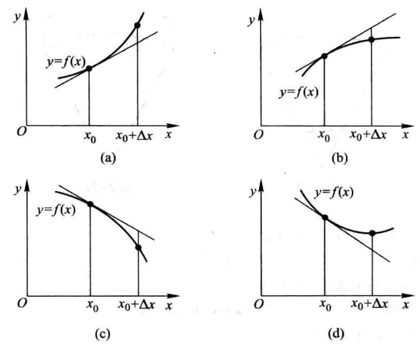
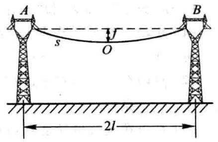
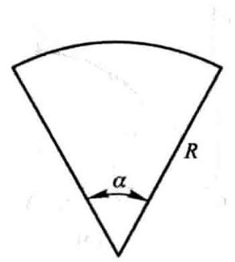
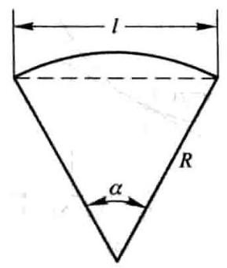
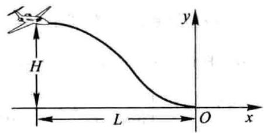
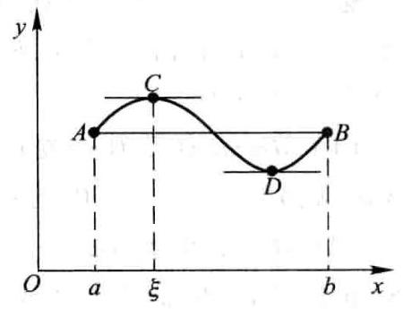
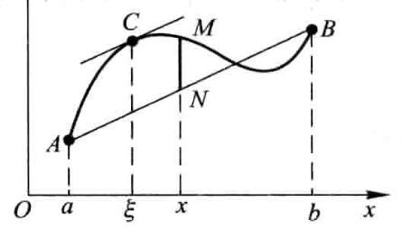

由于 $D$ 的绝对误差限为 ${\delta }_{D} = {0.05}\mathrm{\;{mm}}$ ,所以

$$
\left| {\Delta D}\right|  \leq  {\delta }_{D} = {0.05},
$$

而

$$
\left| {\Delta A}\right|  \approx  \left| {\mathrm{d}A}\right|  = \frac{\pi }{2}D \cdot  \left| {\Delta D}\right|  \leq  \frac{\pi }{2}D \cdot  {\delta }_{D},
$$

因此得出 $A$ 的绝对误差限约为

$$
{\delta }_{A} = \frac{\pi }{2}D \cdot  {\delta }_{D} = \frac{\pi }{2} \times  {60.03} \times  {0.05} \approx  {4.712}\left( {\mathrm{\;{mm}}}^{2}\right) ;
$$

$A$ 的相对误差限约为

$$
\frac{{\delta }_{A}}{A} = \frac{\frac{\pi }{2}D \cdot  {\delta }_{D}}{\frac{\pi }{4}{D}^{2}} = 2\frac{{\delta }_{D}}{D} = 2 \times  \frac{0.05}{60.03} \approx  {0.17}\% .
$$

一般地,根据直接测量的 $x$ 值按公式 $y = f\left( x\right)$ 计算 $y$ 值时,如果已知测量 $x$ 的绝对误差限是 ${\delta }_{x}$ ,即

$$
\left| {\Delta x}\right|  \leq  {\delta }_{x},
$$

那么,当 ${y}^{\prime } \neq  0$ 时, $y$ 的绝对误差

$$
\left| {\Delta y}\right|  \approx  \left| {\mathrm{d}y}\right|  = \left| {y}^{\prime }\right|  \cdot  \left| {\Delta x}\right|  \leq  \left| {y}^{\prime }\right|  \cdot  {\delta }_{x},
$$

即 $y$ 的绝对误差限约为

$$
{\delta }_{y} = \left| {y}^{\prime }\right|  \cdot  {\delta }_{x}; \tag{5-8}
$$

$y$ 的相对误差限约为

$$
\frac{{\delta }_{y}}{\left| y\right| } = \left| \frac{{y}^{\prime }}{y}\right|  \cdot  {\delta }_{x}. \tag{5-9}
$$

以后常把绝对误差限与相对误差限简称为绝对误差与相对误差.

## 习 题 2-5

1. 已知 $y = {x}^{3} - x$ ,计算在 $x = 2$ 处当 ${\Delta x}$ 分别等于1,0.1,0.01时的 ${\Delta y}$ 及 $\mathrm{d}y$ .

2. 设函数 $y = f\left( x\right)$ 的图形如图 2-12,试在图 2-12(a)、(b)、(c)、(d) 中分别标出在点 ${x}_{0}$ 的 $\mathrm{d}y\text{、}{\Delta y}$ 及 ${\Delta y} - \mathrm{d}y$ ,并说明其正负.

3. 求下列函数的微分:

(1) $y = \frac{1}{x} + 2\sqrt{x}$ ; (2) $y = x\sin {2x}$ ;

(3) $y = \frac{x}{\sqrt{{x}^{2} + 1}}$ ; (4) $y = {\ln }^{2}\left( {1 - x}\right)$ ;

图 2-12

(5) $y = {x}^{2}{\mathrm{e}}^{2x}$ ; (6) $y = {\mathrm{e}}^{-x}\cos \left( {3 - x}\right)$ ;

(7) $y = \arcsin \sqrt{1 - {x}^{2}}$ ; (8) $y = {\tan }^{2}\left( {1 + 2{x}^{2}}\right)$ ;

(9) $y = \arctan \frac{1 - {x}^{2}}{1 + {x}^{2}}$ ; (10) $s = A\sin \left( {{\omega t} + \varphi }\right) \left( {A\text{、}\omega \text{、}\varphi \text{是常数}}\right)$ .

4. 将适当的函数填入下列括号内, 使等式成立:

(1) $\mathrm{d}\left( \;\right)  = 2\mathrm{\;d}x$ ; (2) $\mathrm{d}\left( \;\right)  = {3x}\mathrm{\;d}x$ ;

(3) $\mathrm{d}\left( \;\right)  = \cos t\mathrm{\;d}t$ ; (4) $\mathrm{d}\left( \;\right)  = \sin {\omega x}\mathrm{\;d}x\left( {\omega  \neq  0}\right)$ ;

(5) $\mathrm{d}\left( \;\right)  = \frac{1}{1 + x}\mathrm{\;d}x$ ; (6) $\mathrm{d}\left( \;\right)  = {\mathrm{e}}^{-{2x}}\mathrm{\;d}x$ ;

(7) $\mathrm{d}\left( \;\right)  = \frac{1}{\sqrt{x}}\mathrm{\;d}x$ ; (8) $\mathrm{d}\left( \;\right)  = {\sec }^{2}{3x}\mathrm{\;d}x$ .

5. 如图 2-13 所示的电缆 $\overset{⏜}{AOB}$ 的长为 $s$ ,跨度为 ${2l}$ ,电缆的最低点 $O$ 与杆顶连线 ${AB}$ 的距离为 $f$ ,则电缆长可按下面公式计算

$$
s = {2l}\left( {1 + \frac{2{f}^{2}}{3{l}^{2}}}\right) ,
$$

图 2-13

当 $f$ 变化了 ${\Delta f}$ 时,电缆长的变化约为多少?

6. 设扇形的圆心角 $\alpha  = {60}^{ \circ  }$ ,半径 $R = {100}\mathrm{\;{cm}}$ (图 2-14). 如果 $R$ 不变, $\alpha$ 减少 ${30}^{\prime }$ ,问扇形面积大约改变了多少? 又如果 $\alpha$ 不变, $R$ 增加 $1\mathrm{\;{cm}}$ ,问扇形面积大约改变了多少?

图 2-14

图 2-15

7. 计算下列三角函数值的近似值:

(1) $\cos {29}^{ \circ  }$ ; (2) $\tan {136}^{ \circ  }$ .

8. 计算下列反三角函数值的近似值:

(1) arcsin ${0.500}/2$ ; (2) arccos 0.4995 .

9. 当 $\left| x\right|$ 较小时,证明下列近似公式:

(1) $\tan x \approx  x$ ( $x$ 是角的弧度值); (2) $\ln \left( {1 + x}\right)  \approx  x$ ;

(3) $\sqrt[n]{1 + x} \approx  1 + \frac{1}{n}x$ ； (4) ${\mathrm{e}}^{x} \approx  1 + x$ .

并计算 $\tan {45}^{\prime }$ 和 $\ln {1.002}$ 的近似值.

10. 计算下列各根式的近似值:

(1) $\sqrt[3]{996}$ ; (2) $\sqrt[6]{65}$ .

11. 计算球体体积时,要求精确度在 $2\%$ 以内. 问这时测量直径 $D$ 的相对误差不能超过多少?

12. 某厂生产如图 2-15 所示的扇形板,半径 $R = {200}\mathrm{\;{mm}}$ ,要求中心角 $\alpha$ 为 ${55}^{ \circ  }$ . 产品检验时,一般用测量弦长 $l$ 的办法来间接测量中心角 $\alpha$ . 如果测量弦长 $l$ 时的误差 ${\delta }_{l} = {0.1}\mathrm{\;{mm}}$ ,问由此而引起的中心角测量误差 ${\delta }_{\alpha }$ 是多少?

## 总习题二

1. 在 “充分” “必要” 和 “充分必要” 三者中选择一个正确的填入下列空格内:

(1) $f\left( x\right)$ 在点 ${x}_{0}$ 可导是 $f\left( x\right)$ 在点 ${x}_{0}$ 连续的_____条件. $f\left( x\right)$ 在点 ${x}_{0}$ 连续是 $f\left( x\right)$ 在点 ${x}_{0}$ 可导的_____条件.

(2) $f\left( x\right)$ 在点 ${x}_{0}$ 的左导数 ${f}^{\prime }\left( {x}_{0}\right)$ 及右导数 ${f}^{\prime }\left( {x}_{0}\right)$ 都存在且相等是 $f\left( x\right)$ 在点 ${x}_{0}$ 可导的 _____条件.

(3) $f\left( x\right)$ 在点 ${x}_{0}$ 可导是 $f\left( x\right)$ 在点 ${x}_{0}$ 可微的_____条件.

2. 设 $f\left( x\right)  = x\left( {x + 1}\right) \left( {x + 2}\right) \cdots \left( {x + n}\right) \left( {n \geq  2}\right)$ ,则 ${f}^{\prime }\left( 0\right)  =$ _____.

3. 下述题中给出了四个结论, 从中选出一个正确的结论:

设 $f\left( x\right)$ 在 $x = a$ 的某个邻域内有定义,则 $f\left( x\right)$ 在 $x = a$ 处可导的一个充分条件是

(   ).

(A) $\mathop{\lim }\limits_{{h \rightarrow   + \infty }}h\left\lbrack  {f\left( {a + \frac{1}{h}}\right)  - f\left( a\right) }\right\rbrack$ 存在.

(B) $\mathop{\lim }\limits_{{h \rightarrow  0}}\frac{f\left( {a + {2h}}\right)  - f\left( {a + h}\right) }{h}$ 存在.

(C) $\mathop{\lim }\limits_{{h \rightarrow  0}}\frac{f\left( {a + h}\right)  - f\left( {a - h}\right) }{2h}$ 存在.

(D) $\mathop{\lim }\limits_{{h \rightarrow  0}}\frac{f\left( a\right)  - f\left( {a - h}\right) }{h}$ 存在.

4. 设有一根细棒,取棒的一端作为原点,棒上任意点的坐标为 $x$ ,于是分布在区间 $\left\lbrack  {0, x}\right\rbrack$ 上细棒的质量 $m$ 与 $x$ 存在函数关系 $m = m\left( x\right)$ . 应怎样确定细棒在点 ${x}_{0}$ 处的线密度 (对于均匀细棒来说, 单位长度细棒的质量叫做这细棒的线密度)?

5. 根据导数的定义,求 $f\left( x\right)  = \frac{1}{x}$ 的导数.

6. 求下列函数 $f\left( x\right)$ 的 ${f}_{ - }^{\prime }\left( 0\right)$ 及 ${f}_{ + }^{\prime }\left( 0\right)$ ,又 ${f}^{\prime }\left( 0\right)$ 是否存在:

(1) $f\left( x\right)  = \left\{  \begin{array}{ll} \sin x, & x < 0, \\  \ln \left( {1 + x}\right) , & x \geq  0; \end{array}\right.$

(2) $f\left( x\right)  = \left\{  \begin{array}{ll} \frac{x}{1 + {\mathrm{e}}^{\frac{1}{x}}}, & x \neq  0, \\  0, & x = 0. \end{array}\right.$

7. 讨论函数

$$
f\left( x\right)  = \left\{  \begin{array}{ll} x\sin \frac{1}{x}, & x \neq  0, \\  0, & x = 0 \end{array}\right.
$$

在 $x = 0$ 处的连续性与可导性.

8. 求下列函数的导数:

(1) $y = \arcsin \left( {\sin x}\right)$ ; (2) $y = \arctan \frac{1 + x}{1 - x}$ ;

(3) $y = \ln \tan \frac{x}{2} - \cos x \cdot  \ln \tan x$ ; (4) $y = \ln \left( {{\mathrm{e}}^{x} + \sqrt{1 + {\mathrm{e}}^{2x}}}\right)$ ;

(5) $y = {x}^{\frac{1}{x}}\left( {x > 0}\right)$ .

9. 求下列函数的二阶导数:

(1) $y = {\cos }^{2}x \cdot  \ln x$ ; (2) $y = \frac{x}{\sqrt{1 - {x}^{2}}}$ .

*10. 求下列函数的 $n$ 阶导数:

(1) $y = \sqrt[m]{1 + x}$ ; (2) $y = \frac{1 - x}{1 + x}$ .

11. 设函数 $y = y\left( x\right)$ 由方程 ${\mathrm{e}}^{y} + {xy} = \mathrm{e}$ 所确定,求 ${y}^{\prime \prime }\left( 0\right)$ .

12. 求下列由参数方程所确定的函数的一阶导数 $\frac{\mathrm{d}y}{\mathrm{\;d}x}$ 及二阶导数 $\frac{{\mathrm{d}}^{2}y}{\mathrm{\;d}{x}^{2}}$ :

(1) $\left\{  \begin{array}{l} x = a{\cos }^{3}\theta , \\  y = a{\sin }^{3}\theta ; \end{array}\right.$ (2) $\left\{  \begin{array}{l} x = \ln \sqrt{1 + {t}^{2}}, \\  y = \arctan t. \end{array}\right.$

13. 求曲线 $\left\{  \begin{array}{l} x = 2{\mathrm{e}}^{t}, \\  y = {\mathrm{e}}^{-t} \end{array}\right.$ 在 $t = 0$ 相应的点处的切线方程及法线方程.

14. 已知 $f\left( x\right)$ 是周期为 5 的连续函数,它在 $x = 0$ 的某个邻域内满足关系式

$$
f\left( {1 + \sin x}\right)  - {3f}\left( {1 - \sin x}\right)  = {8x} + o\left( x\right) ,
$$

且 $f\left( x\right)$ 在 $x = 1$ 处可导,求曲线 $y = f\left( x\right)$ 在点 $\left( {6, f\left( 6\right) }\right)$ 处的切线方程.

15. 当正在高度 $H$ 水平飞行的飞机开始向机场跑道下降时,如图 2-16 所示从飞机到机场的水平地面距离为 $L$ . 假设飞机下降的路径为三次函数 $y = a{x}^{3} + b{x}^{2} + {cx} + d$ 的图形,其中 ${\left. y\right| }_{x =  - L} = H,{\left. y\right| }_{x = 0} = 0$ . 试确定飞机的降落路径.

图 2-16

16. 甲船以 $6\mathrm{\;{km}}/\mathrm{h}$ 的速率向东行驶,乙船以 $8\mathrm{\;{km}}/\mathrm{h}$ 的速率向南行驶. 在中午十二点整, 乙船位于甲船之北 ${16}\mathrm{\;{km}}$ 处. 问下午一点整两船相离的速率为多少?

17. 利用函数的微分代替函数的增量求 $\sqrt[3]{1.02}$ 的近似值.

18. 已知单摆的振动周期 $T = {2\pi }\sqrt{\frac{l}{g}}$ ,其中 $g = {980}\mathrm{\;{cm}}/{\mathrm{s}}^{2}, l$ 为摆长 (单位为 $\mathrm{{cm}}$ ). 设原摆长为 ${20}\mathrm{\;{cm}}$ ,为使周期 $T$ 增大 ${0.05}\mathrm{\;s}$ ,摆长约需加长多少?

## 第三章 微分中值定理与导数的应用

上一章里, 从分析实际问题中因变量相对于自变量的变化快慢出发, 引进了导数概念, 并讨论了导数的计算方法. 本章中, 我们将应用导数来研究函数以及曲线的某些性态, 并利用这些知识解决一些实际问题. 为此, 先要介绍微分学的几个中值定理, 它们是导数应用的理论基础.

## 第一节 微分中值定理

我们先讲罗尔 (Rolle) 定理, 然后根据它推出拉格朗日 (Lagrange) 中值定理和柯西 (Cauchy) 中值定理.

## 一、罗尔定理

首先,我们观察图 3-1. 设曲线弧 $\overset{⏜}{AB}$ 是函数 $y = f\left( x\right) \left( {x \in  \left\lbrack  {a, b}\right\rbrack  }\right)$ 的图形. 这是一条连续的曲线弧, 除端点外处处有不垂直于 $x$ 轴的切线,且两个端点的纵坐标相等,即 $f\left( a\right)  = f\left( b\right)$ . 可以发现在曲线弧的最高点 $C$ 处或最低点 $D$ 处,曲线有水平的切线. 如果记点 $C$ 的横坐标为 $\xi$ ,那么就有 ${f}^{\prime }\left( \xi \right)  = 0$ . 现在用分析语言把这个几何现象描述出来, 就可得下面的罗尔定理. 为了应用方便, 先介绍费马 (Fermat) 引理.

图 3-1

费马引理 设函数 $f\left( x\right)$ 在点 ${x}_{0}$ 的某邻域 $U\left( {x}_{0}\right)$ 内有定义,并且在 ${x}_{0}$ 处可导, 如果对任意的 $x \in  U\left( {x}_{0}\right)$ ,有

$$
\left. {f\left( x\right)  \leq  f\left( {x}_{0}\right) \;\text{ (或 }f\left( x\right)  \geq  f\left( {x}_{0}\right) }\right) ,
$$

那么 ${f}^{\prime }\left( {x}_{0}\right)  = 0$ .

证 不妨设 $x \in  U\left( {x}_{0}\right)$ 时, $f\left( x\right)  \leq  f\left( {x}_{0}\right)$ (如果 $f\left( x\right)  \geq  f\left( {x}_{0}\right)$ ,可以类似地证明). 于是,对于 ${x}_{0} + {\Delta x} \in  U\left( {x}_{0}\right)$ ,有

$$
f\left( {{x}_{0} + {\Delta x}}\right)  \leq  f\left( {x}_{0}\right) ,
$$

从而当 ${\Delta x} > 0$ 时,

$$
\frac{f\left( {{x}_{0} + {\Delta x}}\right)  - f\left( {x}_{0}\right) }{\Delta x} \leq  0;
$$

当 ${\Delta x} < 0$ 时,

$$
\frac{f\left( {{x}_{0} + {\Delta x}}\right)  - f\left( {x}_{0}\right) }{\Delta x} \geq  0.
$$

根据函数 $f\left( x\right)$ 在 ${x}_{0}$ 可导的条件及极限的保号性,便得到

$$
{f}^{\prime }\left( {x}_{0}\right)  = {f}_{ + }^{\prime }\left( {x}_{0}\right)  = \mathop{\lim }\limits_{{{\Delta x} \rightarrow  {0}^{ + }}}\frac{f\left( {{x}_{0} + {\Delta x}}\right)  - f\left( {x}_{0}\right) }{\Delta x} \leq  0,
$$

$$
{f}^{\prime }\left( {x}_{0}\right)  = {f}_{ - }^{\prime }\left( {x}_{0}\right)  = \mathop{\lim }\limits_{{{\Delta x} \rightarrow  {0}^{ - }}}\frac{f\left( {{x}_{0} + {\Delta x}}\right)  - f\left( {x}_{0}\right) }{\Delta x} \geq  0.
$$

所以, ${f}^{\prime }\left( {x}_{0}\right)  = 0$ . 证毕.

通常称导数等于零的点为函数的驻点 (或稳定点, 临界点).

罗尔定理 如果函数 $f\left( x\right)$ 满足

(1)在闭区间 $\left\lbrack  {a, b}\right\rbrack$ 上连续；

(2)在开区间(a, b)内可导；

(3)在区间端点处的函数值相等,即 $f\left( a\right)  = f\left( b\right)$ ,

那么在(a, b)内至少有一点 $\xi \left( {a < \xi  < b}\right)$ ,使得 ${f}^{\prime }\left( \xi \right)  = 0$ .

证 由于 $f\left( x\right)$ 在闭区间 $\left\lbrack  {a, b}\right\rbrack$ 上连续,根据闭区间上连续函数的最大值最小值定理, $f\left( x\right)$ 在闭区间 $\left\lbrack  {a, b}\right\rbrack$ 上必定取得它的最大值 $M$ 和最小值 $m$ . 这样,只有两种可能情形:

(1) $M = m$ . 这时 $f\left( x\right)$ 在区间 $\left\lbrack  {a, b}\right\rbrack$ 上必然取相同的数值 $M : f\left( x\right)  = M$ . 由此, $\forall x \in  \left( {a, b}\right)$ ,有 ${f}^{\prime }\left( x\right)  = 0$ . 因此,任取 $\xi  \in  \left( {a, b}\right)$ ,有 ${f}^{\prime }\left( \xi \right)  = 0$ .

(2) $M > m$ . 因为 $f\left( a\right)  = f\left( b\right)$ ,所以 $M$ 和 $m$ 这两个数中至少有一个不等于 $f\left( x\right)$ 在区间 $\left\lbrack  {a, b}\right\rbrack$ 的端点处的函数值. 为确定起见,不妨设 $M \neq  f\left( a\right)$ (如果设 $m \neq$ $f\left( a\right)$ ,证法完全类似),那么必定在开区间(a, b)内有一点 $\xi$ 使 $f\left( \xi \right)  = M$ . 因此, $\forall x \in  \left\lbrack  {a, b}\right\rbrack$ ,有 $f\left( x\right)  \leq  f\left( \xi \right)$ ,从而由费马引理可知 ${f}^{\prime }\left( \xi \right)  = 0$ .

定理证毕.

## 二、拉格朗日中值定理

罗尔定理中 $f\left( a\right)  = f\left( b\right)$ 这个条件是相当特殊的,它使罗尔定理的应用受到限制. 如果把 $f\left( a\right)  = f\left( b\right)$ 这个条件取消,但仍保留其余两个条件,并相应地改变结论, 那么就得到微分学中十分重要的拉格朗日中值定理.

拉格朗日中值定理 如果函数 $f\left( x\right)$ 满足

(1)在闭区间 $\left\lbrack  {a, b}\right\rbrack$ 上连续；

(2)在开区间(a, b)内可导,

那么在(a, b)内至少有一点 $\xi \left( {a < \xi  < b}\right)$ ,使等式

$$
f\left( b\right)  - f\left( a\right)  = {f}^{\prime }\left( \xi \right) \left( {b - a}\right)  \tag{1-1}
$$

成立.

在证明之前,先看一下定理的几何意义. 如 $y$ . 果把(1 - 1)式改写成

$$
\frac{f\left( b\right)  - f\left( a\right) }{b - a} = {f}^{\prime }\left( \xi \right) ,
$$

图 3-2

由图 3-2 可看出, $\frac{f\left( b\right)  - f\left( a\right) }{b - a}$ 为弦 ${AB}$ 的斜率,而 ${f}^{\prime }\left( \xi \right)$ 为曲线在点 $C$ 处的切线的斜率. 因此拉格朗日中值定理的几何意义是: 如果连续曲线 $y =$ $f\left( x\right)$ 的弧 $\overset{⏜}{AB}$ 上除端点外处处具有不垂直于 $x$ 轴的切线,那么这弧上至少有一点 $C$ ,使曲线在点 $C$ 处的切线平行于弦 ${AB}$ .

从图 3-1 看出,在罗尔定理中,由于 $f\left( a\right)  = f\left( b\right)$ ,弦 ${AB}$ 是平行于 $x$ 轴的,因此点 $C$ 处的切线实际上也平行于弦 ${AB}$ . 由此可见,罗尔定理是拉格朗日中值定理的特殊情形.

从上述拉格朗日中值定理与罗尔定理的关系, 自然想到利用罗尔定理来证明拉格朗日中值定理. 但在拉格朗日中值定理中,函数 $f\left( x\right)$ 不一定具备 $f\left( a\right)  =$ $f\left( b\right)$ 这个条件,为此我们设想构造一个与 $f\left( x\right)$ 有密切联系的函数 $\varphi \left( x\right)$ (称为辅助函数),使 $\varphi \left( x\right)$ 满足条件 $\varphi \left( a\right)  = \varphi \left( b\right)$ . 然后对 $\varphi \left( x\right)$ 应用罗尔定理,再把对 $\varphi \left( x\right)$ 所得的结论转化到 $f\left( x\right)$ 上,证得所要的结果. 我们从拉格朗日中值定理的几何解释中来寻找辅助函数,从图 3-2 中看到,有向线段 ${NM}$ 的值是 $x$ 的函数, 把它表示为 $\varphi \left( x\right)$ ,它与 $f\left( x\right)$ 有密切的联系,且当 $x = a$ 及 $x = b$ 时,点 $M$ 与点 $N$ 重合,即有 $\varphi \left( a\right)  = \varphi \left( b\right)  = 0$ . 为求得函数 $\varphi \left( x\right)$ 的表达式,设直线 ${AB}$ 的方程为 $y = L\left( x\right)$ ,则

$$
L\left( x\right)  = f\left( a\right)  + \frac{f\left( b\right)  - f\left( a\right) }{b - a}\left( {x - a}\right) ,
$$

由于点 $M\text{、}N$ 的纵坐标依次为 $f\left( x\right)$ 及 $L\left( x\right)$ ,故表示有向线段 ${NM}$ 的值的函数

$$
\varphi \left( x\right)  = f\left( x\right)  - L\left( x\right)  = f\left( x\right)  - f\left( a\right)  - \frac{f\left( b\right)  - f\left( a\right) }{b - a}\left( {x - a}\right) .
$$

下面就利用这个辅助函数来证明拉格朗日中值定理.

定理的证明 引进辅助函数

$$
\varphi \left( x\right)  = f\left( x\right)  - f\left( a\right)  - \frac{f\left( b\right)  - f\left( a\right) }{b - a}\left( {x - a}\right) .
$$

容易验证函数 $\varphi \left( x\right)$ 适合罗尔定理的条件: $\varphi \left( a\right)  = \varphi \left( b\right)  = 0,\varphi \left( x\right)$ 在闭区间 $\left\lbrack  {a, b}\right\rbrack$ 上连续,在开区间(a, b)内可导,且

$$
{\varphi }^{\prime }\left( x\right)  = {f}^{\prime }\left( x\right)  - \frac{f\left( b\right)  - f\left( a\right) }{b - a}. \tag{-}
$$

根据罗尔定理,可知在(a, b)内至少有一点 $\xi$ ,使 ${\varphi }^{\prime }\left( \xi \right)  = 0$ ,即

5.2

$$
{f}^{\prime }\left( \xi \right)  - \frac{f\left( b\right)  - f\left( a\right) }{b - a} = 0.
$$

由此得

$$
\frac{f\left( b\right)  - f\left( a\right) }{b - a} = {f}^{\prime }\left( \xi \right) ,
$$

即

$$
f\left( b\right)  - f\left( a\right)  = {f}^{\prime }\left( \xi \right) \left( {b - a}\right) .
$$

定理证毕.

显然,公式(1 - 1)对于 $b < a$ 也成立.(1 - 1)式叫做拉格朗日中值公式.

设 $x$ 为区间 $\left\lbrack  {a, b}\right\rbrack$ 内一点, $x + {\Delta x}$ 为这区间内的另一点 $\left( {{\Delta x} > 0\text{或}{\Delta x} < 0}\right)$ ,则公式 (1-1) 在区间 $\left\lbrack  {x, x + {\Delta x}}\right\rbrack$ (当 ${\Delta x} > 0$ 时) 或在区间 $\left\lbrack  {x + {\Delta x}, x}\right\rbrack$ (当 ${\Delta x} < 0$ 时) 上就成为

$$
f\left( {x + {\Delta x}}\right)  - f\left( x\right)  = {f}^{\prime }\left( {x + {\theta \Delta x}}\right)  \cdot  {\Delta x}\;\left( {0 < \theta  < 1}\right) . \tag{1-2}
$$

这里数值 $\theta$ 在 0 与 1 之间,所以 $x + {\theta \Delta x}$ 是在 $x$ 与 $x + {\Delta x}$ 之间.

如果记 $f\left( x\right)$ 为 $y$ ,那么(1 - 2)式又可写成

$$
{\Delta y} = {f}^{\prime }\left( {x + {\theta \Delta x}}\right)  \cdot  {\Delta x}\;\left( {0 < \theta  < 1}\right) . \tag{1-3}
$$

我们知道,函数的微分 $\mathrm{d}y = {f}^{\prime }\left( x\right)  \cdot  {\Delta x}$ 是函数的增量 ${\Delta y}$ 的近似表达式,一般说来,以 $\mathrm{d}y$ 近似代替 ${\Delta y}$ 时所产生的误差只有当 ${\Delta x} \rightarrow  0$ 时才趋于零; 而 (1-3) 式却给出了自变量取得有限增量 ${\Delta x}$ ( $\left| {\Delta x}\right|$ 不一定很小) 时,函数增量 ${\Delta y}$ 的准确表达式. 因此, 这个定理也叫做有限增量定理, (1-3) 式称为有限增量公式. 拉格朗日中值定理在微分学中占有重要地位, 有时也称这定理为微分中值定理. 在某些问题中当自变量 $x$ 取得有限增量 ${\Delta x}$ 而需要函数增量的准确表达式时,拉格朗日中值定理就显出它的价值.

作为拉格朗日中值定理的一个应用, 我们来导出以后讲积分学时很有用的一个定理. 我们知道,如果函数 $f\left( x\right)$ 在某一区间上是一个常数,那么 $f\left( x\right)$ 在该区间上的导数恒为零. 它的逆命题也是成立的, 这就是:

定理 如果函数 $f\left( x\right)$ 在区间 $I$ 上连续, $I$ 内 ① 可导且导数恒为零,那么 $f\left( x\right)$ 在区间 $I$ 上是一个常数.

证 在区间 $I$ 上任取两点 ${x}_{1}\text{、}{x}_{2}\left( {{x}_{1} < {x}_{2}}\right)$ ,应用(1 - 1)式就得

$$
f\left( {x}_{2}\right)  - f\left( {x}_{1}\right)  = {f}^{\prime }\left( \xi \right) \left( {{x}_{2} - {x}_{1}}\right) \left( {{x}_{1} < \xi  < {x}_{2}}\right) .
$$

由假定, ${f}^{\prime }\left( \xi \right)  = 0$ ,所以 $f\left( {x}_{2}\right)  - f\left( {x}_{1}\right)  = 0$ ,即

$$
f\left( {x}_{2}\right)  = f\left( {x}_{1}\right) .
$$

因为 ${x}_{1}\text{、}{x}_{2}$ 是 $I$ 上任意两点,所以上面的等式表明: $f\left( x\right)$ 在 $I$ 上的函数值总是相等的,这就是说, $f\left( x\right)$ 在区间 $I$ 上是一个常数.

从上述论证中可以看出,虽然拉格朗日中值定理中的 $\xi$ 的准确数值不知道, 但在这里并不妨碍它的应用.

例 证明当 $x > 0$ 时,

$$
\frac{x}{1 + x} < \ln \left( {1 + x}\right)  < x
$$

证 设 $f\left( t\right)  = \ln \left( {1 + t}\right)$ ,显然 $f\left( t\right)$ 在区间 $\left\lbrack  {0, x}\right\rbrack$ 上满足拉格朗日中值定理的条件, 根据定理, 应有

$$
f\left( x\right)  - f\left( 0\right)  = {f}^{\prime }\left( \xi \right) \left( {x - 0}\right) ,0 < \xi  < x.
$$

由于 $f\left( 0\right)  = 0,{f}^{\prime }\left( t\right)  = \frac{1}{1 + t}$ ,因此上式即为

$$
\ln \left( {1 + x}\right)  = \frac{x}{1 + \xi }.
$$

又由 $0 < \xi  < x$ ,有

$$
\frac{x}{1 + x} < \frac{x}{1 + \xi } < x
$$

即

$$
\frac{x}{1 + x} < \ln \left( {1 + x}\right)  < x\left( {x > 0}\right) .
$$

## 三、柯西中值定理

上面已经指出,如果连续曲线弧 $\overset{⏜}{AB}$ 上除端点外处处具有不垂直于横轴的切线,那么这段弧上至少有一点 $C$ ,使曲线在点 $C$ 处的切线平行于弦 ${AB}$ . 设 $\overset{⏜}{AB}$ 由参数方程

---

① $x$ 在区间 $I$ 内指 $x \in  I$ ,且 $x$ 不是 $I$ 的端点.

---