## 第一章 函数与极限

初等数学的研究对象基本上是不变的量, 而高等数学的研究对象则是变动的量. 所谓函数关系就是变量之间的依赖关系, 极限方法是研究变量的一种基本方法. 本章将介绍映射、函数、极限和函数的连续性等基本概念以及它们的一些性质.

## 第一节 映射与函数

映射是现代数学中的一个基本概念, 而函数是微积分的研究对象, 也是映射的一种. 本节主要介绍映射、函数及有关概念, 函数的性质与运算等.

## 一、映射

## 1. 映射概念

定义 设 $X\text{、}Y$ 是两个非空集合,如果存在一个法则 $f$ ,使得对 $X$ 中每个元素 $x$ ,按法则 $f$ ,在 $Y$ 中有唯一确定的元素 $y$ 与之对应,那么称 $f$ 为从 $X$ 到 $Y$ 的映射, 记作

$$
f : X \rightarrow  Y,
$$

其中 $y$ 称为元素 $x$ (在映射 $f$ 下) 的像,并记作 $f\left( x\right)$ ,即

$$
y = f\left( x\right) ,
$$

而元素 $x$ 称为元素 $y$ (在映射 $f$ 下) 的一个原像; 集合 $X$ 称为映射 $f$ 的定义域,记作 ${D}_{f}$ ,即 ${D}_{f} = X;X$ 中所有元素的像所组成的集合称为映射 $f$ 的值域,记作 ${R}_{f}$ 或 $f\left( X\right)$ ,即

$$
{R}_{f} = f\left( X\right)  = \{ f\left( x\right)  \mid  x \in  X\} .
$$

从上述映射的定义中, 需要注意的是:

(1)构成一个映射必须具备以下三个要素: 集合 $X$ ,即定义域 ${D}_{f} = X$ ; 集合 $Y$ ,即值域的范围: ${R}_{f} \subset  Y$ ; 对应法则 $f$ ,使对每个 $x \in  X$ ,有唯一确定的 $y =$ $f\left( x\right)$ 与之对应.

(2)对每个 $x \in  X$ ,元素 $x$ 的像 $y$ 是唯一的; 而对每个 $y \in  {R}_{f}$ ,元素 $y$ 的原像不一定是唯一的; 映射 $f$ 的值域 ${R}_{f}$ 是 $Y$ 的一个子集,即 ${R}_{f} \subset  Y$ ,不一定 ${R}_{f} = Y$ .

例 1 设 $f : \mathbf{R} \rightarrow  \mathbf{R}$ ,对每个 $x \in  \mathbf{R}, f\left( x\right)  = {x}^{2}$ . 显然, $f$ 是一个映射, $f$ 的定义域 ${D}_{f}$ $= \mathbf{R}$ ,值域 ${R}_{f} = \{ y \mid  y \geq  0\}$ ,它是 $\mathbf{R}$ 的一个真子集. 对于 ${R}_{f}$ 中的元素 $y$ ,除 $y = 0$ 外,它的原像不是唯一的. 如 $y = 4$ 的原像就有 $x = 2$ 和 $x =  - 2$ 两个.

例 2 设 $X = \left\{  {\left( {x, y}\right)  \mid  {x}^{2} + {y}^{2} = 1}\right\}  , Y = \{ \left( {x,0}\right) \left| \right| x \mid   \leq  1\} , f : X \rightarrow  Y$ ,对每个(x, y) $\in  X$ ,有唯一确定的 $\left( {x,0}\right)  \in  Y$ 与之对应. 显然 $f$ 是一个映射, $f$ 的定义域 ${D}_{f} = X$ ,值域 ${R}_{f} = Y$ . 在几何上,这个映射表示将平面上一个圆心在原点的单位圆周上的点投影到 $x$ 轴的区间 $\left\lbrack  {-1,1}\right\rbrack$ 上.

例 3 设 $f : \left\lbrack  {-\frac{\pi }{2},\frac{\pi }{2}}\right\rbrack   \rightarrow  \left\lbrack  {-1,1}\right\rbrack$ ,对每个 $x \in  \left\lbrack  {-\frac{\pi }{2},\frac{\pi }{2}}\right\rbrack  , f\left( x\right)  = \sin x.f$ 是一个映射,其定义域 ${D}_{f} = \left\lbrack  {-\frac{\pi }{2},\frac{\pi }{2}}\right\rbrack$ ,值域 ${R}_{f} = \left\lbrack  {-1,1}\right\rbrack$ .

设 $f$ 是从集合 $X$ 到集合 $Y$ 的映射,若 ${R}_{f} = Y$ ,即 $Y$ 中任一元素 $y$ 都是 $X$ 中某元素的像,则称 $f$ 为 $X$ 到 $Y$ 上的映射或满射; 若对 $X$ 中任意两个不同元素 ${x}_{1} \neq$ ${x}_{2}$ ,它们的像 $f\left( {x}_{1}\right)  \neq  f\left( {x}_{2}\right)$ ,则称 $f$ 为 $X$ 到 $Y$ 的单射; 若映射 $f$ 既是单射,又是满射,则称 $f$ 为一一映射 (或双射).

上面例 1 中的映射, 既非单射, 又非满射; 例 2 中的映射不是单射, 是满射; 例 3 中的映射, 既是单射, 又是满射, 因此是一一映射.

映射又称为算子. 根据集合 $X\text{、}Y$ 的不同情形,在不同的数学分支中,映射又有不同的惯用名称. 例如,从非空集 $X$ 到数集 $Y$ 的映射又称为 $X$ 上的泛函,从非空集 $X$ 到它自身的映射又称为 $X$ 上的变换,从实数集 (或其子集) $X$ 到实数集 $Y$ 的映射通常称为定义在 $X$ 上的函数.

## 2. 逆映射与复合映射

设 $f$ 是 $X$ 到 $Y$ 的单射,则由定义,对每个 $y \in  {R}_{f}$ ,有唯一的 $x \in  X$ ,适合 $f\left( x\right)  = y$ . 于是,我们可定义一个从 ${R}_{f}$ 到 $X$ 的新映射 $g$ ,即

$$
g : {R}_{f} \rightarrow  X,
$$

对每个 $y \in  {R}_{f}$ ,规定 $g\left( y\right)  = x$ ,这 $x$ 满足 $f\left( x\right)  = y$ . 这个映射 $g$ 称为 $f$ 的逆映射,记作 ${f}^{-1}$ , 其定义域 ${D}_{{f}^{-1}} = {R}_{f}$ ,值域 ${R}_{{f}^{-1}} = X$ .

按上述定义, 只有单射才存在逆映射. 所以, 在例 1 、例 2 、例 3 中, 只有例 3 中的映射 $f$ 才存在逆映射 ${f}^{-1}$ ,这个 ${f}^{-1}$ 就是反正弦函数的主值

$$
{f}^{-1}\left( x\right)  = \arcsin x, x \in  \left\lbrack  {-1,1}\right\rbrack  ,
$$

其定义域 ${D}_{{f}^{-1}} = \left\lbrack  {-1,1}\right\rbrack$ ,值域 ${R}_{{f}^{-1}} = \left\lbrack  {-\frac{\pi }{2},\frac{\pi }{2}}\right\rbrack$ .

设有两个映射

$$
g : X \rightarrow  {Y}_{1},\;f : {Y}_{2} \rightarrow  Z,
$$

其中 ${Y}_{1} \subset  {Y}_{2}$ ,则由映射 $g$ 和 $f$ 可以定出一个从 $X$ 到 $Z$ 的对应法则,它将每个 $x \in  X$ 映成 $f\left\lbrack  {g\left( x\right) }\right\rbrack   \in  Z$ . 显然,这个对应法则确定了一个从 $X$ 到 $Z$ 的映射,这个映射称为映射 $g$ 和 $f$ 构成的复合映射,记作 $f \circ  g$ ,即

$$
f \circ  g : X \rightarrow  Z,\left( {f \circ  g}\right) \left( x\right)  = f\left\lbrack  {g\left( x\right) }\right\rbrack  , x \in  X.
$$

由复合映射的定义可知,映射 $g$ 和 $f$ 构成复合映射的条件是: $g$ 的值域 ${R}_{g}$ 必须包含在 $f$ 的定义域内,即 ${R}_{g} \subset  {D}_{f}$ . 否则,不能构成复合映射. 由此可以知道,映射 $g$ 和 $f$ 的复合是有顺序的, $f \circ  g$ 有意义并不表示 $g \circ  f$ 也有意义. 即使 $f \circ  g$ 与 $g \circ  f$ 都有意义,复合映射 $f \circ  g$ 与 $g \circ  f$ 也未必相同.

例 4 设有映射 $g : \mathbf{R} \rightarrow  \left\lbrack  {-1,1}\right\rbrack$ ,对每个 $x \in  \mathbf{R}, g\left( x\right)  = \sin x$ ,映射 $f : \left\lbrack  {-1,1}\right\rbrack   \rightarrow$ $\left\lbrack  {0,1}\right\rbrack$ ,对每个 $u \in  \left\lbrack  {-1,1}\right\rbrack  , f\left( u\right)  = \sqrt{1 - {u}^{2}}$ ,则映射 $g$ 和 $f$ 构成的复合映射 $f \circ  g : \mathbf{R} \rightarrow  \left\lbrack  {0,1}\right\rbrack$ ,对每个 $x \in  \mathbf{R}$ ,有

$$
\left( {f \circ  g}\right) \left( x\right)  = f\left\lbrack  {g\left( x\right) }\right\rbrack   = f\left( {\sin x}\right)  = \sqrt{1 - {\sin }^{2}x} = \left| {\cos x}\right| .
$$

## 二、函数

## 1. 函数的概念

定义 设数集 $D \subset  \mathbf{R}$ ,则称映射 $f : D \rightarrow  \mathbf{R}$ 为定义在 $D$ 上的函数,通常简记为

$$
y = f\left( x\right) , x \in  D,
$$

其中 $x$ 称为自变量, $y$ 称为因变量, $D$ 称为定义域,记作 ${D}_{f}$ ,即 ${D}_{f} = D$ .

函数的定义中,对每个 $x \in  D$ ,按对应法则 $f$ ,总有唯一确定的值 $y$ 与之对应, 这个值称为函数 $f$ 在 $x$ 处的函数值,记作 $f\left( x\right)$ ,即 $y = f\left( x\right)$ . 因变量 $y$ 与自变量 $x$ 之间的这种依赖关系,通常称为函数关系. 函数值 $f\left( x\right)$ 的全体所构成的集合称为函数 $f$ 的值域,记作 ${R}_{f}$ 或 $f\left( D\right)$ ,即

$$
{R}_{f} = f\left( D\right)  = \{ y \mid  y = f\left( x\right) , x \in  D\} .
$$

需要指出,按照上述定义,记号 $f$ 和 $f\left( x\right)$ 的含义是有区别的: 前者表示自变量 $x$ 和因变量 $y$ 之间的对应法则,而后者表示与自变量 $x$ 对应的函数值. 但为了叙述方便,习惯上常用记号 “ $f\left( x\right) , x \in  D$ ” 或 “ $y = f\left( x\right) , x \in  D$ ” 来表示定义在 $D$ 上的函数,这时应理解为由它所确定的函数 $f$ .

表示函数的记号是可以任意选取的,除了常用的 $f$ 外,还可用其他的英文字母或希腊字母,如 “ $g$ ” “ $F$ ” “ $\varphi$ ” 等. 相应地,函数可记作 $y = g\left( x\right) , y =$ $F\left( x\right) , y = \varphi \left( x\right)$ 等. 有时还直接用因变量的记号来表示函数,即把函数记作 $y =$ $y\left( x\right)$ . 但在同一个问题中,讨论到几个不同的函数时,为了表示区别,需用不同的记号来表示它们.

函数是从实数集到实数集的映射,其值域总在 $\mathbf{R}$ 内,因此构成函数的要素是: 定义域 ${D}_{f}$ 及对应法则 $f$ . 如果两个函数的定义域相同,对应法则也相同,那么这两个函数就是相同的, 否则就是不同的.

函数的定义域通常按以下两种情形来确定:一种是对有实际背景的函数, 根据实际背景中变量的实际意义确定. 例如, 在自由落体运动中, 设物体下落的时间为 $t$ ,下落的距离为 $s$ ,开始下落的时刻 $t = 0$ ,落地的时刻 $t = T$ ,则 $s$ 与 $t$ 之间的函数关系是

$$
s = \frac{1}{2}g{t}^{2}, t \in  \left\lbrack  {0, T}\right\rbrack  .
$$

这个函数的定义域就是区间 $\left\lbrack  {0, T}\right\rbrack$ ; 另一种是抽象地用算式表达的函数,通常约定这种函数的定义域是使得算式有意义的一切实数组成的集合, 这种定义域称为函数的自然定义域. 在这种约定之下,一般的用算式表达的函数可用 “ $y =$ $f\left( x\right)$ ”表达,而不必再表出 ${D}_{f}$ . 例如,函数 $y = \sqrt{1 - {x}^{2}}$ 的定义域是闭区间 $\left\lbrack  {-1,1}\right\rbrack$ ,函数 $y = \frac{1}{\sqrt{1 - {x}^{2}}}$ 的定义域是开区间(-1,1).

表示函数的主要方法有三种:表格法、图形法、解析法(公式法),这在中学里大家已经熟悉. 其中, 用图形法表示函数是基于函数图形的概念, 即坐标平面上的点集

$$
\{ P\left( {x, y}\right)  \mid  y = f\left( x\right) , x \in  D\}
$$

称为函数 $y = f\left( x\right) , x \in  D$ 的图形 (图 1-1). 图中的 ${R}_{f}$ 表示函数 $y = f\left( x\right)$ 的值域.

下面举几个函数的例子.

例 5 函数

$$
y = 2
$$

的定义域 $D = \left( {-\infty , + \infty }\right)$ ,值域 $W = \{ 2\}$ ,它的图形是一条平行于 $x$ 轴的直线,如图 1-2 所示.

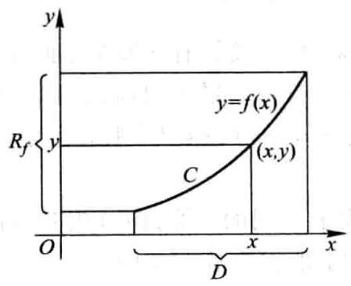

图 1-1

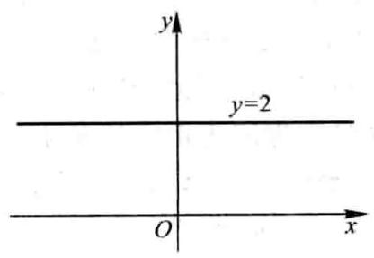

图 1-2

例 6 函数

$$
y = \left| x\right|  = \left\{  \begin{array}{ll}  - x, & x < 0, \\  x, & x \geq  0 \end{array}\right.
$$

的定义域 $D = \left( {-\infty , + \infty }\right)$ ,值域 ${R}_{f} = \lbrack 0, + \infty )$ ,它的图形如图 1-3 所示. 这函数称为绝对值函数.

例 7 函数

$$
y = \operatorname{sgn}x = \left\{  \begin{array}{ll}  - 1, & x < 0, \\  0, & x = 0, \\  1, & x > 0 \end{array}\right.
$$

称为符号函数,它的定义域 $D = \left( {-\infty , + \infty }\right)$ ,值域 ${R}_{f} = \{  - 1,0,1\}$ ,它的图形如图 1-4 所示. 对于任何实数 $x$ ,下列关系成立:

$$
x = \operatorname{sgn}x \cdot  \left| x\right| \text{.}
$$

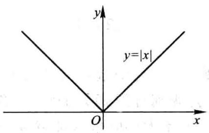

图 1-3

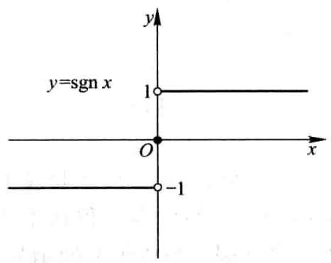

图 1-4

例 8 设 $x$ 为任一实数,不超过 $x$ 的最大整数称为 $x$ 的整数部分,记作 $\left\lbrack  x\right\rbrack$ . 例如, $\left\lbrack  \frac{5}{7}\right\rbrack   = 0,\left\lbrack  \sqrt{2}\right\rbrack   = 1,\left\lbrack  \pi \right\rbrack   = 3,\left\lbrack  {-1}\right\rbrack   =  - 1,\left\lbrack  {-{3.5}}\right\rbrack   =  - 4$ . 把 $x$ 看作变量,则函数

$$
y = \left\lbrack  x\right\rbrack
$$

的定义域 $D = \left( {-\infty , + \infty }\right)$ ,值域 ${R}_{f} = \mathbf{Z}$ . 它的图形如图 1-5 所示,这图形称为阶梯曲线. 在 $x$ 为整数值处,图形发生跳跃,跃度为 1 . 这函数称为取整函数.

在例 6 和例 7 中看到, 有时一个函数要用几个式子表示. 这种在自变量的不同变化范围中, 对应法则用不同式子来表示的函数, 通常称为分段函数.

例 9 函数

$$
y = f\left( x\right)  = \left\{  \begin{array}{ll} 2\sqrt{x}, & 0 \leq  x \leq  1, \\  1 + x, & x > 1 \end{array}\right.
$$

是一个分段函数. 它的定义域 $D = \lbrack 0, + \infty )$ . 当 $x \in  \left\lbrack  {0,1}\right\rbrack$ 时,对应的函数值 $f\left( x\right)  = 2\sqrt{x}$ ; 当 $x \in  \left( {1, + \infty }\right)$ 时,对应的函数值 $f\left( x\right)  = 1 + x$ . 例如, $\frac{1}{2} \in  \left\lbrack  {0,1}\right\rbrack$ ,所以 $f\left( \frac{1}{2}\right)  = 2\sqrt{\frac{1}{2}} = \sqrt{2};1 \in  \left\lbrack  {0,1}\right\rbrack$ ,所以 $f\left( 1\right)  = 2\sqrt{1} = 2;3 \in  \left( {1, + \infty }\right)$ ,所以 $f\left( 3\right)  = 1 + 3 = 4$ . 这函数的图形如图 1-6 所示.

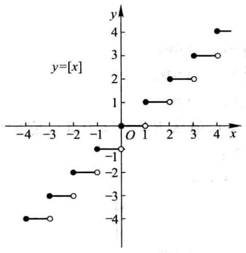

图 1-5

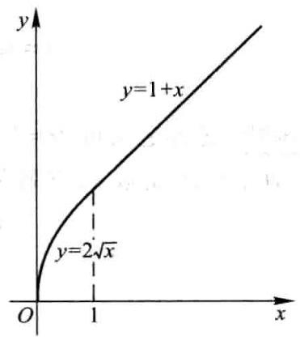

图 1-6

用几个式子来表示一个(不是几个!)函数, 不仅与函数定义并无矛盾, 而且有现实意义. 在自然科学和工程技术中, 经常会遇到分段函数的情形. 例如在等温过程中,气体压强 $p$ 与体积 $V$ 的函数关系,当 $V$ 不太小时依从玻意耳 (Boyle) 定律；当 $V$ 相当小时,函数关系就要用范德瓦耳斯 (van der Waals) 方程来表示,即

$$
p = \left\{  \begin{array}{ll} \frac{\gamma }{V - \beta } - \frac{\alpha }{{V}^{2}}, & \beta  < V < {V}_{0}, \\  \frac{k}{V}, & V \geq  {V}_{0}, \end{array}\right.
$$

其中 $k,\alpha ,\beta ,\gamma$ 都是常量.

## 2. 函数的几种特性

(1) 函数的有界性 设函数 $f\left( x\right)$ 的定义域为 $D$ ,数集 $X \subset  D$ . 如果存在数 ${K}_{1}$ ,使得

$$
f\left( x\right)  \leq  {K}_{1}
$$

对任一 $x \in  X$ 都成立,那么称函数 $f\left( x\right)$ 在 $X$ 上有上界,而 ${K}_{1}$ 称为函数 $f\left( x\right)$ 在 $X$ 上的一个上界. 如果存在数 ${K}_{2}$ ,使得

$$
f\left( x\right)  \geq  {K}_{2}
$$

对任一 $x \in  X$ 都成立,那么称函数 $f\left( x\right)$ 在 $X$ 上有下界,而 ${K}_{2}$ 称为函数 $f\left( x\right)$ 在 $X$

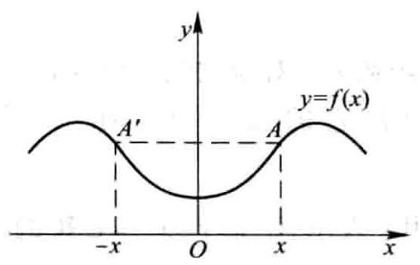

图 1-11

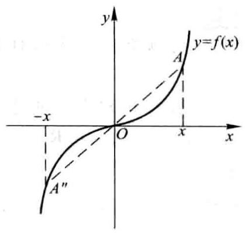

图 1-12

(4)函数的周期性 设函数 $f\left( x\right)$ 的定义域为 $D$ . 如果存在一个正数 $l$ ,使得对于任一 $x \in  D$ 有 $\left( {x \pm  l}\right)  \in  D$ ,且

$$
f\left( {x + l}\right)  = f\left( x\right)
$$

恒成立,那么称 $f\left( x\right)$ 为周期函数, $l$ 称为 $f\left( x\right)$ 的周期,通常我们说周期函数的周期是指最小正周期.

例如,函数 $\sin x,\cos x$ 都是以 ${2\pi }$ 为周期的周期函数; 函数 $\tan x$ 是以 $\pi$ 为周期的周期函数.

图 1-13 表示周期为 $l$ 的一个周期函数. 在每个长度为 $l$ 的区间上,函数图形有相同的形状.

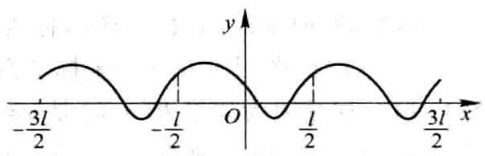

图 1-13

并非每个周期函数都有最小正周期. 下面的函数就属于这种情形.

例 10 狄利克雷 (Dirichlet) 函数

$$
D\left( x\right)  = \left\{  \begin{array}{ll} 1, & x \in  \mathbf{Q}, \\  0, & x \in  {\mathbf{Q}}^{c}. \end{array}\right.
$$

容易验证这是一个周期函数,任何正有理数 $r$ 都是它的周期. 因为不存在最小的正有理数, 所以它没有最小正周期.

## 3. 反函数与复合函数

作为逆映射的特例, 我们有以下反函数的概念.

设函数 $f : D \rightarrow  f\left( D\right)$ 是单射,则它存在逆映射 ${f}^{-1} : f\left( D\right)  \rightarrow  D$ ,称此映射 ${f}^{-1}$ 为函数 $f$ 的反函数.

按此定义,对每个 $y \in  f\left( D\right)$ ,有唯一的 $x \in  D$ ,使得 $f\left( x\right)  = y$ ,于是有

$$
{f}^{-1}\left( y\right)  = x\text{.}
$$

这就是说,反函数 ${f}^{-1}$ 的对应法则是完全由函数 $f$ 的对应法则所确定的.

例如,函数 $y = {x}^{3}, x \in  \mathbf{R}$ 是单射,所以它的反函数存在,其反函数为 $x = {y}^{\frac{1}{3}}, y \in  \mathbf{R}$ .

由于习惯上自变量用 $x$ 表示,因变量用 $y$ 表示,于是 $y = {x}^{3}, x \in  \mathbf{R}$ 的反函数通常写作 $y = {x}^{\frac{1}{3}}, x \in  \mathbf{R}$ .

一般地, $y = f\left( x\right) , x \in  D$ 的反函数记成 $y = {f}^{-1}\left( x\right) , x \in  f\left( D\right)$ .

若 $f$ 是定义在 $D$ 上的单调函数,则 $f : D \rightarrow  f\left( D\right)$ 是单射,于是 $f$ 的反函数 ${f}^{-1}$ 必定存在,而且容易证明 ${f}^{-1}$ 也是 $f\left( D\right)$ 上的单调函数. 事实上,不妨设 $f$ 在 $D$ 上单调增加,现在来证明 ${f}^{-1}$ 在 $f\left( D\right)$ 上也是单调增加的.

任取 ${y}_{1},{y}_{2} \in  f\left( D\right)$ ,且 ${y}_{1} < {y}_{2}$ . 按函数 $f$ 的定义,对 ${y}_{1}$ ,在 $D$ 内存在唯一的原像 ${x}_{1}$ ,使得 $f\left( {x}_{1}\right)  = {y}_{1}$ ,于是 ${f}^{-1}\left( {y}_{1}\right)  = {x}_{1}$ ; 对 ${y}_{2}$ ,在 $D$ 内存在唯一的原像 ${x}_{2}$ ,使得 $f\left( {x}_{2}\right)$ $= {y}_{2}$ ,于是 ${f}^{-1}\left( {y}_{2}\right)  = {x}_{2}$ .

如果 ${x}_{1} > {x}_{2}$ ,则由 $f\left( x\right)$ 单调增加,必有 ${y}_{1} > {y}_{2}$ ; 如果 ${x}_{1} = {x}_{2}$ ,则显然有 ${y}_{1} = {y}_{2}$ . 这两种情形都与假设 ${y}_{1} < {y}_{2}$ 不符,故必有 ${x}_{1} < {x}_{2}$ ,即 ${f}^{-1}\left( {y}_{1}\right)  < {f}^{-1}\left( {y}_{2}\right)$ . 这就证明了 ${f}^{-1}$ 在 $f\left( D\right)$ 上是单调增加的.

相对于反函数 $y = {f}^{-1}\left( x\right)$ 来说,原来的函数 $y = f\left( x\right)$ 称为直接函数. 把直接函数 $y = f\left( x\right)$ 和它的反函数 $y = {f}^{-1}\left( x\right)$ 的图形画在同一坐标平面上,这两个图形关于直线 $y = x$ 是对称的 (图 1-14). 这是因为如果 $P\left( {a, b}\right)$ 是 $y = f\left( x\right)$ 图形上的点,则有 $b = f\left( a\right)$ . 按反函数的定义,有 $a = {f}^{-1}\left( b\right)$ ,故 $Q\left( {b, a}\right)$ 是 $y = {f}^{-1}\left( x\right)$ 图形上的点; 反之,若 $Q\left( {b, a}\right)$ 是 $y = {f}^{-1}\left( x\right)$ 图形上的点,则 $P\left( {a, b}\right)$ 是 $y = f\left( x\right)$ 图形上的点. 而 $P(a$ , $b)$ 与 $Q\left( {b, a}\right)$ 是关于直线 $y = x$ 对称的.

复合函数是复合映射的一种特例, 按照通常函数的记号, 复合函数的概念可如下表述:

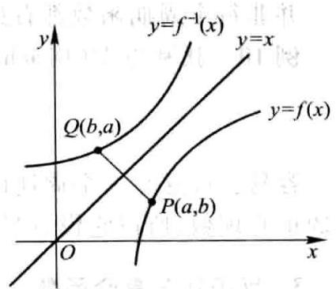

图 1-14

设函数 $y = f\left( u\right)$ 的定义域为 ${D}_{f}$ ,函数 $u = g\left( x\right)$ 的定义域为 ${D}_{g}$ ,且其值域 ${R}_{g} \subset  {D}_{f}$ ,则由下式确定的函数

$$
y = f\left\lbrack  {g\left( x\right) }\right\rbrack  ,\;x \in  {D}_{g}
$$

称为由函数 $u = g\left( x\right)$ 与函数 $y = f\left( u\right)$ 构成的复合函数,它的定义域为 ${D}_{g}$ ,变量 $u$ 称为中间变量.

函数 $g$ 与函数 $f$ 构成的复合函数,即按“先 $g$ 后 ${f}^{\prime \prime }$ 的次序复合的函数,通常上的一个下界. 如果存在正数 $M$ ,使得

$$
\left| {f\left( x\right) }\right|  \leq  M
$$

对任一 $x \in  X$ 都成立,那么称函数 $f\left( x\right)$ 在 $X$ 上有界. 如果这样的 $M$ 不存在,就称函数 $f\left( x\right)$ 在 $X$ 上无界; 这就是说,如果对于任何正数 $M$ ,总存在 ${x}_{1} \in  X$ ,使 $\left| {f\left( {x}_{1}\right) }\right|  > M$ ,那么函数 $f\left( x\right)$ 在 $X$ 上无界.

例如,就函数 $f\left( x\right)  = \sin x$ 在 $\left( {-\infty , + \infty }\right)$ 内来说,数 1 是它的一个上界,数 -1 是它的一个下界 (当然, 大于 1 的任何数也是它的上界, 小于 -1 的任何数也是它的下界). 又

$$
\left| {\sin x}\right|  \leq  1
$$

对任一实数 $x$ 都成立,故函数 $f\left( x\right)  = \sin x$ 在 $\left( {-\infty , + \infty }\right)$ 内是有界的. 这里 $M = 1$ (当然也可取大于 1 的任何数作为 $M$ 而使 $\left| {f\left( x\right) }\right|  \leq  M$ 对任一实数 $x$ 都成立).

又如函数 $f\left( x\right)  = \frac{1}{x}$ 在开区间(0,1)内没有上界,但有下界,例如 1 就是它的一个下界. 函数 $f\left( x\right)  = \frac{1}{x}$ 在开区间(0,1)内是无界的,因为不存在这样的正数 $M$ ,使 $\left| \frac{1}{x}\right|  \leq  M$ 对于(0,1)内的一切 $x$ 都成立. 但是 $f\left( x\right)  = \frac{1}{x}$ 在区间(1,2)内是有界的,例如可取 $M = 1$ 而使 $\left| \frac{1}{x}\right|  \leq  1$ 对于一切 $x \in  \left( {1,2}\right)$ 都成立.

容易证明,函数 $f\left( x\right)$ 在 $X$ 上有界的充分必要条件是它在 $X$ 上既有上界又有下界.

(2)函数的单调性 设函数 $f\left( x\right)$ 的定义域为 $D$ ,区间 $I \subset  D$ . 如果对于区间 $I$ 上任意两点 ${x}_{1}$ 及 ${x}_{2}$ ,当 ${x}_{1} < {x}_{2}$ 时,恒有

$$
f\left( {x}_{1}\right)  < f\left( {x}_{2}\right) ,
$$

那么称函数 $f\left( x\right)$ 在区间 $I$ 上是单调增加的 (图 1-7); 如果对于区间 $I$ 上任意两点 ${x}_{1}$ 及 ${x}_{2}$ ,当 ${x}_{1} < {x}_{2}$ 时,恒有

$$
f\left( {x}_{1}\right)  > f\left( {x}_{2}\right) ,
$$

那么称函数 $f\left( x\right)$ 在区间 $I$ 上是单调减少的 (图 1-8). 单调增加和单调减少的函数统称为单调函数.

例如,函数 $f\left( x\right)  = {x}^{2}$ 在区间 $\lbrack 0, + \infty )$ 上是单调增加的,在区间 $( - \infty ,0\rbrack$ 上是单调减少的; 在区间 $\left( {-\infty , + \infty }\right)$ 内函数 $f\left( x\right)  = {x}^{2}$ 不是单调的 (图 1-9).

又例如,函数 $f\left( x\right)  = {x}^{3}$ 在区间 $\left( {-\infty , + \infty }\right)$ 内是单调增加的 (图 1-10).

(3)函数的奇偶性 设函数 $f\left( x\right)$ 的定义域 $D$ 关于原点对称. 如果对于任一 $x \in  D$ ,

$$
f\left( {-x}\right)  = f\left( x\right)
$$

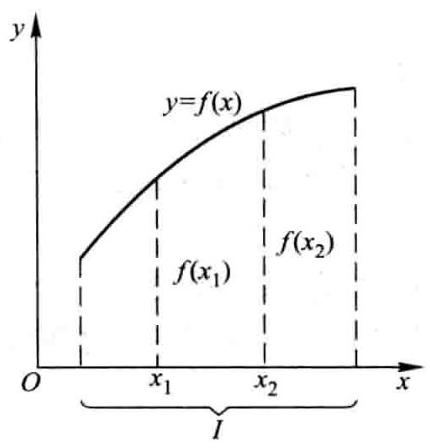

图 1-7

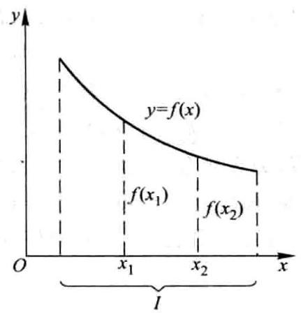

图 1-8

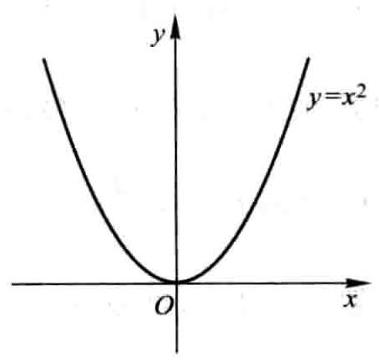

图 1-9

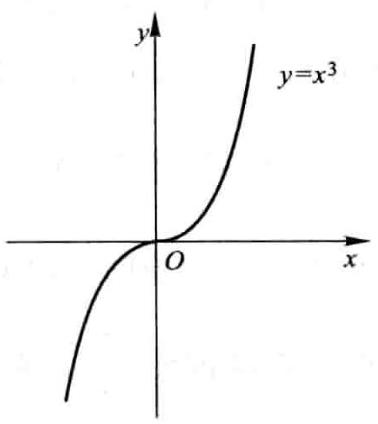

图 1-10

恒成立,那么称 $f\left( x\right)$ 为偶函数. 如果对于任一 $x \in  D$ ,

$$
f\left( {-x}\right)  =  - f\left( x\right)
$$

恒成立,那么称 $f\left( x\right)$ 为奇函数.

例如, $f\left( x\right)  = {x}^{2}$ 是偶函数,因为 $f\left( {-x}\right)  = {\left( -x\right) }^{2} = {x}^{2} = f\left( x\right)$ . 又例如, $f\left( x\right)  = {x}^{3}$ 是奇函数,因为 $f\left( {-x}\right)  = {\left( -x\right) }^{3} =  - {x}^{3} =  - f\left( x\right)$ .

偶函数的图形关于 $y$ 轴是对称的. 因为若 $f\left( x\right)$ 是偶函数,则 $f\left( {-x}\right)  = f\left( x\right)$ ,所以如果 $A\left( {x, f\left( x\right) }\right)$ 是图形上的点,那么与它关于 $y$ 轴对称的点 ${A}^{\prime }\left( {-x, f\left( x\right) }\right)$ 也在图形上 (图 1-11).

奇函数的图形关于原点是对称的. 因为若 $f\left( x\right)$ 是奇函数,则 $f\left( {-x}\right)  =$ $- f\left( x\right)$ ,所以如果 $A\left( {x, f\left( x\right) }\right)$ 是图形上的点,那么与它关于原点对称的点 ${A}^{\prime \prime }\left( {-x, - f\left( x\right) }\right)$ 也在图形上 (图 1-12).

函数 $y = \sin x$ 是奇函数. 函数 $y = \cos x$ 是偶函数. 函数 $y = \sin x + \cos x$ 既非奇函数, 也非偶函数.