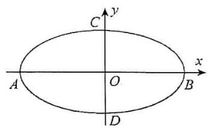
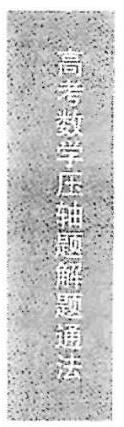
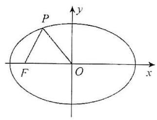
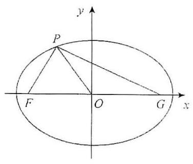
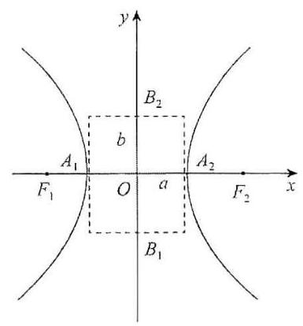
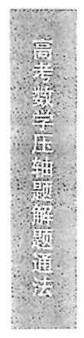
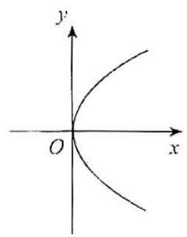
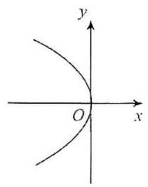

## 第一节 圆锥曲线的基本概念

第一节主要是为后续内容服务的, 掌握基础知识, 可以灵活地运用就可以了. 接下来的章节会陆续讲圆锥曲线的各种题型及其解法, 用简便和快捷的方法迅速解决高考圆锥曲线压轴题.

## 知识点

## 椭圆

## (1)椭圆的概念

平面内与两个定点 ${F}_{1},{F}_{2}$ 的距离之和等于常数 ${2a}$ (大于 $\left. {\left| {{F}_{1}{F}_{2}}\right| \text{ ) }}\right)$ 的点的轨迹叫做椭圆. 这两个定点叫做椭圆的焦点,两焦点的距离叫椭圆的焦距. 若 $M$ 为椭圆上任意一点,则有 $\left| {M{F}_{1}}\right|  + \left| {M{F}_{2}}\right|  = {2a}$ .

椭圆的标准方程为 $\frac{{x}^{2}}{{a}^{2}} + \frac{{y}^{2}}{{b}^{2}} = 1\left( {a > b > 0}\right)$ (焦点在 $x$ 轴上) 或 $\frac{{y}^{2}}{{a}^{2}} + \frac{{x}^{2}}{{b}^{2}} = 1\left( {a > b > 0}\right)$ (焦点在 $y$ 轴上) 且 ${c}^{2} = {a}^{2} - {b}^{2}$ .

注: 分清焦点的位置,只要看 ${x}^{2}$ 和 ${y}^{2}$ 的分母的大小即可. 例如椭圆 $\frac{{x}^{2}}{{m}^{2}} + \frac{{y}^{2}}{{n}^{2}} = 1(m > 0, n > 0$ , $m \neq  n)$ 当 $m > n$ 时表示焦点在 $x$ 轴上的椭圆; 当 $m < n$ 时表示焦点在 $y$ 轴上的椭圆.

## (2)椭圆的性质

①范围:椭圆 $\frac{{x}^{2}}{{a}^{2}} + \frac{{y}^{2}}{{b}^{2}} = 1\left( {a > 0, b > 0}\right)$ 上所有的点都位于直线 $x =  \pm  a$ 和 $y =  \pm  b$ 所围成的矩形内, 所以椭圆 $\frac{{x}^{2}}{{a}^{2}} + \frac{{y}^{2}}{{b}^{2}} = 1\left( {a > 0, b > 0}\right)$ 上点的坐标满足 $\left| x\right|  \leq  a,\left| y\right|  \leq  b$ .

②对称性:对于椭圆标准方程 $\frac{{x}^{2}}{{a}^{2}} + \frac{{y}^{2}}{{b}^{2}} = 1\left( {a > 0, b > 0}\right)$ ,若把 $x$ 换成 $- x$ ,或把 $y$ 换成 $- y$ ,或把 $x$ , $y$ 同时换成 $- x, - y$ . 原方程不变,所以椭圆 $\frac{{x}^{2}}{{a}^{2}} + \frac{{y}^{2}}{{b}^{2}} = 1\left( {a > 0, b > 0}\right)$ 是以 $x$ 轴, $y$ 轴为对称轴的轴对称图形, 并且是以原点为对称中心的中心对称图形, 这个对称中心称为椭圆的中心.

③顶点: 椭圆 $\frac{{x}^{2}}{{a}^{2}} + \frac{{y}^{2}}{{b}^{2}} = 1\left( {a > 0, b > 0}\right)$ 与坐标轴的交点四个交点叫做椭圆的顶点,坐标分别为 $A\left( {-a,0}\right) , B\left( {a,0}\right) , C\left( {0, b}\right) , D\left( {0, - b}\right)$ . 线段 ${AB},{CD}$ 分别叫做椭圆的长轴和短轴,他们的长分别为 ${2a}$ 和 ${2b}, a$ 和 $b$ 分别叫做椭圆的长半轴长和短半轴长.

④离心率:椭圆的焦距长与长轴长的比叫椭圆的离心率,用 $e$ 表示即 $e = \frac{c}{a}$ . 因为 $a > c > 0$ ,所以 $0 < e < 1$ 且 $e$ 越接近 $0, c$ 就越接近 0,从而 $b$ 越接近 $a$ ,这时椭圆越接近于圆; 反之, $e$ 越接近 $1, c$ 就越接近 $a$ ,从而 $b$ 就越小,对应的椭圆越扁. 当且仅当 $a = b$ 时, $c = 0$ ,两焦点重合,图形变为圆,方程为 ${x}^{2} + {y}^{2} = {a}^{2}$ .

(3) 椭圆 $\frac{{x}^{2}}{{a}^{2}} + \frac{{y}^{2}}{{b}^{2}} = 1$ 与 $\frac{{y}^{2}}{{a}^{2}} + \frac{{x}^{2}}{{b}^{2}} = 1\left( {a > b > 0}\right)$ 的区别和联系

<table><tr><td>标准方程</td><td>$\frac{{x}^{2}}{{a}^{2}} + \frac{{y}^{2}}{{b}^{2}} = 1\left( {a > b > 0}\right)$</td><td>$\frac{{y}^{2}}{{a}^{2}} + \frac{{x}^{2}}{{b}^{2}} = 1\left( {a > b > 0}\right)$</td></tr><tr><td>图形</td><td>  </td><td>  </td></tr><tr><td>焦点</td><td>${F}_{1}\left( {-c,0}\right) ,{F}_{2}\left( {c,0}\right)$</td><td>${F}_{1}\left( {0, - c}\right) ,{F}_{2}\left( {0, c}\right)$</td></tr><tr><td>焦距</td><td>$\left| {{F}_{1}{F}_{2}}\right|  = {2c}$</td><td>$\left| {{F}_{1}{F}_{2}}\right|  = {2c}$</td></tr><tr><td>范围</td><td>$\left| x\right|  \leq  a,\left| y\right|  \leq  b$</td><td>$\left| x\right|  \leq  b,\left| y\right|  \leq  a$</td></tr><tr><td>对称性</td><td colspan="2">关于 $x$ 轴、 $y$ 轴和原点对称</td></tr><tr><td>性质顶点</td><td>$\left( {\pm a,0}\right) ,\left( {0, \pm  b}\right)$</td><td>$\left( {0, \pm  a}\right) ,\left( {\pm b,0}\right)$</td></tr><tr><td>轴长</td><td colspan="2">长轴长为 ${2a}$ ,短轴长为 ${2b}$</td></tr><tr><td>离心率</td><td colspan="2">$e = \frac{c}{a}\left( {0 < e < 1}\right)$</td></tr><tr><td>准线方程</td><td>$x =  \pm  \frac{{a}^{2}}{c}$</td><td>$y =  \pm  \frac{{a}^{2}}{c}$</td></tr></table>

## 练习:

1. (2016 ・ 儋州校级期末) 求符合下列条件的椭圆的标准方程.

(1)长轴在 $x$ 轴上,长轴长等于 12,离心率等于 $\frac{2}{3}$ ；

(2)长轴长是短轴长的 2 倍,且椭圆过点(-2, - 4).

(   )由已知能够得出 $a, c$ 的值,结合 ${c}^{2} = {a}^{2} - {b}^{2}$ 可求出 $b$ 的值,最后可以求出椭圆方程.

(2)由已知能够得出 $a$ 与 $b$ 的关系,分焦点在 $x$ 轴或 $y$ 轴的情况设出椭圆的方程,再由椭圆过点 (-2, - 4),可求出椭圆方程.

解答 (1) 由已知 ${2a} = {12}$ 得 $a = 6$ ,因为 $e = \frac{c}{a} = \frac{2}{3}$ ,所以 $c = 4$ . 因为 ${b}^{2} = {a}^{2} - {c}^{2}$ ,所以 ${b}^{2} = {a}^{2} - {c}^{2} =$ ${6}^{2} - {4}^{2} = {20}$ ,长轴在 $x$ 轴上. 故椭圆方程为 $\frac{{x}^{2}}{36} + \frac{{y}^{2}}{20} = 1$ .

( 2 )由 ${2a} = 2 \times  {2b}$ 得 $a = {2b}$ . 当椭圆的焦点在 $x$ 轴上时,设椭圆方程为 $\frac{{x}^{2}}{{a}^{2}} + \frac{{y}^{2}}{{b}^{2}} = 1$ . 因为椭圆过点 (-2, - 4),所以将点(-2, - 4)代入方程得 $\frac{4}{{\left( 2b\right) }^{2}} + \frac{16}{{b}^{2}} = 1,{b}^{2} = {17},{a}^{2} = {\left( 2b\right) }^{2} = {68}$ ,故椭圆方程为 $\frac{{x}^{2}}{68} + \frac{{y}^{2}}{17} = 1$ ; 当椭圆的焦点在 $y$ 轴上时,设椭圆方程为 $\frac{{y}^{2}}{{a}^{2}} + \frac{{x}^{2}}{{b}^{2}} = 1$ . 因为椭圆过点(-2, - 4),所以将点(-2, - 4)代入方程得 $\frac{16}{{\left( 2b\right) }^{2}} + \frac{4}{{b}^{2}} = 1,{b}^{2} = 8,{a}^{2} = {32}$ ,故椭圆方程为 $\frac{{y}^{2}}{32} + \frac{{x}^{2}}{8} = 1$ . 即椭圆方程为

$\frac{{x}^{2}}{68} + \frac{{y}^{2}}{17} = 1$ 或 $\frac{{y}^{2}}{32} + \frac{{x}^{2}}{8} = 1.$

点评,本题考查了椭圆标准方程的求法以及分类法的思想.

练习 1 做完了,是不是很简单呢? 要记住讨论焦点在 $x$ 轴和 $y$ 轴两种情况下的标准方程,不然就会丢分的, 接下来做个稍微复杂一点的吧!

2. (2017・崇明县一模) 如图,已知椭圆 $C$ 的中心为原点 $O, F\left( {-2\sqrt{5},0}\right)$ 为椭圆 $C$ 的左焦点, $P$ 为 $C$ 上一点满足 $\left| {OP}\right|  = \left| {OF}\right|$ 且 $\left| {PF}\right|  = 4$ ,则椭圆 $C$ 的方程为 (   ).

A. $\frac{{x}^{2}}{25} + \frac{{y}^{2}}{5} = 1$ B. $\frac{{x}^{2}}{30} + \frac{{y}^{2}}{10} = 1$

C. $\frac{{x}^{2}}{36} + \frac{{y}^{2}}{16} = 1$ D. $\frac{{x}^{2}}{45} + \frac{{y}^{2}}{25} = 1$

解析 设椭圆的右焦点为 $G$ ,由 $\left| {OP}\right|  = \left| {OF}\right|$ 及椭圆的性质可知 $\bigtriangleup {PFG}$ 为直角三角形,由勾股定理得出 $\left| {PG}\right|$ ,又由 ${b}^{2} = {a}^{2} - {c}^{2}$ 得 ${b}^{2}$ ,即可写出椭圆的方程.

解答 设椭圆的右焦点为 $G$ ,有 $\left| {OF}\right|  = \left| {OG}\right|$ ,连接 ${PG}$ . 由 $\left| {OP}\right|  = \left| {OF}\right|$ 得 $\left| {OP}\right|  = \left| {OF}\right|  = \left| {OG}\right|$ 可以知道 $\angle {OPF} =$ $\angle {OFP},\angle {OPG} = \angle {OGP}$ ,所以 $\angle {OPF} + \angle {OPG} = \angle {OFP} + \angle {OGP}$ . 又因为 $\angle {OPF} + \angle {OPG} + \angle {OFP} + \angle {OGP} = {180}^{ \circ  }$ ,所以 $\angle {OPF} + \angle {OPG} =$ ${90}^{ \circ  }$ ,在 Rt $\bigtriangleup {PFG}$ 中由勾股定理得 $\left| {PG}\right|  = \sqrt{F{G}^{2} - P{F}^{2}}$ ,由题意得 $c =$ $2\sqrt{5}$ ,所以 $\left| {FG}\right|  = 4\sqrt{5}$ ,故 $\left| {PG}\right|  = \sqrt{{\left( 4\sqrt{5}\right) }^{2} - {4}^{2}} = 8$ ,由椭圆定义得 $\left| {PG}\right|  + \left| {PF}\right|  = {2a} = 8 + 4 = {12}$ ,所以 $a = 6,{b}^{2} = {a}^{2} - {c}^{2} = {6}^{2} - (2$ $\sqrt{5}{)}^{2} = {16}$ ,所以椭圆方程为 $\frac{{x}^{2}}{36} + \frac{{y}^{2}}{16} = 1$ ,故选 C.

点评 本题主要考查了椭圆的第一定义、性质与方程,关键在于运用题中所给的条件求出 $a, b, c$ 从而确定椭圆的方程.

这些基础性的知识点一定要牢牢掌握, 这可是以后做压轴题的关键, 就像是小学最开始学的乘法口诀是计算的基础一样, 尤其是椭圆这部分, 出题的可能性是很大的哦!

## 双曲线

## (1)双曲线的概念

平面内到两个定点 ${F}_{1},{F}_{2}$ 的距离之差的绝对值等于常数 ${2a}$ (小于 $\left| {{F}_{1}{F}_{2}}\right|$ ) 的点的轨迹叫做双曲线. 这两个定点叫做双曲线的焦点,两焦点的距离叫双曲线的焦距. 若 $M$ 为双曲线上任意一点,则有 $\left| {\left| {M{F}_{1}}\right|  - \left| {M{F}_{2}}\right| }\right|  = {2a}$ .

双曲线的标准方程为 $\frac{{x}^{2}}{{a}^{2}} - \frac{{y}^{2}}{{b}^{2}} = 1$ (焦点在 $x$ 轴上) 或 $\frac{{y}^{2}}{{a}^{2}} - \frac{{x}^{2}}{{b}^{2}} = 1$ (焦点在 $y$ 轴上) 且 ${c}^{2} = {a}^{2} + {b}^{2}$ .

(2)双曲线的性质

①范围:双曲线 $\frac{{x}^{2}}{{a}^{2}} - \frac{{y}^{2}}{{b}^{2}} = 1\left( {a > 0, b > 0}\right)$ 上点的坐标满足 $x \leq   - a$ 与 $x \geq  a$ .

②对称性:类比椭圆对称性的方法,得到双曲线关于 $x$ 轴、 $y$ 轴和原点都是对称的. 坐标轴是双曲线的对称轴, 原点是双曲线的对称中心, 双曲线的对称中心叫做双曲线的中心.

③顶点: 双曲线和坐标轴的交点. 顶点坐标为 ${A}_{1}\left( {-a,0}\right) ,{A}_{2}\left( {a,0}\right)$ ,特殊点 ${B}_{1}\left( {0, b}\right) ,{B}_{2}(0$ , $- b)$ ,线段 ${A}_{1}{A}_{2}$ 叫做双曲线的实轴,实轴长为 ${2a}, a$ 叫做双曲线的半实轴长. 线段 ${B}_{1}{B}_{2}$ 叫做双曲线的虚轴,虚轴长为 ${2b}, b$ 叫做双曲线的半虚轴长.

④离心率:双曲线的焦距长与长轴的比叫做双曲线的离心率,用 $e$ 表示, $e = \frac{c}{a}$ ,因为 $c > a$ ,所以 $e > 1$ .

⑤渐进线: 双曲线 $\frac{{x}^{2}}{{a}^{2}} - \frac{{y}^{2}}{{b}^{2}} = 1$ 的渐近线方程是 $y =  \pm  \frac{b}{a}x$ ;

双曲线 $\frac{{y}^{2}}{{a}^{2}} - \frac{{x}^{2}}{{b}^{2}} = 1$ 的渐近线方程是 $y =  \pm  \frac{a}{b}x$ .

(3) 双曲线 $\frac{{x}^{2}}{{a}^{2}} - \frac{{y}^{2}}{{b}^{2}} = 1$ 与 $\frac{{x}^{2}}{{a}^{2}} - \frac{{x}^{2}}{{b}^{2}} = 1\left( {a > 0, b > 0}\right)$ 的区别与联系

<table><tr><td>标准方程</td><td>$\frac{{x}^{2}}{{a}^{2}} - \frac{{y}^{2}}{{b}^{2}} = 1\left( {a > 0, b > 0}\right)$</td><td>$\frac{{y}^{2}}{{a}^{2}} - \frac{{x}^{2}}{{b}^{2}} = 1\left( {a > 0, b > 0}\right)$</td></tr><tr><td>图形</td><td>  </td><td>  </td></tr><tr><td>焦点</td><td>${F}_{1}\left( {-c,0}\right) ,{F}_{2}\left( {c,0}\right)$</td><td>${F}_{1}\left( {0, - c}\right) ,{F}_{2}\left( {0, c}\right)$</td></tr><tr><td>焦距</td><td>$\left| {{F}_{1}{F}_{2}}\right|  = {2c}$</td><td>$\left| {{F}_{1}{F}_{2}}\right|  = {2c}$</td></tr><tr><td>范围</td><td>$x \leq   - a, x \geq  a, y \in  \mathbf{R}$</td><td>$y \leq   - a, y \geq  a, y \in  \mathbf{R}$</td></tr><tr><td>对称性</td><td colspan="2">关于 $x$ 轴, $y$ 轴和原点对称</td></tr><tr><td>性质顶点</td><td>$\left( {\pm a,0}\right)$</td><td>$\left( {0, \pm  a}\right)$</td></tr><tr><td>轴长</td><td colspan="2">实轴长为 ${2a}$ ,虚轴长为 ${2b}$</td></tr><tr><td>离心率</td><td colspan="2">$e = \frac{c}{a}\left( {e > 1}\right)$</td></tr><tr><td>渐近线方程</td><td>$y =  \pm  \frac{b}{a}x$</td><td>$y =  \pm  \frac{a}{b}x$</td></tr></table>

## 练习

3. (2017・汪清县校级期中) 双曲线与椭圆 $\frac{{x}^{2}}{27} + \frac{{y}^{2}}{36} = 1$ 有相同的焦点且经过点 $\left( {\sqrt{5},4}\right)$ .

(1)求双曲线的方程；

(2)求双曲线离心率及渐近线方程.

变成 1 (1) 双曲线与椭圆 $\frac{{x}^{2}}{27} + \frac{{y}^{2}}{36} = 1$ 有相同的焦点可得到双曲线的焦点坐标为 ${F}_{1}\left( {0, - 3}\right)$ , ${F}_{2}\left( {0,3}\right)$ ,设双曲线方程为 $\frac{{y}^{2}}{{a}^{2}} - \frac{{x}^{2}}{9 - {a}^{2}} = 1$ ,由双曲线经过点 $\left( {\sqrt{5},4}\right)$ ,可求出双曲线的方程.

( 2 )由( 1 )中求出的双曲线方程可求 $a, b, c$ 即可求出双曲线的离心率及渐近线方程.

解答 由椭圆 $\frac{{x}^{2}}{27} + \frac{{y}^{2}}{36} = 1$ 和 ${c}^{2} = {a}^{2} - {b}^{2}$ 知 $c = \sqrt{{a}^{2} - {b}^{2}} = \sqrt{{36} - {27}} = 3$ ,故椭圆的焦点为

${F}_{1}\left( {0, - 3}\right) ,{F}_{2}\left( {0,3}\right)$ . 因为双曲线与椭圆 $\frac{{x}^{2}}{27} + \frac{{y}^{2}}{36} = 1$ 有相同的焦点,所以双曲线的焦点为 ${F}_{1}\left( {0, - 3}\right) ,{F}_{2}\left( {0,3}\right)$ ,设双曲线方程为 $\frac{{y}^{2}}{{a}^{2}} - \frac{{x}^{2}}{9 - {a}^{2}} = 1$ ,点 $\left( {\sqrt{5},4}\right)$ 在双曲线上,代入双曲线方程得 $\frac{16}{{a}^{2}} - \frac{15}{9 - {a}^{2}} = 1$ ,解得 ${a}^{2} = 4$ 或 ${a}^{2} = {36}$ (舍去),故双曲线方程为 $\frac{{y}^{2}}{4} - \frac{{x}^{2}}{5} = 1$ .

(2) 由 (1) 知,双曲线方程为 $\frac{{y}^{2}}{4} - \frac{{x}^{2}}{5} = 1$ ,所以 $a = 2, b = \sqrt{5}$ ,又因为 ${c}^{2} = {a}^{2} + {b}^{2}$ ,所以 $c =$ $\sqrt{{a}^{2} + {b}^{2}} = \sqrt{4 + 5} = 3$ . 双曲线的离心率 $e = \frac{c}{a} = \frac{3}{2}$ ,即离心率为 $\frac{3}{2}$ . 渐近线方程 $y =  \pm  \frac{a}{b}x =  \pm  \frac{2\sqrt{5}}{5}x$ , 即渐近线方程为 $y =  \pm  \frac{2\sqrt{5}}{5}x$ .

点… 本题主要考查了双曲线的标准方程, 离心率和渐近线方程, 要求熟练掌握其公式. 本题的焦点在 $y$ 轴上,与常出现的焦点在 $x$ 轴上的题不同,容易混淆,要仔细审题,注意焦点位置不同时渐近线方程公式的变化.

双曲线可以对比着椭圆看, 它们有很多知识点都是互通的, 对比着看有助于记忆哦!

## 抛物线

( 1 )抛物线的概念:平面内与一个定点 $F$ 和一条定直线 $l$ ( $l$ 不经过点 $F$ )距离相等的点的轨迹叫做抛物线. 点 $F$ 叫做抛物线的焦点,直线 $l$ 叫做抛物线的准线.

(2)抛物线的基本知识:

<table><tr><td>标准方程</td><td>${y}^{2} = {2px}\left( {p > 0}\right)$</td><td>${y}^{2} =  - {2px}\left( {p > 0}\right)$</td><td>${x}^{2} = {2py}\left( {p > 0}\right)$</td><td>${x}^{2} =  - {2py}\left( {p > 0}\right)$</td></tr><tr><td>图形</td><td>  </td><td>  </td><td>  </td><td>  </td></tr><tr><td>范围</td><td>$x \geq  0, y \in  \mathbf{R}$</td><td>$x \leq  0, y \in  \mathbf{R}$</td><td>$y \geq  0, x \in  \mathbf{R}$</td><td>$y \leq  0, x \in  \mathbf{R}$</td></tr><tr><td>对称性</td><td colspan="2">关于 $x$ 轴对称</td><td colspan="2">关于 $y$ 轴对称</td></tr><tr><td>焦点</td><td>$\left( {\frac{p}{2},0}\right)$</td><td>$\left( {-\frac{p}{2},0}\right)$</td><td>$\left( {0,\frac{p}{2}}\right)$</td><td>$\left( {0, - \frac{p}{2}}\right)$</td></tr><tr><td>顶点</td><td colspan="4">原点 $O\left( {0,0}\right)$</td></tr><tr><td>离心率</td><td colspan="4">$e = 1$</td></tr><tr><td>准线方程</td><td>$x =  - \frac{p}{2}$</td><td>$x = \frac{p}{2}$</td><td>$y =  - \frac{p}{2}$</td><td>$y = \frac{p}{2}$</td></tr><tr><td>顶点到准线的 距离</td><td colspan="4">$\frac{p}{2}$</td></tr><tr><td>焦点到准线的 距离</td><td colspan="4">$p$ (焦准距)</td></tr></table>

## 练习

4. (2016 ・市中区校级期末) 求满足下列条件的抛物线的标准方程,并求出对应抛物线的准线方程.

(1)过点(-3,2)；

(2)焦点在直线 $x - {2y} - 4 = 0$ 上.

变量符 (1) 根据抛物线过点(-3,2),设出抛物线方程为 ${y}^{2} =  - {2px}\left( {p > 0}\right)$ 或 ${x}^{2} = {2py}\left( {p > 0}\right)$ ,再将点(-3,2)代入即可求出 $p$ ,从而求出准线方程.

(2)根据焦点在直线 $x - {2y} - 4 = 0$ 上,求出焦点坐标,确定抛物线方程,从而求出准线方程.

( 1 )由已知抛物线过点(-3,2),设抛物线方程为 ${y}^{2} =  - {2px}\left( {p > 0}\right)$ 或 ${x}^{2} = {2py}\left( {p > 0}\right)$ ,将点 (-3,2)代入方程得 $4 =  - {2p} \times  \left( {-3}\right)$ 或 ${\left( -3\right) }^{2} = {2p} \times  2$ 得 $p = \frac{2}{3}$ 或 $p = \frac{9}{4}$ . 抛物线方程为 ${y}^{2} =  - \frac{4}{3}x$ 或 ${x}^{2} = \frac{9}{2}y$ ,准线方程为 $x = \frac{1}{3}$ 或 $y =  - \frac{9}{8}$ .

(2)因为焦点在直线 $x - {2y} - 4 = 0$ 上,当 $x = 0$ 时, $y =  - 2$ ,当 $y = 0$ 时, $x = 4$ ,所以抛物线的焦点为 (0, - 2)或(4,0),当焦点为(0, - 2)时, $\frac{p}{2} = 2, p = 4$ ,抛物线方程为 ${x}^{2} =  - {8y}$ ,当焦点为(4,0) 时, $\frac{p}{2} = 4, p = 8$ . 抛物线方程为 ${y}^{2} = {16x}$ ,所以抛物线方程为 ${x}^{2} =  - {8y}$ 或 ${y}^{2} = {16x}$ . 故准线方程为 $y = 2$ 或 $x =  - 4$ .

本题考查了抛物线的标准方程以及准线方程. 当没有给出抛物线方程明确信息时需分情况讨论, 这也是很容易忽略的地方.

到这里为止, 第一节的内容就结束了.

是不是还感觉对高考圆锥曲线压轴题部分没有思路呢? 不要着急, 以上都是基础知识, 是我们必须烂熟于心的.

在接下来的学习当中让我们一起攻破这个难题吧!

## 第二节 简化计算量

从这节开始就要进入本章的重点部分了, 再好的方法只看是远远不够的, 让我们一边学习一边练习吧！

## 不通分法

## 例题

联立 $\frac{{x}^{2}}{{a}^{2}} + \frac{{y}^{2}}{{b}^{2}} = 1$ 与 $y = {kx} + m$ ,求 $\Delta$ .

传统做法: 联立方程 $\frac{{x}^{2}}{{a}^{2}} + \frac{{y}^{2}}{{b}^{2}} = 1$ 和 $y = {kx} + m$ 可得出形如 $\frac{{x}^{2}}{{a}^{2}} + \frac{{\left( km + x\right) }^{2}}{{b}^{2}} = 1$ 的方程,通分 (等式两边同时乘 ${a}^{2}{b}^{2}$ ) 得 ${b}^{2}{x}^{2} + {a}^{2}{\left( kx + m\right) }^{2} = {a}^{2}{b}^{2}$ ,化简得到 $\left( {{b}^{2} + {a}^{2}{k}^{2}}\right) {x}^{2} + 2{a}^{2}{kmx} + {a}^{2}{m}^{2} - {a}^{2}{b}^{2} = 0,\Delta  =$ ${\left( 2{a}^{2}km\right) }^{2} - 4\left( {{b}^{2} + {a}^{2}{k}^{2}}\right) \left( {{a}^{2}{m}^{2} - {a}^{2}{b}^{2}}\right) .$

不通分法: 联立方程 $\frac{{x}^{2}}{{a}^{2}} + \frac{{y}^{2}}{{b}^{2}} = 1$ 和 $y = {kx} + m$ 可得出形如 $\frac{{x}^{2}}{{a}^{2}} + \frac{{\left( kx + m\right) }^{2}}{{b}^{2}} = 1$ 的方程,根据所得方程的特点可以判断出此方程是一元二次方程, 一元二次方程通常有三项, 分别为二次项, 一次项和常数项, 那么只要算出二次项系数, 一次项系数以及常数项就可以得出方程. 可以用一种“贡献”的思想考虑

系数问题,对于二次项只能有 $\frac{{x}^{2}}{{a}^{2}},\frac{{k}^{2}{x}^{2}}{{b}^{2}}$ 两部分,所以二次项系数为 $\frac{1}{{a}^{2}} + \frac{{k}^{2}}{{b}^{2}}$ . 类似地,可以得出一次项系数为 $\frac{2km}{{b}^{2}}$ ,常数项为 $\frac{{m}^{2}}{{b}^{2}} - 1$ ,故一元二次方程为 $\left( {\frac{1}{{a}^{2}} + \frac{{k}^{2}}{{b}^{2}}}\right) {x}^{2} + \frac{2km}{{b}^{2}}x + \left( {\frac{{m}^{2}}{{b}^{2}} - 1}\right)  = 0.\Delta  = {\left( \frac{2km}{{b}^{2}}\right) }^{2} -$ $4\left( {\frac{1}{{a}^{2}} + \frac{{k}^{2}}{{b}^{2}}}\right) \left( {\frac{{m}^{2}}{{b}^{2}} - 1}\right)  = \frac{4{k}^{2}{m}^{2}}{{b}^{4}} - \frac{4{m}^{2}}{{a}^{2}{b}^{2}} + \frac{4}{{a}^{2}} - \frac{4{k}^{2}{m}^{2}}{{b}^{4}} + \frac{4{k}^{2}}{{b}^{2}} = 4\left( {\frac{1}{{a}^{2}} + \frac{{k}^{2}}{{b}^{2}} - \frac{{m}^{2}}{{a}^{2}{b}^{2}}}\right) ,$

(神奇的事情发生了! 原本以为打开是五项, 结果抵消后只剩下三项了, 其实结果还是很简单的)

即 $\Delta  = 4\left( {\frac{1}{{a}^{2}} + \frac{{k}^{2}}{{b}^{2}} - \frac{{m}^{2}}{{a}^{2}{b}^{2}}}\right)$

注: $\Delta  = 4\left( {\frac{1}{{a}^{2}} + \frac{{k}^{2}}{{b}^{2}} - \frac{{m}^{2}}{{a}^{2}{b}^{2}}}\right)$ 需要记下来,可以直接由 $\Delta  = {\left( \frac{2km}{{b}^{2}}\right) }^{2} - 4\left( {\frac{1}{{a}^{2}} + \frac{{k}^{2}}{{b}^{2}}}\right) \left( {\frac{{m}^{2}}{{b}^{2}} - 1}\right)$ 得到 $\Delta  = 4\left( {\frac{1}{{a}^{2}} + \frac{{k}^{2}}{{b}^{2}} - \frac{{m}^{2}}{{a}^{2}{b}^{2}}}\right)$ ,减少了大量计算,不仅可以节省时间还可以避免此过程中计算的错误.

## 4 练习

$\frac{{x}^{2}}{4} + \frac{{y}^{2}}{a} = 1$ 与 $y = {2x} + 5$ 相切,求 $a$ .

传统做法: 联立 $\frac{{x}^{2}}{4} + \frac{{y}^{2}}{a} = 1$ 与 $y = {2x} + 5$ 得 $\frac{{x}^{2}}{4} + \frac{{\left( 2x + 5\right) }^{2}}{a} = 1$ ,通分得 $a{x}^{2} + 4{\left( 2x + 5\right) }^{2} = {4a}$ ,化简得到 $\left( {a + {16}}\right) {x}^{2} + {80x} + {100} - {4a} = 0,\Delta  = {80}^{2} - 4\left( {a + {16}}\right) \left( {{100} - {4a}}\right)  = 0$ ,解得 $a = 9$ .

不通分法: 联立 $\frac{{x}^{2}}{4} + \frac{{y}^{2}}{a} = 1$ 与 $y = {2x} + 5$ 得 $\frac{{x}^{2}}{4} + \frac{{\left( 2x + 5\right) }^{2}}{a} = 1$ ,(根据“贡献”的思想) $\left( {\frac{1}{4} + \frac{4}{a}}\right) {x}^{2} +$ $\frac{20x}{a} + \frac{25}{a} - 1 = 0$ ,所以 $\Delta  = {\left( \frac{20}{a}\right) }^{2} - 4\left( {\frac{1}{4} + \frac{4}{a}}\right) \left( {\frac{25}{a} - 1}\right)  = 4\left( {\frac{1}{4} + \frac{4}{a} - \frac{25}{4a}}\right)$ (可以由 $\Delta  = 4\left( {\frac{1}{{a}^{2}} + \frac{{k}^{2}}{{b}^{2}}}\right.  -$ $\left. \frac{{m}^{2}}{{a}^{2}{b}^{2}}\right)$ 直接得出结果),令 $\Delta  = 0$ ,解得 $a = 9$ .

通过不通分法计算,可以使做题效率大大提高,当式子结构更加复杂时,也能快速正确地求出 $\Delta$ .

## 韦达定理

已知由上述不通分法得到的一元二次方程为 $\left( {\frac{1}{{a}^{2}} + \frac{{k}^{2}}{{b}^{2}}}\right) {x}^{2} + \frac{2km}{{b}^{2}}x + \left( {\frac{{m}^{2}}{{b}^{2}} - 1}\right)  = 0$ ,则 ${x}_{1} + {x}_{2} =$ $\frac{-\frac{2km}{{b}^{2}}}{\frac{1}{{a}^{2}} + \frac{{k}^{2}}{{b}^{2}}},{x}_{1}{x}_{2} = \frac{\frac{{m}^{2}}{{b}^{2}} - 1}{\frac{1}{{a}^{2}} + \frac{{k}^{2}}{{b}^{2}}},{y}_{1} + {y}_{2} = \left( {k{x}_{1} + m}\right)  + \left( {k{x}_{2} + m}\right)  = k\left( {{x}_{1} + {x}_{2}}\right)  + {2m},{y}_{1}{y}_{2} = \left( {k{x}_{1} + m}\right) \left( {k{x}_{2} + m}\right)  =$ ${k}^{2}{x}_{1}{x}_{2} + {km}\left( {{x}_{1} + {x}_{2}}\right)  + {m}^{2}.$

(注意不要用联立方程 $\frac{{x}^{2}}{{a}^{2}} + \frac{{y}^{2}}{{b}^{2}} = 1$ 和 $y = {kx} + m$ 消去 $x$ 求 $y$ ,而要用一次函数 $y = {kx} + m$ 代入求 $y$ )

将 ${x}_{1} + {x}_{2} = \frac{-\frac{2km}{{b}^{2}}}{\frac{1}{{a}^{2}} + \frac{{k}^{2}}{{b}^{2}}}$ 和 ${x}_{1}{x}_{2} = \frac{\frac{{m}^{2}}{{b}^{2}} - 1}{\frac{1}{{a}^{2}} + \frac{{k}^{2}}{{b}^{2}}}$ 代入得 ${y}_{1} + {y}_{2} = \frac{-\frac{2{k}^{2}m}{{b}^{2}}}{\frac{1}{{a}^{2}} + \frac{{k}^{2}}{{b}^{2}}} + {2m} = \frac{\frac{2m}{{a}^{2}}}{\frac{1}{{a}^{2}} + \frac{{k}^{2}}{{b}^{2}}}$ ,

${y}_{1}{y}_{2} = \frac{\frac{{k}^{2}{m}^{2}}{{b}^{2}} - {k}^{2} + \left( {-\frac{2{k}^{2}{m}^{2}}{{b}^{2}}}\right) }{\frac{1}{{a}^{2}} + \frac{{k}^{2}}{{b}^{2}}} + {m}^{2} = \frac{\frac{{m}^{2}}{{a}^{2}} - {k}^{2}}{\frac{1}{{a}^{2}} + \frac{{k}^{2}}{{b}^{2}}}.$

注: 只需记住 ${y}_{1} + {y}_{2} = k\left( {{x}_{1} + {x}_{2}}\right)  + {2m},{y}_{1}{y}_{2} = {k}^{2}{x}_{1}{x}_{2} + {km}\left( {{x}_{1} + {x}_{2}}\right)  + {m}^{2}$ 即可.

只要掌握需要记住的就可以了, 到目前为止只有三个式子需要记住. 本章的目的就是用尽量少的记忆部分得到圆锥曲线压轴题的全部分数.

## 上学以致用

若直线 $y = {kx} + \sqrt{2}$ 与椭圆 $\frac{{x}^{2}}{4} + {y}^{2} = 1$ ,交于不同的两点 $A, B, O$ 为坐标原点,且 $\overrightarrow{OA} \cdot  \overrightarrow{OB} > 2$ ,求 $k$ 的取值范围?

解答 联立 $y = {kx} + \sqrt{2}$ 与 $\frac{{x}^{2}}{4} + {y}^{2} = 1$ ,得 $\frac{{x}^{2}}{4} + {\left( kx + \sqrt{2}\right) }^{2} = 1$ ,整理得到 $\left( {\frac{1}{4} + k}\right) {x}^{2} + 2\sqrt{2}{kx} + 1 = 0$ ("贡献法"), $\Delta  = {\left( 2\sqrt{2}k\right) }^{2} - 4\left( {\frac{1}{4} + {k}^{2}}\right)  = 4{k}^{2} - 1 > 0$ ,则 ${k}^{2} > \frac{1}{4}$ . 设 $A\left( {{x}_{1},{y}_{1}}\right) , B\left( {{x}_{2},{y}_{2}}\right)$ ,所以 $\overrightarrow{OA} = \left( {{x}_{1},{y}_{1}}\right) ,\overrightarrow{OB} = \left( {{x}_{2},{y}_{2}}\right) ,\overrightarrow{OA} \cdot  \overrightarrow{OB} = {x}_{1}{x}_{2} + {y}_{1}{y}_{2} > 2$ . 又因为 ${x}_{1} + {x}_{2} = \frac{-2\sqrt{2}k}{\frac{1}{4} + {k}^{2}},{x}_{1}{x}_{2} = \frac{1}{\frac{1}{4} + {k}^{2}}$ , ${y}_{1}{y}_{2} = \left( {k{x}_{1} + \sqrt{2}}\right) \left( {k{x}_{2} + \sqrt{2}}\right)  = {k}^{2}{x}_{1}{x}_{2} + \sqrt{2}k\left( {{x}_{1} + {x}_{2}}\right)  + 2$ . 因为 $\overrightarrow{OA} \cdot  \overrightarrow{OB} = {x}_{1}{x}_{2} + {y}_{1}{y}_{2} = \frac{1 - 3{k}^{2}}{\frac{1}{4} + {k}^{2}} + 2 > 2$ ,有 $\frac{1 - 3{k}^{2}}{\frac{1}{4} + {k}^{2}} > 0$ . 有 $1 - 3{k}^{2} > 0$ ,所以 ${k}^{2} < \frac{1}{3}$ ,综上可得 $\frac{1}{4} < {k}^{2} < \frac{1}{3}$ ,所以 $k$ 的取值范围为 $\left( {-\frac{\sqrt{3}}{3}, - \frac{1}{2}}\right)$ $U\left( {\frac{1}{2},\frac{\sqrt{3}}{3}}\right)$ .

这里 $\Delta ,{y}_{1}{y}_{2}$ 直接分别由 $\Delta  = 4\left( {\frac{1}{{a}^{2}} + \frac{{k}^{2}}{{b}^{2}} - \frac{{m}^{2}}{{a}^{2}{b}^{2}}}\right) ,{y}_{1}{y}_{2} = {k}^{2}{x}_{1}{x}_{2} + {km}\left( {{x}_{1} + {x}_{2}}\right)  + {m}^{2}$ 得到,避免了通分带来的大量计算量, 只需几分钟便解决了这道题, 同学们要好好适应这种解法, 会事半功倍哦!

## 目标函数的表达

目标函数: 目标函数是指所关心的目标 (某一变量) 与相关的因素 (某些变量) 的函数关系. 简单地说, 就是你求解后所得出的那个函数, 在求解前函数是未知的, 按照你的思路将已知条件利用起来, 去求解未知量的函数关系式,即为目标函数. 这里,通常将目标函数写成关于 $x$ 和 $y$ 的式子.

假设目标函数为 ${x}_{1}{x}_{2} + \left( {{y}_{1} - 1}\right) \left( {{y}_{2} - 1}\right)  = 1$ (当然目标函数可能是其他的形式,这里只是举了这一种形式的例子), 要想通过目标函数求出未知量, 需要将目标函数表达成关于未知量的式子. 通过韦达定理可以求出 ${x}_{1} + {x}_{2},{x}_{1}{x}_{2},{y}_{1} + {y}_{2},{y}_{1}{y}_{2}$ 关于未知量的表达式,那么,将 ${x}_{1} + {x}_{2},{x}_{1}{x}_{2},{y}_{1} + {y}_{2},{y}_{1}{y}_{2}$ 如何代入呢?

三种代入方法

① 将目标函数化为 ${x}_{1}{x}_{2} + {y}_{1}{y}_{2} - \left( {{y}_{1} + {y}_{2}}\right)  + 1 = 1$ ,由韦达定理知 ${x}_{1} + {x}_{2} = \frac{-\frac{2km}{{b}^{2}}}{\frac{1}{{a}^{2}} + \frac{{k}^{2}}{{b}^{2}}},{y}_{1} + {y}_{2} = k\left( {{x}_{1} + }\right.$ $\left. {x}_{2}\right)  + {2m} = \frac{\frac{2m}{{a}^{2}}}{\frac{1}{{a}^{2}} + \frac{{k}^{2}}{{b}^{2}}},{y}_{1}{y}_{2} = {k}^{2}{x}_{1}{x}_{2} + {km}\left( {{x}_{1} + {x}_{2}}\right)  + {m}^{2} = \frac{\frac{{m}^{2}}{{a}^{2}} - {k}^{2}}{\frac{1}{{a}^{2}} + \frac{{k}^{2}}{{b}^{2}}}$ ,求出结果后,将所得结果代入 ${x}_{1}{x}_{2} +$ ${y}_{1}{y}_{2} - \left( {{y}_{1} + {y}_{2}}\right)  + 1 = 1$ ,最后得到关于未知量的表达式.

② 将目标函数化为 ${x}_{1}{x}_{2} + {y}_{1}{y}_{2} - \left( {{y}_{1} + {y}_{2}}\right)  + 1 = 1$ ,将 ${y}_{1} + {y}_{2} = k\left( {{x}_{1} + {x}_{2}}\right)  + {2m},{y}_{1}{y}_{2} = {k}^{2}{x}_{1}{x}_{2} + {km}\left( {{x}_{1} + }\right.$ $\left. {x}_{2}\right)  + {m}^{2}$ 代入 ${x}_{1}{x}_{2} + {y}_{1}{y}_{2} - \left( {{y}_{1} + {y}_{2}}\right)  + 1 = 1$ 得 ${x}_{1}{x}_{2} + {k}^{2}{x}_{1}{x}_{2} + {km}\left( {{x}_{1} + {x}_{2}}\right)  + {m}^{2} - \left\lbrack  {k\left( {{x}_{1} + {x}_{2}}\right)  + {2m}}\right\rbrack   = 0$ ,

化简得到 $\left( {1 + {k}^{2}}\right) {x}_{1}{x}_{2} + \left( {{km} - k}\right) \left( {{x}_{1} + {x}_{2}}\right)  + {m}^{2} - {2m} = 0$ ,最后将 ${x}_{1} + {x}_{2} = \frac{-\frac{2km}{{b}^{2}}}{\frac{1}{{a}^{2}} + \frac{{k}^{2}}{{b}^{2}}},{x}_{1}{x}_{2} = \frac{\frac{{m}^{2}}{{b}^{2}} - 1}{\frac{1}{{a}^{2}} + \frac{{k}^{2}}{{b}^{2}}}$ 代入得到关于未知量的表达式.

优点: 不需要算出 ${y}_{1} + {y}_{2},{y}_{1}{y}_{2}$ 的结果,既节省时间又避免了计算错误.

③ 已知目标函数为 ${x}_{1}{x}_{2} + \left( {{y}_{1} - 1}\right) \left( {{y}_{2} - 1}\right)  = 1$ ,假设直线方程为 $y = {kx} + 3$ ,则将 ${y}_{1} = k{x}_{1} + 3,{y}_{2} =$ $k{x}_{2} + 3$ 代入得 ${x}_{1}{x}_{2} + \left( {k{x}_{1} + 2}\right) \left( {k{x}_{2} + 2}\right)  = 1$ ,化简得 $\left( {1 + {k}^{2}}\right) {x}_{1}{x}_{2} + {2k}\left( {{x}_{1} + {x}_{2}}\right)  + 3$ (“贡献法”),最后将 ${x}_{1} + {x}_{2} = \frac{-\frac{2km}{{b}^{2}}}{\frac{1}{{a}^{2}} + \frac{{k}^{2}}{{b}^{2}}},{x}_{1}{x}_{2} = \frac{\frac{{m}^{2}}{{b}^{2}} - 1}{\frac{1}{{a}^{2}} + \frac{{k}^{2}}{{b}^{2}}}$ 代入得到关于未知量的表达式.

优点: 不需要算出 ${y}_{1} + {y}_{2},{y}_{1}{y}_{2}$ 的结果,也不需要记住 ${y}_{1} + {y}_{2} = k\left( {{x}_{1} + {x}_{2}}\right)  + {2m},{y}_{1}{y}_{2} = {k}^{2}{x}_{1}{x}_{2} +$ ${km}\left( {{x}_{1} + {x}_{2}}\right)  + {m}^{2}$ 这两个式子.

三种代入的方法已经知道了, 当给出一个目标函数时, 怎样判断用哪种方法呢?

当出现相减形式 (形如③) 用方法③,除非题中出现明显的 ${y}_{1} + {y}_{2},{y}_{1}{y}_{2}$ 选方法①,否则用方法②.

(出现相减形式用方法③可以先进行括号内的计算使计算量降低,通常情况下②比①计算量要小些, 所以除非出现明显的 ${y}_{1} + {y}_{2},{y}_{1}{y}_{2}$ ,否则都用②)

优先顺序:③ $>$ ② $>$ ①.

以上内容都是椭圆方程与直线方程联立后如何用不通分法处理简化的, 那如果将椭圆方程换做双曲线方程, 联立后怎样处理简化呢? 让我们来试一下吧!

## 药,小武生刀,

联立方程 $\frac{{x}^{2}}{{a}^{2}} - \frac{{y}^{2}}{{b}^{2}} = 1$ 和 $y = {kx} + m\left( {k \neq   \pm  \frac{b}{a}}\right)$ 可得出形如 $\frac{{x}^{2}}{{a}^{2}} - \frac{{\left( kx + m\right) }^{2}}{{b}^{2}} = 1$ 的方程,由前面椭圆方程和直线方程联立的结果可以类似的得出化简后的方程为 $\left( {\frac{1}{{a}^{2}} - \frac{{k}^{2}}{{b}^{2}}}\right) {x}^{2} - \frac{2km}{{b}^{2}}x - \frac{{m}^{2}}{{b}^{2}} - 1 = 0.\Delta  =$ ${\left( -\frac{2km}{{b}^{2}}\right) }^{2} - 4\left( {\frac{1}{{a}^{2}} - \frac{{k}^{2}}{{b}^{2}}}\right) \left( {-\frac{{m}^{2}}{{b}^{2}} - 1}\right)  = \frac{4{k}^{2}{m}^{2}}{{b}^{4}} + \frac{4{m}^{2}}{{a}^{2}{b}^{2}} + \frac{4}{{a}^{2}} - \frac{4{k}^{2}{m}^{2}}{{b}^{4}} - \frac{4{k}^{2}}{{b}^{2}} = 4\left( {\frac{1}{{a}^{2}} - \frac{{k}^{2}}{{b}^{2}} + \frac{{m}^{2}}{{a}^{2}{b}^{2}}}\right)$ ,即 $\Delta  =$ $4\left( {\frac{1}{{a}^{2}} - \frac{{k}^{2}}{{b}^{2}} + \frac{{m}^{2}}{{a}^{2}{b}^{2}}}\right)$ .

注: 当 $k =  \pm  \frac{b}{a}, m \neq  0$ 时,直线与双曲线有一个交点,且直线与双曲线的渐近线平行.

## 反设直线

前面研究了椭圆和双曲线分别与直线联立后是如何处理简化的, 接下来让我们研究一下抛物线与直线联立的情况, 是否还和椭圆和双曲线一样呢?

(i)当抛物线方程为 ${x}^{2} = {2py}\left( {p > 0}\right)$ 时,联立抛物线方程与直线方程 $y = {kx} + m$ ,可以直接将直线方程 $y = {kx} + m$ 代入抛物线方程 ${x}^{2} = {2py}$ 中,得到 ${x}^{2} = {2p}\left( {{kx} + m}\right)$ ,化简结果为 ${x}^{2} - {2pkx} - {2pm} = 0$ ,则 ${x}_{1} +$ ${x}_{2} = {2pk},{x}_{1}{x}_{2} =  - {2pm},{y}_{1} + {y}_{2} = k\left( {{x}_{1} + {x}_{2}}\right)  + {2m} = {2p}{k}^{2} + {2m},{y}_{1}{y}_{2} = {k}^{2}{x}_{1}{x}_{2} + {km}\left( {{x}_{1} + {x}_{2}}\right)  + {m}^{2} = {m}^{2}$ ,求得 $\Delta  = 4{p}^{2}{k}^{2} + {8pm}$ .

通过计算可以发现当抛物线为 ${x}^{2} = {2py}\left( {p > 0}\right)$ 时,计算量很小,可以直接代入算出 $\Delta$ ,不需要简化计算量.

(ii) 当抛物线方程为 ${y}^{2} = {2px}\left( {p > 0}\right)$ 时,

传统做法: 联立抛物线方程和直线方程 $y = {kx} + m$ ,得到 ${\left( kx + m\right) }^{2} = {2px}$ ,化简结果为 ${k}^{2}{x}^{2} + ({2km} -$ $\left. {2p}\right) x + {m}^{2} = 0$ ,则 ${x}_{1} + {x}_{2} =  - \frac{{2km} - {2p}}{{k}^{2}},{x}_{1}{x}_{2} = \frac{{m}^{2}}{{k}^{2}},{y}_{1} + {y}_{2} = k\left( {{x}_{1} + {x}_{2}}\right)  + {2m},{y}_{1}{y}_{2} = {k}^{2}{x}_{1}{x}_{2} + {km}\left( {{x}_{1} + {x}_{2}}\right)  +$

${m}^{2}$ ,求得 $\Delta  = {\left( 2km - 2p\right) }^{2} - 4{k}^{2}{m}^{2}$ .

可以看出用传统做法计算量大, 耗费时间, 有什么好的办法既能减少计算量又能节省时间呢?

其实这种情况, 可以用反设直线的方法来减少计算量.

反设直线方法: 已知直线方程 $y = {kx} + m$ ,设直线方程为 $x = {ty} + s$ ,其中 $t = \frac{1}{k}, s =  - \frac{m}{k}$ . 联立 ${y}^{2} =$ ${2px}$ 和 $x = {ty} + s$ 得 ${y}^{2} = {2p}\left( {{ty} + s}\right)$ ,化简得到 ${y}^{2} - {2pty} - {2ps} = 0$ ,则 ${y}_{1} + {y}_{2} = {2pt},{y}_{1}{y}_{2} =  - {2ps},{x}_{1} + {x}_{2} =$ $t\left( {{y}_{1} + {y}_{2}}\right)  + {2s} = {2p}{t}^{2} + {2s},{x}_{1}{x}_{2} = {t}^{2}{y}_{1}{y}_{2} + {ts}\left( {{y}_{1} + {y}_{2}}\right)  + {s}^{2} = {s}^{2}$ ,求得 $\Delta  = 4{p}^{2}{t}^{2} + {8ps}$ .

注: 在设反设直线前需要讨论 $t$ 是否存在,即直线是否与 $x$ 轴平行. 若直线与 $x$ 轴平行,则 $t$ 不存在,那么就不能设反设直线; 若直线不与 $x$ 轴平行,则可以设反设直线.

目的: 简化计算量.

了解了怎样设反设直线后,重点来了,什么时候用反设直线这种方法呢？

不要着急, 下面就来讨论一下在什么情况下用反设直线解决问题更简便.

## 红油用题型

①开口向左向右的抛物线;

②直线过 $x$ 轴上一点,例如过(a,0)；

③已知直线 $l$ 与 $y = {kx} + m$ 垂直,且不知道 $l$ 具体过哪一点,则设 $l : x =  - {ky} + n$ .

例如已知直线 $l$ 与 $y =  - {2x} + m$ 垂直,则设 $l : x = {2y} + n$ .

到目前为止,如何简化计算量的核心思想都介绍完了,遇到这类题知道怎样去“做”了,那么,怎样去“想”呢？只有既知道怎样去“做”又知道怎样去“想”才能将这类题一网打尽.

## 四步法

## 第一步: 翻译和设列阶段

1. 平面几何证明:①初中平面几何知识；

②圆锥曲线第一定义;

③与圆相关的性质.

2. 翻译:把题目上用文字表达的条件变成数学语言. 在圆锥曲线部分翻译就是把题干的条件翻译成一元二次方程.

注:所有条件用上才能得到答案；如果有条件没用上那么答案就错了；如果这道题不会做说明有条件没用上.

3. 设列: 是指在设的时候应该设哪个列哪个未知数.

## 例题

已知 $A, B$ 为椭圆 $\frac{{x}^{2}}{{a}^{2}} + \frac{{y}^{2}}{{b}^{2}} = 1$ 上的两个动点,满足 $\angle {AOB} = {90}^{ \circ  }$ ,连接 ${AB}$ (假设 ${AB}$ 斜率存在).

求证: 原点 0 到直线 ${AB}$ 的距离为定值.

解析 方法一: 设 ${OA}$ 为 $y = {kx}\left( {k \neq  0}\right) ,{OB}$ 为 $y =  - \frac{1}{k}x,{OA}$ 与 $\frac{{x}^{2}}{{a}^{2}} + \frac{{y}^{2}}{{b}^{2}} = 1$ 联立能求出点 $A$ 的坐标,