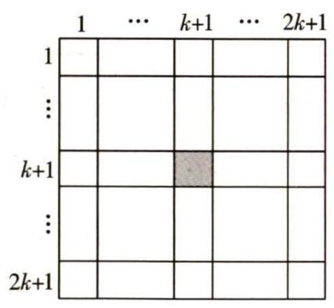
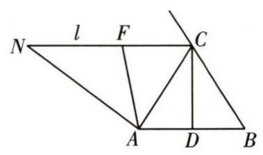

## 再品佳题

# 2018 中美洲地区数学奥林匹克

中图分类号:G424.79 文献标识码:A 文章编号:1005-6416(2021)06-0035-02

中美洲地区数学奥林匹克是由萨尔瓦多发起的旨在激励中美洲地区青年学生的竞赛.

1. 设正整数列 $\left\{  {g}_{n}\right\}$ 满足 ${g}_{1} = 1$ ,且对于任意的 $n \in  {\mathbf{Z}}_{ + }$ ,有 ${g}_{n + 1} = {g}_{n}^{2} + {g}_{n} + 1$ . 证明: 对于任意的 $n \in  {\mathbf{Z}}_{ + }$ ,均有

$$
\left( {{g}_{n}^{2} + 1}\right)  \mid  \left( {{g}_{n + 1}^{2} + 1}\right) \text{.}
$$

2. 如图 1,正方形棋盘被分成 ${\left( 2k + 1\right) }^{2}$ 个小格, 且中心处的小格里放了一枚黑子, 其他小格里各放了一枚白子. 甲、乙两人在这个棋盘上玩游戏, 首先甲选择一枚棋, 若其所在的行数 $i \geq  k + 1$ ,则他就移去行数不小于 $i$ 的所有棋; 若其行数 $i < k + 1$ ,则他就移去行数不大于 $i$ 的所有棋. 对于列也进行完全类似的操作. 在甲操作完之后, 乙也按照这样的方式进行操作, 两人轮流进行. 游戏规定移去黑子的人输. 试问: 他们谁有必胜策略?

图 1

3. 求所有的整数列 ${a}_{1},{a}_{2},\cdots ,{a}_{n}$ ,使其满足:

(1)对于任何 $1 \leq  i \leq  n$ ,均有

$1 \leq  {a}_{i} \leq  n;$

(2)对于任何 $1 \leq  i\text{、}j \leq  n$ ,均有

$$
\left| {{a}_{i} - {a}_{j}}\right|  = \left| {i - j}\right| \text{.}
$$

4. 设 $t$ 为整数. 若方程

$$
{x}^{2} + \left( {{4t} - 1}\right) x + 4{t}^{2} = 0
$$

至少有一个正整数解 $n$ ,证明: $n$ 为完全平方数.

5. 在等腰 $\bigtriangleup {ABC}$ 中, ${CA} = {CB},{CD}$ 为高. 设 $l$ 为 $\bigtriangleup {ABC}$ 过点 $C$ 的外角平分线,点 $N$ 在直线 $l$ 上, ${AN} > {AC}(N$ 与 $A$ 位于直线 ${CD}$ 的同侧). 若 $\angle {NAC}$ 的平分线与 $l$ 交于点 $F$ ,证明:

$$
\angle {NCD} + \angle {BAF} > {180}^{ \circ  }\text{.}
$$

## 参考答案

1. 由 ${g}_{n + 1} = {g}_{n}^{2} + {g}_{n} + 1$ ,知

${g}_{n + 1}^{2} + 1 = {\left( {g}_{n}^{2} + {g}_{n} + 1\right) }^{2} + 1$

$= {\left( {g}_{n}^{2} + 1\right) }^{2} + 2{g}_{n}\left( {{g}_{n}^{2} + 1}\right)  + {g}_{n}^{2} + 1$

$= \left( {{g}_{n}^{2} + 1}\right) \left( {{g}_{n}^{2} + 2{g}_{n} + 2}\right)$ .

这表明, $\left( {{g}_{n}^{2} + 1}\right)  \mid  \left( {{g}_{n + 1}^{2} + 1}\right)$ .

2. 乙有必胜策略.

用 $\left( {i, j}\right) \left( {1 \leq  i\text{、}j \leq  {2k} + 1}\right)$ 表示棋盘上第 $i$ 行第 $j$ 列所在的格. 游戏开始后,设甲选择格(m, n)中的子,则

(1)若 $m\text{、}n$ 中有一个等于 $k + 1$ ,则甲就会移去黑子,从而,甲输、乙获胜；

(2)若 $m\text{、}n$ 均不等于 $k + 1$ ,由奇偶性知

$$
{2k} + 1 - m \neq  m,{2k} + 1 - n \neq  n,
$$

且分情况讨论,可知 $\left( {{2k} + 1 - m,{2k} + 1 - n}\right)$ 中的棋子并没有被甲移去. 于是, 乙选择 $\left( {{2k} + 1 - m,{2k} + 1 - n}\right)$ 中的棋.

乙操作完之后, 所剩的棋会集中在长为 $2\left( {k - m}\right)  + 1$ 、宽为 $2\left( {k - n}\right)  + 1$ 的长方形中, 且黑子依然在这个长方形的中心.

重复上面的讨论,知要么乙获胜,要么剩下的棋会集中在一个更小的长方形中, 由于这种操作不可能无限的进行下去, 于是, 乙必胜.

3. 满足条件的数列只有

$$
{a}_{i} = i\left( {1 \leq  i \leq  n}\right)
$$

和 ${a}_{i} = n + 1 - i\left( {1 \leq  i \leq  n}\right)$ .

据条件 (2),知对于 $2 \leq  i \leq  n$ ,

$\left| {{a}_{i} - {a}_{1}}\right|  = i - 1$ .

则 $\left| {{a}_{i} - {a}_{1}}\right|$ 有 $n - 1$ 个不同的取值.

而对于任何 $1 \leq  j \leq  n$ ,整数 ${a}_{j}$ 均满足 $1 \leq  {a}_{i} \leq  n$ ,故只有 ${a}_{1} = 1$ 或 $n$ 时, $\left| {{a}_{i} - {a}_{1}}\right|$ 才能取到 $n - 1$ 个不同的值.

于是,当 ${a}_{1} = 1$ 时, ${a}_{i} = i\left( {2 \leq  i \leq  n}\right)$ ;

当 ${a}_{1} = n$ 时, ${a}_{i} = n + 1 - i\left( {2 \leq  i \leq  n}\right)$ .

4. 因为 $n$ 是原方程的正整数解,所以,

${n}^{2} + \left( {{4t} - 1}\right) n + 4{t}^{2} = 0$

$\Rightarrow  n = {n}^{2} + {4nt} + 4{t}^{2} = {\left( n + 2t\right) }^{2}$ .

注意到, $t$ 为整数.

这表明, $n$ 为完全平方数.

5. 如图 2,由 $\bigtriangleup {ABC}$ 为等腰三角形, ${CD}$ 为高,知 ${CD}$ 平分 $\angle {ACB}$ .

图 2

又 $l$ 为 $\bigtriangleup {ABC}$ 过点 $C$ 的外角平分线,则

$\angle {ACN} = \angle {BAC},\angle {NCD} = {90}^{ \circ  }$ .

考虑 ${AN} > {AC}$ ,有

$\angle {ACN} > \angle {ANC}$ .

由 ${AF}$ 平分 $\angle {NAC}$

$\Rightarrow  \angle {BAF} = \angle {FAC} + \angle {BAC}$

$= \frac{{180}^{ \circ  } - \angle {ANC} - \angle {ACN}}{2} + \angle {ACN}$

$= {90}^{ \circ  } + \frac{\angle {ACN} - \angle {ANC}}{2} > {90}^{ \circ  }$ .

这表明, $\angle {BAF} + \angle {NCD} > {180}^{ \circ  }$ .

(熊斌 提供 李明 题目翻译并解答)

## 《国内外数学奥林匹克试题精选(2012—2017)》已出版

《国内外数学奥林匹克试题精选(2012-2017)》丛书已由浙江大学出版社出版发行。本丛书分为 《代数》《平面几何》《组合数学》《数论》四个分册。

本丛书是继 2012 年出版的《国内外数学奥林匹克试题精选(2002-2012)》后又一部收录国内外各国赛题的一套数学奥林匹克工具书,精选了 2012 至 2017 年间世界各国及地区数学奥林匹克竞赛中最新的优秀试题, 并提供详细解析。

本丛书集学术性、资料性、实用性于一体, 对 2012 年至 2017 年间世界各国及地区数学奥林匹克的回顾和总结、归纳和整理。

发行部地址:300074,天津市河西区吴家窑大街 57 号增 1 号

电话:15822631163