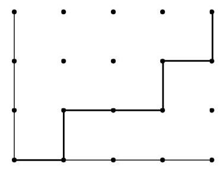
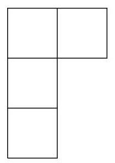

# Combinatorics, computer algebra and Wilcoxon-Mann- Whitney test

Citation for published version (APA):

Di Bucchianico, A. (1996). Combinatorics, computer algebra and Wilcoxon-Mann-Whitney test. (Memorandum COSOR; Vol. 9624). Technische Universiteit Eindhoven.

## Document status and date:

Published: 01/01/1996

## Document Version:

Publisher's PDF, also known as Version of Record (includes final page, issue and volume numbers)

## Please check the document version of this publication:

- A submitted manuscript is the version of the article upon submission and before peer-review. There can be important differences between the submitted version and the official published version of record. People interested in the research are advised to contact the author for the final version of the publication, or visit the DOI to the publisher's website.

• The final author version and the galley proof are versions of the publication after peer review.

- The final published version features the final layout of the paper including the volume, issue and page numbers.

Link to publication

## General rights

Copyright and moral rights for the publications made accessible in the public portal are retained by the authors and/or other copyright owners and it is a condition of accessing publications that users recognise and abide by the legal requirements associated with these rights.

- Users may download and print one copy of any publication from the public portal for the purpose of private study or research. - You may not further distribute the material or use it for any profit-making activity or commercial gain

- You may freely distribute the URL identifying the publication in the public portal.

If the publication is distributed under the terms of Article 25fa of the Dutch Copyright Act, indicated by the “Taverne” license above, please follow below link for the End User Agreement:

www.tue.nl/taverne

## Take down policy

If you believe that this document breaches copyright please contact us at: openaccess@tue.nl providing details and we will investigate your claim. Memorandum COSOR 96-24, 1996, Eindhoven University of Technology

# Combinatorics, computer algebra and Wilcoxon-Mann-Whitney test

A. Di Bucchianico

Department of Mathematics and Computing Science

Eindhoven University of Technology

P. O. Box 513

5600 MB Eindhoven, The Netherlands

sandro@win.tue.nl

URL: http://www.win.tue.nl/win/math/bs/statistics/bucchianico

## Abstract

We show the combinatorics behind the Wilcoxon-Mann-Whitney two-sample test. This yields new combinatorial proofs of recurrences for its null distribution given recently by Brus and Chang, as well as new recurrences. It is shown how to convert these recurrences into generating functions. These generating functions are used to obtain closed expressions for the null distribution when one of the sample sizes is fixed and to compute moments. We also show how to perform these calculations with the aid of the computer algebra system Mathematica.

Keywords Wilcoxon-Mann-Whitney two-sample test, partitions, Gaussian binomial coefficients, computer algebra, generating functions, recurrences.

AMS classification ${05}\mathrm{A}{15},{05}\mathrm{A}{17},{62} - {04},{62}\mathrm{E}{15},{62}\mathrm{E}{30},{62}\mathrm{G}{10},{65}\mathrm{U}{05}$

## 1 Introduction

Let ${X}_{1},\ldots ,{X}_{m}$ and ${Y}_{1},\ldots ,{Y}_{n}$ be independent random samples with continuous distribution functions $F$ and $G$ , respectively. In order to test whether ${X}_{1}$ is stochastically larger than ${Y}_{1}$ , Wilcoxon introduced in [14] the statistic

$$
{W}_{m, n} = \text{sum of the ranks of the}{X}_{i}\text{’s in the combined sample}
$$

Mann and Whitney introduced in [9] the equivalent statistic

$$
{M}_{m, n} = \mathop{\sum }\limits_{{i = 1}}^{m}\# \left\{  {j : {Y}_{j} < {X}_{i}}\right\}
$$

The equivalence of these statistics can be seen as follows. Let ${X}_{\left( i\right) }$ denote the $i$ th order statistic of ${X}_{1},\ldots ,{X}_{m}$ . Then for $i = 2,\ldots , m$ , the ranks of ${X}_{\left( 1\right) },\ldots ,{X}_{\left( i - 1\right) }$ are included in ${W}_{m, n}$ , but not in ${M}_{m, n}$ . Hence, ${W}_{m, n} = {M}_{m, n} + \mathop{\sum }\limits_{{i = 1}}^{m}i = {M}_{m, n} + \frac{1}{2}m\left( {m + 1}\right)$ .

In order to compute critical values and moments of their statistic, Mann and Whitney gave a recurrence relation. A somewhat different recurrence relation was used by Fix and Hodges in [7]. Recently, Brus ([3]) and Chang ([5]) gave new recurrence relations for these statistics. Unfortunately, most of the proofs in [3] and [5] are calculations that do not give insight in the structure of these new recurrence relations. The aim of this paper is to give a combinatorial explanation of these recurrence relations. By doing so, we also find new recurrences and use them to obtain generating functions. From these generating functions we derive moments and solve the open problems on closed formulas for small sample sizes posed by Chang ([5]). We show how these calculations can be performed with the computer algebra system Mathematica ${}^{1}$ . It transpires that the use of computer algebra opens new horizons for nonparametric statistics. Instead of time-consuming calculations with recurrences, exact distributions can be found very fast from generating functions with the aid of a computer algebra system.

## 2 Partitions

In this section we link the distribution of the Mann-Whitney statistic to partitions of integers. We use this combinatorial interpretation of the Mann-Whitney statistic in order to explain its properties. In particular, we explain the recurrence relations given by Brus and Chang in [3] and [5], respectively.

Under ${H}_{0} : F = G$ , all rank orders in the combined sample are equiprobable. Thus,

$$
\mathbf{P}\left( {{M}_{m, n} = k}\right)  = \frac{f\left( {m, n, k}\right) }{\left( \begin{matrix} m + n \\  n \end{matrix}\right) }, \tag{1}
$$

where $f\left( {m, n, k}\right)$ denotes the number ways we can choose a subset of $\{ 0,1,\ldots , n\}$ with $m$ elements such that the elements of this subset add up to $k$ . In combinatorial terminology, $f\left( {m, n, k}\right)$ is nothing but the number of partitions of $k$ with at most $m$ non-zero blocks of maximal size $n$ (see [1] or [6]) ${}^{2}$ . This connection was already noted by Wilcoxon himself, but is hardly used in the statistical literature.

The favourite tool of in combinatorics for studying partitions is the Ferrers diagram (see [1] and [6]). This is a graphical way to represent a partition (see example below). Its statistical counterpart is known in nonparametric statistics as the Gnedenko path (other names are pair chart or PP-plot, see e.g. [11]). The Gnedenko path of the samples ${X}_{1},\ldots ,{X}_{m}$ and ${Y}_{1},\ldots ,{Y}_{n}$ is defined as follows. The Gnedenko path is a path from(0,0)to(m, n)with unit steps to the east direction or north direction. If the $i$ th value of the ordered combined sample comes from ${X}_{1},\ldots ,{X}_{m}$ , then our path goes one unit step east, and one unit step north otherwise. Since we assume that $F$ and $G$ are continuous, the probability of a tie (i.e. the event ${X}_{i} = {Y}_{j}$ ) equals zero. Hence, the Gnedenko path is well-defined almost surely. In terms of the Gnedenko path, the value of the statistic ${M}_{m, n}$ is nothing but the area below the Gnedenko path. This interpretation is the basic idea of our approach.

Example Let $m = 4$ and $n = 3$ and let the ranks of the first sample be1,3,4, and 6 . Then we have the following Gnedenko path:

---

${}^{1}$ Mathematica is a registered trademark of Wolfram Research, Inc.

${}^{2}$ This interpretation is equivalent to the interpretation of ${M}_{m, n}$ in terms of inversions (cf. [2] or [10]). For yet another combinatorial interpretation in terms of Young lattices, see [12].

---

Figure 1: Gnedenko path

The corresponding partition in this case is $0 + 1 + 1 + 2 = 4$ with the following Ferrers diagram.

Figure 2: Ferrers diagram

We now use the Gnedenko path to give simple proofs for properties of the statistic ${M}_{m, n}$ . All proofs could also be given in terms of partitions. Since Gnedenko paths have a clear statistical interpretation, we state our proofs in terms of Gnedenko paths and briefly mention the partition interpretation after each proof.

The first result is the well-known symmetry property of ${M}_{m, n}$ . In spite of its simplicity, it turns out to be useful in Section 4.

Proposition 2.1 The distribution of ${M}_{m, n}$ is symmetric under ${H}_{0} : F = G$ , i.e. $\mathbf{P}\left( {{M}_{m, n} = k}\right)  = \mathbf{P}\left( {{M}_{m, n} = {mn} - k}\right)$ for $k = 0,\ldots ,{mn}$ .

Proof: Each Gnedenko path has a unique representation as an $m$ -tuple $\left\langle  {{v}_{1},\ldots ,{v}_{m}}\right\rangle$ , where ${v}_{i}$ is the maximal vertical distance of the path to the point(i,0). Now associate to each Gnedenko path $w = \left\langle  {{v}_{1},\ldots ,{v}_{m}}\right\rangle$ a new path ${w}^{ * } = \left\langle  {n - {v}_{m},\ldots , n - {v}_{1}}\right\rangle$ . If the area below $w$ equals $k$ , then the area below ${w}^{ * }$ equals ${mn} - k$ . Since the map $w \rightarrow  {w}^{ * }$ is a bijection on the set of Gnedenko paths from(0,0)to(m, n), the result follows.

The partition analogue of this proof is to consider the map that sends a partition $\left( {{\lambda }_{1},\ldots ,{\lambda }_{j}}\right)$ to the partition $\left( {n - {\lambda }_{j},\ldots , n - {\lambda }_{1}}\right)$ .

A similar argument yields another symmetry property that is useful for making statistical tables.

Proposition 2.2 If $F = G$ , then $\mathbf{P}\left( {{M}_{m, n} = k}\right)  = \mathbf{P}\left( {{M}_{n, m} = k}\right)$ for $k = 0,\ldots ,{mn}$ .

Proof: Each Gnedenko path has a unique representation as an $n$ -tuple $\left\langle  {{h}_{1},\ldots ,{h}_{n}}\right\rangle$ , where ${h}_{i}$ is the maximal horizontal distance of the path to the point(m, n - i). Now associate to each Gnedenko path $w = \left\langle  {{h}_{1},\ldots ,{h}_{n}}\right\rangle$ from(0,0)to(m, n)the unique path from(0,0)to(n, m) such that ${h}_{i}$ is the maximal vertical distance of the path to the point(i,0). Since this map is an area preserving bijection from the set of Gnedenko paths from(0,0)to(m, n)to the set of Gnedenko paths from(0,0)to(n, m), the result follows.

The partition analogue of this proof is to consider the conjugate partition (cf. [1, Theorem 1.5]).

As an immediate corollary we obtain the mean of the statistic ${M}_{m, n}$ .

Corollary 2.3 Under ${H}_{0} : F = G$ , we have $E{M}_{m, n} = \frac{mn}{2}$ .

Proof: The result follows directly from Proposition 2.1.

The following lemma will be used often in the sequel (cf. [3, Lemma 2]).

Lemma 2.4 Under ${H}_{0} : F = G$ , we have $\mathbf{P}\left( {{M}_{1, n} = k}\right)  = \frac{1}{n + 1}$ for $k = 0,\ldots , n$ and

$\mathbf{P}\left( {{M}_{m,1} = k}\right)  = \frac{1}{m + 1}$ for $k = 0,\ldots , m.$

Proof: There are $n + 1$ paths from(0,0)to(1, n). Only the path that goes through both the points(0, k)and(1, k)has area $k$ . This proves the first property. The second property follows from the first property by Proposition 2.2.

In terms of partitions, Lemma 2.4 is the trivial assertion that there is only one partition of $k$ with one block.

As we will see in Section 4, there is no closed expression for the distribution of the statistic ${M}_{m, n}$ under ${H}_{0} : F = G$ . Therefore, recursion formulas were used for computations. However, computations with recursions are time-consuming. We will use recursions to obtain closed expressions for generating functions, which lend themselves to fast computations with computer algebra systems. It is more convenient to give recursion formulas for $f\left( {m, n, k}\right)$ (see Formula (1)) than for the distribution ${M}_{m, n}$ itself. Most books on nonparametric statistics only give the following recursion formula which goes back to [9]:

Theorem 2.5 With the initial and boundary conditions

$$
f\left( {m, n, k}\right)  = 0\;\text{ if }k < 0\text{ or }m < 0\text{ or }n < 0,\text{ or }k > {mn}
$$

$$
f\left( {m, n,0}\right)  = 1\;\text{ if }m \geq  0\text{ and }n \geq  0,
$$

we have

$$
f\left( {m, n, k}\right)  = f\left( {m - 1, n, k - n}\right)  + f\left( {m, n - 1, k}\right)  \tag{2}
$$

Proof: Note that $f\left( {m, n, k}\right)$ equals the number of paths from(0,0)to(m, n)with area $k$ . These paths must pass through either(m - 1, n)or through(m, n - 1). In the former case the path from(0,0)to(m - 1, n)has area $k - n$ , in the latter case the path from(0,0)to (m, n - 1)has area $k$ .

The partition analogue of this proof is to look whether the largest block of a partition has size $n$ . Of course, this way of conditioning is crude. Using more refined ways of conditioning, we rediscover the new recurrence formulas of Brus and Chang in [3] and [5].

The first refinement of the conditioning that led to Formula (2) is to condition on the point of the line $x = m - 1$ where the path goes east. This yields Formula 7 of [3].

Theorem 2.6 (Brus) With the initial and boundary conditions

$$
f\left( {m, n, k}\right)  = 0\;\text{ if }k < 0\text{ or }m < 0\text{ or }n < 0,\text{ or }k > {mn}
$$

$$
f\left( {m, n,0}\right)  = 1\;\text{ if }m \geq  0\text{ and }n \geq  0,
$$

we have

$$
f\left( {m, n, k}\right)  = \mathop{\sum }\limits_{{i = 0}}^{n}f\left( {m - 1, i, k - i}\right)  \tag{3}
$$

Proof: If(m - 1, i)is the point where a path with area $k$ goes east, then the part of this path up to(m - 1, i)must have area $k - i$ and blocks of size not exceeding $i$ .

The partition analogue of this proof is to look at the size of the largest block. Instead of looking at the largest block, we may also look at the size of the $j$ largest blocks $\left( {1 \leq  j \leq  n - 1}\right)$ . Formula (3) is more useful than (2), since it only involves terms with $m - 1$ .

Theorem 2.7 (Brus) With the initial and boundary conditions

$$
f\left( {m, n, k}\right)  = 0\;\text{ if }k < 0\text{ or }m < 0\text{ or }n < 0,\text{ or }k > {mn}
$$

$$
f\left( {m, n,0}\right)  = 1\;\text{ if }m \geq  0\text{ and }n \geq  0,
$$

we have

$$
f\left( {m, n, k}\right)  = \mathop{\sum }\limits_{{{i}_{1} = 0}}^{n}\mathop{\sum }\limits_{{{i}_{2} = 0}}^{{i}_{1}}\ldots \mathop{\sum }\limits_{{{i}_{j} = 0}}^{{i}_{j - 1}}f\left( {m - j,{i}_{j}, k - {i}_{1} - \ldots  - {i}_{j}}\right)  \tag{4}
$$

Proof: Fix an arbitrary Gnedenko path. Let $\left( {m - \ell ,{i}_{\ell }}\right)$ be the point on the line $x = m - \ell$ where the path goes east. Then the part of the path up to $\left( {m - j,{i}_{j}}\right)$ has area $k - {i}_{1} - \ldots  - {i}_{j}$ . This yields the result.

Instead of looking at the end of the Gnedenko path (or the largest block of the associated partition), we may also look at the beginning (or the smallest block). This yields the following recursion formulas:

Theorem 2.8 With the initial and boundary conditions

$$
f\left( {m, n, k}\right)  = 0\;\text{ if }k < 0\text{ or }m < 0\text{ or }n < 0,\text{ or }k > {mn}
$$

$$
f\left( {m, n,0}\right)  = 1\;\text{ if }m \geq  0\text{ and }n \geq  0,
$$

we have

$$
f\left( {m, n, k}\right)  = f\left( {m - 1, n, k}\right)  + f\left( {m, n - 1, k - m}\right)  \tag{5}
$$

Proof: The number of paths that pass through(1,0)and have area $k$ is equal to $f\left( {m - 1, n, k}\right)$ . The other paths must go through(0,1). The number of these paths equals the number of paths from(0,1)to(m, n)with area $k - m$ between the path and the line $y = 1$ . Hence, their number equals $f\left( {m, n - 1, k - m}\right)$ .

The partition analogue of this proof is to look whether a partition has precisely $m$ blocks ${}^{3}$ .

Refining this way of conditioning, we obtain Formula 6 of [3] and a new recurrence, which is an analogue of (4).

Theorem 2.9 (Brus) With the initial and boundary conditions

$$
f\left( {m, n, k}\right)  = 0\;\text{ if }k < 0\text{ or }m < 0\text{ or }n < 0,\text{ or }k > {mn}
$$

$$
f\left( {m, n,0}\right)  = 1\;\text{ if }m \geq  0\text{ and }n \geq  0,
$$

we have

$$
f\left( {m, n, k}\right)  = \mathop{\sum }\limits_{{i = 0}}^{n}f\left( {m - 1, n - i, k - {im}}\right)  \tag{6}
$$

Proof: Fix an arbitrary Gnedenko path. If(0, i)is the point where a path with area $k$ goes east, then the remaining path from(1, i)to(m, n)must have area $k - {im}$ between the path and the line $y = i$ .

Theorem 2.10 With the initial and boundary conditions

$$
f\left( {m, n, k}\right)  = 0\;\text{ if }k < 0\text{ or }m < 0\text{ or }n < 0,\text{ or }k > {mn}
$$

$$
f\left( {m, n,0}\right)  = 1\;\text{ if }m \geq  0\text{ and }n \geq  0,
$$

we have

$$
f\left( {m, n, k}\right)  = \mathop{\sum }\limits_{{{i}_{j} = 0}}^{n}\mathop{\sum }\limits_{{{i}_{j - 1} = 0}}^{{i}_{j}}\ldots \mathop{\sum }\limits_{{{i}_{1} = 0}}^{{i}_{2}}f\left( {m - j, n - {i}_{j}, k - {i}_{1} - \ldots  - {i}_{j - 1} - {i}_{j}\left( {m - j + 1}\right) }\right)  \tag{7}
$$

Proof: Fix an arbitrary Gnedenko path. Let $\left( {\ell  - 1,{i}_{\ell }}\right)$ be the point on the line $x = \ell  - 1$ where the path goes east. Then the part of the path up to $\left( {j,{i}_{j}}\right)$ has area $k - {i}_{1} - \ldots  - {i}_{j}$ . The part of the path from $\left( {j,{i}_{j}}\right)$ to(m, n)has area $k - \left( {m - j}\right) {i}_{j}$ between the line $y = {i}_{j}$ and the path. Combining this yields the result.

It is possible to obtain more recurrences by other ways of conditioning (e.g., on the size of the largest square below the Gnedenko path) or by applying Proposition 2.1. However, such recurrences do not seem to be useful for statistical purposes.

So far we only considered recurrences for the probability mass function of the statistic ${M}_{m, n}$ . Summing these recurrences, we see that the same recurrences (but with different initial and boundary conditions) also hold for the cumulative distribution function of ${M}_{m, n}$ . We summarize these recurrences in the next theorem.

---

${}^{3}$ In combinatorics, blocks of size 0 are usually not allowed in the definition of partition.

---

Theorem 2.11 Let $A\left( {m, n, k}\right)$ be the number of partitions of all integers not exceeding $k$ with at most $m$ nonzero blocks, each of size at most $n$ . Under the initial and boundary conditions

$$
A\left( {m, n, k}\right)  = 0
$$

$$
\text{if}k < 0\text{or}m < 0\text{or}n < 0
$$

$$
A\left( {m, n,0}\right)  = 1
$$

$$
\text{if}m \geq  0\text{and}n \geq  0
$$

$$
A\left( {0, n, k}\right)  = 1
$$

$$
\text{if}k \geq  0\text{and}n \geq  0
$$

$$
A\left( {m,0, k}\right)  = 1
$$

$$
\text{if}k \geq  0\text{and}m \geq  0
$$

$$
A\left( {m, n, k}\right)  = \left( \begin{matrix} m + n \\  n \end{matrix}\right)
$$

$$
\text{if}k > {mn}\text{and}m > 0\text{and}n > 0
$$

we have

$$
A\left( {m, n, k}\right)  = A\left( {m - 1, n, k - n}\right)  + A\left( {m, n - 1, k}\right)  \tag{8}
$$

$$
A\left( {m, n, k}\right)  = A\left( {m - 1, n, k}\right)  + A\left( {m, n - 1, k - m}\right)  \tag{9}
$$

$$
A\left( {m, n, k}\right)  = \mathop{\sum }\limits_{{i = 0}}^{n}A\left( {m - 1, i, k - i}\right)  \tag{10}
$$

$$
A\left( {m, n, k}\right)  = \mathop{\sum }\limits_{{i = 0}}^{n}A\left( {m - 1, n - i, k - {im}}\right)  \tag{11}
$$

$$
A\left( {m, n, k}\right)  = \mathop{\sum }\limits_{{{i}_{1} = 0}}^{n}\mathop{\sum }\limits_{{{i}_{2} = 0}}^{{i}_{1}}\ldots \mathop{\sum }\limits_{{{i}_{j} = 0}}^{{i}_{j - 1}}A\left( {m - j,{i}_{j}, k - {i}_{1} - \ldots  - {i}_{j}}\right)  \tag{12}
$$

$$
A\left( {m, n, k}\right)  = \mathop{\sum }\limits_{{{i}_{j} = 0}}^{n}\mathop{\sum }\limits_{{{i}_{j - 1} = 0}}^{{i}_{j}}\ldots \mathop{\sum }\limits_{{{i}_{1} = 0}}^{{i}_{2}}A\left( {m - j, n - {i}_{j}, k - {i}_{1} - \ldots  - {i}_{j - 1} - {i}_{j}\left( {m - j + 1}\right) }\right) \left( {13}\right)
$$

(14)

Proof: Sum the recurrences (2),(3),(4),(5),(6), and (7) with respect to $k$ .$\square$ .

For their calculation of significance probabilities of the Mann-Whitney statistic, Fix and Hodges ([7]) used another approach to obtain recurrences for the cumulative distribution function of ${M}_{m, n}$ . Their idea, which goes back to [14], is to express the function $A\left( {m, n, k}\right)$ , which counts restricted partitions, in terms of unrestricted partitions. Fix and Hodges only used the first of the following recurrences; the second and third recurrences were given in [3].

Theorem 2.12 Let ${A}_{0}\left( {r, m}\right)$ be the number of partitions of integers not exceeding $r$ with at most $m$ blocks. With the initial and boundary conditions

$$
{A}_{0}\left( {r, m}\right)  = 0
$$

$$
\text{if}r < 0\text{or}m \leq  0
$$

$$
{A}_{0}\left( {0, m}\right)  = 1
$$

$$
\text{if}m > 0
$$

$$
{A}_{0}\left( {r,1}\right)  = r + 1
$$

$$
\text{if}r \geq  0
$$

we have

$$
{A}_{0}\left( {r, m}\right)  = {A}_{0}\left( {r, m - 1}\right)  + {A}_{0}\left( {r - m, m}\right)  \tag{15}
$$

$$
{A}_{0}\left( {r, m}\right)  = \mathop{\sum }\limits_{i}{A}_{0}\left( {r - {mi}, m - 1}\right)  \tag{16}
$$

$$
{A}_{0}\left( {r, m}\right)  = \mathop{\sum }\limits_{{k}_{1}}\ldots \mathop{\sum }\limits_{{k}_{j}}{A}_{0}\left( {r - {k}_{1} - \ldots  - {k}_{j} - \left( {m - j}\right) , m - j}\right)  \tag{17}
$$

$$
{A}_{0}\left( {r, m}\right)  = \mathop{\sum }\limits_{i}A\left( {r - i, m - 1, i}\right)  \tag{18}
$$

$$
{A}_{0}\left( {r, m}\right)  = \mathop{\sum }\limits_{{{k}_{1} = 1}}^{r}\mathop{\sum }\limits_{{{k}_{2} = 1}}^{{k}_{1}}\ldots \mathop{\sum }\limits_{{{k}_{j} = 1}}^{{k}_{j - 1}}A\left( {r - {k}_{1} - \ldots  - {k}_{j}, m - j,{k}_{j}}\right)  \tag{19}
$$

Proof: The first three recurrences come from conditioning on the size of the smallest blocks as follows:

- Check whether the partition has exactly $m$ non-zero blocks, i.e. the first block must be non-zero.

- Condition on the size of the smallest block.

- Condition on the size of the $j$ smallest blocks.

The remaining two recurrences come from conditioning on the size of the largest blocks ${}^{4}$ . Note that removing the largest blocks put restrictions on the sizes of the remaining blocks.

- Condition on the size of the largest block.

- Condition on the size of the $j$ largest blocks.

## 3 Moments of the Mann-Whitney statistic

Generating functions are important in both statistics and combinatorics. Their importance is growing due to availability of computer algebra systems. Let us look at the generating function of $f\left( {m, n, k}\right)$ with respect to $k$ . This generating function goes back to Gauss (see [1, p. 51]) and was rediscovered in the context of lattice path counting by Pólya (see [10]).

Theorem 3.1 The probability generating function of the Mann-Whitney statistic ${M}_{m, n}$ is given by

$$
\mathop{\sum }\limits_{{k = 0}}^{{mn}}\mathbf{P}\left( {{M}_{m, n} = k}\right) {q}^{k} = \frac{1}{\left( \begin{matrix} m + n \\  n \end{matrix}\right) }\frac{{\left( q;q\right) }_{n + m}}{{\left( q;q\right) }_{n}{\left( q;q\right) }_{m}} = \frac{{\left\lbrack  \begin{matrix} n \\  m \end{matrix}\right\rbrack  }_{q}}{\left( \begin{matrix} m + n \\  n \end{matrix}\right) } \tag{20}
$$

where ${\left( a;b\right) }_{n} = \left( {1 - a}\right) \left( {1 - {ab}}\right) \ldots \left( {1 - a{b}^{n - 1}}\right)$ . In particular, ${\left( q;q\right) }_{n} = \left( {1 - q}\right) \left( {1 - {q}^{2}}\right) \ldots (1 -$ $\left. {q}^{n}\right)$ .

---

${}^{4}$ Note that there is no analogue of Theorem 2.8, because there is only one partition of $r$ such that the size of the largest block equals $r$ .

---

Proof: See [1, Chapter 3] for a proof based on recurrences or [2, Chapter 11, pp. 203-204] for a proof based on inversions.

The number ${\left\lbrack  \begin{matrix} n \\  m \end{matrix}\right\rbrack  }_{q}$ is called Gaussian binomial coefficient. It is a generalization of the ordinary binomial coefficient, since if $q$ tends to 1, then the limit is the ordinary binomial coefficient (see e.g., [1, Theorem 3.2]). Note that the Gaussian binomial coefficient is a polynomial in $q$ of degree ${mn}$ , since $k \leq  {mn}$ . A simple proof for the asymptotic normality of the statistic ${M}_{m, n}$ based on Theorem 3.1 is given in [13]; the original proof of this result can be found in [9]. For another use of Gaussian binomial coefficients in statistics, see [8].

We will now show how to use Theorem 3.1 for computing moments of ${M}_{m, n}$ . Since the calculations are very laborious, we will use the computer algebra system Mathematica. For the sake of illustration, we recalculate the mean (cf. Corollary 2.3). The following calculation is a slight improvement on a calculation shown to me by René Swarttouw (personal communication).

Recall that the mean is the derivative of the right-hand side of (20). We first define

$$
{G}_{m, n}\left( q\right)  \mathrel{\text{:=}} \frac{\left( {1 - {q}^{n + 1}}\right) \ldots \left( {1 - {q}^{n + m}}\right) }{\left( {1 - q}\right) \ldots \left( {1 - {q}^{m}}\right) }.
$$

Thus,

$$
\log {G}_{n, m}\left( q\right)  = \mathop{\sum }\limits_{{k = 1}}^{m}\log \left( {1 - {q}^{n + k}}\right)  - \mathop{\sum }\limits_{{k = 1}}^{m}\log \left( {1 - {q}^{k}}\right) .
$$

It now follows that

$$
\frac{\frac{d}{dq}{G}_{n, m}\left( q\right) }{{G}_{n, m}\left( q\right) } = \frac{d}{dq}\log {G}_{n, m}\left( q\right)  = \mathop{\sum }\limits_{{k = 1}}^{m}\frac{k{q}^{k - 1}}{1 - {q}^{k}} - \mathop{\sum }\limits_{{k = 1}}^{m}\frac{\left( {n + k}\right) {q}^{n + k - 1}}{1 - {q}^{n + k}}.
$$

This yields the following expression for the derivative of ${G}_{m, n}$ :

$$
\frac{d}{dq}{G}_{n, m}\left( q\right)  = {G}_{n, m}\left( q\right) \mathop{\sum }\limits_{{k = 1}}^{m}\frac{k{q}^{k - 1}\left( {1 - {q}^{n + k}}\right)  - \left( {n + k}\right) {q}^{n + k - 1}\left( {1 - {q}^{k}}\right) }{\left( {1 - {q}^{k}}\right) \left( {1 - {q}^{n + k}}\right) }.
$$

Since ${G}_{n, m}$ is a polynomial in $q$ , we may take the limit $q \rightarrow  1$ in order to find ${G}_{m, n}^{\prime }\left( 1\right)$ . The factor ${G}_{n, m}\left( q\right)$ tends to $\left( \begin{matrix} n + m \\  n \end{matrix}\right)$ as $q \rightarrow  1$ . Hence, it remains to calculate

$$
\mathop{\lim }\limits_{{q \rightarrow  1}}\frac{k{q}^{k - 1}\left( {1 - {q}^{n + k}}\right)  - \left( {n + k}\right) {q}^{n + k - 1}\left( {1 - {q}^{k}}\right) }{\left( {1 - {q}^{k}}\right) \left( {1 - {q}^{n + k}}\right) }.
$$

This limit could be evaluated by applying L' Hôpital's rule twice, as done by René Swarttouw. However, this involves a tedious computation of second derivatives, which can be avoided as follows. First simplify the numerator by pulling out a factor ${q}^{k - 1}$ and expanding the remaining terms. In this way we may rewrite the numerator as $k\left( {1 - {q}^{n}}\right)  - n{q}^{n}\left( {1 - {q}^{k}}\right)$ . Then simplify the denominator by using that $\left( {1 - {q}^{\ell }}\right)  = \left( {1 - q}\right) \left( {1 + q + \ldots  + {q}^{\ell  - 1}}\right)$ . The limit then reduces to

$$
\frac{1}{k\left( {n + k}\right) }\mathop{\lim }\limits_{{q \rightarrow  1}}\frac{k\left( {1 + \ldots  + {q}^{n - 1}}\right)  - n\left( {{q}^{n} + \ldots  + {q}^{n + k - 1}}\right) }{1 - q},
$$