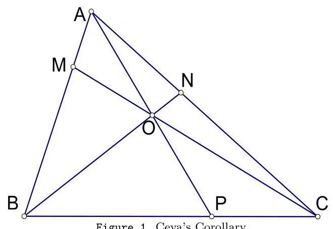
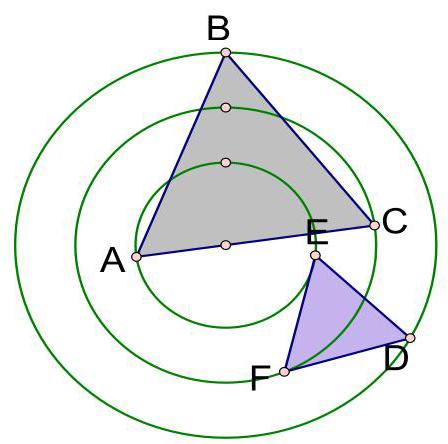
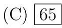
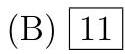
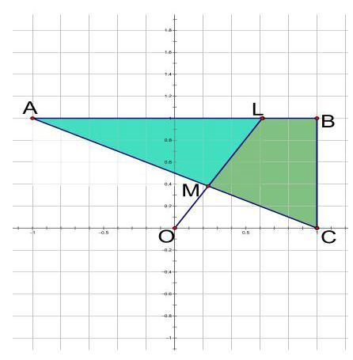
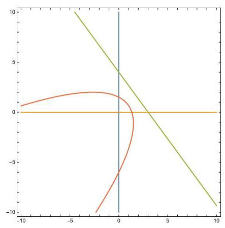
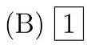
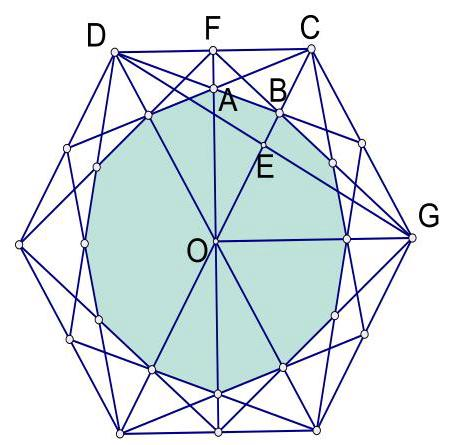
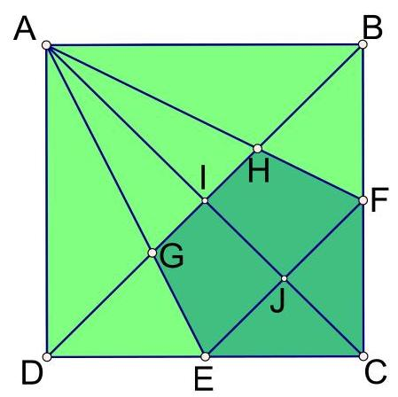

# Forty-seventh Annual Columbus State Invitational Mathematics Tournament

Sponsored by

The Columbus State University

Department of Mathematics

March 6 ${}^{th}$ , 2021

**************************

## Important notation and facts to consider on this test

All numbers when referred to their digits are considered written in base 10 unless otherwise stated.

- ${2021} = {2025} - 4 = {45}^{2} - {2}^{2} = {47} \times  {43}$ (prime factorization)

- $\left\lbrack  {{XYZW}\ldots }\right\rbrack$ means the area of the polygon ${XYZW}\ldots$

- Corollary to Ceva’s Theorem: Given triangle ${ABC}$ and three Cevians $\overline{AP},\overline{BN}$ , and $\overline{CM}$ , concurrent at $O$ (see Figure 1), then

$$
\frac{OA}{OP} = \frac{MA}{MB} + \frac{NA}{NC}.
$$

1. Given three concentric circles of radii $a, b$ and $c$ , there exists an equilateral triangle of side lengths equal to $x$ and with vertices on these circles, as in the adjacent figure, if and only if

$$
{x}^{4} + {a}^{4} + {b}^{4} + {c}^{4} - {x}^{2}{a}^{2} - {x}^{2}{b}^{2} =
$$

(1)

$$
{x}^{2}{c}^{2} + {a}^{2}{b}^{2} + {b}^{2}{c}^{2} + {c}^{2}{a}^{2}.
$$

If $a = 3, b = 5$ and $c = 7$ , there are two solutions for $x$ . One is $x = 8$ and the other is given by the equation ${x}^{2} = d$ . What is the value of $d$ ?

(A) 17 (B) 18

(D) 20 (E) 21

Solution: (Method I) Substituting the given values of $a, b$ and $c$ in (1) we get $0 =$ ${1216} - {83}{x}^{2} + {x}^{4}$ and after the given factor is used we get $0 = \left( {{x}^{2} - {64}}\right) \left( {{x}^{2} - {19}}\right)$ . Hence the answer is $C$ .

(Method II) The equation is biquadratic and so it factors as $\left( {{x}^{2} - {64}}\right) \left( {{x}^{2} - d}\right)  = 0$ this means ${64} + d = {a}^{2} + {b}^{2} + {c}^{2} = 9 + {25} + {49}$ and so $d = {83} - {64} = {19}$ .

2. Find the smallest natural number $n$ such that there exists a choice of the signs that makes the following equality true

$$
\pm  1 \pm  2 \pm  3 + \cdots  \pm  n = {2021}\text{.}
$$

(A) 63 (B) 64 (D) 69 (E) 73

Solution: Answer is $C$ . Since $\mathop{\sum }\limits_{{k = 1}}^{{63}} = \frac{{63} \cdot  {64}}{2} = {2016} < {2021}, n = {63}$ is not going to cut it. For $n = {64}$ the corresponding sum, independent of the choice of signs, it is going to be an even number and so it cannot be 2021. For $n = {65}$ we have

$$
{2021} = \left( {\mathop{\sum }\limits_{{k = 1}}^{{65}}k}\right)  - 2\left( {{61} + 1}\right) .
$$

3. Suppose that for three real numbers $x, y$ and $z$ , we have $x + y + z = 3,{x}^{2} + {y}^{2} + {z}^{2} = {19}$ , and ${x}^{3} + {y}^{3} + {z}^{3} = {84}$ . What is the value of ${xyz}$ ?

(A) 1 (B) 2 (C) 3 (D) 4 (E) 5

Solution: Since $9 = {\left( x + y + z\right) }^{2} = {19} + 2\left( {{xy} + {yz} + {xz}}\right)$ it follows that ${xy} + {yz} + {xz} =  - 5$ . Another identity that we can use here is

$$
{x}^{3} + {y}^{3} + {z}^{3} - {3xyz} = \left( {x + y + z}\right) \left( {{x}^{2} + {y}^{2} + {z}^{2} - {xy} - {yz} - {xz}}\right)  \Rightarrow
$$

$$
{3xyz} = {84} - 3\left( {{19} + 5}\right)  = 3\left( {{28} - {24}}\right)  = 3\left( 4\right) .
$$

Therefore, we have ${xyz} = 4$ , and so the correct answer is $D$ .

4. The function $f$ is real valued defined on the whole real line and satisfies $f\left( {f\left( x\right) }\right)  = \frac{{3}^{x} - 1}{2}$ for all $x$ . Knowing that $f$ is (strictly) decreasing, find $f\left( 1\right)$ .

(A) 0 (B) 1 (C) 3 (D) $1/3$ (E) -1

Solution: We observe that $f$ is one-to-one, and so it must be strictly decreasing. Let us consider the function defined on the whole real line given by $g\left( x\right)  = \frac{{3}^{x} - 1}{2}$ for all $x$ . We notice that ${g}^{\prime \prime }\left( x\right)  = \frac{1}{2}{3}^{x}{\left( \ln 3\right) }^{2} > 0$ for all $x$ . Hence, $g$ is a convex function. We observe that if $f\left( 1\right)  = a$ then $f\left( a\right)  = f\left( {f\left( 1\right) }\right)  = g\left( 1\right)  = 1$ . Also, we have $g\left( 0\right)  = 0$ . Becasue $g$ is a convex function the equation $g\left( x\right)  = x$ must have at most two solutions. In other words,0 and 1 are the only solutions of the equation $g\left( x\right)  = x$ . On the other hand, $g\left( a\right)  = f\left( {f\left( a\right) }\right)  = f\left( 1\right)  = a$ and so $a$ must be 1 or 0 . Let’s say $a = 1$ . Then $f\left( 0\right)  = b$ implies $f\left( b\right)  = f\left( {f\left( 0\right) }\right)  = 0$ and so $g\left( b\right)  = f\left( 0\right)  = b$ . Therefore, $b$ is 0 or 1 . We cannot have $b = 1$ since $f$ is one-to-one. Then $b = 0$ and again this is in contradiction with $f$ being decreasing $\left( {f\left( 0\right)  > f\left( 1\right) }\right)$ . It remains that $a = 0$ and the asnwer is $A$ .

5. A set $S$ is built with only applying any of the following rules:

(a) $2 \in  S$

(b) if $t \in  S$ then $t + 5$ is also in $S$

(c) if $t \in  S$ then ${3t}$ is also in $S$ .

The number time the rules are applied is not limited and it is irrelevant. What is the greatest number $n, n \leq  {2021}$ , which is not in $S$ ?

(A) 2021 (B) 2020 (C) 2019 (D) 2018 (E) 2017

Solution: The number 2021 is in $S$ , since we can use the rules to get $7 = 2 + 5 \in  S$ , ${21} = 7 \cdot  3 \in  S,{26} = {21} + 5 \in  S$ and ${31} = {26} + 5 \in  S,\ldots ,{2016} + 5 = {2021} \in  S$ . However, the number 2020 can only be in $S$ if 2015 was in $S$ . Then this is predicated by ${2010} \in  S$ . At this point 2010 is divisible by 3, so we may have ${2010}/3 = {670} \in  S$ . In any case, what rules we use to go back the numbers on the way are always ending in 0 or 5 . As a result, the resulting sequences canont be traced back to 2 . So, 2020 cannot be in $S$ . Therefore, the answer is $B$ .

6. The set $A = \{ 1,{48},{95},\ldots \}$ is the arithmetic progression of common difference of 47 and initial term 1, and the set $B = \{ 2,{45},{88},\ldots \}$ is the arithmetic progression of common difference of 43 and initial term 2 . If the elements of the intersection $A \cap  B$ are listed in non-decreasing order, $A \cap  B = \left\{  {{a}_{1},{a}_{2},{a}_{3},\ldots }\right\}$ , find the sum of the digits of ${a}_{2}$ .

(A) 15 (B) 16 (C) 17 (D) 18 (E) 19

Solution: We have the sequence in $A$ given by ${a}_{n} = 1 + {47}\left( {n - 1}\right) , n = 1,2,\ldots$ and the sequence in $B$ given by the formula ${b}_{m} = 2 + {43}\left( {m - 1}\right)$ . The common elements can be written as

$$
1 + {47}\left( {n - 1}\right)  = 2 + {43}\left( {m - 1}\right)  \Leftrightarrow  {47}\left( {n - 1}\right)  - {43}\left( {m - 1}\right)  = 1.
$$

The key observation here is ${47} = {43} + 4$ and so we have

$$
{43}\left( {n - 1}\right)  + 4\left( {n - 1}\right)  - {43}\left( {m - 1}\right)  = 1 \Leftrightarrow  {43}\left( {n - m}\right)  + 4\left( {n - 1}\right)  = 1,
$$

which has a simple solution $n - m =  - 1$ and $n - 1 = {11}$ (or $n = {12}$ ). Thus $m =$ $n + 1 = {13}$ , which give the first term in the intersection $A \cap  B,{a}_{12} = 1 + {47}\left( {11}\right)  = {518}$ and ${b}_{13} = 2 + {43}\left( {12}\right)  = {518}$ . Therefore, the elements in the intersection $A \cap  B$ are of the form ${a}_{n} = {518} + {47}\left( {n - 1}\right)  = {518} + {43}\left( {m - 1}\right)$ with $n = {12},\ldots$ and $m = {13},\ldots$ In fact we see that $n - 1 = {43}\left( {k - 1}\right)$ and so the common elements are of the form ${c}_{k} = {518} + {2021}\left( {k - 1}\right) , k = 1,2,3,\ldots$ So, ${c}_{2} = {2539}$ which gives the answer to this problem

$$
{sd}\left( {c}_{2}\right)  = {sd}\left( {2539}\right)  = 2 + 5 + 3 + 9 = {19}.
$$

7. Two real numbers $x$ and $y$ satisfy

$$
{x}^{2} + {xy} + {y}^{2} - x + y + 1 = 0.
$$

What is the value of ${2x} + y$ ?

(A) 1 (B) 2 (C) 3 (D) 4 (E) 5

Solution: The equation can be written as

$$
{\left( x + y\right) }^{2} + {\left( x - 1\right) }^{2} + {\left( y + 1\right) }^{2} = 0.
$$

The only real numbers satisfying this are $x = 1$ and $y =  - 1$ . This implies that ${2x} + y = 1$ . Hence we have $A$ as the correct answer.

8. A fly starts at the origin (of the coordinates plane) and goes 1 unit up, $\frac{1}{2}$ unit right, $\frac{1}{4}$ unit down, $\frac{1}{8}$ unit left, $\frac{1}{16}$ unit up, etc., all the way to infinity. Let $P = \left( {\frac{m}{n},\frac{p}{n}}\right)$ be the coordinates of the point where it ends up (the two coordinates are rational numbers written in reduced form). What is $m + p - n$ ?

(B) 2 (C) 3 (D) 4 (E) 5

Solution: Let us write the sequence of positions as a sum of multiples of the basis of vectors $u = \langle 1,0\rangle$ and $v = \langle 0,1\rangle$ . So, at the beginning we have $v$ , and then $v + \frac{1}{2}u$ , followed by $v + \frac{1}{2}u - \frac{1}{4}v$ . We can see the point $P$ is the result of an infinite sum that can be written as

$$
v + \frac{1}{2}u - \frac{1}{4}v - \frac{1}{8}u + \frac{1}{16}v + \frac{1}{32}u - \frac{1}{64}v - \frac{1}{128}u + \ldots \text{ or }
$$

$$
\left( {1 - \frac{1}{4} + \frac{1}{16} - \frac{1}{64} + \ldots }\right) v + \left( {\frac{1}{2} - \frac{1}{8} + \frac{1}{32} - \frac{1}{128} + \ldots }\right) u.
$$

But the two infinite sums are classical geometric series that can be calculated with the

formula

$$
1 + r + {r}^{2} + {r}^{3} + \ldots  = \frac{1}{1 - r},\;\left| r\right|  < 1.
$$

In this cases, $r =  - \frac{1}{4}$ , and then we can continue

$$
\overrightarrow{OP} = \frac{1}{1 - \left( {-\frac{1}{4}}\right) }v + \frac{1}{2} \cdot  \frac{1}{1 - \left( {-\frac{1}{4}}\right) }u = \frac{4}{5}v + \frac{2}{5}u.
$$

Hence, we have $m = 2, n = 5$ and $p = 4$ . This gives the answer $A$ .

9. The cubic equation ${x}^{3} - {36}{x}^{2} + {ax} - {1428} = 0$ has three solutions in arithmetic progression. Find the sum of the digits of $a$ .

(A) 10 (B) 11 (C) 12 (D) 13 (E) 14

Solution: We can denote the solutions as ${x}_{1} = a - t,{x}_{2} = a$ , and ${x}_{3} = a + t$ . Using Viète’s Relations we see that ${x}_{1} + {x}_{2} + {x}_{3} = {36}$ or ${3a} = {36}$ which gives $a = {12}$ . Also, we have ${x}_{1}{x}_{2}{x}_{3} = {1428}$ or $\left( {{144} - {t}^{2}}\right) {12} = {1428}$ . Solving for $t$ we obtain $t =  \pm  5$ . Then the coefficient $a$ is obtained by

$$
\left( {{x}_{1} + {x}_{3}}\right) {x}_{2} + {x}_{1}{x}_{3} = 2{a}^{2} + {a}^{2} - {t}^{2} = 3{a}^{2} - {25} = {407},
$$

which gives the answer $B$ .

10. The number abcdefg is formed with only the digits 1 and 2 (in base 10) and it is divisible by 128 . What is $a + b + c + d + e + f + g$ ?

(A) 10 (C) 12 (D) 13 (E) 14

Solution: Let us denote the number ${abcdefg}$ by $N$ . First we observe that $g$ must be equal to 2 since $N$ must be even. Then ${f2} = N - {100}$ abcde is divisible by ${2}^{2}$ which forces $f = 1$ . Next, we have

$$
{e12} = N - {1000}\mathrm{{abcd}}\text{divisible by}{2}^{3}\text{.}
$$

This gives $e = 1$ . We can continue this way until we determine all the digits of $N$ : $N = {2122112}$ . Therefore, the sum of the digits of $N$ is 11 .

11. In the accompaning figure the coordinates of the triangle ${ABC}$ are $A = \left( {-1,1}\right)$ , $B = \left( {1,1}\right)$ and $C = \left( {1,0}\right)$ . We denote the slope $m$ of the line $\overline{LM}$ which passes through the origin of the axis, the point $\mathrm{O}$ , and divides the area of the triangle ${ABC}$ in half. The equation that $m$ satisfies is the quadratic ${x}^{2} - x - \alpha  = 0$ . What is the value of $\alpha$ ?

(B) $\frac{2}{3}$ (C) $\frac{3}{2}$

(D) 2 (E) $\frac{5}{4}$

Solution: First let us observe that $\left\lbrack  {ABC}\right\rbrack   = \frac{{AB} \cdot  {BC}}{2} = 1$ . The equation of the line $O - M - L$ is $y = {mx}$ , and the equation of $A - M - C$ is $y = \frac{1 - x}{2}$ . It is easy to see that $L$ has coordinates $\left( {\frac{1}{m},1}\right)$ .

The point $M$ has the $x$ -coordinate the solution of ${mx} = \frac{1 - x}{2}$ or ${x}_{M} = \frac{1}{{2m} + 1}$ . Then its $y$ -coordinate is ${y}_{M} = m{x}_{M} = \frac{m}{{2m} + 1}$ . We can calculate the height of the triangle ${ALM}$ corresponding to the base ${AL}$ and vertex $M$ as $1 - {y}_{M} = \frac{m + 1}{{2m} + 1}$ . So, the area of ${AML}$ gives the equation in $m$ :

$$
\left\lbrack  {AML}\right\rbrack   = \frac{1}{2} \Rightarrow  \left( {1 + \frac{1}{m}}\right) \frac{m + 1}{{2m} + 1} = 1 \Rightarrow
$$

$$
{\left( m + 1\right) }^{2} = 2{m}^{2} + m \Rightarrow  {m}^{2} - m - 1 = 0.
$$

Therefore, the correct answer is $A$ .

Remark: In fact, $m$ is the Golden ratio.

12. How many pairs of positive integers(x, y)satisfy ${x}^{2} - {y}^{2} = {2021}^{2}$ ?

(A) 1 (B) 2 (C) 3 (D) 4 (E) 5

Solution: The equation can be written as $\left( {x - y}\right) \left( {x + y}\right)  = {43}^{2} \cdot  {47}^{2}$ . The number of divisors of ${2021}^{2}$ is then $\left( {2 + 1}\right) \left( {2 + 1}\right)  = 9$ . So, with the exception of 2021 we can group them in 4 pairs $\left( {d,{2021}^{2}/d}\right)$ . Each such pair gives a solution for(x, y)since the system $x - y = d$ and $x + y = {2021}^{2}/d$ is going to have positive integer solutions. Therefore, the number of solutions is 4 and the answer is $D$ .

13. Rolling four regular dice (unbiased, and faces numbered from 1 to 6), the probability to cast a sum of 15 is equal to $\mathcal{P} = \frac{m}{n}$ for some positive integers $m$ and $n$ . Assuming the fraction $\frac{m}{n}$ is written in reduced form, what is $n - m$ ?

(A) 234 (B) 267 (C) 212 (D) 256 (E) 289

Solution: The number of all possible events is ${6}^{4} = {1296}$ . The number of favorable events is equal to the coefficient of ${x}^{15}$ in the expansion of ${\left( x + {x}^{2} + {x}^{3} + {x}^{4} + {x}^{5} + {x}^{6}\right) }^{4}$ . This is the same as the coefficient of ${x}^{11}$ in the expansion of ${\left( 1 + x + {x}^{2} + {x}^{3} + {x}^{4} + {x}^{5}\right) }^{4}$ . It is not hard to see that ${\left( 1 + x + {x}^{2} + {x}^{3} + {x}^{4} + {x}^{5}\right) }^{2}$ is equal to

$$
1 + {2x} + 3{x}^{2} + 4{x}^{3} + 5{x}^{4} + 6{x}^{5} + 5{x}^{6} + 4{x}^{7} + 3{x}^{8} + 2{x}^{9} + {x}^{10}.
$$

So, the coefficient of ${x}^{11}$ in the expansion of ${\left( 1 + x + {x}^{2} + {x}^{3} + {x}^{4} + {x}^{5}\right) }^{4}$ is equal to

$$
2\left( {2 \cdot  1 + 3 \cdot  2 + 4 \cdot  3 + 5 \cdot  4 + 6 \cdot  5}\right)  = {140}.
$$

This implies that $\mathcal{P} = \frac{140}{1296} = \frac{35}{324}$ which gives $n - m = {324} - {35} = {289}$ .

14. It is known that every positive integer can be written as a sum of non-consecutive Fibonacci numbers $\left( {{F}_{1} = 1,{F}_{2} = 1,{F}_{n + 1} = {F}_{n} + {F}_{n - 1}, n \geq  2}\right)$ in an unique way. Taking into consideration this writing for 2021,

$$
{2021} = {F}_{{n}_{1}} + {F}_{{n}_{2}} + \cdots  + {F}_{{n}_{k}},
$$

find $k$ .

(A) 5 (B) 4 (C) 3 (D) 2 (E) 1

Solution: Answer $B$ . One can check that

$$
{2021} = {F}_{17} + {F}_{14} + {F}_{9} + {F}_{7}.
$$

15. The equation of the parabola (see the red curve in the figure on the right) with focus (0,0)and directrix the line of equation $\frac{x}{3} +$ $\frac{y}{4} = 1$ is

$$
{\left( 3x - 4y\right) }^{2} + a\left( {{4x} + {3y}}\right)  = {b}^{2}.
$$

What is the value of $\frac{a}{b}$ ?

(A) 1 (B) 2 (C) 3

(D) 4 (E) 5

Solution: The equation of the parabola is given by the property that it is the locus of the points equally distant to the focus and the directrix. Hence the equation is

$$
\sqrt{{x}^{2} + {y}^{2}} = \frac{\left| \frac{x}{3} + \frac{y}{4} - 1\right| }{\sqrt{\frac{1}{{3}^{2}} + \frac{1}{{4}^{2}}}} \Leftrightarrow  {25}\left( {{x}^{2} + {y}^{2}}\right)  = {\left( 4x + 3y - {12}\right) }^{2} \Leftrightarrow
$$

$$
{\left( 3x - 4y\right) }^{2} + {24}\left( {{4x} + {3y}}\right)  = {144} = {12}^{2}.
$$

Hence, we have $a/b = 2$ , and so the correct answer is $B$ .

16. The sum of two real numbers is $n$ and the sum of their squares is $n + {2021}$ , for some positive integer $n$ . What is the maximum possible value of $n$ ?

64 (B) 66 (C) 63 (D) 67 (E) 62

Solution: If we denote by $x$ and $y$ those two real numbers, we have the system $x + y = n$ and ${x}^{2} + {y}^{2} = n + {2021}$ . We need to have $2\left( {{x}^{2} + {y}^{2}}\right)  - {\left( x + y\right) }^{2} = {\left( x - y\right) }^{2} \geq  0$ so $2\left( {n + {2021}}\right)  - {n}^{2} \geq  0$ . This last inequality is equivalent to ${\left( n - 1\right) }^{2} \leq  {4043}$ or $n \leq  1 + \sqrt{4043} \approx  {64.5846}$ . So, we may try $n = {64}$ and we get indeed two real solutions of the system:

$$
x = {32} + \frac{\sqrt{74}}{2}\text{ and }y = {32} - \frac{\sqrt{74}}{2}.
$$

Hence, the answer is $A$ .

17. A box has 6 red balls and 3 blue balls. Bill picks one ball at the time, from the box, without replacement, until all of balls of the same color are out. If $\frac{p}{q}$ is the probability that the last ball Bill picks is blue, written as a reduced fraction, what is $q - p$ ?

(A) 1 (B) 2 (C) 3 (D) 4 (E) 5

Solution: We can think of this experiment as choosing 8 balls laid out in order. One ball will be left. If what is left is a red ball, this is then a favorable event since we had picked all of the blue ones within the 8 ones. If what is left is a blue ball, we had picked all the red ones first, and so this is an unfavorable event. We obtain $\left( \begin{array}{l} 8 \\  3 \end{array}\right)  = \frac{8\left( 7\right) \left( 6\right) }{1\left( 2\right) \left( 3\right) } = {56}$ possibilities for the first case and $\left( \begin{array}{l} 8 \\  6 \end{array}\right)  = \left( \begin{array}{l} 8 \\  2 \end{array}\right)  = {28}$ arrangements for the second case. Therefore, the probability is $\frac{56}{{56} + {28}} = \frac{2}{3}$ . So, the answer is $A$ .

18. For two positive integers $a$ and $b$ the following limit exists

$$
L \mathrel{\text{:=}} \mathop{\lim }\limits_{{x \rightarrow  0}}\frac{{x}^{2}}{4 - \sqrt[3]{a + {bx}} - \sqrt[3]{a - {bx}}}
$$

and it is equal to 1 . What is the value of the remainder when ${ab}$ is divided by 5 ?

(A) 0 (C) 2 (D) 3 (E) 4

Solution: In order for the limit to exist, we must have $2\sqrt[3]{a} = 4$ or $a = 8$ . This allows us to use L'Hospital's Rule and get

$$
L = \mathop{\lim }\limits_{{x \rightarrow  0}}\frac{2x}{-\frac{b}{3}{\left( a + bx\right) }^{-\frac{2}{3}} + \frac{b}{3}{\left( a - bx\right) }^{-\frac{2}{3}}} = \mathop{\lim }\limits_{{x \rightarrow  0}}\frac{2}{\frac{2{b}^{2}}{9}{\left( 8 + bx\right) }^{-\frac{5}{3}} + \frac{2{b}^{2}}{9}{\left( 8 - bx\right) }^{-\frac{5}{3}}} = \frac{{16} \cdot  9}{{b}^{2}} = 1.
$$

Hence, $b = {12}$ and so ${ab} = {96} = {19} \cdot  5 + 1$ which gives the answer $B$ .

19. In the adjoining figure, we have a regular hexagon and the midpoints of its sides are connected as shown with some of its vertices. At the intersection of all the line segments is the shaded dodecagon. What part of the hexagon's area has been shaded?

(A) $\frac{5}{11}$ (B)(C) $\frac{3}{7}$

(D) $\frac{4}{7}$ (E) $\frac{1}{2}$

Solution: In the adjoining figure we added some notation that we need. Due to symmetry of this figure, it is clear that the ratio between the area of the dodecagon and the area of the hexagon is the same as $\frac{\left\lbrack  OAB\right\rbrack  }{\left\lbrack  OCF\right\rbrack  }$ . Using the formula of the area for a triangle, we see that

$$
\frac{\left\lbrack  OAB\right\rbrack  }{\left\lbrack  OCF\right\rbrack  } = \frac{{OB} \cdot  {OA}\sin \overset{⏜}{AOB}}{{OC} \cdot  {OF}\sin \overset{⏜}{AOB}} = \frac{{OB} \cdot  {OA}}{{OC} \cdot  {OF}} = \frac{OB}{OC} \cdot  \frac{OA}{OF}.
$$

In the triangle ${DCG}$ the medians intersect at point $B$ which is $1/3$ to $E$ and $2/3$ to $C$ . This gives $\frac{OB}{OC} = \frac{2}{3}$ . Using the Ceva’s Corollary stated on page II of this test, applied to the triangle ${ODC}$ and Cevians passing through $A$ , we obtain

$$
\frac{OA}{AF} = 2\frac{OB}{BC} = 4
$$

This shows that $\frac{OA}{OF} = \frac{4}{5}$ . Hence, we get

$$
\frac{\left\lbrack  OAB\right\rbrack  }{\left\lbrack  OCF\right\rbrack  } = \frac{OB}{OC} \cdot  \frac{OA}{OF} = \frac{2}{3} \cdot  \frac{4}{5} = \frac{8}{15}.
$$

Therefore, the correct answer is $B$ .

20. In the adjoining figure, we have a square(ABCD)and the points $E$ and $F$ are the midpoints of two of its sides. What is the ratio $\frac{\left\lbrack  ABCD\right\rbrack  }{\left\lbrack  CEGHF\right\rbrack  }$ ?

(A) 3 (B) $\frac{7}{2}$ (C) $\frac{10}{3}$

(D) $\frac{11}{4}$ (E) $\frac{16}{5}$

Solution: In the adjoining figure we added some notation that we need. Due to symmetry of this figure, it is clear that the ratio between the area of the square and the area of the shaded pentagon is the same as $\frac{\left\lbrack  ABC\right\rbrack  }{\left\lbrack  IHFC\right\rbrack  }$ . We see that $\left\lbrack  {IHFC}\right\rbrack   = \left\lbrack  {AFC}\right\rbrack   -$ $\left\lbrack  {AHI}\right\rbrack$ . In the triangle ${ABC},\overline{AF}$ and $\overline{BI}$ are medians. Therfore, thay intersect at $H$ which is $1/3$ to $I$ and $2/3$ to $B$ on $\overline{BI}$ . Then, we have $\left\lbrack  {AHI}\right\rbrack   = \frac{1}{3}\left\lbrack  {AIB}\right\rbrack   = \frac{1}{6}\left\lbrack  {ABC}\right\rbrack$ . Then we can calculate

$$
\left\lbrack  {IHFC}\right\rbrack   = \left\lbrack  {AFC}\right\rbrack   - \left\lbrack  {AHI}\right\rbrack   = \frac{1}{2}\left\lbrack  {ABC}\right\rbrack   - \frac{1}{6}\left\lbrack  {ABC}\right\rbrack   = \frac{1}{3}\left\lbrack  {ABC}\right\rbrack  .
$$

This implies that the answer is $A$ .