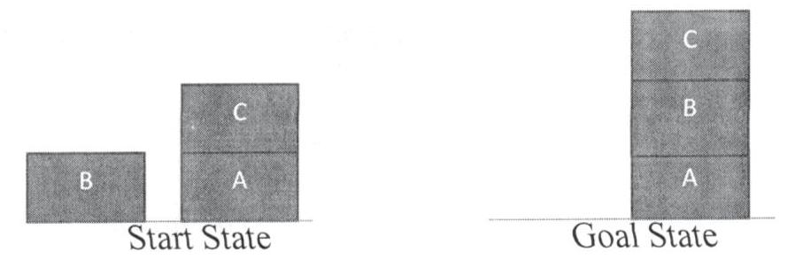
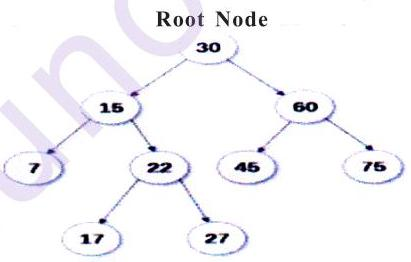
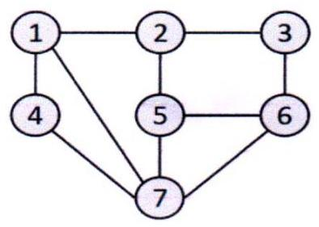

Q3) a) Explain important process variables in forging. [6]

b) Explain design procedure to design blocking impression in forging. [4]

Q4) Write short notes on : [10]

a) Springback in bending

b) Types of Strip layout

Q5) a) Explain feed system design of Injection molding. [6]

b) Explain types of cavity and cores of Injection molding. [4]

Q6) a) Explain gating system design of die casting process. [6]

b) Explain elements of Cycle time required for die casting process. [4]

Q7) a) Describe optimal design of cooling system of sand casting. [6]

b) Describe functions of risers in sand casting. [4]

Q8) Write short notes on : [10]

a) Computer aided injection mold design.

b) Types of die casting dies.

## 小小小

SEAT No. :

## P3189

[Total No. of Pages : 2

# [5872]-389 M.E. (Production) (Manufacturing & Automation) MECHATRONICS

(2017 Pattern) (Semester - III) (611102) Time : 3 Hours] [Max. Marks : 50 Instructions to the candidates: 1) Q. No. 5 and Q. No. 6 are compulsory. 2) Neat diagrams must be drawn wherever necessary. 3) Figures to the right side indicate full marks. 4) Use of non-programmable calculator is allowed. 5) Assume suitable data if necessary. Q1) a) Give the significance of mechatronics in day to day life. [5] b) Describe the working of Strain Gauges with a neat sketch. [5]

## OR

Q2) a) Describe force weight sensor with application. [5]

b) In a certain system, an electric heating element was found to increase the temperature of a piece of metal ${15}^{ \circ  }$ for each ampere of current. The metal expands 0.001 in /degree and pushes on a load sensor which outputs 1 V/0.005 in. of compression. Find the transfer function of three components and draw block diagram and also determine overall transfer function. [5]

Q3) a) Draw pin diagram of a Microcontroller. [3]

b) Develop a conceptual design of a Light sensors based control system for counting a number of tea packets being packed for dispatch. Assume suitable data if necessary. [7]

Q4) a) Describe briefly memory scan and program scan in Programming Logic

Controllers. [6]

b) Explain with suitable example latch circuit. [4]

Q5) a) Construct a ladder logic diagram and outline narrative sequence for

pneumatic cylinders sequencing as A+B+B-A. [6]

b) Explain application of PLC system for traffic signal. [9]

Q6) Write short notes on the following : [15]

a) PLC and microcontroller

b) Microprocessor instruction sets

c) Advance mechatronics system

## HHH

P6576

# [5872]-403  M.E. (Artificial Intelligence and Data Science) ARTIFICIAL INTELLIGENCE

(2020 Pattern) (Semester - I) (510501)

Time : 3 Hours] [Max. Marks : 50

Instructions to the candidates:

1) Attempt Q1 or Q2, Q3 or Q4, Q5 or Q6, Q7 or Q8

2) Neat diagrams must be drawn wherever necessary.

3) Figures to the right indicate full marks.

4) Assume suitable data if necessary.

Q1) Draw and describe the architecture of utility based agent? How it is different from model based agent? [9]

## OR

Q2) What are the axioms of Probability? Explain how to derive the useful facts from the basic axioms with a suitable example? Why the probability axioms are reasonable? [9]

Q3) Explain Hill Climbing algorithm. Explain plateau, ridge, local maxima and global maxima. [9]

OR

Q4) What is Reinforcement Learning explain it with example? Elaborate the differences among Reinforcement, Supervised and Unsupervised Learning. [9]

Q5) a) State and explain the partial order plan for the following blocks-word - problem [8]

b) Explain the following in the first order logic with a suitable example. [8]

i) Terms

ii) Atomic sentences

iii) Complete Sentences

iv) Universal Quantifiers

v) Existential Quantifiers

vi) Nested Quantifiers

vii) Connection between Universal and Existential Quantifiers

viii) Equality OR

Q6) a) Write short Note on [8]

i) AI application in Healthcare systems

ii) AI Application in Banking

b) Describe the recommendation system. How the recommendation system is implemented using collaborative filtering? [8]

Q7) a) Comment on Non-Linear Planning and hierarchical Planning. [8]

b) Explain how planning problem is expressed in STRIPS. [8]

## OR

Q8) a) How to measure the problem solving performance. Explain the depth -

limited search performance. [8]

b) Define Heuristics. Explain 8 Sliding Tile puzzle problem and state the

heuristic for 8 Sliding Tile puzzle problem. [8]

## 带带带

SEAT No. :

P7256 [Total No. of Pages : 2

[5872]-407

M.E.

VIRTUAL REALITY AUGMENTED REALITY

Artificial Intelligence & Data Science

(2020 Pattern) (Semester - II) (510504)

Time : 3 Hours] [Max. Marks : 50

Instructions to the candidates:

1) Answer Q. 1 or Q. 2, Q. 3 or Q. 4, Q. 5 or Q. 6, Q. 7 or Q. 8, Q. 9 or Q. 10, Q. 11 or

Q. 12.

2) Neat diagram must be drawn wherever necessary.

3) Figures to the right indicates full marks.

4) Assume suitable data if necessary.

Q1) a) Which major organization used AR as navigation tools? [4]

b) What is EWK? How its useful in AR? [4]

OR

Q2) a) How 2D rotation and 3D rotation works? [4]

b) Who to Axis angle representation is done? [4]

Q3) What is visual Perception and why its important? [8]

OR

Q4) How does visual perception used in every day life? [8]

Q5) a) What is Instant tracking? Why its important? [5]

b) What is SLAM? [4]

OR

Q6) a) What do you understand outdoor tracking? [5]

b) How ARVR markers works? [4]

P.T.O.

Q7) Enlist the advantages of disadvantages of marker based argumented reality? [8]

## OR

Q8) Explain what is Template marker with example? [8]

Q9) Write a short note on : [9]

a) Unity IDE

b) VR content creation

OR

Q10) Describe overview of game development in unity IDE with examples. [9]

Q11) Explain open VR SDK with its Applications. [8]

OR

Q12) What do you mean by VR SDK & AR Toolkit? [8]

## □□□

SEAT No. : P6577 [Total No. of Pages : 4 [5872]-410 M.E. (Artificial Intelligence and Data Science/Computer Engineering Master of Data Science) DATA SCIENCE Mathematical Foundations for Data Science (2017 Pattern) (Semester - I) (510301)

Time : 3 Hours] [Max. Marks : 50

Instructions to the candidates:

1) Answer Q. 1 or Q. 2, Q. 3 or Q. 4, Q. 5 or Q. 6, Q. 7 or Q. 8, Q. 9 or Q. 10, Q. 11 or Q. 12.

2) Neat diagrams must be drawn wherever necessary.

3) Figures to the right indicate full marks.

4) Assume suitable data, if necessary.

Q1) a) Prove the following by using Venn diagram[6]

i) $\left( {\mathrm{A} \cap  \mathrm{B}}\right)  \cap  \mathrm{C} = \mathrm{A} \cap  \left( {\mathrm{B} \cap  \mathrm{C}}\right)$

ii) $A \cup  \left( {B \cap  C}\right)  = \left( {A \cup  B}\right)  \cap  \left( {A \cup  C}\right)$

b) Write Preorder traversal of given Binary Search Tree[3]

Binary Search Tree

OR

Q2) a) In a group of 100 persons, 72 people can speak English and 43 can speak French. How many can speak English only? How many can speak French only and how many can speak both English and French? [3]

b) Represent following given Graph using adjacency list or Adjacency Matrix. Write Depth First Search Traversal of given graph considering 2 as starting vertex. [6]

Q3) a) For given attribute marks values: [4]

13,15,16,16,19,20,20,21,22,22,25,25,25,25,30,33,33,35,35,

35, 35 36, 40, 45, 46, 52, 70.

Compute mean, median, mode standard deviation

b) Compare Poisson distribution and binomial distribution. [4]

OR

Q4) a) Explain following for numerical data using example. [6]

i) Quantile

ii) Five Number summary

b) A bag contains 2 white balls, 3 black balls and 4 red balls. In how many

ways can 3 balls be drawn from the bag, if at least one black ball is to be

included in the draw? [2]

Q5) a) For given attribute marks values : [5]

10,90,30,20,50,30,60,40,70,40,30,60,80,20

Compute standard deviation, Range, Inter Quartile Range (IQR), five

number summary plot it using boxplot.

b) Explain concept and application of Skewness & Kurtosis. [4]

OR

Q6) a) Compute covariance of age and glucose values given below [4]

(Age-1.5,2,1.6,1.2,1.1) (Glucose -1.7,1.9,1.8,1.5,1)

b) Explain any two graphical representation methods for qualitative data.[5]

Q7) a) Use these methods to normalize the following group of data :

200, 300, 400, 600, 1000 [4]

1) sz-score normalization, 2) z-score normalization using mean absolute

deviation instead of standard deviation

b) Explain any one Probabilistic models with hidden variables using example.

[4]

OR

Q8) a) Find correlation of following data set $\mathrm{x} = \{ 2,5,6,8,9\} ,\mathrm{y} = \{ 4,3,7,5,6\}$ .[3]

b) Consider following dataset, predict the class label using naive Bayesian classification for tuple (T, T, T). [5]

<table><tr><td>A1</td><td>A2</td><td>A3</td><td>Class</td></tr><tr><td>T</td><td>F</td><td>T</td><td>P</td></tr><tr><td>T</td><td>T</td><td>F</td><td>P</td></tr><tr><td>T</td><td>T</td><td>T</td><td>N</td></tr><tr><td>T</td><td>F</td><td>F</td><td>P</td></tr><tr><td>T</td><td>T</td><td>T</td><td>P</td></tr><tr><td>F</td><td>F</td><td>F</td><td>N</td></tr><tr><td>F</td><td>F</td><td>T</td><td>N</td></tr><tr><td>F</td><td>F</td><td>F</td><td>N</td></tr><tr><td>T</td><td>T</td><td>T</td><td>P</td></tr><tr><td>T</td><td>F</td><td>F</td><td>N</td></tr></table>

Q9) a) Solve the following system of equations using LU Decomposition method :[4]

$$
{\mathrm{X}}_{1} + {\mathrm{X}}_{2} + {\mathrm{X}}_{3} = 1,4{\mathrm{X}}_{1} + 3{\mathrm{X}}_{2} - {\mathrm{X}}_{3} = 6,3{\mathrm{X}}_{1} + 5{\mathrm{X}}_{2} + 3{\mathrm{X}}_{3} = 4
$$

b) List the applications of chain rule and discuss any one in detail.[4]

OR

Q10) a) Find the eigenvalues of the matrix[4]

$$
\left\lbrack  \begin{matrix} 2 & 2 \\  5 &  - 1 \end{matrix}\right\rbrack
$$

b) Explain two forms of Chain Rule.[4]

Q11) a) Overfitting and Multicollinearity with respect to regression.[4]

b) Find linear regression equation for the following two sets of data: [4]

<table><tr><td>X</td><td>1</td><td>2</td><td>3</td><td>4</td><td>5</td><td>6</td><td>7</td></tr><tr><td>Y</td><td>9</td><td>8</td><td>10</td><td>12</td><td>11</td><td>13</td><td>14</td></tr></table>

