11. $\frac{1}{\cos x} = \frac{1}{1 - \cos x}$

$\Rightarrow  \cos \mathrm{x} = \frac{1}{2} = \cos \frac{\pi }{3};\;\mathrm{x} = 2\mathrm{n}\pi  \pm  \frac{\pi }{3}$

12. $f\left( x\right)  = {\cos }^{2}x + {\cos }^{2}{2x} + {\cos }^{2}{3x}$

$= 1 + {\cos }^{2}x + {\cos }^{2}{2x} - {\sin }^{2}{3x} = 1 + {\cos }^{2}x + \cos {5x} \cdot  \cos x$

$= 1 + \cos \mathrm{x}\left\lbrack  {\cos \mathrm{x} + \cos 5\mathrm{x}}\right\rbrack   = 1 + 2\cos \mathrm{x} \cdot  \cos 2\mathrm{x} \cdot  \cos 3\mathrm{x}$

$\Rightarrow  \cos \mathrm{x} \cdot  \cos 2\mathrm{x} \cdot  \cos 3\mathrm{x} = 0$

now $f\left( x\right)  = 1$ if $\cos x = 0$ or $\cos {2x} = 0$

or $\cos {3x} = 0$

$\mathrm{x} = \left( {2\mathrm{n} - 1}\right) \frac{\pi }{2}\;$ or $\;\mathrm{x} = \left( {2\mathrm{n} - 1}\right) \frac{\pi }{4}$

or $\mathrm{x} = \left( {2\mathrm{n} - 1}\right) \frac{\pi }{6}$

$\Rightarrow  \mathrm{x} \in  \left\{  {\frac{\pi }{2},\frac{\pi }{4},\frac{3\pi }{4},\frac{\pi }{6},\frac{5\pi }{6}}\right\}$

$\Rightarrow$ number of values of $\mathrm{x} = 5$

13. $f\left( x\right)  = \frac{{\left( {\operatorname{cosec}}^{2}x - 1\right) }^{2}}{\left( {{\operatorname{cosec}}^{2}x - 1}\right)  + 1 - \cot x + \cot x}$ ,

defined for $\mathrm{R} - \mathrm{n}\pi ,\mathrm{n} \in  \mathrm{I}$

$f\left( x\right)  = \frac{{\left( \cot x\right) }^{4}}{1 + {\cot }^{2}x}$

$\Rightarrow  \mathrm{x} = \left( {2\mathrm{n} - 1}\right) \frac{\pi }{2}$

$\therefore \mathrm{x} = \frac{\pi }{2},\frac{3\pi }{2},\frac{5\pi }{2},\ldots \ldots ,\frac{199\pi }{2}$

sum $= \frac{\pi }{2}\left\lbrack  {1 + 3 + 5 + \ldots \ldots . + {199}}\right\rbrack$

(100 solutions)

$= \frac{\pi }{2} \cdot  \frac{100}{2} \cdot  {200} = {5000\pi }$

14. $\cos \mathrm{x} \cdot  \sin \left( {\mathrm{x} + \frac{1}{\mathrm{x}}}\right)  = 0$

$\cos x = 0\; \Rightarrow  x = \pi /2$

$\sin \left( {\mathrm{x} + \frac{1}{\mathrm{x}}}\right)  = 0 \Rightarrow  \mathrm{x} + \frac{1}{\mathrm{x}} = \mathrm{n}\pi ,\mathrm{n} \in  \mathrm{I}$ 1

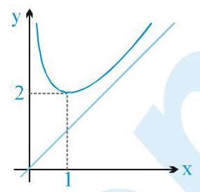

if $x \in  \left( {0,1}\right)$ then $x + \frac{1}{x} \in  \left( {2,\infty }\right)$ for $x > 0$

Hence there are infinite solution

15. $2\sin x + 7\cos {px} = 9$ is possible only if $\sin x = 1$

and $\cos \mathrm{{px}} = 1$

$\mathrm{x} = \left( {4\mathrm{n} + 1}\right) \frac{\pi }{2}\;$ and $\;\mathrm{{px}} = 2\mathrm{m}\pi$

$\Rightarrow  \mathrm{x} = \frac{2\mathrm{\;m}\pi }{\mathrm{p}}\;\left( {\mathrm{m},\mathrm{n} \in  \mathrm{I}}\right)$

$\therefore \left( {4\mathrm{n} + 1}\right) \frac{\pi }{2} = \frac{2\mathrm{\;m}\pi }{\mathrm{p}}$

$\Rightarrow  \mathrm{p} = \frac{4\mathrm{\;m}}{4\mathrm{n} + 1}$

$\therefore \mathrm{p} \in$ rational

16. ${2}^{2 + 4{\sin }^{2}x} = {2}^{6\sin x}$

$\Rightarrow  2 + 4{\sin }^{2}\mathrm{x} = 6\sin \mathrm{x}$

$\Rightarrow  2{\sin }^{2}\mathrm{x} - 3\sin \mathrm{x} + 1 = 0$

$\Rightarrow  \left( {2\sin x - 1}\right) \left( {\sin x - 1}\right)  = 0$

$\therefore \sin \mathrm{x} = \frac{1}{2}\;$ or $\sin \mathrm{x} = 1$

$\therefore \mathrm{x} = \frac{\pi }{6},\frac{5\pi }{6},\frac{\pi }{2}$

17. ${\sin }^{2}x + a\cos x + {a}^{2} > 1 + \cos x$

Putting $\mathrm{x} = 0$ , we get

or $a + {a}^{2} > 2$

or ${a}^{2} + a - 2 > 0$

or $\left( {a + 2}\right) \left( {a - 1}\right)  > 0$

or $a <  - 2$ or $a > 1$

Therefore, we have the largest negative integral value of $\mathrm{a} =  - 3$ .

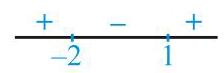

## EXERCISE - 2  Part # I : Multiple Choice

1. ${\sin }^{6}x + {\cos }^{6}x = {a}^{2}$

$\Rightarrow  \left( {{\sin }^{2}x + {\cos }^{2}x}\right) \left( {{\sin }^{4}x + {\cos }^{4}x - {\sin }^{2}x{\cos }^{2}x}\right)  = {a}^{2}$

$\Rightarrow  {\left( {\sin }^{2}x + {\cos }^{2}x\right) }^{2} - 3{\sin }^{2}x{\cos }^{2}x = {a}^{2}$

$\Rightarrow  1 - 3{\sin }^{2}x{\cos }^{2}x = {a}^{2}$

$\Rightarrow  1 - \frac{3}{4}{\sin }^{2}2\mathrm{x} = {\mathrm{a}}^{2}\; \Rightarrow  \frac{4\left( {1 - {\mathrm{a}}^{2}}\right) }{3} = {\sin }^{2}2\mathrm{x}$

$\Rightarrow  0 \leq  \frac{4}{3}\left( {1 - {\mathrm{a}}^{2}}\right)  \leq  1$

$1 - {a}^{2} \geq  0$ and $4 - 4{a}^{2} \leq  3$

${\mathrm{a}}^{2} \leq  1$ and $\frac{1}{4} \leq  {\mathrm{a}}^{2}$

$- 1 \leq  \mathrm{a} \leq  1$ and $\mathrm{a} \geq  \frac{1}{2}$ or $\mathrm{a} \leq   - \frac{1}{2}$

$\mathrm{a} \in  \left\lbrack  {-1, - \frac{1}{2}}\right\rbrack   \cup  \left\lbrack  {\frac{1}{2},1}\right\rbrack$

2. ${\sin }^{2}x - \cos {2x} = 2 - \sin {2x}$

$\Rightarrow  {\sin }^{2}x - \left( {1 - 2{\sin }^{2}x}\right)  = 2 - 2\sin x\cos x$

$\Rightarrow  3{\sin }^{2}x + 2\sin x\cos x = 3$

Case-I $: \cos \mathrm{x} \neq  0$

$\therefore 3{\tan }^{2}x + 2\tan x = 3\left( {1 + {\tan }^{2}x}\right)  \Rightarrow  \tan x = \frac{3}{2}$

Case-II : $\cos \mathrm{x} = 0$

$\therefore 3\left( 1\right)  + 2\left( {\pm 1}\right) \left( 0\right)  = 3$ which is true $\therefore \mathrm{x} = \left( {2\mathrm{n} + 1}\right) \frac{\pi }{2}$

4. ${\sin }^{4}x - {\cos }^{2}x\sin x + 2{\sin }^{2}x + \sin x = 0$

or $\sin x\left\lbrack  {{\sin }^{3}x - {\cos }^{2}x + 2\sin x + 1}\right\rbrack   = 0$

or $\sin x\left\lbrack  {{\sin }^{3}x - 1 + {\sin }^{2}x + 2\sin x + 1}\right\rbrack   = 0$

or $\sin x\left\lbrack  {{\sin }^{3}x + {\sin }^{2}x + 2\sin x}\right\rbrack   = 0$

or ${\sin }^{2}x = 0$ or ${\sin }^{2}x + \sin x + 2 = 0$

(not possible for real $\mathrm{x}$ )

or $\sin x = 0$

Hence, the solutions are $\mathrm{x} = 0,\pi ,{2\pi },{3\pi }$ .

6. ${\cos }^{2}x + {\cos }^{2}{2x} + {\cos }^{2}{3x} = 1$

$\Rightarrow  {\cos }^{2}x - {\sin }^{2}{2x} + {\cos }^{2}{3x} = 0$

$\Rightarrow  \cos x\cos {3x} + {\cos }^{2}{3x} = 0$

$\Rightarrow  \cos 3\mathrm{x}\left( {\cos \mathrm{x} + \cos 3\mathrm{x}}\right)  = 0$

$\Rightarrow  \cos 3\mathrm{x}\cos 2\mathrm{x}\cos \mathrm{x} = 0$

$\Rightarrow  \mathrm{x} = \left( {2\mathrm{p} + 1}\right) \frac{\pi }{6}$

$$
\mathrm{x} = \left( {2\mathrm{q} + 1}\right) \frac{\pi }{4},
$$

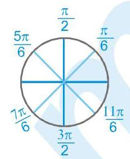

$\mathrm{x} = \left( {2\mathrm{r} + 1}\right) \frac{\pi }{2},\mathrm{n} \in  \mathrm{I}$

$\Rightarrow  \mathrm{x} = \mathrm{n}\pi  \pm  \frac{\pi }{6}$ also satisfy the equation.

7. $\mathrm{y} + \frac{1}{\mathrm{y}} \geq  2 \Rightarrow  \sqrt{\mathrm{y} + \frac{1}{\mathrm{y}}} \geq  2$

But $\sin x + \cos x \leq  \sqrt{2}$

$\Rightarrow  \mathrm{y} + \frac{1}{\mathrm{y}} = 2$ and $\sin \mathrm{x} + \cos \mathrm{x} = \sqrt{2}$

$y = 1$ and $\sin \left( {x + \frac{\pi }{4}}\right)  = 1$ or $y = 1$ and $x = \frac{\pi }{4}$

8. $3 - 2\cos \theta  - 4\sin \theta  - \cos {2\theta } + \sin {2\theta } = 0$

$\sin {2\theta } - 2\cos \theta  + 3 - 4\sin \theta  - \left( {1 - 2{\sin }^{2}\theta }\right)  = 0$

$2\cos \theta \left( {\sin \theta  - 1}\right)  + 2{\sin }^{2}\theta  - 4\sin \theta  + 2 = 0$

$\cos \theta \left( {\sin \theta  - 1}\right)  + {\left( \sin \theta  - 1\right) }^{2} = 0$

$\left( {\sin \theta  - 1}\right) \left( {\cos \theta  + \sin \theta  - 1}\right)  = 0$

$\sin \theta  = 1$ or $\cos \left( {\theta  - \frac{\pi }{4}}\right)  = \frac{1}{\sqrt{2}}$

$\theta  = 2\mathrm{n}\pi  + \frac{\pi }{2}$ or $\theta  - \frac{\pi }{4} = 2\mathrm{\;m}\pi  + \frac{\pi }{4},2\mathrm{\;m}\pi  - \frac{\pi }{4}$

$$
\theta  = 2\mathrm{\;m}\pi  + \frac{\pi }{2},2\mathrm{\;m}\pi
$$

9. ${3\theta } = \mathrm{n}\pi  + {\left( -1\right) }^{\mathrm{n}}\left( {3\alpha }\right)$

$\therefore {3\theta } = {3\alpha };{3\theta } = \pi  - {3\alpha };{3\theta } =  - \pi  - {3\alpha }$

or ${3\theta } = {2\pi } + {3\alpha };{3\theta } =  - {2\pi } + {3\alpha }$

Hence $\theta  = \alpha$ ; $\theta  = \frac{\pi }{3} - \alpha ;\theta  =  - \left( {\frac{\pi }{3} + \alpha }\right) ;$

$\theta  = \left( {\frac{2\pi }{3} + \alpha }\right) ;\;\theta  =  - \frac{2\pi }{3} + {3\alpha }$

$\Rightarrow  \cos \theta  = \cos \left( {\frac{\pi }{3} \pm  \alpha }\right)$ or $\cos \theta  = \cos \left( {\frac{2\pi }{3} \pm  \alpha }\right)$

$\Rightarrow  \left( \mathrm{A}\right) ,\left( \mathrm{B}\right) ,\left( \mathrm{C}\right)$ and(D)all are correct

10. Squaring and adding the given equations, $4 + 9 + {12}\sin \left( {x + y}\right)  = {25}$

$\Rightarrow  \sin \left( {\mathrm{x} + \mathrm{y}}\right)  = 1 = \sin \frac{\pi }{2}$

$\therefore \mathrm{x} + \mathrm{y} = 2\mathrm{n}\pi  + \frac{\pi }{2} = \left( {4\mathrm{n} + 1}\right) \frac{\pi }{2}\;\mathrm{n} \in  \mathrm{I} \Rightarrow  \left( \mathrm{A}\right)$

if $\mathrm{x} + \mathrm{y} = \frac{\pi }{2} \Rightarrow  \mathrm{y} = \frac{\pi }{2} - \mathrm{x}$

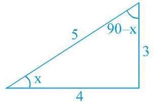

$5\sin x = 3 \Rightarrow  \sin x = \frac{3}{5}\;$ or $\;\cos x = \frac{4}{5}$

also $\cos y = \frac{3}{5}$ and $\sin y = \frac{4}{5}$ ; hence $y > x \Rightarrow$

11. only $\mathrm{x} = \frac{\pi }{4}$ and $\frac{11\pi }{12}$ in $\left( {0,\pi }\right)$ satisfies

13. $2{\cos }^{3}{3\theta } + 3\cos {3\theta } + 4 = 3{\sin }^{2}{3\theta }$

$\Rightarrow  \left( {\cos {3\theta } + \frac{1}{2}}\right) \left( {2{\cos }^{2}{3\theta } + 2\cos {3\theta } + 2}\right)  = 0$

$\Rightarrow  \cos {3\theta } =  - \frac{1}{2}$ $\Rightarrow  {3\theta } = 2\mathrm{n}\pi  \pm  \frac{2\pi }{3}$

$\Rightarrow  \theta  = \frac{2\mathrm{n}\pi }{3} \pm  \frac{2\pi }{9}$

14. $\sin \alpha  - \cos \alpha  \cdot  \tan \beta  = \tan \left( {\alpha  - \beta }\right)$

$\frac{\sin \alpha \cos \beta  - \cos \alpha \sin \beta }{\cos \beta } = \frac{\sin \left( {\alpha  - \beta }\right) }{\cos \left( {\alpha  - \beta }\right) }$

$\sin \left( {\alpha  - \beta }\right) \cos \left( {\alpha  - \beta }\right)  = \sin \left( {\alpha  - \beta }\right) \cos \beta$

$\sin \left( {\alpha  - \beta }\right) \left\lbrack  {\cos \left( {\alpha  - \beta }\right)  - \cos \beta }\right\rbrack   = 0$

$\therefore \sin \left( {\alpha  - \beta }\right)  = 0$ $\cos \left( {\alpha  - \beta }\right)  = \cos \beta$

$\therefore \alpha  - \beta  = \mathrm{n}\pi$ $\alpha  - \beta  = 2\mathrm{\;m}\pi  \pm  \beta$

$\therefore \alpha  = \mathrm{n}\pi  + \beta$ (+) $\alpha  = 2\mathrm{\;m}\pi  + {2\beta }$

(-) $\alpha  = 2\mathrm{\;m}\pi$

$\therefore \mathrm{A},\mathrm{B},\mathrm{C}$ are correct

15. $\cos {3\theta } = \cos {3\alpha }$ put $\mathrm{n} = 0,1$

${3\theta } = {2n\pi } \pm  {3\alpha }$

${3\theta } = {3\alpha }$ or $- {3\alpha }$ or ${2\pi } + {3\alpha }$ or ${2\pi } - {3\alpha }$

$\theta  = \alpha$ or $- \alpha$ or $\frac{2\pi }{3} + \alpha$ or $\frac{2\pi }{3} - \alpha$

$\Rightarrow$ (A),(C),(D) are correct

if $\mathrm{n} =  - 1$

${3\theta } =  - {2\pi } \pm  {3\alpha }$

$\theta  =  - \frac{2\pi }{3} \pm  \alpha$

$\sin \theta  = \sin \left( {-\frac{2\pi }{3} \pm  \alpha }\right)  =  - \sin \left( {\frac{2\pi }{3} \pm  \alpha }\right)$

$=  - \sin \left( {\pi  - \frac{\pi }{3} \pm  \alpha }\right)  =  - \sin \left( {\pi  - \left( {\frac{\pi }{3} \pm  \alpha }\right) }\right)$

$$
=  - \sin \left( {\frac{\pi }{3} \pm  \alpha }\right)
$$

hence (B) is not correct.

16. $\cos {4x}\cos {8x} - \cos {5x}\cos {9x} = 0$

$\Rightarrow  2\cos 4\mathrm{x}\cos 8\mathrm{x} = 2\cos 5\mathrm{x}\cos 9\mathrm{x}$

$\Rightarrow  \cos {12}\mathrm{x} + \cos 4\mathrm{x} = \cos {14}\mathrm{x} + \cos 4\mathrm{x}$

$\Rightarrow  {14}\mathrm{x} = 2\mathrm{n}\pi  \pm  \left( {{12}\mathrm{x}}\right)$

$\Rightarrow  2\mathrm{x} = 2\mathrm{n}\pi$ or ${26}\mathrm{x} = 2\mathrm{n}\pi$

$\Rightarrow  \mathrm{x} = \mathrm{n}\pi$ or $\frac{\mathrm{n}\pi }{13}$

$\therefore \sin \mathrm{x} = 0$ or $\sin {13}\mathrm{x} = 0$

17. Let $\mathrm{E} = \sin \mathrm{x} - {\cos }^{2}\mathrm{x} - 1$

$\Rightarrow  \mathrm{E} = \sin \mathrm{x} - 1 + {\sin }^{2}\mathrm{x} - 1 = {\sin }^{2}\mathrm{x} + \sin \mathrm{x} - 2$

$= {\left( \sin x + \frac{1}{2}\right) }^{2} - \frac{9}{4}\;$ assumes least value

when $\sin \mathrm{x} =  - \frac{1}{2}\; \Rightarrow  \;\mathrm{x} = \mathrm{n}\pi  + {\left( -1\right) }^{\mathrm{n}}\left( {-\frac{\pi }{6}}\right)$ .

18. $\cos x \cdot  \cos {6x} =  - 1$

$\Rightarrow$ Either $\cos \mathrm{x} = 1$ and $\cos 6\mathrm{x} - 1$

or $\cos x =  - 1$ and $\cos {6x} = 1$

$\Rightarrow  \mathrm{x} = 2\mathrm{n}\pi$ and $\cos 6\mathrm{x} =  - 1$

or $\mathrm{x} = \left( {2\mathrm{n} + 1}\right) \pi$ and $\cos 6\mathrm{x} = 1$

If $x = {2n\pi }$ then $\cos {6x}$ cannot be -1

However if $x = \left( {{2n} + 1}\right) \pi$ then $\cos {6x} = 1$

$\therefore \mathrm{x} = \left( {2\mathrm{n} + 1}\right) \pi$

$\mathrm{x} = \left( {2\mathrm{n} - 1}\right) \pi$ is also as above.

## Part # II : Assertion & Reason

1. ${\left( \sin x + \cos x\right) }^{1 + \sin {2x}} = 2$

$\Rightarrow  {\left( \sin x + \cos x\right) }^{{\left( \sin x + \cos x\right) }^{2}} = 2$

Now we know that the maximum value of

$\sin x + \cos x$ is $\sqrt{2}$ which occurs at

$\mathrm{x} = \pi /4$ for $0 \leq  \mathrm{x} \leq  \pi /4$ .

Also, the given equation has roots only if

$$
\sin x + \cos x = \sqrt{2}
$$

Hence, there is only one one solution for $0 \leq  \mathrm{x} \leq  \pi /4$ .

Thus, the correct answer is (A).

2. We know that ${\sin }^{2}x \leq  1$ and ${\cos }^{2}y \leq  1$ , then

$$
{\sin }^{2}x + {\cos }^{2}y \leq  2
$$

Also, ${\sec }^{2}z \geq  1$ , then $2{\sec }^{2}z \geq  2$ .

Hence, the given equation is solvable only if

${\sin }^{2}x + {\cos }^{2}y = 2$ and $2{\sec }^{2}z = 2$ , for which

${\sin }^{2}\mathrm{x},{\cos }^{2}\mathrm{y},{\sec }^{2}\mathrm{z} = 1$

Then $\sin z,\cos y,\sec z =  \pm  1$ .

Hence, statement 1 is false and statement 2 is true.

3. Draw the graph of $y = \sin x$ and $y = 1/x$ and verify.

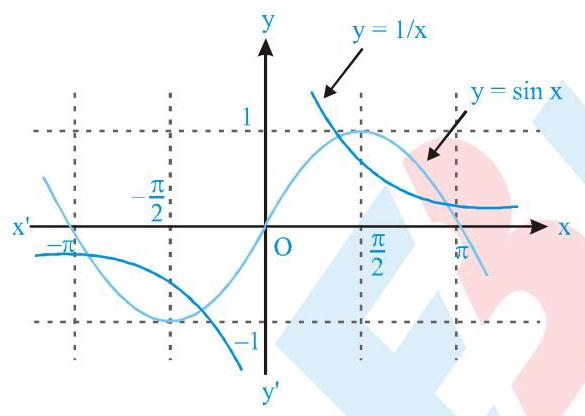

EXERCISE - 3

Part # I : Matrix Match Type

1. (A) $\left| \tan \right|  = \frac{\mathrm{m}}{\mathrm{n}} \Rightarrow  \tan \mathrm{x} = \frac{\mathrm{m}}{\mathrm{n}}\;\& \tan \mathrm{x} =  - \frac{\mathrm{m}}{\mathrm{n}}$

In $\left\lbrack  {0,{2\pi }}\right\rbrack$ it has 4 solutions

(B) $\cos x + \cos {2x} + \cos {3x} + \cos {4x} + \cos {5x} = 5$

$\Rightarrow  \cos \mathrm{x} = \cos 2\mathrm{x} = \cos 3\mathrm{x} = \cos 4\mathrm{x} = \cos 5\mathrm{x} = 1$

$\Rightarrow  \mathrm{x} = 2{\mathrm{n}}_{1}\pi ,\mathrm{x} = {\mathrm{n}}_{2}\pi$ ,

$\mathrm{x} = 2{\mathrm{n}}_{3}\frac{\pi }{3},\mathrm{x} = \frac{{\mathrm{n}}_{4}\pi }{2},\mathrm{x} = \frac{2{\mathrm{n}}_{5}\pi }{5}$

$\Rightarrow  \mathrm{x} = 0,{2\pi }$ are common solutions.

(C) ${2}^{\frac{1}{1 - \left| {\cos x}\right| }} = 4$

$\Rightarrow  \frac{1}{1 - \left| {\cos x}\right| } = 2 \Rightarrow  1 - \left| {\cos x}\right|  = \frac{1}{2}$

$\Rightarrow  \left| \cos \right|  = \frac{1}{2} \Rightarrow  \cos \mathrm{x} =  \pm  \frac{1}{2}$

$\therefore \;\operatorname{In}\left( {-\pi ,\pi }\right)$ there are 4 solutions

(D) $\tan \theta  + \tan {2\theta } + \tan {3\theta } = \tan \theta \tan {2\theta }\tan {3\theta }$

$\Rightarrow  \theta  + {2\theta } + {3\theta } = \mathrm{n}\pi  \Rightarrow  \theta  = \mathrm{n}\pi /6$

$\Rightarrow  \theta  = \frac{\pi }{3},\frac{2\pi }{3}$ satisfy equation only.

2. (A) ${\sin }^{2}\theta  + 3\cos \theta  = 3 \Rightarrow  1 - {\cos }^{2}\theta  + 3\cos \theta  = 3$

$\Rightarrow  {\cos }^{2}\theta  - 3\cos \theta  + 2 = 0 \Rightarrow  \cos \theta  = 1,2$

$\Rightarrow  \cos \theta  = 1\;\left( { \rightarrow  \cos \theta  \neq  2}\right)  \Rightarrow  \theta  = 0$ in $\left\lbrack  {-\pi ,\pi }\right\rbrack$

$\therefore$ No. of solution $= 1$

(B) $\sin x \cdot  \tan {4x} = \cos x \Rightarrow  \sin x \cdot  \frac{\sin {4x}}{\cos {4x}} = \cos x$

$\Rightarrow  \sin 4\mathrm{x}\sin \mathrm{x} - \cos 4\mathrm{x}\cos \mathrm{x} = 0 \Rightarrow  \cos 5\mathrm{x} = 0$

$$
\Rightarrow  5\mathrm{x} = \left( {2\mathrm{n} + 1}\right) \pi /2 \Rightarrow  \mathrm{x} = \left( {2\mathrm{n} + 1}\right) \pi /{10}
$$

$\Rightarrow  \mathrm{x} = \frac{\pi }{10},\frac{3\pi }{10},\frac{5\pi }{10},\frac{7\pi }{10},\frac{9\pi }{10}$ in $\left( {0,\pi }\right)$

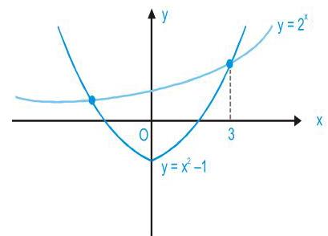

So there are five solutions.

(C) $\left( {1 - {\tan }^{2}\theta }\right) {\sec }^{2}\theta  + {2}^{{\tan }^{2}\theta } = 0$

$\Rightarrow  \left( {1 - {\tan }^{4}\theta }\right)  + {2}^{{\tan }^{2}\theta } = 0$

$\Rightarrow  \left( {1 - {\mathrm{x}}^{2}}\right)  + {2}^{\mathrm{x}} = 0$ where $\mathrm{x} = {\tan }^{2}\theta$

$\Rightarrow  {2}^{\mathrm{x}} = {\mathrm{x}}^{2} - 1\; \Rightarrow  \mathrm{x} = 3$

$$
\Rightarrow  {\tan }^{2}\theta  = 3
$$

$\Rightarrow  \tan \theta  =  \pm  \sqrt{3}$

$\Rightarrow  \theta  =  \pm  \frac{\pi }{3}$ in $\left( {-\frac{\pi }{2},\frac{\pi }{2}}\right)$

$\therefore \;$ Number of solutions $= 2$

(D) $\left\lbrack  {\sin x}\right\rbrack   + \left\lbrack  {\sqrt{2}\cos x}\right\rbrack   =  - 3$

$\Rightarrow  \left\lbrack  {\sin \mathrm{x}}\right\rbrack   =  - 1$ and $\left\lbrack  {\sqrt{2}\cos \mathrm{x}}\right\rbrack   =  - 2$

$\Rightarrow  \pi  < \mathrm{x} < {2\pi }$ and $- 2 \leq  \sqrt{2}\cos \mathrm{x} <  - 1$

$$
\Rightarrow   - 2 \leq  \cos x <  - \frac{1}{\sqrt{2}}
$$

$$
\Rightarrow  \; - 1 \leq  \cos x <  - \frac{1}{\sqrt{2}}
$$

$\Rightarrow  \;\pi  \leq  \mathrm{x} < \frac{5\pi }{4}$ for $\mathrm{x} \in  \left\lbrack  {0,{2\pi }}\right\rbrack$

$$
\pi  \leq  \mathrm{x} < \frac{5\pi }{4},\mathrm{x} \in  \left\lbrack  {0,{2\pi }}\right\rbrack
$$

$$
\therefore \;\pi  < x < \frac{5\pi }{4}\; \Rightarrow  \;{2\pi } < {2x} < \frac{5\pi }{2}
$$

$$
\Rightarrow  0 < \sin 2\mathrm{x} < 1\; \Rightarrow  \;\left\lbrack  {\sin 2\mathrm{x}}\right\rbrack   = 0
$$

3. (A)

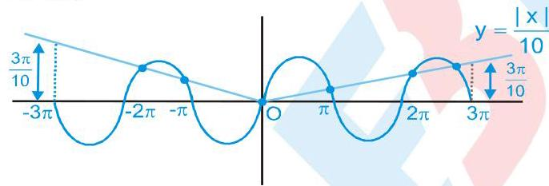

Number of solutions $= 6$

(B) $\sin x = \frac{2 \pm  \sqrt{8}}{2} = 1 \pm  \sqrt{2}$

$$
\Rightarrow  \sin \mathrm{x} = 1 - \sqrt{2}
$$

As $\sin x$ takes at least four values

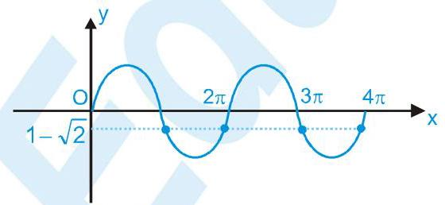

in $\left\lbrack  {0,\mathrm{n}\pi }\right\rbrack  \therefore \mathrm{n} \geq  4$

(C) $1 + {\sin }^{4}x = {\cos }^{2}{3x}$

L.H.S. $\geq  1$ and R.H.S. $\leq  1$

$\therefore$ L.H.S. $=$ R.H.S. $= 1$

$\Rightarrow  {\sin }^{4}\mathrm{x} = 0$ and ${\cos }^{2}3\mathrm{x} = 1 \Rightarrow  \mathrm{x} = \mathrm{n}\pi$ and $3\mathrm{x} = \mathrm{m}\pi$

$\Rightarrow  \mathrm{x} = \mathrm{n}\pi$ and $\mathrm{x} = \frac{\mathrm{m}\pi }{3}$

$\Rightarrow  \mathrm{x} = \mathrm{n}\pi$

$\Rightarrow  \mathrm{x} =  - {2\pi }, - \pi ,0,\pi ,{2\pi }\operatorname{in}\left\lbrack  {\frac{-{5\pi }}{2},\frac{5\pi }{2}}\right\rbrack$

$\therefore$ Number of solutions $= 5$ .

(D) $\mathrm{A},\mathrm{B},\mathrm{C}$ are in $\mathrm{A}.\mathrm{P}.\; \Rightarrow  \;\mathrm{B} = {60}^{ \circ  }$

$$
\Rightarrow  2\mathrm{\;A} =  - {30}^{ \circ  }\text{or}{90}^{ \circ  }
$$

$$
\Rightarrow  \mathrm{A} = {45}^{ \circ  }
$$

$\therefore \mathrm{C} = {180}^{ \circ  } - \mathrm{A} - \mathrm{B} = {75}^{ \circ  } = \frac{5\pi }{12}\;\therefore \mathrm{p} = {12}$ .

## Part # II : Comprehension

## Comprehension 1

1. ${\mathrm{x}}^{3} - \left( {1 + \cos \theta  + \sin \theta }\right) {\mathrm{x}}^{2} + \left( {\cos \theta \sin \theta  + \cos \theta  + \sin \theta }\right) \mathrm{x}$

$- \sin \theta \cos \theta  = 0$

Given cubic function is

$f\left( x\right)  = \left( {x - 1}\right) \left( {x - \cos \theta }\right) \left( {x - \sin \theta }\right)$

Therefore, roots are 1, $\sin \theta$ , and $\cos \theta$

Hence, ${\mathrm{x}}_{1}{}^{2} + {\mathrm{x}}_{2}{}^{2} + {\mathrm{x}}_{3}{}^{2} = 1 + {\sin }^{2}\theta  + {\cos }^{2}\theta  = 2$

2. Now if $1 = \sin \theta$ , we get $\theta  = \pi /2$

If $1 = \cos \theta$ , then $\theta  = 0,{2\pi }$

and if $\sin \theta  = \cos \theta$ , we get $\tan \theta  = 1$ .

Therefore, $\theta  = \frac{\pi }{4},\frac{5\pi }{4}$

Therefore, the number of values of $\theta$ in $\left\lbrack  {0,{2\pi }}\right\rbrack$ is 5 .

3. Again the maximum possible difference between the two roots is 2 .

$1 - \sin \theta  = 2$ , when $\theta  = {3\pi }/2$

or $1 - \cos \theta  = 2$ , when $\theta  = \pi$

Comprehension 2

1. $4{\sin }^{3}x + 2{\sin }^{2}x - 2\sin x - 1$

$= \left( {2\sin x + 1}\right) \left( {2{\sin }^{2}x - 1}\right)  = 0$

$\therefore \;\sin \mathrm{x} =  - \frac{1}{2}, \pm  \frac{1}{\sqrt{2}}$

$\therefore$ there are 6 solutions.

2. $3 = \cos {4x} + \frac{{10}\tan x}{1 + {\tan }^{2}x} = \cos {4x} + 5\sin {2x}$

i.e $3 = 1 - 2{\sin }^{2}{2x} + 5\sin {2x}$

i.e $\sin {2x} = \frac{1}{2}$

$\therefore 2\mathrm{x} = \frac{\pi }{6},\frac{5\pi }{6}$

Thus there are two solutions.

3. (i) when $\tan x \geq  0$ , then the equation becomes

$\tan x = \tan x + \frac{1}{\cos x}$ i.e $\frac{1}{\cos x} = 0$ (not possible)

(ii) when $\tan x < 0$ , then the equation becomes

$- \tan x = \tan x + \frac{1}{\cos x}$ i.e $\sin x =  - \frac{1}{2}$

$\therefore \mathrm{x} = \frac{11\pi }{6}$ is the only solution.

Comprehension 3

1. ${\sin }^{6}x + {\cos }^{6}x < \frac{7}{16} \Rightarrow  1 - 3{\sin }^{2}x{\cos }^{2}x < \frac{7}{16}$

$\Rightarrow  {\sin }^{2}x{\cos }^{2}x > \frac{3}{16} \Rightarrow  {\sin }^{2}{2x} > \frac{3}{4}$

$\Rightarrow  \frac{1 - \cos 4\mathrm{x}}{2} > \frac{3}{4} \Rightarrow  1 - \cos 4\mathrm{x} > \frac{3}{2}$

$\Rightarrow  \cos 4\mathrm{x} <  - \frac{1}{2}$

$\Rightarrow$ Principal is value $4\mathrm{x} \in  \left( {\frac{2\pi }{3},\frac{4\pi }{3}}\right)$

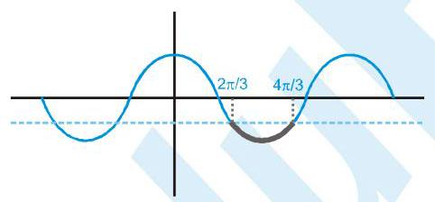

$\Rightarrow$ General value is $4\mathrm{x} \in  \left( {2\mathrm{n}\pi  + \frac{2\pi }{3},2\mathrm{n}\pi  + \frac{4\pi }{3}}\right)$

$\Rightarrow  \mathrm{x} \in  \left( {\frac{\mathrm{n}\pi }{2} + \frac{\pi }{6},\frac{\mathrm{n}\pi }{2} + \frac{\pi }{3}}\right) ,\mathrm{n} \in  \mathrm{I}$

2. $\cos {2x} + 5\cos x + 3 \geq  0$

$\Rightarrow  2{\cos }^{2}\mathrm{x} + 5\cos \mathrm{x} + 2 \geq  0$

$\Rightarrow  \left( {\cos x + 2}\right) \left( {2\cos x + 1}\right)  \geq  0$

$\Rightarrow  2\cos x + 1 \geq  0$ $\left( {1 + \cos x + 2 > 0}\right)$

$\Rightarrow  \cos \mathrm{x} \geq   - \frac{1}{2}\; \Rightarrow  \;\mathrm{x} \in  \left\lbrack  {-\frac{2\pi }{3},\frac{2\pi }{3}}\right\rbrack$

3. $2{\sin }^{2}\left( {x + \frac{\pi }{4}}\right)  + \sqrt{3}\cos {2x} \geq  0$

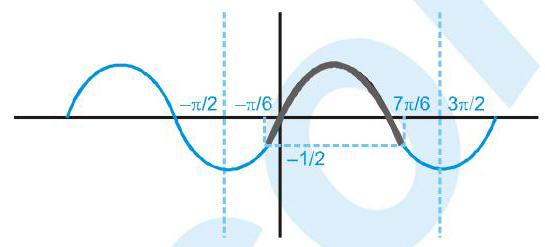

$\Rightarrow  1 - \cos \left( {{2x} + \frac{\pi }{2}}\right)  + \sqrt{3}\cos {2x} \geq  0$

$\Rightarrow  \sqrt{3}\cos {2x} + \sin {2x} \geq   - 1$

$\Rightarrow  \frac{\sqrt{3}}{2}\cos {2x} + \frac{1}{2}\sin {2x} \geq   - \frac{1}{2}$

$\Rightarrow  \sin \left( {{2x} + \frac{\pi }{3}}\right)  \geq   - \frac{1}{2}$

$\Rightarrow  2\mathrm{x} + \frac{\pi }{3} \in  \left\lbrack  {2\mathrm{n}\pi  - \frac{\pi }{6},2\mathrm{n}\pi  + \frac{7\pi }{6}}\right\rbrack$

$\Rightarrow  2\mathrm{x} \in  \left\lbrack  {2\mathrm{n}\pi  - \frac{\pi }{2},2\mathrm{n}\pi  + \frac{5\pi }{6}}\right\rbrack$

$\Rightarrow  \mathrm{x} \in  \left\lbrack  {\mathrm{n}\pi  - \frac{\pi }{4},\mathrm{n}\pi  + \frac{5\pi }{12}}\right\rbrack$

$\Rightarrow  \mathrm{x} \in  \left\lbrack  {-\pi ,\frac{-{7\pi }}{12}}\right\rbrack   \cup  \left\lbrack  {-\frac{\pi }{4},\frac{5\pi }{12}}\right\rbrack   \cup  \left\lbrack  {\frac{3\pi }{4},\pi }\right\rbrack$

in $\left\lbrack  {-\pi ,\pi }\right\rbrack$ EXERCISE - 4

Subjective Type

1. ${\sin }^{4}\left( \frac{x}{3}\right)  + {\cos }^{4}\left( \frac{x}{3}\right)  > \frac{1}{2}\left( {n \in  Z}\right)$

or $1 - 2{\sin }^{2}\left( \frac{x}{3}\right) {\cos }^{2}\left( \frac{x}{3}\right)  > \frac{1}{2}$

or $1 - \frac{1}{2}{\sin }^{2}\left( \frac{2x}{3}\right)  > \frac{1}{2}$

or ${\sin }^{2}\left( \frac{2x}{3}\right)  < 1$

which is always true except when ${\sin }^{2}\left( {2\mathrm{x}/3}\right)  = 1$ .

This means $2\mathrm{x}/3 = \mathrm{n}\pi  \pm  \left( {\pi /2}\right)$

or $\mathrm{x} = \left( {3\mathrm{n}\pi /2}\right)  \pm  \left( {{3\pi }/4}\right) ,\mathrm{n} \in  \mathrm{Z}$

Hence, solution set of the inequality is

$\mathrm{R} - \{ \mathrm{x} : \mathrm{x} = \left( {3\mathrm{n}\pi /2}\right)  \pm  \left( {{3\pi }/4}\right) ,\mathrm{n} \in  \mathrm{Z}\}$ .

2. $\sin x + \sin y = \sin \left( {x + y}\right)$

or $2\sin \frac{x + y}{2}\left\lbrack  {\cos \frac{x - y}{2} - \cos \frac{x + y}{2}}\right\rbrack   = 0$

or $4\sin \frac{x + y}{2}\sin \frac{x}{2}\sin \frac{y}{2} = 0$

(a) $\sin \frac{\mathrm{x} + \mathrm{y}}{2} = 0\; \Rightarrow  \;\mathrm{x} + \mathrm{y} = 2\mathrm{n}\pi ,\mathrm{n} \in  \mathrm{Z}$

$\Rightarrow  \mathrm{x} + \mathrm{y} = 0$

(*) $\left| \mathrm{x}\right|  + \left| \mathrm{y}\right|  = 1 \Rightarrow   - 1 \leq  \mathrm{x},\mathrm{y} \leq  1$ )

(b) $\sin \frac{x}{2} = 0\; \Rightarrow  \;x = {2m\pi }, m \in  Z$

$\Rightarrow  \mathrm{x} = 0$

(c) $\sin \frac{y}{2} = 0\; \Rightarrow  \;y = {2p\pi }, p \in  Z$

From $\left| \mathrm{x}\right|  + \left| \mathrm{y}\right|  = 1$

If $\mathrm{x} = 0$ , then $\left| \mathrm{y}\right|  = 1\; \Rightarrow  \;\mathrm{y} =  \pm  1$

If $\mathrm{y} = 0$ , then $\left| \mathrm{x}\right|  = 1\; \Rightarrow  \mathrm{x} =  \pm  1$

If $y =  - x$ , then $\left| x\right|  + \left| {-x}\right|  = 2$

$\Rightarrow$ Hence, solutions are

$\left( {0,1}\right) ,\left( {0, - 1}\right) ,\left( {1,0}\right) ,\left( {-1,0}\right) ,\left( {\frac{1}{2}, - \frac{1}{2}}\right)$ , and $\left( {-\frac{1}{2},\frac{1}{2}}\right)$ .

3. $\tan \left( {\frac{\pi }{2}\cos \theta }\right)  = \cot \left( {\frac{\pi }{2}\sin \theta }\right)  = \tan \left( {\frac{\pi }{2} - \frac{\pi }{2}\sin \theta }\right)$

$\Rightarrow  \frac{\pi }{2}\cos \theta  = \mathrm{n}\pi  + \frac{\pi }{2} - \frac{\pi }{2}\sin \theta ,\mathrm{n} \in  Z$

or $\frac{\pi }{2}\left( {\sin \theta  + \cos \theta }\right)  = \mathrm{n}\pi  + \frac{\pi }{2} = \left( {\mathrm{n} + \frac{1}{2}}\right) \pi$

or $\sin \theta  + \cos \theta  = \left( {{2n} + 1}\right)$

$\Rightarrow  \sqrt{2}\sin \left( {\theta  + \frac{\pi }{4}}\right)  = \left( {2\mathrm{n} + 1}\right)$

Hence, $\mathrm{n} = 0, - 1$ are the only possibilities.

So, $\sin \left( {\theta  + \frac{\pi }{4}}\right)  =  \pm  \frac{1}{\sqrt{2}} = \sin \left( {\pm \frac{\pi }{4}}\right)$

or $\theta  + \frac{\pi }{4} = \mathrm{m}\frac{\pi }{2} + \frac{\pi }{4},\mathrm{\;m} \in  Z$

or $\theta  = \mathrm{m}\frac{\pi }{2},\mathrm{\;m} \in  \mathrm{Z}$

However, for the values of $\mathrm{m} = 2\mathrm{k},\mathrm{k} \in  \mathrm{Z}$ , the equation is not defined.

Hence, $\theta  = \left( {2\mathrm{k} + 1}\right) \frac{\pi }{2},\;$ where $\mathrm{k} \in  \mathrm{Z}$

4. ${\sin }^{2}x + \frac{1}{4}{\sin }^{2}{3x} = \sin x{\sin }^{2}{3x}$

or ${\sin }^{2}x - \sin x{\sin }^{2}{3x} + \frac{1}{4}{\sin }^{2}{3x} = 0$

or ${\left( \sin x - \frac{1}{2}{\sin }^{2}3x\right) }^{2} + \frac{1}{4}{\sin }^{2}{3x}\left( {1 - {\sin }^{2}{3x}}\right)$

or ${\left( \sin x - \frac{1}{2}{\sin }^{2}3x\right) }^{2} + \frac{1}{4}{\sin }^{2}{3x}{\cos }^{2}{3x} = 0$

or ${\left( \sin x - \frac{1}{2}{\sin }^{2}3x\right) }^{2} + \frac{1}{16}{\sin }^{2}{6x} = 0$

or $\sin x - \frac{1}{2}{\sin }^{2}{3x} = 0$ and $\sin {6x} = 0$

or $2\sin x = {\sin }^{2}{3x}$ and $\sin {6x} = 0$

From $\sin 6\mathrm{x} = 0,\mathrm{x} = \mathrm{k}\pi /6,\mathrm{k} \in  \mathrm{Z}$

From here, we choose those values which satisfy the equation $2\sin x = {\sin }^{2}{3x}$ . Now,

${\sin }^{2}3\left( \frac{k\pi }{3}\right)  =  + {\sin }^{2}\frac{k\pi }{2} = \left\{  \begin{array}{l} 1,\text{ if }k\text{ is odd } \\  0,\text{ if }k\text{ is even } \end{array}\right.$

$\Rightarrow  \sin \mathrm{x} = 0$ or $\frac{1}{2}$

$\mathrm{x} = \mathrm{n}\pi$ or $\mathrm{x} = \mathrm{n}\pi  + \frac{\pi }{6}{\left( -1\right) }^{\mathrm{n}},\mathrm{n} \in  \mathrm{Z}$

5. ${\sin }^{4}x + {\cos }^{4}x - 2{\sin }^{2}x + \frac{3}{4}{\sin }^{2}{2x} = 0$

or ${\left( {\sin }^{2}x + {\cos }^{2}x\right) }^{2} - 2{\sin }^{2}x{\cos }^{2}x - 2{\sin }^{2}x$

$+ \frac{3}{4}{.4}{\sin }^{2}x \cdot  {\cos }^{2}x = 0$

or $1 - 2{\sin }^{2}x + {\sin }^{2}x \cdot  {\cos }^{2}x = 0$

or ${\sin }^{4}x + {\sin }^{2}x - 1 = 0$

or ${\sin }^{2}x = \frac{\sqrt{5} - 1}{2}$

$\therefore \cos {2x} = 2 - \sqrt{5}$

$\Rightarrow  \mathrm{x} = \mathrm{n}\pi  \pm  \frac{1}{2}{\cos }^{-1}\left( {2 - \sqrt{5}}\right) ,\mathrm{n} \in  \mathrm{Z}$

6. Given ${\sin }^{3}x\cos {3x} + {\cos }^{3}x\sin {3x} + \frac{3}{8} = 0$

$\Rightarrow  {\sin }^{3}\mathrm{x}\left( {4{\cos }^{3}\mathrm{x} - 3\cos \mathrm{x}}\right)$

$$
+ {\cos }^{3}\mathrm{x}\left( {3\sin \mathrm{x} - 4{\sin }^{3}\mathrm{x}}\right)  + \frac{3}{8} = 0
$$

or $3\sin x\cos x\left( {{\cos }^{2}x - {\sin }^{2}x}\right)  + \frac{3}{8} = 0$

or $8\left( {\sin x\cos x}\right) \cos {2x} + 1 = 0$

or $2\sin {4x} =  - 1$

or $\sin {4x} =  - \frac{1}{2}$

$\therefore \mathrm{x} = \frac{\mathrm{n}\pi }{4} + {\left( -1\right) }^{\mathrm{n} + 1}\frac{\pi }{6};\mathrm{n} \in  \mathrm{Z}$

7. ${\sin }^{10}x + {\cos }^{10}x = \frac{29}{16}{\cos }^{4}{2x}$

$\Rightarrow  {\left( \frac{1 - \cos {2x}}{2}\right) }^{5} + {\left( \frac{1 + \cos {2x}}{2}\right) }^{5} = \frac{29}{16}{\cos }^{4}{2x}$

Let $\cos {2x} = \mathrm{t}$ . Then,

${\left( \frac{1 - \mathrm{t}}{2}\right) }^{5} + {\left( \frac{1 + \mathrm{t}}{2}\right) }^{5} = \frac{29}{16}{\mathrm{t}}^{4}$

or ${24}{\mathrm{t}}^{4} - {10}{\mathrm{t}}^{2} - 1 = 0$

or $\left( {2{t}^{2} - 1}\right) \left( {{12}{t}^{2} + 1}\right)  = 0$

or ${\mathrm{t}}^{2} = \frac{1}{2}$

or ${\cos }^{2}{2x} = \frac{1}{2} = {\left( \frac{1}{\sqrt{2}}\right) }^{2} = {\left( \cos \frac{\pi }{4}\right) }^{2}$

or $2\mathrm{x} = \mathrm{n}\pi  \pm  \frac{\pi }{4}$

or $\mathrm{x} = \frac{\mathrm{n}\pi }{2} \pm  \frac{\pi }{8},\mathrm{n} \in  \mathrm{Z}$

8. $\sqrt{{13} - {18}\tan x} = 6\tan x - 3$(i)

$\Rightarrow  {13} - {18}\tan \mathrm{x} = {36}{\tan }^{2}\mathrm{x} + 9 - {36}\tan \mathrm{x}$

$\Rightarrow  \tan \mathrm{x} = \frac{2}{3}, - \frac{1}{6}$

Put in $\left( 1\right)  \Rightarrow  \tan x = \frac{2}{3}$ is correct

$\Rightarrow  \mathrm{x} = \mathrm{n}\pi  + {\tan }^{-1}\frac{2}{3}$

$= {n\pi } + \alpha  = \alpha ,\pi  + \alpha , - \pi  + \alpha , - {2\pi } + \alpha$ in $\left( {-{2\pi },{2\pi }}\right)$

9. ${\left( \sin 2\theta  + \sqrt{3}\cos 2\theta \right) }^{2} - 5 = \cos \left( {\frac{\pi }{6} - {2\theta }}\right)$

$\Rightarrow  4{\left( \frac{1}{2}\sin 2\theta  + \frac{\sqrt{3}}{2}\cos 2\theta \right) }^{2} - \cos \left( {\frac{\pi }{6} - {2\theta }}\right)  - 5 = 0$

$\Rightarrow  4{\cos }^{2}\left( {\frac{\pi }{6} - {2\theta }}\right)  - \cos \left( {\frac{\pi }{6} - {2\theta }}\right)  - 5 = 0$

$\Rightarrow  \cos \left( {\frac{\pi }{6} - {2\theta }}\right)  = \frac{5}{4}, - 1$

$\Rightarrow  \cos \left( {\frac{\pi }{6} - {2\theta }}\right)  =  - 1 = \cos \pi$

$\Rightarrow  \frac{\pi }{6} - {2\theta } = 2\mathrm{n}\pi  \pm  \pi \; \Rightarrow  {2\theta } = \frac{\pi }{6} - 2\mathrm{n}{\pi \mu \pi }$

$\Rightarrow  \theta  = \frac{2\mathrm{n}\pi }{2} + \frac{\pi }{12} \pm  \frac{\pi }{2}\; \Rightarrow  \theta  = \frac{7\pi }{12},\frac{19\pi }{12}$ .

10. $1 + 2\operatorname{cosec}\mathrm{x} = \frac{-{\sec }^{2}\left( \frac{\mathrm{x}}{2}\right) }{2}$

$\Rightarrow  1 + \frac{2}{\sin x} = \frac{-1}{1 + \cos x}$

$\Rightarrow  \left( {2 + \sin x}\right) \left( {1 + \cos x}\right)  =  - \sin x$

$\Rightarrow  2 + 2\cos x + \sin x + \sin x\cos x =  - \sin x$

$\Rightarrow  2\left( {\sin x + \cos x}\right)  + \sin x\cos x + 2 = 0$

Put $\sin x + \cos x = t$

$\Rightarrow  1 + 2\sin x\cos x = {t}^{2}$

$\therefore 2\mathrm{t} + \frac{{\mathrm{t}}^{2} - 1}{2} + 2 = 0$

$\Rightarrow  {\mathrm{t}}^{2} + 4\mathrm{t} + 3 = 0$

$\Rightarrow  \mathrm{t} =  - 1, - 3$

$$
\Rightarrow  \sin x + \cos x =  - 1 \Rightarrow  \cos \left( {x - \frac{\pi }{4}}\right)  = \frac{-1}{\sqrt{2}} = \cos \frac{3\pi }{4}
$$

$$
\Rightarrow  \mathrm{x} - \frac{\pi }{4} = 2\mathrm{n}\pi  \pm  \frac{3\pi }{4} \Rightarrow  \mathrm{x} = 2\mathrm{n}\pi  + \pi ,2\mathrm{n}\pi  - \frac{\pi }{2}
$$

$\Rightarrow  \mathrm{x} = 2\mathrm{n}\pi  + \pi$ at which cosec $\mathrm{x}$ is not defined

$$
\therefore \mathrm{x} = 2\mathrm{n}\pi  - \frac{\pi }{2}\text{.}
$$

11. ${\sin }^{2}{4x} + {\cos }^{2}x = 2\sin {4x} \cdot  {\cos }^{4}x$

$$
\Rightarrow  {\sin }^{2}4\mathrm{x} - 2\sin 4{\mathrm{{xcos}}}^{4}\mathrm{x} + {\cos }^{2}\mathrm{x} = 0
$$

$$
\Rightarrow  {\left( \sin 4x - {\cos }^{4}x\right) }^{2} + {\cos }^{2}x - {\cos }^{8}x = 0
$$

$$
\Rightarrow  {\left( \sin 4x - {\cos }^{4}x\right) }^{2} + {\cos }^{2}x\left( {1 - {\cos }^{6}x}\right)  = 0
$$

$$
\Rightarrow  \sin 4\mathrm{x} - {\cos }^{4}\mathrm{x} = 0 \tag{i}
$$

and ${\cos }^{2}x\left( {1 - {\cos }^{6}x}\right)  = 0$(ii)

From $\left( 2\right) {\cos }^{2}\mathrm{x} = 0,1$

Case-I ${\cos }^{2}\mathrm{x} = 0\; \Rightarrow  \mathrm{x} = \mathrm{n}\pi  \pm  \frac{\pi }{2}$

$$
\Rightarrow  4\mathrm{x} = 4\mathrm{n}\pi  \pm  {2\pi }
$$

$$
\therefore \sin 4\mathrm{x} = 0
$$

$\Rightarrow$ equation (1) is also true

Case-II ${\cos }^{2}\mathrm{x} = 1 \Rightarrow  {\sin }^{2}\mathrm{x} = 0$

$\Rightarrow  \mathrm{x} = \mathrm{n}\pi$ $\therefore$ equation (1) becomes

$0 - 1 = 0$ false $\;\therefore$ solution is $\mathrm{x} = \mathrm{n}\pi  \pm  \frac{\pi }{2}$ EXERCISE - 5

Part # I : AIEEE/JEE-MAIN

1. Clearly, given equation is defined for $\mathrm{x} \neq  \pi /2,{3\pi }/2$ .

$$
\text{Now,}\tan x + \sec x = 2\cos x
$$

$$
\Rightarrow  1 + \sin \mathrm{x} = 2{\cos }^{2}\mathrm{x}
$$

$$
\Rightarrow  2{\sin }^{2}x + \sin x - 1 = 0
$$

$$
\Rightarrow  \left( {2\sin x - 1}\right) \left( {\sin x + 1}\right)  = 0
$$

$$
\Rightarrow  \sin \mathrm{x} = \frac{1}{2},\sin \mathrm{x} =  - 1
$$

$$
\Rightarrow  \mathrm{x} = \frac{\pi }{6},\frac{5\pi }{6},\frac{3\pi }{2}\; \Rightarrow  \mathrm{x} = \frac{\pi }{6},\frac{5\pi }{6}
$$

2. Given equation is $2{\sin }^{2}x + 5\sin x - 3 = 0$

$$
\Rightarrow  \left( {2\sin x - 1}\right) \left( {\sin x + 3}\right)  = 0
$$

$$
\Rightarrow  \sin x = \frac{1}{2}\;\left( { \rightarrow  \sin x \neq   - 3}\right)
$$

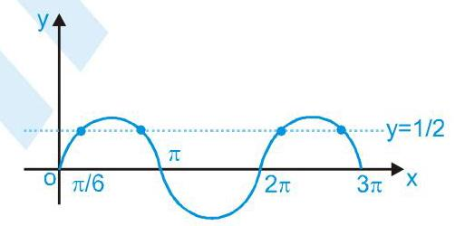

It is clear from figure that the curve intersect the line at four points in the given interval.

Hence, number of solutions are 4.

3. We have,

$\sin \theta  = \sin {4\theta } + \sin {7\theta } = 0$

$\Rightarrow  \left( {\sin \theta  + \sin {7\theta }}\right)  + \sin {4\theta } = 0$

$\Rightarrow  2\sin {4\theta }\cos {3\theta } + \sin {4\theta } = 0$

$\Rightarrow  \sin {4\theta } = 0\;$ or $\cos {3\theta } =  - \frac{1}{2}$

$$
\Rightarrow  {4\theta } = \pi ,{2\pi },{3\pi }\text{or}{3\theta } = \frac{2\pi }{3},\frac{4\pi }{3},\frac{8\pi }{3}
$$

$$
\Rightarrow  \theta  = \frac{2\pi }{9},\frac{\pi }{4},\frac{\pi }{2},\frac{4\pi }{9},\frac{3\pi }{4},\frac{8\pi }{9}
$$

$$
\text{4.}{\cos }^{2}\left( {x + \frac{\pi }{6}}\right)  + {\cos }^{2}x - 2\cos \left( {x + \frac{\pi }{6}}\right) \cos \frac{\pi }{6} = {\sin }^{2}\frac{\pi }{6}
$$

$$
\Rightarrow  {\cos }^{2}\left( {\mathrm{x} + \frac{\pi }{6}}\right)  + {\cos }^{2}\mathrm{x} - {\sin }^{2}\frac{\pi }{6} - 2\cos \left( {\mathrm{x} - \frac{\pi }{6}}\right) \cos \frac{\pi }{6} = 0
$$

$\Rightarrow  {\cos }^{2}\left( {x + \frac{\pi }{6}}\right)  + \cos \left( {x + \frac{\pi }{6}}\right) \cos \left( {x - \frac{\pi }{6}}\right)$

$$
\Rightarrow   - 2\cos \left( {\mathrm{x} + \frac{\pi }{6}}\right) \cos \frac{\pi }{6} = 0
$$

$$
\Rightarrow  \cos \left( {\mathrm{x} + \frac{\pi }{6}}\right) \left\{  {\cos \left( {\mathrm{x} + \frac{\pi }{6}}\right)  + \cos \left( {\mathrm{x} - \frac{\pi }{6}}\right)  - 2\cos \frac{\pi }{6}}\right\}   = 0
$$

$$
\Rightarrow  \cos \left( {\mathrm{x} + \frac{\pi }{6}}\right) \left\{  {2\cos \mathrm{x}\cos \frac{\pi }{6} - 2\cos \frac{\pi }{6}}\right\}   = 0
$$

$\Rightarrow  2\cos \left( {\mathrm{x} + \frac{\pi }{6}}\right) \cos \frac{\pi }{6}\left( {\cos \mathrm{x} - 1}\right)  = 0$

$\Rightarrow  \cos \left( {x + \frac{\pi }{6}}\right) \left( {\cos x - 1}\right)  = 0$

$$
\Rightarrow  \mathrm{x} + \frac{\pi }{6} =  \pm  \frac{\pi }{2}\text{or,}\mathrm{x} = 0
$$

$$
\Rightarrow  \mathrm{x} = \frac{\pi }{3}, - \frac{2\pi }{3},0
$$

$$
\Rightarrow  \mathrm{x} = 0,\frac{\pi }{3}
$$

$\left\lbrack  {\mathrm{Q}\mathrm{x} \in  \left( {-\frac{\pi }{2},\frac{\pi }{2}}\right) }\right\rbrack$

5. $\cos x + \cos {2x} + \cos {3x} + \cos {4x} = 0$

$2\cos \frac{5\mathrm{x}}{2} \cdot  \cos \frac{3\mathrm{c}}{2} + 2\cos \frac{5\mathrm{x}}{2} \cdot  \cos \frac{\mathrm{x}}{2} = 0$

$2\cos \frac{5x}{2} \times  2\cos x \cdot  \cos \frac{x}{2} = 0$

$\mathrm{x} = \frac{\left( {2\mathrm{n} + 1}\right) \pi }{5},\frac{\left( {2\mathrm{k} + 1}\right) \pi }{2},\left( {2\mathrm{r} + 1}\right) \pi ,$

where $\mathrm{n},\mathrm{k} \in  \mathbb{Z}$ or $0 \leq  \mathrm{x} \leq  {2\pi }$

$$
\text{Hence}\mathrm{x} = \frac{\pi }{5},\frac{3\pi }{5},\pi ,\frac{2\pi }{5},\frac{9\pi }{5},\frac{\pi }{2},\frac{3\pi }{2}
$$

## Part # II : IIT-JEE ADVANCED

1. To simplify the determinant, let $\sin x = a;\cos x = b$ . Then the equation becomes

$$
\left| \begin{array}{lll} a & b & b \\  b & a & b \\  b & b & a \end{array}\right|  = 0
$$

Operating ${\mathrm{C}}_{2} \rightarrow  {\mathrm{C}}_{2} - {\mathrm{C}}_{1};{\mathrm{C}}_{3} \rightarrow  {\mathrm{C}}_{3} - {\mathrm{C}}_{2}$ , we get

$\left| \begin{matrix} a & b - a & 0 \\  b & a - b & b - a \\  b & 0 & a - b \end{matrix}\right|  = 0$

or $a{\left( a - b\right) }^{2} - \left( {b - a}\right) \left\lbrack  {b\left( {a - b}\right)  - b\left( {b - a}\right) }\right\rbrack   = 0$

or $a{\left( a - b\right) }^{2} - {2b}\left( {b - a}\right) \left( {a - b}\right)  = 0$

or ${\left( a - b\right) }^{2}\left( {a - {2b}}\right)  = 0$

or $a = b\;$ or $\;a = {2b}$

or $\frac{a}{b} = 1\;$ or $\;\frac{a}{b} = 2$

$\Rightarrow  \tan \mathrm{x} = 1$ or $\tan \mathrm{x} = 2$

But we have $- \frac{\pi }{4} \leq  \mathrm{x} \leq  \frac{\pi }{4}$

$\Rightarrow  \tan \left( \frac{\pi }{4}\right)  \leq  \tan x \leq  \tan \left( \frac{\pi }{4}\right)$

$\Rightarrow   - 1 \leq  \tan x \leq  1$

$\therefore \tan \mathrm{x} = 1\; \Rightarrow  \mathrm{x} = \pi /4$

Therefore, there is only one real root.

2. We know that

$- \sqrt{{a}^{2} + {b}^{2}} \leq  a\cos \theta  + b\sin \theta  \leq  \sqrt{{a}^{2} + {b}^{2}}$

$\Rightarrow   - \sqrt{74} \leq  2\mathrm{k} + 1 \leq  \sqrt{74}$

$\Rightarrow   - 8 \leq  2\mathrm{k} + 1 \leq  8\; \Rightarrow   - {4.5} \leq  \mathrm{k} \leq  {3.5}$

Considering only integral values, which means $\mathrm{k}$ can take eight integral values.

3.

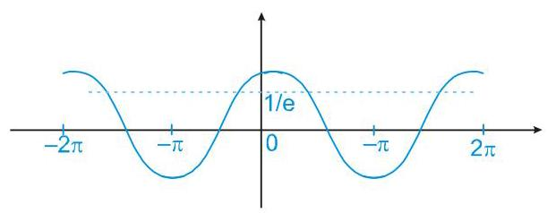

$\alpha  - \beta  = 0, - {2\pi }$ or ${2\pi }$

$\alpha  - \beta  = 0 \Rightarrow  \alpha  = \beta  \Rightarrow  \cos {2\beta } = \frac{1}{\mathrm{e}}$

This is true for ’ 4 ’ value of ’ $\alpha$ ’,’ $\beta$ ’

If $\alpha  - \beta  =  - {2\pi }$

$\Rightarrow  \alpha  =  - \pi$ and $\beta  = \pi$ and $\cos \left( {\alpha  + \beta }\right)  = 1$

$\Rightarrow$ (No solution)

similarly if $\alpha  - \beta  = {2\pi }$

$\Rightarrow  \alpha  = \pi$ and $\beta  =  - \pi$ again no solution results