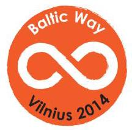

Time 

allowed

: 4 hours and 30 minutes.

Tools for writing and drawing are the only ones allowed.

Problem 1. Show that

$$
\cos \left( {56}^{ \circ  }\right)  \cdot  \cos \left( {2 \cdot  {56}^{ \circ  }}\right)  \cdot  \cos \left( {{2}^{2} \cdot  {56}^{ \circ  }}\right)  \cdot  \ldots  \cdot  \cos \left( {{2}^{23} \cdot  {56}^{ \circ  }}\right)  = \frac{1}{{2}^{24}}.
$$

Problem 2. Let ${a}_{0},{a}_{1},\ldots ,{a}_{N}$ be real numbers satisfying ${a}_{0} = {a}_{N} = 0$ and

$$
{a}_{i + 1} - 2{a}_{i} + {a}_{i - 1} = {a}_{i}^{2}
$$

for $i = 1,2,\ldots , N - 1$ . Prove that ${a}_{i} \leq  0$ for $i = 1,2,\ldots , N - 1$ .

Problem 3. Positive real numbers $a, b, c$ satisfy $\frac{1}{a} + \frac{1}{b} + \frac{1}{c} = 3$ . Prove the inequality

$$
\frac{1}{\sqrt{{a}^{3} + b}} + \frac{1}{\sqrt{{b}^{3} + c}} + \frac{1}{\sqrt{{c}^{3} + a}} \leq  \frac{3}{\sqrt{2}}.
$$

Problem 4. Find all functions $f$ defined on all real numbers and taking real values such that

$$
f\left( {f\left( y\right) }\right)  + f\left( {x - y}\right)  = f\left( {{xf}\left( y\right)  - x}\right)
$$

for all real numbers $x, y$ .

Problem 5. Given positive real numbers $a, b, c, d$ that satisfy equalities

$$
{a}^{2} + {d}^{2} - {ad} = {b}^{2} + {c}^{2} + {bc}\;\text{ and }\;{a}^{2} + {b}^{2} = {c}^{2} + {d}^{2},
$$

find all possible values of the expression $\frac{{ab} + {cd}}{{ad} + {bc}}$ .

Problem 6. In how many ways can we paint 16 seats in a row, each red or green, in such a way that the number of consecutive seats painted in the same colour is always odd?

Problem 7. Let ${p}_{1},{p}_{2},\ldots ,{p}_{30}$ be a permutation of the numbers $1,2,\ldots ,{30}$ . For how many permutations does the equality $\mathop{\sum }\limits_{{k = 1}}^{{30}}\left| {{p}_{k} - k}\right|  = {450}$ hold?

Problem 8. Albert and Betty are playing the following game. There are 100 blue balls in a red bowl and 100 red balls in a blue bowl. In each turn a player must make one of the following moves:

a) Take two red balls from the blue bowl and put them in the red bowl.

b) Take two blue balls from the red bowl and put them in the blue bowl.

c) Take two balls of different colors from one bowl and throw the balls away.

They take alternate turns and Albert starts. The player who first takes the last red ball from the blue bowl or the last blue ball from the red bowl wins. Determine who has a winning strategy.

Problem 9. What is the least posssible number of cells that can be marked on an $n \times  n$ board such that for each $m > \frac{n}{2}$ both diagonals of any $m \times  m$ sub-board contain a marked cell?

Problem 10. In a country there are 100 airports. Super-Air operates direct flights between some pairs of airports (in both directions). The traffic of an airport is the number of airports it has a direct Super-Air connection with. A new company, Concur-Air, establishes a direct flight between two airports if and only if the sum of their traffics is at least 100. It turns out that there exists a round-trip of Concur-Air flights that lands in every airport exactly once. Show that then there also exists a round-trip of Super-Air flights that lands in every airport exactly once.

Problem 11. Let $\Gamma$ be the circumcircle of an acute triangle ${ABC}$ . The perpendicular to ${AB}$ from $C$ meets ${AB}$ at $D$ and $\Gamma$ again at $E$ . The bisector of angle $C$ meets ${AB}$ at $F$ and $\Gamma$ again at $G$ . The line ${GD}$ meets $\Gamma$ again at $H$ and the line ${HF}$ meets $\Gamma$ again at $I$ . Prove that ${AI} = {EB}$ .

Problem 12. Triangle ${ABC}$ is given. Let $M$ be the midpoint of the segment ${AB}$ and $T$ be the midpoint of the arc ${BC}$ not containing $A$ of the circumcircle of ${ABC}$ . The point $K$ inside the triangle ${ABC}$ is such that ${MATK}$ is an isosceles trapezoid with ${AT}\parallel {MK}$ . Show that ${AK} = {KC}$ .

Problem 13. Let ${ABCD}$ be a square inscribed in a circle $\omega$ and let $P$ be a point on the shorter arc ${AB}$ of $\omega$ . Let ${CP} \cap  {BD} = R$ and ${DP} \cap  {AC} = S$ . Show that triangles ${ARB}$ and ${DSR}$ have equal areas.

Problem 14. Let ${ABCD}$ be a convex quadrilateral such that the line ${BD}$ bisects the angle ${ABC}$ . The circumcircle of triangle ${ABC}$ intersects the sides ${AD}$ and ${CD}$ in the points $P$ and $Q$ , respectively. The line through $D$ and parallel to ${AC}$ intersects the lines ${BC}$ and ${BA}$ at the points $R$ and $S$ , respectively. Prove that the points $P, Q, R$ and $S$ lie on a common circle.

Problem 15. The sum of the angles $A$ and $C$ of a convex quadrilateral ${ABCD}$ is less than ${180}^{ \circ  }$ . Prove that

$$
{AB} \cdot  {CD} + {AD} \cdot  {BC} < {AC}\left( {{AB} + {AD}}\right) .
$$

Problem 16. Determine whether ${712}! + 1$ is a prime number.

Problem 17. Do there exist pairwise distinct rational numbers $x, y$ and $z$ such that

$$
\frac{1}{{\left( x - y\right) }^{2}} + \frac{1}{{\left( y - z\right) }^{2}} + \frac{1}{{\left( z - x\right) }^{2}} = {2014}?
$$

Problem 18. Let $p$ be a prime number, and let $n$ be a positive integer. Find the number of quadruples $\left( {{a}_{1},{a}_{2},{a}_{3},{a}_{4}}\right)$ with ${a}_{i} \in  \left\{  {0,1,\ldots ,{p}^{n} - 1}\right\}$ for $i = 1,2,3,4$ such that

$$
{p}^{n} \mid  \left( {{a}_{1}{a}_{2} + {a}_{3}{a}_{4} + 1}\right) .
$$

Problem 19. Let $m$ and $n$ be relatively prime positive integers. Determine all possible values of

$$
\gcd \left( {{2}^{m} - {2}^{n},{2}^{{m}^{2} + {mn} + {n}^{2}} - 1}\right) .
$$

Problem 20. Consider a sequence of positive integers ${a}_{1},{a}_{2},{a}_{3},\ldots$ such that for $k \geq  2$ we have

$$
{a}_{k + 1} = \frac{{a}_{k} + {a}_{k - 1}}{{2015}^{i}},
$$

where ${2015}^{i}$ is the maximal power of 2015 that divides ${a}_{k} + {a}_{k - 1}$ . Prove that if this sequence is periodic then its period is divisible by 3 .