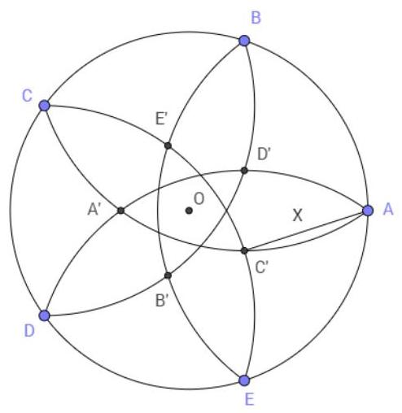
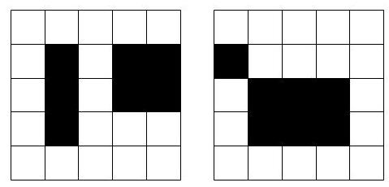

Individual Round

CHMMC 2016

November 20, 2016

Problem 1. We say that ${d}_{k}{d}_{k - 1}\cdots {d}_{1}{d}_{0}$ represents the number $n$ in base -2 if each ${d}_{i}$ is either 0 or 1, and $n = {d}_{k}{\left( -2\right) }^{k} + {d}_{k - 1}{\left( -2\right) }^{k - 1} + \cdots  + {d}_{1}\left( {-2}\right)  + {d}_{0}$ . For example,110 represents the number 2 in base -2 . What string represents 2016 in base -2 ?

Solution 1. 110000100000 . The place values for base -2 are $1, - 2,4, - 8$ , etc. Note that ${2016} =$ ${4096} - {2048} - {16} = {\left( -2\right) }^{12} + {\left( -2\right) }^{11} + {\left( -2\right) }^{5}$ .

Problem 2. Alice and Bob find themselves on a coordinate plane at time $t = 0$ at points $A\left( {1,0}\right)$ , and $B\left( {-1,0}\right)$ . They have no sense of direction, but they want to find each other. They each pick a direction with uniform random probability. Both Alice and Bob travel at speed $1\frac{\text{ unit }}{\text{ min }}$ in their chosen directions. They continue on their straight line paths forever, each hoping to catch sight of the other. They each have a 1-unit radius field of view: they can see something iff its distance to them is at most 1 . What is the probability that they will ever see each other?

Solution 2. We can look at the problem from the eyes of Alice, in which case Bob starts at point $B\left( {-2,0}\right)$ . From Alice's perspective, Bob moves in a direction and speed decided by the difference of their two velocity vectors. Then by assumption, the direction and speed that Bob moves is the sum of two uniform random unit vectors. By symmetry, this direction is uniform random. Thus from Alice's perspective, Bob starts at point $B\left( {-2,0}\right)$ and moves in a uniform random direction. Since the question asks the probability that they will ever see each other, we can ignore the speed at which Bob moves. Then the probability that he will enter Alice’s vision, which is a unit circle centered at the origin, is $1/6$ . This can be seen by drawing tangent lines to the circle going through point $B$ and noticing the two ${30} - {60} - {90}$ triangles.

Problem 3. A gambler offers you a $\$ 2$ ticket to play the following game. First, you pick a real number $0 \leq  p \leq  1$ . Then, you are given a weighted coin with probability $p$ of coming up heads and probability $1 - p$ of coming up tails, and flip this coin twice. The first time the coin comes up heads, you receive $\$ 1$ , and the first time it comes up tails, you receive $\$ 2$ . Given an optimal choice of $p$ , what is your expected net winning?

Solution 3. Fix $p$ . The probability of flipping ${HH}$ is ${p}^{2}$ , and flipping ${HH}$ wins you $\$ 1$ , the probability of flipping ${HT}$ or ${TH}$ is ${2p}\left( {1 - p}\right)$ , and either wins you $\$ 3$ , and the probability of flipping ${TT}$ is ${\left( 1 - p\right) }^{2}$ , and this wins you $\$ 2$ . Thus your expected winnings from the game are ${p}^{2} + {6p}\left( {1 - p}\right)  + 2{\left( 1 - p\right) }^{2} =  - 3{p}^{2} + {2p} + 2$ , which has a maximum of $7/3$ at $p = 1/3$ . Taking into account your initial loss of $\$ 2$ on the ticket, your expected net gain for the optimal choice $p = 1/3$ is $7/3 - 2 = 1/3$ .

Problem 4. Compute

$$
\mathop{\sum }\limits_{{n \geq  1}}\frac{{2}^{n + 1}}{8 \cdot  {4}^{n} - 6 \cdot  {2}^{n} + 1}.
$$

Solution 4. We can telescope the sum by writing

$$
\mathop{\sum }\limits_{{n \geq  1}}\frac{{2}^{n + 1}}{8 \cdot  {4}^{n} - 6 \cdot  {2}^{n} + 1} = \mathop{\sum }\limits_{{n \geq  1}}\frac{\left( {{2}^{n + 2} - 1}\right)  - \left( {{2}^{n + 1} - 1}\right) }{\left( {{2}^{n + 1} - 1}\right) \left( {{2}^{n + 2} - 1}\right) }
$$

$$
= \mathop{\sum }\limits_{{n \geq  1}}\left( {\frac{1}{{2}^{n + 1} - 1} - \frac{1}{{2}^{n + 2} - 1}}\right)
$$

$$
= \frac{1}{{2}^{2} - 1} = 1
$$

Problem 5. Suppose you have 27 identical unit cubes, where on each cube the three faces adjacent to one vertex are colored red, and the three faces adjacent to the opposite vertex are colored blue. The cubes are assembled randomly into a single 3 by 3 by 3 cube. (In particular, the orientation of each unit cube is distributed uniformly over the possible orientations.) The probability that the outside of this cube is entirely a single color is equal to $\frac{1}{{2}^{n}}$ . Find $n$ .

Solution 5. Consider the probability that the outside of the cube is entirely red. For each corner cube, there is a 1/8 chance that the three red faces will face outward. For each edge cube, there is a 1/4 chance that two red faces will face outward (because out of the 12 edges on the cube, 3 of them are adjacent to two red faces). For each face cube, there is a $1/2$ chance that a red face will face outward. So the probability is ${\left( 1/8\right) }^{8}{\left( 1/4\right) }^{12}{\left( 1/2\right) }^{6}$ . The probability that the cube is all blue is the same, so the chance that the cube is all red or all blue is $2{\left( 1/8\right) }^{8}{\left( 1/4\right) }^{12}{\left( 1/2\right) }^{6} = 1/{2}^{53}$ . The answer is $n = {53}$ .

Problem 6. How many binary strings of length 10 are there that don't contain either of the substrings 101 or 010 ?

Solution 6. Given a valid string of length $n - 1$ that ends in 1 (resp. 0), we can append a 1 (resp. 0) to get a valid string of length $n$ . Also, given a valid string of length $n - 2$ that ends in 1 (resp. 0), we can append 10 (resp. 01) to get a valid string of length $n$ . Every string of length $n$ can be formed in one of these two ways, so if ${S}_{n}$ is the number of valid strings of length $n$ , then ${S}_{n} = {S}_{n - 1} + {S}_{n - 2}$ for $n \geq  3$ . Since ${S}_{1} = 2$ and ${S}_{2} = 4$ , we can use the recurrence to calculate ${S}_{10} = {178}$ .

Problem 7. Let $f\left( x\right)  = \frac{1}{1 - \frac{3x}{16}}$ . Consider the sequence $0, f\left( 0\right) , f\left( {f\left( 0\right) }\right) ,{f}^{3}\left( 0\right) ,\ldots {f}^{n}\left( 0\right) ,\ldots$ . Find the smallest $L$ such that ${f}^{n}\left( 0\right)  \leq  L$ for all $n$ . If no such $L$ exists, write "none".

Solution 7. Solve the quadratic equation $x = f\left( x\right)  = \frac{1}{1 - \frac{3x}{16}}$ . This has solutions $x = \frac{4}{3}, x = 4$ . Now examine the first few terms of the sequence: $0,1,\frac{16}{13},\frac{13}{10},\ldots$ The sequence appears to monotonically approach $\frac{4}{3}$ . We can prove that this is the case as follows:

First, notice that for all $x < \frac{4}{3}$ , we have $f\left( x\right)  < \frac{4}{3}$ . Hence $L \leq  \frac{4}{3}$ .

Next, as a lemma, we prove that for any $\epsilon  > 0, f\left( {\frac{4}{3} - \epsilon }\right)  > \frac{4}{3} - \frac{\epsilon }{3}$ :

$$
f\left( {\frac{4}{3} - \epsilon }\right)  = \frac{1}{1 - \frac{3}{16} \cdot  \frac{4}{3} + \frac{3\epsilon }{16}} = \frac{1}{\frac{3}{4} + \frac{3\epsilon }{16}}
$$

$$
= \frac{4}{3} - \frac{\frac{3\epsilon }{16}}{\frac{3}{4}\left( {\frac{3}{4} + \frac{3\epsilon }{16}}\right) } = \frac{4}{3} - \frac{\epsilon }{3 + \frac{3\epsilon }{4}}
$$

$$
> \frac{4}{3} - \frac{\epsilon }{3}
$$

In the second line we used the equation $\frac{1}{a + b} = \frac{1}{a} - \frac{b}{a\left( {a + b}\right) }$ . Then by induction on $n$ , starting from $x = 0 =$ $\frac{4}{3} - \frac{4}{3}$ , we have that ${f}^{n}\left( 0\right)  \geq  \frac{4}{3} - \frac{4}{{3}^{n + 1}}$ .

Now suppose $L < \frac{4}{3}$ . Then there is some $n$ large enough that ${f}^{n}\left( 0\right)  \geq  \frac{4}{3} - \frac{4}{{3}^{n + 1}} > L$ , so $L$ is not an upper bound for the sequence. Hence $L = 4/3$ is the smallest upper bound.

Problem 8. Define $n\% d$ as the remainder when $n$ is divided by $d$ , i.e. $n\% d$ is the number $r$ with $n = {qd} + r$ such that $0 \leq  r < \left| d\right|$ . What is the smallest positive integer $n$ , not divisible by5,7,11, or13, for which ${n}^{2}\% 5 < {n}^{2}\% 7 < {n}^{2}\% {11} < {n}^{2}\% {13}$ ?

Solution 8. 19. First, examine the possible values for ${n}^{2}\% 5$ and ${n}^{2}\% 7$ : they are $\{ 1,4\}$ and $\{ 1,2,4\}$ , respectively. Since ${n}^{2}\% 5 < {n}^{2}\% 7$ , we must have ${n}^{2}\% 5 = 1$ , so $n\% 5 =  \pm  1$ . Therefore only numbers of the form $n = {5k} \pm  1$ need be considered.

The first few numbers of the form ${5k} \pm  1$ that are not divisible by 7,11, or 13 are1,4,6,9,16,19. Squaring each and reducing modulo 7 yields the sequence1,2,1,4,4,4. We only need to consider the numbers yielding more than 1, namely,4,9,16,19. Squaring these and reducing modulo 11 yields5,4,3,9; comparing to the squares modulo 7, we see that we only need to consider 4 and 19 . Finally, ${4}^{2}\% {13} = 3 < 5 = {4}^{2}\% {11}$ , so 4 does not work, but

$$
{19}^{2}\% 5 = 1 < {19}^{2}\% 7 = 4 < {19}^{2}\% {11} = 9 < {19}^{2}\% {13} = {10},
$$

so we are done.

Problem 9. In quadrilateral ${ABCD},{AB} = {DB}$ and ${AD} = {BC}$ . If $m\angle {ABD} = {36}^{ \circ  }$ and $m\angle {BCD} = {54}^{ \circ  }$ , find $m\angle {ADC}$ in degrees.

Solution 9. Let $x = m\angle {ADC}$ . Note that triangle ${ABD}$ is isosceles with base angle 72. Applying the law of sines to triangle ${BCD}$ gives $\frac{\sin \left( {x - {72}}\right) }{BC} = \frac{\sin {54}}{BD}$ , and applying the law of sines to triangle ${ABD}$ gives $\frac{\sin {72}}{BD} = \frac{\sin {36}}{AD}$ . Rearranging these two equations and using ${AD} = {BC}$ , we can find $\sin \left( {x - {72}}\right)  = \frac{\sin {36}\sin {54}}{\sin {72}} =$ $\frac{\sin {36}\cos {36}}{\sin {72}}$ . By the double angle formula for sine, this equals $1/2$ , so $x - {72} = {30}$ or 150 . But $x - {72} <$ ${180} - {54} = {126}$ because of the triangle ${BCD}$ , so $x - {72} = {30}$ and therefore $x = {102}$

Problem 10. For a positive integer $n$ , let $p\left( n\right)$ be the number of prime divisors of $n$ , counted with multiplicity, so for example, $p\left( 3\right)  = 1, p\left( 4\right)  = p\left( 6\right)  = 2$ . Now define the sequence ${a}_{0},{a}_{1},{a}_{2},\ldots$ by ${a}_{0} = 2$ , and for $n \geq  0$ , ${a}_{n + 1} = {8}^{p\left( {a}_{n}\right) } + 2$ . Compute

$$
\mathop{\sum }\limits_{{n = 0}}^{\infty }\frac{{a}_{n}}{{2}^{n}}
$$

Solution 10. We have ${a}_{0} = 2,{a}_{1} = {10},{a}_{2} = {66},{a}_{3} = {514}$ , and ${a}_{4} = {66}$ again, so the sequence becomes periodic with period 2 . It follows that ${a}_{2n} = {66}$ and ${a}_{{2n} + 1} = {514}$ for each $n \geq  1$ , so

$$
\mathop{\sum }\limits_{{n = 0}}^{\infty }\frac{{a}_{n}}{{2}^{n}} = \frac{2}{1} + \frac{10}{2} + \mathop{\sum }\limits_{{n = 1}}^{\infty }\left( {\frac{66}{{2}^{2n}} + \frac{514}{{2}^{{2n} + 1}}}\right)
$$

$$
= 7 + \frac{323}{4}\mathop{\sum }\limits_{{n = 0}}^{\infty }\frac{1}{{4}^{n}}
$$

$$
= 7 + \frac{{323}/4}{1 - {4}^{-1}}
$$

$$
= \frac{344}{3}\text{.}
$$

Problem 11. Let $a, b \in  \left\lbrack  {0,1}\right\rbrack  , c \in  \left\lbrack  {-1,1}\right\rbrack$ be chosen independently and uniformly at random. What is the probability that $p\left( x\right)  = a{x}^{2} + {bx} + c$ has a root in $\left\lbrack  {0,1}\right\rbrack$ ?

Solution 11. Ignoring cases where $a = 0$ or $b = 0$ (since these have probability 0 ), $a$ and $b$ are positive, hence $p\left( x\right)$ is strictly increasing on $\left\lbrack  {0,1}\right\rbrack$ . Then $p\left( x\right)$ has a root in $\left\lbrack  {0,1}\right\rbrack$ exactly when both $p\left( 0\right)  \leq  0$ and $p\left( 1\right)  \geq  0$ . This is equivalent to $c \leq  0$ and $a + b + c \geq  0$ . Combining these with our given constraints gives a solid of volume 5/6 (this solid looks like a cube of side length 1 with a tetrahedron cut out), but the solid containing all(a, b, c)satisfying the given conditions has volume 2, so our probability is $\left( {5/6}\right) /2 = 5/{12}$ .

Problem 12. Let a be a positive real number, and let $C$ be the cube with vertices $\left( {\pm a, \pm  a, \pm  a}\right)$ and $T$ be the tetrahedron with vertices $\left( {{2a},{2a},{2a}}\right) ,\left( {{2a}, - {2a}, - {2a}}\right) ,\left( {-{2a},{2a}, - {2a}}\right) ,\left( {-{2a}, - {2a},{2a}}\right)$ . The intersection of $C$ and $T$ has volume $k{a}^{3}$ for some positive real $k$ . What is $k$ ?

Solution 12. Note that the triangle ${T}_{1}$ with vertices $\left( {{2a}, - {2a}, - {2a}}\right) ,\left( {-{2a},{2a}, - {2a}}\right) ,\left( {-{2a}, - {2a},{2a}}\right)$ lies in the plane $x + y + z =  - {2a}$ , which intersects $C$ at the triangle with vertices $\left( {0, - a, - a}\right) ,\left( {-a,0, - a}\right) ,\left( {-a, - a,0}\right)$ . Thus when we intersect $C$ with $T$ , since this triangle lies in ${T}_{1},{T}_{1}$ cuts off from $C$ the tetrahedron with vertices $\left( {-a, - a, - a}\right) ,\left( {0, - a, - a}\right) ,\left( {-a,0, - a}\right) ,\left( {-a, - a,0}\right)$ , which has volume $\frac{{a}^{3}}{6}$ . By symmetry, each other triangular face of $T$ also cuts off a tetrahedron of volume $\frac{{a}^{3}}{6}$ , so since the volume of $C$ is $8{a}^{3}$ , the volume of $C \cap  T$ is $8{a}^{3} - 4\left( \frac{{a}^{3}}{6}\right)  = \frac{22}{3}{a}^{3}$ . This gives $k = {22}/3$ .

Problem 13. A sequence of numbers ${a}_{1},{a}_{2},\ldots ,{a}_{m}$ is a geometric sequence modulo $n$ of length $m$ (for some positive integers $n$ and $m$ ) if for each index $i$ with $1 \leq  i \leq  m$ we have ${a}_{i} \in  \{ 0,1,2,\ldots , n - 1\}$ and there is some integer $k$ such that $n$ divides $\left( {{a}_{j + 1} - k{a}_{j}}\right)$ for $j = 1,2,\ldots , m - 1$ .

How many geometric sequences modulo 14 of length 14 are there?

Solution 13. Any geometric sequence modulo $n$ is determined by ${a}_{1}$ and $k$ , since for $j \geq  2,{a}_{j}$ must be the unique number in $\{ 0,1,2,\ldots , n - 1\}$ such that $n$ divides $\left( {{a}_{j} - {k}^{j - 1}{a}_{1}}\right)$ .

Now ${a}_{1}$ and ${a}_{2}$ determine ${a}_{3}$ , as follows. Suppose $k$ and ${k}^{\prime }$ are such that $n$ divides $\left( {{a}_{2} - k{a}_{1}}\right)$ and $\left( {{a}_{2} - {k}^{\prime }{a}_{1}}\right)$ . Then $n$ divides $\left( {k - {k}^{\prime }}\right) {a}_{1}$ , hence $\frac{n}{\gcd \left( {{a}_{1}, n}\right) }$ divides $\left( {k - {k}^{\prime }}\right)$ . Also, $\gcd \left( {{a}_{1}, n}\right)$ divides ${a}_{2}$ because ${a}_{2} = k{a}_{1} + {mn}$ for some integer $m$ , so $n$ divides $\left( {k - {k}^{\prime }}\right) {a}_{2}$ . Thus if $n$ divides both $\left( {{a}_{3} - k{a}_{2}}\right)$ and $\left( {{a}_{3}^{\prime } - {k}^{\prime }{a}_{2}}\right)$ for some ${a}_{3},{a}_{3}^{\prime } \in  \{ 0,1,2,\ldots , n - 1\}$ , then $n$ divides $\left( {{a}_{3} - {a}_{3}^{\prime }}\right)$ , so ${a}_{3} = {a}_{3}^{\prime }$ .

Similarly, ${a}_{2}$ and ${a}_{3}$ determine ${a}_{4}$ , etc., so the whole sequence is determined by ${a}_{1}$ and ${a}_{2}$ . Then to solve the problem, it suffices to count the number of pairs ${a}_{1},{a}_{2} \in  \{ 0,1,2,\ldots ,{13}\}$ such that for some integer $k$ , 14 divides $\left( {{a}_{2} - k{a}_{1}}\right)$ .

For any ${a}_{1} \in  \{ 0,1,2,\ldots ,{13}\}$ , there are $\frac{14}{\gcd \left( {{a}_{1},{14}}\right) }$ possible values for ${a}_{2}$ , since we can take $k = 0,1,2,\ldots$ , but by the above argument, the corresponding values for ${a}_{2}$ start repeating at $k = \frac{14}{\gcd \left( {{a}_{1},{14}}\right) }$ . Splitting up the possible values of ${a}_{1}$ into cases depending on the value of $\gcd \left( {{a}_{1},{14}}\right)  = 1,2,7,{14}$ , we see that there are

$$
6 \cdot  {14} + 6 \cdot  7 + 1 \cdot  2 + 1 \cdot  1 = {129}
$$

possible pairs ${a}_{1},{a}_{2}$ , hence 129 possible sequences.

We can speed up this last computation by recalling that the function

$$
f\left( n\right)  = \mathop{\sum }\limits_{{d \mid  n}}\varphi \left( d\right)  \cdot  d
$$

is multiplicative, where $\varphi$ is Euler’s totient function, and noting that the answer is $f\left( {14}\right)  = f\left( 2\right) f\left( 7\right)  =$ $\left( {1 + 1 \cdot  2}\right) \left( {1 + 6 \cdot  7}\right)  = 3 \cdot  {43} = {129}.$

Problem 14. Let circle $O$ be a unit circle with five points, $A, B, C, D$ , and $E$ , spaced equidistantly along the circumference of the circle. For each of the points, there is an arc inside circle $O$ with center at that point and beginning and ending at the two adjacent points (e.g., for point $A$ , there is an arc of center $A$ beginning at $E$ and ending at $B$ ). The arcs intersect each other at points ${A}^{\prime },{B}^{\prime },{C}^{\prime },{D}^{\prime }$ , and ${E}^{\prime }$ , as shown in the diagram. Find $X$ , the length of $\overline{A{C}^{\prime }}$ . You may leave your answer in the form $f\left( x\right)$ , where $f$ is a trigonometric function and $x$ is in simplest form.

Solution 14. Because $\overline{A{B}^{\prime }},\overline{C{B}^{\prime }},\overline{AB}$ , and $\overline{CB}$ are all radii of the arcs centered at $A$ or $C$ , their lengths are equal. Therefore, triangles $A{B}^{\prime }C$ and ${ABC}$ are congruent. Since ${ABCDE}$ is a regular pentagon, $m\angle {ABC} =$ 108, so by congruency, $m\angle A{B}^{\prime }C = {108}$ . Since ${A}^{\prime }{B}^{\prime }{C}^{\prime }{D}^{\prime }{E}^{\prime }$ is a regular pentagon, $m\angle {A}^{\prime }{B}^{\prime }{C}^{\prime } = {108}$ as well. Then $m\angle C{B}^{\prime }A = m\angle {C}^{\prime }{B}^{\prime }{A}^{\prime }$ , so by symmetry, we know that ${A}^{\prime }$ is on $\overline{C{B}^{\prime }}$ and ${C}^{\prime }$ is on $\overline{A{B}^{\prime }}$ .

Now triangle $O{B}^{\prime }{C}^{\prime }$ is isosceles with $m\angle O{C}^{\prime }{B}^{\prime } = m\angle O{B}^{\prime }{C}^{\prime } = \left( {1/2}\right) m\angle {A}^{\prime }{B}^{\prime }{C}^{\prime } = {54}$ , so $m\angle A{C}^{\prime }O$ : 126. Also, $m\angle {AO}{C}^{\prime } = \left( {1/2}\right) m\angle {AOE} = {36}$ . Then using the law of sines in triangle ${AO}{C}^{\prime }$ ,

$$
\frac{X}{\sin \left( {36}\right) } = \frac{1}{\sin \left( {126}\right) } = \frac{1}{\sin \left( {54}\right) } = \frac{1}{\cos \left( {36}\right) }.
$$

Then $X = \frac{\sin \left( {36}\right) }{\cos \left( {36}\right) } = \tan \left( {36}^{ \circ  }\right)$ .

Problem 15. How many pairs of nonintersecting closed rectangles are there in a 5 by 5 grid? (By "closed", we mean the rectangles include their boundaries, so for example, the pair on the right intersects, while the pair on the left does not).

Solution 15. Each rectangle is of the form $\left\lbrack  {a, b}\right\rbrack   \times  \left\lbrack  {c, d}\right\rbrack$ for some integers $0 \leq  a, b, c, d \leq  5$ with $a < b$ and $c < d$ . The condition that $\left\lbrack  {{a}_{1},{b}_{1}}\right\rbrack   \times  \left\lbrack  {{c}_{1},{d}_{1}}\right\rbrack$ and $\left\lbrack  {{a}_{2},{b}_{2}}\right\rbrack   \times  \left\lbrack  {{c}_{2},{d}_{2}}\right\rbrack$ do not intersect is equivalent to the condition that either their horizontal components $\left\lbrack  {{a}_{1},{b}_{1}}\right\rbrack$ and $\left\lbrack  {{a}_{2},{b}_{2}}\right\rbrack$ do not intersect, or their vertical components $\left\lbrack  {{c}_{1},{d}_{1}}\right\rbrack$ and $\left\lbrack  {{c}_{2},{d}_{2}}\right\rbrack$ do not intersect. The former means that either ${b}_{1} < {a}_{2}$ or ${b}_{2} < {a}_{1}$ , and similarly, the latter means that either ${d}_{1} < {c}_{2}$ or ${d}_{2} < {c}_{1}$ .

The number of pairs whose horizontal components do not intersect is $\left( \begin{array}{l} 6 \\  4 \end{array}\right) {\left( \begin{array}{l} 6 \\  2 \end{array}\right) }^{2} = {3375}$ , since without loss of generality ${b}_{1} < {a}_{2}$ (because the pair is unordered), which gives ${a}_{1} < {b}_{1} < {a}_{2} < {b}_{2}$ , so there are $\left( \begin{array}{l} 6 \\  4 \end{array}\right)$ choices of $\left\lbrack  {{a}_{1},{b}_{1}}\right\rbrack  ,\left\lbrack  {{a}_{2},{b}_{2}}\right\rbrack$ , and we must have ${c}_{1} < {d}_{1}$ and ${c}_{2} < {d}_{2}$ , so there are $\left( \begin{array}{l} 6 \\  2 \end{array}\right)$ choices of each $\left\lbrack  {{c}_{i},{d}_{i}}\right\rbrack$ . By the same argument, there are 3375 pairs whose vertical components do not intersect.

We have double-counted the pairs for which the both the horizontal components and vertical components do not intersect - we have without loss of generality that ${b}_{1} < {a}_{2}$ , so if ${d}_{1} < {c}_{2}$ , then there are $\left( \begin{array}{l} 6 \\  4 \end{array}\right)$ choices of $\left\lbrack  {{a}_{1},{b}_{1}}\right\rbrack  ,\left\lbrack  {{a}_{2},{b}_{2}}\right\rbrack$ and $\left( \begin{array}{l} 6 \\  4 \end{array}\right)$ choices of $\left\lbrack  {{c}_{1},{d}_{1}}\right\rbrack  ,\left\lbrack  {{c}_{2},{d}_{2}}\right\rbrack$ , so we have ${\left( \begin{array}{l} 6 \\  4 \end{array}\right) }^{2} = {225}$ pairs, and similarly there are 225 pairs with ${d}_{2} < {c}_{1}$ , giving a total of 450 pairs.

Thus the desired number of pairs is ${3375} + {3375} - {450} = {6300}$ .