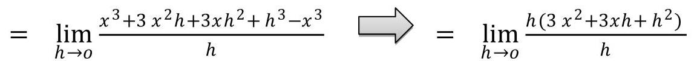
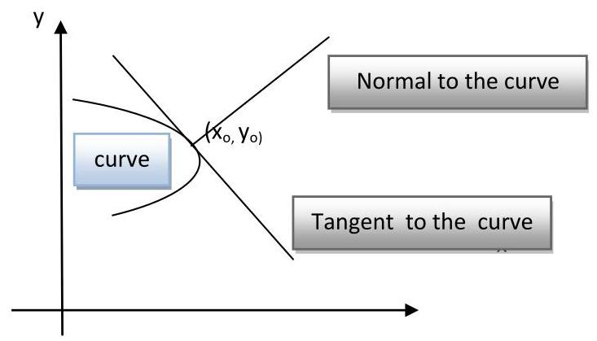
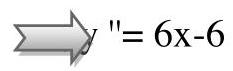

Mathimatics 1 Lecture 2 Department Computer Engeneering Dr. sarah alameedee

## The Derivative

Definition: The derivative of the function $y = f\left( x\right)$ with respect to the variable $x$ is the function ${\mathrm{y}}^{\prime }$ or ( ${\mathrm{f}}^{\prime }$ ) whose value at $\mathrm{x}$ is:

$$
{\mathrm{y}}^{\prime } = \frac{dy}{dx} = \frac{{df}\left( x\right) }{dx} = {\mathrm{f}}^{\prime }\left( \mathrm{x}\right)
$$

$$
\frac{dy}{dx} = \mathop{\lim }\limits_{{h \rightarrow  0}}\frac{f\left( {x + h}\right)  - f\left( x\right) }{h}
$$

Definition ofDerivative

$$
h = {\Delta x}
$$

Example: Use definition to find $\frac{dy}{dx}$ if $y = f\left( x\right)  = {x}^{3}$ .

Solution:

$$
\frac{dy}{dx} = \mathop{\lim }\limits_{{h \rightarrow  0}}\frac{f\left( {x + h}\right)  - f\left( x\right) }{h}\frac{dy}{dx} \rightarrow  \mathop{\lim }\limits_{{h \rightarrow  0}}\frac{f{\left( x + h\right) }^{3} - {x}^{3}}{h}
$$

$$
= \mathop{\lim }\limits_{{h \rightarrow  0}}\left( {3{x}^{2} + {3xh} + {h}^{2}}\right)  = 3{\mathrm{x}}^{2}
$$

(Derivative Rules)

---

	<table><tr><td>General formulas</td><td>Trigonometric functions</td></tr><tr><td>(1) $\frac{d}{dx}\left( c\right)  = 0$ (The derivative of a constant function is zero.) (2) $\frac{d}{dx}\left( \mathrm{x}\right)  = 1$ (The derivative of the identity function is 1.) (3) $\frac{d}{dx}\left( \mathrm{{cu}}\right)  = \mathrm{c}\frac{du}{dx}$ (Constant Multiple) (4) $\frac{d}{dx}\left( {\mathrm{u} + \mathrm{v}}\right)  = \frac{du}{dx} + \frac{dv}{dx}$ (Sum Rule) (5) $\frac{d}{dx}\left( {\mathrm{u} - \mathrm{v}}\right)  = \frac{du}{dx} - \frac{dv}{dx}$ (Difference Rule) (6) $\frac{d}{dx}\left( \mathrm{{uv}}\right)  = \mathrm{u}\frac{dv}{dx} + \mathrm{v}\frac{du}{dx}$ (Product Rule) (7) $\frac{d}{dx}\left( \frac{u}{v}\right)  = \frac{v\frac{du}{dx} - u\frac{dv}{dx}}{{v}^{2}}$ provided that $\mathrm{v} \neq  0$ (Quotient Rule) (8) $\frac{d}{dx}\left( \frac{1}{x}\right)  = \frac{-1}{{x}^{2}}$ provided that $\mathrm{x} \neq  0$ (9) $\frac{d}{dx}\left( {\mathrm{x}}^{\mathrm{m}}\right)  = {\mathrm{{mx}}}^{\mathrm{m} - 1}$ (Power Rule)</td><td>(1) $\frac{d}{dx}\left( {\sin \mathrm{x}}\right)  = \cos \mathrm{x}$ (2) $\frac{d}{dx}\left( {\cos x}\right)  =  - \sin x$ (3) $\frac{d}{dx}\left( {\tan x}\right)  = {\sec }^{2}x$ (4) $\frac{d}{dx}\left( {\cot \mathrm{x}}\right)  =  - {\csc }^{2}\mathrm{x}$ (5) $\frac{d}{dx}\left( {\sec x}\right)  = \sec x\tan x$ 6) $\frac{d}{dx}\left( {\csc x}\right)  =  - \csc x\cot x$ Chain rule Let $u = g\left( x\right)$ and $y = f\left( u\right)$ . Then, $y = f\left( u\right)  = f\left( {g\left( x\right) }\right)$ ${\mathrm{y}}^{\prime } = {\mathrm{f}}^{\prime }\left( {\mathrm{g}\left( \mathrm{x}\right) }\right)  * {\mathrm{g}}^{\prime }\left( \mathrm{x}\right)$ or $\frac{dy}{dx} = \frac{dy}{du} * \frac{du}{dg}$ Where $\frac{dy}{dx}$ is evaluated at $\mathrm{u} = \mathrm{g}\left( \mathrm{x}\right)$</td></tr></table>

---

$\underline{\text{ Example : derivative the functions: }}$

1) $y = 8\frac{dy}{dx}\frac{d}{dx}\left( 8\right)  = 0$

2) $y = {x}^{3}\frac{dy}{dx}\frac{d}{dx}\left( {x}^{3}\right)  = 3{x}^{3 - 1} = 3{x}^{2}$

3) $y = 3{x}^{3}\frac{dy}{dx} = \frac{d}{dx}\left( {3{x}^{3}}\right)  = 3 * 3{x}^{3 - 1} = 9{x}^{2}$

4)y= ${x}^{3} + \frac{4}{3}{x}^{2} - {5x} + 1\frac{dy}{dx} = \frac{d}{dx}\left( {x}^{3}\right)  + \frac{d}{dx}\left( {\frac{4}{3}{x}^{2}}\right)  - \frac{d}{dx}\left( {5x}\right)  + \frac{d}{dx}\left( 1\right)$

$$
= 3{x}^{2} + \frac{4}{3} * {2x} - 5 + 0 = 3{x}^{2} + \frac{8}{3}x - 5
$$

$$
\text{5)}y = \left( {{x}^{2} + 1}\right) \left( {{x}^{3} + 3}\right)
$$

From product rule with $u = {x}^{2} + 1$ and $v = {x}^{3} + 3$ , we find

$$
\frac{dy}{dx} = \frac{d}{dx}\left\lbrack  {\left( {{\mathrm{x}}^{2} + 1}\right) \left( {{\mathrm{x}}^{3} + 3}\right) }\right\rbrack   = \left( {{\mathrm{x}}^{2} + 1}\right) \left( {3{\mathrm{x}}^{2}}\right)  + \left( {{\mathrm{x}}^{3} + 3}\right) \left( {2\mathrm{x}}\right)
$$

$$
= 3{x}^{4} + 3{x}^{2} + 2{x}^{4} + {6x} = 5{x}^{4} + 3{x}^{2} + {6x}\text{.}
$$

6) $y = \frac{{x}^{2} - 1}{{x}^{2} + 1}\;$ We apply the quotient rule with $u = {x}^{2} - 1$ and $v = {x}^{2} + 1$ :

$$
\frac{dy}{dx} = \frac{\left( {{x}^{2} + 1}\right)  * {2x} - \left( {{x}^{2} - 1}\right)  * {2x}}{{\left( {x}^{2} + 1\right) }^{2}} = \frac{2{x}^{3} + {2x} - 2{x}^{3} + {2x}}{{\left( {x}^{2} + 1\right) }^{2}} = \frac{4x}{{\left( {x}^{2} + 1\right) }^{2}}
$$

$$
\text{7)}y = \frac{4}{{x}^{3}}\;\frac{dy}{dx} = \frac{d}{dx}\left( \frac{4}{{x}^{3}}\right) \; = 4\frac{d}{dx}\left( {\mathrm{x}}^{-3}\right)  = 4\left( {-3}\right) {\mathrm{x}}^{-4} = \frac{-{12}}{{x}^{4}}
$$

8) $y = {\left( 3{x}^{2} + 1\right) }^{2}$ (chain rule)

Let $y = f\left( u\right)  = f\left( {g\left( x\right) }\right) {y}^{\prime } = f\left( {g\left( x\right) }\right)  * {g}^{\prime }$

$= 2{\left( 3{x}^{2} + 1\right) }^{2 - 1} \cdot  \left( {3 * 2{x}^{2 - 1} + 0}\right)  = 2\left( {3{x}^{2} + 1}\right)  * {6x} = {36}{x}^{3} + {12x}$ Chain Rule:

<table><tr><td>Example: if $y = {u}^{3} - 1$ and $u = {2x}$ , find $\frac{dy}{dx}$ . $\frac{dy}{dx} = \frac{dy}{du} * \frac{du}{dx} = 3{\mathrm{u}}^{2} * 2 = 6{\left( 2\mathrm{x}\right) }^{2} = {24}{\mathrm{x}}^{2}$</td><td>, find $\frac{dy}{dx}$ . $\frac{dy}{dx} = \frac{dy}{du}/\frac{dx}{du} = \frac{{15}{u}^{2}}{2u} = \frac{15u}{2} = \frac{{15}\sqrt{x}}{2}$</td></tr></table>

Example: derivative the functions:

1) $y = {x}^{2} - \sin x$

2) $y = {x}^{2}\sin x$

$$
{\mathrm{y}}^{\prime } = {\mathrm{x}}^{2 * }\cos \mathrm{x} + \sin \mathrm{x} * 2\mathrm{x} = {\mathrm{x}}^{2}\cos \mathrm{x} + 2\mathrm{x}\sin \mathrm{x}
$$

3) $y = \sin {2x}$

$$
{\mathrm{y}}^{\prime } = \cos 2\mathrm{x} * 2 = 2\cos 2\mathrm{x}
$$

4) $y = \sin \left( {{x}^{2} - x}\right) \;{y}^{\prime } = \cos \left( {{x}^{2} - x}\right)  * \left( {{2x} - 1}\right)  = \left( {{2x} - 1}\right) \cos \left( {{x}^{2} - x}\right)$

5) $y = {\sin }^{5}{3x}\;{y}^{\prime } = 5{\sin }^{5 - 1}{3x} * \cos 3{x}^{ * }3 = {15}\cos {3x}{\sin }^{4}{3x}$

6) $y = \frac{4}{\cos x} + \frac{1}{\tan x}\;y = 4\sec x + \cot x\;{y}^{\prime } = 4\sec x\tan x - {\csc }^{2}x$ 7) $y = \left( {\sin x + \cos x}\right) \sec x$ ${\mathrm{y}}^{\prime } = \left( {\sin \mathrm{x} + \cos \mathrm{x}}\right) \frac{d}{dx}\left( {\sec \mathrm{x}}\right)  + \sec \mathrm{x}\frac{d}{dx}\left( {\sin \mathrm{x} + \cos \mathrm{x}}\right)$ $= \left( {\sin x + \cos x}\right) \sec x\tan x + \sec x\left( {\cos x - \sin x}\right)$ $= \frac{\left( {\sin x + \cos x}\right) \sin x}{{\cos }^{2}x} + \frac{\left( \cos x - \sin x\right) }{\cos x}$ $\frac{{\sin }^{2}x + \cos x\sin x + {\cos }^{2}x - \cos x\sin x}{{\cos }^{2}x} = \frac{1}{{\cos }^{2}x} = {\sec }^{2}\mathrm{x}$ Implicit differentiation:

<table><tr><td/></tr><tr><td>$Y = \left( {\sin x + \cos x}\right)  \rightarrow$</td></tr><tr><td>$Y = \tan x + 1$</td></tr><tr><td>${Y}^{\prime } = {\sec }^{2}x$</td></tr></table>

Example : 1) ${\mathrm{y}}^{2} - \mathrm{x} = 0\;{\mathrm{y}}^{2} = \mathrm{x}\;{\mathrm{y}}^{\prime }\;2\mathrm{y}{\mathrm{y}}^{\prime } = 1\;{\mathrm{y}}^{\prime } = \frac{1}{2y}\;{\mathrm{y}}^{\prime } = \frac{1}{2\sqrt{x}}$ 2) ${x}^{2} + {y}^{2} - {25} = 0\;{y}^{\prime } - y{y}^{\prime } = 0\;{2y}{y}^{\prime } =  - {2x}$

$$
{\mathrm{y}}^{\prime } = \frac{-x}{y} = \frac{-x}{\sqrt{{25} - {x}^{2}}}
$$

3) ${x}^{3} + {y}^{3} - {9yx} = 0\;{y}^{\prime }\;3{x}^{2} + 3{y}^{2}{y}^{\prime } - \left( {9{y}^{\prime } * 1 + x * 9{y}^{\prime }}\right)  = 0$

$3{y}^{2}{y}^{\prime } - {9x}{y}^{\prime } =  - 3{x}^{2} + {9y} \Rightarrow  \left( {3{y}^{2} - {9x}}\right) {y}^{\prime } = {9y} - 3{x}^{2}$

${y}^{\prime } = \frac{{9y} - 3{x}^{2}}{3{y}^{2} - {9x}} \Rightarrow   = \frac{{3y} - {x}^{2}}{{y}^{2} - {3x}}$ Tangent and Normal equation to the curve:

<table><tr><td>Tangent equation to the curve</td><td>Normal equation to the curve</td></tr><tr><td>The equation of tangent to the curve $\mathrm{y} = \mathrm{f}\left( \mathrm{x}\right)$ at the point $\left( {{\mathrm{x}}_{\mathrm{o}},{\mathrm{y}}_{\mathrm{o}}}\right)$ is : $\left( {\mathrm{y} - {\mathrm{y}}_{\mathrm{o}}}\right)  = \mathrm{m}\left( {\mathrm{x} - {\mathrm{x}}_{\mathrm{o}}}\right)$ Where $m$ is the slope of the curve the point $\left( {{\mathrm{x}}_{\mathrm{o}},{\mathrm{y}}_{\mathrm{o}}}\right)$</td><td>The equation of normal to the curve $\mathrm{y} = \mathrm{f}\left( \mathrm{x}\right)$ at the point $\left( {{\mathrm{x}}_{\mathrm{o}},{\mathrm{y}}_{\mathrm{o}}}\right)$ is : $\left( {\mathrm{y} - {\mathrm{y}}_{\mathrm{o}}}\right)  = {\mathrm{m}}_{1}\left( {\mathrm{x} - {\mathrm{x}}_{\mathrm{o}}}\right)$ Where ${m}_{1}$ is the slope of the curve the point $\left( {{\mathrm{x}}_{\mathrm{o}},{\mathrm{y}}_{\mathrm{o}}}\right)$${\mathrm{m}}_{1} = \frac{-1}{m}$</td></tr></table>

Example :Find an equations for the tangent and normal to the curve

$\mathrm{y} = \mathrm{x} + \frac{2}{x}$ at the point(1,3).

Solution: the slope of the curve is $\;\mathrm{m} = {\mathrm{y}}^{\prime } = 1 - \left( {2/{x}^{2}}\right)$

the slope at the point $\left( {1,3}\right) \;{\mathrm{y}}^{\prime }\left( 1\right)  = 1 - \left( {2/{x}^{2}}\right)  =  - 1$

-tangent equation (y-3) = (-1) (x-1) -normal equation

y+x-4=0 $\left( {y - 3}\right)  = \left( {-1/ - 1}\right) \left( {x - 1}\right)$

$y - x - 2 = 0$

## Higher Derivatives:

<table><tr><td>Higher Derivatives: If $y = f\left( x\right)$ , then First derivative: ${\mathrm{y}}^{\prime },{\mathrm{f}}^{\prime }\left( \mathrm{x}\right) ,\frac{dy}{dx}$ Second derivative: ${\mathrm{y}}^{\prime \prime },{\mathrm{f}}^{\prime \prime }\left( \mathrm{x}\right) ,\frac{{d}^{2}y}{d{x}^{2}}$ Third derivative: ${\mathrm{y}}^{\prime \prime \prime },{\mathrm{f}}^{\prime \prime \prime }\left( \mathrm{x}\right) ,\frac{{d}^{3}y}{d{x}^{3}}$ nth derivative: ${\mathrm{y}}^{\mathrm{n}},{\mathrm{f}}^{\mathrm{n}}\left( \mathrm{x}\right) ,\frac{{d}^{n}y}{d{x}^{n}}$</td><td>Distance , Velocity and Acceleration : Time : Distance - s(t) Velocity $\; - \mathrm{v}\left( \mathrm{t}\right) \;,\frac{ds}{dt}$ Acceleration - a(t) $\frac{dv}{dt}$ or $\frac{{d}^{2}s}{d{t}^{2}}$</td></tr></table>

Example :Finding higher derivatives. $y = {x}^{3} - 3{x}^{2} + 2$

Solution:

${y}^{\prime } = 3{x}^{2} - {6x}$

y"'= 6

$$
\Rightarrow  {y}^{\prime \prime \prime \prime } = 0
$$

Example: A body moves along a straight line according to the law $s = \frac{1}{2}{t}^{3} - {2t}$ . Determine its velocity and acceleration atthe end of 2 seconds.

Solution

$$
\mathrm{v} = \frac{ds}{dt} = \frac{3}{2}{\mathrm{t}}^{2} - 2 = \frac{3}{2}{2}^{2} - 2 = 4{m}_{/S}\;,\;\mathrm{a} = \frac{dv}{dt} = 3\mathrm{t} = 3 * 2 = 6{m}_{/S}
$$

H .W :

Q 1 . Find ${f}^{\prime }\left( x\right)$ by using definition.

1. $\mathrm{f}\left( \mathrm{x}\right)  = \frac{x}{x - 1}$ 2. $\mathrm{f}\left( \mathrm{x}\right)  = \sqrt{x}$

Q 2 . Find the first derivatives. Q 3. Find $\frac{dy}{dx}$ . Q4 . Find $\frac{dy}{dx}$ .

<table><tr><td>$\mathrm{y} = 6{\mathrm{x}}^{2} - {10}\mathrm{x} - 5{\mathrm{x}}^{-2}$</td><td colspan="2">$\mathrm{w} = {\left( 2\mathrm{x} - 7\right) }^{-1}\left( {\mathrm{x} + 5}\right)$</td><td>$y = \left( {3{x}^{2}}\right) \left( {{x}^{3} - x - 1}\right)$</td></tr><tr><td>$\mathrm{f}\left( \mathrm{s}\right)  = \frac{\sqrt{s} - 1}{\sqrt{s} + 1}$</td><td colspan="2">$\mathrm{r} = \frac{1}{3{s}^{2}} - \frac{5}{2s}$</td><td>$\mathrm{u} = \frac{{5x} + 1}{2\sqrt{x}}$</td></tr><tr><td>$\mathrm{w} = \left( \frac{1 + {3z}}{3z}\right) \left( {3 - \mathrm{z}}\right)$</td><td colspan="2">$\mathrm{s} = \frac{{t}^{2} + {5t} - 1}{{t}^{2}}$</td><td>$\mathrm{w} = \left( {\mathrm{z} + 1}\right) \left( {\mathrm{z} - 1}\right) \left( {{\mathrm{z}}^{2} + 1}\right)$</td></tr><tr><td>$\mathrm{y} = {\left( 5{\mathrm{x}}^{3} - {\mathrm{x}}^{4}\right) }^{7}$</td><td colspan="2">y $= \sqrt{3{x}^{2} - {4x} + 6}$</td><td>$y\left( x\right)  = {x}^{2}{\left( {x}^{3} - t\right) }^{5}$</td></tr><tr><td>$y = {\left( 1 - \frac{x}{7}\right) }^{-7}$</td><td colspan="2">$y = \frac{\left( {x + 1}\right) \left( {x + 2}\right) }{\left( {x - 1}\right) \left( {x - 2}\right) }$</td><td>$\mathrm{y} = 9\tan \left( \frac{x}{3}\right)$</td></tr><tr><td>$\mathrm{y} = {\mathrm{x}}^{2}\cos \mathrm{x}$</td><td colspan="2">$\mathrm{y} = \sin \mathrm{x}\tan \mathrm{x}$</td><td>$\mathrm{y} = {\sin }^{5}\left( {2\mathrm{x}}\right)$</td></tr><tr><td colspan="2">$\mathrm{y} = \left( {\sec \mathrm{x} + \tan \mathrm{x}}\right) \left( {\sec \mathrm{x} - \tan \mathrm{x}}\right)$</td><td colspan="2">g(t) = tan(5 - sin 2t)</td></tr><tr><td>$\mathrm{g}\left( \mathrm{x}\right)  = \left( {2 - \mathrm{x}}\right) {\tan }^{2}\mathrm{x}$</td><td colspan="2">y = sec(tan 3x)</td><td>$\mathrm{r} = \sin \left( {\theta }^{2}\right) \cos \left( {2\theta }\right)$</td></tr><tr><td>$\mathrm{q} = \cot \left( \frac{\sin t}{t}\right)$</td><td colspan="2">$\mathrm{y} = {\mathrm{x}}^{2}\sec \left( \frac{1}{x}\right)$</td><td>$y = \cot \left( {\pi  - \frac{1}{x}}\right)$</td></tr><tr><td>$y = \frac{\tan {3x}}{{\left( x + 7\right) }^{2}}$</td><td colspan="2">$\mathrm{r}\left( \theta \right)  = \sec \sqrt{x}\tan \left( \frac{1}{\theta }\right)$</td><td>$\mathrm{q} = \sin \left( \frac{1}{\sqrt{t - 1}}\right.$</td></tr></table>

<table><tr><td>1. $y = {6u} - 9$$\mathrm{u} = {\mathrm{x}}^{4}/2$</td><td/></tr><tr><td>3. $y = \sin u$$\mathrm{u} = \mathrm{x} - \cos \mathrm{x}$</td><td>4. $y = {u}^{3} - u$, $x = {u}^{4} - {u}^{2} + 1$</td></tr></table>

<table><tr><td>1. ${\mathrm{y}}^{3} + {\mathrm{x}}^{3} = {18}\mathrm{{xy}}$</td><td>2. ${y}^{2} = {x}^{2} + \sin \left( {xy}\right)$</td><td>3. $x\cos \left( {{2x} + {3y}}\right)  = y\sin x$</td></tr><tr><td>4. ${x}^{3} = \frac{{2x} - y}{x + {3y}}$</td><td>5. ${y}^{2} = \frac{x - 1}{x + 1}$</td><td>6. y+ $\sin \left( \frac{1}{y}\right)  = 1 - \mathrm{{xy}}$</td></tr></table>

Q5 .Find y" .

<table><tr><td>1.</td><td>$2{x}^{3} - 3{y}^{2} = 8$2 .$2\sqrt{y} = \mathrm{x} - \mathrm{y}$</td></tr><tr><td colspan="2">3.${\mathrm{x}}^{3} + {\mathrm{y}}^{3} = {16}$at the point(2,2)</td></tr></table>

Q 6 .

show that the point(2,4)lies on the curve ${\mathrm{x}}^{3} + {\mathrm{y}}^{3} - 9\mathrm{{yx}} = 0$ . then find the

tangent and normal to the curve there.