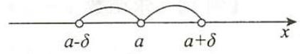

## 第一章 函数、极限、连续

## 大纲点击

1. 理解函数的概念, 掌握函数的表示法, 会建立应用问题的函数关系.

2. 了解函数的有界性、单调性、周期性和奇偶性.

3. 理解复合函数及分段函数的概念, 了解反函数及隐函数的概念.

4. 掌握基本初等函数的性质及其图形, 了解初等函数的概念.

5. 理解极限的概念, 理解函数左极限与右极限的概念以及函数极限存在与左极限、右极限的关系.

6. 掌握极限的性质及四则运算法则.

7. 掌握极限存在的两个准则, 并会利用它们求极限, 掌握利用两个重要极限求极限的方法.

8. 理解无穷小量、无穷大量的概念, 掌握无穷小量的比较方法, 会用等价无穷小量求极限. 9. 理解函数连续性的概念 (含左连续和右连续), 会判别函数间断点的类型.

10. 了解连续函数的性质和初等函数的连续性, 理解闭区间上连续函数的性质 (有界性、最大值和最小值定理、介值定理), 并会应用这些性质.

## 基础复习模块 ——基本概念、原理、考点

## 第一节 函 数

## 一、基本概念

1. 邻域与去心邻域 ——设 $\delta  > 0$ ,称集合 $\{ x \mid  \left| {x - a}\right|  < \delta \}$ 为 $a$ 的 $\delta$ 邻域,记为 $U\left( {a,\delta }\right)$ ；称集合 $\{ x\left| {0 < }\right| x - a \mid   < \delta \}$ 为 $a$ 的去心 $\delta$ 邻域,记为 $\overset{ \circ  }{U}\left( {a,\delta }\right)$ , 如图 1-1-1.

图 1-1-1

2. 函数 —— 设 $D$ 为一个数集, $x, y$ 为两个变化的量,若对任意的 $x \in  D$ ,总有唯一确定的 $y$ 与之对应,称 $y$ 为 $x$ 的函数,记为 $y = f\left( x\right)$ . 3. 函数的常用表示法

(1)显函数表示法 —— 即将 $x, y$ 构成的函数关系表示为 $y = f\left( x\right)$ .

---

① 扫描书中二维码, 观看汤老师讲解视频.

---

## 考研数学复习大全 高等数学

(2)隐函数表示法一一设 $D$ 为数集,若对任意的 $x \in  D$ ,由等式 $F\left( {x, y}\right)  = 0$ 有唯一确定的 $y$ 与之对应,称由 $F\left( {x, y}\right)  = 0$ 确定 $y$ 为 $x$ 的隐函数.

(3)参数方程表示法一一设 $D$ 为数集,若对任意的 $x \in  D$ ,由 $x = \varphi \left( t\right)$ 唯一确定一个 $t$ , 再由 $y = \psi \left( t\right)$ 唯一确定一个 $y$ 的值,称 $\left\{  \begin{array}{l} x = \varphi \left( t\right) \\  y = \psi \left( t\right)  \end{array}\right.$ 确定 $y$ 为 $x$ 的函数.

4. 复合函数一设 $y = f\left( u\right) \left( {u \in  {D}_{0}}\right) , u = \varphi \left( x\right) \left( {x \in  D}\right)$ ,且 $u = \varphi \left( x\right)$ 的值域 ${D}_{1} \subset  {D}_{0}$ , 称 $y = f\left\lbrack  {\varphi \left( x\right) }\right\rbrack$ 为复合函数.

5. 反函数一一设 $y = f\left( x\right)$ 为单调函数,由 $y = f\left( x\right)$ 解出 $x = \varphi \left( y\right)$ ,称 $x = \varphi \left( y\right)$ 为函数 $y = f\left( x\right)$ 的反函数.

6. 基本初等函数——以下函数称为基本初等函数:

(1)幂函数: ${x}^{a}$ ;

(2)指数函数: ${a}^{x}\left( {a > 0\text{且}a \neq  1}\right)$ ；

(3)对数函数: ${\log }_{a}x\left( {a > 0\text{且}a \neq  1}\right)$ ；

(4)三角函数: $\sin x,\cos x,\tan x,\cot x,\sec x,\csc x$ ；

反三角函数: $\arcsin x,\arccos x,\arctan x,\operatorname{arccot}x$ .

7. 初等函数 - 由常数与基本初等函数经过有限次的四则运算和复合运算而成的式子称为初等函数.

## 【注解】

常见的特殊函数有:

(1)狄利克雷函数

$$
D\left( x\right)  = \left\{  \begin{array}{l} 1, x \in  \mathbf{Q}, \\  0, x \in  \mathbf{R} \smallsetminus  \mathbf{Q}. \end{array}\right.
$$

(2)取整函数

$$
f\left( x\right)  = \left\lbrack  x\right\rbrack  ,
$$

取整函数 $f\left( x\right)  = \left\lbrack  x\right\rbrack$ 的函数值即 $x$ 左边最近的整数,如: $\left\lbrack  {-\sqrt{2}}\right\rbrack   =  - 2,\left\lbrack  {1.5}\right\rbrack   = 1$ , $\left\lbrack  3\right\rbrack   = 3,\left\lbrack  {-2}\right\rbrack   =  - 2$ 等.

取整函数 $f\left( x\right)  = \left\lbrack  x\right\rbrack$ 常见的性质有:

$x \geq  \left\lbrack  x\right\rbrack$ ;

$\left\lbrack  {x + k}\right\rbrack   = \left\lbrack  x\right\rbrack   + k$ ,其中 $k$ 为整数.

【例 1】求函数 $y = \sqrt{{x}^{2} - x - 6} + \arcsin \frac{{2x} - 1}{7}$ 的定义域.

【解】由 $\left\{  \begin{array}{l} {x}^{2} - x - 6 \geq  0, \\   - 1 \leq  \frac{{2x} - 1}{7} \leq  1, \end{array}\right.$ 得 $\left\{  \begin{array}{l} x \leq   - 2\text{ 或 }x \geq  3, \\   - 3 \leq  x \leq  4. \end{array}\right.$

故函数的定义域为 $D = \{ x \mid   - 3 \leq  x \leq   - 2$ 或 $3 \leq  x \leq  4\}$ .

【例 2】设 $f\left( x\right)  = \frac{x}{1 + x}$ ,求 $f\{ f\left\lbrack  {f\left( x\right) }\right\rbrack  \}$ . - 4 .

【解】 $f\left\lbrack  {f\left( x\right) }\right\rbrack   = \frac{f\left( x\right) }{1 + f\left( x\right) } = \frac{\frac{x}{1 + x}}{1 + \frac{x}{1 + x}} = \frac{x}{1 + {2x}}$ ,

$f\{ f\left\lbrack  {f\left( x\right) }\right\rbrack  \}  = \frac{f\left\lbrack  {f\left( x\right) }\right\rbrack  }{1 + f\left\lbrack  {f\left( x\right) }\right\rbrack  } = \frac{\frac{x}{1 + {2x}}}{1 + \frac{x}{1 + {2x}}} = \frac{x}{1 + {3x}}.$

【例 3】设 $f\left( x\right)  = \left\{  {\begin{array}{ll} x, & \left| x\right|  > 1, \\  {x}^{2}, & \left| x\right|  \leq  1, \end{array}g\left( x\right)  = \left\{  \begin{array}{ll} {\mathrm{e}}^{x}, & \left| x\right|  > 1, \\  1 + x, & \left| x\right|  \leq  1, \end{array}\right. }\right.$ 求 $g\left\lbrack  {f\left( x\right) }\right\rbrack$ 的表达式.

【解】 $g\left\lbrack  {f\left( x\right) }\right\rbrack   = \left\{  \begin{array}{ll} {\mathrm{e}}^{f\left( x\right) }, & \left| {f\left( x\right) }\right|  > 1, \\  1 + f\left( x\right) , & \left| {f\left( x\right) }\right|  \leq  1. \end{array}\right.$

$\left| {f\left( x\right) }\right|  > 1$ 等价于 $\left\{  \begin{array}{l} \left| x\right|  > 1, \\  \left| x\right|  > 1, \end{array}\right.$ 或 $\left\{  \begin{array}{l} \left| {x}^{2}\right|  > 1, \\  \left| x\right|  \leq  1, \end{array}\right.$ 解得 $\left| x\right|  > 1$ ;

$\left| {f\left( x\right) }\right|  \leq  1$ 等价于 $\left\{  \begin{array}{l} \left| x\right|  \leq  1, \\  \left| x\right|  > 1, \end{array}\right.$ 或 $\left\{  \begin{array}{l} \left| {x}^{2}\right|  \leq  1, \\  \left| x\right|  \leq  1, \end{array}\right.$ 解得 $- 1 \leq  x \leq  1$ ,故

$$
g\left\lbrack  {f\left( x\right) }\right\rbrack   = \left\{  \begin{array}{ll} {\mathrm{e}}^{x}, & x > 1\text{ 或 }x <  - 1 \\  1 + {x}^{2}, &  - 1 \leq  x \leq  1. \end{array}\right.
$$

【例 4】设 $f\left( x\right)  = \left\{  {\begin{array}{ll} {\mathrm{e}}^{x}, & x < 1, \\  x + 1, & x \geq  1, \end{array}g\left( x\right)  = \left\{  \begin{array}{ll} {x}^{2}, & x < 0, \\  {2x} + 1, & x \geq  0, \end{array}\right. }\right.$ 求 $f\left\lbrack  {g\left( x\right) }\right\rbrack$ .

【解】 $f\left\lbrack  {g\left( x\right) }\right\rbrack   = \left\{  \begin{array}{ll} {\mathrm{e}}^{g\left( x\right) }, & g\left( x\right)  < 1, \\  g\left( x\right)  + 1, & g\left( x\right)  \geq  1, \end{array}\right.$

由 $\left\{  \begin{array}{l} x < 0 \\  {x}^{2} < 1 \end{array}\right.$ 或 $\left\{  \begin{array}{l} x \geq  0 \\  {2x} + 1 < 1 \end{array}\right.$ 得 $- 1 < x < 0$ ;

由 $\left\{  \begin{array}{l} x < 0 \\  {x}^{2} \geq  1 \end{array}\right.$ 或 $\left\{  \begin{array}{l} x \geq  0 \\  {2x} + 1 \geq  1 \end{array}\right.$ 得 $x \leq   - 1$ 或 $x \geq  0$ ,

故

$$
f\left\lbrack  {g\left( x\right) }\right\rbrack   = \left\{  \begin{array}{ll} {\mathrm{e}}^{{x}^{2}}, &  - 1 < x < 0, \\  {x}^{2} + 1, & x \leq   - 1, \\  {2x} + 2, & x \geq  0. \end{array}\right.
$$

【例 5】求 $y = \ln \left( {x + \sqrt{1 + {x}^{2}}}\right)$ 的反函数.

【解】由 $y = \ln \left( {x + \sqrt{1 + {x}^{2}}}\right)$ 得 $x + \sqrt{1 + {x}^{2}} = {\mathrm{e}}^{y}$ ；

因为 $\left( {x + \sqrt{1 + {x}^{2}}}\right) \left( {\sqrt{1 + {x}^{2}} - x}\right)  = 1$ ,所以 $\sqrt{1 + {x}^{2}} - x = {\mathrm{e}}^{-y}$ ,

两式相减,得 $y = \ln \left( {x + \sqrt{1 + {x}^{2}}}\right)$ 的反函数为 $x = \frac{{\mathrm{e}}^{y} - {\mathrm{e}}^{-y}}{2}$ .

## 二、函数的初等特性

1. 单调性——设 $f\left( x\right)$ 为定义于 $D$ 上的函数,若对任意的 ${x}_{1},{x}_{2} \in  D$ 且 ${x}_{1} < {x}_{2}$ ,有 $f\left( {x}_{1}\right)  < f\left( {x}_{2}\right)$ ,称函数 $f\left( x\right)$ 在 $D$ 上为单调增函数,若有 $f\left( {x}_{1}\right)  > f\left( {x}_{2}\right)$ ,称函数 $f\left( x\right)$ 在 $D$ 上为单调减函数.

2. 有界性一一设 $f\left( x\right)$ 为定义于 $D$ 上的函数,若存在 $M > 0$ ,对一切的 $x \in  D$ , 有 $\left| {f\left( x\right) }\right|  \leq  M$ 成立,称 $f\left( x\right)$ 在 $D$ 上为有界函数.

3. 奇偶性一一设 $f\left( x\right)$ 为定义于 $D$ 上的函数,且 $D$ 关于原点对称,若对任意的 $x \in  D$ ,有 $f\left( {-x}\right)  = f\left( x\right)$ ,称 $f\left( x\right)$ 在 $D$ 上为偶函数,若 $f\left( {-x}\right)  =  - f\left( x\right)$ , 称 $f\left( x\right)$ 在 $D$ 上为奇函数. 奇函数的图像关于原点对称,偶函数的图像关于 $y$ 轴对称.

4. 周期性——设 $f\left( x\right)$ 为定义于 $D$ 上的函数, $T > 0$ 且对任意的 $x \in  D, x + T \in  D$ ,若对任意 $x \in  D$ ,有 $f\left( {x + T}\right)  = f\left( x\right)$ ,称 $f\left( x\right)$ 为周期函数.

## 第二节 极 限

## 一、基本概念

## 1. 极限

定义 $1\left( {\varepsilon  - N}\right)$ 设 $\left\{  {a}_{n}\right\}$ 为无穷数列, $A$ 为常数,若对任意的 $\varepsilon  > 0$ ,总存在 $N > 0$ ,当 $n >$ $N$ 时,有

$$
\left| {{a}_{n} - A}\right|  < \varepsilon
$$

成立,称常数 $A$ 为数列 $\left\{  {a}_{n}\right\}$ 的极限,记为 $\lim {a}_{n} = A$ ,或 ${a}_{n} \rightarrow  A\left( {n \rightarrow  \infty }\right)$ .

定义 $2\left( {\varepsilon  - \delta }\right)$ 设函数 $y = f\left( x\right)$ 在 $x = a$ 的去心邻域内有定义, $A$ 为常数,若对任意的 $\varepsilon  > 0$ ,总存在 $\delta  > 0$ ,当 $0 < \left| {x - a}\right|  < \delta$ 时,有

$$
\left| {f\left( x\right)  - A}\right|  < \varepsilon
$$

成立,称常数 $A$ 为函数 $f\left( x\right)$ 当 $x \rightarrow  a$ 时的极限,记为 $\mathop{\lim }\limits_{{x \rightarrow  a}}f\left( x\right)  = A$ ,或 $f\left( x\right)  \rightarrow  A\left( {x \rightarrow  a}\right)$ .

## 【注解】

$\mathop{\lim }\limits_{{x \rightarrow  a}}f\left( x\right)$

(1) $x \rightarrow  a$ 时, $x \neq  a$ ,即与 $f\left( a\right)$ 无关,如:

$f\left( x\right)  = \frac{{x}^{2} - {3x} + 2}{{x}^{2} - 1}$ 在 $x = 1$ 处没有定义,但 $\mathop{\lim }\limits_{{x \rightarrow  1}}f\left( x\right)  = \mathop{\lim }\limits_{{x \rightarrow  1}}\frac{{x}^{2} - {3x} + 2}{{x}^{2} - 1} = \mathop{\lim }\limits_{{x \rightarrow  1}}\frac{x - 2}{x + 1}$

$=  - \frac{1}{2}$ ;

(2) $x \rightarrow  a$ 包含 $x \rightarrow  {a}^{ - }$ 及 $x \rightarrow  {a}^{ + }$ ；

(3) 若对任意的 $\varepsilon  > 0$ ,总存在 $\delta  > 0$ ,当 $x \in  \left( {a - \delta , a}\right)$ 时,有

$$
\left| {f\left( x\right)  - A}\right|  < \varepsilon
$$

成立,称常数 $A$ 为函数 $f\left( x\right)$ 在 $x = a$ 处的左极限,记为 $f\left( {a - 0}\right)  = A$ ;

若对任意的 $\varepsilon  > 0$ ,总存在 $\delta  > 0$ ,当 $x \in  \left( {a, a + \delta }\right)$ 时,有

$$
\left| {f\left( x\right)  - B}\right|  < \varepsilon
$$

成立,称常数 $B$ 为函数 $f\left( x\right)$ 在 $x = a$ 处的右极限,记为 $f\left( {a + 0}\right)  = B$ .

极限 $\mathop{\lim }\limits_{{x \rightarrow  a}}f\left( x\right)$ 存在的充分必要条件是 $f\left( {a - 0}\right)$ 与 $f\left( {a + 0}\right)$ 存在且 $f\left( {a - 0}\right)  =$ $f\left( {a + 0}\right)$ .

定义 $3\left( {\varepsilon  - X}\right) \;\left( 1\right)$ 设函数 $f\left( x\right)$ 在 $\left| x\right|  > a$ 内有定义,若对任意的 $\varepsilon  > 0$ ,总存在 $X >$ 0,当 $\left| x\right|  > X$ 时,有

$$
\left| {f\left( x\right)  - A}\right|  < \varepsilon
$$

称常数 $A$ 为函数 $f\left( x\right)$ 当 $x \rightarrow  \infty$ 时的极限,记为 $\mathop{\lim }\limits_{{x \rightarrow  \infty }}f\left( x\right)  = A$ ,或 $f\left( x\right)  \rightarrow  A\left( {x \rightarrow  \infty }\right)$ ;

(2)设函数 $f\left( x\right)$ 在 $x < a$ 内有定义,若对任意的 $\varepsilon  > 0$ ,总存在 $X > 0$ ,当 $x <  - X$ 时,有

$$
\left| {f\left( x\right)  - A}\right|  < \varepsilon
$$

称常数 $A$ 为函数 $f\left( x\right)$ 当 $x \rightarrow   - \infty$ 时的极限,记为 $\mathop{\lim }\limits_{{x \rightarrow   - \infty }}f\left( x\right)  = A$ ,或 $f\left( x\right)  \rightarrow  A\left( {x \rightarrow   - \infty }\right)$ ;

(3)设函数 $f\left( x\right)$ 在 $x > a$ 内有定义,若对任意的 $\varepsilon  > 0$ ,总存在 $X > 0$ ,当 $x > X$ 时,有

$$
\left| {f\left( x\right)  - A}\right|  < \varepsilon
$$

称常数 $A$ 为函数 $f\left( x\right)$ 当 $x \rightarrow   + \infty$ 时的极限,记为 $\mathop{\lim }\limits_{{x \rightarrow   + \infty }}f\left( x\right)  = A$ ,或 $f\left( x\right)  \rightarrow  A\left( {x \rightarrow   + \infty }\right)$ . 2. 无穷小与无穷大

(1)无穷小 —— 若 $\mathop{\lim }\limits_{{x \rightarrow  \Delta }}\alpha \left( x\right)  = 0$ ,称 $\alpha \left( x\right)$ 为当 $x \rightarrow  \Delta$ 时的无穷小.

(2)无穷大——若 $\mathop{\lim }\limits_{{x \rightarrow  \Delta }}\alpha \left( x\right)  = \infty$ ,称 $\alpha \left( x\right)$ 为当 $x \rightarrow  \Delta$ 时的无穷大.

(3)无穷小的比较

设 $\alpha  \rightarrow  0,\beta  \rightarrow  0$ ,

若 $\lim \frac{\beta }{\alpha } = 0$ ,称 $\beta$ 为 $\alpha$ 的高阶无穷小,记为 $\beta  = o\left( \alpha \right)$ ;

若 $\lim \frac{\beta }{\alpha } = k\left( { \neq  0,\infty }\right)$ ,称 $\alpha$ 与 $\beta$ 为同阶无穷小,记为 $\beta  = O\left( \alpha \right)$ ,

特别地,若 $\lim \frac{\beta }{\alpha } = 1$ ,称 $\alpha$ 与 $\beta$ 为等价无穷小,记为 $\alpha  \sim  \beta$ .

## 【注解】

(1)无穷小与无穷大互为倒数.

(2)无穷小即以零为极限的函数,一个函数只有在自变量的某种趋向下,以零为极限才称为无穷小, 一般情况下一个函数是否为无穷小与自变量的趋向有关.

(3) 0 是无穷小, 且与自变量的趋向无关, 但无穷小不一定是 0 .

## 二、极限的性质

## (一) 极限的基本性质

定理 1 (唯一性定理) 极限若存在必唯一. 定理 2 (有界性定理) (1) (数列极限的有界性) 若 $\mathop{\lim }\limits_{{n \rightarrow  \infty }}{a}_{n}$ 存在,则存在 $M > 0$ ,使得 $\left| {a}_{n}\right|  \leq  M$ ,反之不对.

(2) (函数极限的局部有界性) 若 $\mathop{\lim }\limits_{{x \rightarrow  a}}f\left( x\right)$ 存在,则存在 $\delta  > 0$ 及 $M > 0$ ,当 $0 < \left| {x - a}\right|  < \delta$ 时, $\left| {f\left( x\right) }\right|  \leq  M$ .

---

函数极限大于零, 则函数在去心邻域内大于零; 函数极限小于零, 则函数在去

心邻域内小于零

---

定理 3 (极限的保号性)

(1) (极限第一保号性) 若 $\mathop{\lim }\limits_{{x \rightarrow  a}}f\left( x\right)  = A > 0\left( { < 0}\right)$ ,则存在 $\delta  > 0$ ,当 $0 < \left| {x - a}\right|  < \delta$ 时,有 $f\left( x\right)  > 0\left( { < 0}\right)$ .

(2) (极限第二保号性) 若 $f\left( x\right)  \geq  0\left( { \leq  0}\right)$ ,且 $\lim f\left( x\right)  =$ $A$ ,则 $A \geq  0\left( { \leq  0}\right)$ .

---

函数不负, 则极限不负; 函数不正, 则极限不正

---

(3) (极限第三保号性) 若 $f\left( x\right)  \geq  g\left( x\right)$ ,且 $\lim f\left( x\right)  =$ $A,\lim g\left( x\right)  = B$ ,则 $A \geq  B$ .

定理 4 (列与子列极限的关系) 若列极限存在, 则其任意子列极限也存在且相等.

推论 $\mathop{\lim }\limits_{{n \rightarrow  \infty }}{a}_{n}$ 存在的充分必要条件是 $\mathop{\lim }\limits_{{n \rightarrow  \infty }}{a}_{2n}$ 与 $\mathop{\lim }\limits_{{n \rightarrow  \infty }}{a}_{{2n} - 1}$ 都存在且相等. 【例 1】研究 $\mathop{\lim }\limits_{{x \rightarrow  0}}\sin \frac{1}{x}$ 是否存在.

【解】取 ${x}_{n} = \frac{1}{2n\pi }\left( {n = 1,2,\cdots }\right)$ ,显然 ${x}_{n} \rightarrow  0\left( {n \rightarrow  \infty }\right)$ 为 $x \rightarrow  0$ 的一个子列,

$$
\mathop{\lim }\limits_{{n \rightarrow  \infty }}\sin \frac{1}{{x}_{n}} = \mathop{\lim }\limits_{{n \rightarrow  \infty }}\sin {2n\pi } = 0;
$$

取 ${y}_{n} = \frac{1}{{2n\pi } + \frac{\pi }{2}}\left( {n = 1,2,\cdots }\right)$ ,显然 ${y}_{n} \rightarrow  0\left( {n \rightarrow  \infty }\right)$ 为 $x \rightarrow  0$ 的又一个子列,

$$
\mathop{\lim }\limits_{{n \rightarrow  \infty }}\sin \frac{1}{{y}_{n}} = \mathop{\lim }\limits_{{n \rightarrow  \infty }}\sin \left( {{2n\pi } + \frac{\pi }{2}}\right)  = 1,
$$

故 $\mathop{\lim }\limits_{{x \rightarrow  0}}\sin \frac{1}{x}$ 不存在.

【例 2】求极限 $\mathop{\lim }\limits_{{n \rightarrow  \infty }}n\left( {\frac{\pi }{2} - \arctan n}\right)$ .

【解】 $n \rightarrow  \infty$ 为 $x \rightarrow   + \infty$ 的子列,

因为 $\mathop{\lim }\limits_{{x \rightarrow   + \infty }}x\left( {\frac{\pi }{2} - \arctan x}\right)  = \mathop{\lim }\limits_{{x \rightarrow   + \infty }}\frac{\frac{\pi }{2} - \arctan x}{\frac{1}{x}} = \mathop{\lim }\limits_{{x \rightarrow   + \infty }}\frac{-\frac{1}{1 + {x}^{2}}}{-\frac{1}{{x}^{2}}} = \mathop{\lim }\limits_{{x \rightarrow   + \infty }}\frac{{x}^{2}}{1 + {x}^{2}} = 1$ ,

所以 $\mathop{\lim }\limits_{{n \rightarrow  \infty }}n\left( {\frac{\pi }{2} - \arctan n}\right)  = 1$ .

## (二) 极限的存在性质

## 1. 夹逼定理

定理 1 设数列 $\left\{  {a}_{n}\right\}  \text{、}\left\{  {b}_{n}\right\}  \text{、}\left\{  {c}_{n}\right\}$ 满足:

(1) ${a}_{n} \leq  {b}_{n} \leq  {c}_{n}$ ;

(2) $\mathop{\lim }\limits_{{n \rightarrow  \infty }}{a}_{n}$ 与 $\mathop{\lim }\limits_{{n \rightarrow  \infty }}{c}_{n}$ 存在且相等,

则极限 $\mathop{\lim }\limits_{{n \rightarrow  \infty }}{b}_{n}$ 存在,且 $\mathop{\lim }\limits_{{n \rightarrow  \infty }}{b}_{n} = \mathop{\lim }\limits_{{n \rightarrow  \infty }}{a}_{n} = \mathop{\lim }\limits_{{n \rightarrow  \infty }}{c}_{n}$ .

定理 2 设函数 $f\left( x\right) \text{、}g\left( x\right) \text{、}h\left( x\right)$ 在 $x = a$ 的去心邻域内有定义且满足:

(1) $f\left( x\right)  \leq  g\left( x\right)  \leq  h\left( x\right)$ ；

(2) $\mathop{\lim }\limits_{{x \rightarrow  a}}f\left( x\right)$ 与 $\mathop{\lim }\limits_{{x \rightarrow  a}}h\left( x\right)$ 存在且相等,

则极限 $\mathop{\lim }\limits_{{x \rightarrow  a}}g\left( x\right)$ 存在,且 $\mathop{\lim }\limits_{{x \rightarrow  a}}g\left( x\right)  = \mathop{\lim }\limits_{{x \rightarrow  a}}f\left( x\right)  = \mathop{\lim }\limits_{{x \rightarrow  a}}h\left( x\right)$ .

【例 1】求 $\mathop{\lim }\limits_{{n \rightarrow  \infty }}\left( {\frac{1}{{n}^{2} + 1} + \frac{2}{{n}^{2} + 2} + \cdots  + \frac{n}{{n}^{2} + n}}\right)$ .

【解】因为 $\frac{i}{{n}^{2} + n} \leq  \frac{i}{{n}^{2} + i} \leq  \frac{i}{{n}^{2} + 1}\left( {i = 1,2,\cdots , n}\right)$ ,所以

$$
\frac{1}{2} \cdot  \frac{n\left( {n + 1}\right) }{{n}^{2} + n} \leq  \frac{1}{{n}^{2} + 1} + \frac{2}{{n}^{2} + 2} + \cdots  + \frac{n}{{n}^{2} + n} \leq  \frac{1}{2} \cdot  \frac{n\left( {n + 1}\right) }{{n}^{2} + 1},
$$

且 $\mathop{\lim }\limits_{{n \rightarrow  \infty }}\frac{1}{2} \cdot  \frac{n\left( {n + 1}\right) }{{n}^{2} + 1} = \mathop{\lim }\limits_{{n \rightarrow  \infty }}\frac{1}{2} \cdot  \frac{n\left( {n + 1}\right) }{{n}^{2} + n} = \frac{1}{2}$ ,由夹逼定理得

$$
\mathop{\lim }\limits_{{n \rightarrow  \infty }}\left( {\frac{1}{{n}^{2} + 1} + \frac{2}{{n}^{2} + 2} + \cdots  + \frac{n}{{n}^{2} + n}}\right)  = \frac{1}{2}.
$$

【例 2】设 $a \geq  0, b \geq  0, c \geq  0$ ,求 $\mathop{\lim }\limits_{{n \rightarrow  \infty }}{\left( {a}^{n} + {b}^{n} + {c}^{n}\right) }^{\frac{1}{n}}$ .

【解】不妨设 $a$ 为 $a, b, c$ 中的最大值,显然 $a \leq  {\left( {a}^{n} + {b}^{n} + {c}^{n}\right) }^{\frac{1}{n}} \leq  {3}^{\frac{1}{n}}a$ , 再由 $\mathop{\lim }\limits_{{n \rightarrow  \infty }}{3}^{\frac{1}{n}} = 1$ ,根据夹逼定理得 $\mathop{\lim }\limits_{{n \rightarrow  \infty }}{\left( {a}^{n} + {b}^{n} + {c}^{n}\right) }^{\frac{1}{n}} = a$ .

一般地, $\mathop{\lim }\limits_{{n \rightarrow  \infty }}{\left( {a}^{n} + {b}^{n} + {c}^{n}\right) }^{\frac{1}{n}} = \max \{ a, b, c\}$ .

【例 3】求 $f\left( x\right)  = \mathop{\lim }\limits_{{n \rightarrow  \infty }}{\left\lbrack  1 + {x}^{n} + {\left( \frac{{x}^{2}}{2}\right) }^{n}\right\rbrack  }^{\frac{1}{n}}\left( {x \geq  0}\right)$ 的表达式.

【解】由例 2 得 $f\left( x\right)  = \max \left\{  {1, x,\frac{{x}^{2}}{2}}\right\}   = \left\{  \begin{matrix} 1, & 0 \leq  x < 1, \\  x, & 1 \leq  x < 2, \\  \frac{{x}^{2}}{2}, & x \geq  2. \end{matrix}\right.$

## 2. 单调有界的数列必有极限

## 【注解】

(1) 设数列 $\left\{  {a}_{n}\right\}$ 单调递增,则

若数列 $\left\{  {a}_{n}\right\}$ 无上界,则 $\mathop{\lim }\limits_{{n \rightarrow  \infty }}{a}_{n} =  + \infty$ ;

若存在常数 $M$ ,使得 ${a}_{n} \leq  M$ ,则 $\mathop{\lim }\limits_{{n \rightarrow  \infty }}{a}_{n}$ 存在. 设 $\mathop{\lim }\limits_{{n \rightarrow  \infty }}{a}_{n} = A$ ,则 ${a}_{n} \leq  A\left( {n = 1,2,\cdots }\right)$ .

(2) 设数列 $\left\{  {a}_{n}\right\}$ 单调递减,则

若数列 $\left\{  {a}_{n}\right\}$ 无下界,则 $\mathop{\lim }\limits_{{n \rightarrow  \infty }}{a}_{n} =  - \infty$ ;

若存在常数 $M$ ,使得 ${a}_{n} \geq  M$ ,则 $\mathop{\lim }\limits_{{n \rightarrow  \infty }}{a}_{n}$ 存在. 设 $\mathop{\lim }\limits_{{n \rightarrow  \infty }}{a}_{n} = A$ ,则 ${a}_{n} \geq  A\left( {n = 1,2,\cdots }\right)$ .

## (三) 极限的运算性质

1. 极限的四则运算性质 —— 设 $\lim f\left( x\right)  = A,\lim g\left( x\right)  = B$ ,则

(1) $\lim \left\lbrack  {f\left( x\right)  \pm  g\left( x\right) }\right\rbrack   = \lim f\left( x\right)  \pm  \lim g\left( x\right)  = A \pm  B$ .

(2) $\lim f\left( x\right) g\left( x\right)  = \lim f\left( x\right) \lim g\left( x\right)  = {AB}$ .

(3) $\lim {kf}\left( x\right)  = k\lim f\left( x\right)  = {kA}$ .

(4) $\lim \frac{f\left( x\right) }{g\left( x\right) } = \frac{\lim f\left( x\right) }{\lim g\left( x\right) } = \frac{A}{B}\left( {B \neq  0}\right)$ .

## 2. 极限的复合运算性质

(1) 设 $\mathop{\lim }\limits_{{u \rightarrow  a}}f\left( u\right)  = A,\mathop{\lim }\limits_{{x \rightarrow  {x}_{0}}}g\left( x\right)  = a$ ,则 $\mathop{\lim }\limits_{{x \rightarrow  {x}_{0}}}f\left\lbrack  {g\left( x\right) }\right\rbrack   = A$ .

(2) 设 $\mathop{\lim }\limits_{{u \rightarrow  a}}f\left( u\right)  = f\left( a\right) ,\mathop{\lim }\limits_{{x \rightarrow  {x}_{0}}}g\left( x\right)  = a$ ,则 $\mathop{\lim }\limits_{{x \rightarrow  {x}_{0}}}f\left\lbrack  {g\left( x\right) }\right\rbrack   = f\left\lbrack  {\mathop{\lim }\limits_{{x \rightarrow  {x}_{0}}}g\left( x\right) }\right\rbrack   = f\left( a\right)$ .

## 【注解】

(1)若 $\lim f\left( x\right)$ 或 $\lim g\left( x\right)$ 不存在时,极限四则运算法则不成立.

(2) 若 $\lim f\left( x\right)$ 与 $\lim g\left( x\right)$ 都不存在时, $\lim \left\lbrack  {f\left( x\right)  \pm  g\left( x\right) }\right\rbrack$ 、 $\lim f\left( x\right) g\left( x\right)$ 、 $\lim \frac{f\left( x\right) }{g\left( x\right) }$ 不一定不存在,例如:

$\mathop{\lim }\limits_{{x \rightarrow  0}}\left( {\frac{\sin {2x}}{x} + \frac{1}{x}}\right)$ 与 $\mathop{\lim }\limits_{{x \rightarrow  0}}\left\lbrack  {\frac{\ln \left( {1 - x}\right) }{x} - \frac{1}{x}}\right\rbrack$ 都不存在,但

$$
\mathop{\lim }\limits_{{x \rightarrow  0}}\left\lbrack  {\left( {\frac{\sin {2x}}{x} + \frac{1}{x}}\right)  + \left( {\frac{\ln \left( {1 - x}\right) }{x} - \frac{1}{x}}\right) }\right\rbrack   = 1.
$$

## (四) 无穷小的性质

## 1. 无穷小的基本性质

(1)有限个无穷小的和、差、积仍为无穷小.

(2)设 $\left| \alpha \right|  \leq  M,\beta  \rightarrow  0$ ,则 ${\alpha \beta } \rightarrow  0$ ,即有界函数与无穷小之积仍是无穷小,例如:

$$
\mathop{\lim }\limits_{{x \rightarrow  0}}{x}^{2}\sin \frac{1}{x} = 0.
$$

(3) 设 $\alpha  \rightarrow  0$ ,则 ${k\alpha } \rightarrow  0$ (其中 $k$ 为常数),即常数与无穷小之积仍为无穷小.

(4) $\lim f\left( x\right)  = A$ 的充分必要条件是 $f\left( x\right)  = A + \alpha$ ,其中 $\alpha  \rightarrow  0$ .

2. 等价无穷小的性质

(1) $\alpha  \sim  \alpha$ .

(2)若 $\alpha  \sim  \beta$ ,则 $\beta  \sim  \alpha$ .

(3) 若 $\alpha  \sim  \beta ,\beta  \sim  \gamma$ ,则 $\alpha  \sim  \gamma$ .

(4) (重要性质) 若 $\alpha  \sim  {\alpha }_{1},\beta  \sim  {\beta }_{1}$ ,且 $\lim \frac{{\beta }_{1}}{{\alpha }_{1}} = A$ ,则 $\lim \frac{\beta }{\alpha } = A$ .

(5) $\alpha  \sim  \beta$ 的充分必要条件是 $\beta  = \alpha  + o\left( \alpha \right)$ .

3. 当 $x \rightarrow  0$ 时常用的等价无穷小

(1) $x \sim  \sin x \sim  \tan x \sim  \arcsin x \sim  \arctan x \sim  \ln \left( {1 + x}\right)  \sim  {\mathrm{e}}^{x} - 1$ .

(2) $1 - \cos x \sim  \frac{1}{2}{x}^{2},1 - {\cos }^{a}x \sim  \frac{a}{2}{x}^{2}$ .

(3) ${\left( 1 + x\right) }^{a} - 1 \sim  {ax}$ . (4) ${a}^{x} - 1 \sim  x\ln a$ .

## 三、两个重要极限

1. $\mathop{\lim }\limits_{{\Delta  \rightarrow  0}}\frac{\sin \Delta }{\Delta } = 1$ .

2. $\mathop{\lim }\limits_{{\Delta  \rightarrow  0}}{\left( 1 + \Delta \right) }^{\frac{1}{\Delta }} = \mathrm{e}$ .

## 第三节 函数的连续性

## 一、基本概念

## 1. 连续

( 1 )函数在一点连续的定义——设 $f\left( x\right)$ 在 $x = {x}_{0}$ 的邻域内有定义,若 $\mathop{\lim }\limits_{{x \rightarrow  {x}_{0}}}f\left( x\right)  = f\left( {x}_{0}\right)$ ,则称函数 $f\left( x\right)$ 在点 $x = {x}_{0}$ 处连续,即 $f\left( x\right)$ 在点 $x = {x}_{0}$ 处连续的充分必要条件是

$$
f\left( {{x}_{0} - 0}\right)  = f\left( {{x}_{0} + 0}\right)  = f\left( {x}_{0}\right) .
$$

(2)函数在闭区间上连续的定义——设 $f\left( x\right)$ 在区间 $\left\lbrack  {a, b}\right\rbrack$ 上有定义,若满足:(   ) $f\left( x\right)$ 在 (a, b)内点点连续; 2) $f\left( a\right)  = f\left( {a + 0}\right) , f\left( b\right)  = f\left( {b - 0}\right)$ ,则称 $f\left( x\right)$ 在闭区间 $\left\lbrack  {a, b}\right\rbrack$ 上连续, 记为 $f\left( x\right)  \in  C\left\lbrack  {a, b}\right\rbrack$ .

2. 间断点的分类——设 $f\left( x\right)$ 在点 $x = {x}_{0}$ 的去心邻域内有定义且 $\mathop{\lim }\limits_{{x \rightarrow  {x}_{0}}}f\left( x\right)  \neq  f\left( {x}_{0}\right)$ ,称 $f\left( x\right)$ 在点 $x = {x}_{0}$ 处间断. 间断点按照不同情况可分为如下两类:

( 1 )若 $f\left( {{x}_{0} - 0}\right)$ 与 $f\left( {{x}_{0} + 0}\right)$ 都存在,称 ${x}_{0}$ 为 $f\left( x\right)$ 的第一类间断点. 进一步地,

若 $f\left( {{x}_{0} - 0}\right)  = f\left( {{x}_{0} + 0}\right) \left( { \neq  f\left( {x}_{0}\right) }\right)$ ,称 ${x}_{0}$ 为 $f\left( x\right)$ 的第一类间断点中的可去间断点; 若 $f\left( {{x}_{0} - 0}\right)  \neq  f\left( {{x}_{0} + 0}\right)$ ,称 ${x}_{0}$ 为 $f\left( x\right)$ 的第一类间断点中的跳跃间断点.

(2) 若 $f\left( {{x}_{0} - 0}\right)$ 与 $f\left( {{x}_{0} + 0}\right)$ 至少有一个不存在,称 ${x}_{0}$ 为 $f\left( x\right)$ 的第二类间断点.

## 二、闭区间上连续函数的性质

定理 1 (最值定理) 设 $f\left( x\right)  \in  C\left\lbrack  {a, b}\right\rbrack$ ,则 $f\left( x\right)$ 在 $\left\lbrack  {a, b}\right\rbrack$ 上取到最小值 $m$ 和最大值 $M$ .

定理 2 (有界定理) 设 $f\left( x\right)  \in  C\left\lbrack  {a, b}\right\rbrack$ ,则 $f\left( x\right)$ 在 $\left\lbrack  {a, b}\right\rbrack$ 上有界.

定理 3 (零点定理) 设 $f\left( x\right)  \in  C\left\lbrack  {a, b}\right\rbrack$ ,且 $f\left( a\right) f\left( b\right)  <$ 0,则存在 $\xi  \in  \left( {a, b}\right)$ ,使得 $f\left( \xi \right)  = 0$ .

---

闭区间上的连续函数可以取到每一个介值

---

推论 (零点定理的推广) 设 $f\left( x\right)  \in  C\lbrack a, + \infty )$ ,且 $f\left( a\right)$ - $\mathop{\lim }\limits_{{x \rightarrow   + \infty }}f\left( x\right)  < 0$ ,则存在 $c \in  \left( {a, + \infty }\right)$ ,使得 $f\left( c\right)  = 0$ .

定理 4 (介值定理) 设 $f\left( x\right)  \in  C\left\lbrack  {a, b}\right\rbrack$ ,且 $m, M$ 分别为函数 $f\left( x\right)$ 在 $\left\lbrack  {a, b}\right\rbrack$ 上的最小值与最大值,则对任意的 $\eta  \in  \left\lbrack  {m, M}\right\rbrack$ ,总存在 $\xi  \in  \left\lbrack  {a, b}\right\rbrack$ ,使得 $f\left( \xi \right)  = \eta$ .

【例 1】设 $f\left( x\right)$ 在 $\left\lbrack  {0,2}\right\rbrack$ 上连续,且 $f\left( 0\right)  + {2f}\left( 1\right)  + {3f}\left( 2\right)  = 6$ ,证明: 存在 $c \in  \left\lbrack  {0,2}\right\rbrack$ , 使得 $f\left( c\right)  = 1$ .

【证明】 $f\left( x\right)$ 在 $\left\lbrack  {0,2}\right\rbrack$ 上连续,所以 $f\left( x\right)$ 在 $\left\lbrack  {0,2}\right\rbrack$ 上取到最小值 $m$ 和最大值 $M$ ,

因为 ${6m} \leq  f\left( 0\right)  + {2f}\left( 1\right)  + {3f}\left( 2\right)  \leq  {6M}$ ,即 $m \leq  1 \leq  M$ ,

所以由介值定理,存在 $c \in  \left\lbrack  {0,2}\right\rbrack$ ,使得 $f\left( c\right)  = 1$ .

【例 2】 $f\left( x\right)$ 在 $\left\lbrack  {a, b}\right\rbrack$ 上连续, $p > 0, q > 0$ ,证明: 存在 $\xi  \in  \left\lbrack  {a, b}\right\rbrack$ ,使得

$$
{pf}\left( a\right)  + {qf}\left( b\right)  = \left( {p + q}\right) f\left( \xi \right) .
$$

【证明】因为 $f\left( x\right)$ 在 $\left\lbrack  {a, b}\right\rbrack$ 上连续,所以 $f\left( x\right)$ 在 $\left\lbrack  {a, b}\right\rbrack$ 上取到最小值 $m$ 和最大值 $M$ , - 11 .

因为 $\left( {p + q}\right) m \leq  {pf}\left( a\right)  + {qf}\left( b\right)  \leq  \left( {p + q}\right) M$ ,即 $m \leq  \frac{{pf}\left( a\right)  + {qf}\left( b\right) }{p + q} \leq  M$ ,

所以由介值定理,存在 $\xi  \in  \left\lbrack  {a, b}\right\rbrack$ ,使得 $f\left( \xi \right)  = \frac{{pf}\left( a\right)  + {qf}\left( b\right) }{p + q}$ ,

故 ${pf}\left( a\right)  + {qf}\left( b\right)  = \left( {p + q}\right) f\left( \xi \right)$ .

## 知识延拓模块——极限存在性问题

数列极限存在性证明是极限部分重点的考查题型, 也是极限部分的难点所在. 一般情况下,证明数列 $\left\{  {a}_{n}\right\}$ 极限存在需要证明其具有单调性和有界性,一般分为两种类型: 类型一: 数列存在递推关系 ${a}_{n + 1} = f\left( {a}_{n}\right)$ 单调性证明常见方法有: 方法一: 重要不等式 (1)当 $x > 0$ 时, $\ln \left( {1 + x}\right)  < x$ ； (2)当 $x \geq  0$ 时, $\sin x \leq  x$ ； (3)当 $x \neq  0$ 时, ${\mathrm{e}}^{x} > 1 + x$ . 方法二:数学归纳法方法三: 判断 ${a}_{n + 1} - {a}_{n}$ 的正负得数列 $\left\{  {a}_{n}\right\}$ 的单调性方法四:单调法令 $y = f\left( x\right)$ ,若 ${f}^{\prime }\left( x\right)  \geq  0$ ,则数列 $\left\{  {a}_{n}\right\}$ 单调,其中 (1) 若 ${a}_{1} \leq  {a}_{2}$ ,则数列 $\left\{  {a}_{n}\right\}$ 单调递增； (2)若 ${a}_{1} \geq  {a}_{2}$ ,则数列 $\left\{  {a}_{n}\right\}$ 单调递减. 方法五:中值定理 【例 1】设 $0 < {a}_{1} < \pi$ ,又 ${a}_{n + 1} = \sin {a}_{n}$ , (1)证明: $\mathop{\lim }\limits_{{n \rightarrow  \infty }}{a}_{n}$ 存在,并求此极限; (2)求 $\mathop{\lim }\limits_{{n \rightarrow  \infty }}{\left( \frac{{a}_{n + 1}}{{a}_{n}}\right) }^{\frac{1}{{a}_{n}^{2}}}$ . 【证明】(1)显然 ${a}_{n} > 0\left( {n = 1,2,\cdots }\right)$ ； 因为当 $x > 0$ 时, $\sin x < x$ ,所以 ${a}_{n + 1} = \sin {a}_{n} < {a}_{n}$ ,即 $\left\{  {a}_{n}\right\}$ 单调递减,故 $\lim {a}_{n}$ 存在. 令 $\mathop{\lim }\limits_{{n \rightarrow  \infty }}{a}_{n} = A,{a}_{n + 1} = \sin {a}_{n}$ 两边取极限得 $A = \sin A$ ,解得 $A = 0$ .

(2) $\mathop{\lim }\limits_{{n \rightarrow  \infty }}{\left( \frac{{a}_{n + 1}}{{a}_{n}}\right) }^{\frac{1}{{a}_{n}^{2}}} = \mathop{\lim }\limits_{{n \rightarrow  \infty }}{\left( \frac{\sin {a}_{n}}{{a}_{n}}\right) }^{\frac{1}{{a}_{n}^{2}}}\overset{{a}_{n} = t}{ = }\mathop{\lim }\limits_{{t \rightarrow  0}}{\left( \frac{\sin t}{t}\right) }^{\frac{1}{{t}^{2}}}$

$$
= \mathop{\lim }\limits_{{t \rightarrow  0}}{\left\lbrack  {\left( 1 + \frac{\sin t - t}{t}\right) }^{\frac{t}{\sin t - t}}\right\rbrack  }^{\frac{1}{{t}^{2}} \cdot  \frac{\sin t - t}{t}} = {\mathrm{e}}^{\mathop{\lim }\limits_{{t \rightarrow  0}}\frac{\sin t - t}{{t}^{3}}} = {\mathrm{e}}^{\mathop{\lim }\limits_{{t \rightarrow  0}}\frac{\cos t - 1}{3{t}^{2}}} = {\mathrm{e}}^{-\frac{1}{6}}.
$$

【例 2】设 ${a}_{1} = \sqrt{2},{a}_{2} = \sqrt{2 + \sqrt{2}},{a}_{3} = \sqrt{2 + \sqrt{2 + \sqrt{2}}},\cdots$ ,证明: $\mathop{\lim }\limits_{{n \rightarrow  \infty }}{a}_{n}$ 存在,并求此极限.

【证明】该数列的递推关系为 ${a}_{n + 1} = \sqrt{2 + {a}_{n}}\left( {n = 1,2,\cdots }\right)$ ,

显然数列 $\left\{  {a}_{n}\right\}$ 单调递增, ${a}_{1} = \sqrt{2} \leq  2$ .