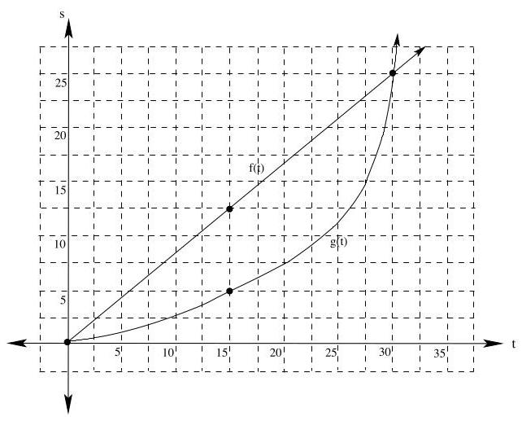
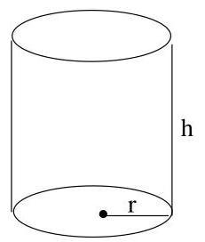
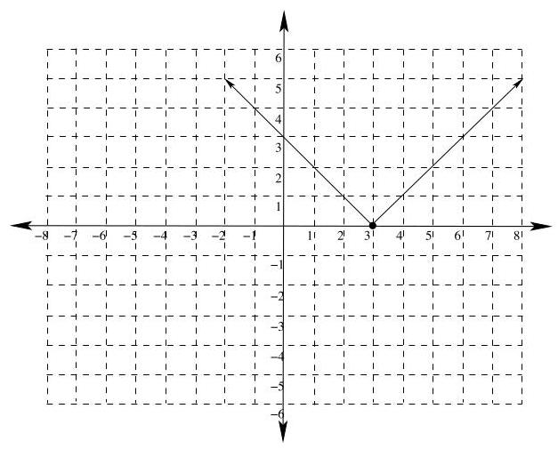
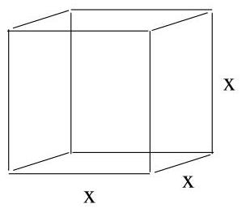

Math 261

Exam 2 - Practice Problems

1. Find the derivative ${y}^{\prime } = \frac{dy}{dx}$ for each of the following:

(a) $y = {\pi }^{2}x + \pi {x}^{2}$

$$
{y}^{\prime } = {\pi }^{2} + {2\pi x}
$$

(b) $y = \cot x$

${y}^{\prime } =  - {\csc }^{2}x$

(c) $y = \sqrt{x}\sec \left( {x}^{2}\right)$

${y}^{\prime } = \frac{1}{2}{x}^{-\frac{1}{2}}\sec \left( {x}^{2}\right)  + {x}^{\frac{1}{2}}\sec \left( {x}^{2}\right) \tan \left( {x}^{2}\right)  \cdot  {2x}$

$$
{y}^{\prime } = \frac{1}{2\sqrt{x}}\sec \left( {x}^{2}\right)  + {2x}\sqrt{x}\sec \left( {x}^{2}\right) \tan \left( {x}^{2}\right)
$$

(d) $y = 2{\tan }^{3}\left( {2{x}^{3}}\right)$

$$
{y}^{\prime } = 6{\tan }^{2}\left( {2{x}^{3}}\right)  \cdot  {\sec }^{2}\left( {2{x}^{3}}\right)  \cdot  6{x}^{2} = {36}{x}^{2}{\tan }^{2}\left( {2{x}^{3}}\right) {\sec }^{2}\left( {2{x}^{3}}\right)
$$

(e) $y = \frac{{x}^{2} - 7\cos \left( {3x}\right) }{x + \sin \left( {3 - {2x}}\right) }$

$$
{y}^{\prime } = \frac{\left( {{2x} + {21}\sin \left( {3x}\right) }\right) \left( {x + \sin \left( {3 - {2x}}\right) }\right)  - \left( {{x}^{2} - 7\cos \left( {3x}\right) }\right) \left( {1 - 2\cos \left( {3 - {2x}}\right) }\right) }{{\left( x + \sin \left( 3 - 2x\right) \right) }^{2}}
$$

Note: I won't make you take time to simplify problems like this one on the exam.

(f) ${x}^{2}y + {3xy} - 5{y}^{2} = 7$

Differentiating with respect to $x : {2xy} + {x}^{2}{y}^{\prime } + {3y} + {3x}{y}^{\prime } - {10y}{y}^{\prime } = 0$

Then $\left( {{x}^{2} + {3x} - {10y}}\right) {y}^{\prime } =  - {2xy} - {3y}$

Thus ${y}^{\prime } = \frac{-{2xy} - {3y}}{{x}^{2} + {3x} - {10y}}$

(g) ${\cos }^{2}\left( {xy}\right)  = 1$

Differentiating with respect to $x : {y}^{\prime } = 2\cos \left( {xy}\right)  \cdot  \left( {-\sin \left( {xy}\right) }\right)  \cdot  \left( {y + x{y}^{\prime }}\right)  = 0$

Then $- {2y}\cos \left( {xy}\right) \sin \left( {xy}\right) ) - \left\lbrack  {{2x}\cos \left( {xy}\right) \sin \left( {xy}\right) )}\right\rbrack  {y}^{\prime } = 0$ ,

or $\left. {-{y}^{\prime }\left\lbrack  {{2x}\cos \left( {xy}\right) \sin \left( {xy}\right) }\right) }\right\rbrack   = {2y}\cos \left( {xy}\right) \sin \left( {xy}\right)$

Thus ${y}^{\prime } = \frac{{2y}\cos \left( {xy}\right) \sin \left( {xy}\right) }{-{2x}\cos \left( {xy}\right) \sin \left( {xy}\right) } =  - \frac{y}{x}$

2. Use the formal limit definition of the derivative to find the derivative of the following:

(a) $f\left( x\right)  = {x}^{2} - {3x}$

$$
{f}^{\prime }\left( x\right)  = \mathop{\lim }\limits_{{h \rightarrow  0}}\frac{{\left( x + h\right) }^{2} - 3\left( {x + h}\right)  - {x}^{2} + {3x}}{h} = \mathop{\lim }\limits_{{h \rightarrow  0}}\frac{{x}^{2} + {2xh} + {h}^{2} - {3x} - {3h} - {x}^{2} + {3x}}{h}
$$

$$
= \mathop{\lim }\limits_{{h \rightarrow  0}}\frac{{2xh} + {h}^{2} - {3h}}{h} = \mathop{\lim }\limits_{{h \rightarrow  0}}{2x} + h - 3 = {2x} - 3
$$

(b) $f\left( x\right)  = \frac{2}{x - 3}$

$$
{f}^{\prime }\left( x\right)  = \mathop{\lim }\limits_{{h \rightarrow  0}}\frac{\frac{2}{x + h - 3} - \frac{2}{x - 3}}{h} = \mathop{\lim }\limits_{{h \rightarrow  0}}\frac{\frac{2\left( {x - 3}\right)  - 2\left( {x + h - 3}\right) }{\left( {x + h - 3}\right) \left( {x - 3}\right) }}{h}
$$

$$
= \mathop{\lim }\limits_{{h \rightarrow  0}}\frac{{2x} - 6 - {2x} - {2h} + 6}{\left( {x + h - 3}\right) \left( {x - 3}\right) }\frac{1}{h}
$$

$$
= \mathop{\lim }\limits_{{h \rightarrow  0}}\frac{-{2h}}{\left( {x + h - 3}\right) \left( {x - 3}\right) }\frac{1}{h} = \mathop{\lim }\limits_{{h \rightarrow  0}}\frac{-2}{\left( {x + h - 3}\right) \left( {x - 3}\right) } = \frac{-2}{{\left( x - 3\right) }^{2}}
$$

(c) $f\left( x\right)  = \sqrt{x - 2}$

$$
{f}^{\prime }\left( x\right)  = \mathop{\lim }\limits_{{h \rightarrow  0}}\frac{\sqrt{x + h - 2} - \sqrt{x - 2}}{h} \cdot  \frac{\sqrt{x + h - 2} + \sqrt{x - 2}}{\sqrt{x + h - 2} + \sqrt{x - 2}}
$$

$$
= \mathop{\lim }\limits_{{h \rightarrow  0}}\frac{x + h - 2 - x + 2}{h\left( {\sqrt{x + h - 2} + \sqrt{x - 2}}\right) } = \mathop{\lim }\limits_{{h \rightarrow  0}}\frac{h}{h\left( {\sqrt{x + h - 2} + \sqrt{x - 2}}\right) } = \frac{1}{2\sqrt{x - 2}}
$$

3. The position of two cars, car $A$ and car $B$ , both starting side by side on a straight road, is given by $f\left( t\right)$ and $g\left( t\right)$ , where $f\left( t\right)$ is the distance traveled car $A$ in feet, and $g\left( t\right)$ is the distance traveled car $B$ in feet, and $t$ is in minutes (see the graph below):

(a) How fast is car $A$ going at time $t = {15}$ ?

To find the speed of car $A$ at time $t = {15}$ , we need to find the slope of the tangent line to $f\left( t\right)$ when $t = {15}$ . From the graph, $m = \frac{12.5}{15} = \frac{5}{6}$ feet per minute.

(b) Find the average rate of change of car $B$ on the time interval $\left\lbrack  {0,{15}}\right\rbrack$ .

The average rate of change of car $B$ on the time interval $\left\lbrack  {0,{15}}\right\rbrack$ is given by the slope of the secant line to $g\left( t\right)$ , which is given by ${v}_{av} = \frac{5}{15} = \frac{1}{3}$ feet per minute.

(c) Which car is traveling faster at time $t = {15}$ ?

We are comparing the instantaneous velocities of the two cars when $t = {15}$ . From the graph, we see that the tangent line to $f\left( t\right)$ is steeper than the tangent line to $g\left( t\right)$ when $t = {15}$ , so car $A$ is going faster at that time.

(d) Which car is traveling faster at time $t = {30}$ ?

We are comparing the instantaneous velocities of the two cars when $t = {30}$ . From the graph, we see that the tangent line to $g\left( t\right)$ is steeper than the tangent line to $f\left( t\right)$ when $t = {30}$ , so car $B$ is going faster at that time.

(e) What can you say about the relative positions of the two cars at time $t = {30}$ ? Since the cars have driven the same distance, they are still side by side.

4. Use the quotient rule to derive the formula for the derivative of $\tan \left( x\right)$ .

Notice that $f\left( x\right)  = \tan x = \frac{\sin x}{\cos x}$

Then, using the quotient rule:

$$
{f}^{\prime }\left( x\right)  = \frac{\cos x \cdot  \cos x - \sin x \cdot  \left( {-\sin x}\right) }{{\cos }^{2}x} = \frac{{\cos }^{2}x + {\sin }^{2}x}{{\cos }^{2}x} = \frac{1}{{\cos }^{2}x} = {\sec }^{2}\left( x\right) .
$$

Thus $\frac{d}{dx}\left( {\tan x}\right)  = {\sec }^{2}x$

5. Use the product rule to prove that ${D}_{x}\left\lbrack  {f\left( x\right) g\left( x\right) h\left( x\right) }\right\rbrack   = {f}^{\prime }\left( x\right) g\left( x\right) h\left( x\right)  + f\left( x\right) {g}^{\prime }\left( x\right) h\left( x\right)  + f\left( x\right) g\left( x\right) {h}^{\prime }\left( x\right)$ We'll use the product rule twice:

$$
{D}_{x}\left\lbrack  {\left( {f\left( x\right) g\left( x\right) }\right) h\left( x\right) }\right\rbrack   = {D}_{x}\left\lbrack  {f\left( x\right) g\left( x\right) }\right\rbrack  h\left( x\right)  + \left( {f\left( x\right) g\left( x\right) }\right)  \cdot  {h}^{\prime }\left( x\right)
$$

$= \left\lbrack  {{f}^{\prime }\left( x\right) g\left( x\right)  + f\left( x\right) {g}^{\prime }\left( x\right) }\right\rbrack  h\left( x\right)  + f\left( x\right) g\left( x\right) {h}^{\prime }\left( x\right)  = {f}^{\prime }\left( x\right) g\left( x\right) h\left( x\right)  + f\left( x\right) {g}^{\prime }\left( x\right) h\left( x\right)  + f\left( x\right) g\left( x\right) {h}^{\prime }\left( x\right)$

6. If $f\left( x\right)  = \sqrt{{3x} - 5}$ , find the intervals where $f\left( x\right)$ is continuous, and find the intervals where $f\left( x\right)$ is differentiable.

Recall that $f\left( x\right)$ is the square root of a polynomial, so it is continuous wherever it is defined. That is, whenever ${3x} - 5 \geq  0$ , or when $x \geq  \frac{5}{3}$ .

Thus $f\left( x\right)$ is continuous on $\left\lbrack  {\frac{5}{3},\infty }\right)$

Next, ${f}^{\prime }\left( x\right)  = \frac{1}{2}{\left( 3x - 5\right) }^{-\frac{1}{2}}\left( 3\right)  = \frac{3}{2\sqrt{{3x} - 5}}$

Then ${f}^{\prime }\left( x\right)$ is defined when ${3x} - 5 > 0$ , or when $x > \frac{5}{3}$ , so $f\left( x\right)$ is differentiable on $\left( {\frac{5}{3},\infty }\right)$

7. If $f\left( x\right)  = 3{x}^{4} - 5{x}^{2} + {7x} - {12}$ , use differentials to approximate $f\left( {1.1}\right)$

Let $x = 1$ and ${\Delta x} = {.1}$ . Notice that ${f}^{\prime }\left( x\right)  = {12}{x}^{3} - {10x} + 7$ , so ${f}^{\prime }\left( 1\right)  = {12} - {10} + 7 = 9$ , and $f\left( 1\right)  = 3 - 5 + 7 - {12} = {10} - {17} =  - 7$

Then $f\left( {1.1}\right)  \approx  f\left( 1\right)  + {f}^{\prime }\left( 1\right) {\Delta x} =  - 7 + 9\left( {.1}\right)  =  - 7 + {.9} =  - {6.1}$

8. Use differentials to approximate $\sqrt{1.2}$ . How good is your approximation?

Let $f\left( x\right)  = \sqrt{x}$ . Then ${f}^{\prime }\left( x\right)  = \frac{1}{2\sqrt{x}}$ .

Let $x = 1$ and ${\Delta x} = {.2}$ . Then, using the linear approximation formula:

$f\left( {1.2}\right)  \approx  f\left( 1\right)  + {f}^{\prime }\left( 1\right) {\Delta x} = 1 + \frac{1}{2} \cdot  \left( {.2}\right)  = {1.1}$

Notice that using a calculator, $\sqrt{1.2} \approx  {1.095445}$ , so if we believe our calculator, our approximation using the tangent line to $f$ when $x = 1$ is good to within about .004556 .

9. Use differentials to estimate $\sqrt[3]{9}$ . How good is your approximation?

Let $f\left( x\right)  = {x}^{\frac{1}{3}}, x = 8$ , and ${\Delta x} = 1$ .

Then ${f}^{\prime }\left( x\right)  = \frac{1}{3}{x}^{-\frac{2}{3}} = \frac{1}{3{x}^{\frac{2}{3}}}$ .

Therefore, $f\left( 8\right)  = \sqrt[3]{8} = 2$ , and ${f}^{\prime }\left( 8\right)  = \frac{1}{3 \cdot  {8}^{\frac{2}{3}}} = \frac{1}{3\left( 4\right) } = \frac{1}{12}$ .

Thus $f\left( 9\right)  \approx  f\left( 8\right)  + {f}^{\prime }\left( 8\right) {\Delta x} = 2 + \frac{1}{12} = \frac{25}{12} \approx  {2.08333}$

Notice that $\sqrt[3]{9} \approx  {2.08008}$ , so our approximation in within 33 ten-thousandths.

10. Suppose helium is being pumped into a spherical balloon at a rate of 4 cubic feet per minute. Find the rate at which the radius is changing when the radius is 2 feet.

Recall that the volume of a sphere of radius $r$ is given by $V = \frac{4}{3}\pi {r}^{3}$ . In the situation described, both $V$ and $r$ are functions of time $t$ in minutes.

Then, differentiating implicitly, $\frac{dV}{dt} = {4\pi }{r}^{2}\frac{dr}{dt}$ .

We also know that $\frac{dV}{dt} = 4\frac{f{t}^{3}}{\min }$ and $r = 2$ feet.

Thus $4 = {4\pi }\left( 4\right) \frac{dr}{dt}$ , so $\frac{dr}{dt} = \frac{4}{16\pi } = \frac{1}{4\pi }\frac{ft}{\min }$ .

11. Dr. Von Klausen has just invented a shrink ray and decides to try it out on a test object: a cylinder whose height is twice its radius. The shrink ray has been calibrated so that the proportions of the cylinder remain the same throughout the test. A few seconds into the test, the radius of the cylinder is decreasing at 2 inches per second, and the height is 4 inches. At what rate is the volume of the cylinder changing at that time? (Be sure to include units in your answer)

Recall that the volume of a cylinder is given by: $V = \pi {r}^{2}h$

Here, $h = {2r}$ and $h = 4$ , so $r = 2$ . Also, $\frac{dr}{dt} =  - 2$ inches per second.

Substituting $h = {2r}$ into the main volume equation, we get $v = {2\pi }{r}^{3}$ .

Differentiating implicitly: $\frac{dV}{dt} = {6\pi }{r}^{2}\frac{dr}{dt} = {6\pi }\left( {2}^{2}\right) \left( {-2}\right)  =  - {48\pi }$ cubic inches per second.

12. Find the equation of the tangent line to the graph of $f\left( x\right)  = \tan \left( {4x}\right)$ when $x = \frac{3\pi }{16}$

${f}^{\prime }\left( x\right)  = 4{\sec }^{2}\left( {4x}\right)  = \frac{4}{{\cos }^{2}\left( {4x}\right) }$ . Therefore ${f}^{\prime }\left( \frac{3\pi }{16}\right)  = \frac{4}{{\cos }^{2}\left( \frac{12\pi }{16}\right) } = \frac{4}{{\left( \frac{-\sqrt{2}}{2}\right) }^{2}} = \frac{4}{\frac{1}{2}} = 8$ ,

and $f\left( \frac{3\pi }{16}\right)  = \tan \left( \frac{3\pi }{4}\right)  =  - 1$ .

Then the tangent line to $f\left( x\right)$ when $x = \frac{3\pi }{16}$ has slope 8 and goes through the point $\left( {\frac{3\pi }{16}, - 1}\right)$

Hence the tangent line has equation $y + 1 = 8\left( {x - \frac{3\pi }{16}}\right)$ so $y = {8x} - \frac{3\pi }{2} - 1$

13. Find the equation of the tangent line to the graph of $y = \sec \left( {2x}\right)$ when $x = \frac{\pi }{6}$ .

$$
{y}^{\prime } = 2\sec \left( {2x}\right) \tan \left( {2x}\right)  = \frac{2\sin \left( {2x}\right) }{{\cos }^{2}\left( {2x}\right) }
$$

$$
m = \frac{2\sin \left( \frac{\pi }{3}\right) }{{\cos }^{2}\left( \frac{\pi }{3}\right) } = \frac{2\left( \frac{\sqrt{3}}{2}\right) }{{\left( \frac{1}{2}\right) }^{2}} = 4\sqrt{3}
$$

$$
y = \sec \frac{\pi }{3} = \frac{1}{\cos \left( \frac{\pi }{3}\right) } = \frac{1}{\frac{1}{2}} = 2
$$

Therefore, the equation of the tangent line is given by: $y - 2 = 4\sqrt{3}\left( {x - \frac{\pi }{6}}\right)$ ,

$$
\text{or}y = 4\sqrt{3}x - \frac{2\sqrt{3}\pi  + 6}{3}
$$

14. Find the points on the graph of $y = 2{x}^{3} + 3{x}^{2} - {72x} + 5$ at which the tangent line is horizontal. Let $y = f\left( x\right)$ . Then ${f}^{\prime }\left( x\right)  = 6{x}^{2} + {6x} - {72} = 6\left( {{x}^{2} + x - {12}}\right)$ , so the points at which the tangent line is horizontal occur when ${x}^{2} + x - {12} = 0$ , or when $\left( {x + 4}\right) \left( {x - 3}\right)  = 0$ , that is, when $x =  - 4$ , and $x - 3$ . Notice that $f\left( {-4}\right)  = 2{\left( -4\right) }^{3} + 3{\left( -4\right) }^{2} - {72}\left( {-4}\right)  + 5 = {213}$ , and $f\left( 3\right)  = 2{\left( 3\right) }^{3} + 3{\left( 3\right) }^{2} - {72}\left( 3\right)  + 5 =  - {130}$ Hence the points on the graph of $y = f\left( x\right)$ with horizontal tangent lines are:(-4,213)and(3, - 130).

15. Find the equation of the tangent line to the graph of the relation ${x}^{2}y + 3{y}^{2} = {3x} - 7$ at the point (2, -1)

Differentiating implicitly: ${2xy} + {x}^{2}{y}^{\prime } + {6y}{y}^{\prime } = 3$ , so ${y}^{\prime }\left( {{x}^{2} + {6y}}\right)  = 3 - {2xy})$

Thus ${y}^{\prime } = \frac{3 - {2xy}}{{x}^{2} + {6y}}$ . Evaluating when $x = 2$ and $y =  - 1$ ,

$m = \frac{3 - 2\left( 2\right) \left( {-1}\right) }{{2}^{2} + 6\left( {-1}\right) } = \frac{3 + 4}{-2} =  - \frac{7}{2}.$

Then the equation for the tangent line is given by: $y + 1 =  - \frac{7}{2}\left( {x - 2}\right)$ , or $y =  - \frac{7}{2}x + 6$ .

16. Draw the graph of a function $f\left( x\right)$ that is continuous when $x = 3$ , but is not differentiable when $x = 3$ .

There are many possible examples. One possibility is:

17. Find ${g}^{\prime }\left( 2\right)$ if $h\left( x\right)  = f\left( {g\left( x\right) }\right) , f\left( 3\right)  =  - 2, g\left( 2\right)  = 3,{f}^{\prime }\left( 3\right)  = 5$ , and ${h}^{\prime }\left( 2\right)  =  - {30}$ .

Using the Chain Rule, ${h}^{\prime }\left( x\right)  = {f}^{\prime }\left( {g\left( x\right) }\right) {g}^{\prime }\left( x\right)$ , so ${h}^{\prime }\left( 2\right)  = {f}^{\prime }\left( {g\left( 2\right) }\right) {g}^{\prime }\left( 2\right)  = {f}^{\prime }\left( 3\right) {g}^{\prime }\left( 2\right)$ .

Therefore, $- {30} = 5{g}^{\prime }\left( 2\right)$ , so $- 6 = {g}^{\prime }\left( 2\right)$ .

18. Given that $f\left( 2\right)  =  - 3, g\left( 2\right)  = 2,{f}^{\prime }\left( 2\right)  = \frac{1}{2},{g}^{\prime }\left( 2\right)  =  - 5$ , and $h\left( x\right)  = f\left( {g\left( x\right) }\right)$ .

Find the following:

(a) ${\left( f - g\right) }^{\prime }\left( 2\right)$ (b) ${\left( fg\right) }^{\prime }\left( 2\right)$

$$
= {f}^{\prime }\left( 2\right)  - {g}^{\prime }\left( 2\right)  = \frac{1}{2} - \left( {-5}\right)
$$

$$
= {f}^{\prime }\left( 2\right) g\left( 2\right)  + f\left( 2\right) {g}^{\prime }\left( 2\right)  = \left( \frac{1}{2}\right) \left( 2\right)  + \left( {-3}\right) \left( {-5}\right)
$$

$$
= \frac{1}{2} + 5 = \frac{11}{2} = {5.5}
$$

(c) ${\left( \frac{f}{g}\right) }^{\prime }\left( 2\right)$ (d) ${h}^{\prime }\left( 2\right)$

$$
= \frac{{f}^{\prime }\left( 2\right) g\left( 2\right)  - f\left( 2\right) {g}^{\prime }\left( 2\right) }{{\left\lbrack  g\left( 2\right) \right\rbrack  }^{2}}
$$

$$
= {f}^{\prime }\left( {g\left( 2\right) }\right) {g}^{\prime }\left( 2\right)  = {f}^{\prime }\left( 2\right) {g}^{\prime }\left( 2\right)
$$

$$
= \frac{\left( \frac{1}{2}\right) \left( 2\right)  - \left( { - 3}\right) \left( { - 5}\right) }{{2}^{2}} = \frac{1 - {15}}{4} =  - \frac{7}{2}\; = \left( \frac{1}{2}\right) \left( { - 5}\right)  =  - {2.5}
$$

19. Find ${f}^{\left( 8\right) }\left( x\right)$ if $f\left( x\right)  = \sin \left( {2x}\right)$

Notice that ${f}^{\prime }\left( x\right)  = 2\cos \left( {2x}\right)$

Continuing in this fashion, ${f}^{\left( 8\right) }\left( x\right)  = {2}^{8}\sin \left( {2x}\right)  = {256}\sin \left( {2x}\right)$ .

20. Find ${f}^{\left( {13}\right) }\left( x\right)$ if $f\left( x\right)  = {x}^{12} + 7{x}^{5} - 3{x}^{3} - 1$

Since the highest exponent is 12 , and differentiation using the power rule lowers the exponent of each term by one, then ${f}^{\left( {13}\right) }\left( x\right)  = 0$ .

21. Use linearization to find a good approximation of $\sqrt[3]{10}$ .

There are several ways that we could accomplish this. Here is one possibility:

Let $f\left( x\right)  = \sqrt[3]{x + 8}$ and let $a = 0$ . Then ${f}^{\prime }\left( x\right)  = \frac{1}{3}{\left( x + 8\right) }^{-\frac{2}{3}}$ , so ${f}^{\prime }\left( 0\right)  = \frac{1}{3}{\left( 8\right) }^{-\frac{2}{3}} = \frac{1}{3} \cdot  \frac{1}{4} = \frac{1}{12}$ . Also note that $f\left( 0\right)  = \sqrt[3]{8} = 2$ .

Therefore, $L\left( x\right)  = 2 + \frac{1}{12}x$ . If we wish to approximate $\sqrt[3]{10}$ , we must set $x = 2$ .

$L\left( 2\right)  = 2 + \frac{1}{12}\left( x\right)  = 2 + \frac{1}{6} = \frac{13}{6}.$

Note that $\frac{13}{6} \approx  {2.16667}$ , while $\sqrt[3]{10} \approx  {2.15443}$ , so we appear to be getting a decent approximation.

22. A company manufactures wooden cubes. Each side of the finished cubes are 5 inches long, with a maximum error of $\pm  {.2}$ inches per side. Use differentials to estimate the maximum error in the volume of the cube. Then, compare your estimate with the error in volume of a cube with largest possible volume manufactured within the given error tolerances.

The volume of a cube is given by $V = {x}^{3}$ . Then ${dV} = 3{x}^{2}{\Delta x}$ can be used to approximate the error in volume. Here, $x = 5$ inches, and ${\Delta x} =  \pm  {.2}$ inches.

Hence ${\Delta V} \approx  {dV} = 3{x}^{2}{\Delta x} = 3\left( {5}^{2}\right) \left( {\pm {.2}}\right)  =  \pm  {15}$ cubic inches.

A perfectly constructed cube would have a volume $v = {5}^{3} = {125}$ cubic inches.

Then, according to our estimate using differentials, ${110} \leq  V \leq  {140}$ is the error range for the volume of the manufactured cubes.

In reality, the biggest possible cube would have sides all of length 5.2 inches, or a volume of ${\left( {5.2}\right) }^{3} =$ 140.608 cubic inches. So our estimate for the maximum error is pretty close to the actual maximum error.