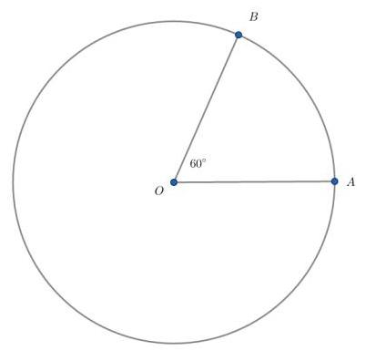
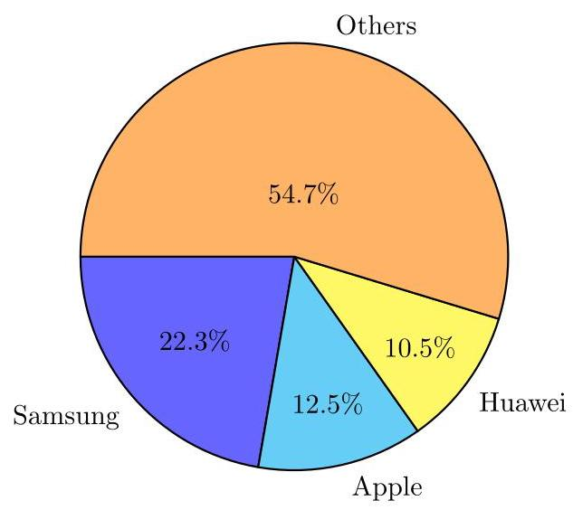

# Mahidol University International College  Mathematics Test

SAMPLE

DIRECTIONS: Solve the following problems using any available space on the page for scratchwork. On your answer sheet fill in the choice that best corresponds to the correct answer. You may fold any page of the test papers but may NOT separate any page from the test papers themselves. The use of a calculator is permitted.

Questions 1 and 2 refer to the following chart:

Burger Sales

for the week of December 10 to 16, 2017

<table><tr><td colspan="3">or the week of December 10 to 16, 2017</td></tr><tr><td>Day</td><td>Hamburgers</td><td>Cheeseburgers</td></tr><tr><td>Sunday</td><td>120</td><td>92</td></tr><tr><td>Monday</td><td>85</td><td>80</td></tr><tr><td>Tuesday</td><td>77</td><td>70</td></tr><tr><td>Wednesday</td><td>74</td><td>71</td></tr><tr><td>Thursday</td><td>75</td><td>72</td></tr><tr><td>Friday</td><td>91</td><td>88</td></tr><tr><td>Saturday</td><td>111</td><td>112</td></tr></table>

1. On which day were the most burgers (hamburgers or cheeseburgers) sold?

A. Saturday

B. Monday

C. Thursday

D. Friday

E. Sunday

2. On how many days were more hamburgers sold than cheeseburgers?

A. 7

B. 6

C. 5

D. 4

E. 3

3. If ${3x} + {17} = 5$ , then ${2x} + 4 =$

A. -4

B. -2

C. 0

D. 2

E. 4

4. Which of the following is a value of $x$ for which ${x}^{2} + x - 6 = 0$ ?

A. -4

B. -3

C. -2

D. -1

E. 1

5. Allen can mow the lawn in 5 hours, and Betty can mow the lawn in 4 hours. How many hours will it take them to mow the lawn together?

A. 1

B. $2\frac{2}{9}$

C. 4

D. $4\frac{1}{2}$

E. 5

6. If a mixture is $3/7$ alcohol by volume and $4/7$ water by volume, what is the ratio of the volume of alcohol to the volume of water in this mixture?

A. $\frac{3}{7}$

B. $\frac{4}{7}$

C. $\frac{3}{4}$

D. $\frac{4}{3}$

E. $\frac{7}{4}$

7. If ${40}\%$ of the students in a class have blue eyes and 20% of those with blue eyes have brown hair, then what percent of the original total number have brown hair and blue eyes?

A. 4%

B. 8%

C. 16%

D. 20%

E. 32%

8. The perimeter of an isosceles triangle ${ABC}$ is 42 . The two equal sides, $\overline{AB}$ and $\overline{AC}$ are each three times as long as the third side. What are the lengths of each side?

A.21,21,21

B.6,6,18

C.18,21,3

D.18,18,6

E.4,19,19

9. In a family of five, the heights of the members are 5 feet 1 inch, 5 feet 7 inches, 5 feet 2 inches, 5 feet, and 4 feet 7 inches. The average height is

A. 4 feet $4\frac{1}{5}$ inches

B. 5 feet

C. 5 feet 1 inch

D. 5 feet 2 inches

E. 5 feet 3 inches

10. In the first year of the U.S. Pinball League, the Baltimore Chargers won 50% of their games. During the second season of the league, the Chargers won 65% of their games. If there were twice as many games played in the second season as in the first, what percentage of the games did the Chargers win in the first two years of the league?

A. 115%

B. 60%

C. 57.5%

D. ${55}\%$

E. It cannot be determined from the given information.

11. In a circle with center $O$ . Let $\mathrm{A},\mathrm{B}$ be distinct points on the circumference of the circle and the measure of angle $\angle {AOB} = {80}$ degrees. How many degrees are there in angle $\angle {ABO}$ ?

A. 40 degrees

B. 50 degrees

C. 60 degrees

D. 70 degrees

E. 80 degrees

12. The average temperatures for five days were ${82}^{ \circ  },{86}^{ \circ  },{91}^{ \circ  },{79}^{ \circ  }$ , and ${91}^{ \circ  }$ . What is the mode for these temperatures? A. ${79}^{ \circ  }$

B. ${85.8}^{ \circ  }$

C. ${86}^{ \circ  }$

D. ${86.8}^{ \circ  }$

E. ${91}^{ \circ  }$

13. What percentage of $\frac{2}{3}$ is $\frac{1}{2}$ ?

A. 300%

B. ${133}\frac{1}{3}\%$

C. 75%

D. 50%

E. ${33}\frac{1}{3}\%$

14. If the volume and the total surface area 16. For $x > 0, y > 0$ , which of the following of a cube are equal, then what is the length is equivalent to the expression of one edge of the cube?

$$
{\left( \frac{3{x}^{3/2}{y}^{3}}{{x}^{2}{y}^{-1/2}}\right) }^{-2}?
$$

A. 2 units B. 3 units A. $\frac{9x}{{y}^{7}}$ C. 4 units B. $\frac{9{y}^{7}}{x}$ D. 5 units E. 6 units

 C. $\frac{{x}^{2}}{9{y}^{3}}$

15. D. $\frac{x}{9{y}^{7}}$

E. $\frac{{x}^{1/2}}{3{y}^{7/2}}$

17. For $x > 0$ , which of the following is equivalent to the expression

$$
\frac{4 + \frac{2}{x}}{\frac{x}{3} + \frac{1}{6}}
$$

A. 12

What is the probability that a dart thrown B. $\frac{x}{12}$ in the circle with center $O$ above will land in C. $\frac{9}{x}$ the sector ${AOB}$ , if the measure of the angle $\angle {AOB}$ is ${60}^{ \circ  }$ ? D. ${12x}$ A. $\frac{1}{2}$ E. $\frac{12}{x}$

B. $\frac{1}{3}$

C. $\frac{1}{4}$

D. $\frac{1}{6}$

E. $\frac{1}{8}$

18. What is the value of $\frac{{80}^{4} - 1}{{80}^{2} - 1}$ ?

A. 5999

B. 6001

C. 6299

D. 6399

E. 6401

19. Let $f$ be a linear function such that $f\left( 3\right)  =  - 1$ and $x$ -intercept is 2 . Find $f\left( {-4}\right)$ .

A. 6

B. 4

C. 7

D. 5

E. 8

20. Which of the following is an equation of a line perpendicular to $y =  - {2x} + 3$ and passing through the point(2,1)?

A. $y + 5 = {3x}$

B. $y = {2x} - 3$

C. ${2y} = x$

D. ${2y} = 4 - x$

E. $y = \frac{1}{-{2x} + 3}$

21. Which of the following equations passes through all of the points: $\left( {-3,2}\right) ,\left( {0,2}\right)$ and (2, - 8)?

A. $y = {x}^{2} - {4x} + 2$

B. $y = {2}^{x} + 2$

C. ${2y} = 4 - x$

D. $y =  - {x}^{2} - {3x} + 2$

E. $y = \frac{x}{-2{x}^{2} + 3}$

22. If $x + y = 2$ and ${x}^{2} - {y}^{2} = {16}$ , then which of the following is the value of $x$ ?

A. -2

B. -3

C. 2

D. 3

E. 5

23. You own 2 hats, 3 shirts, 2 pants and 5 shoes. How many different ways you can dress yourself with hat, shirt, pant and shoe?

A. 12

B. 20

C. 30

D. 60

E. 80

24. You try to graduate college with at least 3.0 GPA. The GPA during the first three years of yours are 3.2, 3.1 and 3.4 respectively. What is the minimum GPA during the last year in order to attian the average of 3.0 GPA? Given that you take the same number of credits every year.

A. 2.3

B. 2.5

C. 2.8

D. 3.0

E. 3.2

25. Assume everyone has equal chance to born in any day of the year $({365}$ days $= 1$ year). What is the probability that a random person will have the same birthday as yours?

A. $\frac{1}{\sqrt{365}}$

B. $\frac{1}{100}$

C. $\frac{1}{144}$

D. $\frac{1}{365}$

E. $\frac{1}{{365}^{2}}$

26. The shareholder value of a particular company grows at a constant rate through time. The relationship of $V$ and $T$ , where $V$ is shareholder value (in hundred bahts) and $T$ represents number of years, has been recorded as below:

<table><tr><td>$T$</td><td>0</td><td>1</td><td>2</td><td>3</td><td>4</td></tr><tr><td>$V$</td><td>7</td><td>13</td><td>19</td><td>25</td><td>31</td></tr></table>

Which of the following equations represents this data?

A. $V = T + 6$

B. $V = 6 \cdot  T + 6$

C. $V = 6 \cdot  T + 7$

D. $V = 7 \cdot  T$

E. $V = 7 \cdot  T + 6$

27. According to the data from a certain 28. The heights of one hundred random Thai website: the pie chart below shows the distri- adults are as follows. bution of the smart-phone user according to brand in Quarter 3, 2017. Out of 1000 smart-phone users, approximately how many people use phone made by Samsung or Apple?

<table><tr><td colspan="2"/><td>Women</td><td>Men</td></tr><tr><td rowspan="2">Height (in cm)</td><td>> 167</td><td>17</td><td>22</td></tr><tr><td>< 167</td><td>37</td><td>24</td></tr></table>

Among the women in this survey, what is the ratio of persons whose heights are less than ${167}\mathrm{\;{cm}}$ ?

$$
\text{A.}\frac{17}{100}
$$

B. $\frac{37}{100}$ C. $\frac{17}{54}$ D. $\frac{37}{54}$ E. $\frac{37}{61}$ A. 22

29. The relationship of the temperatures between degree Celsius(C)and degree Fahrenheit(F)is given by

$$
C = \frac{5\left( {F - {32}}\right) }{9}.
$$

E. 348 What is 30 degree Celsius in degree Fahrenheit? A. 72 B. 80 C. 86 D. 94 E. 100

30. The amounts of time (in minutes) I spent

on watching YouTube this week are

142,210,34,67,252,52,221.

What is the median of this data?

A. 104.5

B. 139.71

C. 142

D. 176

E. 210

31.

$$
\left( {{x}^{2}y - 5{y}^{2} + {3x}{y}^{2}}\right)  - \left( {{x}^{2}y - {3x}{y}^{2} + 2{y}^{2}}\right)
$$

Which of the following is equivalent to the expression above?

A. ${6x}{y}^{2} - 7{y}^{2}$

B. $2{x}^{2}y - 7{y}^{2}$

C. ${6x}{y}^{2} + 7{y}^{2}$

D. $2{x}^{2}y + 7{y}^{2}$

E. none of the above

32. If $x > 1$ , which of the following is equiv-

alent to

$$
\frac{1}{\frac{1}{x + 1} + \frac{1}{x - 1}}
$$

A. $\frac{2x}{{x}^{2} - 1}$

B. $\frac{x}{{x}^{2} - 1}$

C. $\frac{{x}^{2} - 1}{2x}$

D. $\frac{{x}^{2} - 1}{2}$

E. ${2x}$

33. If ${2x} - y = {10}$ , what is the value of $\frac{{16}^{x}}{{4}^{y}}$ ?

A. ${2}^{10}$

B. ${4}^{8}$

C. ${8}^{10}$

D. ${2}^{20}$

E. The value cannot be determined from the given information.

34.

$$
{3x} - {4y} =  - 8
$$

$$
y - {2x} = 5
$$

What is the solution(x, y)to the system of equations above?

A.(-2, - 1)

B. $\left( {-\frac{1}{3},\frac{11}{3}}\right)$

C.(-3, - 2)

D. $\left( {-\frac{12}{5},\frac{1}{5}}\right)$

E.(-8,10)

35. The set of all real numbers $x$ such that $\sqrt{{x}^{2}} =  - x$ consists of

A. zero only

B. non-positive real numbers only

C. positive real numbers only

D. all real numbers

E. no real numbers

36.

$$
h = {3.3a} + {28.6}
$$

A pediatrician uses the model above to estimate the height $h$ of a boy, in inches, in terms of the boy’s age $a$ , in years, between the agae of 2 and 5 . Based on the model, what is the estimated increase, in inches, of a boy's height each year?

A. 3

B. 14.3

C. 3.3

D. 28.6

E. 4.3

 

37. Toni is a repair technician for a phone company. Each week, she receives a batch of phones that need repairs. The number of phones that she has left to fix at the end of each day can be estimated with the equation $P = {100} - {25d}$ where $P$ is the number of phones left and $d$ is the number of days she has worked that week. Which of the following is correct about this equation?

A. Toni repairs phones at a rate of 100 per hour.

B. Toni will complete the repairs within 100 days.

C. Toni repairs phones at a rate of 4 per day.

D. Toni will complete the repairs within 25 days.

E. Toni starts each week with 100 phones to fix.

38. A square field measures 10 meters by 10 meters. Ten students each mark off a randomly selected spot of the field; each spot is a square and has side lengths of 1 meter, and no two spots overlap. The students count the earthworms contained in the soil to a depth of 5 centimeters beneath the ground's surface in each spot. The results are shown in the table below.

<table><tr><td>Spot</td><td>#of worms</td><td>Spot</td><td>#of worms</td></tr><tr><td>A</td><td>170</td><td>F</td><td>130</td></tr><tr><td>B</td><td>200</td><td>G</td><td>150</td></tr><tr><td>C</td><td>147</td><td>H</td><td>154</td></tr><tr><td>D</td><td>126</td><td>I</td><td>190</td></tr><tr><td>E</td><td>210</td><td>J</td><td>198</td></tr></table>

Which of the following is a reasonable approximation of the number of earthworms to a depth of 5 centimeters beneath the ground's surface in the entire field?

A. 200

B. 170

C. 2000

D. 1,700

E. 20,000

39. Alex is a biologist studying the production of apples by two types of apple trees. He noticed that Type A trees produced 15 percent more apples than Type B trees did. Based on Alex's observation, if the type A trees produced 138 apples, how many apples did the Type B trees produced?

A. 110

B. 112

C. 115

D. 120

E. 130

40. The population of piranhas in the Amazon river is estimated over the course of twenty months, as shown in the table.

<table><tr><td>Time (months)</td><td>Population</td></tr><tr><td>0</td><td>100</td></tr><tr><td>5</td><td>1,000</td></tr><tr><td>10</td><td>10,000</td></tr><tr><td>15</td><td>100,000</td></tr><tr><td>20</td><td>1,000,0000</td></tr></table>

Which of the following best describes the relationship between time and the estimated population of piranhas during the twenty months?

A. Increasing linear

B. Decreasing linear

C. Exponential growth

D. Exponential decay

E. None of the above

