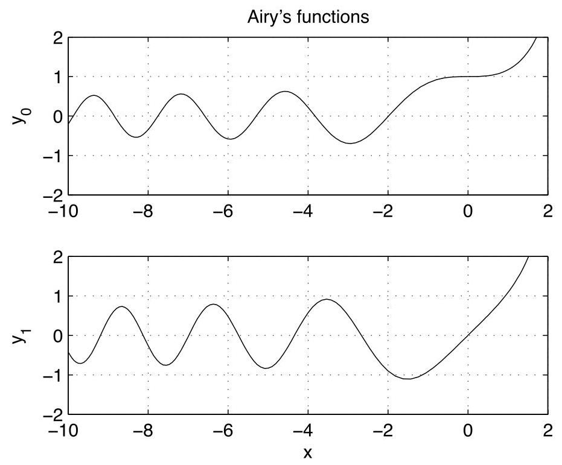

Using the principle of superposition, the general solution is therefore

$$
y\left( x\right)  = {a}_{0}\mathop{\sum }\limits_{{n = 0}}^{\infty }\frac{{\left( -1\right) }^{n}}{\left( {2n}\right) !}{x}^{2n} + {a}_{1}\mathop{\sum }\limits_{{n = 0}}^{\infty }\frac{{\left( -1\right) }^{n}}{\left( {{2n} + 1}\right) !}{x}^{{2n} + 1}
$$

$$
= {a}_{0}\left( {1 - \frac{{x}^{2}}{2!} + \frac{{x}^{4}}{4!} - \ldots }\right)  + {a}_{1}\left( {x - \frac{{x}^{3}}{3!} + \frac{{x}^{5}}{5!} - \ldots }\right)
$$

$$
= {a}_{0}\cos x + {a}_{1}\sin x,
$$

as expected.

In our next example, we will solve the Airy's Equation. This differential equation arises in the study of optics, fluid mechanics, and quantum mechanics.

Example: Find the general solution of ${y}^{\prime \prime } - {xy} = 0$ .

View tutorial on YouTube

With

$$
y\left( x\right)  = \mathop{\sum }\limits_{{n = 0}}^{\infty }{a}_{n}{x}^{n}
$$

the differential equation becomes

$$
\mathop{\sum }\limits_{{n = 2}}^{\infty }n\left( {n - 1}\right) {a}_{n}{x}^{n - 2} - \mathop{\sum }\limits_{{n = 0}}^{\infty }{a}_{n}{x}^{n + 1} = 0. \tag{5.4}
$$

We shift the first sum to ${x}^{n + 1}$ by shifting the exponent up by three, i.e.,

$$
\mathop{\sum }\limits_{{n = 2}}^{\infty }n\left( {n - 1}\right) {a}_{n}{x}^{n - 2} = \mathop{\sum }\limits_{{n =  - 1}}^{\infty }\left( {n + 3}\right) \left( {n + 2}\right) {a}_{n + 3}{x}^{n + 1}.
$$

When combining the two sums in (5.4), we separate out the extra $n =  - 1$ term in the first sum given by $2{a}_{2}$ . Therefore,(5.4) becomes

$$
2{a}_{2} + \mathop{\sum }\limits_{{n = 0}}^{\infty }\left( {\left( {n + 3}\right) \left( {n + 2}\right) {a}_{n + 3} - {a}_{n}}\right) {x}^{n + 1} = 0. \tag{5.5}
$$

Setting coefficients of powers of $x$ to zero, we first find ${a}_{2} = 0$ , and then obtain the recursion relation

$$
{a}_{n + 3} = \frac{1}{\left( {n + 3}\right) \left( {n + 2}\right) }{a}_{n}. \tag{5.6}
$$

Three sequences of coefficients-those starting with either ${a}_{0},{a}_{1}$ or ${a}_{2}$ -decouple. In particular the three sequences are

$$
{a}_{0},{a}_{3},{a}_{6},{a}_{9},\ldots ;
$$

$$
{a}_{1},{a}_{4},{a}_{7},{a}_{10},\ldots \text{;}
$$

$$
{a}_{2},{a}_{5},{a}_{8},{a}_{11}\ldots
$$

Since ${a}_{2} = 0$ , we find immediately for the last sequence

$$
{a}_{2} = {a}_{5} = {a}_{8} = {a}_{11} = \cdots  = 0.
$$

We compute the first four nonzero terms in the power series with coefficients corresponding to the first two sequences. Starting with ${a}_{0}$ , we have

$$
{a}_{0},
$$

$$
{a}_{3} = \frac{1}{3 \cdot  2}{a}_{0}
$$

$$
{a}_{6} = \frac{1}{6 \cdot  5 \cdot  3 \cdot  2}{a}_{0}
$$

$$
{a}_{9} = \frac{1}{9 \cdot  8 \cdot  6 \cdot  5 \cdot  3 \cdot  2}{a}_{0}
$$

and starting with ${a}_{1}$ ,

$$
{a}_{1},
$$

$$
{a}_{4} = \frac{1}{4 \cdot  3}{a}_{1}
$$

$$
{a}_{7} = \frac{1}{7 \cdot  6 \cdot  4 \cdot  3}{a}_{1}
$$

$$
{a}_{10} = \frac{1}{{10} \cdot  9 \cdot  7 \cdot  6 \cdot  4 \cdot  3}{a}_{1}.
$$

The general solution for $y = y\left( x\right)$ , can therefore be written as

$$
y\left( x\right)  = {a}_{0}\left( {1 + \frac{{x}^{3}}{6} + \frac{{x}^{6}}{180} + \frac{{x}^{9}}{12960} + \ldots }\right)  + {a}_{1}\left( {x + \frac{{x}^{4}}{12} + \frac{{x}^{7}}{504} + \frac{{x}^{10}}{45360} + \ldots }\right)
$$

$$
= {a}_{0}{y}_{0}\left( x\right)  + {a}_{1}{y}_{1}\left( x\right) .
$$

Suppose we would like to graph the solutions $y = {y}_{0}\left( x\right)$ and $y = {y}_{1}\left( x\right)$ versus $x$ by solving the differential equation ${y}^{\prime \prime } - {xy} = 0$ numerically. What initial conditions should we use? Clearly, $y = {y}_{0}\left( x\right)$ solves the ode with initial values $y\left( 0\right)  = 1$ and ${y}^{\prime }\left( 0\right)  = 0$ , while $y = {y}_{1}\left( x\right)$ solves the ode with initial values $y\left( 0\right)  = 0$ and ${y}^{\prime }\left( 0\right)  = 1$ .

The numerical solutions, obtained using MATLAB, are shown in Fig. 5.1. Note that the solutions oscillate for negative $x$ and grow exponentially for positive $x$ . This can be understood by recalling that ${y}^{\prime \prime } + y = 0$ has oscillatory sine and cosine solutions and ${y}^{\prime \prime } - y = 0$ has exponential hyperbolic sine and cosine solutions.

### 5.2 Regular singular points: Cauchy-Euler equations

## View tutorial on YouTube

The value $x = {x}_{0}$ is called a regular singular point of the ode

$$
{\left( x - {x}_{0}\right) }^{2}{y}^{\prime \prime } + p\left( x\right) \left( {x - {x}_{0}}\right) {y}^{\prime } + q\left( x\right) y = 0, \tag{5.7}
$$

if $p\left( x\right)$ and $q\left( x\right)$ have convergent Taylor series about $x = {x}_{0}$ , i.e., $p\left( x\right)$ and $q\left( x\right)$ can be written as a power-series in $\left( {x - {x}_{0}}\right)$ :

$$
p\left( x\right)  = {p}_{0} + {p}_{1}\left( {x - {x}_{0}}\right)  + {p}_{2}{\left( x - {x}_{0}\right) }^{2} + \ldots ,
$$

$$
q\left( x\right)  = {q}_{0} + {q}_{1}\left( {x - {x}_{0}}\right)  + {q}_{2}{\left( x - {x}_{0}\right) }^{2} + \ldots ,
$$

with ${p}_{n}$ and ${q}_{n}$ constants, and ${q}_{0} \neq  0$ so that $\left( {x - {x}_{0}}\right)$ is not a common factor of the coefficients. Any point $x = {x}_{0}$ that is not an ordinary point or a regular singular point is called an irregular singular point. Many important differential equations of physical interest have regular singular points, and their solutions go by the generic name of special functions, with specific names associated with now famous mathematicians like Bessel, Legendre, Hermite, Laguerre and Chebyshev.

Figure 5.1: Numerical solution of Airy's equation.

Here, we will only consider the simplest ode with a regular singular point at $x = 0$ . This ode is called a Cauchy-Euler equation, and has the form

$$
{x}^{2}{y}^{\prime \prime } + {\alpha x}{y}^{\prime } + {\beta y} = 0, \tag{5.8}
$$

with $\alpha$ and $\beta$ constants. Note that (5.7) reduces to a Cauchy-Euler equation (about $x = {x}_{0}$ ) when one considers only the leading-order term in the Taylor series expansion of the functions $p\left( x\right)$ and $q\left( x\right)$ . In fact, taking $p\left( x\right)  = {p}_{0}$ and $q\left( x\right)  = {q}_{0}$ and solving the associated Cauchy-Euler equation results in at least one of the leading-order solutions to the more general ode (5.7). Often, this is sufficient to obtain initial conditions for numerical solution of the full ode. Students wishing to learn how to find the general solution of (5.7) can consult Boyce & DiPrima.

An appropriate ansatz for (5.8) is $y = {x}^{r}$ , when $x > 0$ and $y = {\left( -x\right) }^{r}$ when $x < 0$ ,(or more generally, $y = {\left| x\right| }^{r}$ for all $x$ ), with $r$ constant. After substitution into (5.8), we obtain for both positive and negative $x$

$$
r\left( {r - 1}\right) {\left| x\right| }^{r} + {\alpha r}{\left| x\right| }^{r} + \beta {\left| x\right| }^{r} = 0,
$$

and we observe that our ansatz is rewarded by cancelation of ${\left| x\right| }^{r}$ . We thus obtain the following quadratic equation for $r$ :

$$
{r}^{2} + \left( {\alpha  - 1}\right) r + \beta  = 0, \tag{5.9}
$$

which can be solved using the quadratic formula. Three cases immediately appear: (i) real distinct roots, (ii) complex conjugate roots, (iii) repeated roots. Students may recall being in a similar situation when solving the second-order linear homogeneous ode with constant coefficients. Indeed, it is possible to directly transform the Cauchy-Euler equation into an equation with constant coefficients so that our previous results can be used.

The idea is to change variables so that the power law ansatz $y = {x}^{r}$ becomes an exponential ansatz. For $x > 0$ , if we let $x = {e}^{\xi }$ and $y\left( x\right)  = Y\left( \xi \right)$ , then the ansatz $y\left( x\right)  = {x}^{r}$ becomes the ansatz $Y\left( \xi \right)  = {e}^{r\xi }$ , appropriate if $Y\left( \xi \right)$ satisfies a constant coefficient ode. If $x < 0$ , then the appropriate transformation is $x =  - {e}^{\xi }$ , since ${e}^{\xi } > 0$ . We need only consider $x > 0$ here and subsequently generalize our result by replacing $x$ everywhere by its absolute value.

We thus transform the differential equation (5.8) for $y = y\left( x\right)$ into a differential equation for $Y = Y\left( \xi \right)$ , using $x = {e}^{\xi }$ , or equivalently, $\xi  = \ln x$ . By the chain rule,

$$
\frac{dy}{dx} = \frac{dY}{d\xi }\frac{d\xi }{dx}
$$

$$
= \frac{1}{x}\frac{dY}{d\xi }
$$

$$
= {e}^{-\xi }\frac{dY}{d\xi }
$$

so that symbolically,

$$
\frac{d}{dx} = {e}^{-\xi }\frac{d}{d\xi }
$$

The second derivative transforms as

$$
\frac{{d}^{2}y}{d{x}^{2}} = {e}^{-\xi }\frac{d}{d\xi }\left( {{e}^{-\xi }\frac{dY}{d\xi }}\right)
$$

$$
= {e}^{-{2\xi }}\left( {\frac{{d}^{2}Y}{d{\xi }^{2}} - \frac{dY}{d\xi }}\right) .
$$

Upon substitution of the derivatives of $y$ into (5.8), and using $x = {e}^{\xi }$ , we obtain

$$
{e}^{2\xi }\left( {{e}^{-{2\xi }}\left( {{Y}^{\prime \prime } - {Y}^{\prime }}\right) }\right)  + \alpha {e}^{\xi }\left( {{e}^{-\xi }{Y}^{\prime }}\right)  + {\beta Y} = {Y}^{\prime \prime } + \left( {\alpha  - 1}\right) {Y}^{\prime } + {\beta Y}
$$

$$
= 0\text{.}
$$

As expected, the ode for $Y = Y\left( \xi \right)$ has constant coefficients, and with $Y = {e}^{r\xi }$ , the characteristic equation for $r$ is given by (5.9). We now directly transfer previous results obtained for the constant coefficient second-order linear homogeneous ode.

#### 5.2.1 Real, distinct roots

This simplest case needs no transformation. If ${\left( \alpha  - 1\right) }^{2} - {4\beta } > 0$ , then with ${r}_{ \pm  }$ the real roots of (5.9), the general solution is

$$
y\left( x\right)  = {c}_{1}{\left| x\right| }^{{r}_{ + }} + {c}_{2}{\left| x\right| }^{{r}_{ - }}.
$$

#### 5.2.2 Complex conjugate roots

If ${\left( \alpha  - 1\right) }^{2} - {4\beta } < 0$ , we can write the complex roots of (5.9) as ${r}_{ \pm  } = \lambda  \pm  {i\mu }$ . Recall the general solution for $Y = Y\left( \xi \right)$ is given by

$$
Y\left( \xi \right)  = {e}^{\lambda \xi }\left( {A\cos {\mu \xi } + B\sin {\mu \xi }}\right) ;
$$

and upon transformation, and replacing $x$ by $\left| x\right|$ ,

$$
y\left( x\right)  = {\left| x\right| }^{\lambda }\left( {A\cos \left( {\mu \ln \left| x\right| }\right)  + B\sin \left( {\mu \ln \left| x\right| }\right) }\right) .
$$

#### 5.2.3 Repeated roots

If ${\left( \alpha  - 1\right) }^{2} - {4\beta } = 0$ , there is one real root $r$ of (5.9). The general solution for $Y$ is

$$
Y\left( \xi \right)  = {e}^{r\xi }\left( {{c}_{1} + {c}_{2}\xi }\right) ,
$$

yielding

$$
y\left( x\right)  = {\left| x\right| }^{r}\left( {{c}_{1} + {c}_{2}\ln \left| x\right| }\right) .
$$

We now give examples illustrating these three cases.

Example: Solve $2{x}^{2}{y}^{\prime \prime } + {3x}{y}^{\prime } - y = 0$ for $0 \leq  x \leq  1$ with two-point boundary condition $y\left( 0\right)  = 0$ and $y\left( 1\right)  = 1$ .

Since $x > 0$ , we try $y = {x}^{r}$ and obtain the characteristic equation

$$
0 = {2r}\left( {r - 1}\right)  + {3r} - 1
$$

$$
= 2{r}^{2} + r - 1
$$

$$
= \left( {{2r} - 1}\right) \left( {r + 1}\right) \text{.}
$$

Since the characteristic equation has two real roots, the general solution is given by

$$
y\left( x\right)  = {c}_{1}{x}^{\frac{1}{2}} + {c}_{2}{x}^{-1}.
$$

We now encounter for the first time two-point boundary conditions, which can be used to determine the coefficients ${c}_{1}$ and ${c}_{2}$ . Since $\mathrm{y}\left( 0\right)  = 0$ , we must have ${c}_{2} = 0$ . Applying the remaining condition $y\left( 1\right)  = 1$ , we obtain the unique solution

$$
y\left( x\right)  = \sqrt{x}.
$$

Note that $x = 0$ is called a singular point of the ode since the general solution is singular at $x = 0$ when ${c}_{2} \neq  0$ . Our boundary condition imposes that $y\left( x\right)$ is finite at $x = 0$ removing the singular solution. Nevertheless, ${y}^{\prime }$ remains singular at $x = 0$ . Indeed, this is why we imposed a two-point boundary condition rather than specifying the value of ${y}^{\prime }\left( 0\right)$ (which is infinite).

Example: Solve ${x}^{2}{y}^{\prime \prime } + x{y}^{\prime } + {\pi }^{2}y = 0$ with two-point boundary condition $y\left( 1\right)  = 1$ and $y\left( \sqrt{e}\right)  = 1$ .

With the ansatz $y = {x}^{r}$ , we obtain

$$
0 = r\left( {r - 1}\right)  + r + {\pi }^{2}
$$

$$
= {r}^{2} + {\pi }^{2},
$$

so that $r =  \pm  {i\pi }$ . Therefore, with $\xi  = \ln x$ , we have $Y\left( \xi \right)  = A\cos {\pi \xi } + B\sin {\pi \xi }$ , and the general solution for $y\left( x\right)$ is

$$
y\left( x\right)  = A\cos \left( {\pi \ln x}\right)  + B\sin \left( {\pi \ln x}\right) .
$$

The first boundary condition $y\left( 1\right)  = 1$ yields $A = 1$ . The second boundary condition $y\left( \sqrt{e}\right)  = 1$ yields $B = 1$ .

Example: Solve ${x}^{2}{y}^{\prime \prime } + {5x}{y}^{\prime } + {4y} = 0$ with two-point boundary condition $y\left( 1\right)  = 0$ and $y\left( e\right)  = 1$ .

With the ansatz $y = {x}^{r}$ , we obtain

$$
0 = r\left( {r - 1}\right)  + {5r} + 4
$$

$$
= {r}^{2} + {4r} + 4
$$

$$
= {\left( r + 2\right) }^{2}\text{,}
$$

so that there is a repeated root $r =  - 2$ . With $\xi  = \ln x$ , we have $Y\left( \xi \right)  = \left( {{c}_{1} + }\right.$ $\left. {{c}_{2}\xi }\right) {e}^{-{2\xi }}$ , so that the general solution is

$$
y\left( x\right)  = \frac{{c}_{1} + {c}_{2}\ln x}{{x}^{2}}.
$$

The first boundary condition $y\left( 1\right)  = 0$ yields ${c}_{1} = 0$ . The second boundary condition $y\left( e\right)  = 1$ yields ${c}_{2} = {e}^{2}$ . The solution is therefore

$$
y\left( x\right)  = \frac{{e}^{2}\ln x}{{x}^{2}}.
$$

# Chapter 6 Systems of first-order linear equations

Reference: Boyce and DiPrima, Chapter 7

Systems of coupled linear differential equations can result, for example, from linear stability analyses of nonlinear equations, and from normal mode analyses of coupled oscillators. We will first consider the simplest case of a system of two coupled first-order, linear, homogeneous equations with constant coefficients. These two first-order equations are in fact equivalent to a single second-order equation, and the methods of Chapter 3 could be used for solution. Nevertheless, viewing the problem as a system of first-order equations introduces the important concept of the phase space, and can easily be generalized to higher-order linear systems. We will then discuss the physical problem of two coupled oscillators.

### 6.1 Matrices, determinants and the eigenvalue prob- lem

## View a lecture on matrix addition and multiplication on YouTube View a lecture on determinants on YouTube

We begin by reviewing some basic matrix algebra. A matrix with $n$ rows and $m$ columns is called an $n$ -by- $m$ matrix. Here, we need only consider the simple case of two-by-two matrices.

A two-by-two matrix A, with two rows and two columns, can be written as

$$
\mathrm{A} = \left( \begin{array}{ll} a & b \\  c & d \end{array}\right)
$$

The first row has elements $a$ and $b$ , the second row has elements $c$ and $d$ . The first column has elements $a$ and $c$ ; the second column has elements $b$ and $d$ .

Matrices can be added and multiplied. Matrices can be added if they have the same dimension, and addition proceeds element by element, following

$$
\left( \begin{array}{ll} a & b \\  c & d \end{array}\right)  + \left( \begin{array}{ll} e & f \\  g & h \end{array}\right)  = \left( \begin{array}{ll} a + e & b + f \\  c + g & d + h \end{array}\right) .
$$

Matrices can be multiplied if the number of columns of the left matrix equals the number of rows of the right matrix. A particular element in the resulting product matrix, say in row $k$ and column $l$ , is obtained by multiplying and summing the elements in row $k$ of the left matrix with the elements in column $l$ of the right matrix. For example, a two-by-two matrix can multiply a two-by-one column vector

as follows

$$
\left( \begin{array}{ll} a & b \\  c & d \end{array}\right) \left( \begin{array}{l} x \\  y \end{array}\right)  = \left( \begin{array}{l} {ax} + {by} \\  {cx} + {dy} \end{array}\right) .
$$

The first row of the left matrix is multiplied against and summed with the first (and only) column of the right matrix to obtain the element in the first row and first column of the product matrix, and so on for the element in the second row and first column. The product of two two-by-two matrices is given by

$$
\left( \begin{array}{ll} a & b \\  c & d \end{array}\right) \left( \begin{array}{ll} e & f \\  g & h \end{array}\right)  = \left( \begin{array}{ll} {ae} + {bg} & {af} + {bh} \\  {ce} + {dg} & {cf} + {dh} \end{array}\right) .
$$

A system of linear algebraic equations is easily represented in matrix form. For instance, with ${a}_{ij}$ and ${b}_{i}$ given numbers, and ${x}_{i}$ unknowns, the (two-by-two) system of equations given by

$$
{a}_{11}{x}_{1} + {a}_{12}{x}_{2} = {b}_{1}
$$

$$
{a}_{21}{x}_{1} + {a}_{22}{x}_{2} = {b}_{2}
$$

can be written in matrix form as

$$
\mathbf{{Ax}} = \mathbf{b}, \tag{6.1}
$$

where

$$
\mathbf{A} = \left( \begin{array}{ll} {a}_{11} & {a}_{12} \\  {a}_{21} & {a}_{22} \end{array}\right) ,\;\mathbf{x} = \left( \begin{array}{l} {x}_{1} \\  {x}_{2} \end{array}\right) ,\;\mathbf{b} = \left( \begin{array}{l} {b}_{1} \\  {b}_{2} \end{array}\right) . \tag{6.2}
$$

When $\mathbf{b} = 0$ , we say that the system of equations given by (6.1) is homogeneous. We now ask the following question: When does there exist a nontrivial (not identically zero) solution for $\mathbf{x}$ when the linear system is homogeneous? For the simplest case of a two-by-two matrix, we can try and solve directly the homogeneous linear system of equations given by

$$
a{x}_{1} + b{x}_{2} = 0 \tag{6.3}
$$

$$
c{x}_{1} + d{x}_{2} = 0.
$$

Multiplying the first equation by $d$ and the second by $b$ , and subtracting the second equation from the first, results in

$$
\left( {{ad} - {bc}}\right) {x}_{1} = 0.
$$

Similarly, multiplying the first equation by $c$ and the second by $a$ , and subtracting the first equation from the second, results in

$$
\left( {{ad} - {bc}}\right) {x}_{2} = 0.
$$

Therefore, a nontrivial solution of (6.3) for a two-by-two matrix exists only if ${ad} -$ ${bc} = 0$ . If we define the determinant of the $2 \times  2$ matrix

$$
\mathbf{A} = \left( \begin{array}{ll} a & b \\  c & d \end{array}\right)  \tag{6.4}
$$

to be $\det \mathbf{A} = {ad} - {bc}$ , then we say that a nontrivial solution to (6.3) exists provided $\det \mathbf{A} = 0$ .

The same calculation may be repeated for a $3 \times  3$ matrix. If

$$
\mathbf{A} = \left( \begin{matrix} a & b & c \\  d & e & f \\  g & h & i \end{matrix}\right) ,\;\mathbf{x} = \left( \begin{array}{l} {x}_{1} \\  {x}_{2} \\  {x}_{3} \end{array}\right)
$$

then there exists a nontrivial solution to $\mathbf{{Ax}} = 0$ provided $\det \mathbf{A} = 0$ , where $\det \mathbf{A} =$ $a\left( {{ei} - {fh}}\right)  - b\left( {{di} - {fg}}\right)  + c\left( {{dh} - {eg}}\right)$ . The definition of the determinant can be further generalized to any $n \times  n$ matrix, and is typically taught in a first course on linear algebra.

We now consider the eigenvalue problem. For $\mathbf{A}$ an $n \times  n$ matrix and $\mathbf{v}$ an $n \times  1$ column vector, the eigenvalue problem solves the equation

$$
\mathbf{{Av}} = \lambda \mathbf{v} \tag{6.5}
$$

for eigenvalues ${\lambda }_{i}$ and corresponding eigenvectors ${\mathbf{v}}_{i}$ . We rewrite the eigenvalue equation (6.5) as

$$
\left( {\mathbf{A} - \lambda \mathbf{I}}\right) \mathbf{v} = 0, \tag{6.6}
$$

where $\mathbf{I}$ is the $n \times  n$ identity matrix, that is, the matrix with ones on the diagonal and zeros everywhere else. A nontrivial solution of (6.6) exists provided

$$
\det \left( {\mathbf{A} - \lambda \mathbf{I}}\right)  = 0. \tag{6.7}
$$

Equation (6.7) is an $n$ -th order polynomial equation in $\lambda$ , and is called the characteristic equation of $\mathbf{A}$ . The characteristic equation can be solved for the eigenvalues, and for each eigenvalue, a corresponding eigenvector can be determined directly from (6.5).

We can demonstrate how to find the eigenvalues and eigenvectors of the $2 \times  2$ matrix given by (6.4). We have

$$
0 = \det \left( {\mathbf{A} - \lambda \mathbf{I}}\right)
$$

$$
= \left| \begin{matrix} a - \lambda & b \\  c & d - \lambda  \end{matrix}\right|
$$

$$
= \left( {a - \lambda }\right) \left( {d - \lambda }\right)  - {bc}
$$

$$
= {\lambda }^{2} - \left( {a + d}\right) \lambda  + \left( {{ad} - {bc}}\right) .
$$

This characteristic equation can be more generally written as

$$
{\lambda }^{2} - \operatorname{Tr}\mathbf{A}\lambda  + \det \mathbf{A} = 0, \tag{6.8}
$$

where $\operatorname{Tr}\mathbf{A}$ is the trace, or sum of the diagonal elements, of the matrix $\mathbf{A}$ . If $\lambda$ is an eigenvalue of $\mathbf{A}$ , then the corresponding eigenvector $\mathbf{v}$ may be found by solving

$$
\left( \begin{matrix} a - \lambda & b \\  c & d - \lambda  \end{matrix}\right) \left( \begin{array}{l} {v}_{1} \\  {v}_{2} \end{array}\right)  = 0,
$$

where the equation of the second row will always be a multiple of the equation of the first row. The eigenvector $\mathbf{v}$ has arbitrary normalization, and we may always choose for convenience ${v}_{1} = 1$ . The equation from the first row is

$$
\left( {a - \lambda }\right) {v}_{1} + b{v}_{2} = 0
$$

and with ${v}_{1} = 1$ , we find ${v}_{2} = \left( {\lambda  - a}\right) /b$ .

In the next section, we will see several examples of an eigenvector analysis.

### 6.2 Two coupled first-order linear homogeneous differ- ential equations

We now consider the general system of differential equations given by

$$
{\dot{x}}_{1} = a{x}_{1} + b{x}_{2},\;{\dot{x}}_{2} = c{x}_{1} + d{x}_{2}, \tag{6.9}
$$

which can be written using vector notation as

$$
\dot{\mathbf{x}} = \mathbf{{Ax}}. \tag{6.10}
$$

Before solving this system of odes using matrix techniques, I first want to show that we could actually solve these equations by converting the system into a single second-order equation. We take the derivative of the first equation and use both equations to write

$$
{\ddot{x}}_{1} = a{\dot{x}}_{1} + b{\dot{x}}_{2}
$$

$$
= a{\dot{x}}_{1} + b\left( {c{x}_{1} + d{x}_{2}}\right)
$$

$$
= a{\dot{x}}_{1} + {bc}{x}_{1} + d\left( {{\dot{x}}_{1} - a{x}_{1}}\right)
$$

$$
= \left( {a + d}\right) {\dot{x}}_{1} - \left( {{ad} - {bc}}\right) {x}_{1}.
$$

The system of two first-order equations therefore becomes the following second-order equation:

$$
{\ddot{x}}_{1} - \left( {a + d}\right) {\dot{x}}_{1} + \left( {{ad} - {bc}}\right) {x}_{1} = 0.
$$

If we had taken the derivative of the second equation instead, we would have obtained the identical equation for ${x}_{2}$ :

$$
{\ddot{x}}_{2} - \left( {a + d}\right) {\dot{x}}_{2} + \left( {{ad} - {bc}}\right) {x}_{2} = 0.
$$

In general, a system of $n$ first-order linear homogeneous equations can be converted into an equivalent $n$ -th order linear homogeneous equation. Numerical methods usually require the conversion in reverse; that is, a conversion of an $n$ -th order equation into a system of $n$ first-order equations.

With the ansatz ${x}_{1} = {e}^{\lambda t}$ or ${x}_{2} = {e}^{\lambda t}$ , the second-order odes have the characteristic equation

$$
{\lambda }^{2} - \left( {a + d}\right) \lambda  + \left( {{ad} - {bc}}\right)  = 0.
$$

This is identical to the characteristic equation obtained for the matrix $\mathbf{A}$ from an eigenvalue analysis.

We will see that (6.9) can in fact be solved by considering the eigenvalues and eigenvectors of the matrix A. We will demonstrate the solution for three separate cases: (i) eigenvalues of $\mathbf{A}$ are real and there are two linearly independent eigenvectors; (ii) eigenvalues of $\mathbf{A}$ are complex conjugates, and; (iii) $\mathbf{A}$ has only one linearly independent eigenvector. These three cases are analogous to the cases considered previously when solving the second-order, linear, constant-coefficient, homogeneous equation.

#### 6.2.1 Two distinct real eigenvalues

We illustrate the solution method by example.