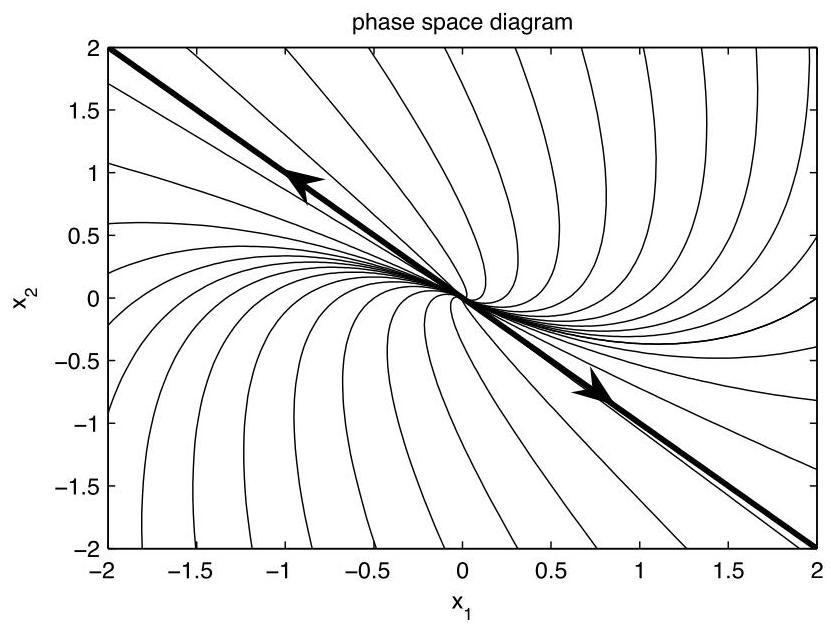
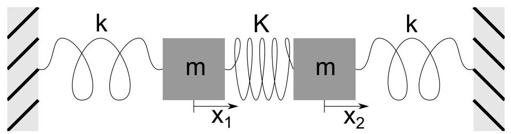
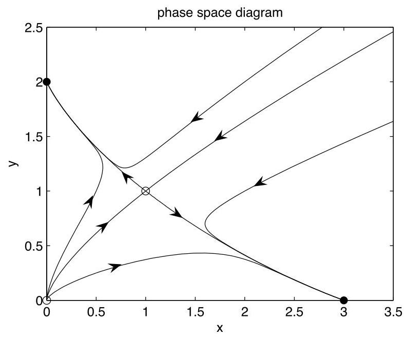
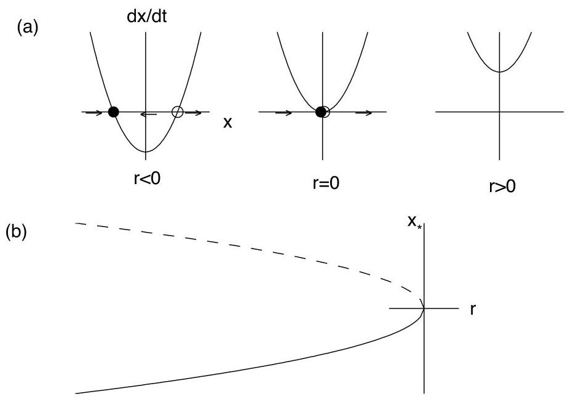

The equations in matrix form are

$$
\frac{d}{dt}\left( \begin{array}{l} {x}_{1} \\  {x}_{2} \end{array}\right)  = \left( \begin{array}{rr} 1 &  - 1 \\  1 & 3 \end{array}\right) \left( \begin{array}{l} {x}_{1} \\  {x}_{2} \end{array}\right) . \tag{6.13}
$$

The ansatz $\mathbf{x} = \mathbf{v}{e}^{\lambda t}$ leads to the characteristic equation

$$
0 = \det \left( {\mathbf{A} - \lambda \mathbf{I}}\right)
$$

$$
= {\lambda }^{2} - {4\lambda } + 4
$$

$$
= {\left( \lambda  - 2\right) }^{2}\text{.}
$$

Therefore, $\lambda  = 2$ is a repeated eigenvalue. The associated eigenvector is found from $- {v}_{1} - {v}_{2} = 0$ , or ${v}_{2} =  - {v}_{1}$ ; and normalizing with ${v}_{1} = 1$ , we have

$$
\lambda  = 2,\;\mathbf{v} = \left( \begin{array}{r} 1 \\   - 1 \end{array}\right) .
$$

We have thus found a single solution to the ode, given by

$$
{\mathbf{x}}_{\mathbf{1}}\left( t\right)  = {c}_{1}\left( \begin{array}{r} 1 \\   - 1 \end{array}\right) {e}^{2t},
$$

and we need to find the missing second solution to be able to satisfy the initial conditions. An ansatz of $t$ times the first solution is tempting, but will fail. Here, we will cheat and find the missing second solution by solving the equivalent second-order, homogeneous, constant-coefficient differential equation.

We already know that this second-order differential equation for ${x}_{1}\left( t\right)$ has a characteristic equation with a degenerate eigenvalue given by $\lambda  = 2$ . Therefore, the general solution for ${x}_{1}$ is given by

$$
{x}_{1}\left( t\right)  = \left( {{c}_{1} + t{c}_{2}}\right) {e}^{2t}.
$$

Since from the first differential equation, ${x}_{2} = {x}_{1} - {\dot{x}}_{1}$ , we compute

$$
{\dot{x}}_{1} = \left( {2{c}_{1} + \left( {1 + {2t}}\right) {c}_{2}}\right) {e}^{2t},
$$

so that

$$
{x}_{2} = {x}_{1} - {\dot{x}}_{1}
$$

$$
= \left( {{c}_{1} + t{c}_{2}}\right) {e}^{2t} - \left( {2{c}_{1} + \left( {1 + {2t}}\right) {c}_{2}}\right) {e}^{2t}
$$

$$
=  - {c}_{1}{e}^{2t} + {c}_{2}\left( {-1 - t}\right) {e}^{2t}\text{.}
$$

Combining our results for ${x}_{1}$ and ${x}_{2}$ , we have therefore found

$$
\left( \begin{array}{l} {x}_{1} \\  {x}_{2} \end{array}\right)  = {c}_{1}\left( \begin{array}{r} 1 \\   - 1 \end{array}\right) {e}^{2t} + {c}_{2}\left\lbrack  {\left( \begin{array}{r} 0 \\   - 1 \end{array}\right)  + \left( \begin{array}{r} 1 \\   - 1 \end{array}\right) t}\right\rbrack  {e}^{2t}.
$$

Our missing linearly independent solution is thus determined to be

$$
\mathbf{x}\left( t\right)  = {c}_{2}\left\lbrack  {\left( \begin{array}{r} 0 \\   - 1 \end{array}\right)  + \left( \begin{array}{r} 1 \\   - 1 \end{array}\right) t}\right\rbrack  {e}^{2t}. \tag{6.14}
$$

Figure 6.4: Phase space diagram for example with only one eigenvector.

The second term of (6.14) is just $t$ times the first solution; however, this is not sufficient. Indeed, the correct ansatz to find the second solution directly is given by

$$
\mathbf{x} = \left( {\mathbf{w} + t\mathbf{v}}\right) {e}^{\lambda t}, \tag{6.15}
$$

where $\lambda$ and $\mathbf{v}$ is the eigenvalue and eigenvector of the first solution, and $\mathbf{w}$ is an unknown vector to be determined. To illustrate this direct method, we substitute (6.15) into $\dot{\mathbf{x}} = \mathbf{{Ax}}$ , assuming $\mathbf{{Av}} = \lambda \mathbf{v}$ . Canceling the exponential, we obtain

$$
\mathbf{v} + \lambda \left( {\mathbf{w} + t\mathbf{v}}\right)  = \mathbf{A}\mathbf{w} + {\lambda t}\mathbf{v}.
$$

Further canceling the common term ${\lambda t}\mathbf{v}$ and rewriting yields

$$
\left( {\mathbf{A} - \lambda \mathbf{I}}\right) \mathbf{w} = \mathbf{v}. \tag{6.16}
$$

If $\mathbf{A}$ has only a single linearly independent eigenvector $\mathbf{v}$ , then (6.16) can be solved for $\mathbf{w}$ (otherwise, it cannot). Using $\mathbf{A},\lambda$ and $\mathbf{v}$ of our present example,(6.16) is the system of equations given by

$$
\left( \begin{array}{rr}  - 1 &  - 1 \\  1 & 1 \end{array}\right) \left( \begin{array}{l} {w}_{1} \\  {w}_{2} \end{array}\right)  = \left( \begin{array}{r} 1 \\   - 1 \end{array}\right)
$$

The first and second equation are the same, so that ${w}_{2} =  - \left( {{w}_{1} + 1}\right)$ . Therefore,

$$
\mathbf{w} = \left( \begin{matrix} {w}_{1} \\   - \left( {{w}_{1} + 1}\right)  \end{matrix}\right)
$$

$$
= {w}_{1}\left( \begin{array}{r} 1 \\   - 1 \end{array}\right)  + \left( \begin{array}{r} 0 \\   - 1 \end{array}\right)
$$

Notice that the first term repeats the first found solution, i.e., a constant times the eigenvector, and the second term is new. We therefore take ${w}_{1} = 0$ and obtain

$$
\mathbf{w} = \left( \begin{array}{r} 0 \\   - 1 \end{array}\right)
$$

as before.

The phase space diagram for this ode is shown in Fig. 6.4. The dark line is the single eigenvector $\mathbf{v}$ of the matrix $\mathbf{A}$ . When there is only a single eigenvector, the origin is called an improper node.

### 6.3 Normal modes

View tutorials on YouTube: Part 1 Part 2

We now consider an application of the eigenvector analysis to the coupled mass-spring system shown in Fig. 6.5. The position variables ${x}_{1}$ and ${x}_{2}$ are measured from the equilibrium positions of the masses. Hooke's law states that the spring force is linearly proportional to the extension length of the spring, measured from equilibrium. By considering the extension of the spring and the sign of the force, we write Newton’s law $F = {ma}$ separately for each mass:

$$
m{\ddot{x}}_{1} =  - k{x}_{1} - K\left( {{x}_{1} - {x}_{2}}\right) ,
$$

$$
m{\ddot{x}}_{2} =  - k{x}_{2} - K\left( {{x}_{2} - {x}_{1}}\right) .
$$

Further rewriting by collecting terms proportional to ${x}_{1}$ and ${x}_{2}$ yields

$$
m{\ddot{x}}_{1} =  - \left( {k + K}\right) {x}_{1} + K{x}_{2}
$$

$$
m{\ddot{x}}_{2} = K{x}_{1} - \left( {k + K}\right) {x}_{2}.
$$

The equations for the coupled mass-spring system form a system of two second-order linear homogeneous odes. In matrix form, $m\ddot{\mathbf{x}} = \mathbf{{Ax}}$ , or explicitly,

$$
m\frac{{d}^{2}}{d{t}^{2}}\left( \begin{array}{l} {x}_{1} \\  {x}_{2} \end{array}\right)  = \left( \begin{matrix}  - \left( {k + K}\right) & K \\  K &  - \left( {k + K}\right)  \end{matrix}\right) \left( \begin{array}{l} {x}_{1} \\  {x}_{2} \end{array}\right) . \tag{6.17}
$$

In analogy to a system of first-order equations, we try the ansatz $\mathbf{x} = \mathbf{v}{e}^{rt}$ , and upon substitution into (6.17) we obtain the eigenvalue problem $\mathbf{{Av}} = \lambda \mathbf{v}$ , with $\lambda  = m{r}^{2}$ . The eigenvalues are determined by solving the characteristic equation

$$
0 = \det \left( {\mathbf{A} - \lambda \mathbf{I}}\right)
$$

$$
= \left| \begin{matrix}  - \left( {k + K}\right)  - \lambda & K \\  K &  - \left( {k + K}\right)  - \lambda  \end{matrix}\right|
$$

$$
= {\left( \lambda  + k + K\right) }^{2} - {K}^{2}\text{.}
$$

The solution for $\lambda$ is

$$
\lambda  =  - k - K \pm  K,
$$

and the two eigenvalues are

$$
{\lambda }_{1} =  - k,\;{\lambda }_{2} =  - \left( {k + {2K}}\right) .
$$

The corresponding values of $r$ in our ansatz $\mathbf{x} = \mathbf{v}{e}^{rt}$ , with $r =  \pm  \sqrt{\lambda /m}$ , are

$$
{r}_{1} = i\sqrt{k/m},\;{\bar{r}}_{1},\;{r}_{2} = i\sqrt{\left( {k + {2K}}\right) /m},\;{\bar{r}}_{2}.
$$

Since the values of $r$ are pure imaginary, we know that ${x}_{1}\left( t\right)$ and ${x}_{2}\left( t\right)$ will oscillate with angular frequencies ${\omega }_{1} = \operatorname{Im}\left\{  {r}_{1}\right\}$ and ${\omega }_{2} = \operatorname{Im}\left\{  {r}_{2}\right\}$ , that is,

$$
{\omega }_{1} = \sqrt{k/m},\;{\omega }_{2} = \sqrt{\left( {k + {2K}}\right) /m}.
$$

The positions of the oscillating masses in general contain time dependencies of the form $\sin {\omega }_{1}t,\cos {\omega }_{1}t$ , and $\sin {\omega }_{2}t,\cos {\omega }_{2}t$ .

Figure 6.5: Coupled harmonic oscillators.

It is of further interest to determine the eigenvectors, or so-called normal modes of oscillation, associated with the two distinct angular frequencies. With specific initial conditions proportional to an eigenvector, the mass will oscillate with a single frequency. The eigenvector with eigenvalue ${\lambda }_{1}$ satisfies

$$
- K{v}_{11} + K{v}_{12} = 0
$$

so that ${v}_{11} = {v}_{12}$ . The normal mode with frequency ${\omega }_{1} = \sqrt{k/m}$ thus follows a motion where ${x}_{1} = {x}_{2}$ . Referring to Fig. 6.5, during this motion the center spring length does not change, which is why the frequency of oscillation is independent of $K$ .

Next, we determine the eigenvector with eigenvalue ${\lambda }_{2}$ :

$$
K{v}_{21} + K{v}_{22} = 0
$$

so that ${v}_{21} =  - {v}_{22}$ . The normal mode with frequency ${\omega }_{2} = \sqrt{\left( {k + {2K}}\right) /m}$ thus follows a motion where ${x}_{1} =  - {x}_{2}$ . Again referring to Fig. 6.5, during this motion the two equal masses symmetrically push or pull against each side of the middle spring.

A general solution for $\mathbf{x}\left( t\right)$ can be constructed from the eigenvalues and eigenvectors. Our ansatz was $\mathbf{x} = \mathbf{v}{e}^{rt}$ , and for each of two eigenvectors $\mathbf{v}$ , we have a pair of complex conjugate values for $r$ . Accordingly, we first apply the principle of superposition to obtain four real solutions, and then apply the principle again to obtain the general solution. With ${\omega }_{1} = \sqrt{k/m}$ and ${\omega }_{2} = \sqrt{\left( {k + {2K}}\right) /m}$ , the general solution is given by

$$
\left( \begin{array}{l} {x}_{1} \\  {x}_{2} \end{array}\right)  = \left( \begin{array}{l} 1 \\  1 \end{array}\right) \left( {A\cos {\omega }_{1}t + B\sin {\omega }_{1}t}\right)  + \left( \begin{array}{r} 1 \\   - 1 \end{array}\right) \left( {C\cos {\omega }_{2}t + D\sin {\omega }_{2}t}\right) ,
$$

where the now real constants $A, B, C$ , and $D$ can be determined from the four independent initial conditions, ${x}_{1}\left( 0\right) ,{x}_{2}\left( 0\right) ,{\dot{x}}_{1}\left( 0\right)$ , and ${\dot{x}}_{2}\left( 0\right)$ . 6.3. NORMAL MODES CHAPTER 6. SYSTEMS OF EQUATIONS Chapter 7

# Nonlinear differential equations and bifurcation theory

Reference: Strogatz, Sections 2.2, 2.4, 3.1, 3.2, 3.4, 6.3, 6.4, 8.2

We now turn our attention to nonlinear differential equations. In particular, we study how small changes in the parameters of a system can result in qualitative changes in the dynamics. These qualitative changes in the dynamics are called bifurcations. To understand bifurcations, we first need to understand the concepts of fixed points and stability.

### 7.1 Fixed points and stability

#### 7.1.1 One dimension

## View tutorial on YouTube

Consider the one-dimensional differential equation for $x = x\left( t\right)$ given by

$$
\dot{x} = f\left( x\right) . \tag{7.1}
$$

We say that ${x}_{ * }$ is a fixed point, or equilibrium point, of (7.1) if $f\left( {x}_{ * }\right)  = 0$ . At the fixed point, $\dot{x} = 0$ . The terminology fixed point is used since the solution to (7.1) with initial condition $x\left( 0\right)  = {x}_{ * }$ is $x\left( t\right)  = {x}_{ * }$ for all time $t$ .

A fixed point, however, can be stable or unstable. A fixed point is said to be stable if a small perturbation of the solution from the fixed point decays in time; it is said to be unstable if a small perturbation grows in time. We can determine stability by a linear analysis. Let $x = {x}_{ * } + \epsilon \left( t\right)$ , where $\epsilon$ represents a small perturbation of the solution from the fixed point ${x}_{ * }$ . Because ${x}_{ * }$ is a constant, $\dot{x} = \dot{\epsilon }$ ; and because ${x}_{ * }$ is a fixed point, $f\left( {x}_{ * }\right)  = 0$ . Taylor series expanding about $\epsilon  = 0$ , we have

$$
\dot{\epsilon } = f\left( {{x}_{ * } + \epsilon }\right)
$$

$$
= f\left( {x}_{ * }\right)  + \epsilon {f}^{\prime }\left( {x}_{ * }\right)  + \ldots
$$

$$
= \epsilon {f}^{\prime }\left( {x}_{ * }\right)  + \ldots
$$

The omitted terms in the Taylor series expansion are proportional to ${\epsilon }^{2}$ , and can be made negligible over a short time interval with respect to the kept term, proportional to $\epsilon$ , by taking $\epsilon \left( 0\right)$ sufficiently small. Therefore, at least over short times, the differential equation to be considered, $\dot{\epsilon } = {f}^{\prime }\left( {x}_{ * }\right) \epsilon$ , is linear and has by now the familiar solution

$$
\epsilon \left( t\right)  = \epsilon \left( 0\right) {e}^{{f}^{\prime }\left( {x}_{ * }\right) t}.
$$

The perturbation of the fixed point solution $x\left( t\right)  = {x}_{ * }$ thus decays exponentially if ${f}^{\prime }\left( {x}_{ * }\right)  < 0$ , and we say the fixed point is stable. If ${f}^{\prime }\left( {x}_{ * }\right)  > 0$ , the perturbation grows exponentially and we say the fixed point is unstable. If ${f}^{\prime }\left( {x}_{ * }\right)  = 0$ , we say the fixed point is marginally stable, and the next higher-order term in the Taylor series expansion must be considered.

## Example: 

Find all the fixed points of the logistic equation $\dot{x} = x\left( {1 - x}\right)$ and determine their stability.

There are two fixed points at which $\dot{x} = 0$ , given by

 ${x}_{ * } = 0$ and ${x}_{ * } = 1$ . 

Stability of these equilibrium points may be determined by considering the derivative of $f\left( x\right)  = x\left( {1 - x}\right)$ . We have ${f}^{\prime }\left( x\right)  = 1 - {2x}$ . Therefore, ${f}^{\prime }\left( 0\right)  = 1 > 0$ so that 

${x}_{ * } = 0$ is an unstable fixed point

, and ${f}^{\prime }\left( 1\right)  =  - 1 < 0$ so that 

${x}_{ * } = 1$ is a stable fixed point.

 Indeed, we have previously found that all solutions approach the stable fixed point asymptotically.

#### 7.1.2 Two dimensions

## View tutorial on YouTube

The idea of fixed points and stability can be extended to higher-order systems of odes. Here, we consider a two-dimensional system and will need to make use of the two-dimensional Taylor series expansion of a function $F\left( {x, y}\right)$ about the origin. In general, the Taylor series of $F\left( {x, y}\right)$ is given by

$$
F\left( {x, y}\right)  = F + x\frac{\partial F}{\partial x} + y\frac{\partial F}{\partial y} + \frac{1}{2}\left( {{x}^{2}\frac{{\partial }^{2}F}{\partial {x}^{2}} + {2xy}\frac{{\partial }^{2}F}{\partial x\partial y} + {y}^{2}\frac{{\partial }^{2}F}{\partial {y}^{2}}}\right)  + \ldots ,
$$

where the function $F$ and all of its partial derivatives on the right-hand-side are evaluated at the origin. Note that the Taylor series is constructed so that all partial derivatives of the left-hand-side match those of the right-hand-side at the origin.

We now consider the two-dimensional system given by

$$
\dot{x} = f\left( {x, y}\right) ,\;\dot{y} = g\left( {x, y}\right) . \tag{7.2}
$$

The point $\left( {{x}_{ * },{y}_{ * }}\right)$ is said to be a fixed point of (7.2) if $f\left( {{x}_{ * },{y}_{ * }}\right)  = 0$ and $g\left( {{x}_{ * },{y}_{ * }}\right)  = 0$ . Again, the local stability of a fixed point can be determined by a linear analysis. We let $x\left( t\right)  = {x}_{ * } + \epsilon \left( t\right)$ and $y\left( t\right)  = {y}_{ * } + \delta \left( t\right)$ , where $\epsilon$ and $\delta$ are small independent perturbations from the fixed point. Making use of the two dimensional Taylor series of $f\left( {x, y}\right)$ and $g\left( {x, y}\right)$ about the fixed point, or equivalently about $\left( {\epsilon ,\delta }\right)  = \left( {0,0}\right)$ , we have

$$
\dot{\epsilon } = f\left( {{x}_{ * } + \epsilon ,{y}_{ * } + \delta }\right)
$$

$$
= f + \epsilon \frac{\partial f}{\partial x} + \delta \frac{\partial f}{\partial y} + \ldots
$$

$$
= \epsilon \frac{\partial f}{\partial x} + \delta \frac{\partial f}{\partial y} + \ldots
$$

$$
\dot{\delta } = g\left( {{x}_{ * } + \epsilon ,{y}_{ * } + \delta }\right)
$$

$$
= g + \epsilon \frac{\partial g}{\partial x} + \delta \frac{\partial g}{\partial y} + \ldots
$$

$$
= \epsilon \frac{\partial g}{\partial x} + \delta \frac{\partial g}{\partial y} + \ldots ,
$$

where in the Taylor series $f, g$ and all their partial derivatives are evaluated at the fixed point $\left( {{x}_{ * },{y}_{ * }}\right)$ . Neglecting higher-order terms in the Taylor series, we thus have a system of odes for the perturbation, given in matrix form as

$$
\frac{d}{dt}\left( \begin{array}{l} \epsilon \\  \delta  \end{array}\right)  = \left( \begin{array}{ll} \frac{\partial f}{\partial x} & \frac{\partial f}{\partial y} \\  \frac{\partial g}{\partial x} & \frac{\partial g}{\partial y} \end{array}\right) \left( \begin{array}{l} \epsilon \\  \delta  \end{array}\right) . \tag{7.3}
$$

Figure 7.1: Phase space plot for two-dimensional nonlinear system.

The two-by-two matrix in (7.3) is called the Jacobian matrix at the fixed point. An eigenvalue analysis of the Jacobian matrix will typically yield two eigenvalues ${\lambda }_{1}$ and ${\lambda }_{2}$ . These eigenvalues may be real and distinct, complex conjugate pairs, or repeated. The fixed point is stable (all perturbations decay exponentially) if both eigenvalues have negative real parts. The fixed point is unstable (some perturbations grow exponentially) if at least one of the eigenvalues has a positive real part. Fixed points can be further classified as stable or unstable nodes, unstable saddle points, stable or unstable spiral points, or stable or unstable improper nodes.

Example: 

Find all the fixed points of the nonlinear system $\dot{x} = x\left( {3 - x - {2y}}\right)$ , $\dot{y} = y\left( {2 - x - y}\right)$ , and determine their stability.

View tutorial on YouTube

The fixed points are determined by solving

$$
f\left( {x, y}\right)  = x\left( {3 - x - {2y}}\right)  = 0,\;g\left( {x, y}\right)  = y\left( {2 - x - y}\right)  = 0.
$$

Evidently, $\left( {x, y}\right)  = \left( {0,0}\right)$ is a fixed point. On the one hand, if only $x = 0$ , then the equation $g\left( {x, y}\right)  = 0$ yields $y = 2$ . On the other hand, if only $y = 0$ , then the equation $f\left( {x, y}\right)  = 0$ yields $x = 3$ . If both $x$ and $y$ are nonzero, then we must solve the linear system

$$
x + {2y} = 3,\;x + y = 2,
$$

and the solution is easily found to be $\left( {x, y}\right)  = \left( {1,1}\right)$ . Hence, we have determined the four fixed points 

$\left( {{x}_{ * },{y}_{ * }}\right)  = \left( {0,0}\right) ,\left( {0,2}\right) ,\left( {3,0}\right) ,\left( {1,1}\right)$ 

. The Jacobian matrix is given by

$$
\left( \begin{matrix} \frac{\partial f}{\partial x} & \frac{\partial f}{\partial y} \\  \frac{\partial g}{\partial x} & \frac{\partial g}{\partial y} \end{matrix}\right)  = \left( \begin{matrix} 3 - {2x} - {2y} &  - {2x} \\   - y & 2 - x - {2y} \end{matrix}\right) .
$$

Stability of the fixed points may be considered in turn. With ${\mathbf{J}}_{ * }$ the Jacobian matrix evaluated at the fixed point, we have

$$
\left( {{x}_{ * },{y}_{ * }}\right)  = \left( {0,0}\right)  : \;{\mathbf{J}}_{ * } = \left( \begin{array}{ll} 3 & 0 \\  0 & 2 \end{array}\right) .
$$

The eigen values of ${\mathbf{J}}_{ * }$ are $\lambda  = 3,2$ so that

 the fixed point(0,0)is an unstable node. 

Next,

$$
\left( {{x}_{ * },{y}_{ * }}\right)  = \left( {0,2}\right)  : \;{\mathbf{J}}_{ * } = \left( \begin{array}{rr}  - 1 & 0 \\   - 2 &  - 2 \end{array}\right) .
$$

The eigen values of ${\mathbf{J}}_{ * }$ are $\lambda  =  - 1, - 2$ so that

  the fixed point(0,2)is a stable node.

Next,

$$
\left( {{x}_{ * },{y}_{ * }}\right)  = \left( {3,0}\right)  : \;{\mathbf{J}}_{ * } = \left( \begin{array}{rr}  - 3 &  - 6 \\  0 &  - 1 \end{array}\right) .
$$

The eigen values of ${\mathbf{J}}_{ * }$ are $\lambda  =  - 3, - 1$ so that 

the fixed point(3,0)is also a stable node.

Finally,

$$
\left( {{x}_{ * },{y}_{ * }}\right)  = \left( {1,1}\right)  : \;{\mathbf{J}}_{ * } = \left( \begin{matrix}  - 1 &  - 2 \\   - 1 &  - 1 \end{matrix}\right) .
$$

The characteristic equation of ${\mathbf{J}}_{ * }$ is given by ${\left( -1 - \lambda \right) }^{2} - 2 = 0$ , so that $\lambda  =  - 1 \pm  \sqrt{2}$ . Since one eigenvalue is negative and the other positive 

the fixed point(1,1)is an unstable saddle point.

From our analysis of the fixed points, one can expect that all solutions will asymptote to one of the stable fixed points(0,2)or(3,0), depending on the initial conditions.

It is of interest to sketch the phase space diagram for this nonlinear system. The eigenvectors associated with the unstable saddle point(1,1)determine the directions of the flow into and away from this fixed point. The eigenvector associated with the positive eigenvalue ${\lambda }_{1} =  - 1 + \sqrt{2}$ can be determined from the first equation of $\left( {{\mathbf{J}}_{ * } - {\lambda }_{1}\mathbf{I}}\right) {\mathbf{v}}_{\mathbf{1}} = 0$ , or

$$
- \sqrt{2}{v}_{11} - 2{v}_{12} = 0
$$

so that ${v}_{12} =  - \left( {\sqrt{2}/2}\right) {v}_{11}$ . The eigenvector associated with the negative eigenvalue ${\lambda }_{1} =  - 1 - \sqrt{2}$ satisfies ${v}_{22} = \left( {\sqrt{2}/2}\right) {v}_{21}$ . The eigenvectors give the slope of the lines with origin at the fixed point for incoming (negative eigenvalue) and outgoing (positive eigenvalue) trajectories. The outgoing trajectories have negative slope $- \sqrt{2}/2$ and the incoming trajectories have positive slope $\sqrt{2}/2$ . A rough sketch of the phase space diagram can be made by hand (as demonstrated in class). Here, a computer generated plot obtained from numerical solution of the nonlinear coupled odes is presented in Fig. 7.1. The curve starting from the origin and at infinity, and terminating at the unstable saddle point is called the separatrix. This curve separates the phase space into two regions: initial conditions for which the solution asymptotes to the fixed point(0,2), and initial conditions for which the solution asymptotes to the fixed point(3,0).

Figure 7.2: Saddlenode bifurcation. (a) $\dot{x}$ versus $x$ ; (b) bifurcation diagram.

### 7.2 One-dimensional bifurcations

A bifurcation occurs in a nonlinear differential equation when a small change in a parameter results in a qualitative change in the long-time solution. Examples of bifurcations are when fixed points are created or destroyed, or change their stability.

We now consider four classic bifurcations of one-dimensional nonlinear differential equations: saddle-node bifurcation, transcritical bifurcation, supercritical pitchfork bifurcation, and subcritical pitchfork bifurcation. The corresponding differential equation will be written as

$$
\dot{x} = {f}_{r}\left( x\right) ,
$$

where the subscript $r$ represents a parameter that results in a bifurcation when varied across zero. The simplest differential equations that exhibit these bifurcations are called the normal forms, and correspond to a local analysis (i.e., Taylor series expansion) of more general differential equations around the fixed point, together with a possible rescaling of $x$ .

#### 7.2.1 Saddle-node bifurcation

View tutorial on YouTube

The saddle-node bifurcation results in fixed points being created or destroyed. The normal form for a saddle-node bifurcation is given by

$$
\dot{x} = r + {x}^{2}.
$$

The fixed points are ${x}_{ * } =  \pm  \sqrt{-r}$ . Clearly, two real fixed points exist when $r < 0$ and no real fixed points exist when $r > 0$ . The stability of the fixed points when