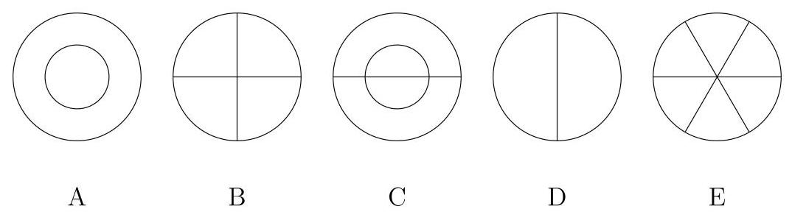

## Math 520, Spring 2021, Final Exam

## NAME:

1. Find the solution of the non-homogeneous heat equation

$$
{u}_{t} = 2{u}_{xx} + {e}^{-t}\sin x,
$$

for $0 < x < \pi , t > 0$ with the boundary conditions

$$
u\left( {0, t}\right)  = u\left( {\pi , t}\right)  = 0,\;t > 0,
$$

and the initial condition

$$
u\left( {x,0}\right)  = \sin x + \sin \left( {2x}\right) ,\;0 < x < \pi .
$$

Solution. The associated eigenvalue problem ${y}^{\prime \prime } + {\lambda y} = 0, y\left( 0\right)  = y\left( \pi \right)  = 0$ has eigenvalues $\lambda  = {n}^{2}$ and eigenfunctions $\sin {nx}, n = 1,2,\ldots$ . So we look for a solution in the form

$$
u\left( {x, t}\right)  = \mathop{\sum }\limits_{1}^{\infty }{c}_{n}\left( t\right) \sin {nx}.
$$

Plugging this to the equation and using the initial condition, we obtain ordinary differential equations for $n = 1, n = 2$ and $n \geq  3$ :

$$
{c}_{1}^{\prime } =  - 2{c}_{1} + {e}^{-t},\;{c}_{1}\left( 0\right)  = 1,
$$

$$
{c}_{2}^{\prime } =  - 8{c}_{2},\;{c}_{2}\left( 0\right)  = 1,
$$

$$
{c}_{n}^{\prime } =  - 2{n}^{2}{c}_{n},\;{c}_{n}\left( 0\right)  = 0,\;n \geq  3.
$$

The first one has solution ${e}^{-t}$ , the second ${e}^{-{8t}}$ and the third ${c}_{n}\left( t\right)  = 0$ . Thus the solution of the original problem is

$$
u\left( {x, t}\right)  = {e}^{-t}\sin x + {e}^{-{8t}}\sin {2x},
$$

which can be checked by substitution.

2. Find Fourier transforms of the following functions. The answer should be explicit and not contain any integrals or convolutions.

a) $f\left( x\right)  = x{e}^{-4{x}^{2}}$ ,

b) $f\left( x\right)  = \frac{\cos x}{4 + {x}^{2}}$ .

Solution. a) Using entry 9 of the Table of Fourier transforms with $a = 8$

we obtain

$$
F\left\lbrack  {e}^{-4{x}^{2}}\right\rbrack   = \sqrt{\frac{\pi }{4}}{e}^{-{s}^{2}/{16}}.
$$

Using entry 6 of the same table:

$$
F\left\lbrack  {x{e}^{-4{x}^{2}}}\right\rbrack   = i\sqrt{\frac{\pi }{4}}\frac{d}{ds}{e}^{-{s}^{2}/{16}} =  - \frac{{is}\sqrt{\pi }}{16}{e}^{-{s}^{2}/{16}}.
$$

b) Using entry 10 of the same tables with $a = 2$ ,

$$
F\left\lbrack  {1/\left( {{x}^{2} + 4}\right) }\right\rbrack   = \frac{\pi }{2}{e}^{-2\left| s\right| }.
$$

Then we write $\cos x = \left( {{e}^{ix} + {e}^{-{ix}}}\right) /2$ , and use entry 3 with $c =  \pm  1$ :

$$
F\left\lbrack  {\cos x/\left( {{x}^{2} + 4}\right) }\right\rbrack   = \frac{\pi }{4}\left( {{e}^{-2\left| {s - 1}\right| } + {e}^{-2\left| {s + 1}\right| }}\right) .
$$

3. The following pictures represent nodal lines of some five modes of oscillation of a round membrane with clamped boundary. The out-most circle is the boundary of the membrane.

$$
{u}_{tt} = {c}^{2}{\Delta u},\;{x}^{2} + {y}^{2} < R,\;t > 0,
$$

with the boundary conditions

$$
u\left( {x, y, t}\right)  = 0,\;\text{ for }\;{x}^{2} + {y}^{2} = R, t > 0.
$$

Order these pictures in the increasing order of frequencies of oscillations.

You may find the table of small zeros of Bessel functions useful (each row lists the smallest zeros of ${J}_{m}$ in increasing order):

${J}_{0}$ : 2.404825558,5.520078110,8.653727913,11.79153444,14.93091771,

${J}_{1} : {3.831705970},{7.015586670},{10.17346814},{13.32369194},{16.47063005}$ ,

${J}_{2}$ : 5.135622302, 8.417244140, 11.61984117, 14.79595178, 17.95981949,

${J}_{3}$ : 6.380161896,9.761023130,13.01520072,16.22346616,19.40941523,

Answer: D, B, A, E, C.

Justification. Oscillations are described by the wave equation. Using polar coordinates we have

$$
{u}_{tt} = {c}^{2}\left( {{u}_{rr} + \frac{1}{r}{u}_{r} + \frac{1}{{r}^{2}}{u}_{\theta \theta }}\right) ,\;u\left( {R,\theta , t}\right)  = 0.
$$

Looking for solutions of the form $u\left( {r,\theta , t}\right)  = v\left( {r,\theta }\right) {e}^{i\omega t}$ , we obtain

$$
{v}_{rr} + \frac{1}{r}{v}_{r} + \frac{1}{{r}^{2}}{v}_{\theta \theta } + \frac{{\omega }^{2}}{{c}^{2}}v = 0.
$$

Writing $v\left( {r,\theta }\right)  = f\left( r\right) g\left( \theta \right)$ , we separate the variables, and obtain

$$
{g}^{\prime \prime } + {m}^{2}g = 0,\;\text{with}{2\pi }\text{- periodic boundary conditions,}
$$

and

$$
{r}^{2}{f}_{m}^{\prime \prime } + r{f}_{m}^{\prime } + \left( {{\left( \omega /c\right) }^{2}{r}^{2} - {m}^{2}}\right) {f}_{m} = 0,
$$

with the foundary condition $\left| {{f}_{0}\left( 0\right) }\right|$ is finite, and ${f}_{m}\left( 0\right)  = 0$ for $m \geq  1$ , and ${f}_{m}\left( R\right)  = 0$ . The boundary value problem for $g$ implies that $m$ is an integer, and the equation in $r$ is reduced wo the Bessel equarion: ${f}_{m}\left( r\right)  = {J}_{m}\left( {{\omega r}/c}\right)$ , and the boundary conditions give

$$
{\omega }_{m, k} = c{x}_{m, k}/R
$$

where ${x}_{m, k}$ is the $k$ -th zero of the $m$ -th Bessel function. Since the(m, k)-mode is

$$
{v}_{m, k}\left( {r,\theta }\right)  = {J}_{m}\left( {{\omega }_{k}r/c}\right) \left( {{a}_{m, k}\cos \left( {m\theta }\right)  + {b}_{m, k}\sin \left( {m\theta }\right) }\right)
$$

its zero set has $m$ radial lines and $k$ circles (including the boundary circle).

Thus the numbers(m, k)and zeros of the Bessel functions corresponding to the pictures are the following:

A: $\left( {0,2}\right) ,{x}_{0,2} \approx  {5.5}$ ,

B: $\left( {2,1}\right) ,{x}_{2,1} \approx  {5.13}$ ,

C: $\left( {1,2}\right) ,{x}_{1,2} \approx  {7.0}$ ,

D: $\left( {1,1}\right) ,{x}_{1,1} \approx  {3.8}$ ,

E: $\left( {3,1}\right) ,{x}_{3,1} \approx  {6.4}$ .

and the order is $\mathrm{D},\mathrm{B},\mathrm{A},\mathrm{E},\mathrm{C}$ .

4. Find a bounded solution of the Laplace equation in polar coordinates

$$
{u}_{rr} + \frac{1}{r}{u}_{r} + \frac{1}{{r}^{2}}{u}_{\theta \theta } = 0
$$

in the half-disk $0 < r < 1,0 < \theta  < \pi$ with the boundary conditions

$$
u\left( {r,0}\right)  = u\left( {r,\pi }\right)  = 0,\;0 < r < 1,
$$

$$
u\left( {1,\theta }\right)  + {u}_{r}\left( {1,\theta }\right)  = \sin \theta .
$$

Solution. Let $u\left( {r,\theta }\right)  = f\left( r\right) g\left( \theta \right)$ . Then

$$
{r}^{2}\frac{{f}^{\prime \prime }}{f} + r\frac{{f}^{\prime }}{f} =  - \frac{{g}^{\prime \prime }}{g} =  : {m}^{2}.
$$

In the variable $\theta$ we obtain

$$
{g}^{\prime \prime } + {m}^{2}g = 0,
$$

with boundary conditions $g\left( 0\right)  = g\left( \pi \right)  = 0$ . This implies that $m = 1,2,\ldots$ and ${g}_{m}\left( \theta \right)  = \sin {m\theta }$ .

For the $r$ variable we have

$$
{r}^{2}{f}_{m}^{\prime \prime } + r{f}_{m}^{\prime } - {m}^{2}{f}_{m} = 0,
$$

which is Euler's equation with characteristic equation

$$
\rho \left( {\rho  - 1}\right)  + \rho  - {m}^{2} = 0,
$$

so two the general solution is

$$
{f}_{m}\left( r\right)  = {a}_{m}{r}^{-m} + {b}_{m}{r}^{m}.
$$

Using the boundary conditions that ${f}_{m}\left( 0\right)$ is finite, we obtain

$$
u\left( {r,\theta }\right)  = \mathop{\sum }\limits_{1}^{\infty }{b}_{m}{r}^{m}\sin {m\theta }.
$$

Using the other boundary condition, we obtain

$$
u\left( {1,\theta }\right)  + {u}_{r}\left( {1,\theta }\right)  = \mathop{\sum }\limits_{1}^{\infty }\left( {{b}_{m} + m{b}_{m}}\right) \sin \left( {m\theta }\right)  = \sin \theta .
$$

It follows that ${b}_{1} = 1/2$ and ${b}_{m} = 0$ for $m \geq  2$ . So the solution is $u\left( {r,\theta }\right)  =$ $\left( {1/2}\right) r\sin \theta$ .

5. For the equation

$$
{u}_{tt} + 2{u}_{t} + u = {u}_{xx},\;0 < x < 1,\;t > 0 \tag{1}
$$

with the boundary conditions

$$
{u}_{x}\left( {0, t}\right)  = {u}_{x}\left( {1, t}\right)  = 0, \tag{2}
$$

a) Separate the variables and state the boundary value problem in the $x$ variable.

b) Solve this boundary problem in the $x$ variable (find eigenvalues and eigen-functions).

c) Write the general solution of equation (1) satisfying the boundary conditions.

d) Describe with words the behavior of solutions as $t \rightarrow  \infty$ : do they tend to some limit, do they oscillate (change sign infinitely often)? If they oscillate, what are the frequencies of oscillations?

Solution. a) Plugging $u\left( {x, t}\right)  = X\left( x\right) T\left( t\right)$ , we obtain

$$
\frac{{T}^{\prime \prime }}{T} + 2\frac{{T}^{\prime }}{T} + 1 = \frac{{X}^{\prime \prime }}{X}
$$

Since one side is independent of $t$ and the other side is independent of $x$ , both must be constant, say $\lambda$ . Then for the $x$ -part we obtain

$$
{X}^{\prime \prime } - {\lambda X} = 0,\;{X}^{\prime }\left( 0\right)  = {X}^{\prime }\left( 1\right)  = 0.
$$

b) $\lambda  =  - {\left( \pi n\right) }^{2},\;n = 1,2,\ldots ;{X}_{n} = \cos {\pi nx}$ .

c) For the $t$ part:

$$
{T}^{\prime \prime } + 2{T}^{\prime } + \left( {1 + {\left( \pi n\right) }^{2}}\right) T = 0,
$$

this is a linear ODE with constant coefficients. The characteristic equation is

$$
{\rho }^{2} + {2\rho } + 1 + {\left( \pi n\right) }^{2} = 0,
$$

whose solitions are

$$
{\rho }_{1,2} =  - 1 \pm  \sqrt{1 - \left( {1 + {\left( \pi n\right) }^{2}}\right) } =  - 1 \pm  {i\pi n}.
$$

So the general solution of our equation satisfying the boundary conditions is

$$
u\left( {x, t}\right)  = \mathop{\sum }\limits_{{n = 1}}^{\infty }{e}^{-t}\left( {{a}_{n}\cos \left( {\pi nt}\right)  + {b}_{n}\sin \left( {\pi nt}\right) }\right) \cos \left( {\pi nx}\right) .
$$

d) As $t \rightarrow  \infty$ it tends to zero, because of the exponential factor, while oscillating with frequencies ${\pi n}$ .

6. Which of the following statements are true? Please give some justification: if true, explain why, if false give a counterexample:

$$
\text{a)}{L}^{1}\left( \mathbf{R}\right)  \subset  {L}^{2}\left( \mathbf{R}\right) \text{.}
$$

$$
\text{b)}{L}^{2}\left( \mathbf{R}\right)  \subset  {L}^{1}\left( \mathbf{R}\right) \text{.}
$$

c) All bounded functions from the space ${L}^{1}\left( \mathbf{R}\right)$ belong to ${L}^{2}\left( \mathbf{R}\right)$

d) All bounded functions from the space ${L}^{2}\left( \mathbf{R}\right)$ belong to ${L}^{1}\left( \mathbf{R}\right)$ .

e) There are no periodic functions in ${L}^{2}\left( \mathbf{R}\right)$ , except the zero function.

Solution.

a) False. Example: $f\left( x\right)  = 1/\left( {\left( {1 + {x}^{2}}\right) \sqrt{x}}\right)$ in in ${L}^{1}$ but not in ${L}^{2}$ .

b) False. Example: $f\left( x\right)  = x/\left( {1 + {x}^{2}}\right)$ is in ${L}^{2}$ but not in ${L}^{1}$ .

c) True. If $\left| {f\left( x\right) }\right|  \leq  M$ then $\int {\left| f\left( x\right) \right| }^{2}{dx} \leq  M\int \left| {f\left( x\right) }\right| {dx}$ .

d) False. Same example as in b).

e) True. If $f$ has period $T$ and is not the zero function, then ${\int }_{0}^{T}{\left| f\left( x\right) \right| }^{2}\left( x\right) {dx} >$ 0, thus ${\int }_{-\infty }^{\infty }{\left| f\left( x\right) \right| }^{2}{dx} =  + \infty$ .

7. Consider the differential equation

$$
\left( {1 - {x}^{2}}\right) {y}^{\prime \prime } - {2x}{y}^{\prime } + {\lambda y} = 0,\; - 1 < x < 1,
$$

where $y$ is a function of $x$ , and $\lambda$ is a real parameter.

Which of the following statements are true? No justification is necessary.

a) For every $\lambda$ , all solutions are bounded on(-1,1).

b) For some $\lambda$ , all solutions are bounded on(-1,1).

c) For some $\lambda$ , there is a bounded solution on(-1,1), other than the zero solution.

d) For every $\lambda$ , there is a non-zero solution which is bounded on(0,1).

e) For every $\lambda$ , there is a non-zero solution which is bounded on(-1,1).

Solution. a), b), e) are false; c), d) are true.

Explanation. This is a Legendre equation. It has two singular points, 1 and -1 . Since the change of the variable $y \mapsto   - x$ transforms the equation into itself, it is sufficient to investigate one of them, for example $x = 1$ . To compare our equation with Euler's equation we rewrite it in the form

$$
{\left( x - 1\right) }^{2}{y}^{\prime \prime } + \frac{2x}{x + 1}\left( {x - 1}\right) {y}^{\prime } - \frac{\lambda \left( {x - 1}\right) }{x + 1}y = 0.
$$

So the corresponding Euler equation is

$$
{\left( x - 1\right) }^{2}{y}^{\prime \prime } + \left( {x - 1}\right) {y}^{\prime } = 0,
$$

and the characteristic equation is ${\rho }^{2} = 0$ . So two linearly independent solutions of the Euler equation are ${y}_{1}\left( x\right)  = 1$ and ${y}_{2}\left( x\right)  = \log \left( {x - 1}\right)$ . One of them is unbounded. It follows from the general theory that solutions of the original equation behave near the singular ponts behave in the same way. So a), b) are false while d) is true. For c), we can take $\lambda  = n\left( {n + 1}\right)$ where $n$ is an integer, then Legendre's polynomials are solutions which are bounded on(-1,1). Finally e) is false since the eigenvalues of the boundary value problem for our equation with the boundary condition that $y$ is bounded on both ends are only $\lambda  = n\left( {n + 1}\right)$ , where $n$ is an integer.