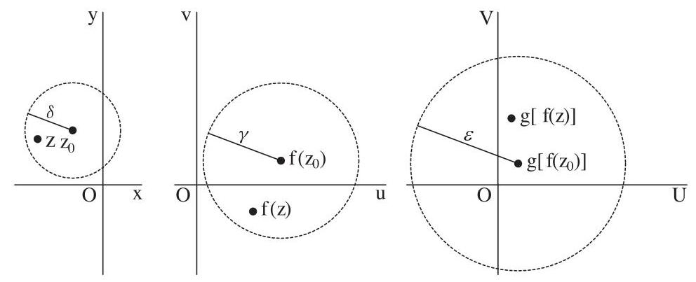
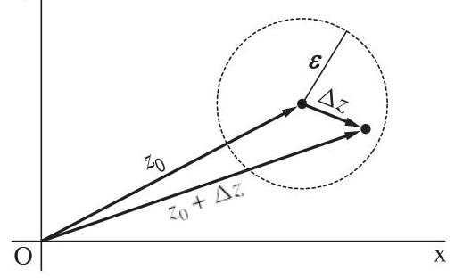
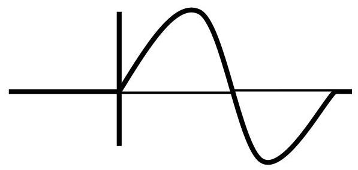
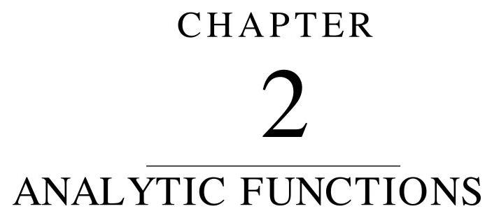

Question: Let R consists of set of all points ’ $z$ ’ such that $0 < \left| z\right|  \leq  1$ and

$f\left( z\right)  = {z}^{2}$ . Verify that function is uniformly continuous.

Solution: Given that $\mathrm{f}\left( \mathrm{z}\right)  = {\mathrm{z}}^{2},0 < \left| z\right|  \leq  1$ and ${\mathrm{z}}_{1},{\mathrm{z}}_{2} \in  \mathrm{R}$ then

$0 < \left| {\mathrm{z}}_{1}\right|  \leq  1\;,\;0 < \left| {\mathrm{z}}_{2}\right|  \leq  1$

Consider $\left| {f\left( {\mathrm{z}}_{1}\right)  - f\left( {\mathrm{z}}_{2}\right) }\right|  = \left| {{{\mathrm{z}}_{1}}^{2} - {{\mathrm{z}}_{2}}^{2}}\right|  = \left| {\left( {{\mathrm{z}}_{1} - {\mathrm{z}}_{2}}\right) \left( {{\mathrm{z}}_{1} + {\mathrm{z}}_{2}}\right) }\right|  = \left| {{\mathrm{z}}_{1} - {\mathrm{z}}_{2}}\right| \left| {{\mathrm{z}}_{1} + {\mathrm{z}}_{2}}\right|$

Since $0 < \left| {\mathrm{z}}_{1}\right|  \leq  1,0 < \left| {\mathrm{z}}_{1}\right|  \leq  1$ therefor

$\left| {f\left( {\mathrm{z}}_{1}\right)  - f\left( {\mathrm{z}}_{2}\right) }\right|  \leq  2\left| {{\mathrm{z}}_{1} - {\mathrm{z}}_{2}}\right| \;\therefore \left| {{\mathrm{z}}_{1} + {\mathrm{z}}_{2}}\right|  = \left| {1 + 1}\right|  = 2$

$\left| {f\left( {\mathrm{z}}_{1}\right)  - f\left( {\mathrm{z}}_{2}\right) }\right|  \leq  {2\delta }\;$ Whenever $\;\left| {{\mathrm{z}}_{1} - {\mathrm{z}}_{2}}\right|  < \delta  = \frac{\epsilon }{2}$

$\left| {f\left( {\mathrm{z}}_{1}\right)  - f\left( {\mathrm{z}}_{2}\right) }\right|  < 2 \cdot  \frac{\epsilon }{2}\;$ Whenever $\left| {{\mathrm{z}}_{1} - {\mathrm{z}}_{2}}\right|  < \delta  = \frac{\epsilon }{2}$

$\left| {f\left( {\mathrm{z}}_{1}\right)  - f\left( {\mathrm{z}}_{2}\right) }\right|  < \epsilon \;\mathrm{{Whenever}}\;\left| {{\mathrm{z}}_{1} - {\mathrm{z}}_{2}}\right|  < \delta$

$f\left( z\right)  = {z}^{2}$ is uniformly continuous on $R$

Note that in expression $\left| {f\left( {\mathrm{z}}_{1}\right)  - f\left( {\mathrm{z}}_{2}\right) }\right|  \leq  2\left| {{\mathrm{z}}_{1} - {\mathrm{z}}_{2}}\right|$ equality will hold when

$\left| {\mathrm{z}}_{1}\right|  = 1,\left| {\mathrm{z}}_{2}\right|  = 1$ .

Exercise 16: Show that given functions are uniformly continuous at $\mathrm{z} = {\mathrm{z}}_{0}$ or not?

i. $f\left( z\right)  = \frac{1}{z}$ in the region $\left| \mathrm{z}\right|  < 1$ (not continuous)

ii. $f\left( z\right)  = {z}^{2} - 1$ in the region $\left| \mathrm{z}\right|  \leq  4$

Theorem: A composition of continuous functions is itself continuous.

Proof: Suppose that $g\left\lbrack  {f\left( z\right) }\right\rbrack$ be a continuous function defined for all $f\left( z\right)$ in the Neighborhood of $f\left( {z}_{0}\right)$ then by definition;(i)Similarly suppose that $f\left( z\right)$ be a continuous function defined for all $z$ in the Neighborhood of ${z}_{0}$ then by definition;

$\left| {f\left( z\right)  - f\left( {z}_{0}\right) }\right|  < \gamma$(ii)

Combining (i) and (ii)

$\left| {g\left\lbrack  {f\left( z\right) }\right\rbrack   - g\left\lbrack  {f\left( {z}_{0}\right) }\right\rbrack  }\right|  < \epsilon \;\mathrm{{whenever}}\;\left| {z - {z}_{0}}\right|  < \delta$

Hence composition of continuous functions is itself continuous. Theorem: If a function $f\left( z\right)$ is continuous and nonzero at a point ${z}_{0}$ , Then $f\left( z\right)  \neq  0$ throughout some neighborhood of that point.

Proof: Suppose that function $f\left( z\right)$ is continuous and nonzero at a point ${z}_{0}$ , and $f\left( z\right)  = 0$ throughout some neighborhood of that point. Then by definition of continuity

$\left| {f\left( z\right)  - f\left( {z}_{0}\right) }\right|  < \epsilon \;$ whenever $\;\left| {z - {z}_{0}}\right|  < \delta$

take $\epsilon  = \frac{\left| f\left( {z}_{0}\right) \right| }{2}$ and $f\left( z\right)  = 0$ then

$\left| {f\left( {z}_{0}\right) }\right|  < \frac{\left| f\left( {z}_{0}\right) \right| }{2}\;$ whenever $\;\left| {z - {z}_{0}}\right|  < \delta$ Which is contradiction.

Hence If a function $f\left( z\right)$ is continuous and non-zero at a point ${z}_{0}$ ,

Then $f\left( z\right)  \neq  0$ throughout some neighborhood of that point.

Theorem: If a function $f\left( z\right)$ is continuous throughout a region $R$ that is Both closed and bounded. Then there exist a non-negative real number M such that $\left| {f\left( \mathrm{z}\right) }\right|  \leq  M$ for all point ’ $z$ ’ in $R$ .

Proof: Suppose that function $f\left( z\right)  = u\left( {x, y}\right)  + {iv}\left( {x, y}\right)$ is continuous. Then $\left| {f\left( z\right) }\right|$ Will be continuous throughout $\mathrm{R}$ and thus reaches a maximum value (say) $\mathrm{M}$ somewhere in R. then $\left| {f\left( z\right) }\right|  \leq  M$ for all point ’ $z$ ’ in R. And we will say that $f$ is bounded on $\mathrm{R}$ .

## DERIVATIVES:

Given $W = f\left( z\right)$ be a single valued function defined in a domain D and let ${z}_{0}$ be any fixed point in D. Then $W = f\left( z\right)$ is said to have a derivative at ${z}_{0}$ if the following limits exists.

$$
\frac{df}{dz} = \frac{dW}{dz} = {f}^{\prime }\left( {z}_{0}\right)  = \mathop{\lim }\limits_{{z \rightarrow  {z}_{0}}}\frac{f\left( z\right)  - f\left( {z}_{0}\right) }{z - {z}_{0}}
$$

${\mathrm{O}}_{\mathrm{Y}}{f}^{\prime }\left( {z}_{0}\right)  = \mathop{\lim }\limits_{{{\Delta z} \rightarrow  0}}\frac{f\left( {{z}_{0} + {\Delta z}}\right)  - f\left( {z}_{0}\right) }{\Delta z}\;$ where ${\Delta z} = z - {z}_{0}$

## $\epsilon ,\delta$ FORM

A complex valued function $W = f\left( z\right)$ is said to be a derivative at $z = {z}_{0}$ if for each positive number $\varepsilon$ , there is a positive number $\delta$ such that

$$
\left| {\frac{f\left( z\right)  - f\left( {z}_{0}\right) }{z - {z}_{0}} - {f}^{\prime }\left( {z}_{0}\right) }\right|  < \varepsilon \text{ whenever }0 < \left| {\mathrm{z} - {\mathrm{z}}_{0}}\right|  < \delta .
$$

Remark:

i. Instantaneous rate of change of one variable with respect to other Variable is called derivative and method to find derivative is called Differentiation or Differentiability.

ii. Graphically, the derivative of a function corresponds to the slope of its tangent line at one specific point.

iii. Since $\mathbf{W} = \mathbf{f}\left( \mathbf{z}\right)$ defined through a neighborhood of ’ $\mathbf{z}$ ’ therefore the Number $\mathbf{f\left( {{z}_{0} + {\Delta z}}\right) }$ is always defined for $\left| {\Delta \mathbf{z}}\right|$ sufficiently small.

Theorem: Prove that $W = f\left( z\right)$ is differentiable then it will be continuous. Proof: Suppose that $W = f\left( z\right)$ is differentiable at a point ${z}_{0}$ then

$$
{f}^{\prime }\left( {z}_{0}\right)  = \mathop{\lim }\limits_{{z \rightarrow  {z}_{0}}}\frac{f\left( z\right)  - f\left( {z}_{0}\right) }{z - {z}_{0}}
$$

Now we have to prove that $f\left( z\right)$ is continuous. Consider $f\left( z\right)  - f\left( {z}_{0}\right)  = \frac{f\left( z\right)  - f\left( {z}_{0}\right) }{z - {z}_{0}} \times  z - {z}_{0}$ Then $\mathop{\lim }\limits_{{z \rightarrow  {z}_{0}}}\left\lbrack  {f\left( z\right)  - f\left( {z}_{0}\right) }\right\rbrack   = \mathop{\lim }\limits_{{z \rightarrow  {z}_{0}}}\frac{f\left( z\right)  - f\left( {z}_{0}\right) }{z - {z}_{0}} \times  \mathop{\lim }\limits_{{z \rightarrow  {z}_{0}}}z - {z}_{0}$ $\left\lbrack  {\mathop{\operatorname{Lim}}\limits_{{z \rightarrow  {z}_{0}}}f\left( z\right) }\right\rbrack   - f\left( {z}_{0}\right)  = {f}^{\prime }\left( {z}_{0}\right)  \times  0 \Rightarrow  \left\lbrack  {\mathop{\lim }\limits_{{z \rightarrow  {z}_{0}}}f\left( z\right) }\right\rbrack   - f\left( {z}_{0}\right)  = 0$ $\Rightarrow  \mathop{\lim }\limits_{{z \rightarrow  {z}_{0}}}f\left( z\right)  = f\left( {z}_{0}\right)  \Rightarrow  W = f\left( z\right)$ is continuous Remark: Convers of above theorem is not true. Question: Show that $f\left( z\right)  = \bar{z}$ is continuous but not differentiable. Solution: let ${\mathrm{z}}_{0} \in  \mathrm{C}$ then ${\mathrm{z}}_{0} = {\mathrm{x}}_{0} + {\mathrm{{iy}}}_{0}$ and given $f\left( \mathrm{z}\right)  = \overline{\mathrm{z}}$ then i. $f\left( {z}_{0}\right)  = \overline{{\mathrm{z}}_{0}} = \overline{{\mathrm{x}}_{0} + \imath {\mathrm{y}}_{0}} = {\mathrm{x}}_{0} - \mathrm{i}{\mathrm{y}}_{0}$ . i.e. $f\left( z\right)$ is defined at $\mathrm{z} = {\mathrm{z}}_{0}$ ii. $\;\mathop{\lim }\limits_{{z \rightarrow  {z}_{0}}}f\left( z\right)  = \mathop{\lim }\limits_{{z \rightarrow  \left( {{\mathrm{x}}_{0} + {\mathrm{{iy}}}_{0}}\right) }}\overline{\mathrm{z}} = \overline{{\mathrm{x}}_{0} + \imath {\mathrm{y}}_{0}} = {\mathrm{x}}_{0} - \mathrm{i}{\mathrm{y}}_{0}$ iii. The value and limit agree at $\mathrm{z} = {\mathrm{z}}_{0}$ i.e. $\mathop{\lim }\limits_{{z \rightarrow  {z}_{0}}}f\left( z\right)  = f\left( {z}_{0}\right)$ Hence $f\left( \mathrm{z}\right)  = \overline{\mathrm{z}}$ is continuous on $\mathrm{C}$ .

Now for Differentiability.

$$
{f}^{\prime }\left( {z}_{0}\right)  = \mathop{\lim }\limits_{{z \rightarrow  {z}_{0}}}\frac{f\left( z\right)  - f\left( {z}_{0}\right) }{z - {z}_{0}} = \mathop{\lim }\limits_{{z \rightarrow  {z}_{0}}}\frac{\overline{z} - \overline{{z}_{0}}}{z - {z}_{0}} = \mathop{\lim }\limits_{{z \rightarrow  {z}_{0}}}\frac{\overline{z - {z}_{0}}}{z - {z}_{0}}
$$

Let $z - {z}_{0} = {\Delta z}$ then if $z \rightarrow  {z}_{0}$ then ${\Delta z} \rightarrow  0$

$\Rightarrow  {f}^{\prime }\left( {z}_{0}\right)  = \mathop{\lim }\limits_{{{\Delta z} \rightarrow  0}}\frac{\overline{\Delta z}}{\Delta z} =  \pm  1$ i.e. when ’ ${\Delta z}$ ’ is real then limit is ’ 1 ’ and

when ’ ${\Delta z}$ ’ is imaginary then limit is ’-1’ therefore

limit does not exist and function is not differentiable.

REMARK: At $\mathbf{z} = \mathbf{0}$ the function is continuous as well as differentiable.

Question: Show that $f\left( z\right)  = {\left| z\right| }^{2} = z\bar{z}$ is continuous but not differentiable.

Solution: let ${\mathrm{z}}_{0} \in  \mathrm{C}$ and given $f\left( \mathrm{z}\right)  = {\left| \mathrm{z}\right| }^{2}$ then

i. $f\left( {z}_{0}\right)  = {\left| {\mathrm{z}}_{0}\right| }^{2}$ . i.e. $f\left( z\right)$ is defined at $\mathrm{z} = {\mathrm{z}}_{0}$

ii. $\;\mathop{\lim }\limits_{{z \rightarrow  {z}_{0}}}f\left( z\right)  = \mathop{\lim }\limits_{{z \rightarrow  {z}_{0}}}{\left| \mathrm{z}\right| }^{2} = {\left| {\mathrm{z}}_{0}\right| }^{2}$

iii. The value and limit agree at $\mathrm{z} = {\mathrm{z}}_{0}$ i.e. $\mathop{\lim }\limits_{{z \rightarrow  {z}_{0}}}f\left( z\right)  = f\left( {z}_{0}\right)$

Hence $f\left( \mathrm{z}\right)  = {\left| \mathrm{z}\right| }^{2}$ is continuous on $\mathrm{C}$ .

Now for Differentiability.

$$
{f}^{\prime }\left( {z}_{0}\right)  = \mathop{\lim }\limits_{{z \rightarrow  {z}_{0}}}\frac{f\left( z\right)  - f\left( {z}_{0}\right) }{z - {z}_{0}} = \mathop{\lim }\limits_{{z \rightarrow  {z}_{0}}}\frac{{\left| \mathbf{z}\right| }^{2} - {\left| {\mathbf{z}}_{0}\right| }^{2}}{z - {z}_{0}} = \mathop{\lim }\limits_{{z \rightarrow  {z}_{0}}}\frac{z\overline{\mathbf{z}} - {z}_{0}\overline{{z}_{0}}}{z - {z}_{0}}
$$

$$
\begin{array}{l} {f}^{\prime }\left( {z}_{0}\right)  = \mathop{\lim }\limits_{{z \rightarrow  {z}_{0}}}\frac{z\overline{\mathrm{z}} - \overline{\mathrm{z}}{z}_{0} + \overline{\mathrm{z}}{z}_{0} - {z}_{0}\overline{{z}_{0}}}{z - {z}_{0}} = \mathop{\lim }\limits_{{z \rightarrow  {z}_{0}}}\frac{\overline{\mathrm{z}}\left( {z - {z}_{0}}\right)  + {z}_{0}\left( {\overline{\mathrm{z}} - \overline{{z}_{0}}}\right) }{z - {z}_{0}} = \mathop{\lim }\limits_{{z \rightarrow  {z}_{0}}}\left\lbrack  {\overline{\mathrm{z}} + \frac{{z}_{0}\left( \overline{\mathrm{z} - {z}_{0}}\right) }{z - {z}_{0}}}\right\rbrack   \end{array}
$$

Let $z - {z}_{0} = {\Delta z}$ then if $z \rightarrow  {z}_{0}$ then ${\Delta z} \rightarrow  0$

$\Rightarrow  {f}^{\prime }\left( {z}_{0}\right)  = \mathop{\lim }\limits_{{{\Delta z} \rightarrow  0}}\left\lbrack  {\overline{\mathrm{z}} + \frac{{z}_{0}\left( \overline{\Delta z}\right) }{\Delta z}}\right\rbrack$

when ’ ${\Delta z}$ ’ is real then limit is ’ $\bar{z} + {z}_{0}$ ’ and

when ’ ${\Delta z}$ ’ is imaginary then limit is ’ $\bar{z} - {z}_{0}$ ’

Therefore limit does not exist and function is not differentiable.

REMARK: At $\mathbf{z} = \mathbf{0}$ the function is continuous as well as differentiable.

Question: Show that ${f}^{\prime }\left( z\right)  =  - \frac{1}{{\mathrm{z}}^{2}}$ when $\mathrm{f}\left( \mathrm{z}\right)  = \frac{1}{\mathrm{z}}$ at each $z \neq  0$

Solution: by using the definition

$$
{f}^{\prime }\left( z\right)  = \mathop{\lim }\limits_{{{\Delta z} \rightarrow  0}}\frac{f\left( {z + {\Delta z}}\right)  - f\left( z\right) }{\Delta z} = \mathop{\lim }\limits_{{{\Delta z} \rightarrow  0}}\left\lbrack  {\frac{1}{\left( z + \Delta z\right) } - \frac{1}{z}}\right\rbrack  .\frac{1}{\Delta z} = \mathop{\lim }\limits_{{{\Delta z} \rightarrow  0}}\left\lbrack  \frac{-1}{\left( {z + {\Delta z}}\right) z}\right\rbrack
$$

$$
\Rightarrow  {f}^{\prime }\left( z\right)  =  - \frac{1}{{\mathrm{z}}^{2}}\text{at each}z \neq  0

$$

Exercise 17: (visit @ Youtube "learning with Usman Hamid")

i. 

Show that ${f}^{\prime }\left( z\right)  = 2\mathrm{z}$ when $\mathrm{f}\left( \mathrm{z}\right)  = {\mathrm{z}}^{2}$ at each $z \neq  0$

ii. 

Find ${f}^{\prime }\left( z\right)$ when

a) $f\left( z\right)  = {\left( \frac{1}{3}{\mathrm{z}}^{3} - \frac{1}{3{\mathrm{z}}^{3}}\right) }^{4}$ b) $f\left( z\right)  = \frac{1}{{\left( {\mathrm{z}}^{4} + 2\right) }^{2}}$

c) $f\left( z\right)  = 3{\mathrm{z}}^{2} - {2z} + 4$ d) $f\left( z\right)  = {\left( 2{\mathrm{z}}^{2} + i\right) }^{5}$

e) $f\left( z\right)  = \frac{\mathrm{z} + 1}{2\mathrm{z} + 1};z \neq   - \frac{1}{2}$

f) $f\left( z\right)  = \frac{{\left( 1 + {\mathrm{z}}^{2}\right) }^{4}}{{\mathrm{z}}^{2}};z \neq  0$

iii. 

Suppose that $f\left( {z}_{0}\right)  = g\left( {z}_{0}\right)  = 0$ and ${f}^{\prime }\left( {z}_{0}\right)$ and ${g}^{\prime }\left( {z}_{0}\right)$ exist, where

${g}^{\prime }\left( {z}_{0}\right)  \neq  0$ then show that $\mathop{\lim }\limits_{{z \rightarrow  {z}_{0}}}\frac{f\left( z\right) }{g\left( z\right) } = \frac{{f}^{\prime }\left( {z}_{0}\right) }{{g}^{\prime }\left( {z}_{0}\right) }$

iv. 

Show that ${f}^{\prime }\left( 0\right)$ does not exist when $f\left( z\right)  = \left\{  \begin{matrix} \frac{{\bar{z}}^{2}}{z} & z \neq  0 \\  0 & z = 0 \end{matrix}\right.$

v. 

Show that ${f}^{\prime }\left( z\right)$ does not exist at any point ’ $z$ ’ when

a) $f\left( z\right)  = \operatorname{Re}z$ c) $f\left( z\right)  = \left| \mathrm{z}\right|$

b) $f\left( z\right)  = \operatorname{Img}z$ d) $f\left( z\right)  = \arg \left( z\right)$

##

ANALYTIC / REGULAR / HOLOMORPHIC FUNCTION

A complex valued function $\mathbf{W} = \mathbf{f}\left( \mathbf{z}\right)$ is said to be Analytic in domain $\mathrm{D}$ if

i. $\mathbf{W} = \mathbf{f}\left( \mathbf{z}\right)$ is single valued.

ii. $\mathbf{W} = \mathbf{f}\left( \mathbf{z}\right)$ is differentiable in domain D.

CAUCHY RIEMANN EQUATIONS

Let $\mathbf{f}\left( \mathbf{z}\right)  = \mathbf{u} + \mathbf{{iv}}$ be a complex valued function, whose first order partial derivative exists, then following pair of equations is called CR equation; ${\mathbf{u}}_{x} = {\mathbf{v}}_{y}$ and ${\mathbf{u}}_{y} =  - {\mathbf{v}}_{x}$

We may also write $\frac{\partial u}{\partial x} = \frac{\partial v}{\partial y}$ and $\frac{\partial u}{\partial y} =  - \frac{\partial v}{\partial x}$

CAUCHY-RIEMANN EQUATIONS IN RECTANGULAR COORDINATES (necessary condition)

Suppose that $\mathrm{f}\left( \mathrm{z}\right)  = \mathrm{u}\left( {\mathrm{x},\mathrm{y}}\right)  + \mathrm{{iv}}\left( {\mathrm{x},\mathrm{y}}\right)$ and that ${f}^{\prime }\left( z\right)$ exists at a point ${\mathrm{z}}_{0}$

Then the first-order partial derivatives of $u$ and $v$ must exist at $\left( {{x}_{0},{y}_{0}}\right)$ ,

Then they must satisfy the Cauchy-Riemann equations i.e. ${\mathbf{u}}_{\mathbf{x}} = {\mathbf{v}}_{\mathbf{y}}$ and ${\mathbf{u}}_{\mathbf{y}} =  - {\mathbf{v}}_{\mathbf{x}}$

Proof: Given that ${f}^{\prime }\left( z\right)$ exists at a point ${\mathrm{z}}_{0}{f}^{\prime }\left( {z}_{0}\right)  = \mathop{\lim }\limits_{{{\Delta z} \rightarrow  0}}\frac{f\left( {{z}_{0} + {\Delta z}}\right)  - f\left( {z}_{0}\right) }{\Delta z}$

We have to prove ${u}_{x} = {v}_{y}$ and ${u}_{y} =  - {v}_{x}$

Consider ${f}^{\prime }\left( {z}_{0}\right)  = \mathop{\lim }\limits_{{{\Delta z} \rightarrow  0}}\frac{f\left( {{z}_{0} + {\Delta z}}\right)  - f\left( {z}_{0}\right) }{\Delta z}$

$\Rightarrow  {f}^{\prime }\left( {z}_{0}\right)  = \mathop{\lim }\limits_{{{\Delta z} \rightarrow  0}}\frac{\left\lbrack  {u\left( {{x}_{0} + {\Delta x},{y}_{0} + {\Delta y}}\right)  + {iv}\left( {{x}_{0} + {\Delta x},{y}_{0} + {\Delta y}}\right) }\right\rbrack   - \left\lbrack  {u\left( {{x}_{0},{y}_{0}}\right)  + {iv}\left( {{x}_{0},{y}_{0}}\right) }\right\rbrack  }{{\Delta x} + {i\Delta y}}$

Along horizental axis: Take $\Delta \mathbf{x} \rightarrow  \mathbf{0}$ and $\Delta \mathbf{y} = \mathbf{0}$

$$
\Rightarrow  {f}^{\prime }\left( {z}_{0}\right)  = \mathop{\lim }\limits_{{{\Delta x} \rightarrow  0}}\frac{\left\lbrack  {u\left( {{x}_{0} + {\Delta x},{y}_{0}}\right)  + {iv}\left( {{x}_{0} + {\Delta x},{y}_{0}}\right) }\right\rbrack   - \left\lbrack  {u\left( {{x}_{0},{y}_{0}}\right)  + {iv}\left( {{x}_{0},{y}_{0}}\right) }\right\rbrack  }{\Delta x}
$$

$$
\Rightarrow  {f}^{\prime }\left( {z}_{0}\right)  = \mathop{\lim }\limits_{{{\Delta x} \rightarrow  0}}\frac{\left\lbrack  {u\left( {{x}_{0} + {\Delta x},{y}_{0}}\right)  - u\left( {{x}_{0},{y}_{0}}\right) }\right\rbrack   + i\left\lbrack  {v\left( {{x}_{0} + {\Delta x},{y}_{0}}\right)  - v\left( {{x}_{0},{y}_{0}}\right) }\right\rbrack  }{\Delta x}
$$

$$
\Rightarrow  {f}^{\prime }\left( {z}_{0}\right)  = \mathop{\lim }\limits_{{{\Delta x} \rightarrow  0}}\frac{\left\lbrack  u\left( {x}_{0} + \Delta x,{y}_{0}\right)  - u\left( {x}_{0},{y}_{0}\right) \right\rbrack  }{\Delta x} + i\mathop{\lim }\limits_{{{\Delta x} \rightarrow  0}}\frac{\left\lbrack  v\left( {x}_{0} + \Delta x,{y}_{0}\right)  - iv\left( {x}_{0},{y}_{0}\right) \right\rbrack  }{\Delta x}
$$

$\Rightarrow  {f}^{\prime }\left( {z}_{0}\right)  = {u}_{x}\left( {{x}_{0},{y}_{0}}\right)  + i{v}_{x}\left( {{x}_{0},{y}_{0}}\right) \ldots \ldots \ldots \ldots \ldots \left( i\right)$

Along vertical axis: Take $\Delta \mathbf{y} \rightarrow  \mathbf{0}$ and $\Delta \mathbf{x} = \mathbf{0}$

$$
\Rightarrow  {f}^{\prime }\left( {z}_{0}\right)  = \mathop{\lim }\limits_{{{\Delta y} \rightarrow  0}}\frac{\left\lbrack  {u\left( {{x}_{0},{y}_{0} + {\Delta y}}\right)  + {i\nu }\left( {{x}_{0},{y}_{0} + {\Delta y}}\right) }\right\rbrack   - \left\lbrack  {u\left( {{x}_{0},{y}_{0}}\right)  + {i\nu }\left( {{x}_{0},{y}_{0}}\right) }\right\rbrack  }{i\Delta y}
$$

$$
\Rightarrow  {f}^{\prime }\left( {z}_{0}\right)  = \mathop{\lim }\limits_{{{\Delta y} \rightarrow  0}}\frac{\left\lbrack  {u\left( {{x}_{0},{y}_{0} + {\Delta y}}\right)  - u\left( {{x}_{0},{y}_{0}}\right) }\right\rbrack   + i\left\lbrack  {v\left( {{x}_{0},{y}_{0} + {\Delta y}}\right)  - v\left( {{x}_{0},{y}_{0}}\right) }\right\rbrack  }{i\Delta y}
$$

$$
\Rightarrow  {f}^{\prime }\left( {z}_{0}\right)  = \mathop{\lim }\limits_{{{\Delta y} \rightarrow  0}}\frac{\left\lbrack  u\left( {x}_{0},{y}_{0} + \Delta y\right)  - u\left( {x}_{0},{y}_{0}\right) \right\rbrack  }{i\Delta y} + i\mathop{\lim }\limits_{{{\Delta y} \rightarrow  0}}\frac{\left\lbrack  v\left( {x}_{0},{y}_{0} + \Delta y\right)  - v\left( {x}_{0},{y}_{0}\right) \right\rbrack  }{i\Delta y}
$$

$$
\Rightarrow  {f}^{\prime }\left( {z}_{0}\right)  =  - i\mathop{\lim }\limits_{{{\Delta y} \rightarrow  0}}\frac{\left\lbrack  u\left( {x}_{0},{y}_{0} + \Delta y\right)  - u\left( {x}_{0},{y}_{0}\right) \right\rbrack  }{\Delta y} + \mathop{\lim }\limits_{{{\Delta y} \rightarrow  0}}\frac{\left\lbrack  v\left( {x}_{0},{y}_{0} + \Delta y\right)  - v\left( {x}_{0},{y}_{0}\right) \right\rbrack  }{\Delta y}
$$

$$
\Rightarrow  {f}^{\prime }\left( {z}_{0}\right)  =  - i{u}_{y}\left( {{x}_{0},{y}_{0}}\right)  + {v}_{y}\left( {{x}_{0},{y}_{0}}\right)  = {v}_{y} - i{u}_{y} \tag{ii}
$$

Comparing real and imaginary parts of (i) and (ii) we get

${u}_{x} = {v}_{y}$ and ${v}_{x} =  - {u}_{y}$ which are CR equations.

We may also write ${u}_{x} = {v}_{y}$ and ${u}_{y} =  - {v}_{x}$

Theorem (sufficient condition)

Suppose that $\mathrm{f}\left( \mathrm{z}\right)  = \mathrm{u}\left( {\mathrm{x},\mathrm{y}}\right)  + \mathrm{{iv}}\left( {\mathrm{x},\mathrm{y}}\right)$ is defined throughout some neighborhood Of a point ${\mathrm{z}}_{0}$ and the first-order partial derivatives of $\mathrm{u}$ and $\mathrm{v}$ must exist at $\left( {{\mathrm{x}}_{0},{\mathrm{y}}_{0}}\right)$ , Also Cauchy-Riemann equations ${\mathbf{u}}_{\mathbf{x}} = {\mathbf{v}}_{\mathbf{y}}$ and ${\mathbf{u}}_{\mathbf{y}} =  - {\mathbf{v}}_{\mathbf{x}}$ hold Then ${f}^{\prime }\left( z\right)$ exists at a point ${\mathrm{z}}_{0}$ Proof: Suppose that CR equations holds i.e. ${\mathbf{u}}_{\mathbf{x}} = {\mathbf{v}}_{\mathbf{y}}$ and ${\mathbf{u}}_{\mathbf{y}} =  - {\mathbf{v}}_{\mathbf{x}}$ and continuous Consider

$f\left( {{z}_{0} + {\Delta z}}\right)  - f\left( {z}_{0}\right)  =$

$$
\left\lbrack  {u\left( {{x}_{0} + {\Delta x},{y}_{0} + {\Delta y}}\right)  + {i\nu }\left( {{x}_{0} + {\Delta x},{y}_{0} + {\Delta y}}\right) }\right\rbrack   - \left\lbrack  {u\left( {{x}_{0},{y}_{0}}\right)  + {i\nu }\left( {{x}_{0},{y}_{0}}\right) }\right\rbrack
$$

Adding and subtracting $u\left( {{x}_{0} + {\Delta x},{y}_{0}}\right)$ and $v\left( {{x}_{0},{y}_{0} + {\Delta y}}\right)$ $f\left( {{z}_{0} + {\Delta z}}\right)  - f\left( {z}_{0}\right)  =$

$$
\left\lbrack  {u\left( {{x}_{0} + {\Delta x},{y}_{0} + {\Delta y}}\right)  - u\left( {{x}_{0} + {\Delta x},{y}_{0}}\right)  + u\left( {{x}_{0} + {\Delta x},{y}_{0}}\right)  - u\left( {{x}_{0},{y}_{0}}\right) }\right\rbrack
$$

$$
+ i\left\lbrack  {v\left( {{x}_{0} + {\Delta x},{y}_{0} + {\Delta y}}\right)  - v\left( {{x}_{0},{y}_{0} + {\Delta y}}\right)  + v\left( {{x}_{0},{y}_{0} + {\Delta y}}\right)  - v\left( {{x}_{0},{y}_{0}}\right) }\right\rbrack
$$

Since

$$
u\left( {{x}_{0} + {\Delta x},{y}_{0} + {\Delta y}}\right)  - u\left( {{x}_{0} + {\Delta x},{y}_{0}}\right)  = {\Delta y}{u}_{y} + {\epsilon }_{1}{\Delta y}
$$

$$
u\left( {{x}_{0} + {\Delta x},{y}_{0}}\right)  - u\left( {{x}_{0},{y}_{0}}\right)  = {\Delta x}{u}_{x} + {\epsilon }_{2}{\Delta x}
$$

$$
v\left( {{x}_{0} + {\Delta x},{y}_{0} + {\Delta y}}\right)  - v\left( {{x}_{0},{y}_{0} + {\Delta y}}\right)  = {\Delta x}{v}_{x} + {\epsilon }_{3}{\Delta x}
$$

$$
v\left( {{x}_{0},{y}_{0} + {\Delta y}}\right)  - v\left( {{x}_{0},{y}_{0}}\right)  = {\Delta y}{v}_{y} + {\epsilon }_{4}{\Delta y}
$$

Then $f\left( {{z}_{0} + {\Delta z}}\right)  - f\left( {z}_{0}\right)  =$

$$
\left\lbrack  {{\Delta y}{u}_{y} + {\epsilon }_{1}{\Delta y} + {\Delta x}{u}_{x} + {\epsilon }_{2}{\Delta x}}\right\rbrack   + i\left\lbrack  {{\Delta x}{v}_{x} + {\epsilon }_{3}{\Delta x} + {\Delta y}{v}_{y} + {\epsilon }_{4}{\Delta y}}\right\rbrack
$$

using CR equations i.e. ${\mathbf{u}}_{\mathbf{x}} = {\mathbf{v}}_{\mathbf{y}}$ and ${\mathbf{u}}_{\mathbf{y}} =  - {\mathbf{v}}_{\mathbf{x}}$ Then $f\left( {{z}_{0} + {\Delta z}}\right)  - f\left( {z}_{0}\right)  =$

$$
\left\lbrack  {-{\Delta y}{v}_{x} + {\epsilon }_{1}{\Delta y} + {\Delta x}{u}_{x} + {\epsilon }_{2}{\Delta x}}\right\rbrack   + i\left\lbrack  {{\Delta x}{v}_{x} + {\epsilon }_{3}{\Delta x} + {\Delta y}{u}_{x} + {\epsilon }_{4}{\Delta y}}\right\rbrack
$$

$$
= \left\lbrack  {{u}_{x}\left( {{\Delta x} + {i\Delta y}}\right)  + i{\nu }_{x}\left( {{\Delta x} + {i\Delta y}}\right)  + {\Delta x}\left( {{\epsilon }_{2} + i{\epsilon }_{3}}\right)  + {\Delta y}\left( {{\epsilon }_{1} + i{\epsilon }_{4}}\right) }\right\rbrack
$$

$$
= \left\lbrack  {{u}_{x}\left( {{\Delta x} + {i\Delta y}}\right)  + i{v}_{x}\left( {{\Delta x} + {i\Delta y}}\right)  + {\Delta x}{\delta }_{1} + {\Delta y}{\delta }_{2}}\right\rbrack
$$

Dividing by ${\Delta z} = {\Delta x} + {i\Delta y}$

$\frac{f\left( {{z}_{0} + {\Delta z}}\right)  - f\left( {z}_{0}\right) }{\Delta z} = \frac{\left\lbrack  {u}_{x}\left( \Delta x + i\Delta y\right)  + i{v}_{x}\left( \Delta x + i\Delta y\right)  + \Delta x{\delta }_{1} + \Delta y{\delta }_{2}\right\rbrack  }{{\Delta x} + {i\Delta y}}$

$\frac{f\left( {{z}_{0} + {\Delta z}}\right)  - f\left( {z}_{0}\right) }{\Delta z} = \frac{\left\lbrack  \left( {u}_{x} + i{v}_{x}\right) \left( \Delta x + i\Delta y\right)  + \Delta x{\delta }_{1} + \Delta y{\delta }_{2}\right\rbrack  }{{\Delta x} + {i\Delta y}}$

$$
\frac{f\left( {{z}_{0} + {\Delta z}}\right)  - f\left( {z}_{0}\right) }{\Delta z} = \left( {{u}_{x} + i{v}_{x}}\right)  + \frac{{\Delta x}{\delta }_{1} + {\Delta y}{\delta }_{2}}{{\Delta x} + {i\Delta y}}
$$

$$
\frac{f\left( {{z}_{0} + {\Delta z}}\right)  - f\left( {z}_{0}\right) }{\Delta z} - \left( {{u}_{x} + i{v}_{x}}\right)  = \frac{{\Delta x}{\delta }_{1} + {\Delta y}{\delta }_{2}}{{\Delta x} + {i\Delta y}}
$$

$$
\left| {\frac{f\left( {{z}_{0} + {\Delta z}}\right)  - f\left( {z}_{0}\right) }{\Delta z} - \left( {{u}_{x} + i{v}_{x}}\right) }\right|  = \left| \frac{{\Delta x}{\delta }_{1} + {\Delta y}{\delta }_{2}}{{\Delta x} + {i\Delta y}}\right|  \leq  {\delta }_{1}\frac{\left| \Delta x\right| }{\left| \Delta x + i\Delta y\right| } + {\delta }_{2}\frac{\left| \Delta y\right| }{\left| \Delta x + i\Delta y\right| }
$$

$\left| {\frac{f\left( {{z}_{0} + {\Delta z}}\right)  - f\left( {z}_{0}\right) }{\Delta z} - \left( {{u}_{x} + i{v}_{x}}\right) }\right|  < {\delta }_{1} + {\delta }_{2} < \epsilon \;\therefore \frac{\left| \Delta x\right| }{\left| \Delta x + i\Delta y\right| } < 1\;{also}\;\frac{\left| \Delta y\right| }{\left| \Delta x + i\Delta y\right| } < 1$

$\Rightarrow  {f}^{\prime }\left( {z}_{0}\right)  = {u}_{x} + i{v}_{x}$ or $\Rightarrow  {f}^{\prime }\left( {z}_{0}\right)  = {u}_{x} - i{u}_{y}$ or $\Rightarrow  {f}^{\prime }\left( {z}_{0}\right)  = {v}_{y} - i{u}_{y}$

This is the definition of differentiability.

Remark:

i. If $W = f\left( z\right)$ is a non - constant real valued function (say) $f\left( z\right)  = {\left| z\right| }^{2}$

Then CR equations do not hold.

ii. If $W = f\left( z\right)$ is a constant real valued function then CR equations hold.

iii. If $W = f\left( \bar{z}\right)$ then $\mathrm{{CR}}$ equations do not hold.

iv. If a function is analytic, CR equations necessarily hold, but if CR equations are satisfied for a function then the function may or may not be analytic.

v. If a function involves $\bar{z}$ then without verifying CR equations we can Say the function is non - analytic.

vi. We may use ${u}_{x}\left( {0,0}\right)  = \mathop{\lim }\limits_{{x \rightarrow  0}}\frac{u\left( {x,0}\right)  - u\left( {0,0}\right) }{x}$ at origin

Instead of ${u}_{x}\left( {0,0}\right)  = \mathop{\lim }\limits_{{{\Delta x} \rightarrow  0}}\frac{\left\lbrack  u\left( x + \Delta x,0\right)  - u\left( 0,0\right) \right\rbrack  }{\Delta x}$ and vice versa.

Example: 

Since the function $f\left( z\right)  = {z}^{2} = {x}^{2} - {y}^{2} + {i2xy}$

is differentiable everywhere and that ${f}^{\prime }\left( z\right)  = {2z}$ .Verify that the CR equations are satisfied everywhere.

Solution: write $u\left( {x, y}\right)  = {x}^{2} - {y}^{2}$ and $v\left( {x, y}\right)  = {2xy}$ .

Thus ${\mathrm{u}}_{\mathrm{x}} = 2\mathrm{x} = {\mathrm{v}}_{\mathrm{y}},{\mathrm{u}}_{\mathrm{y}} =  - 2\mathrm{y} =  - {\mathrm{v}}_{\mathrm{x}}$ .

Moreover, ${f}^{\prime }\left( z\right)  = 2\mathrm{x} + \mathrm{i}2\mathrm{y} = 2\left( {\mathrm{x} + \mathrm{{iy}}}\right)  = 2\mathrm{z}$ . i.e. 

${f}^{\prime }\left( z\right)$ exists.

Example: 

Prove that for the function $f\left( z\right)  = \left\{  \begin{matrix} \frac{{x}^{3}\left( {1 + i}\right)  - {y}^{3}\left( {1 - i}\right) }{{x}^{2} + {y}^{2}}\;z \neq  0 \\  0\;z = 0 \end{matrix}\right.$

CR equations are satisfied at $z = 0$ but function is not differentiable

i.e. not analytic at $z = 0$

Solution: 

Given that $f\left( z\right)  = \frac{{x}^{3}\left( {1 + i}\right)  - {y}^{3}\left( {1 - i}\right) }{{x}^{2} + {y}^{2}} = \frac{\left( {{x}^{3} - {y}^{3}}\right)  + i\left( {{x}^{3} + {y}^{3}}\right) }{{x}^{2} + {y}^{2}}$

Then $u\left( {x, y}\right)  = \frac{{x}^{3} - {y}^{3}}{{x}^{2} + {y}^{2}}$ also $v\left( {x, y}\right)  = \frac{{x}^{3} + {y}^{3}}{{x}^{2} + {y}^{2}}$

Then at origin

$$
\Rightarrow  {u}_{x}\left( {0,0}\right)  = \mathop{\lim }\limits_{{x \rightarrow  0}}\frac{u\left( {x,0}\right)  - u\left( {0 + 0}\right) }{x} = \mathop{\lim }\limits_{{x \rightarrow  0}}\frac{{x}^{3}}{{x}^{2}.x} = 1
$$

$$
\Rightarrow  {u}_{y}\left( {0,0}\right)  = \mathop{\lim }\limits_{{y \rightarrow  0}}\frac{u\left( {0, y}\right)  - u\left( {0 + 0}\right) }{y} = \mathop{\lim }\limits_{{y \rightarrow  0}}\frac{-{y}^{3}}{{y}^{2} \cdot  y} =  - 1
$$

$$
\Rightarrow  {v}_{x}\left( {0,0}\right)  = \mathop{\lim }\limits_{{x \rightarrow  0}}\frac{v\left( {x,0}\right)  - v\left( {0 + 0}\right) }{x} = \mathop{\lim }\limits_{{x \rightarrow  0}}\frac{{x}^{3}}{{x}^{2} \cdot  x} = 1
$$

$$
\Rightarrow  {v}_{y}\left( {0,0}\right)  = \mathop{\lim }\limits_{{y \rightarrow  0}}\frac{v\left( {0, y}\right)  - v\left( {0 + 0}\right) }{y} = \mathop{\lim }\limits_{{y \rightarrow  0}}\frac{{y}^{3}}{{y}^{2} \cdot  y} = 1
$$

Thus ${\mathbf{u}}_{\mathbf{x}} = {\mathbf{v}}_{\mathbf{y}}$ and ${\mathbf{u}}_{\mathbf{y}} =  - {\mathbf{v}}_{\mathbf{x}}$ i.e. CR equations hold.

Now for Differentiability at origin i.e. $\mathrm{z} = 0$ :

${f}^{\prime }\left( 0\right)  = \mathop{\lim }\limits_{{z \rightarrow  0}}\frac{f\left( z\right)  - f\left( 0\right) }{z - 0} = \mathop{\lim }\limits_{{z \rightarrow  0}}\frac{\frac{\left( {{x}^{3} - {y}^{3}}\right)  + i\left( {{x}^{3} + {y}^{3}}\right) }{{x}^{2} + {y}^{2}} - 0}{x + {iy}} = \frac{\left( {{x}^{3} - {y}^{3}}\right)  + i\left( {{x}^{3} + {y}^{3}}\right) }{\left( {x + {iy}}\right) .\left( {{x}^{2} + {y}^{2}}\right) }$

Case I: Take $\mathrm{y} = \mathrm{x}$

$$
{f}^{\prime }\left( 0\right)  = \mathop{\lim }\limits_{{x \rightarrow  0}}\frac{{2i}{x}^{3}}{2{x}^{3}\left( {1 + i}\right) } = \frac{i}{\left( 1 + i\right) }
$$

Case II: Take $\mathbf{y} = 0$ and $\mathbf{x} \rightarrow  \mathbf{0}$

$$
{f}^{\prime }\left( 0\right)  = \mathop{\lim }\limits_{{x \rightarrow  0}}\frac{{x}^{3}\left( {1 + i}\right) }{{x}^{3}} = \left( {1 + i}\right)
$$

$\Rightarrow  {f}^{\prime }\left( 0\right)$ does not exists. Hence CR equations are true function is not analytic.

Example: 

Prove that for the function $f\left( z\right)  = {e}^{z} = {e}^{x}\left( {\operatorname{Cos}y + i\operatorname{Sin}y}\right)$

CR equations are satisfied at $z = 0$ and also function is analytic at origin.

Solution: 

Given that $f\left( z\right)  = {e}^{x}\left( {\operatorname{Cos}y + i\operatorname{Sin}y}\right)  = {e}^{x}\operatorname{Cos}y + i{e}^{x}\operatorname{Sin}y$

Then $u\left( {x, y}\right)  = {e}^{x}$ Cosy also $v\left( {x, y}\right)  = {e}^{x}$ Siny

Then at origin

$$
\Rightarrow  {u}_{x}\left( {0,0}\right)  = \mathop{\lim }\limits_{{x \rightarrow  0}}\frac{u\left( {x,0}\right)  - u\left( {0 + 0}\right) }{x} = \mathop{\lim }\limits_{{x \rightarrow  0}}\frac{{e}^{x} - 1}{x} = 1
$$

$$
\Rightarrow  {u}_{y}\left( {0,0}\right)  = \mathop{\lim }\limits_{{y \rightarrow  0}}\frac{u\left( {0, y}\right)  - u\left( {0 + 0}\right) }{y} = \mathop{\lim }\limits_{{y \rightarrow  0}}\frac{{Cosy} - 1}{y} = \mathop{\lim }\limits_{{y \rightarrow  0}}\frac{-{Siny}}{1} = 0
$$

$$
\Rightarrow  {v}_{x}\left( {0,0}\right)  = \mathop{\lim }\limits_{{x \rightarrow  0}}\frac{v\left( {x,0}\right)  - v\left( {0 + 0}\right) }{x} = \mathop{\lim }\limits_{{x \rightarrow  0}}\frac{0 - 0}{x} = 0
$$

$$
\Rightarrow  {v}_{y}\left( {0,0}\right)  = \mathop{\lim }\limits_{{y \rightarrow  0}}\frac{v\left( {0, y}\right)  - v\left( {0 + 0}\right) }{y} = \mathop{\lim }\limits_{{y \rightarrow  0}}\frac{Siny}{y} = \mathop{\lim }\limits_{{y \rightarrow  0}}\frac{Cosy}{1} = 1
$$

Thus ${\mathbf{u}}_{\mathbf{x}} = {\mathbf{v}}_{\mathbf{y}}$ and ${\mathbf{u}}_{\mathbf{y}} =  - {\mathbf{v}}_{\mathbf{x}}$ i.e. CR equations hold.

Now for Differentiability at origin i.e. $\mathrm{z} = 0$ :

$$
{f}^{\prime }\left( z\right)  = {u}_{x} + i{v}_{x} = {e}^{x}\operatorname{Cos}y + i{e}^{x}\operatorname{Sin}y = {e}^{x}\left( {\operatorname{Cos}y + i\operatorname{Sin}y}\right)
$$

$\Rightarrow  {f}^{\prime }\left( 0\right)  = {\left| {e}^{x}\left( \operatorname{Cos}y + i\operatorname{Sin}y\right) \right| }_{0} = 1\mathrm{{CR}}$ equations are satisfied at $z = 0$ and also function is analytic at origin.

 Exercise 18: (visit @ Youtube "learning with Usman Hamid")

1. Prove that for the function $f\left( z\right)  = {\left| Z\right| }^{2}$ if CR equations are

Satisfied but ${f}^{\prime }\left( z\right)$ does not exists at any non – zero point.

2. 

Prove that for the function $f\left( z\right)  = \left\{  \begin{array}{ll} \frac{{\bar{z}}^{2}}{z} & z \neq  0 \\  0 & z = 0 \end{array}\right.$ CR equations are satisfied but ${f}^{\prime }\left( 0\right)$ does not exists at any non - zero point.

3. 

Prove that for the function $f\left( z\right)  = \sqrt{\left| xy\right| }$ is not analytic at the origin Although the CR equations are satisfied at origin.

4. Examine the nature of the function $f\left( z\right)  = \left\{  \begin{matrix} \frac{{x}^{2}{y}^{5}\left( {x + {iy}}\right) }{{x}^{4} + {y}^{10}} & z \neq  0 \\  0 & z = 0 \end{matrix}\right.$

in a region including the origin.

5. Prove that for the function $f\left( z\right)  = \left\{  \begin{matrix} \frac{x{y}^{2}\left( {x + {iy}}\right) }{{x}^{2} + {y}^{4}} & z \neq  0 \\  0 & z = 0 \end{matrix}\right.$ is not

Analytic at the origin Although the CR equations are satisfied at origin.

6. Prove that for the function $f\left( z\right)  = \left\{  \begin{matrix} {e}^{-{z}^{-4}} & z \neq  0 \\  0 & z = 0 \end{matrix}\right.$ is not analytic

at the origin Although the CR equations are satisfied at origin.

7. 

For the function $f\left( z\right)  = {x}^{3} + i{\left( 1 - y\right) }^{3}$ Prove that ${f}^{\prime }\left( z\right)$ Exists only when $z = i$

8. For the following functions show that ${f}^{\prime }\left( z\right)$ does not exist as CR equations are not satisfied.

i. $f\left( z\right)  = \bar{z}$

ii. $f\left( z\right)  = z - \bar{z}$

iii. $f\left( z\right)  = {2x} + {ix}{y}^{2}$

iv. $f\left( z\right)  = {e}^{x}{e}^{-{iy}}$

9. Show that ${f}^{\prime }\left( z\right)$ and its derivative ${f}^{\prime \prime }\left( z\right)$ exist every-where

and find ${f}^{\prime \prime }\left( z\right)$ when

(a) $f\left( z\right)  = {iz} + 2$ (b) $f\left( z\right)  = {e}^{-x}{e}^{-{iy}}$

(c) $f\left( z\right)  = {z}^{3}$ (d) $f\left( z\right)  = \cos x\cosh y - i\sin x\sinh y$ .

10. Determine where ${f}^{\prime }\left( z\right)$ exists and find its value when;

(a) $f\left( z\right)  = 1/z$ (b) $f\left( z\right)  = {x}^{2} + i{y}^{2}$ (c) $f\left( z\right)  = z\operatorname{Im}z$ .

11. 

Show that the function $f\left( z\right)  = \mathrm{x} + 4$ iy is nowhere differentiable.

12. 

Show that the function $f\left( z\right)  = {z}^{2} + z$ is analytic.

13. Show that the function $f\left( z\right)  = 2{x}^{2} + y + i\left( {{y}^{2} - x}\right)$ is not analytic.

Example: 

Prove that the essential characteristic for a function to be analytic Is that it is a function of ’ $z$ ’ alone, it does not involve $\bar{z}$ or $\frac{\partial f}{\partial \bar{z}} = 0 = {f}_{\bar{z}}$

Solution: 

Given that $f\left( z\right)$ is analytic. ${\mathbf{u}}_{\mathbf{x}} = {\mathbf{v}}_{\mathbf{y}}$ and ${\mathbf{u}}_{\mathbf{y}} =  - {\mathbf{v}}_{\mathbf{x}}$

We know that $z = x + {iy}$ and $\bar{z} = x - {iy}$ then $x = \frac{z + \bar{z}}{2}$ also $y = \frac{z - \bar{z}}{2i}$

${x}_{\bar{z}} = \frac{1}{2}$ also ${y}_{\bar{z}} =  - \frac{1}{2i}$

Consider $\frac{\partial f}{\partial \bar{z}} = \frac{\partial f}{\partial x} \cdot  \frac{\partial x}{\partial \bar{z}} + \frac{\partial f}{\partial y} \cdot  \frac{\partial y}{\partial \bar{z}} \Rightarrow  {f}_{\bar{z}} = {f}_{x} \cdot  {x}_{\bar{z}} + {f}_{y} \cdot  {y}_{\bar{z}} = \frac{1}{2}{f}_{x} - \frac{1}{2i}{f}_{y}$(i)

Now ${f}_{x} = {u}_{x} + i{v}_{x}$ also ${f}_{y} = {u}_{y} + i{v}_{y}$

$\left( i\right)  \Rightarrow  {f}_{\bar{Z}} = \frac{1}{2}{f}_{x} - \frac{1}{2i}{f}_{y} = \frac{1}{2}\left( {{u}_{x} + i{v}_{x}}\right)  - \frac{1}{2i}\left( {{u}_{y} + i{v}_{y}}\right)$

After using CR equations. i.e. ${u}_{x} = {v}_{y}$ and ${u}_{y} =  - {v}_{x}$

${f}_{\bar{z}} = \frac{1}{2}{u}_{x} + \frac{i}{2}{v}_{x} - \frac{i}{2}{v}_{x} - \frac{1}{2}{u}_{x} = 0 \Rightarrow  \frac{\partial f}{\partial \bar{z}} = 0 = {f}_{\bar{z}}$

Remark: If a function involve $\bar{z}$ then without verifying CR equations we can Say the function is non - analytic.

For example: $f\left( z\right)  = \operatorname{Sin}\left( {{16x} + {24iy}}\right)  = \operatorname{Sin}\left( {{20z} - 4\bar{z}}\right)$ involves $\bar{z}$ therefore It is non - analytic.

Exercise 19: (visit @ Youtube "learning with Usman Hamid")

1) Without verifying CR equations, Prove that following function are non - analytic.

---

																i. $f\left( z\right)  = \operatorname{Sin}\left( {{37x} + {35iy}}\right)$

						ii. $f\left( z\right)  = \operatorname{Cos}\left( {{7x} + {5iy}}\right)$

iii. $f\left( z\right)  = \operatorname{Sin}\left( {x - {iy}}\right)$

iv. $W = {2ix}$

					v. $W =  - {4y}$

	vi. $W = \left| z\right|$

---

2) Show that each of these functions is nowhere analytic: (a) $f\left( z\right)  = {xy} + {iy}\;$ (b) $f\left( z\right)  = {2xy} + i\left( {{x}^{2} - {y}^{2}}\right) \;$ (c) $f\left( z\right)  = {e}^{y}{e}^{ix}$ Theorem: If ${f}^{\prime }\left( z\right)  = 0$ everywhere in a domain $\mathrm{D}$ , then $f\left( z\right)$ must be constant. Proof: Since $f\left( z\right)$ is analytic. Therefore CR equations hold. i.e.

${u}_{x} = {v}_{y}$ and ${u}_{y} =  - {v}_{x}$

now let $f\left( z\right)  = u + {iv}\ldots \ldots$ (i)

$\Rightarrow  {f}^{\prime }\left( z\right)  = {u}_{x} + i{v}_{x} \Rightarrow  0 = {u}_{x} + i{v}_{x} \Rightarrow  {u}_{x} = 0\;,\;{v}_{x} = 0 \Rightarrow  u = {c}_{1}\;,\;v = {c}_{2}$

$\Rightarrow  f\left( z\right)  = {c}_{1} + i{c}_{2} \Rightarrow  f\left( z\right)  = {c}_{3} =$ constant