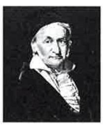

Solution: It follows that 3 | 7, since 7/3 is not an integer. On the other hand, 3 | 12 since ${12}/3 = 4$ .

---

EXAMPLE 2 Examples

---

Let $n$ and $d$ be positive integers. How many positive integers not exceeding $n$ are divisible by $d$ ?

Solution: The positive integers divisible by $d$ are all the integers of the form ${dk}$ , where $k$ is a positive integer. Hence, the number of positive integers divisible by $d$ that do not exceed $n$ equals the number of integers $k$ with $0 < {dk} \leq  n$ , or with $0 < k \leq  n/d$ . 

Therefore, there are $\lfloor n/d\rfloor$ positive integers not exceeding $n$ that are divisible by $d$ .

Some of the basic properties of divisibility of integers are given in Theorem 1.

## THEOREM 1

Let $a, b$ , and $c$ be integers. Then

1. if $a \mid  b$ and $a \mid  c$ , then $a \mid  \left( {b + c}\right)$ ;

2. if $a \mid  b$ , then $a \mid  {bc}$ for all integers $c$ ;

3. if $a \mid  b$ and $b \mid  c$ , then $a \mid  c$ .

Proof: To prove (1) suppose that $a \mid  b$ and $a \mid  c$ . Then, from the definition of divisibility, it follows that there are integers $s$ and $t$ with $b = {as}$ and $c = {at}$ . Hence,

$b + c = {as} + {at} = a\left( {s + t}\right) .$

Therefore, $a$ divides $b + c$ . This establishes part (1) of the theorem. The proofs of parts (2) and (3) are left as exercises for the reader.

Theorem 1 has this useful consequence.

COROLLARY 1 If $a, b$ , and $c$ are integers such that $a \mid  b$ and $a \mid  c$ , then $a \mid  {mb} + {nc}$ whenever $m$ and $n$ are integers.

Proof: By part (2) of Theorem 1 it follows that $a \mid  {mb}$ and $a \mid  {nc}$ whenever $m$ and $n$ are integers. By part (1) of Theorem 1 it follows that $a \mid  {mb} + {nc}$ .

## PRIMES

Every positive integer greater than 1 is divisible by at least two integers, since a positive integer is divisible by 1 and by itself. Integers that have exactly two different positive integer factors are called primes. DEFINITION 2 A positive integer $p$ greater than 1 is called prime if the only positive factors of $p$ are 1 and $p$ . A positive integer that is greater than 1 and is not prime is called composite.

Remark: The integer $n$ is composite if and only if there exists an integer $a$ such that $a \mid  n$ and $1 < a < n$ . 5XAMPLE 3 The integer 7 is prime since its only positive factors are 1 and 7, whereas the integer 9 is composite since it is divisible by 3 .

The primes less than 100 are2,3,5,7,11,13,17,19,23,29,31,37,41,43,47,53,59,61, 67,71,73,79,83,89, and 97 . In Section 6.6 we introduce a procedure, known as the sieve of Eratosthenes, which can be used to find all the primes not exceeding an integer $n$ .

The primes are the building blocks of positive integers, as the Fundamental Theorem of Arithmetic shows. The proof will be given in Section 3.3.

THEOREM 2 THE FUNDAMENTAL THEOREM OF ARITHMETIC Every positive integer greater than 1 can be written uniquely as a prime or as the product of two or more primes where the prime factors are written in order of nondecreasing size.

Example 4 gives some prime factorizations of integers.

EXAMPLE 4 The prime factorizations of 100,641,999 , and 1024 are given by

$$
{100} = 2 \cdot  2 \cdot  5 \cdot  5 = {2}^{2}{5}^{2},
$$

$$
{641} = {641}\text{,}
$$

$$
{999} = 3 \cdot  3 \cdot  3 \cdot  {37} = {3}^{3} \cdot  {37},
$$

---

Extra Examples

---

${1024} = 2 \cdot  2 \cdot  2 \cdot  2 \cdot  2 \cdot  2 \cdot  2 \cdot  2 \cdot  2 \cdot  2 = {2}^{10}.$

It is often important to show that a given integer is prime. For instance, in cryptology large primes are used in some methods for making messages secret. One procedure for showing that an integer is prime is based on the following observation.

THEOREM 3 If $n$ is a composite integer, then $n$ has a prime divisor less than or equal to $\sqrt{n}$ .

Proof: If $n$ is composite, it has a factor $a$ with $1 < a < n$ . Hence, $n = {ab}$ , where both $a$ and $b$ are positive integers greater than 1 . We see that $a \leq  \sqrt{n}$ or $b \leq  \sqrt{n}$ , since otherwise ${ab} > \sqrt{n} \cdot  \sqrt{n} = n$ . Hence, $n$ has a positive divisor not exceeding $\sqrt{n}$ . This divisor is either prime or, by the Fundamental Theorem of Arithmetic, has a prime divisor. In either case, $n$ has a prime divisor less than or equal to $\sqrt{n}$ .

From Theorem 3, it follows that an integer is prime if it is not divisible by any prime less than or equal to its square root. In the following example this observation is used to show that 101 is prime. EXAMPLE 5 Show that 101 is prime.

Solution: The only primes not exceeding $\sqrt{101}$ are 2,3,5, and 7 . Since 101 is not divisible by 2,3,5 , or 7 (the quotient of 101 and each of these integers is not an integer), it follows that 101 is prime.

Since every integer has a prime factorization, it would be useful to have a procedure for finding this prime factorization. Consider the problem of finding the prime factorization of $n$ . Begin by dividing $n$ by successive primes, starting with the smallest prime,2 . If $n$ has a prime factor, then by Theorem 3 a prime factor $p$ not exceeding $\sqrt{n}$ will be found. So, if no prime factor not exceeding $\sqrt{n}$ is found, then $n$ is prime. Otherwise, if a prime factor $p$ is found, continue by factoring $n/p$ . Note that $n/p$ has no prime factors less than $p$ . Again, if $n/p$ has no prime factor greater than or equal to $p$ and not exceeding its square root, then it is prime. Otherwise, if it has a prime factor $q$ , continue by factoring $n/\left( {pq}\right)$ . This procedure is continued until the factorization has been reduced to a prime. This procedure is illustrated in Example 6.

EXAMPLE 6 Find the prime factorization of 7007.

Solution: To find the prime factorization of 7007, first perform divisions of 7007 by successive primes, beginning with 2 . None of the primes 2, 3, and 5 divides 7007 . However, 7 divides 7007, with 7007/7 = 1001. Next, divide 1001 by successive primes, beginning with 7. It is immediately seen that 7 also divides 1001, since ${1001}/7 = {143}$ . Continue by dividing 143 by successive primes, beginning with 7 . Although 7 does not divide 143,11 does divide 143, and ${143}/{11} = {13}$ . Since 13 is prime, the procedure is completed. It follows that the prime factorization of 7007 is $7 \cdot  7 \cdot  {11} \cdot  {13} = {7}^{2} \cdot  {11} \cdot  {13}$ .

Prime numbers were studied in ancient times for philosophical reasons. Today, there are highly practical reasons for their study. In particular, large primes play a crucial role in cryptography, as we will see in Section 2.6.

---

Links

---

THE INFINITUDE OF PRIMES It has long been known that there are infinitely many primes. We will prove this fact using a proof given by Euclid in his famous mathematics text, the Elements.

THEOREM 4 There are infinitely many primes.

Proof: We will prove this theorem using a proof by contradiction. We assume that there are only finitely many primes, ${p}_{1},{p}_{2},\ldots ,{p}_{n}$ . Let

$$
Q = {p}_{1}{p}_{2}\cdots {p}_{n} + 1
$$

By the Fundamental Theorem of Arithmetic, $Q$ is prime or else it can be written as the product of two or more primes. However, none of the primes ${p}_{j}$ divides $Q$ , for if ${p}_{j} \mid  Q$ , then ${p}_{i}$ divides $Q - {p}_{1}{p}_{2}\cdots {p}_{n} = 1$ . This is a contradiction because we assumed that we have listed all the primes. Consequently, there are infinitely many primes. (Note that in this proof we do not state that $Q$ is prime!)

Since there are infinitely many primes, given any positive integer there are primes greater than this integer. There is an ongoing quest to discover larger and larger prime numbers; for almost all the last 300 years, the largest prime known has been an integer of the special form ${2}^{p} - 1$ , where $p$ is also prime. Such primes are called Mersenne primes, after the French monk Marin Mersenne, who studied them in the seventeenth century. The reason that the largest known prime has usually been a Mersenne prime is that there is an extremely efficient test, known as the Lucas-Lehmer test, for determining whether ${2}^{p} - 1$ is prime. Furthermore, it is not currently possible to test numbers not of certain special forms anywhere near as quickly to determine whether they are prime.

---

EXAMPLE 7

---

7 The numbers ${2}^{2} - 1 = 3,{2}^{3} - 1 = 7$ , and ${2}^{5} - 1 = {31}$ are Mersenne primes, while ${2}^{11} - 1 = {2047}$ is not a Mersenne prime since ${2047} = {23} \cdot  {89}$ .

Progress in finding Mersenne primes has been steady since computers were invented. As of mid-2002, 39 Mersenne primes were known, with eight found since 1990. The largest Mersenne prime known (as of mid-2002) is ${2}^{{13},{466},{917}} - 1$ , a number with over four million digits, which was shown to be prime in late 2001. A communal effort, the Great Internet Mersenne Prime Search (GIMPS), has been organized to look for new Mersenne primes. By the way, even the search for Mersenne primes has practical implications. One quality control test for supercomputers has been to replicate the Lucas-Lehmer test that establishes the primality of a large Mersenne prime.

THE DISTRIBUTION OF PRIMES Theorem 4 tells us that there are infinitely many primes. However, how many primes are less than a positive number $x$ ? This question interested mathematicians for many years; in the late eighteenth century mathematicians produced large tables of prime numbers to gather evidence concerning the distribution of primes. Using this evidence, the great mathematicians of the day, including Gauss and Legendre, conjectured, but did not prove, Theorem 5.

THEOREM 5 THE PRIME NUMBER THEOREM The ratio of the number of primes not exceeding $x$ and $x/\ln x$ approaches 1 as $x$ grows without bound. (Here $\ln x$ is the natural logarithm of $x$ .)

MARIN MERSENNE (1588-1648) Mersenne was born in Maine, France, into a family of laborers and attended the College of Mans and the Jesuit College at La Flèche. He continued his education at the Sorbonne, studying theology from 1609 to 1611. He joined the religious order of the Minims in 1611, a group whose name comes from the word minimi (the members of this group considered themselves the least religious order). Besides prayer, the members of this group devoted their energy to scholarship and study. In 1612 he became a priest at the Place Royale in Paris; between 1614 and 1618 he taught philosophy at the Minim Convent at Nevers. He returned to Paris in 1619, where his cell in the Minims de l'Annociade became a place for meetings of French scientists, philosophers, and mathematicians, including Fermat and Pascal. Mersenne corresponded extensively with scholars throughout Europe, serving as a clearinghouse for mathematical and scientific knowledge, a function later served by mathematical journals (and today also by the Internet). Mersenne wrote books covering mechanics, mathematical physics, mathematics, music, and acoustics. He studied prime numbers and tried unsuccessfully to construct a formula representing all primes. In 1644 Mersenne claimed that ${2}^{p} - 1$ is prime for $p = 2,3,5,7,{13},{17},{19},{31},{67},{127},{257}$ but is composite for all other primes less than 257 . It took over 300 years to determine that Mersenne's claim was wrong five times. Specifically, ${2}^{p} - 1$ is not prime for $p = {67}$ and $p = {257}$ but is prime for $p = {61}$ , $p = {87}$ , and $p = {107}$ . It is also noteworthy that Mersenne defended two of the most famous men of his time, Descartes and Galileo, from religious critics. He also helped expose alchemists and astrologers as frauds. The Prime Number Theorem was first proved in 1896 by the French mathematician Jacques Hadamard and the Belgian mathematician Charles-Jean-Gustave-Nicholas de la Valleé-Poussin using the theory of complex variables. Although proofs not using complex variables have been found, all known proofs of the Prime Number Theorem are quite complicated.

---

Links

---

We can use the Prime Number Theorem to estimate the odds that a randomly chosen number of a certain size is prime. The Prime Number Theorem tells us that the number of primes not exceeding $x$ can be approximated by $x/\ln x$ . Consequently, the odds that a randomly selected positive integer $x$ is prime are approximately $\left( {x/\ln x}\right) /x = 1/\ln x$ . For example, the odds that an integer near ${10}^{1000}$ is prime are approximately $1/\ln {10}^{1000}$ , which is approximately 1/2300. (Of course, by choosing only odd numbers, we double our chances of finding a prime.)

Using trial division with Theorem 3 gives procedures for factoring and for primality testing. However, these procedures are not efficient algorithms; many much more practical and efficient algorithms for these tasks have been developed. Factoring and primality testing have become important in the applications of number theory to cryptography. This has led to a great interest in developing efficient algorithms for both tasks. Clever procedures have been devised in the last 30 years for efficiently generating large primes. However, even though powerful new factorization methods have been developed in the same time frame, factoring large numbers remains extraordinarily more time consuming. Nevertheless, the challenge of factoring large numbers interests many people. There is a communal effort on the Internet to factor large numbers, especially those of the special form ${k}^{n} \pm  1$ , where $k$ is a small positive integer and $n$ is a large positive integer (such Links numbers are called Cunningham numbers). At any given time, there is a list of the "Ten Most Wanted" large numbers of this type awaiting factorization.

## THE DIVISION ALGORITHM

When an integer is divided by a positive integer, there is a quotient and a remainder, as the division algorithm shows.

THEOREM 6 THE DIVISION ALGORITHM Let $a$ be an integer and $d$ a positive integer. Then there are unique integers $q$ and $r$ , with $0 \leq  r < d$ , such that $a = {dq} + r$ .

Remark: Theorem 6 is not really an algorithm. (Why not?) Nevertheless, we use its traditional name.

## DEFINITION 3

In the equality given in the division algorithm, $d$ is called the divisor, $a$ is called the dividend, $q$ is called the quotient, and $r$ is called the remainder. This notation is used to express the quotient and remainder:

$q = a\operatorname{div}d,\;r = a{\;\operatorname{mod}\;d}.$

Examples 8 and 9 illustrate the division algorithm. EXAMPLE 8 What are the quotient and remainder when 101 is divided by 11?

Solution: We have

${101} = {11} \cdot  9 + 2.$

Hence, the quotient when 101 is divided by 11 is $9 = {101}$ div 11, and the remainder is $2 = {101}{\;\operatorname{mod}\;{11}}$ .

EXAMPLE 9 9 What are the quotient and remainder when -11 is divided by 3 ?

Solution: We have

---

Examples

---

$- {11} = 3\left( {-4}\right)  + 1$ .

Hence, the quotient when -11 is divided by 3 is $- 4 =  - {11}$ div 3, and the remainder is $1 =  - {11}{\;\operatorname{mod}\;3}$ .

Note that the remainder cannot be negative. Consequently, the remainder is not -2 , even though

$- {11} = 3\left( {-3}\right)  - 2,$

since $r =  - 2$ does not satisfy $0 \leq  r < 3$ .

Note that the integer $a$ is divisible by the integer $d$ if and only if the remainder is zero when $a$ is divided by $d$ .

## GREATEST COMMON DIVISORS AND LEAST COMMON MULTIPLES

The largest integer that divides both of two integers is called the greatest common divisor of these integers.

DEFINITION 4 Let $a$ and $b$ be integers, not both zero. The largest integer $d$ such that $d \mid  a$ and $d \mid  b$ is called the greatest common divisor of $a$ and $b$ . The greatest common divisor of $a$ and $b$ is denoted by $\gcd \left( {a, b}\right)$ .

The greatest common divisor of two integers, not both zero, exists because the set of common divisors of these integers is finite. One way to find the greatest common divisor of two integers is to find all the positive common divisors of both integers and then take the largest divisor. This is done in the following examples. Later, a more efficient method of finding greatest common divisors will be given. EXAMPLE 10 What is the greatest common divisor of 24 and 36 ? Solution: The positive common divisors of 24 and 36 are1,2,3,4,6, and 12. Hence, $\gcd \left( {{24},{36}}\right)  = {12}$ . MPLE 11 What is the greatest common divisor of 17 and 22? Solution: The integers 17 and 22 have no positive common divisors other than 1 , so that $\gcd \left( {{17},{22}}\right)  = 1$ .

Since it is often important to specify that two integers have no common positive divisor other than 1 , we have the following definition.

DEFINITION 5 The integers $a$ and $b$ are relatively prime if their greatest common divisor is 1 .

From Example 11 it follows that the integers 17 and 22 are relatively prime, since $\gcd \left( {{17},{22}}\right)  = 1$ .

Since we often need to specify that no two integers in a set of integers have a common positive divisor greater than 1 , we make Definition 6 .

DEFINITION 6 The integers ${a}_{1},{a}_{2},\ldots ,{a}_{n}$ are pairwise relatively prime if $\gcd \left( {{a}_{i},{a}_{j}}\right)  = 1$ whenever $1 \leq  i < j \leq  n$ .

13 Determine whether the integers 10,17 , and 21 are pairwise relatively prime and whether the integers 10,19 , and 24 are pairwise relatively prime.

Solution: Since $\gcd \left( {{10},{17}}\right)  = 1,\gcd \left( {{10},{21}}\right)  = 1$ , and $\gcd \left( {{17},{21}}\right)  = 1$ , we conclude that 10,17 , and 21 are pairwise relatively prime.

Since $\gcd \left( {{10},{24}}\right)  = 2 > 1$ , we see that 10,19, and 24 are not pairwise relatively prime.

Another way to find the greatest common divisor of two integers is to use the prime factorizations of these integers. Suppose that the prime factorizations of the integers $a$ and $b$ , neither equal to zero, are

$$
a = {p}_{1}^{{a}_{1}}{p}_{2}^{{a}_{2}}\cdots {p}_{n}^{{a}_{n}}, b = {p}_{1}^{{b}_{1}}{p}_{2}^{{b}_{2}}\cdots {p}_{n}^{{b}_{n}},
$$

where each exponent is a nonnegative integer, and where all primes occurring in the prime factorization of either $a$ or $b$ are included in both factorizations, with zero exponents if necessary. Then $\gcd \left( {a, b}\right)$ is given by

$$
\gcd \left( {a, b}\right)  = {p}_{1}^{\min \left( {{a}_{1},{b}_{1}}\right) }{p}_{2}^{\min \left( {{a}_{2},{b}_{2}}\right) }\cdots {p}_{n}^{\min \left( {{a}_{n},{b}_{n}}\right) },
$$

where $\min \left( {x, y}\right)$ represents the minimum of the two numbers $x$ and $y$ . To show that this formula for $\gcd \left( {a, b}\right)$ is valid, we must show that the integer on the right-hand side divides both $a$ and $b$ , and that no larger integer also does. This integer does divide both $a$ and $b$ , since the power of each prime in the factorization does not exceed the power of this prime in either the factorization of $a$ or that of $b$ . Further, no larger integer can divide both $a$ and $b$ , because the exponents of the primes in this factorization cannot be increased, and no other primes can be included.

## EXAMPLE 14

PLE 14 Since the prime factorizations of 120 and 500 are ${120} = {2}^{3} \cdot  3 \cdot  5$ and ${500} = {2}^{2} \cdot  {5}^{3}$ , the greatest common divisor is

$$
\gcd \left( {{120},{500}}\right)  = {2}^{\min \left( {3,2}\right) }{3}^{\min \left( {1,0}\right) }{5}^{\min \left( {1,3}\right) } = {2}^{2}{3}^{0}{5}^{1} = {20}.
$$

Prime factorizations can also be used to find the least common multiple of two integers.

DEFINITION 7 The least common multiple of the positive integers $a$ and $b$ is the smallest positive integer that is divisible by both $a$ and $b$ . The least common multiple of $a$ and $b$ is denoted by $\operatorname{lcm}\left( {a, b}\right)$ .

The least common multiple exists because the set of integers divisible by both $a$ and $b$ is nonempty, and every nonempty set of positive integers has a least element (by the well-ordering property, which will be discussed in Section 3.3). Suppose that the prime factorizations of $a$ and $b$ are as before. Then the least common multiple of $a$ and $b$ is given by

$$
\operatorname{lcm}\left( {a, b}\right)  = {p}_{1}^{\max \left( {{a}_{1},{b}_{1}}\right) }{p}_{2}^{\max \left( {{a}_{2},{b}_{2}}\right) }\cdots {p}_{n}^{\max \left( {{a}_{n},{b}_{n}}\right) }
$$

where $\max \left( {x, y}\right)$ denotes the maximum of the two numbers $x$ and $y$ . This formula is valid since a common multiple of $a$ and $b$ has at least $\max \left( {{a}_{i},{b}_{i}}\right)$ factors of ${p}_{i}$ in its prime factorization, and the least common multiple has no other prime factors besides those in $a$ and $b$ .

EXAMPLE 15 What is the least common multiple of ${2}^{3}{3}^{5}{7}^{2}$ and ${2}^{4}{3}^{3}$ ?

Solution: We have

$$
\operatorname{lcm}\left( {{2}^{3}{3}^{5}{7}^{2},{2}^{4}{3}^{3}}\right)  = {2}^{\max \left( {3,4}\right) }{3}^{\max \left( {5,3}\right) }{7}^{\max \left( {2,0}\right) } = {2}^{4}{3}^{5}{7}^{2}.
$$

The following theorem gives the relationship between the greatest common divisor and least common multiple of two integers. It can be proved using the formulae we have derived for these quantities. The proof of this theorem is left as an exercise for the reader. THEOREM 7 Let $a$ and $b$ be positive integers. Then

$$
{ab} = \gcd \left( {a, b}\right)  \cdot  \operatorname{lcm}\left( {a, b}\right) .
$$

## MODULAR ARITHMETIC

In some situations we care only about the remainder of an integer when it is divided by some specified positive integer. For instance, when we ask what time it will be (on a 24-hour clock) 50 hours from now, we care only about the remainder when 50 plus the current hour is divided by 24 . Since we are often interested only in remainders, we have special notations for them.

We have a notation to indicate that two integers have the same remainder when they are divided by the positive integer $m$ .

DEFINITION 8 If $a$ and $b$ are integers and $m$ is a positive integer, then $a$ is congruent to $b$ modulo $m$ if $m$ divides $a - b$ . We use the notation $a \equiv  b\left( {\;\operatorname{mod}\;m}\right)$ to indicate that $a$ is congruent to $b$ modulo $m$ . If $a$ and $b$ are not congruent modulo $m$ , we write $a ≢ b\left( {\;\operatorname{mod}\;m}\right)$ .

The connection between the notations used when working with remainders is made clear in Theorem 8.

## THEOREM 8

Let $a$ and $b$ be integers, and let $m$ be a positive integer. Then $a \equiv  b\left( {\;\operatorname{mod}\;m}\right)$ if and only if $a{\;\operatorname{mod}\;m} = b{\;\operatorname{mod}\;m}$ .

The proof of Theorem 8 is left as Exercises 21 and 22 at the end of this section.

EXAMPLE 16 3 Determine whether 17 is congruent to 5 modulo 6 and whether 24 and 14 are congruent modulo 6.

Solution: Since 6 divides ${17} - 5 = {12}$ , we see that ${17} \equiv  5\left( {\;\operatorname{mod}\;6}\right)$ . However, since ${24} - {14} = {10}$ is not divisible by 6, we see that ${24} ≢ {14}\left( {\;\operatorname{mod}\;6}\right)$ .

The great German mathematician Karl Friedrich Gauss developed the concept of congruences at the end of the eighteenth century.

The notion of congruences has played an important role in the development of number theory. Theorem 9 provides a useful way to work with congruences.

THEOREM 9 Let $m$ be a positive integer. The integers $a$ and $b$ are congruent modulo $m$ if and only if there is an integer $k$ such that $a = b + {km}$ .

Proof: If $a \equiv  b\left( {\;\operatorname{mod}\;m}\right)$ , then $m \mid  \left( {a - b}\right)$ . This means that there is an integer $k$ such that $a - b = {km}$ , so that $a = b + {km}$ . Conversely, if there is an integer $k$ such that $a = b + {km}$ , then ${km} = a - b$ . Hence, $m$ divides $a - b$ , so that $a \equiv  b\left( {\;\operatorname{mod}\;m}\right)$ .

The set of all integers congruent to an integer $a$ modulo $m$ is called the congruence class of $a$ modulo $m$ . In Chapter 7 we will show that there are $m$ pairwise disjoint equivalence classes modulo $m$ and that the union of these equivalence classes is the set of integers.

Theorem 10 shows how congruences work with respect to addition and multiplication.

---

KARL FRIEDRICH GAUSS (1777-1855) Karl Friedrich Gauss, the son of a bricklayer, was a child prodigy. He demonstrated his potential at the age of 10 , when he quickly solved a problem assigned by a teacher to keep the class busy. The teacher asked the students to find the sum of the first 100 positive integers. Gauss realized that this sum could be found by forming 50 pairs, each with the sum 101: $1 + {100},2 + {99},\ldots ,{50} + {51}$ . This brilliance attracted the sponsorship of patrons, including Duke Ferdinand of Brunswick, who made it possible for Gauss to attend Caroline College and the University of Göttingen. While a student, he invented the method of least squares, which is used to estimate the most likely value of a variable from experimental results. In 1796 Gauss made a fundamental discovery in geometry, advancing a subject that had not advanced since ancient times. He showed that a 17-sided regular polygon could be drawn using just a ruler and compass.

In 1799 Gauss presented the first rigorous proof of the Fundamental Theorem of Algebra, which states that a polynomial of degree $n$ has exactly $n$ roots (counting multiplicities). Gauss achieved worldwide fame when he successfully calculated the orbit of the first asteroid discovered, Ceres, using scanty data.

Gauss was called the Prince of Mathematics by his contemporary mathematicians. Although Gauss is noted for his many discoveries in geometry, algebra, analysis, astronomy, and physics, he had a special interest in number theory, which can be seen from his statement "Mathematics is the queen of the sciences, and the theory of numbers is the queen of mathematics." Gauss laid the foundations for modern number theory with the publication of his book Disquisitiones Arithmeticae in 1801.

---

THEOREM 10 Let $m$ be a positive integer. If $a \equiv  b\left( {\;\operatorname{mod}\;m}\right)$ and $c \equiv  d\left( {\;\operatorname{mod}\;m}\right)$ , then

$$
a + c \equiv  b + d\left( {\;\operatorname{mod}\;m}\right) \;\text{ and }\;{ac} \equiv  {bd}\left( {\;\operatorname{mod}\;m}\right) .
$$

Proof: Since $a \equiv  b\left( {\;\operatorname{mod}\;m}\right)$ and $c \equiv  d\left( {\;\operatorname{mod}\;m}\right)$ , there are integers $s$ and $t$ with $b = a + {sm}$ and $d = c + {tm}$ . Hence,

$$
b + d = \left( {a + {sm}}\right)  + \left( {c + {tm}}\right)  = \left( {a + c}\right)  + m\left( {s + t}\right)
$$

and

$$
{bd} = \left( {a + {sm}}\right) \left( {c + {tm}}\right)  = {ac} + m\left( {{at} + {cs} + {stm}}\right) .
$$

Hence,

$$
a + c \equiv  b + d\left( {\;\operatorname{mod}\;m}\right) \;\text{ and }\;{ac} \equiv  {bd}\left( {\;\operatorname{mod}\;m}\right) .
$$

EXAMPLE 17 Since $7 \equiv  2\left( {\;\operatorname{mod}\;5}\right)$ and ${11} \equiv  1\left( {\;\operatorname{mod}\;5}\right)$ , it follows from Theorem 10 that

$$
{18} = 7 + {11} \equiv  2 + 1 = 3\left( {\;\operatorname{mod}\;5}\right)
$$

and that

$$
{77} = 7 \cdot  {11} \equiv  2 \cdot  1 = 2\left( {\;\operatorname{mod}\;5}\right) .
$$

## APPLICATIONS OF CONGRUENCES

Number theory has applications to a wide range of areas. We will introduce three applications in this section: the use of congruences to assign memory locations to computer files, the generation of pseudorandom numbers, and cryptosystems based on modular arithmetic.

---

EXAMPLE 18 Links

---

Hashing Functions The central computer at your school maintains records for each student. How can memory locations be assigned so that student records can be retrieved quickly? The solution to this problem is to use a suitably chosen hashing function. Records are identified using a key, which uniquely identifies each student's records. For instance, student records are often identified using the Social Security number of the student as the key. A hashing function $h$ assigns memory location $h\left( k\right)$ to the record that has $k$ as its key.

In practice, many different hashing functions are used. One of the most common is the function

$h\left( k\right)  = k{\;\operatorname{mod}\;m}$

where $m$ is the number of available memory locations.

Hashing functions should be easily evaluated so that files can be quickly located. JAUSS The hashing function $h\left( k\right)  = k{\;\operatorname{mod}\;m}$ meets this requirement; to find $h\left( k\right)$ , we need secial ences, only compute the remainder when $k$ is divided by $m$ . Furthermore, the hashing function mber should be onto, so that all memory locations are possible. The function $h\left( k\right)  = k{\;\operatorname{mod}\;m}$ also satisfies this property.