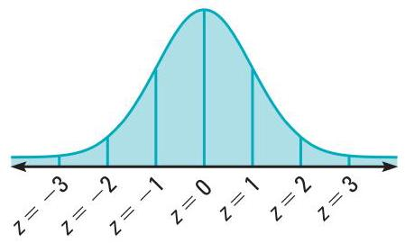
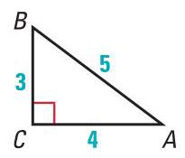
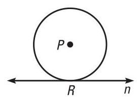

<table><tr><td/><td>root of an equation (p. 74)The solutions of a quadratic equation are its roots. raíz de una ecuación (pág. 74) Las soluciones de una ecuación cuadrática son sus raíces.</td><td>The roots of the quadratic equation ${x}^{2} - {5x} - {36} = 0$ are 9 and -4 . Las raíces de la ecuación cuadrática ${x}^{2} - {5x} - {36} = 0$ son 9 y -4.</td></tr><tr><td/><td>sample (p. 268) A subset of a population. muestra (pág. 268) Subconjunto de una población.</td><td>See population. Ver población.</td></tr><tr><td rowspan="4"/><td>scatter plot (p. 247) A graph of a set of data pairs (x, y)used to determine whether there is a relationship between the variables $x$ and $y$ . diagrama de dispersión (pág. 247) Gráfica de un conjunto de pares de datos(x, y)que sirve para determinar si hay una relación entre las variables $x$ e $y$ .</td><td>   Hours of studying Horas de estudio</td></tr><tr><td>scientific notation (p. 107) The representation of a number in the form $c \times  {10}^{n}$ where $1 \leq  c < {10}$ and $n$ is an integer. notación científica (pág. 107) La representación de un número de la forma $c \times  {10}^{n}$ , donde $1 \leq  c < {10}\mathrm{y}n$ es un número entero.</td><td>0.693 is written in scientific notation as ${6.93} \times  {10}^{-1}$ . 0.693 escrito en notación científica es ${6.93} \times  {10}^{-1}$ .</td></tr><tr><td>secant line (p. 182) A line that intersects a circle in two points. recta secante (pág. 182) Recta que corta a un círculo en dos puntos.</td><td>   Line $m$ is a secant. La recta més una secante.</td></tr><tr><td>secant segment (p. 218) A segment that contains a chord of a circle and has exactly one endpoint outside the circle. segmento secante (pág. 218) Segmento que contiene una cuerda de un círculo y tiene sólo un extremo en el exterior del círculo.</td><td>  </td></tr></table>

<table><tr><td>sector of a circle (p.230) The region bounded by two radii of the circle and their intercepted arc. sector de un círculo (pág. 230) La región limitada por dos radios del círculo y su arco interceptado.</td><td>   sector APB</td></tr><tr><td>segments of a chord (p.218) When two chords intersect in the interior of a circle, each chord is divided into two segments called segments of the chord. segmentos de una cuerda (pág. 218) Cuando dos cuerdas se cortan en el interior de un círculo, cada cuerda se divide en dos segmentos, llamados segmentos de la cuerda.</td><td>   $\overline{EA}$ and $\overline{EB}$ are segments of chord $\overline{AB}$ . DE and EC are segments of chord DC. EA y $\overline{EB}$ son segmentos de la cuerda $\overline{AB}$ . DEy $\overline{EC}$ son segmentos de la cuerda $\overline{DC}$ .</td></tr><tr><td>semicircle (p. 191) An arc with endpoints that are the endpoints of a diameter of a circle. The measure of a semicircle is ${180}^{ \circ  }$ . semicírculo (pág. 191) Arco cuyos extremos son los extremos de un diámetro de un círculo. Un semicírculo mide ${180}^{ \circ  }$ .</td><td>   $\overset{⏜}{QSR}$ is a semicircle. QSR es un semicírculo.</td></tr><tr><td>sequence (p. 133) A function whose domain is a set of consecutive integers. The domain gives the relative position of each term of the sequence. The range gives the terms of the sequence.</td><td>For the domain $n = 1,2,3$ , and 4, the sequence defined by ${a}_{n}$ = 2n has the terms 2, 4, 6, and 8.</td></tr><tr><td>progresión (pág. 133) Función cuyo dominio es un conjunto de números enteros consecutivos. El dominio da la posición relativa de cada término de la secuencia. El rango da los términos de la secuencia.</td><td>Para el dominio $n = 1,2,3$ y 4, la secuencia definida por ${a}_{n} = {2n}$ tiene los términos 2, 4, 6 y 8.</td></tr><tr><td>series (p. 133) The expression formed by adding the terms of a sequence. A series can be finite or infinite. serie (pág. 133) La expresión formada al sumar los términos de una progresión. La serie puede ser finita o infinita.</td><td>Finite series: $2 + 4 + 6 + 8$ Infinite series: $2 + 4 + 6 + 8 + \cdots$ Serie finita: $2 + 4 + 6 + 8$ Serie infinita: $2 + 4 + 6 + 8 + \cdots$</td></tr><tr><td>sigma notation (p. 133) See summation notation. notación sigma (pág. 133) Ver notación de sumatoria.</td><td>See summation notation. Ver notación de sumatoria.</td></tr></table>

<table><tr><td>similar polygons (p. 182) Two polygons such that their corresponding angles are congruent and the lengths of corresponding sides are proportional. polígonos semejantes (pág. 182) Dos polígonos tales que los ángulos correspondientes son congruentes y las longitudes de los lados correspondientes son proporcionales.</td><td>   ABCD ~ EFGH</td></tr><tr><td>sine (p. 163) A trigonometric ratio, abbreviated as sin. For a right triangle ${ABC}$ , the sine of the acute angle $A$ is $\sin A = \frac{\text{ length of leg opposite }\angle A}{\text{ length of hypotenuse }} = \frac{BC}{AB}.$ seno (pág. 163) Razón trigonométrica, abreviada sen. Para un triángulo rectángulo ${ABC}$ , el seno del ángulo agudo $A$ es sen $A = \frac{\text{ longitud del cateto opuesto a }\angle A}{\text{ longitud de la hipotenusa }} = \frac{BC}{AB}$ .</td><td>  $\sin A = \frac{BC}{AB} = \frac{3}{5}$sen $A = \frac{BC}{AB} = \frac{3}{5}$</td></tr><tr><td>solution of an equation in two variables (p. 33) An ordered pair(x, y)that produces a true statement whe the values of $x$ and $y$ are substituted in the equation. solución de una ecuación con dos variables (pág. 33) Par ordenado(x, y)que produce un enunciado verdadero al sustituir $x$ e $y$ por sus valores en la ecuación.</td><td>(-2,3)is a solution of $y =  - {2x} - 1$ . (-2,3) es una solución de $y =  - {2x} - 1$ .</td></tr><tr><td>solve a right triangle (p. 172) To find the measures of all of the sides and angles of a right triangle.</td><td>You can solve a right triangle if you know either of the following: - Two side lengths - One side length and the measure of one acute angle</td></tr><tr><td>resolver un triángulo rectángulo (pág. 172) Hallar las medidas de todos los lados y todos los ángulos de un triángulo rectángulo.</td><td>Puedes resolver un triángulo rectángulo conociendo uno de estos grupos: • Las longitudes de dos lados • La longitud de un lado y la medida de un ángulo agudo</td></tr><tr><td>sphere (p. 237) The set of all points in space equidistant from a given point called the center of the sphere. esfera (pág. 237) El conjunto de todos los puntos del espacio que son equidistantes de un punto dado, llamado centro de la esfera.</td><td>  </td></tr></table>

square root (p. 2) If ${b}^{2} = a$ , then $b$ is a square root of $a$ . The radical symbol $\sqrt{r}$ represents a nonnegative square

raíz cuadrada (pág. 2) Si ${b}^{2} = a$ , entonces $b$ es una raíz cuadrada de $a$ . El signo radical Vrepresenta una raíz cuadrada no negativa.

The square roots of 9 are 3 and -3 because ${3}^{2} = 9$ and ${\left( -3\right) }^{2} = 9$ . So, $\sqrt{9} = 3$ and $- \sqrt{9} =  - 3$ .

Las raíces cuadradas de 9 son 3 y -3 ya que ${3}^{2} = 9$ y ${\left( -3\right) }^{2} = 9$ . Así pues, $\sqrt{9} = 3\mathrm{y} - \sqrt{9} =  - 3$ .

standard deviation (p. 259) The typical difference (or deviation) between a data value and the mean. The standard deviation $\sigma$ of a numerical data set ${x}_{1},{x}_{2},\ldots$ , ${x}_{n}$ is given by the following formula:

$$
\sigma  = \sqrt{\frac{{\left( {x}_{1} - \bar{x}\right) }^{2} + {\left( {x}_{2} - \bar{x}\right) }^{2} + \cdots  + {\left( {x}_{n} - \bar{x}\right) }^{2}}{n}}
$$

desviación típica (pág. 259) La diferencia (o desviación) más común entre un valor de los datos y la media. La desviación típica $\sigma$ de un conjunto de datos numéricos ${x}_{1},{x}_{2},\ldots ,{x}_{n}$ viene dada por la siguiente fórmula:

$$
\sigma  = \sqrt{\frac{{\left( {x}_{1} - \bar{x}\right) }^{2} + {\left( {x}_{2} - \bar{x}\right) }^{2} + \cdots  + {\left( {x}_{n} - \bar{x}\right) }^{2}}{n}}
$$

14,17,18,19,20,24,24,30,32

Because the mean of the data set is 22, the standard deviation is:

Como la media del conjunto de datos es 22, la desviación típica es:

$$
\sigma  =
$$

$$
\sqrt{\frac{{\left( {14} - {22}\right) }^{2} + {\left( {17} - {22}\right) }^{2} + \cdots  + {\left( {32} - {22}\right) }^{2}}{9}}
$$

$$
= \sqrt{\frac{290}{9}} \approx  {5.7}
$$

standard form of a quadratic equation in one The quadratic equation variable (p. 56) The form $a{x}^{2} + {bx} + c = 0$ where

forma general de una ecuación cuadrática con una variable (pág. 56) La forma $a{x}^{2} + {bx} + c = 0$ ,

standard normal distribution (p. 264) The normal distribution with mean 0 and standard deviation 1 . See also $z$ -score.

distribución normal típica (pág. 264) La distribución normal con media 0 y desviación típica 1. Ver también puntuación $z$ .

statistics (p. 259) Numerical values used to See mean, median, mode, range, summarize and compare sets of data. and standard deviation.

estadística (pág. 259) Valores numéricos utilizados Ver media, mediana, moda, rango $y$ para resumir y comparar conjuntos de datos. desviación típica.

step function (p. 48) A piecewise function defined by

$$
f\left( x\right)  = \left\{  \begin{array}{ll} 1, & \text{ if }0 \leq  x < 1 \\  2, & \text{ if }1 \leq  x < 2 \\  3, & \text{ if }2 \leq  x < 3 \end{array}\right.
$$

a constant value over each part of its domain. Its graph resembles a series of stair steps.

función escalonada (pág. 48) Función definida

$$
f\left( x\right)  = \left\{  \begin{array}{ll} 1, & \text{ if }0 \leq  x < 1 \\  2, & \text{ if }1 \leq  x < 2 \\  3, & \text{ if }2 \leq  x < 3 \end{array}\right.
$$

a trozos y por un valor constante en cada parte de su dominio. Su gráfica parece un grupo de escalones.

summation notation (p. 133) Notation for a series that uses the uppercase Greek letter sigma, $\sum$ . Also called sigma notation.

---

$$
\mathop{\sum }\limits_{{i = 1}}^{5}{7i} = 7\left( 1\right)  + 7\left( 2\right)  + 7\left( 3\right)  + 7\left( 4\right)  + 7\left( 5\right)
$$

$$
= 7 + {14} + {21} + {28} + {35}
$$

---

notación de sumatoria (pág. 133) Notación de una serie que usa la letra griega mayúscula sigma, $\sum$ . También se llama notación sigma.

Ttangent (p. 157) A trigonometric ratio, abbreviated as tan. For a right triangle ${ABC}$ , the tangent of the acute angle $A$ is

$$
\tan A = \frac{\text{ length of leg opposite }\angle A}{\text{ length of leg adjacent to }\angle A} = \frac{BC}{AC}.
$$

---

$$
\tan A = \frac{BC}{AC} = \frac{3}{4}
$$

---

tangente (pág. 157) Razón trigonométrica, abreviada tan. Para un triángulo rectángulo ${ABC}$ , la tangente del ángulo agudo $A$ es

$$
\tan A = \frac{\text{ longitud del cateto opuesto a }\angle A}{\text{ longitud del cateto adyacente a }\angle A} = \frac{BC}{AC}.
$$

tangent line (p. 182) A line in the plane of a circle that intersects the circle in exactly one point, the point of tangency.

Line $n$ is a tangent. $R$ is the point of tangency.

La recta $n$ es una tangente. $R$ es el punto de tangencia.

recta tangente (pág. 182) Recta del plano de un círculo que corta al círculo en sólo un punto, el punto de tangencia.

<table><tr><td>terms of a sequence (p. 133) The values in the range of a sequence.</td><td>The first 4 terms of the sequence $1, - 3,9, - {27},{81}, - {243},\ldots$ are $1, - 3,9$ , and -27 .</td></tr><tr><td>términos de una progresión (pág. 133) Los valores del rango de una progresión.</td><td>Los 4 primeros términos de la progresión 1, -3, 9, -27, 81, $- {243},\ldots$ son $1, - 3,9$ y-27.</td></tr><tr><td>transformation (p. 40)A transformation changes a graph's size, shape, position, or orientation.</td><td>Translations, vertical stretches and shrinks, reflections, and rotations are transformations.</td></tr><tr><td>transformación (pág. 40) Una transformación cambia el tamaño, la forma, la posición o la orientación de una gráfica.</td><td>Las traslaciones, las expansiones y contracciones verticales, las reflexiones y las rotaciones son transformaciones.</td></tr><tr><td>translation (p. 40) A transformation that shifts a graph horizontally and/or vertically, but does not change its size, shape, or orientation. traslación (pág. 40) Transformación que desplaza una gráfica horizontal o verticalmente, o de ambas maneras, pero que no cambia su tamaño, forma u orientación.</td><td>   The graph of $y = \left| {x + 4}\right|  - 2$ is the graph of $y = \left| x\right|$ translated down 2 units and left 4 units. La gráfica de $y = \left| {x + 4}\right|  - 2$ es la gráfica de $y = \left| x\right|$ al trasladar ésta 2 unidades hacia abajo y 4 unidades hacia la izquierda.</td></tr><tr><td>trigonometric ratio (p. 157) A ratio of the lengths of two sides in a right triangle. See also sine, cosine, and tangent. razón trigonométrica (pág. 157) Razón entre las longitudes de dos lados de un triángulo rectángulo. Ver también seno, coseno $y$ tangente.</td><td>Three common trigonometric ratios are sine, cosine, and tangent. Tres razones trigonométricas comunes son el seno, el coseno y la tangente. $\tan A = \frac{BC}{AC} = \frac{3}{4}$ $\sin A = \frac{BC}{AB} = \frac{3}{5}$    $\cos A = \frac{AC}{AB} = \frac{4}{5}$ $\tan A = \frac{BC}{AC} = \frac{3}{4}$ sen $A = \frac{BC}{AB} = \frac{3}{5}$ $\cos A = \frac{AC}{AB} = \frac{4}{5}$</td></tr></table>

trigonometry (p. 157) The branch of mathematics that deals with the relationships between the sides and angles at triangles and the calculations based on these relationships.

trigonometria (pág. 157) La rama de las matemáticas Ver seno, coseno y tangente. que trata las relaciones entre los lados y ángulos de los triángulos y los cálculos basados en estas relaciones.

trinomial (p. 74) The sum of three monomials.

trinomio (pág. 74) La suma de tres monomios. U about. informarte. el lugar donde organizar el baile de fin de año. Si cada estudiante de último curso tiene iguales posibilidades de ser encuestado, entonces es una muestra no sesgada.

(miles) (miles/hour) (hours) Distancia = Velocidad - Tiempo (millas) (millas/hora) (horas)

<table><tr><td/><td>vertex of an absolute value graph (p. 40)The highest or lowest point on the graph of an absolute value function. vértice de una gráfica de valor absoluto (pág. 40) El punto más alto o más bajo de la gráfica de una función de valor absoluto.</td><td>   The vertex of the graph of $y = \left| {x - 4}\right|  + 3$ is the point(4,3). El vértice de la gráfica de $y = \left| {x - 4}\right|  + 3$ es el punto(4,3).</td></tr><tr><td>Z</td><td>zero of a function (p.40)A number $k$ is a zero of a function $f$ if $f\left( k\right)  = 0$ .</td><td>The zeros of the function $f\left( x\right)  = 2\left( {x + 3}\right) \left( {x - 1}\right)$ are -3 and 1.</td></tr><tr><td/><td>cero de una función (pág. 40) Un número $k$ es un cero de una función $f$ si $f\left( k\right)  = 0$ .</td><td>Los ceros de la función $f\left( x\right)  = 2\left( {x + 3}\right) \left( {x - 1}\right)$ son-3y1.</td></tr><tr><td/><td>z-score (p. 264) The number $z$ of standard deviations that a data value lies above or below the mean of the data set: $z = \frac{x - \bar{x}}{\sigma }$ .</td><td>A normal distribution has a mean of 76 and a standard deviation of 9. The z-score for $x = {64}$ is $z = \frac{x - \bar{x}}{\sigma } = \frac{{64} - {76}}{9} \approx   - {1.3}$ .</td></tr><tr><td>ANDIANS</td><td>puntuación z (pág. 264) El número $z$ de desviaciones típicas que un valor se encuentra por encima o por debajo de la media del conjunto de datos: $z = \frac{x - \bar{x}}{\sigma }$ .</td><td>Una distribución normal tiene una media de 76 y una desviación típica de 9. La puntuación z para $x = {64}$ es $z = \frac{x - \bar{x}}{\sigma } = \frac{{64} - {76}}{9} \approx   - {1.3}$ .</td></tr></table>

McDougal Littell

# GEORGIA HIGH SCHOOL MIATHEMATICS

Cover Photo Credits: Clockwise from top: Okefenokee Swamp (C) Farrell Grehan/Corbis; Peach (C) Comstock Images/Age Fotostock; St. Simons Island Lighthouse (C) James Schwabel/Alamy; Horse-drawn carriage, Savannah (C) Bob Krist/Corbis; The Rock Eagle Effigy Mound (C) Tami Chappell/America 24-7/Getty Images; Tybee Island boat marina (c) Walter Bibikow/Age Fotostock; Georgia State Capitol Building (c) W. Cody/Corbis

Copyright © 2008 McDougal Littell, a division of Houghton Mifflin Company.

All rights reserved.

Warning: No part of this work may be reproduced or transmitted in any form or by any means, electronic or mechanical, including photocopying and recording, or by any information storage or retrieval system without the prior written permission of McDougal Littell unless such copying is expressly permitted by federal copyright law. Address inquiries to Supervisor, Rights and Permissions, McDougal Littell, P.O. Box 1667, Evanston, IL 60204.

Printed in Canada

ISBN-10: 0-618-92021-8

ISBN-13: 978-0-618-92021-1 123456789-DWO-1110090807

Internet Web Site: http://www.mcdougallittell.com