<table><tr><td>LESSON 6.3</td><td>Exercise Set A</td><td>Understand and use properties of chords, tangents, and secants as an application of triangle similarity. Justify measurements and relationships in circles using geometric and algebraic properties.</td></tr></table>

Find the measure of the given arc or chord. 1. $m\overset{⏜}{BC}$ 2. $m\overset{⏜}{LM}$ 3. $\overline{QS}$ 5. $m\overset{⏜}{PQR}$ 6. $m\overset{⏜}{KLM}$

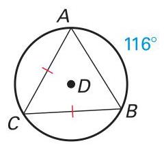

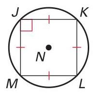

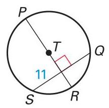

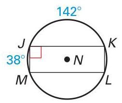

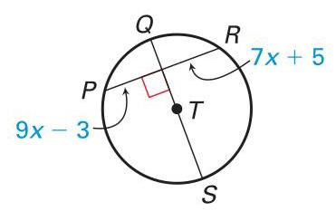

## Exercise Set A (continued)

14. Proof Copy and complete the proof. GIVEN: $\overline{AC}$ is a diameter of $\odot  F.\overline{AC} \bot  \overline{BD}$ PROVE: $\overset{⏜}{AD} \cong  \overset{⏜}{AB}$

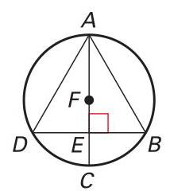

Statements Reasons

1. $\overline{AC}$ is a diameter of $\odot  F.\overline{AC} \bot  \overline{BD}$ 1. ?

2. ? 2. All right angles are congruent.

3. $\overline{DE} \cong  \overline{BE}$ 3. ?

4. $\overline{AE} \cong  \overline{AE}$

5. $\bigtriangleup {AED} \cong  \bigtriangleup {AEB}$

6. ?

7. $\overset{⏜}{AD} \cong  \overset{⏜}{AB}$ 7. ?

15. Proof Copy and complete the proof.

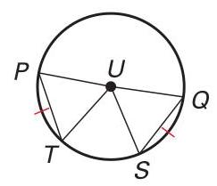

GIVEN: $\overline{PQ}$ is a diameter of $\odot  U.\overset{⏜}{PT} \cong  \overset{⏜}{QS}$

PROVE: $\bigtriangleup {PUT} \cong  \bigtriangleup {QUS}$

<table><tr><td>Statements</td><td>Reasons</td></tr><tr><td>1. $\overline{PQ}$ is a diameter of $\odot  U.\overset{⏜}{PT} \cong  \overset{⏜}{QS}$</td><td>1. ?</td></tr><tr><td>2. ?</td><td>2. Theorem 6.5</td></tr><tr><td>3. $\overline{UP} \cong  \overline{UQ} \cong  \overline{UT} \cong  \overline{US}$</td><td>3. ?</td></tr><tr><td>4. $\bigtriangleup {PUT} \cong  \bigtriangleup {QUS}$</td><td>4. ?</td></tr></table>

16. Multiple Representations Briefly explain what other congruence postulate you could use to prove that $\bigtriangleup {PUT} \cong  \bigtriangleup {QUS}$ in Exercise 15 .

17. Reasoning Plot noncollinear points $X, Y$ , and $Z$ on a piece of paper. Use $\overline{XY}$ and $\overline{XZ}$ to construct perpendicular bisectors to locate the point that is equidistant to each point. With the same diagram, use $\overline{XY}$ and $\overline{YZ}$ to construct perpendicular bisectors to locate the point that is equidistant to each point. Are the two points the same? Would you get the same result if you used $\overline{XZ}$ and $\overline{YZ}$ ? Explain. Exercise a Understand and use properties of chords, tangents, using geometric and algebraic properties. Set B and secants as an application of triangle similarity. 12G3d Justify measurements and relationships in circles

What can you conclude about the diagram? State a theorem that justifies your answer. 2. 3.

1.

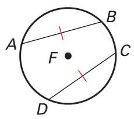

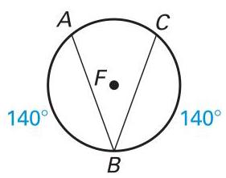

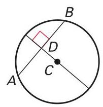

$P$ is the center of the circle. Use the given information to find ${XY}$ . 4. ${ZY} = 3$ 5. ${ZY} = 6,{XW} = 4$ 6. ${CA} = 3$

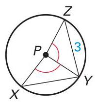

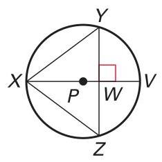

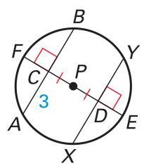

Find the measure of $\overset{⏜}{MN}$ .

7. 8. 9.

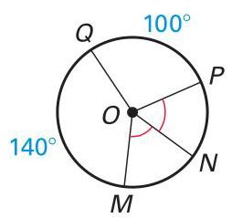

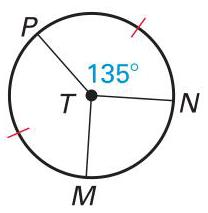

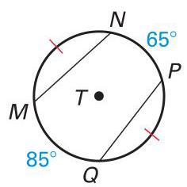

10. 11. 12.

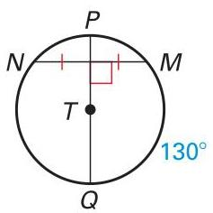

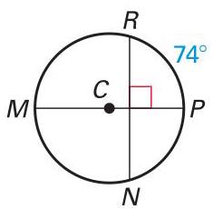

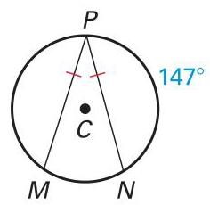

13. 14. 15.

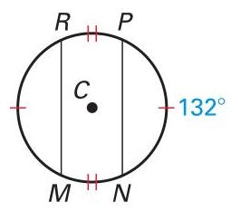

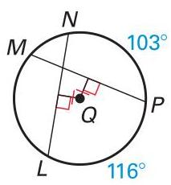

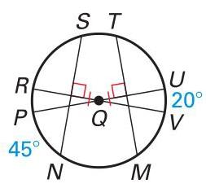

## Exercise Set B (continued)

Use the figure to match the chord or arc with a congruent arc or chord.

16. $\overset{⏜}{FB}$ A. $\overset{⏜}{FE}$

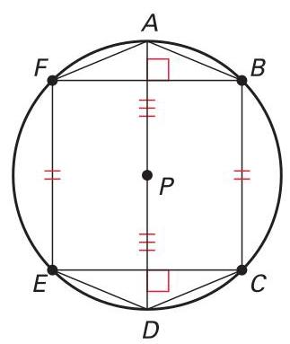

17. $\overline{AF}$ B. $\overset{⏜}{ED}$

18. $\overset{⏜}{BC}$ C. $\overset{⏜}{EC}$

19. $\overline{EC}$ D. $\overline{AB}$

20. $\overset{⏜}{DC}$ E. $\overline{BF}$

21. $\overline{PD}$ F. $\overline{PA}$

22. In $\odot  F,\overline{BG}$ is perpendicular to $\overline{AC}$ . Explain why $\bigtriangleup {ABD} \sim  \bigtriangleup {EDF}$ .

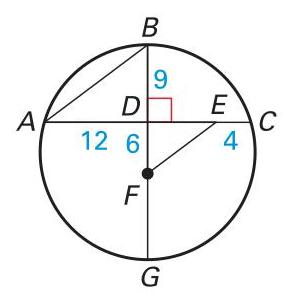

23. Proof Write a paragraph proof.

GIVEN: $X, Y$ , and $Z$ are noncollinear points.

PROVE: There exists a circle that contains $X, Y$ , and $Z$ .

24. Proof Write a paragraph proof.

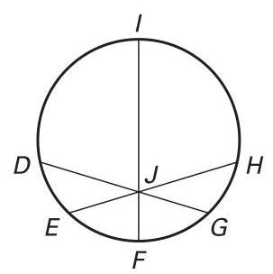

GIVEN: $\overline{IF}$ is a diameter and $\overline{DG} \cong  \overline{EH}$ .

PROVE: $\angle {DJI} \cong  \angle {HJI}$

(Hint: Construct perpendicular bisectors.)

25. Pool You challenge a friend to find a way to use three 10-foot boards to mark the location of the center of a circular swimming pool with a diameter of 12 feet. Your friend centers the top board on the other two boards and makes sure its ends are the same distance from the edge of the pool as shown at the right. Then your friend marks a spot on the exact center of the top board. Is this the center of the pool? Explain.

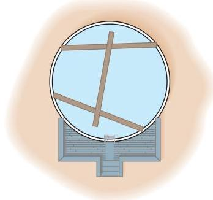

---

LESSON 6.4

---

## Use Inscribed Angles and Polygons

Georgia Performance Standards: MM2G3b, MM2G3d

Goal Use inscribed angles of circles.

Vocabulary

An inscribed angle is an angle whose vertex is on a circle and whose sides contain chords of the circle.

The arc that lies in the interior of an inscribed angle and has endpoints on the angle is called the intercepted arc of the angle.

Theorem 6.9 Measure of an Inscribed Angle Theorem: The measure of an inscribed angle is one half the measure of its intercepted arc.

Theorem 6.10: If two inscribed angles of a circle intercept the same arc, then the angles are congruent.

A polygon is an inscribed polygon if all of its vertices lie on a circle. The circle that contains the vertices is a circumscribed circle.

Theorem 6.11: If a right triangle is inscribed in a circle, then the hypotenuse is a diameter of the circle. Conversely, if one side of an inscribed triangle is a diameter of the circle, then the triangle is a right triangle and the angle opposite the diameter is the right angle.

Theorem 6.12: A quadrilateral can be inscribed in a circle if and only if its opposite angles are supplementary.

## Example 1 Use inscribed angles

## Find (a) ${mYZ}$ and (b) $m\angle {YWZ}$ .

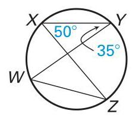

a. $\angle {YXZ}$ intercepts $\overset{⏜}{YZ}$ . So the measure of $\angle {YXZ}$ is one half the measure of $\overset{⏜}{YZ}$ or the measure of $\overset{⏜}{YZ}$ is twice the measure of $\angle {YXZ}$ .

$m\overset{⏜}{YZ} = {2m}\angle {YXZ}$ Theorem 6.9

$= 2\left( {50}^{ \circ  }\right)$ Substitute ${50}^{ \circ  }$ for $m\angle {YXZ}$ .

$= {100}^{ \circ  }$ Multiply.

b. $\angle {YXZ}$ and $\angle {YWZ}$ both intercept $\overset{⏜}{YZ}$ .

$\angle {YWZ} = \angle {YXZ}$ Theorem 6.10

$m\angle {YWZ} = m\angle {YXZ}$ Congruent angles have equal measures.

$m\angle {YWZ} = {50}^{ \circ  }$ Substitute ${50}^{ \circ  }$ for $m\angle {YXZ}$ .

## Guided Practice for Example 1

Use the diagram in Example 1 to find the given measure.

1. $m\overset{⏜}{WX}$ 2. $m\angle {WZX}$ Georgia Performance Standards MM2G3b Understand and use properties of central, inscribed, and related angles. MM2G3d Justify measurements and relationships in circles using geometric and algebraic properties.

## Example 2 Use a circumscribed circle

Home Security You want to illuminate the front exterior of your house with spotlights that have a ${90}^{ \circ  }$ range of projection. You position one spotlight as shown to maximize efficiency. However, it's not quite bright enough, so you want to add additional lights. Where else can you place the spotlights in order to get the brightest results?

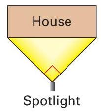

## Solution

From Theorem 6.11, if a right triangle is inscribed in a circle, then the hypotenuse of the triangle is the diameter of the circle. Draw a circle that has the front of the house as the diameter. Place a spotlight anywhere on the semicircle so that the entire front of the house is within the ${90}^{ \circ  }$ range.

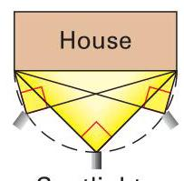

Spotlights

## Guided Practice for Example 2

3. In Example 2, explain how you would position the spotlight if you wanted to illuminate both the front and right side of the house.

## Example 3 Use Theorem 6.12

## Find the value of each variable.

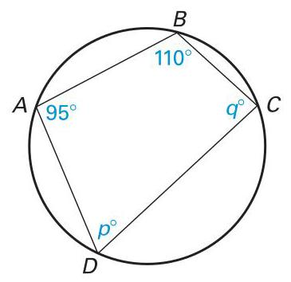

## Solution

Quadrilateral ${ABCD}$ is inscribed in a circle. So, by Theorem 6.12, opposite angles are supplementary.

$m\angle A + m\angle C = {180}^{ \circ  }$ $m\angle B + m\angle D = {180}^{ \circ  }$

${95}^{ \circ  } + {q}^{ \circ  } = {180}^{ \circ  }$ ${110}^{ \circ  } + {p}^{ \circ  } = {180}^{ \circ  }$

$q = {85}$ $p = {70}$

## Guided Practice for Example 3

4. Find the measure of each interior angle of the quadrilateral.

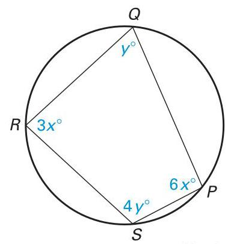

Not drawn to scale

LESSON Exercise MM2G3b Understand and use properties of central, inscribed, and related angles. 6.4 Set A MM2G3d Justify measurements and relationships in circles using geometric and algebraic properties.

1. Multiple Choice In the figure shown, which statement is true?

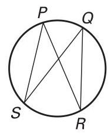

A. $\angle {SPR} \cong  \angle {PSQ}$ B. $\angle {RQS} \cong  \angle {RPS}$

C. $\angle {RPS} \cong  \angle {PRQ}$ D. $\angle {PRQ} \cong  \angle {SQR}$

Find the measure of the indicated angle or arc in $\odot  P$ .

2. ${mS}\overset{⏜}{T}$ 3. $m\overset{⏜}{AB}$ 4. $m\angle {JLM}$

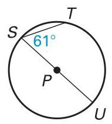

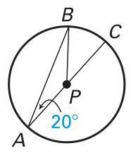

6. $m\angle K$

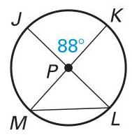

5. $m\angle A$ 7. $m\overset{⏜}{VST}$

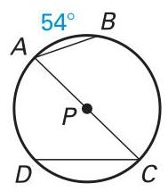

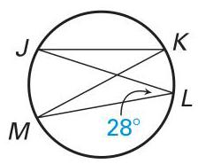

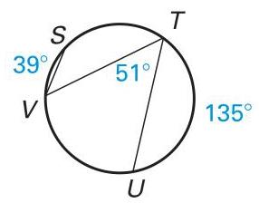

Find the measure of the indicated angle or arc in $\odot  P$ , given $m\overset{⏜}{LM} = {84}^{ \circ  }$ and $m\overset{⏜}{KN} = {116}^{ \circ  }$ .

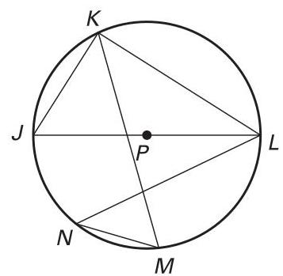

8. $m\angle {JKL}$ 9. $m\angle {MKL}$

10. $m\angle {KMN}$ 11. $m\angle {JKM}$

12. $m\angle {KLN}$ 13. $m\angle {LNM}$

14. $m\overset{⏜}{MJ}$ 15. $m\overset{⏜}{LKJ}$

In Exercises 16-18, find the values of the variables.

16. 17.

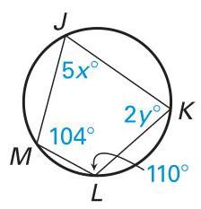

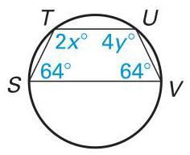

18.

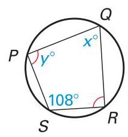

## Exercise Set A (continued)

In Exercises 19-21, find the values of the variables.

19. 20. 21.

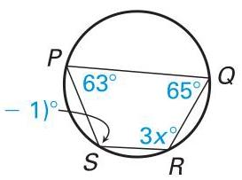

(4y

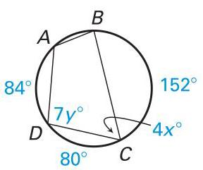

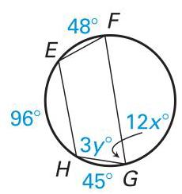

22. Multiple Choice What is the value of $x$ in the figure shown?

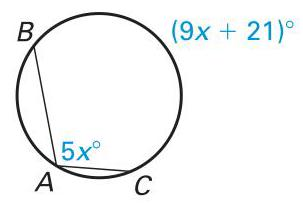

A. 7 B. 12

C. 16 D. 21

23. Proof Copy and complete the proof.

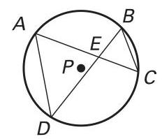

GIVEN: $\odot  P$

PROVE: $\bigtriangleup {AED} \sim  \bigtriangleup {BEC}$

<table><tr><td>Statements</td><td>Reasons</td></tr><tr><td>1. $\odot  P$</td><td>1. Given</td></tr><tr><td>2. ?</td><td>2. Vertica sides f states t</td></tr><tr><td>3. $\angle {CAD} \cong  \angle {DBC}$</td><td>3. ?</td></tr><tr><td>4. $\bigtriangleup {AED} \sim  \bigtriangleup {BEC}$</td><td>4. ?</td></tr></table>

24. Proof Copy and complete the proof.

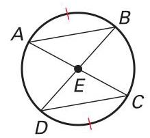

GIVEN: $\overset{⏜}{AB} \cong  \overset{⏜}{CD}$

PROVE: $\bigtriangleup {ABE} \cong  \bigtriangleup {DCE}$ Exercise MM2G3b b Understand and use properties of central, inscribed, Set B and related angles. MM2G3d Justify measurements and relationships in circles using geometric and algebraic properties.

<table><tr><td>Statements</td><td>Reasons</td></tr><tr><td>1. $\overset{⏜}{AB} \cong  \overset{⏜}{CD}$</td><td>1. ?</td></tr><tr><td>2. ?</td><td>2. Theorem 6.5</td></tr><tr><td>3. ?</td><td>3. Vertical Angles Theorem (Two angles are vertical angles if their sides form two pairs of opposite rays. The Vertical Angles Theorem states that vertical angles are congruent.)</td></tr><tr><td>4. $\angle {BDC} \cong  \angle {CAB}$</td><td>4. ?</td></tr><tr><td>5. $\bigtriangleup {ABE} \cong  \bigtriangleup {DCE}$</td><td>5. ?</td></tr></table>

Find the indicated measure in $\odot  O$ .

1. $m\overset{⏜}{BC}$ 2. $m\angle A$ 3. $m\overset{⏜}{AB}$ 6. $m\overset{⏜}{BC}$ 7. $m\angle B$

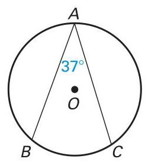

4. $m\angle C$

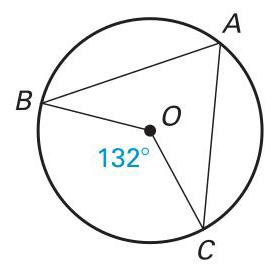

5. $\overset{⏜}{mAC}$

8. $m\angle A$

9. $m\overset{⏜}{BC}$

128°

Find the indicated measure in $\odot  O$ , given $m\overset{⏜}{CD} = {85}^{ \circ  }$ and ${mBE} = {97}^{ \circ  }$ .

10. $m\angle {ABC}$ 11. $m\angle {CED}$

12. $m\angle {BDE}$ 13. $m\angle {CBD}$

14. $m\angle {ABD}$ 15. $m\angle {BCE}$

16. $m\overset{⏜}{AD}$ 17. $m\overset{⏜}{ABC}$

Determine whether a circle can be circumscribed about the figure.

18.

19.

Find the value(s) of the variable(s). (In Exercise 22, $\overline{AB}$ is a diameter of $\odot  O$ .) 22. 24.

25. 26.

27. Proof Write a paragraph proof.

GIVEN: $\odot  C,\overline{FG} \cong  \overline{GE}$

PROVE: $\bigtriangleup {DEF}$ is isosceles.

(Hint: Draw an additional segment.)

28. Proof Write a paragraph proof. GIVEN: $\odot  Q$ and $\odot  P$ are tangent at $R$ . PROVE: $\overline{RS} \cong  \overline{ST}$

29. Error Analysis Describe the error in the diagram of $\odot  C$ . Find two ways to correct the error.

