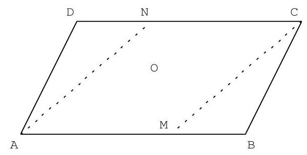
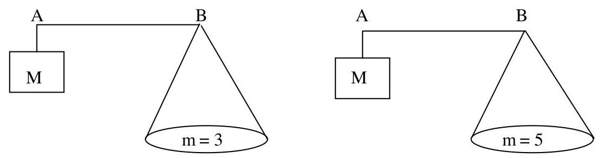
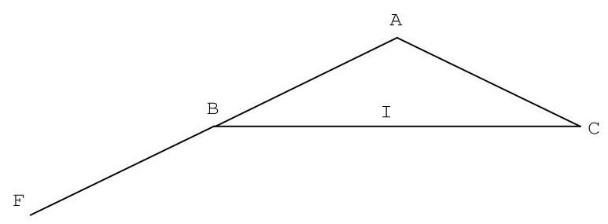
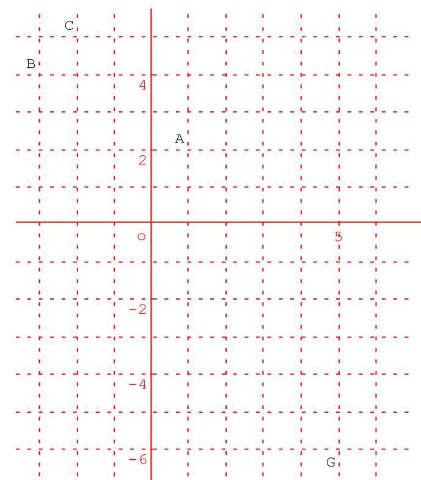
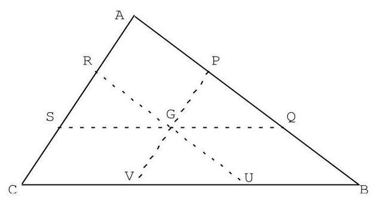
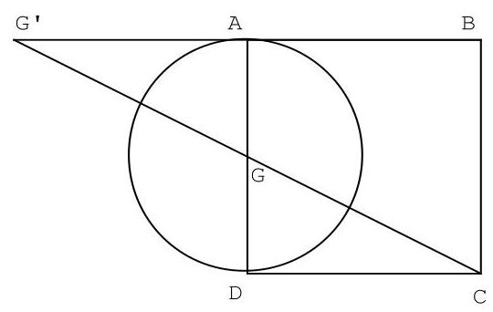
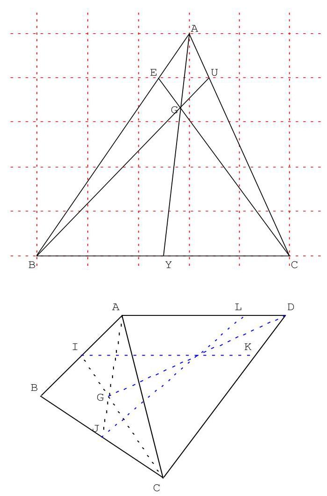

## Exercices avec corrections sur le barycentre  Correction des exercices

Introduction et barycentres de deux points.

Exercice 1.

On considère un triangle ABC. On appelle I le milieu de [BC]. Démontrons que $2\overrightarrow{\mathrm{{AI}}} = \overrightarrow{\mathrm{{AB}}} + \overrightarrow{\mathrm{{AC}}}$ .

$$
\overrightarrow{\mathrm{{AB}}} + \overrightarrow{\mathrm{{AC}}} = \overrightarrow{\mathrm{{AI}}} + \overrightarrow{\mathrm{{IB}}} + \overrightarrow{\mathrm{{AI}}} + \overrightarrow{\mathrm{{IB}}} = 2\overrightarrow{\mathrm{{AI}}} + \underset{0}{\underbrace{\mathrm{{IB}} + \mathrm{{IC}}}} = 2\overrightarrow{\mathrm{{AI}}}.
$$

Exercice 2. A et B sont deux points distincts. N est le point défini par la relation $\overrightarrow{\mathrm{{NA}}} =  - \frac{1}{2}\overrightarrow{\mathrm{{NB}}}$ .

1) Démontrons que les vecteurs $\overrightarrow{\mathrm{{AB}}}$ et $\overrightarrow{\mathrm{{AN}}}$ sont colinéaires. Exprimons $\overrightarrow{\mathrm{{AN}}}$ en fonction $\overrightarrow{\mathrm{{AB}}}$ :

$\overrightarrow{\mathrm{{NA}}} =  - \frac{1}{2}\overrightarrow{\mathrm{{NB}}} \Leftrightarrow  \overrightarrow{\mathrm{{NA}}} =  - \frac{1}{2}\left( {\overrightarrow{\mathrm{{NA}}} + \overrightarrow{\mathrm{{AB}}}}\right)  \Leftrightarrow  \overrightarrow{\mathrm{{NA}}} =  - \frac{1}{2}\overrightarrow{\mathrm{{NA}}} - \frac{1}{2}\overrightarrow{\mathrm{{AB}}} \Leftrightarrow  \overrightarrow{\mathrm{{NA}}} + \frac{1}{2}\overrightarrow{\mathrm{{NA}}} =  - \frac{1}{2}\overrightarrow{\mathrm{{AB}}}$

$\Leftrightarrow  \frac{3}{2}\overrightarrow{\mathrm{{NA}}} =  - \frac{1}{2}\overrightarrow{\mathrm{{AB}}} \Leftrightarrow  \frac{3}{2}\overrightarrow{\mathrm{{AN}}} = \frac{1}{2}\overrightarrow{\mathrm{{AB}}} \Leftrightarrow  \overrightarrow{\mathrm{{AN}}} = \frac{1}{3}\overrightarrow{\mathrm{{AB}}}$ .

2) Pour placer le point $\mathrm{N}$ , on divise le segment $\left\lbrack  \mathrm{{AB}}\right\rbrack$ en trois parties égales et on place $\mathrm{N}$ …

3) Comme $\overrightarrow{\mathrm{{NA}}} =  - \frac{1}{2}\overrightarrow{\mathrm{{NB}}}$ alors $\overrightarrow{\mathrm{{NA}}} + \frac{1}{2}\overrightarrow{\mathrm{{NB}}} = \overrightarrow{0}$ donc $\mathrm{N}$ est le barycentre de(A,1)et $\left( {\mathrm{B},\frac{1}{2}}\right)$ .

Ou encore $2\overrightarrow{\mathrm{{NA}}} + \overrightarrow{\mathrm{{NB}}} = \overrightarrow{0}$ alors $\mathrm{N}$ est le barycentre de(A,2)et(B,1).

Exercice 3. ABCD est un parallélogramme de centre O. Les points M et N sont tels que :

$\overrightarrow{\mathrm{{CD}}} + 3\overrightarrow{\mathrm{{DN}}} = \overrightarrow{0}$(2).

1) Exprimons AM en fonction de $\overrightarrow{\mathrm{{AB}}}$ en utilisant (1).

$3\overrightarrow{\mathrm{{AM}}} - 2\overrightarrow{\mathrm{{AB}}} = \overrightarrow{0} \Leftrightarrow  3\overrightarrow{\mathrm{{AM}}} = 2\overrightarrow{\mathrm{{AB}}} \Leftrightarrow  \overrightarrow{\mathrm{{AM}}} = \frac{2}{3}\overrightarrow{\mathrm{{AB}}}$ . Ce qui permet de placer $\mathrm{M}$ .

2) Comme $3\overrightarrow{\mathrm{{AM}}} - 2\overrightarrow{\mathrm{{AB}}} = \overrightarrow{0}$ alors $3\overrightarrow{\mathrm{{AM}}} - 2\left( {\overrightarrow{\mathrm{{AM}}} + \overrightarrow{\mathrm{{MB}}}}\right)  = \overrightarrow{0}$ puis $3\overrightarrow{\mathrm{{AM}}} - 2\overrightarrow{\mathrm{{AM}}} - 2\overrightarrow{\mathrm{{MB}}} = \overrightarrow{0}$ .

Donc $\overrightarrow{\mathrm{{AM}}} - 2\overrightarrow{\mathrm{{MB}}} = \overrightarrow{0}$ et $\overrightarrow{\mathrm{{MA}}} + 2\overrightarrow{\mathrm{{MB}}} = \overrightarrow{0}$ .

Ainsi $\alpha  = 1$ et $\beta  = 2$ pour que $\mathrm{M}$ soit barycentre des points pondérés $\left( {\mathrm{A},\alpha }\right)$ et $\left( {\mathrm{B},\beta }\right)$ .

3) Exprimons $\overrightarrow{\mathrm{{CN}}}$ en fonction de $\overrightarrow{\mathrm{{CD}}}$ en utilisant (2).

$\overrightarrow{\mathrm{{CD}}} + 3\overrightarrow{\mathrm{{DN}}} = \overrightarrow{0} \Leftrightarrow  \overrightarrow{\mathrm{{CD}}} + 3\left( {\overrightarrow{\mathrm{{DC}}} + \overrightarrow{\mathrm{{CN}}}}\right)  = \overrightarrow{0} \Leftrightarrow  \overrightarrow{\mathrm{{CD}}} + 3\overrightarrow{\mathrm{{DC}}} + 3\overrightarrow{\mathrm{{CN}}} = \overrightarrow{0} \Leftrightarrow  \overrightarrow{\mathrm{{CD}}} - 3\overrightarrow{\mathrm{{CD}}} + 3\overrightarrow{\mathrm{{CN}}} = \overrightarrow{0}$

$\Leftrightarrow   - 2\overrightarrow{\mathrm{{CD}}} + 3\overrightarrow{\mathrm{{CN}}} = \overrightarrow{0} \Leftrightarrow  3\overrightarrow{\mathrm{{CN}}} = 2\overrightarrow{\mathrm{{CD}}} \Leftrightarrow  \overrightarrow{\mathrm{{CN}}} = \frac{2}{3}\overrightarrow{\mathrm{{CD}}}$ .

4) Comme $\overrightarrow{\mathrm{{CD}}} + 3\overrightarrow{\mathrm{{DN}}} = \overrightarrow{0}$ alors $\left( {\overrightarrow{\mathrm{{CN}}} + \overrightarrow{\mathrm{{ND}}}}\right)  + 3\overrightarrow{\mathrm{{DN}}} = \overrightarrow{0}$ donc $\overrightarrow{\mathrm{{CN}}} - \overrightarrow{\mathrm{{DN}}} + 3\overrightarrow{\mathrm{{DN}}} = \overrightarrow{0}$ et $\overrightarrow{\mathrm{{CN}}} + 2\overrightarrow{\mathrm{{DN}}} = \overrightarrow{0}$ ,

donc $\overrightarrow{\mathrm{{NC}}} + 2\overrightarrow{\mathrm{{ND}}} = \overrightarrow{0}$ .

Ainsi $\alpha$ ’ = 1 et $\beta$ ’ = 2 pour que $\mathrm{N}$ soit barycentre des points pondérés $\left( {\mathrm{C},\alpha \text{’}}\right)$ et $\left( {\mathrm{D},\beta \text{’}}\right)$ . 5) Justifions que le quadrilatère NCMA est un parallélogramme et que O est le milieu de [MN].

$\overrightarrow{\mathrm{{AM}}} = \frac{2}{3}\overrightarrow{\mathrm{{AB}}}$ et $\overrightarrow{\mathrm{{CN}}} = \frac{2}{3}\overrightarrow{\mathrm{{CD}}}$ donc $\overrightarrow{\mathrm{{AM}}} = \frac{2}{3}\overrightarrow{\mathrm{{AB}}} =  - \frac{2}{3}\overrightarrow{\mathrm{{CD}}} =  - \overrightarrow{\mathrm{{CN}}} = \overrightarrow{\mathrm{{NC}}}$ .

Comme $\overrightarrow{\mathrm{{AM}}} = \overrightarrow{\mathrm{{NC}}}$ alors NCMA est un parallélogramme. Les diagonales [MN] et [AC] ont le même

milieu. Comme O est le milieu de [AC] alors O est aussi le milieu de [MN].

Exercice 4. B est le milieu de [AC]. Démontrons que le barycentre G de $\left( {\mathrm{A},1}\right) \left( {\mathrm{C},3}\right)$ est le barycentre H

de $\left( {\mathrm{B},2}\right) \left( {\mathrm{C},2}\right)$ . Comme G est le barycentre de(A,1)et(C,3)alors $\overrightarrow{\mathrm{{GA}}} + 3\overrightarrow{\mathrm{{GC}}} = \overrightarrow{0}$ (*).

Donc $\overrightarrow{\mathrm{{GA}}} + 3\left( {\overrightarrow{\mathrm{{GA}}} + \overrightarrow{\mathrm{{AC}}}}\right)  = \overrightarrow{0}$ puis $4\overrightarrow{\mathrm{{GA}}} + 3\overrightarrow{\mathrm{{AC}}} = \overrightarrow{0}$ soit $3\overrightarrow{\mathrm{{AC}}} = 4\overrightarrow{\mathrm{{AG}}}$ d’où $\frac{3}{4}\overrightarrow{\mathrm{{AC}}} = \overrightarrow{\mathrm{{AG}}}$ .

Comme H est le barycentre de(B,2)et(C,2)alors $2\overrightarrow{\mathrm{{HB}}} + 2\overrightarrow{\mathrm{{HC}}} = \overrightarrow{0}$ (H est le milieu de [BC]).

Donc $2\left( {\overrightarrow{\mathrm{{HA}}} + \overrightarrow{\mathrm{{AB}}}}\right)  + 2\overrightarrow{\mathrm{{HA}}} + \overrightarrow{\mathrm{{AC}}} = \overrightarrow{0}$ puis $4\overrightarrow{\mathrm{{HA}}} + 2\overrightarrow{\mathrm{{AB}}} + 2\overrightarrow{\mathrm{{AC}}} = \overrightarrow{0}$ donc $4\overrightarrow{\mathrm{{HA}}} + 3\overrightarrow{\mathrm{{AC}}} = \overrightarrow{0}$ et

$\frac{3}{4}\overrightarrow{\mathrm{{AC}}} = \overrightarrow{\mathrm{{AH}}}$ . Comme $\frac{3}{4}\overrightarrow{\mathrm{{AC}}} = \overrightarrow{\mathrm{{AG}}}$ et $\frac{3}{4}\overrightarrow{\mathrm{{AC}}} = \overrightarrow{\mathrm{{AH}}}$ alors $\overrightarrow{\mathrm{{AG}}} = \overrightarrow{\mathrm{{AH}}}$ .

Autre solution.

Comme H est le barycentre de $\left( {\mathrm{B},2}\right) \left( {\mathrm{C},2}\right)$ , alors $\mathrm{H}$ est le milieu de $\left\lbrack  \mathrm{{BC}}\right\rbrack$ , donc $\overrightarrow{BH} = \frac{1}{2}\overrightarrow{BC}$ .

Comme G est le barycentre de (A,1) et(C,3)alors $\overrightarrow{\mathrm{{GA}}} + 3\overrightarrow{\mathrm{{GC}}} = \overrightarrow{0}$ , puis $\overrightarrow{GB} + \overrightarrow{BA} + 3\left( {\overrightarrow{GB} + \overrightarrow{BC}}\right)  = \overrightarrow{0}$ ,

donc $4\overrightarrow{GB} + 2\overrightarrow{BC} + \underset{\overrightarrow{0}}{\overrightarrow{BC}} + \overrightarrow{BA} = \overrightarrow{0}$ , donc $4\overrightarrow{GB} + 2\overrightarrow{BC} = \overrightarrow{0}$ puis $4\overrightarrow{BG} = 2\overrightarrow{BC}$ et $\overrightarrow{BG} = \frac{1}{2}\overrightarrow{BC}$ .

Donc $\overrightarrow{BH} = \frac{1}{2}\overrightarrow{BC} = \overrightarrow{BG}$ , les points $G$ et $H$ sont confondus.

Exercice 5. Une balance est constituée d'une masse M et d'un plateau fixé à l'extrémité d'une tige. Pour peser une masse $\mathrm{m}$ , le vendeur place,à une position précise, un crochet sur la tige. Cette balance a l'avantage, pour le commerçant, de ne pas manipuler plusieurs masses.

1) Pour chacun des cas suivants, où faut-il fixer le crochet G sur le segment [AB] pour réaliser

l’équilibre ? $\left( {\mathrm{M} = 2\mathrm{\;{kg}}}\right)$

D’après le principe des leviers $\mathrm{M}\overrightarrow{\mathrm{{GB}}} + \mathrm{m}\overrightarrow{\mathrm{{GA}}} = \overrightarrow{0}$ donc $\overrightarrow{\mathrm{{AG}}} = \frac{\mathrm{m}}{\mathrm{m} + \mathrm{M}}\overrightarrow{\mathrm{{AB}}}$ .

Donc $2\overrightarrow{\mathrm{{GB}}} + 3\overrightarrow{\mathrm{{GA}}} = \overrightarrow{0}$ puis $\overrightarrow{\mathrm{{AG}}} = \frac{3}{5}\overrightarrow{\mathrm{{AB}}}$ (situation $1,\mathrm{\;m} = 3$ et $\mathrm{M} = 2$ ).

Donc $2\overrightarrow{\mathrm{{GB}}} + 5\overrightarrow{\mathrm{{GA}}} = \overrightarrow{0}$ puis $\overrightarrow{\mathrm{{AG}}} = \frac{5}{7}\overrightarrow{\mathrm{{AB}}}$ (situation $2,\mathrm{\;m} = 5$ et $\mathrm{M} = 2$ ).

2) Le point $\mathrm{G}$ est tel que $\overrightarrow{\mathrm{{AG}}} = \frac{2}{3}\overrightarrow{\mathrm{{AB}}}$ . Quelle est la masse $\mathrm{m}$ pesée ? (Données : $\mathrm{M} = 2\mathrm{\;{kg}}$ )

$\overrightarrow{\mathrm{{AG}}} = \frac{2}{3}\overrightarrow{\mathrm{{AB}}} \Leftrightarrow  \overrightarrow{\mathrm{{AG}}} = \frac{2}{3}\left( {\overrightarrow{\mathrm{{AG}}} + \overrightarrow{\mathrm{{GB}}}}\right)  \Leftrightarrow  3\overrightarrow{\mathrm{{AG}}} = 2\overrightarrow{\mathrm{{AG}}} + 2\overrightarrow{\mathrm{{GB}}} \Leftrightarrow  \overrightarrow{\mathrm{{GA}}} + 2\overrightarrow{\mathrm{{GB}}} = \overrightarrow{0}$

$\Leftrightarrow  2\overrightarrow{\mathrm{{GA}}} + 4\overrightarrow{\mathrm{{GB}}} = \overrightarrow{0}$ . D’après le principe des leviers ( $\mathrm{M}\overrightarrow{\mathrm{{GB}}} + \mathrm{m}\overrightarrow{\mathrm{{GA}}} = \overrightarrow{0}$ ) on a donc $\mathrm{m} = 4$ .

1er BAC Sciences Expérimentales BIOF

Exercice 6. Soit ABC un triangle isocèle en A tel que BC = 8 cm et BA = 5 cm, I le milieu de [BC].

1) Comme $\overrightarrow{\mathrm{{BF}}} =  - \overrightarrow{\mathrm{{BA}}}$ (ou $\overrightarrow{\mathrm{{BF}}} = \overrightarrow{\mathrm{{AB}}}$ ), B est le milieu de [AF].

Donc $\overrightarrow{\mathrm{{BF}}} + \overrightarrow{\mathrm{{BA}}} = \overrightarrow{0}$ puis $\overrightarrow{\mathrm{{BF}}} + \overrightarrow{\mathrm{{BF}}} + \overrightarrow{\mathrm{{FA}}} = \overrightarrow{0}$ et $2\overrightarrow{\mathrm{{BF}}} + \overrightarrow{\mathrm{{FA}}} = \overrightarrow{0}$ soit $2\overrightarrow{\mathrm{{BF}}} - \overrightarrow{\mathrm{{AF}}} = \overrightarrow{0}$ .

On en déduit que $\frac{\mathrm{F}}{1} = \operatorname{bar}\left( {\frac{\mathrm{B}}{2} \mid  \frac{\mathrm{A}}{-1}}\right)$ .

2) P étant un point du plan, réduire (en justifiant) chacune des sommes suivantes :

$$
\frac{1}{2}\overrightarrow{\mathrm{{PB}}} + \frac{1}{2}\overrightarrow{\mathrm{{PC}}} = \frac{1}{2}\left( {\overrightarrow{\mathrm{{PB}}} + \overrightarrow{\mathrm{{PC}}}}\right)  = \frac{1}{2}\overrightarrow{\mathrm{{PI}}}\text{(identité du parallélogramme).}
$$

$$
- \overrightarrow{\mathrm{{PA}}} + 2\overrightarrow{\mathrm{{PB}}} = \overrightarrow{\mathrm{{PF}}}\operatorname{car}\frac{\mathrm{F}}{1} = \operatorname{bar}\left( {\frac{\mathrm{B}}{2} \mid  \frac{\mathrm{A}}{-1}}\right) .
$$

$$
2\overrightarrow{\mathrm{{PB}}} - 2\overrightarrow{\mathrm{{PA}}} = 2\overrightarrow{\mathrm{{PB}}} + 2\overrightarrow{\mathrm{{AP}}} = 2\overrightarrow{\mathrm{{AP}}} + 2\overrightarrow{\mathrm{{PB}}} = 2\left( {\overrightarrow{\mathrm{{AP}}} + \overrightarrow{\mathrm{{PB}}}}\right)  = 2\overrightarrow{\mathrm{{AB}}}.
$$

3) Déterminons l'ensemble des points M du plan vérifiant :

$$
\begin{Vmatrix}{\frac{1}{2}\overrightarrow{\mathrm{{MB}}} + \frac{1}{2}\overrightarrow{\mathrm{{MC}}}}\end{Vmatrix} = \begin{Vmatrix}{-\overrightarrow{\mathrm{{MA}}} + 2\overrightarrow{\mathrm{{MB}}}}\end{Vmatrix}.
$$

Donc $\parallel \overrightarrow{\mathrm{{MI}}}\parallel  = \parallel \overrightarrow{\mathrm{{MF}}}\parallel$ (d’après ce qui précède).

L'ensemble des points M vérifiant cette relation est donc la médiatrice de [IF].

4) Déterminons l’ensemble des points $\mathrm{N}$ du plan vérifiant :

$$
\parallel \overrightarrow{\mathrm{{NB}}} + \overrightarrow{\mathrm{{NC}}}\parallel  = \parallel 2\overrightarrow{\mathrm{{NB}}} - 2\overrightarrow{\mathrm{{NA}}}\parallel .
$$

Donc $\parallel 2\overrightarrow{\mathrm{{NI}}}\parallel  = \parallel 2\overrightarrow{\mathrm{{AB}}}\parallel$ d’après la question 2).

L'ensemble des points M est le cercle de centre I et de rayon AB.

Barycentres de trois points et plus.

Exercice 7. Le centre de gravité comme isobarycentre.

ABC est un triangle, A' est le milieu de [BC]. On se propose de démontrer la propriété :

« G est le centre de gravité du triangle ABC » équivaut à « GA + GB + GC = 0 » ».

1) L’égalité vectorielle $2\overrightarrow{\mathrm{{GA}}}{}^{\prime } =  - \overrightarrow{\mathrm{{GA}}}$ caractérise le centre de gravité $\mathrm{G}$ .

2) a) Prouvons que $\overrightarrow{\mathrm{{GB}}} + \overrightarrow{\mathrm{{GC}}} = 2\overrightarrow{\mathrm{{GA}}}$ .

$$
\overrightarrow{\mathrm{{GB}}} + \overrightarrow{\mathrm{{GC}}} = \overrightarrow{\mathrm{G{A}^{\prime }}} + \overrightarrow{\mathrm{{A}^{\prime }B}} + \overrightarrow{\mathrm{G{A}^{\prime }}} + \overrightarrow{\mathrm{{A}^{\prime }C}} = 2\overrightarrow{\mathrm{G{A}^{\prime }}} + \underset{0}{\underbrace{\mathrm{{A}^{\prime }B} + \overrightarrow{\mathrm{{A}^{\prime }C}}}} = 2\overrightarrow{\mathrm{G{A}^{\prime }}}.
$$

b) On en déduit la propriété énoncée au début de l'exercice :

$$
\overrightarrow{\mathrm{{GB}}} + \overrightarrow{\mathrm{{GC}}} = 2\overrightarrow{\mathrm{{GA}}}\text{ } \Leftrightarrow  \;\overrightarrow{\mathrm{{GB}}} + \overrightarrow{\mathrm{{GC}}} =  - \overrightarrow{\mathrm{{GA}}} \Leftrightarrow  \;\overrightarrow{\mathrm{{GA}}} + \overrightarrow{\mathrm{{GB}}} + \overrightarrow{\mathrm{{GC}}} = \overrightarrow{0}\text{ . }
$$

3) a) Un triangle est tenu en équilibre sur une pointe à condition que celle-ci soit au centre de gravité.

b) $\overrightarrow{\mathrm{{GA}}} + \overrightarrow{\mathrm{{GB}}} + \overrightarrow{\mathrm{{GC}}} = \overrightarrow{0}\; \Leftrightarrow  \;\mathrm{G}$ est l’isobarycentre des points $\mathrm{A},\mathrm{B},\mathrm{C}$

$\Leftrightarrow$ Gest barycentre des points $\left( {\mathrm{A},1}\right) \left( {\mathrm{B},1}\right) \left( {\mathrm{C},1}\right)$ .

Exercice 8. ABCD est un carré et K le barycentre des points pondérés (A, 2), (B, -1), (C, 2) (D, 1). 1) I est le barycentre des points pondérés $\left( {\mathrm{A},2}\right) ,\left( {\mathrm{B}, - 1}\right)$

$$
2\overrightarrow{\mathrm{{IA}}} - \overrightarrow{\mathrm{{IB}}} = \overrightarrow{0} \Leftrightarrow  \;2\overrightarrow{\mathrm{{IA}}} - \left( {\overrightarrow{\mathrm{{IA}}} + \overrightarrow{\mathrm{{AB}}}}\right)  = \overrightarrow{0} \Leftrightarrow  \;2\overrightarrow{\mathrm{{IA}}} - \overrightarrow{\mathrm{{IA}}} - \overrightarrow{\mathrm{{AB}}} = \overrightarrow{0} \Leftrightarrow  \;\overrightarrow{\mathrm{{IA}}} - \overrightarrow{\mathrm{{AB}}} = \overrightarrow{0}
$$

$\overrightarrow{\mathrm{{AB}}} = \overrightarrow{\mathrm{{IA}}} \Leftrightarrow  \overrightarrow{\mathrm{{AB}}} =  - \overrightarrow{\mathrm{{AI}}}$ . Ce qui permet de placer le point I (A est le milieu de [IB]).

J est le barycentre des points pondérés(C,2)et(D,1)

$$
2\overrightarrow{\mathrm{{JC}}} + \overrightarrow{\mathrm{{JD}}} = \overrightarrow{0} \Leftrightarrow  \;2\overrightarrow{\mathrm{{JC}}} + \overrightarrow{\mathrm{{JC}}} + \overrightarrow{\mathrm{{CD}}} = \overrightarrow{0} \Leftrightarrow  \;3\overrightarrow{\mathrm{{JC}}} + \overrightarrow{\mathrm{{CD}}} = \overrightarrow{0} \Leftrightarrow  \;3\overrightarrow{\mathrm{{CJ}}} = \overrightarrow{\mathrm{{CD}}} \Leftrightarrow  \;\overrightarrow{\mathrm{{CJ}}} = \frac{1}{3}\overrightarrow{\mathrm{{CD}}}.
$$

Ce qui permet de placer le point J.

2) Réduisons l’écriture des vecteurs suivants : $2\overrightarrow{\mathrm{{KA}}} - \overrightarrow{\mathrm{{KB}}}$ et $2\overrightarrow{\mathrm{{KC}}} + \overrightarrow{\mathrm{{KD}}}$ .

$2\overrightarrow{\mathrm{{KA}}} - \overrightarrow{\mathrm{{KB}}} = \overrightarrow{\mathrm{{KI}}}$ car I est le barycentre des points pondérés $\left( {\mathrm{A},2}\right) ,\left( {\mathrm{B}, - 1}\right)$ .

$2\overrightarrow{\mathrm{{KC}}} + \overrightarrow{\mathrm{{KD}}} = 3\overrightarrow{\mathrm{{KJ}}}$ car J est le barycentre des points pondérés(C,2)et(D,1)

Comme K est le barycentre des points pondérés $\left( {\mathrm{A},2}\right) ,\left( {\mathrm{B}, - 1}\right) ,\left( {\mathrm{C},2}\right) \left( {\mathrm{D},1}\right)$ alors

$$
\underset{\overrightarrow{\mathrm{{KI}}}}{\underbrace{2\overrightarrow{\mathrm{{KA}}} - \overrightarrow{\mathrm{{KB}}}}} + \underset{3\overrightarrow{\mathrm{{KJ}}}}{\underbrace{2\overrightarrow{\mathrm{{KC}}} + \overrightarrow{\mathrm{{KD}}}}} = \overrightarrow{0}\text{ donc }\overrightarrow{\mathrm{{KI}}} + 3\overrightarrow{\mathrm{{KJ}}} = \overrightarrow{0}.
$$

Ainsi K est le barycentre de (I, 1) et (J, 3).

3) Pour construire le point K, on place d’abord I (sachant que I est le symétrique de B par rapport à A)

puis on place $\mathrm{J}$ (sachant que $\overrightarrow{\mathrm{{CJ}}} = \frac{1}{3}\overrightarrow{\mathrm{{CD}}}$ ). Pour finir on utilise :

$$
\overrightarrow{\mathrm{{KI}}} + 3\overrightarrow{\mathrm{{KJ}}} = \overrightarrow{0} \Leftrightarrow  \overrightarrow{\mathrm{{KI}}} + 3\left( {\overrightarrow{\mathrm{{KI}}} + \overrightarrow{\mathrm{{IJ}}}}\right)  = \overrightarrow{0} \Leftrightarrow  \overrightarrow{\mathrm{{KI}}} + 3\overrightarrow{\mathrm{{KI}}} + 3\overrightarrow{\mathrm{{IJ}}} = \overrightarrow{0} \Leftrightarrow  4\overrightarrow{\mathrm{{KI}}} + 3\overrightarrow{\mathrm{{IJ}}} = \overrightarrow{0}
$$

$$
4\overrightarrow{\mathrm{{IK}}} = 3\overrightarrow{\mathrm{{IJ}}} \Leftrightarrow  \overrightarrow{\mathrm{{IK}}} = \frac{3}{4}\overrightarrow{\mathrm{{IJ}}}\text{, ce qui permet de placer le point}\mathrm{K}\text{.}
$$

La méthode est à retenir :

Pour placer le barycentre de 4 points $\left( {\mathrm{A},\alpha }\right) ,\left( {\mathrm{B},\beta }\right) ,\left( {\mathrm{C},\gamma }\right) \left( {\mathrm{D},\delta }\right)$ :

On construit d’abord I le barycentre de $\left( {\mathrm{A},\alpha }\right) \left( {\mathrm{B},\beta }\right)$ et J le barycentre de $\left( {\mathrm{C},\gamma }\right) \left( {\mathrm{D},\delta }\right)$ .

Puis on construit $\mathrm{K}$ le barycentre de $\left( {\mathrm{I},\alpha  + \beta }\right)$ et $\left( {\mathrm{J},\gamma  + \delta }\right)$ .

Exercice 9. On désigne par $\mathrm{G}$ le barycentre de $\left( {\mathrm{A},1}\right) ,\left( {\mathrm{B},4}\right)$ et(C, - 3).

1) I est le barycentre des points(B,4)et(C, - 3)donc $4\overrightarrow{\mathrm{{IB}}} - 3\overrightarrow{\mathrm{{IC}}} = \overrightarrow{0}$ puis $4\overrightarrow{\mathrm{{IB}}} - 3\left( {\overrightarrow{\mathrm{{IB}}} + \overrightarrow{\mathrm{{BC}}}}\right)  = \overrightarrow{0}$ .

Donc $4\overrightarrow{\mathrm{{IB}}} - 3\overrightarrow{\mathrm{{IB}}} - 3\overrightarrow{\mathrm{{BC}}} = \overrightarrow{0}$ et $\overrightarrow{\mathrm{{IB}}} - 3\overrightarrow{\mathrm{{BC}}} = \overrightarrow{0}$ d’où $\overrightarrow{\mathrm{{BI}}} = 3\overrightarrow{\mathrm{{CB}}}$ .

Cette relation permet de construire le point I sans problème.

2) G est le barycentre des points $\left( {A,1}\right) ,\left( {B,4}\right)$ et(C, - 3)donc par associativité du barycentre G est aussi

barycentre des points(A,1)et(I,1). Cela entraîne que $\overrightarrow{\mathrm{{GA}}} + \overrightarrow{\mathrm{{GI}}} = \overrightarrow{0}$ .

Autrement dit, G est le milieu de [AI].

Exercice 10. ABC est un triangle. On note G le barycentre de $\left( {A,2}\right) ,\left( {B,1}\right)$ et(C,1). Le but de

l'exercice est de déterminer la position précise du point $\mathrm{G}$ .

1) Soit I le milieu de [BC], on a $\overrightarrow{\mathrm{{GB}}} + \overrightarrow{\mathrm{{GC}}} = \overrightarrow{\mathrm{{GI}}} + \overrightarrow{\mathrm{{IB}}} + \overrightarrow{\mathrm{{GI}}} + \overrightarrow{\mathrm{{IB}}} = 2\overrightarrow{\mathrm{{GI}}} + \underset{\overrightarrow{\mathrm{o}}}{\underbrace{\overrightarrow{\mathrm{{IB}}} + \overrightarrow{\mathrm{{IB}}}}} = 2\overrightarrow{\mathrm{{GI}}}$ .

2) G le barycentre des points $\left( {\mathrm{A},2}\right) ,\left( {\mathrm{B},1}\right)$ et(C,1)donc $2\overrightarrow{\mathrm{{GA}}} + \overrightarrow{\mathrm{{GB}}} + \overrightarrow{\mathrm{{GC}}} = \overrightarrow{0}$ .

Comme $\overrightarrow{\mathrm{{GB}}} + \overrightarrow{\mathrm{{GC}}} = 2\overrightarrow{\mathrm{{GI}}}$ , on a donc $2\overrightarrow{\mathrm{{GA}}} + 2\overrightarrow{\mathrm{{GI}}} = \overrightarrow{0}$ . Ainsi G est barycentre des points (A,2) et (I,2).

3) Ceci montre que G est le milieu de [AI].

Autre raisonnement possible : I le milieu de [BC] donc I est le barycentre des points (B, 1) et (C, 1).

Comme G est le barycentre des points $\left( {\mathrm{A},2}\right) ,\left( {\mathrm{B},1}\right)$ et(C,1), on en déduit par associativité du

barycentre, que G est barycentre des points (A, 2) et (I, 2). Donc G est le milieu de [AI].

Exercice 11.

1) Plaçons dans un repère les

points $\mathrm{A}\left( {1,2}\right) ,\mathrm{B}\left( {-3,4}\right)$ et

C(-2,5).

Soit $\mathrm{G}$ le barycentre des points pondérés $\left( {\mathrm{A},3}\right) ,\left( {\mathrm{B},2}\right)$ et(C, - 4).

2) Les coordonnées de G sont données par les formules :

$$
{\mathrm{x}}_{\mathrm{G}} = \frac{3{\mathrm{x}}_{\mathrm{A}} + 2{\mathrm{x}}_{\mathrm{B}} - 4{\mathrm{x}}_{\mathrm{C}}}{3 + 2 - 4}\text{ et }{\mathrm{y}}_{\mathrm{G}} = \frac{3{\mathrm{y}}_{\mathrm{A}} + 2{\mathrm{y}}_{\mathrm{B}} - 4{\mathrm{y}}_{\mathrm{C}}}{3 + 2 - 4}\text{. }
$$

$$
{\mathrm{x}}_{\mathrm{G}} = \frac{3 \times  1 + 2 \times  \left( {-3}\right)  - 4 \times  \left( {-2}\right) }{3 + 2 - 4} = 3 - 6 + 8 = 5\text{ et }{\mathrm{y}}_{\mathrm{G}} = \frac{3 \times  2 + 2 \times  4 - 4 \times  5}{3 + 2 - 4} = 6 + 8 - {20} =  - 6.
$$

On place alors le point G.

3) On a $\overrightarrow{\mathrm{{OB}}}\left( \begin{matrix}  - 3 \\  4 \end{matrix}\right)$ et $\overrightarrow{\mathrm{{OG}}}\left( \begin{matrix} 5 \\   - 6 \end{matrix}\right)$ . Les vecteurs $\overrightarrow{\mathrm{{OB}}}$ et $\overrightarrow{\mathrm{{OG}}}$ ne sont donc pas colinéaires.

Les points O, B et g ne sont pas alignés et la droite (BG) ne passe pas par l'origine du repère.

Exercice 12. ABC est un triangle. Soit $\mathrm{G}$ le barycentre de $\left( {\mathrm{A},1}\right) ,\left( {\mathrm{B},3}\right)$ et(C, - 3).

Comme G est barycentre des points $\left( {\mathrm{A},1}\right) ,\left( {\mathrm{B},3}\right)$ et(C, - 3)alors $\overrightarrow{\mathrm{{GA}}} + 3\overrightarrow{\mathrm{{GB}}} - 3\overrightarrow{\mathrm{{GC}}} = \overrightarrow{0}$ .

Donc $\overrightarrow{\mathrm{{GA}}} + 3\overrightarrow{\mathrm{{CG}}} + 3\overrightarrow{\mathrm{{GB}}} = \overrightarrow{0}$ puis $\overrightarrow{\mathrm{{GA}}} + 3\left( {\overrightarrow{\mathrm{{CG}}} + \overrightarrow{\mathrm{{GB}}}}\right)  = \overrightarrow{0}$ soit $\overrightarrow{\mathrm{{GA}}} + 3\overrightarrow{\mathrm{{CB}}} = \overrightarrow{0}$ et $\overrightarrow{\mathrm{{AG}}} = 3\overrightarrow{\mathrm{{CB}}}$ .

Ceci montre que les vecteurs ÂG et CB sont colinéaires. Donc les droites (AG) et (BC) sont parallèles.

Exercice 13. ABC est un triangle. On considère le barycentre A’ de (B,2) et (C, -3), le barycentre B’ de (A, 5) et (C, -3) ainsi que le barycentre C' de (A, 5) et (B, 2).

- Considérons G le barycentre des points $\left( {\mathrm{A},5}\right) ,\left( {\mathrm{B},2}\right)$ et(C, - 3). Comme A’ est le barycentre des points(B,2)et(C, - 3), par associativité du barycentre, $\mathrm{G}$ est aussi le barycentre des points(A,5)et (A', -1). Ceci prouve que les points A, G et A' sont alignés.

- G est le barycentre des points $\left( {\mathrm{A},5}\right) ,\left( {\mathrm{B},2}\right)$ et(C, - 3). Comme B’ est le barycentre des points(A,5)et (C, - 3), par associativité du barycentre, G est aussi le barycentre des points $\left( {\mathrm{B}\text{’},2}\right)$ et(B,2). Ceci prouve que les points B, G et B' sont alignés.

- G est le barycentre des points $\left( {\mathrm{A},5}\right) ,\left( {\mathrm{B},2}\right)$ et(C, - 3). Comme C’ est le barycentre des points(A,5)et (B, 2), par associativité du barycentre, G est aussi le barycentre des points (C', 7) et (C, -3). Ceci prouve que les points B, G et B’ sont alignés. Donc les droites (AA’), (BB’) et (CC’) sont concourantes.

Exercice 14. ABC est un triangle de centre de gravité G.

On définit les points P, Q, R, S, U, V par :

$$
\overrightarrow{\mathrm{{AP}}} = \frac{1}{3}\overrightarrow{\mathrm{{AB}}},\overrightarrow{\mathrm{{AQ}}} = \frac{2}{3}\overrightarrow{\mathrm{{AB}}},\overrightarrow{\mathrm{{AR}}} = \frac{1}{3}\overrightarrow{\mathrm{{AC}}},\overrightarrow{\mathrm{{AS}}} = \frac{2}{3}\overrightarrow{\mathrm{{AC}}},\overrightarrow{\mathrm{{BU}}} = \frac{1}{3}\overrightarrow{\mathrm{{BC}}},\overrightarrow{\mathrm{{BV}}} = \frac{2}{3}\overrightarrow{\mathrm{{BC}}}
$$

1) $\overrightarrow{\mathrm{{AP}}} = \frac{1}{3}\overrightarrow{\mathrm{{AB}}}$ donc $3\overrightarrow{\mathrm{{AP}}} = \overrightarrow{\mathrm{{AB}}}$ et $3\overrightarrow{\mathrm{{AP}}} = \overrightarrow{\mathrm{{AP}}} + \overrightarrow{\mathrm{{PB}}}$ puis $2\overrightarrow{\mathrm{{AP}}} + \overrightarrow{\mathrm{{BP}}} = \overrightarrow{0}$ , donc $\frac{\mathrm{P}}{3} = \operatorname{bar}\left( {\frac{\mathrm{A}}{2} \mid  \frac{\mathrm{B}}{1}}\right)$ .

$\overrightarrow{\mathrm{{BV}}} = \frac{2}{3}\overrightarrow{\mathrm{{BC}}}$ donc $3\overrightarrow{\mathrm{{BV}}} = 2\overrightarrow{\mathrm{{BC}}}$ et $3\overrightarrow{\mathrm{{BV}}} = 2\left( {\overrightarrow{\mathrm{{BV}}} + \overrightarrow{\mathrm{{VC}}}}\right)$ puis $\overrightarrow{\mathrm{{BV}}} = 2\overrightarrow{\mathrm{{VC}}}$ et $2\overrightarrow{\mathrm{{VC}}} + \overrightarrow{\mathrm{{VB}}} = \overrightarrow{0}$ . Donc

$\frac{\mathrm{V}}{3} = \operatorname{bar}\left( {\frac{\mathrm{C}}{2} \mid  \frac{\mathrm{B}}{1}}\right) .$

2) On a $\frac{\mathrm{G}}{6} = \operatorname{bar}\left( {\frac{\mathrm{A}}{2}\left| \frac{\mathrm{B}}{2}\right| \frac{\mathrm{C}}{2}}\right)$ . Comme $\frac{\mathrm{P}}{3} = \operatorname{bar}\left( {\frac{\mathrm{A}}{2}\left| {\;\frac{\mathrm{B}}{1}}\right. }\right)$ et $\frac{\mathrm{V}}{3} = \operatorname{bar}\left( {\frac{\mathrm{C}}{2}\left| {\;\frac{\mathrm{B}}{1}}\right. }\right)$ , l’associativité du

barycentre donne $\frac{\mathrm{G}}{6} = \operatorname{bar}\left( {\frac{\mathrm{P}}{3} \mid  \frac{\mathrm{V}}{3}}\right)$ . On en déduit que G est le milieu de [PV].

3) On démontre, de même, que G est le milieu de [RU] et de [SQ] (inutile de refaire les calculs). G est le milieu de [RU] et de [PV] donc RPUV est un parallélogramme.

Exercice 15. Soit ABC un triangle et G un point vérifiant : $\overrightarrow{\mathrm{{AB}}} - 4\overrightarrow{\mathrm{{GA}}} - 2\overrightarrow{\mathrm{{GB}}} - 3\overrightarrow{\mathrm{{GC}}} = \overrightarrow{0}$ . On a $\overrightarrow{\mathrm{{AB}}} - 4\overrightarrow{\mathrm{{GA}}} - 2\overrightarrow{\mathrm{{GB}}} - 3\overrightarrow{\mathrm{{GC}}} = \overrightarrow{0}$ donc $\overrightarrow{\mathrm{{AG}}} + \overrightarrow{\mathrm{{GB}}} - 4\overrightarrow{\mathrm{{GA}}} - 2\overrightarrow{\mathrm{{GB}}} - 3\overrightarrow{\mathrm{{GC}}} = \overrightarrow{0}$ .

Ainsi $- 5\overrightarrow{\mathrm{{GA}}} - \overrightarrow{\mathrm{{GB}}} - 3\overrightarrow{\mathrm{{GC}}} = \overrightarrow{0}$ et $5\overrightarrow{\mathrm{{GA}}} + \overrightarrow{\mathrm{{GB}}} + 3\overrightarrow{\mathrm{{GC}}} = \overrightarrow{0}$ donc $\frac{\mathrm{G}}{9} = \operatorname{bar}\left( {\frac{\mathrm{A}}{5}\left| \frac{\mathrm{B}}{1}\right| \frac{\mathrm{C}}{3}}\right)$ .

Donc le point $\mathrm{G}$ est le barycentre des points pondérés $\left( {\mathrm{A},5}\right) ,\left( {\mathrm{B},1}\right)$ et(C,3).

Exercice 16. ABCD est un carré.

1) Notons $\frac{\mathrm{G}}{2} = \operatorname{bar}\left( {\frac{\mathrm{A}}{2}\left| \frac{\mathrm{B}}{-1}\right| \frac{\mathrm{C}}{1}}\right)$ , on a, pour tout point $\mathrm{M}$ du plan $2\overrightarrow{\mathrm{{MA}}} - \overrightarrow{\mathrm{{MB}}} + \overrightarrow{\mathrm{{MC}}} = 2\overrightarrow{\mathrm{{MG}}}$ .

Donc $\begin{Vmatrix}{2\overrightarrow{\mathrm{{MA}}} - \overrightarrow{\mathrm{{MB}}} + \overrightarrow{\mathrm{{MC}}}}\end{Vmatrix} = \mathrm{{AB}} \Leftrightarrow  \begin{Vmatrix}{2\overrightarrow{\mathrm{{MG}}}}\end{Vmatrix} = \mathrm{{AB}} \Leftrightarrow  \begin{Vmatrix}\overrightarrow{\mathrm{{MG}}}\end{Vmatrix} = \frac{\mathrm{{AB}}}{2}$ .

L’ensemble E des points M du plan tels que $\parallel 2\overrightarrow{\mathrm{{MA}}} - \overrightarrow{\mathrm{{MB}}} + \overrightarrow{\mathrm{{MC}}}\parallel  = \mathrm{{AB}}$ est donc le cercle de centre G et de rayon $\frac{\mathrm{{AB}}}{2}$ .

2) Représentons cet ensemble E.

Pour construire G, on commence par construire G' le

barycentre des points(A,2)et(B, - 1).

Puis par associativité du barycentre, g est le barycentre des points (G', 1) et (C, 1) donc le milieu de [CG'].

Exercice 17. ABCD est un quadrilatère et G est le barycentre de (A, 1), (B, 1) (C, 3) (D, 3). Plusieurs constructions sont possibles. Par exemple, on construit le milieu I de [AB] qui est le barycentre de(A,1)et(B,1). Puis on construit le milieu $\mathrm{J}$ de $\left\lbrack  \mathrm{{CD}}\right\rbrack$ qui est le barycentre de(C,3)et(D,3). Par associativité du barycentre, le point $\mathrm{G}$ est alors le barycentre de(I,2)et(J,6). Donc le point $\mathrm{G}$ vérifie la

relation $2\overrightarrow{\mathrm{{GI}}} + 6\overrightarrow{\mathrm{{GJ}}} = \overrightarrow{0}$ soit $\overrightarrow{\mathrm{{GI}}} + 3\left( {\overrightarrow{\mathrm{{GI}}} + \overrightarrow{\mathrm{{IJ}}}}\right)  = \overrightarrow{0}$ puis $4\overrightarrow{\mathrm{{GI}}} + 3\overrightarrow{\mathrm{{IJ}}} = \overrightarrow{0}$ et $4\overrightarrow{\mathrm{{IG}}} = 3\overrightarrow{\mathrm{{IJ}}}$ d’où $\overrightarrow{\mathrm{{IG}}} = \frac{3}{4}\overrightarrow{\mathrm{{IJ}}}$ .

Ceci permet de placer le point $\mathrm{G}$ sans difficulté.

Exercice 18.

Dans le triangle ABC, E est le milieu de [AB] et G est le barycentre de (A, -2), (B, -2), (C, 15). Comme E est le milieu de [AB], c’est le barycentre de (A, -2), (B, - 2). Par associativité du barycentre, G est alors le barycentre de(E, - 4)et(C,15). Ceci montre que les points G, C, et E sont alignés.

Exercice 19. ABCD est un quadrilatère. On note G son isobarycentre. Le but de cet exercice est de préciser la position du point $\mathrm{G}$ .

1) On note I le milieu de [AC] et J le milieu de [BD]. I est le barycentre de (A,1) et (C,1) tandis que J est le barycentre de(B,1)et(D,1). On en déduit par associativité du barycentre que G, barycentre de $\left( {\mathrm{A},1}\right) ,\mathrm{B},1),\left( {\mathrm{C},1}\right) ,\left( {\mathrm{D},1}\right)$ est aussi le barycentre de(I,2)et(J,2). Autrement dit, $\mathrm{G}$ est le milieu de [IJ]. 2) La figure ne présente aucune difficulté, on construit I, J et G qui sont les milieux des segments [AC], [BD] et [IJ].

3) Si ABCD est un parallélogramme, [AC] et [BD] se coupent en leur milieu et donc d'après ce qui précède les points I et J sont confondus. Le point G, milieu de [IJ] est alors confondu avec I et J. G est donc le centre du parallélogramme.

Exercice 20. ABC est le triangle donné ci-dessous. Y est le milieu de [BC].

1) Le barycentre $\mathrm{U}$ de(A,4)et(C,1)vérifie la relation $4\overrightarrow{\mathrm{{UA}}} + \overrightarrow{\mathrm{{UC}}} = \overrightarrow{0}$ soit $4\overrightarrow{\mathrm{{UC}}} + 4\overrightarrow{\mathrm{{CA}}} + \overrightarrow{\mathrm{{UC}}} = \overrightarrow{0}$ .

Donc $5\overrightarrow{\mathrm{{UC}}} + 4\overrightarrow{\mathrm{{CA}}} = \overrightarrow{0}$ et $4\overrightarrow{\mathrm{{CA}}} = 5\overrightarrow{\mathrm{{CU}}}$ puis $\overrightarrow{\mathrm{{CU}}} = \frac{4}{5}\overrightarrow{\mathrm{{CA}}}$ . Ceci permet de placer le point $\mathrm{U}$ .

Le barycentre $\mathrm{E}$ de(A,4)et(B,1)vérifie la relation $4\overrightarrow{\mathrm{{EA}}} + \overrightarrow{\mathrm{{EB}}} = \overrightarrow{0}$ soit $4\overrightarrow{\mathrm{{EB}}} + 4\overrightarrow{\mathrm{{BA}}} + \overrightarrow{\mathrm{{EB}}} = \overrightarrow{0}$ .

Donc $5\overrightarrow{\mathrm{{EB}}} + 4\overrightarrow{\mathrm{{BA}}} = \overrightarrow{0}$ et $5\overrightarrow{\mathrm{{BE}}} = 4\overrightarrow{\mathrm{{BA}}}$ d’où $\overrightarrow{\mathrm{{BE}}} = \frac{4}{5}\overrightarrow{\mathrm{{BA}}}$ . Ceci permet de placer le point $\mathrm{E}$ .

2) Soit G le barycentre de $\left( {A,4}\right) ,\left( {B,1}\right)$ et(C,1). Comme E est le barycentre de(A,4)et(B,1), on a par associativité que $\mathrm{G}$ est le barycentre de(E,5)et(C,1).

3) - Comme G est le barycentre de(E,5)et(C,1)

alors les points G, E, C sont alignés. - Comme Y est le milieu de [BC], Y est aussi le barycentre de(B,1)et(C,1). G est barycentre de $\left( {\mathrm{A},4}\right) ,\left( {\mathrm{B},1}\right)$ et(C,1), par associativité du barycentre, G est aussi le barycentre de(A,4)et(Y,2). Ceci prouve que les points A, Y et G sont alignés. - Comme G est le barycentre de $\left( {\mathrm{A},4}\right) ,\left( {\mathrm{B},1}\right) ,(\mathrm{C}$ , 1) et que $\mathrm{U}$ est le barycentre de(A,4)et(C,1), par associativité $\mathrm{G}$ est le barycentre de(B,1)et(U,5). Donc les points G, B, U sont alignés. - On peut donc dire que les droites (EC), (AY) et (BU) sont concourantes en G.

Exercice 21.

ABCD est un quadrilatère. G est le centre de gravité du triangle ABC. I et J sont les milieux respectifs de [AB] et [BC]. L est le barycentre de (A, 1) et (D, 3). K est le barycentre de(C,1)et(D,3).

Le but de l'exercice est de démontrer que les droites (IK), (JL) et (DG) sont concourantes.

Pour cela, on utilise le barycentre $\mathrm{H}$ de $\left( {\mathrm{A},1}\right) ,\left( {\mathrm{B},1}\right) ,\left( {\mathrm{C},1}\right)$ et(D,3).

1) Plaçons en justifiant, les points L et K.

Il suffit de voir que $\overrightarrow{\mathrm{{AL}}} = \frac{3}{4}\overrightarrow{\mathrm{{AD}}}$ et $\overrightarrow{\mathrm{{CK}}} = \frac{3}{4}\overrightarrow{\mathrm{{CD}}}$ .

2) Démontrons que H est le barycentre de G et D munis de coefficients que l’on précisera.

Comme G est la centre de gravité du triangle ABC alors $\frac{\mathrm{G}}{3} = \operatorname{bar}\left( {\frac{\mathrm{A}}{1}\left| \frac{\mathrm{B}}{1}\right| \frac{\mathrm{C}}{1}}\right)$ .

Comme $\frac{\mathrm{G}}{3} = \operatorname{bar}\left( {\frac{\mathrm{A}}{1}\left| \frac{\mathrm{B}}{1}\right| \frac{\mathrm{C}}{1}}\right)$ et $\frac{\mathrm{H}}{6} = \operatorname{bar}\left( {\frac{\mathrm{A}}{1}\left| \frac{\mathrm{B}}{1}\right| \frac{\mathrm{C}}{1}\left| \frac{\mathrm{D}}{3}\right| }\right)$ alors $\frac{\mathrm{H}}{6} = \operatorname{bar}\left( {\frac{\mathrm{G}}{3}\left| {\;\frac{\mathrm{D}}{3}}\right. }\right)$ d’après l’associativité du

barycentre. Donc $\mathrm{H}$ est le milieu de [GD].

3) Démontrons que H est le barycentre de J et L munis de coefficients que l’on précisera.

Comme $\frac{\mathrm{L}}{4} = \operatorname{bar}\left( {\frac{\mathrm{A}}{1}\left| {\;\frac{\mathrm{D}}{3}}\right. }\right) ,\frac{\mathrm{J}}{2} = \operatorname{bar}\left( {\frac{\mathrm{B}}{1}\left| {\;\frac{\mathrm{C}}{1}}\right. }\right)$ et $\frac{\mathrm{H}}{6} = \operatorname{bar}\left( {\frac{\mathrm{A}}{1}\left| \frac{\mathrm{B}}{1}\right| \frac{\mathrm{C}}{1}\left| {\;\frac{\mathrm{D}}{3}}\right. }\right)$ alors $\frac{\mathrm{H}}{6} = \operatorname{bar}\left( {\frac{\mathrm{L}}{4}\left| {\;\frac{\mathrm{J}}{2}}\right. }\right)$ d’après

l’associativité du barycentre. Donc $\mathrm{H} \in  \left( \mathrm{{JL}}\right)$ .

4) Démontrons que H est le barycentre de I et K munis de coefficients que l’on précisera.

Comme $\frac{\mathrm{K}}{4} = \operatorname{bar}\left( {\frac{\mathrm{C}}{1}\left| {\;\frac{\mathrm{D}}{3}}\right. }\right) ,\frac{\mathrm{I}}{2} = \operatorname{bar}\left( {\frac{\mathrm{A}}{1}\left| {\;\frac{\mathrm{B}}{1}}\right. }\right)$ et $\frac{\mathrm{H}}{6} = \operatorname{bar}\left( {\frac{\mathrm{A}}{1}\left| \frac{\mathrm{B}}{1}\right| \frac{\mathrm{C}}{1}\left| {\;\frac{\mathrm{D}}{3}}\right. }\right)$ alors $\frac{\mathrm{H}}{6} = \operatorname{bar}\left( {\frac{\mathrm{K}}{4}\left| {\;\frac{\mathrm{I}}{2}}\right. }\right)$ d’après

l’associativité du barycentre. Donc $\mathrm{H} \in$ (IK).

5) Comme H appartient aux droites (IK), (JL) et (DG) alors elles sont concourantes en H.