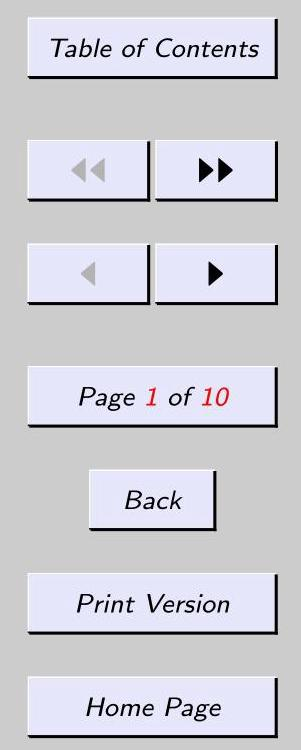
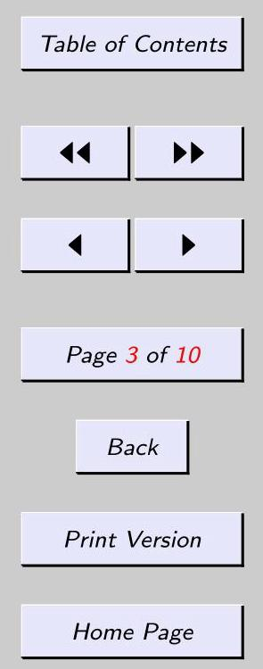
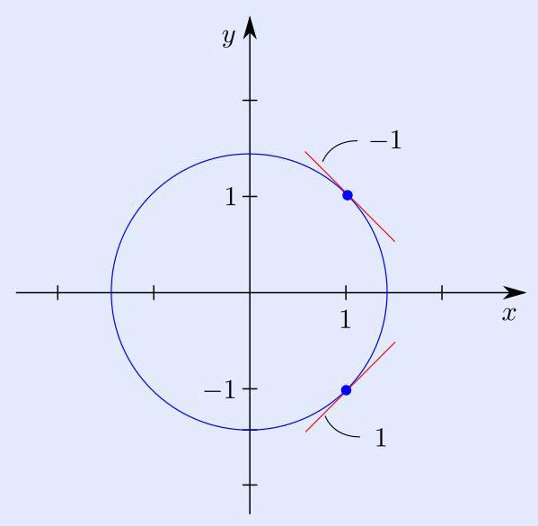
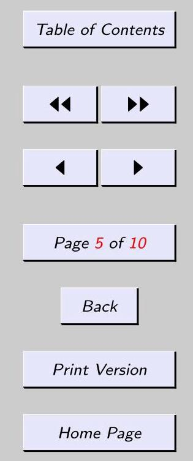
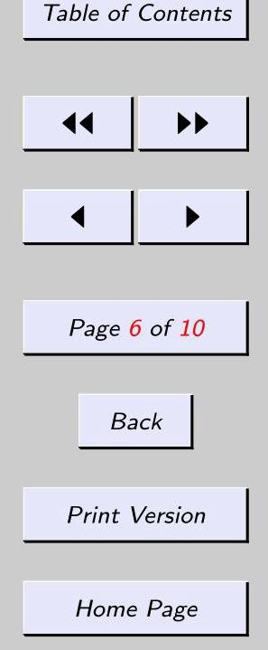
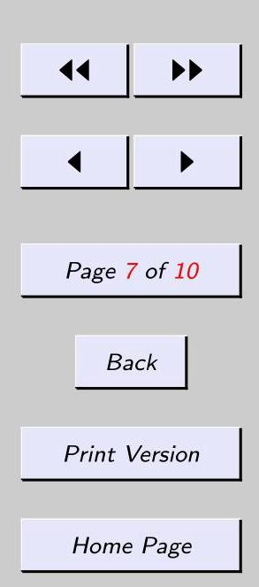
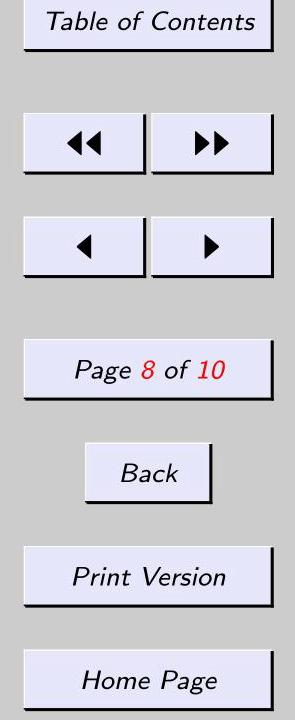
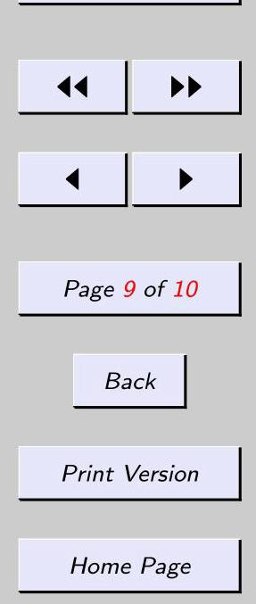
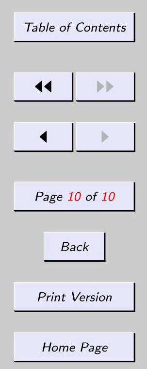

## 23. Implicit differentiation

### 23.1. Statement

The equation $y = {x}^{2} + {3x} + 1$ expresses a relationship between the quantities $x$ and $y$ . If a value of $x$ is given, then a corresponding value of $y$ is determined. For instance, if $x = 1$ , then $y = 5$ . We say that the equation expresses $y$ explicitly as a function of $x$ , and we write $y = y\left( x\right)$ (read " $y$ of $x$ ") to indicate that $y$ depends on $x$ . The derivative of this function is denoted ${y}^{\prime }$ , so that ${y}^{\prime } = {2x} + 3$ .

The equation ${x}^{2} + {y}^{2} = 2$ (circle of radius $\sqrt{2}$ ) also expresses a relationship between the quantities $x$ and $y$ . Solving for $y$ , we get

$$
y =  \pm  \sqrt{2 - {x}^{2}}.
$$

There are two functions here; the one with the positive sign gives the top half of the circle, while the one with the negative sign gives the bottom half. We say that the equation ${x}^{2} + {y}^{2} = 2$ expresses each of these functions implicitly as a function of $x$ . We can find the derivatives of both functions simultaneously, and without having to solve the equation for $y$ , by using the method of "implicit differentiation."

Examples

Method of implicit differentiation. Given an equation involving the variables $x$ and $y$ , the derivative of $y$ is found using implicit differentiation as follows:

- Apply $\frac{d}{dx}$ to both sides of the equation. (In the process of applying

the derivative rules, ${y}^{\prime }$ will appear, possibly more than once.)

- Solve for ${y}^{\prime }$ .

23.1.1 Example Given ${x}^{2} + {y}^{2} = 2$ , find ${y}^{\prime }$ and use it to find the slopes of the lines tangent to the graph of the equation at the points(1,1)and(1, - 1)as follows:

(a) use implicit differentiation,

(b) solve for $y$ first.

Also, sketch the graph of the equation and the tangent lines.

Solution

(a) Using the method of implicit differentiation, we apply $\frac{d}{dx}$ to both sides of the equation and then solve for ${y}^{\prime }$ :

$$
\frac{d}{dx}\left\lbrack  {{x}^{2} + {y}^{2}}\right\rbrack   = \frac{d}{dx}\left\lbrack  2\right\rbrack
$$

$$
\frac{d}{dx}\left\lbrack  {x}^{2}\right\rbrack   + \frac{d}{dx}\left\lbrack  {y}^{2}\right\rbrack   = 0
$$

$$
{2x} + {2y}{y}^{\prime } = 0
$$

$$
{y}^{\prime } =  - \frac{x}{y}
$$

(The chain rule was used in the next to the last step.)

The slopes of the tangent lines at the points(1,1)and(1, - 1)are, respectively,

$$
{\left. {y}^{\prime }\right| }_{\left( 1,1\right) } =  - \frac{1}{1} =  - 1\;\text{ and }{\left. \;{y}^{\prime }\right| }_{\left( 1, - 1\right) } =  - \frac{1}{-1} = 1.
$$

(b) The point(1,1)is on the graph of $y = \sqrt{2 - {x}^{2}}$ (top half of circle). The derivative of

this function is

$$
{y}^{\prime } = \frac{d}{dx}\left\lbrack  \sqrt{2 - {x}^{2}}\right\rbrack   = \frac{1}{2}{\left( 2 - {x}^{2}\right) }^{-1/2} \cdot   - {2x},
$$

so the slope at(1,1)is ${\left. {y}^{\prime }\right| }_{1} = \frac{1}{2}{\left( 2 - {\left( 1\right) }^{2}\right) }^{-1/2} \cdot  \left( {-2}\right) \left( 1\right)  =  - 1$ . Similarly, the point (1, - 1)is on the graph of $y =  - \sqrt{2 - {x}^{2}}$ (bottom half of circle). The derivative of this function is

$$
{y}^{\prime } = \frac{d}{dx}\left\lbrack  {-\sqrt{2 - {x}^{2}}}\right\rbrack   =  - \frac{1}{2}{\left( 2 - {x}^{2}\right) }^{-1/2} \cdot   - {2x},
$$

so the slope at(1, - 1)is ${\left. {y}^{\prime }\right| }_{1} =  - \frac{1}{2}{\left( 2 - {\left( 1\right) }^{2}\right) }^{-1/2} \cdot  \left( {-2}\right) \left( 1\right)  = 1$ .

Here is the sketch:

Statement

Strategy for differentiating implicitly

Examples

The example illustrates the fact that it is usually much easier to use implicit differentiation than it is to first solve the equation for $y$ .

When an equation gives $y$ explicitly as a function of $x$ , meaning that the equation has $y$ on one side and an expression involving only $x$ ’s on the other, then the derivative ${y}^{\prime }$ equals an expression involving only $x$ ’s, so to find the slope of the line tangent to the graph of the equation at a point, one needs only the $x$ -coordinate of the point (see solution to (b) in last example).

By contrast, when an equation gives $y$ implicitly as a function of $x$ , the formula for the derivative ${y}^{\prime }$ typically involves both $x$ ’s and $y$ ’s, so both coordinates of a point are required in order to find the slope of the tangent at that point (see solution to (a)). This is understandable since an equation giving a function implicitly usually gives more than one function (for instance ${x}^{2} + {y}^{2} = 2$ gives the top half of the circle and also the bottom half); an $x$ -coordinate alone does not determine which of the functions is intended, so the $y$ -coordinate must also be supplied.

### 23.2. Strategy for differentiating implicitly

In carrying out implicit differentiation, one needs to keep in mind that $y$ represents a function of $x$ (although an explicit formula might not be known). In deciding which derivative rules to apply, it is useful to think what you would do for a particular $y$ , say, $y = \sin x$ . For instance, in the next example, in order to find the derivative of ${xy}$ one should use the product rule since $x\sin x$ requires the product rule; in order to find the derivative of ${y}^{3}$ one should use the chain rule since ${\left( \sin x\right) }^{3}$ requires the chain rule.

23.2.1 Example Given $x + {xy} - {y}^{3} = 7$ , find ${y}^{\prime }$ .

Examples

Solution Using the method of implicit differentiation, we have

$$
\frac{d}{dx}\left\lbrack  {x + {xy} - {y}^{3}}\right\rbrack   = \frac{d}{dx}\left\lbrack  7\right\rbrack
$$

$$
\frac{d}{dx}\left\lbrack  x\right\rbrack   + \frac{d}{dx}\left\lbrack  {xy}\right\rbrack   - \frac{d}{dx}\left\lbrack  {y}^{3}\right\rbrack   = 0
$$

$$
1 + \left( {\frac{d}{dx}\left\lbrack  x\right\rbrack  y + x\frac{d}{dx}\left\lbrack  y\right\rbrack  }\right)  - 3{y}^{2}{y}^{\prime } = 0
$$

$$
1 + \left( {y + x{y}^{\prime }}\right)  - 3{y}^{2}{y}^{\prime } = 0
$$

$$
{y}^{\prime }\left( {x - 3{y}^{2}}\right)  =  - 1 - y
$$

$$
{y}^{\prime } = \frac{-1 - y}{x - 3{y}^{2}} = \frac{1 + y}{3{y}^{2} - x}.
$$

(The third line was obtained using the product rule and the chain rule.)

### 23.3. Examples

The next example shows the usefulness of implicit differentiation for situations where there is no obvious way to solve the equation for $y$ .

23.3.1 Example Given ${e}^{{x}^{2}y} = x + y$ , find ${y}^{\prime }$ .

Statement

Solution Using the method of implicit differentiation, we have

$$
\frac{d}{dx}\left\lbrack  {e}^{{x}^{2}y}\right\rbrack   = \frac{d}{dx}\left\lbrack  {x + y}\right\rbrack
$$

$$
{e}^{{x}^{2}y}\frac{d}{dx}\left\lbrack  {{x}^{2}y}\right\rbrack   = \frac{d}{dx}\left\lbrack  x\right\rbrack   + \frac{d}{dx}\left\lbrack  y\right\rbrack
$$

$$
{e}^{{x}^{2}y}\left( {\frac{d}{dx}\left\lbrack  {x}^{2}\right\rbrack  y + {x}^{2}\frac{d}{dx}\left\lbrack  y\right\rbrack  }\right)  = 1 + {y}^{\prime }
$$

$$
{e}^{{x}^{2}y}\left( {{2xy} + {x}^{2}{y}^{\prime }}\right)  = 1 + {y}^{\prime }
$$

$$
{y}^{\prime }\left( {{x}^{2}{e}^{{x}^{2}y} - 1}\right)  = 1 - {2xy}{e}^{{x}^{2}y}
$$

$$
{y}^{\prime } = \frac{1 - {2xy}{e}^{{x}^{2}y}}{{x}^{2}{e}^{{x}^{2}y} - 1}.
$$

23.3.2 Example Given $\cos \left( {xy}\right)  = \frac{{2}^{y}}{{x}^{3}}$ , find ${y}^{\prime }$ .

Statement

Strategy for differentiating implicitly

Examples Table of Contents

Solution Using the method of implicit differentiation, we have

$$
\frac{d}{dx}\left\lbrack  {\cos \left( {xy}\right) }\right\rbrack   = \frac{d}{dx}\left\lbrack  \frac{{2}^{y}}{{x}^{3}}\right\rbrack
$$

$$
- \sin \left( {xy}\right) \frac{d}{dx}\left\lbrack  {xy}\right\rbrack   = \frac{{x}^{3}\frac{d}{dx}\left\lbrack  {2}^{y}\right\rbrack   - {2}^{y}\frac{d}{dx}\left\lbrack  {x}^{3}\right\rbrack  }{{\left( {x}^{3}\right) }^{2}}
$$

$$
- \sin \left( {xy}\right) \left( {{1y} + x{y}^{\prime }}\right)  = \frac{{x}^{3}\left( {{2}^{y}\left( {\ln 2}\right) {y}^{\prime }}\right)  - {2}^{y}\left( {3{x}^{2}}\right) }{{x}^{6}}
$$

$$
{y}^{\prime }\left( {-x\sin \left( {xy}\right)  - \frac{{2}^{y}\ln 2}{{x}^{3}}}\right)  = y\sin \left( {xy}\right)  - \frac{3 \cdot  {2}^{y}}{{x}^{4}}
$$

$$
{y}^{\prime } = \frac{y\sin \left( {xy}\right)  - \frac{3 \cdot  {2}^{y}}{{x}^{4}}}{-x\sin \left( {xy}\right)  - \frac{{2}^{y}\ln 2}{{x}^{3}}}
$$

$$
{y}^{\prime } = \frac{3 \cdot  {2}^{y} - {x}^{4}y\sin \left( {xy}\right) }{{x}^{5}\sin \left( {xy}\right)  + x{2}^{y}\ln 2}.
$$

(In the last step, the complex fraction was simplified by multiplying numerator and denominator by ${x}^{4}$ . Also, numerator and denominator were multiplied by -1 in order to reduce the number of negative signs.)

23.3.3 Example Find all points on the graph of ${x}^{4} + {y}^{4} + 2 = {4x}{y}^{3}$ at which the tangent line is horizontal.

Solution A horizontal line has slope zero, so the horizontal tangent lines occur at points on the graph where the derivative is zero. We compute the derivative using the method of

Statement

Strategy for differentiating implicitly

Examples

implicit differentiation:

$$
\frac{d}{dx}\left\lbrack  {{x}^{4} + {y}^{4} + 2}\right\rbrack   = \frac{d}{dx}\left\lbrack  {{4x}{y}^{3}}\right\rbrack
$$

$$
4{x}^{3} + 4{y}^{3}{y}^{\prime } = 4{y}^{3} + {4x}\left( {3{y}^{2}{y}^{\prime }}\right)
$$

$$
{y}^{\prime }\left( {4{y}^{3} - {12x}{y}^{2}}\right)  = 4{y}^{3} - 4{x}^{3}
$$

$$
{y}^{\prime } = \frac{4{y}^{3} - 4{x}^{3}}{4{y}^{3} - {12x}{y}^{2}} = \frac{{y}^{3} - {x}^{3}}{{y}^{3} - {3x}{y}^{2}}.
$$

Setting ${y}^{\prime } = 0$ , we get

$$
0 = \frac{{y}^{3} - {x}^{3}}{{y}^{3} - {3x}{y}^{2}}
$$

$$
{y}^{3} - {x}^{3} = 0
$$

$$
{y}^{3} = {x}^{3}
$$

$$
y = x
$$

So a horizontal tangent line occurs at the point(x, y)on the graph if and only if $y = x$ . In order for the point to be on the graph, its coordinates must satisfy the equation:

$$
{x}^{4} + {y}^{4} + 2 = {4x}{y}^{3}
$$

$$
{x}^{4} + {x}^{4} + 2 = 4{x}^{4}
$$

$$
{x}^{4} = 1
$$

$$
x =  \pm  1\text{.}
$$

The only candidates for such points are(1,1)and(-1, - 1). Both of these points lie on the graph, so the answer is(1,1)and(-1, - 1).

Statement

Strategy for differentiating implicitly

Examples Table of Contents

## 23 – Exercises

Given ${y}^{2} = x$ , find ${y}^{\prime }$ and use it to find the slopes of the lines tangent to the graph of the equation at the points(4,2)and(4, - 2)as follows:

(a) use implicit differentiation,

(b) solve for $y$ first.

Also, sketch the graph of the equation and the tangent lines.

Given ${2xy} + {y}^{2} = x + y$ , use implicit differentiation to find ${y}^{\prime }$ .

Let $\sqrt{x + y} = 1 + {x}^{2}{y}^{2}$ .

(a) Find ${y}^{\prime }$ .

(b) Find an equation of the line tangent to the graph of the given equation at the point (0,1).

23-4 Given $x\sin {e}^{y} = \ln y$ , find ${y}^{\prime }$ .