LESSON

# Addition and Subtraction Equations

11-2 Reading Strategies: Use a Visual Clue

You can picture balanced scales to solve subtraction equations. Picture balanced scales for this equation.

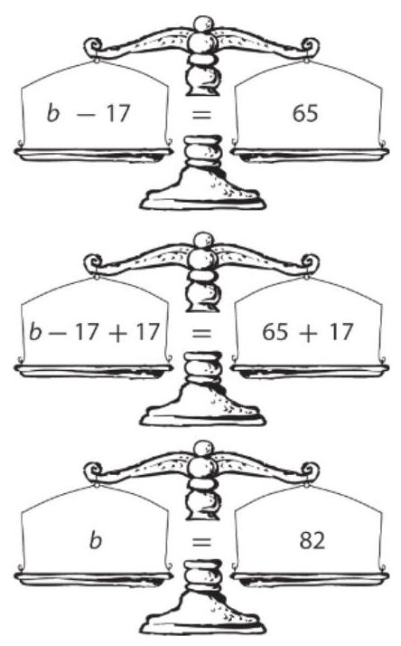

Step 1: To find the value of $b$ , get $b$ by itself on the left side of the equation. So, add 17 to the left side of the equation.

Step 2: To keep the equation balanced, add 17 to the right side of the equation as well.

Step 3: Check to verify that $b = {82}$ is the solution.

$$
b - {17} = {65}
$$

${82} - {17}\overset{?}{ = }{65}$

${65}\overset{?}{ = }{65}\checkmark$

To get the variable by itself in a subtraction equation, add the same value to both sides of the equation.

## Use $n - {21} = {32}$ to answer Exercises 1-4.

1. On which side of the equation is the variable?

2. What will you do to get the variable by itself?

3. What must you do the other side of the equation to keep it balanced?

4. What is the value of $n$ ? __________

Use ${12} = p - {25}$ to answer Exercises 5-8.

5. On which side of the equation is the variable? __________

6. What will you do to get the variable by itself? __________

7. What must you do the other side of the

equation to keep it balanced? __________

8. What is the value of $p$ ? __________

LESSON Addition and Subtraction Equations 11-2 Success for English Learners

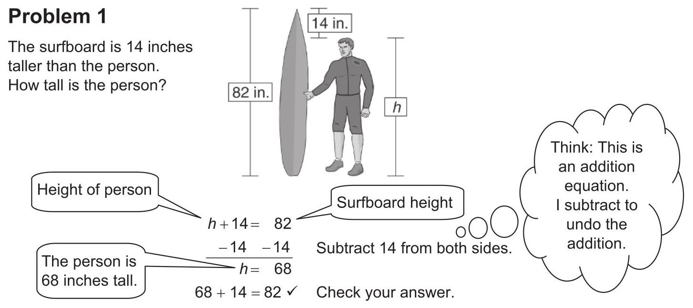

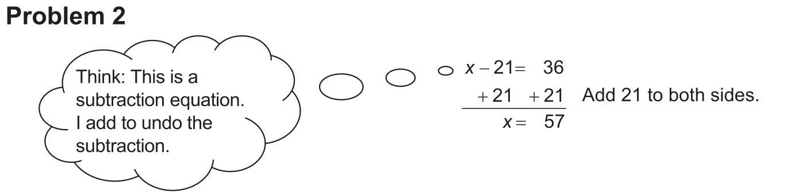

1. Why do you use an addition equation to find the surfer's height?

2. How can you check the answer to Problem 2?

3. Write an addition or a subtraction equation. Explain how to solve your equation. Give the solution to your equation. _____ Date _____ Class_____ Class_____ LESSON

## Multiplication and Division Equations

11-3 Practice and Problem Solving: A/B

Solve each equation. Graph the solution on the number line. Check your work. 1. $\frac{e}{2} = 3$ $e =$ 2. ${20} = {2w}$ $W =$

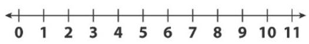

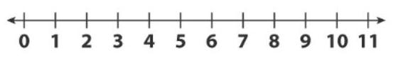

__________

3. $\frac{1}{2} = {2m}$ $m =$

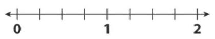

__________

4. $\frac{k}{5} = 2$ $k =$

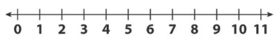

__________

Use the drawing at the right for Exercises 5-6.

5. Write an equation you can use to find the length of the rectangle.

---

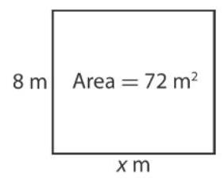

---

__________

6. Solve the equation. Give the length of the rectangle.

__________

## Solve.

7. Alise separated her pictures into 3 piles. Each pile contained 9 pictures. How many pictures did she have in all? Write and solve an equation to represent the problem. State the answer to the problem. LESSON

## Multiplication and Division Equations

11-3 Practice and Problem Solving: C

## Solve each equation.

1. ${8b} = {5.6}$ $b =$ 2. $9 = \frac{s}{3}$ $S =$

3. $2\frac{1}{2} = {5n}$ $n =$ 4. ${15} = {0.2z}$ $z =$

5. ${3.5d} = {70}$ $d =$ _____ 6. $\frac{t}{3} = \frac{4}{9}$ $t =$

7. The perimeter of the square at the right is 48 inches. What is the area

---

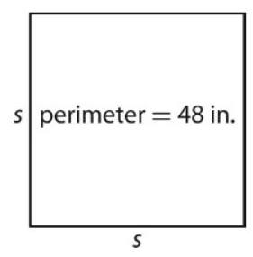

---

of the square at the right? Explain how you found your answer.

__________

__________

__________

Write and solve an equation to answer each question.

8. Jose is making model SUVs. Each SUV takes 5 tires. He used 85 tires for the models. How many model SUVs did Jose make?

9. Renee talked for 6 minutes on the phone. Nathan talked for $n$ minutes. Nathan talked three times as long as Renee. How long did Nathan talk?

10. Sylvia rented a boat for $\$ {16.50}$ per hour. Her total rental fee was \$49.50. For how many hours did Sylvia rent the boat?

Write a problem for the equation ${0.5n} = {12.5}$ . Then solve the equation and write the answer to your problem.

__________

__________

__________

LESSON

## Multiplication and Division Equations

11-3 Practice and Problem Solving: D

Solve each equation. Graph the solution on the number line.

Check your work. The first is done for you. 1. $8 = {2m}\;m = 4$ $\frac{8}{2} = \frac{2m}{2}$ $4 = m$ $8 = 2 \cdot  4\checkmark$ 2. $\frac{a}{4} = 2\;a =$ 3. ${12} = {3s}\;s =$ 4. $\frac{u}{2} = 5\;u =$

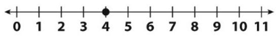

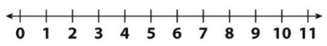

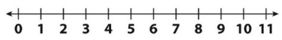

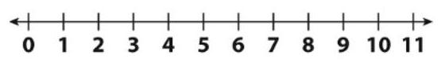

__________

## Use the situation below to complete Exercises 5-8. The first one is done for you.

Jim knows the length of his garden is 12 feet. He knows the area of the garden is ${60}{\mathrm{{ft}}}^{2}$ . What is the width of Jim’s garden?

5. Fill in the known values in the picture at the right.

---

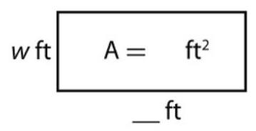

---

6. Write an equation you can use to solve the problem.

__________

7. Solve the equation. $w =$

8. Write the solution to the problem.

__________

LESSON

## Multiplication and Division Equations

11-3 Reteach

Number lines can be used to solve multiplication and division equations.

Solve: ${3n} = {15}$

How many moves of 3 does it take to get to 15 ?

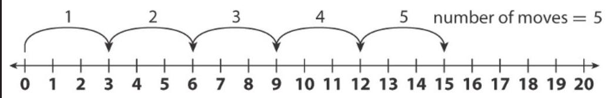

$n = 5\;$ Check: $3 \bullet  5 = {15}\checkmark$

Solve: $\frac{n}{3} = 4$

If you make 3 moves of 4 , where are you on the number line? $n = {12}\;$ Check: ${12} \div  3 = 4\checkmark$

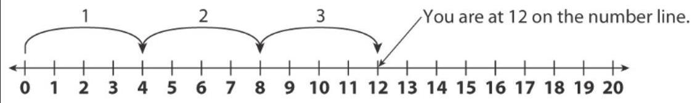

Show the moves you can use to solve each equation. Then give the solution to the equation and check your work.

1. ${3n} = 9$ Solution: $n =$ _____ Show your check:

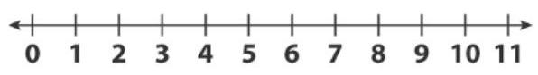

2. $\frac{n}{2} = 4$ Solution: $n =$

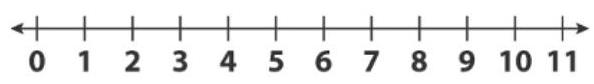

Show your check:

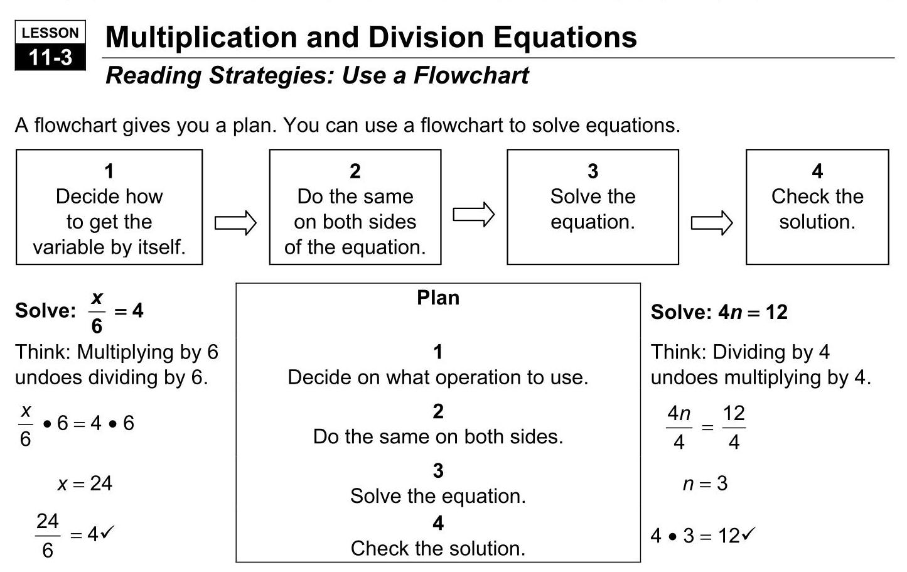

Use the flowchart to solve each equation.

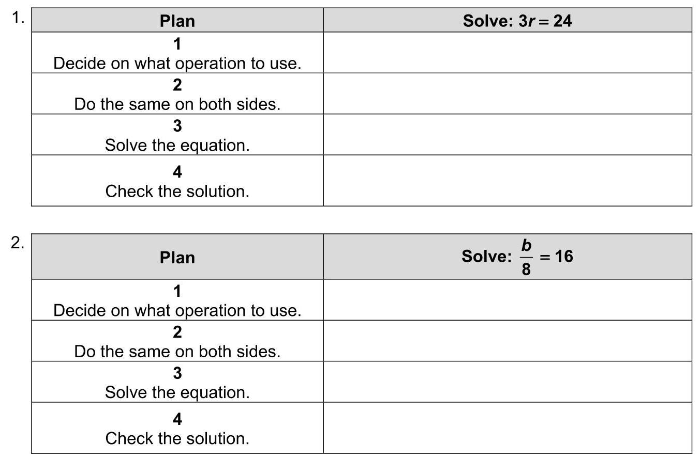

LESSON Multiplication and Division Equations 11-3 Success for English Learners

## Problem 1

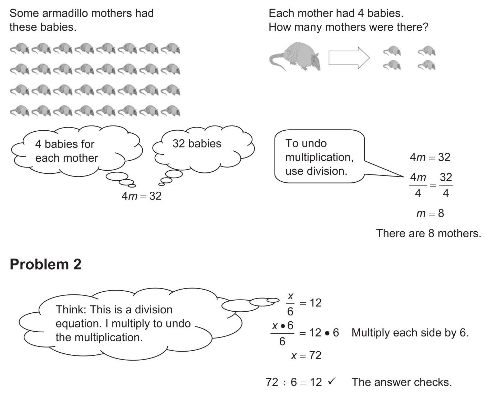

1. Explain how to check the solution to Problem 1.

2. Solve $\frac{n}{3} = 2$ . Show your work.

Check your work.

3. Solve ${5t} = {20}$ . Show your work.

Check your work. _____ Date _____ Class_____ LESSON

## Writing Inequalities

11-4

## Practice and Problem Solving: A/B

## Complete the graph for each inequality.

1. $a > 3$ 2. $r \leq   - 2$

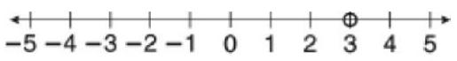

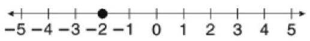

Graph the solutions of each inequality. Check the solutions.

3. $w \geq  0$

Check: _____

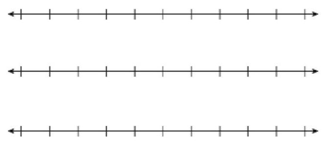

4. $b \leq   - 4$

Check: _____

5. $a < {1.5}$

Check: _____

Write an inequality that represents each phrase. Draw a graph to represent the inequality.

6. The sum of 1 and $x$ is less than 5 . 7. 3 is less than $y$ minus 2 .

__________

 __________

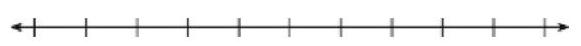

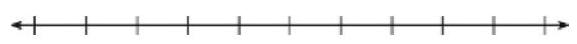

Write and graph an inequality to represent each situation.

8. The temperature today will be at least ${10}^{ \circ  }\mathrm{F}$ . _____

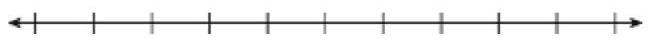

9. Ben wants to spend no more than $\$ 3$ .

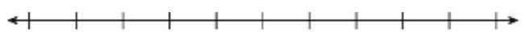

Write an inequality that matches the number line model. LESSON

10. _____

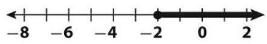

11. _____

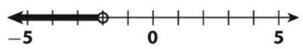

## Writing Inequalities

11-4 Practice and Problem Solving: C

Circle the values that are solutions for each inequality.

1. $a >  - 2$ 2. $r \leq  2$

$- {3.5}\; - 1$ $0\;4\frac{1}{4}$ $- {3.5}\; - 1\;0\;4\frac{1}{4}$

Graph the solutions of each inequality. Check the solutions.

3. $4 \geq  y$

4. $b \leq  {0.5}$

Check:

5. $a < 1 - 3$

Write and graph an inequality to represent each situation. Then determine if 36 is a possible solution. Write yes or no.

6. The temperature today will be at least ${35}^{ \circ  }\mathrm{F}$ . _____

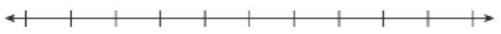

7. Monica wants to spend no more than \$35. _____

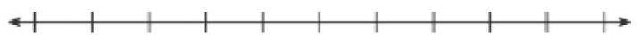

Write an inequality that matches the number line model. Then write a situation that the inequality could represent. 8. _____

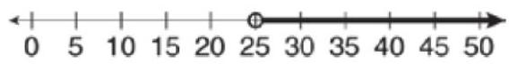

__________

__________

9. _____

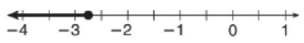

__________

__________