_____ Date _____ Class_____ MODULE

## Equations and Relationships Challenge

11

Write and solve an equation to find the unknown Remember measurement. Then use your answer to find the Area $=$ length $\bullet$ width or $A = I \bullet  w$ perimeter of each field or court. Perimeter is the distance around or $P = {2l} + {2w}$

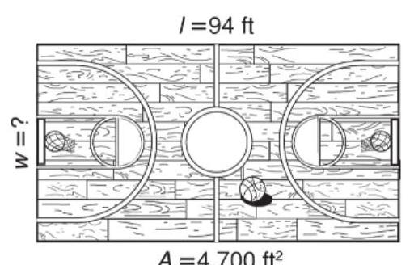

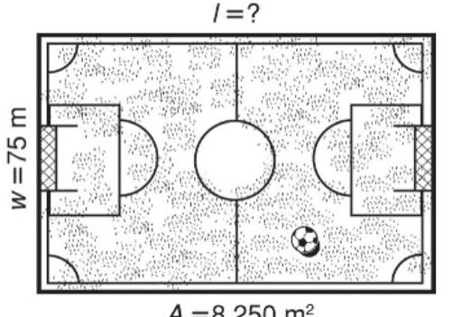

1. Equation to find area: _____ 2. Equation to find area: _____ Unknown measurement: _____ Equation to find perimeter: Perimeter of court: _____

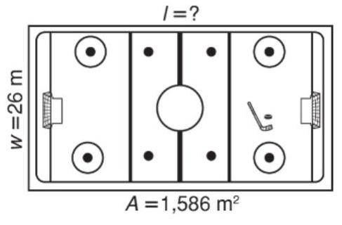

4. Equation to find area: _____

Original content Copyright (c) by Houghton Mifflin Harcourt. Additions and changes to the original content are the responsibility of the instructor. _____ Date _____ Class_____ LESSON

## Graphing on the Coordinate Plane

12-1 Practice and Problem Solving: A/B

Give the coordinates of the points on the coordinate plane. 1. $A\left( {\text{___},\text{___}}\right)$ 2. $B\left( \text{___，___}\right)$ 3. $C\left( \text{___，___}\right)$ 4. $D\left( {\underline{\;},\underline{\;}}\right)$ 5. $E\left( {\_ \_ \_ ,\_ \_ \_ }\right)$ 6. $F\left( {\text{___ },\text{ ___ }}\right)$ Plot the points on the coordinate plane.

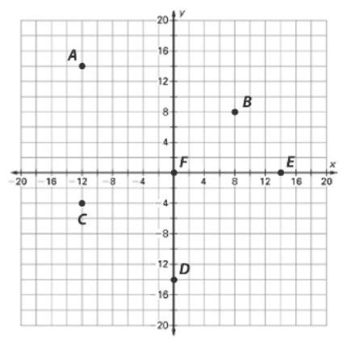

7. $G\left( {2,4}\right)$

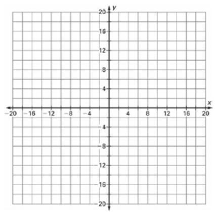

8. $H\left( {-6,8}\right)$

9. $J\left( {{10}, - {12}}\right)$

10. $K\left( {-{14}, - {16}}\right)$

11. $M\left( {0,{18}}\right)$

12. $P\left( {-{20},0}\right)$

## Describe how to go from one store to the next on the map. Use words like left, right, up, down, north, south, east, and west. Each square on the coordinate plane is a city block.

13. The computer store, $A$ , to the food store, $B$ .

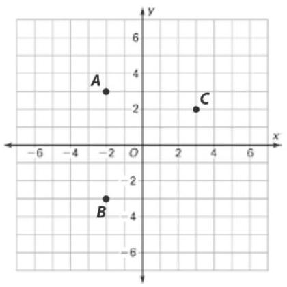

__________

14. The computer store, $A$ , to the hardware store, $C$ .

__________

15. The hardware store, $C$ , to the food store, $B$ .

__________

_____ Date _____ Class_____ LESSON

## Graphing on the Coordinate Plane

12-1 Practice and Problem Solving: C

# Label the axes to locate the points on the coordinate planes.

1. $A\left( {-6,{15}}\right) , B\left( {3, - 9}\right) , C\left( {-9, - 9}\right)$ 2. $D\left( {0,6}\right) , E\left( {-{12},6}\right) , F\left( {{18},0}\right)$

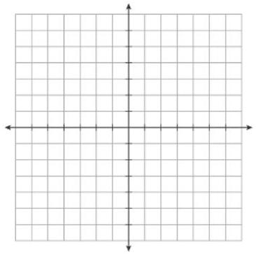

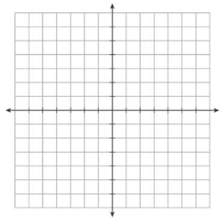

Start with the given point. Give the quadrant in which you end up after following the directions. Then, give the coordinates of the point where you end up.

3. $X\left( {5, - 8}\right)$ Go down 5, left 7, and down 6 more.

Quadrant: _____ ; Point: X(_____,_____)

4. $Y\left( {-2,6}\right)$ Go up 3, right 5, and up 4 more.

Quadrant: _____; Point: Y(_____,_____)

5. $Z\left( {0, - 5}\right)$ Go left 5, up 4, right 7, and down 3 .

Quadrant: _____; Point: Z(_____,_____)

Give the coordinates of a point that would form a right triangle with the points given. Use the grids for reference. Tell what you know about one of the coordinates of your new point. _____ Date _____ Class_____

6. $P\left( {2,4}\right) , Q\left( {2,8}\right) , R\left( {\text{___，___},\text{___}}\right)$

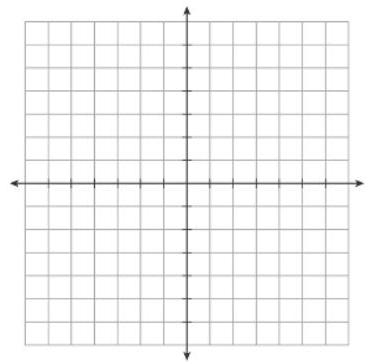

7. $S\left( {-3, - 5}\right) , T\left( {4, - 5}\right) , U\left( {\_ \_ \_ \_ \_ \_ \_ \_ \_ \_ \_ \_ \_ \_ \_ \_ \_ \_ \_ \_ \_ \_ \_ \_ \_ \_ \_ \_ \_ \_ \_ \_ \_ \_ \_ \_ \_ \_ \_ \_ \_ \_ \_ \_ \_ \_ \_ \_ \_ \_ \_ \_ \_ \_ \_ \_ \_ \_ \_ \_ \_ \_ \_ \_ \_ \_ \_ \_ \_ \_ \_ \_ \_ \_ \_ \_ \_ \_ \_ \_ \_ \_ \_ \_ \_ \_ \_ \_ \_ \_ \_ \_ \_ \_ \_ \_ \_ \_ \_ \_ \_ \_ \_ \_ \_ \_ \_ \_ \_ \_ \_ \_ \_ \_ \_ \_ \_ \_ \_ \_ \_ \_ \_ \_ \_ ...................}\right)$

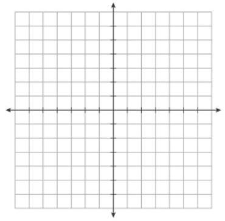

LESSON Graphing on the Coordinate Plane 12-1 Practice and Problem Solving: D

Use the coordinate plane for Exercises 1-3. Give the letter of the correct answer. The first one is done for you.

1. Which point is located in Quadrant I?

A point $Q$

B point $P$

C point $X$

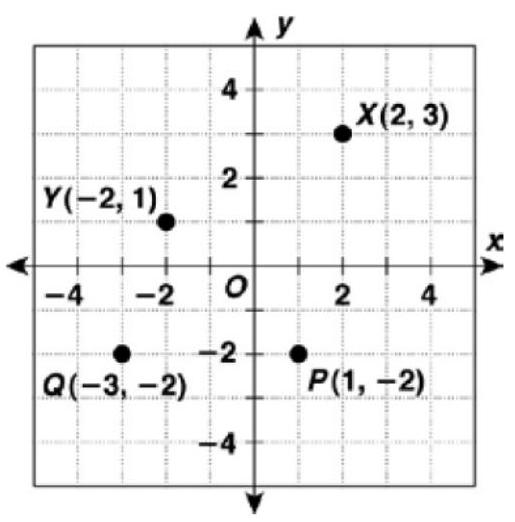

C

2. Which point is located in Quadrant IV?

A point $X$

B point $Y$

C point $P$

_____

3. Which point is located in Quadrant II?

A point $Q$

B point $Y$

C point $X$ _____

Use the coordinate plane for Exercises 4-7. The first one is done for you.

4. What are the coordinates of point $A$ ? Go over 3 to the right and down 1 , so the $x$ -coordinate is 3 and the $y$ -coordinate is -1 , or $A\left( {3, - 1}\right)$ .

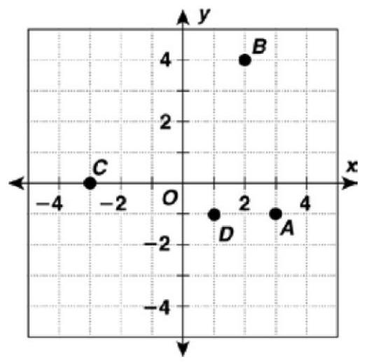

5. What are the coordinates of point $B$ ?

$B$ (_____,_____)

6. What are the coordinates of point $C$ ?

$C\left( {\text{___},\text{___},\text{___}}\right)$

7. What are the coordinates of point $D$ ?

$D$ (_____,_____) _____ Date _____ Class_____ LESSON

## Graphing on the Coordinate Plane  Reteach

12-1

Each quadrant of the coordinate plane has a unique combination of positive and negative signs for the $x$ -coordinates and $y$ -coordinates as shown here.

<table><tr><td>Quadrant</td><td>$x$ -coordinate</td><td>y-coordinate</td></tr><tr><td>1</td><td>+</td><td>+</td></tr><tr><td>11</td><td>-</td><td>+</td></tr><tr><td>III</td><td>-</td><td>-</td></tr><tr><td>IV</td><td>+</td><td>-</td></tr></table>

Use these rules when naming points on the coordinate plane.

## Example 1

Draw the point $A\left( {1, - 3}\right)$ on the coordinate grid.

## Solution

According to the table, this point will be in Quadrant IV.

So, go to the right (+) one unit, and go down (-) three units.

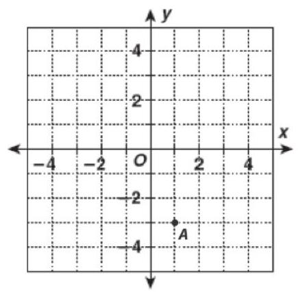

## Example 2

What are the coordinates of point $B$ ?

## Solution

According to the table, this point will have a negative $x$ -coordinate and a positive $y$ -coordinate.

Point $B$ is 3 three units to the left (-) and four units ${up}\left( +\right)$ . So the coordinates of point $B$ are(-3,4).

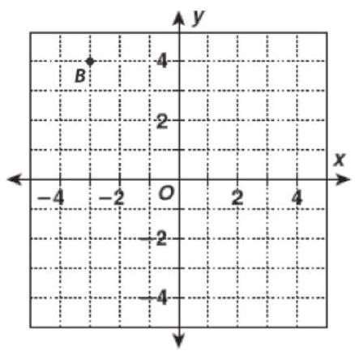

## Add the correct sign for each point's coordinates.

1. (_____ 3, _____ 4) in 2. (_____ 2, _____ 5) in 3. (_____ 9, _____ 1) in Quadrant II Quadrant IV Quadrant I

4. In which quadrant is the point(0,7)located? Explain your answer. LESSON

---

Original content Copyright (c) by Houghton Mifflin Harcourt. Additions and changes to the original content are the responsibility of the instructor.

---

## Graphing on the Coordinate Plane

12-1 Reading Strategies: Build Vocabulary

This lesson introduces words used to graph numbers. Mathematics uses these words to build new concepts. It is important to remember and to use them. Look at this example. Read each definition, and find it on the picture.

A. The coordinate plane includes all of the parts marked on the picture.

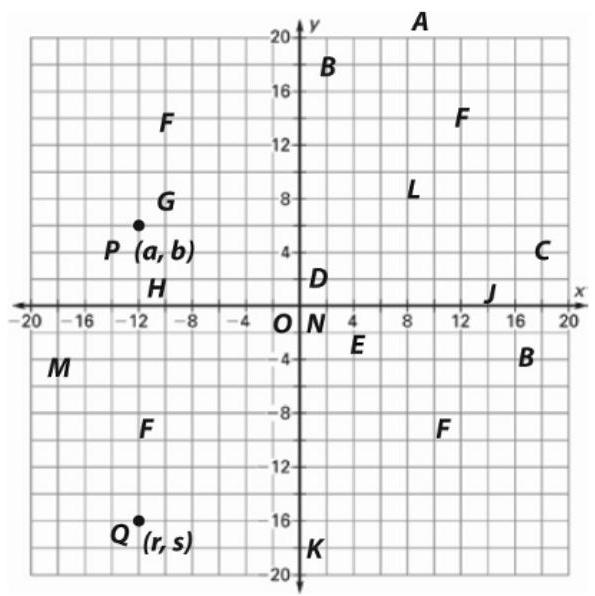

B. The axes are the darker number lines.

C. The $x$ -axis goes left to right, whereas the $y$ -axis goes up and down.

D. The axes intersect at the origin, which is marked with an " $O$ ".

E. The scale on the number line is always important in using a coordinate plane. Here, every square on the grid is 2 units.

F. The axes divide the coordinate plane into four quadrants. Quadrant I is upper right, Quadrant II is upper left, Quadrant III is lower left, and Quadrant IV, which is read "quadrant four," is lower right.

G. Pairs of numbers, called ordered pairs, are represented on the coordinate plane as points and in the format $\mathbf{P}\left( {\mathbf{a},\mathbf{b}}\right)$ , where $P$ is the point’s label, $a$ is a value on the $x$ -axis, and $b$ is a value on the $y$ -axis.

H. The numbers $a$ and $b$ in the format(a, b) are called coordinates. The $a$ is called the $x$ -coordinate and the $b$ is called the $y$ -coordinate.

Write a letter that indicates each of the following in the diagram above.

1. point on $x$ -axis 2. $x$ -coordinate of $Q$ 3. $y$ -coordinate of $Q$ 4. point on $y$ -axis

__________

 __________ __________

5. point in Quadrant I 6. ordered pair for $Q$ 7. point in Quadrant III 8. origin

__________

 __________ __________

Graphing on the Coordinate Plane

Success for English Learners from the origin?

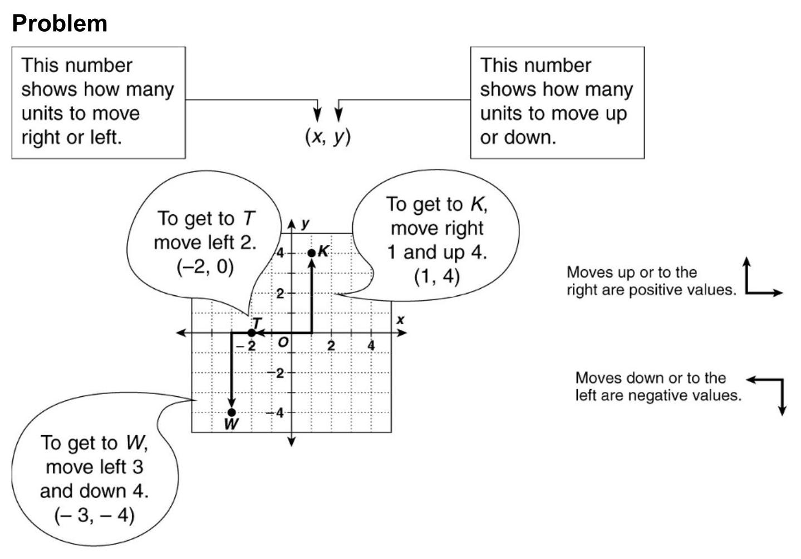

1. If an ordered pair has an $x$ -value of 0, which direction do you move

2. A negative $y$ -coordinate means that a point may lie in which two quadrants?

3. Does it matter which number comes first in an ordered pair? Explain. LESSON

## Independent and Dependent Variables in Tables and Graphs Practice and Problem Solving: A/B

12-2

Name the dependent variable and the independent variable in each problem.

1. A food service worker earns $\$ {12}$ per hour. How much money, $m$ , does the worker earn on a shift of $h$ hours?

Dependent variable: _____；independent variable: _____

2. A large 2-topping pizza, $L$ , costs $\$ 2$ more than a medium 3-topping pizza, $M$ .

Dependent variable: _____；independent variable: _____

The table shows the electric current produced by a solar cell in different amounts of sunlight (light intensity). Answer the questions using the data.

<table><tr><td>Light intensity</td><td>150</td><td>300</td><td>450</td><td>600</td><td>750</td><td>900</td></tr><tr><td>Current</td><td>10</td><td>30</td><td>45</td><td>60</td><td>75</td><td>90</td></tr></table>

3. What is the dependent variable? 4. What is the independent variable?

5. What do you predict the current will be in the absence of sunlight? Explain.

6. What do you predict the current will be if the light intensity is 1,000 ? Explain. A race car driver's time in seconds to complete 12 laps is plotted on the graph.

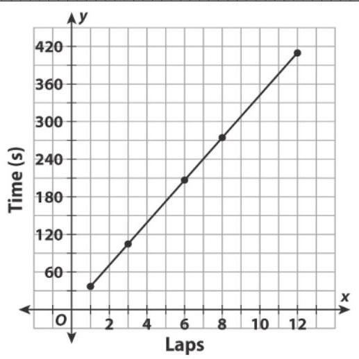

7. Which axis shows the dependent variable?

__________

8. Why does the graph begin at $x = 1$ ?

__________

LESSON

# Independent and Dependent Variables in Tables and Graphs Practice and Problem Solving: C

12-2

## Use the situation below to complete Exercises 1-4.

The commuter bus system collected the data in the table below. All of the data were collected under the same conditions: dry roads, no accidents or traffic jams, same distance each trip, and no mechanical problems with the bus on each trip.

<table><tr><td>Number of passengers per trip, $n$</td><td>30</td><td>35</td><td>40</td><td>45</td><td>50</td></tr><tr><td>Average speed, $\mathrm{{km}}$ per hour, $s$</td><td>60</td><td>58</td><td>55</td><td>55</td><td>52</td></tr><tr><td>Liters of biodiesel fuel used, $f$</td><td>45</td><td>48</td><td>50</td><td>52</td><td>54</td></tr></table>

1. Assume that more passengers cause the bus to travel slower. Of these two factors, which would be the dependent and independent variables?

Dependent variable: _____；independent variable: _____

2. Assume that an average slower speed causes the bus to consume more fuel. Describe the relationship between bus speed and fuel consumption.

3. What can you say about the relationship between the number of passengers and the fuel consumption?

4. What effect does the number of passengers have on bus speed and fuel consumption?

## In the graph, the independent variable is the $x$ -axis and the dependent variable is the $y$ -axis. Use the graph to answer Exercises 5-6.

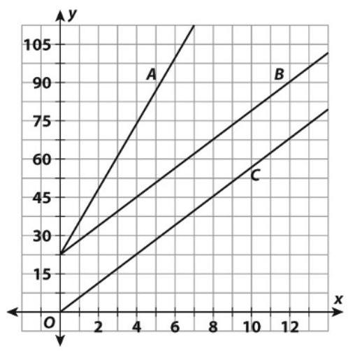

5. Describe and compare how the dependent variables shown by lines $A$ and $B$ change as the independent variables change.

__________

6. Describe and compare how the dependent variables shown by lines $B$ and $C$ change as the independent variables change. LESSON

## Independent and Dependent Variables in Tables and Graphs Practice and Problem Solving: D

12-2

Answer the questions for each real-world situation. The first one is done for you.

1. The table gives the amount of water in a water tank as it is being filled.

<table><tr><td>Gallons</td><td>50</td><td>100</td><td>150</td><td>200</td><td>250</td></tr><tr><td>Time (min)</td><td>10</td><td>20</td><td>30</td><td>40</td><td>50</td></tr></table>

a. Why is gallons the dependent variable?

It depends on how long the water has been filling the tank.

b. Divide gallons by time in each pair of cells. What do you get? ${50} \div  {10} = {100} \div  {20} = {150} \div  {30} = {200} \div  {40} = {250} \div  {50} = 5;5$

c. If the time is 60 minutes, how would you get the gallons? What would you get?

Multiply 60 times 5, which gives 300 gallons.

2. The table shows how to change miles to kilometers. Divide kilometers by miles for each of the four mileage numbers. How many kilometers per mile do you get?

<table><tr><td>(km)</td><td>3.22</td><td>4.83</td><td>6.44</td><td>8.05</td></tr><tr><td>(mi)</td><td>2</td><td>3</td><td>4</td><td>5</td></tr></table>

## Answer each question using the graph. The first one is done for you.

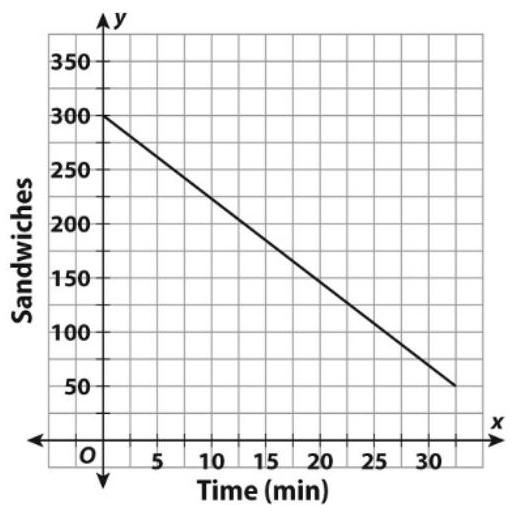

3. How many sandwiches are available at the start of the business day? 300

4. Which axis shows the dependent variable, sandwiches?

__________

5. How many sandwiches are left after 20 minutes?

__________