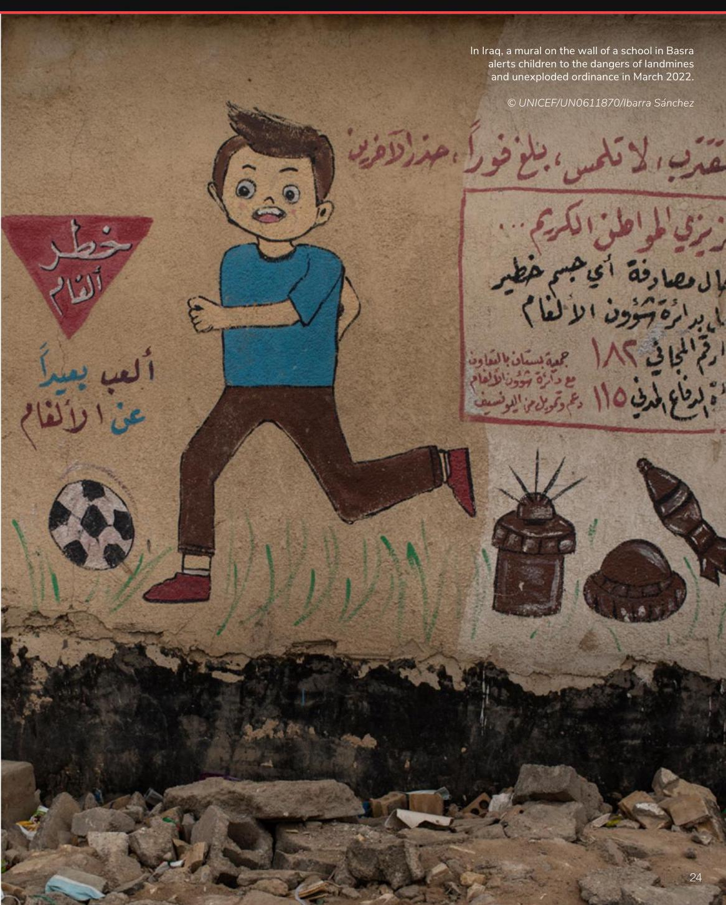
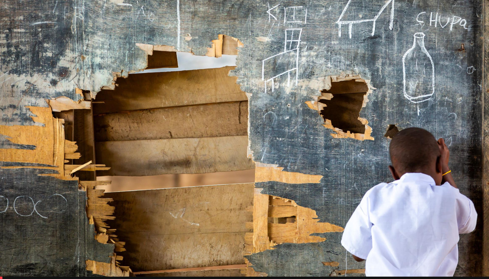
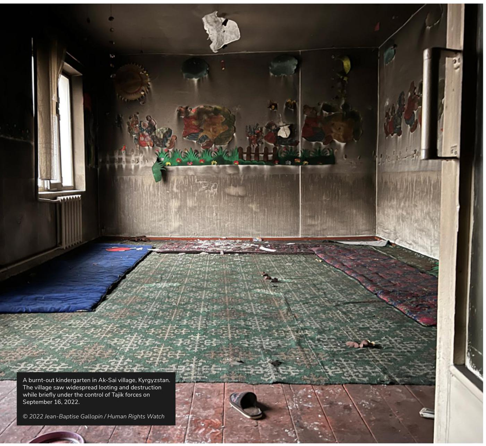
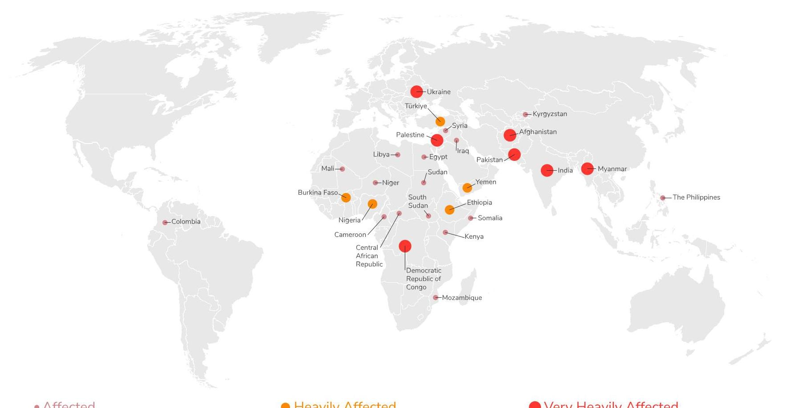
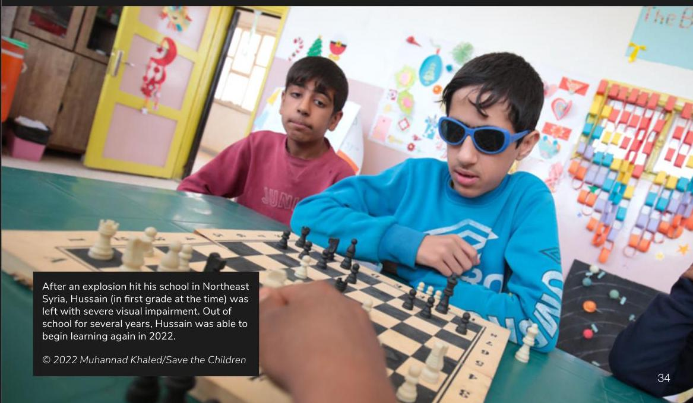
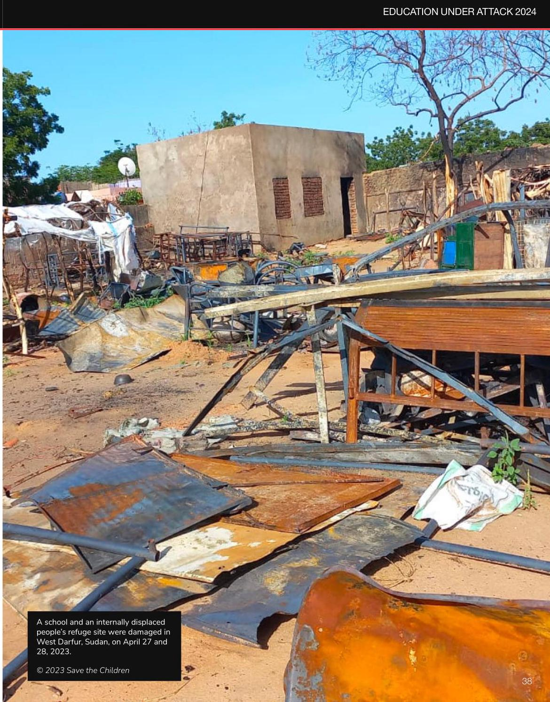
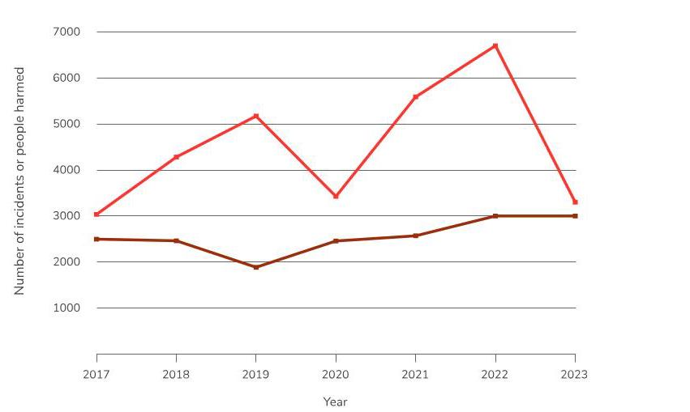

## MONITOR AND REPORT ON ATTACKS ON EDUCATION

- States, international humanitarian and development organizations, civil society, and other monitoring bodies should strengthen monitoring and reporting of attacks on education, while ensuring the protection of personal data and sources, to improve efforts to prevent and respond to attacks on education. This includes disaggregating data by type of attack on education, gender, age, disability, location, person or group responsible, number of days the institution was closed, and type of institution. Use GCPEA's Toolkit for Collecting and Analyzing Data on Attacks on Education.

## HOLD PERPETRATORS TO ACCOUNT AND PROVIDE ASSISTANCE TO SURVIVORS

- States and international justice institutions should promptly and impartially investigate attacks on education and prosecute those responsible.

- States and other institutions should provide non-discriminatory assistance and protection for all survivors of attacks on education, regardless of gender, ethnicity, socio-economic background, or other attributes, while taking into account their distinct needs and experiences based on gender, and potential vulnerabilities such as disability and displacement.

## PLAN FOR AND MITIGATE THE IMPACT OF ATTACKS ON EDUCATION

- Where feasible, states should maintain safe access to education during armed conflict, including by working with school and university communities and all other relevant stakeholders to develop gender- and disability-responsive strategies to reduce the risk of attacks, and comprehensive safety and security plans in the event of these attacks.

- In the case of distance learning or catch-up classes, education providers should ensure that learners who previously ended their studies due to attacks on schools, conflict, or displacement are included, with a specific focus on female students and students with disabilities since they may encounter additional barriers to education.

- Education providers should ensure that education does not exacerbate conflict but promotes peace and provides physical and psychosocial protection for students, including by addressing gender-based stereotypes and barriers that can trigger, exacerbate, and result from attacks on education.

Education providers should "build back better" after attacks on education and ensure funding not only to repair but to improve schools and universities and make them safer and more inclusive to all students and educators.

## GLOBAL OVERVIEW

## INTRODUCTION

Attacks on education were frequent and widespread in 2022 and 2023. GCPEA identified around 6,000 reported attacks on schools and universities, students and educators, and military use of educational facilities, marking a nearly 20 percent increase over the last report.

Attacks on education killed or harmed at least 10,000 school and university students, teachers, professors, and education personnel. This represented an increase of over ten percent compared to the last reporting period. Attacks also damaged hundreds of education facilities and caused schools to close and enrollments to drop.

Education under Attack 2024 tracks attacks on education and military use of education facilities in situations of armed conflict from January 1, 2022, to December 31, 2023. Each of the 28 conflict-affected countries profiled in this report experienced a systematic pattern of attacks on education. ${}^{1}$ In addition to the 28 countries profiled in this report, GCPEA identified sporadic reports of attacks on education in 51 other countries.

Attacks on education are defined as any threat or actual use of force by state armed forces or non-state armed groups, on students, education personnel, or educational infrastructure or materials, for political, military, ideological, sectarian, ethnic, or religious reasons. This report also monitors the use of schools and universities for military or security purposes. ${}^{2}$ Complete definitions of attacks and military use are included in the Methodology section of this report.

## GRAVE IMPACTS ON LEARNING: SUMMARY OF TRENDS IN ATTACKS DURING 2022 AND 2023

In 2022 and 2023, Palestine and Ukraine were the countries where GCPEA recorded the highest incidence of attacks on education. During the same period, India, Pakistan, Palestine, and Afghanistan had the highest reported numbers of people harmed or killed. In these countries, high numbers of students or educators were either harmed as a result of attacks on education, such as in bombings of schools, or impacted in events directly targeting them, such as arrests or abductions.

Attacks on education increased in several countries, compared to the previous reporting period. In Ukraine, for instance, attacks shot up after the full-scale Russian invasion in February 2022, and in Afghanistan, non-state armed groups and the Taliban increased attacks on schools, students, and educators, including against girls and women. After conflict erupted in April 2023 between the Sudanese Armed Forces and the paramilitary Rapid Support Forces, attacks on educational facilities and their military use increased in Sudan. In Palestine, attacks on education peaked in late 2023, following the escalation of hostilities in October of that year, when Hamas-led fighters conducted a large-scale attack into Israel and Israeli armed forces launched an intensive military offensive in the Gaza Strip, including airstrikes and a ground incursion. ${}^{3}$ Education under Attack 2024 also profiles two countries not included in the previous report, Egypt and Kyrgyzstan. Egypt was involved in a conflict with an Islamic State-affiliated armed group in its Sinai Peninsula, ${}^{4}$ whereas Kyrgyzstan experienced an international armed conflict along its border with Tajikistan. ${}^{5}$

Several other countries experienced reductions in attacks on education. Central African Republic (CAR), Libya, Mali, and Mozambique experienced drops in reported violations due to shifts in conflict dynamics, although they remained affected by attacks on education, and a large number of schools were closed due to insecurity in Mali. Of the countries profiled in Education under Attack 2022, the last edition of the report, two countries experienced a decline in attacks during the reporting period to below ten, alongside a decline in violence, and so are not included in this report: Azerbaijan and Thailand.

Attacks on schools remained the most prevalent form of attack on education during the reporting period, making up more than half of all reported incidents. However, military use of schools and universities increased in number and grew as a proportion of all incidents. Reports of military use were most prevalent in Afghanistan, Myanmar, Nigeria, Syria, Ukraine, and Yemen, where armed forces or non-state armed groups occupied schools and universities to use them as bases, barracks, and weapons stores, among other non-educational purposes.

Explosive weapons were used in around one-third of all reported attacks on education during the reporting period. ${}^{6}$ These attacks included airstrikes, rockets, and shelling, as well as the use of improvised explosive devices (IEDs) and landmines. This is significant since the use of explosive weapons, particularly those with wide-area effects, led to increases in child casualties and damage to schools in 2022, according to the UN. ${}^{7}$

Other common attack types included arson, threats, kidnapping, killing with small arms, and repression of education-related protests.

Attacks on education kill and injure students and educators and damage schools and universities, often leading additional educational facilities to close. For instance, suspected members of an armed group attacked and vandalized three schools in Ituri province, Democratic Republic of the Congo (DRC), in April 2023. In the context of increased violence,21 nearby schools suspended classes, impacting around 1,200 students. ${}^{8}$ Attacks also create fear among students and parents and decrease enrollment. The longer students are away due to schools damaged by armed conflict, the less likely they are to resume formal learning. ${}^{9}$ Finally, attacks cause trauma for students and educators, impacting their ability to learn or teach once they return to classes. ${}^{10}$

Attacks on education differentially impacted girls and women during the reporting period. Girls and women were specifically targeted in attacks on education in at least ten countries, including disproportionately with sexual violence at, or on the way to or from, school or university, perpetrated by armed forces, state security forces, or non-state armed groups. Among other impacts, girl and women students experienced more difficulties resuming their education after an attack in many contexts. ${}^{11}$

Students with disabilities, as well as lesbian, gay, bisexual, and transgender (LGBT) students, and students from Indigenous and ethnic minority communities, were also uniquely impacted by attacks on education. For instance, at least 35 schools or institutions for students with disabilities, including blind students, were damaged or destroyed in attacks in Ukraine in 2022. ${}^{12}$ In Türkiye, LGBT students were detained while they marched for equality on the campuses of three universities in May and June 2022. ${}^{13}$ In Colombia, confrontations between armed actors occurred near schools in Indigenous and Afro-Colombian communities, ${}^{14}$ and Indigenous students were reportedly abducted from schools in 2022 and 2023. ${}^{15}$ Targeted attacks on Indigenous or ethnically marginalized students were also reported in the Philippines, ${}^{16}$ Afghanistan, ${}^{17}$ and Pakistan. ${}^{18}$ In some contexts, students from these same groups also faced challenges accessing education. Students with disabilities contended with limited inclusive education opportunities and physical limitations to education buildings; ${}^{19}$ LGBT students, in some places, were monitored by security forces and faced removal from their schools or universities; ${}^{20}$ and Indigenous or ethnic minority students, in certain contexts, were disproportionately affected by forced community confinements and blockades, keeping them from schools. ${}^{21}$ (See the textbox on students with disabilities for more information on this topic).

Attacks on education and military use of schools and universities in profiled countries, 2022-2023

Reports documented 10-199 incidents of attacks on education or military use of educational facilities or 10-199 students and education personnel harmed by attacks on attacks on education or military use of educa-education personnel harmed by attacks

## Very Heavily Affected

Reports documented 400 or more incidents of attacks on education or military use of educational facilities or 400 or more students and education personnel harmed by attacks

# STUDENTS WITH DISABILITIES FACE REDUCED ACCESS TO EDUCATION BEFORE AND AFTER ATTACKS

During armed conflict, students with disabilities may be differentially impacted by attacks on education. If unable to flee attacks independently, students with disabilities can be at greater risk of being killed or injured, if they are abandoned due to a lack of adequate support staff, according to the UN. ${}^{22}$ This can also impact parents’ decision to send children to school, as reported by Human Rights Watch. ${}^{23}$ Conflict-related dangers are also compounded for students with disabilities who lack access to inclusive and accessible education: these can include not receiving mine risk education, or a heightened risk of recruitment and use by armed groups. ${}^{24}$ The UN reported that lack of access to education among students with disabilities during conflict can increase isolation and other psycho-social impacts, including depression. ${}^{25}$ Finally, students with disabilities are more likely than their peers to remain out of school if their education is interrupted. ${}^{26}$

In Myanmar, conflict impacted access to education for students with disabilities, in particular as school buildings with accessibility features were destroyed in 2022 and 2023. ${}^{27}$ Children with disabilities in DRC faced additional barriers to returning to school following armed violence between national forces and armed groups, according to the DRC Education Cluster. ${}^{28}$ The UN reported that many of the institutional care facilities in Ukraine, where around 50,000 children with disabilities were living, have been destroyed or seriously damaged since the full-scale Russian invasion in February 2022, which led to increased risks during evacuations and education disruptions. ${}^{29}$

During the 2022-2023 reporting period, GCPEA identified a number of attacks affecting students with disabilities or the educational facilities where they learned. For example:

- In Cameroon, on February 22, 2022, ten teachers, including nine female teachers, were abducted from the Inclusive Government Bilingual Primary School, a school for children with disabilities, in Bamenda city, North-West region, as reported by international media VOA. ${}^{30}$

Human Rights Watch reported that on March 1, 2022, shelling damaged a boarding school serving blind students in Kharkiv city and region, Ukraine, during Russian bombing of the city. The attack injured one student and the director of the school. ${}^{31}$

Some attacks on education result in disabilities. Although improved reporting is necessary to better understand these impacts, GCPEA has identified a number of attacks that led to surviving students living with a disability. For instance:

- Save the Children reported that on October 29, 2022, a shell struck an alley in Taizz city and governorate, Yemen, while three students were on their way home from school. The explosion caused two of the children to lose legs. ${}^{32}$

- In Afghanistan, the UN reported that on September 30, 2022, an explosive detonated at a tutoring center in Dasht-e-Barchi, Kabul, killing at least 54 people and injuring at least 114. ${}^{33}$ At least one girl student was blinded in one eye and deafened in one ear, according to international media France24. ${}^{34}$

- In Sudan, on June 6, 2023, a female student was blinded in one eye when several shells hit the EI Geneina University female dormitory compound and its vicinity in EI Geneina, West Darfur, according to Amnesty International. ${}^{35}$

Since some attacks on education result in disabilities, new and rehabilitated schools should be disability-inclusive, particularly those serving conflict-affected or refugee children.

In line with the Safe Schools Declaration and United Nations Security Council Resolutions 2601 (2021) and 2475 (2019), ${}^{36}$ governments, donors, humanitarian and development actors, and education providers should:

- Develop and implement disability-responsive risk assessments, education continuity plans, and comprehensive safety and security plans to prevent attacks on education and mitigate their differential impacts on students with disabilities.

- Rebuild or rehabilitate damaged and destroyed schools and universities to be disability-inclusive, in

consultation with local educators and disabled-student-led groups.

- Ensure all mainstream educational programs and alternative education opportunities are accessible to and

inclusive of children with different types of disabilities, including both physical and psychosocial disabilities.

- Ensure that education continuity in the context of armed conflict is provided for all children, including by

providing disability-inclusive training for teachers and support staff.

- Collect and share disability-disaggregated data related to attacks on education.

## ATTACKS ON EDUCATION OCCURRED AGAINST A BACKDROP OF INCREASING CONFLICT

Attacks on education rose globally in 2022 and 2023 against the backdrop of increasing conflict in several regions. Compared to previous years, the number of armed conflicts increased slightly, while the number of deaths linked to conflict increased significantly. ${}^{37}$ The year 2022 saw more conflict-related deaths than any year in over two decades, according to a Peace Research Institute Oslo (PRIO) report. ${}^{38}$ Civilians bore the brunt of this upswing; year-over-year violence targeting civilians increased more than ten percent in 2022, according to the Armed Conflict Location &Event Data Project (ACLED). ${}^{39}$ Conflict increased yet further in 2023, and civilian casualties from explosive weapons rose markedly. ${}^{40}$ The escalation of war in Ukraine in February 2022, alongside the outbreak of conflict in Sudan in April 2023 and escalation of hostilities in Palestine in October 2023, drove much of the uptick in conflict-related violence and deaths during the reporting period. ${}^{41}$ Other factors, such as the expansion of the Islamic State, ${}^{42}$ famine, ${}^{43}$ and climate change ${}^{44}$ also contributed to the increase in conflict.

Across conflicts, children were particularly impacted by violence. The UN Secretary-General's Children and Armed Conflict report recorded the highest ever annual number of grave violations against children in 2022. ${}^{45}$ In addition to an increase in attacks on schools and hospitals, these violations included upticks in the recruitment and use of children, abductions, and killing and maiming. ${}^{46}$

However, the intensity of violence declined in several countries during the reporting period, including Afghanistan, ${}^{47}$ Libya, ${}^{48}$ and Kenya, ${}^{49}$ as well as Azerbaijan. ${}^{50}$ Ceasefires, advances in negotiations, or peace accords were reached in several countries in 2022 and 2023, including in Colombia, ${}^{51}$ Ethiopia, ${}^{52}$ Thailand, ${}^{53}$ and Yemen, ${}^{54}$ as well as between Kyrgyzstan and Tajikistan. ${}^{55}$ Despite advances towards peace, these measures were tenuous in several contexts. ${}^{56}$

In Latin America, notwithstanding peace talks and temporary ceasefires between the government and several armed groups in Colombia, violence against civilians, particularly social and political leaders, peaked in 2022 before decreasing slightly in ${2023}^{57}$

In Europe, the full-scale Russian invasion of Ukraine led to more than ten thousand civilian deaths in 2022 and 2023, particularly due to attacks with explosive weapons, such as airstrikes and shelling, according to the UN and PRIO. ${}^{58}$ Persons with disabilities and older persons faced heightened danger due to their inability to leave high-risk areas, according to Amnesty International and the UN; ${}^{59}$ meanwhile, women and children made up 90 percent of those fleeing conflict-affected areas. ${}^{60}$

In south and central Asia, violence peaked in Kyrgyzstan in September 2022 during border clashes with Ta-jikistan, involving both government forces and civilians, that produced dozens of casualties and forcibly displaced over 140,000 people. ${}^{61}$ In Afghanistan, violence declined overall in 2022 after the Taliban’s takeover from the previous government the prior year. ${}^{62}$ However, the Taliban engaged in fighting with at least 20 non-state armed groups, including the Islamic State Khorasan Province, and severely restricted the basic rights and freedoms of women and girls, including by violently repressing peaceful protests, as reported by the UN. ${}^{63}$ Khyber Pakhtunkhwa and Balochistan provinces, in Pakistan, experienced an increase in Islamist armed group attacks on government forces, including the deadly bombing of a religious building in a police compound in Peshawar city in January 2023, according to International Crisis Group. ${}^{64}$

In the Middle East, child recruitment and use increased in Syria in 2022, despite a decrease in fighting that year, according to the Children and Armed Conflict report and media outlets. ${}^{65}$ In Yemen, violence decreased in 2022 and 2023, compared to previous years, during a UN-mediated ceasefire and even after its lapse. ${}^{66}$ Fighting and violations against civilians, including children, decreased during the six-month truce; ${}^{67}$ however, political violence, human rights abuses, and harm from landmines persisted, according to ACLED and a local human rights organization. ${}^{68}$ In Palestine, the UN reported an increase in grave violations against children in 2022. ${}^{69}$ Violence increased in the Gaza Strip in October 2023 after Hamas-led fighters conducted a large-scale attack into Israel and Israeli armed forces launched an intensive military offensive in the Gaza Strip, including airstrikes and a ground incursion. ${}^{70}$

In Africa, Amnesty International and Human Rights Watch reported that all armed actors in the conflict in northern Ethiopia committed human rights violations and war crimes in 2022, such as extrajudicial executions and sexual violence. ${}^{71}$ Fighting in Tigray region was limited by a peace agreement at the end of that year, ${}^{72}$ but flared up again in Amhara region in August 2023. ${}^{73}$ In Sudan, fighting erupted in April 2023 in Khartoum between government and paramilitary forces, then rapidly spread to other regions of the country, such as Darfur; ${}^{74}$ thousands of civilians have been killed and millions displaced, according to the UN. ${}^{75}$ In northeast Nigeria, armed conflict continued between government forces and Boko Haram, and between Boko Haram and splinter groups such as the Islamic State in West Africa Province, throughout 2023. ${}^{76}$ Meanwhile, in northwestern and northcentral regions of the country, violence persisted between pastoralists and farmer communities, due in part to land scarcity linked to climate change. ${}^{77}$ In Burkina Faso and Mali, Islamic State and al-Qaeda-linked armed groups consolidated control over large swaths of territory, and fighting between these groups and government forces caused significant civilian casualties. ${}^{78}$ As conflict intensified between armed groups and government forces in DRC in 2022, particularly in Ituri and North Kivu provinces, ${}^{79}$ the UN verified an uptick in grave violations against children, including recruitment. ${}^{80}$

In East Asia, fighting between armed resistance groups and the military intensified in Myanmar in 2022, after the military seized power the previous year. ${}^{81}$ The UN reported an increase in the death and injury of children, often attributed to indiscriminate attacks, including airstrikes and the use of other explosive weapons. ${}^{82}$

Globally, demonstrations continued, particularly anti-government protests, with the Carnegie Endowment for International Peace tracking new protests in 83 countries in 2023, including in India and Türkiye. ${}^{83}$ Police continued to violently repress protests in a number of countries, according to ACLED, and protest-related deaths were reported in several countries, including DRC, as well as Sudan before the outbreak of conflict. ${}^{84}$

## MOTIVES FOR ATTACKING EDUCATION DURING THE 2022-2023 REPORTING PERIOD

In 2022 and 2023, schools, universities, students, and teachers faced violence in armed conflicts for diverse reasons. In some contexts, parties to conflict intentionally looted or set fire to schools and universities, or targeted them with explosive weapons, because they oppose a certain type of instruction, such as girls' learning or education they perceive as secular or "Western." In other places, armed groups viewed schools and their staff as agents or symbols of a government they oppose. These education facilities and teachers were then targeted, including by arson, explosives, threats, killings, and abductions. These types of attacks frequently occurred in countries like Afghanistan, Burkina Faso, Cameroon, Mali, Myanmar, Nigeria, Pakistan, and Somalia over the past two years.

In other countries, like Colombia, teachers were targeted for their activism and participation in unions during the reporting period. Meanwhile, students and educators were targeted for ethnic reasons in other contexts, such as in Afghanistan, where Hazara students came under attack. In some countries, when schools serve as polling stations during elections, they become targets for armed groups attempting to disrupt electoral processes or damage voting materials, as was the case in the Philippines during this reporting period.

In other contexts, parties to conflict frequently targeted schools and universities with explosive weapons or used these weapons in populated areas where schools and universities were located. Such attacks included airstrikes and shelling, as well as planting improvised explosive devices (IEDs) and anti-personnel mines. Explosive weapons that produce wide-area effects are particularly dangerous when used in populated areas, since they create a large blast, can spread fragments over a wide radius, and can cause indiscriminate harm to civilians. GCPEA found that explosive weapons were used in around one-third of all reported attacks on education during the reporting period, an increase in proportion compared to the previous two years. In 2022 and 2023, explosive weapons were reportedly used in a significant number of attacks on education in Colombia, Myanmar, Palestine, Sudan, Syria, Ukraine, and Yemen, damaging or destroying schools and universities and harming a significant number of students and educators.

Elsewhere, state police, military, or paramilitary forces arrested, or used excessive force against, school and university students and staff for holding on-campus protests or for protesting over education-related grievances, such as in Afghanistan, India, and Türkiye.

In yet other contexts, military use of schools or universities provoked rival armed forces or groups to target the educational facility. In 2022 and 2023, state military, police, and non-state armed groups used schools and universities for tactical purposes, for example as bases, barracks, fighting positions, or as detention or interrogation centers. GCPEA identified military use preceding attacks on educational facilities by rival forces or groups in a number of countries, including Colombia, Ethiopia, Iraq, Myanmar, Syria, Egypt, and Ukraine.

## SPOTLIGHT ON SAHEL SPILLOVER VIOLENCE IMPACTING EDUCATION IN WEST AFRICAN COASTAL COUNTRIES

Spreading violence from the Central Sahel into neighboring West African coastal countries began impacting access to education during the reporting period. Côte d'Ivoire, Benin, Ghana, and Togo were particularly affected by the spillover, according to the UN. ${}^{85}$ In the Central Sahel countries of Burkina Faso, Mali, and Niger profiled in this report, GCPEA identified at least 440 attacks on education during the reporting period; in addition, GCPEA identified a growing trend of non-state armed groups targeting education in Benin.

Attacks by non-state armed groups in West African coastal countries have been reported since 2018, ${}^{86}$ and in early 2021, Jama'at Nusrat al-Islam wal-Muslimin (JNIM) claimed a number of attacks in Togo and on the Beninois army in northern Benin. ${}^{87}$ Of particular concern was northern Benin where, according to ACLED, non-state armed groups perpetrated 25 attacks against civilians and military targets in the second half of 2022, compared to two in the same period of the previous year. ${}^{88}$ In response, Côte d'Ivoire, Benin, Ghana, and Togo have been increasing military operations in northern regions that border Burkina Faso, Mali, and Niger. ${}^{89}$

Schools increasingly closed in these West African coastal countries due to insecurity in 2022 and 2023. ${}^{90}$ For example, the UN reported in mid-2022 that four schools were closed in Matéri commune, northern Benin; ${}^{91}$ in the second half of the year, at least 17 schools closed in the country because of actual or threatened violence, including arson, affecting hundreds of students. ${}^{92}$ In Togo, the UN reported that seven primary schools and two kindergartens remained closed after school holidays in areas experiencing military operations in late 2022. ${}^{93}$

Benin experienced a dozen attacks on education in 2022 and 2023. Although a significant number, Benin has not been profiled in the report based on GCPEA's criteria, which are set out in the Methodology section. Eleven were attacks on schools and one was an attack on a teacher and students. Attacks on schools included arson and threats. For example:

- In April 2022, suspected members of an armed group reportedly abducted a Quranic teacher and eight of his students from a village in Banikoara town, Alibori department, and allegedly killed the teacher, as reported by ACLED. ${}^{94}$

- In October 2022, suspected members of an armed group reportedly entered a school in Banikoara town, Alibori department, and left a note demanding the closure of primary and secondary schools and threatening violence, according to local media. ${}^{95}$

- On February 26, 2023, suspected members of an armed group reportedly looted the office of the director of the Public Primary School in Gama Founougo district, Banikoara, Alibori department, as reported by ACLED. ${}^{96}$

In this context, governments, donors, and humanitarian and development actors should prioritize and fund measures to prevent, mitigate, and respond to attacks on education. These include the development of risk assessments, education continuity plans, and comprehensive safety and security plans; the promotion of strong regional cooperation to monitor and report on attacks on education; and the exchange of good practices in

implementing the Safe Schools Declaration and Guidelines for Protecting Schools and Universities from Military Use during Armed Conflict to ensure policies are in place to prevent military use before the crisis potentially intensifies. All the West African coastal countries listed above have endorsed the Safe Schools Declaration.

## GLOBAL TRENDS IN ATTACKS ON EDUCATION: 2022-2023

During the 2022-2023 reporting period, GPCEA identified around 6,000 reports of attacks on education and military use globally. These attacks harmed at least 10,000 students and education personnel. This marked an increase in attacks on education and military use, as well as a rise in the number of students and educators harmed, as compared to the previous reporting period. In comparison, GCPEA collected more than 5,000 reported incidents of attacks on education and military use that harmed approximately 9,000 students and education personnel, in 2020 and 2021.

In 2022, the number of reported attacks on education and military use of schools increased 17 percent globally, as compared to 2021, with the number of attacks growing to over 3,000 from approximately 2,570 . Meanwhile, the number of students and educators reported killed, injured, abducted, arrested, or otherwise harmed by attacks on education increased by 20 percent year-over-year, with the number of students and educators killed or harmed increasing to more than 6,700 from around 5,600.

In 2023, the global number of attacks and military use remained more or less constant, as compared to 2022, with around 3,000 attacks reported. However, the number of students and educators reported killed, injured, abducted, arrested, or otherwise harmed by attacks on education decreased in 2023, with around 3,300 incidents reported. One reason the number of students and educators harmed or killed might have declined in 2023 is that schools and universities closed when hostilities escalated in countries such as Sudan and Palestine, meaning students and staff were less likely to be in education facilities during attacks. GCPEA also noted a decrease in the number of year-over-year arrests reported during education-related protests as compared to 2022.

From 2017 to 2023, over 2,000 attacks on education and incidents of military use of educational facilities have been reported per year, except in 2019 when attacks dipped below that threshold. Meanwhile, GCPEA has noted several year-over-year increases in the number of students or education personnel killed or harmed by attacks on education since 2017. The exception was a decline in 2020 when many students and educators were not in schools or universities and education-related protests decreased due to the Covid-19 pandemic. 2023 also saw a reduction in the number of students and educators reportedly killed or harmed as compared to the two previous years.

GCPEA identified reports of attacks on education in 79 countries during the reporting period. This included the 28 countries profiled in this report as well as 51 countries where GCPEA identified reports of isolated or occasional attacks on education in 2022 and 2023 or that experienced attacks on education but were not in armed conflict. This number marks a slight decline compared to 2020 and 2021, when GCPEA identified a total of 84 countries that had experienced at least one attack on education or case of military use. Attacks in non-profiled countries largely consisted of violent repression of education-related protests, affecting school and university students and educators, and, in some cases, attacks against schools involving explosive weapons or arson. Incidents of attacks on education and military use, and people harmed, 2017-2023

## VERY HEAVILY AFFECTED COUNTRIES

In 2022 and 2023, GCPEA identified seven countries that experienced over 400 incidents of attacks on education and military use of educational facilities, or where more than 400 people were harmed, and were thus categorized as very heavily affected. Afghanistan, DRC, India, Myanmar, Pakistan, Palestine, and Ukraine met these criteria.

In Afghanistan, attacks on schools, school students, and education personnel continued during the 2022- 2023 reporting period, including a number of attacks on higher education, particularly targeted at female students and staff. In addition, the Taliban used at least 54 schools for military purposes. In DRC, over 430 schools were attacked, with most damaged or destroyed, as armed conflict intensified. The number of reported attacks on education decreased slightly in 2022 and 2023, at over 500 , compared to the previous reporting period, when more than 700 occurred. North Kivu, Ituri, and Mai-Ndombe regions were most heavily affected. Attacks on students continued in Jammu and Kashmir, India, while schools came under attack in some eastern states and repression of higher education protests continued in several states. As conflict between the military and non-state armed groups intensified in Myanmar following the 2021 military takeover, GCPEA identified over 245 reports of attacks on schools and at least 190 reports of military use.

In Pakistan, attacks on education increased during the reporting period, when over 620 students and staff were arrested by the police during education-related protests. The number of reported attacks in Palestine