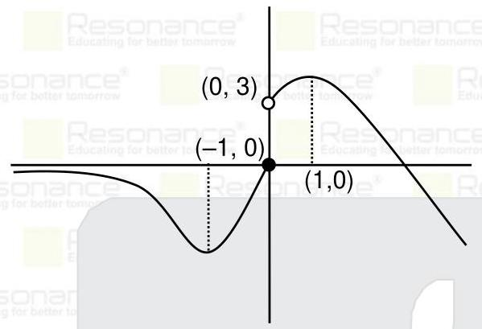
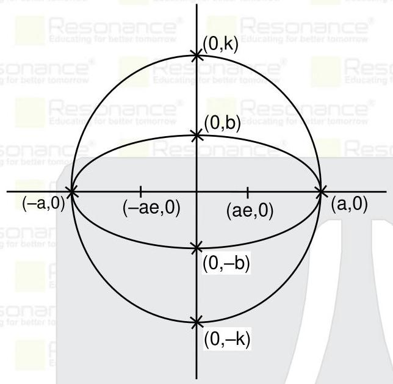

PART : MATHEMATICS If $A = \left\lbrack  \begin{array}{lll} 0 & 1 & 0 \\  1 & 0 & 0 \\  0 & 0 & 1 \end{array}\right\rbrack$ and $B$ be a $3 \times  3$ matrix whose entries are $\{ 1,2,3,4,5\}$ , then the number of possible matrices $B$ such that ${AB} = {BA}$ are : (1) 240 (2) 320 (3) 120 (4) 100 Ans. (3) Sol. $A = \left\lbrack  \begin{array}{lll} 0 & 1 & 0 \\  1 & 0 & 0 \\  0 & 0 & 1 \end{array}\right\rbrack$ Let $B = \left\lbrack  \begin{array}{lll} a & b & c \\  p & q & r \\  x & y & z \end{array}\right\rbrack$ Now ${AB} = {BA}$ $\Rightarrow  \left\lbrack  \begin{array}{lll} p & q & r \\  a & b & c \\  x & y & z \end{array}\right\rbrack   = \left\lbrack  \begin{array}{lll} b & a & c \\  q & p & r \\  y & x & z \end{array}\right\rbrack$ $\Rightarrow  p = b, a = q, r = c, x = y,\& z = z$ Hence number of such matrices are $5! = {120}$

2 The number of all possible numbers less than 10000 that can be formed using the digits0,2,4,6,8 (without repetition) are : Ans. 165 Sol. 1 digit numbers $= 5$ 2 digit numbers $= \underline{4} \cdot  \underline{4} = {16}$ 3 digit numbers $= \underline{4}.\underline{4}\underline{3} = {48}$ 4 digit numbers $= \underline{4}.\underline{4}3\underline{2} = {96}$ Total $= 5 + {16} + {48} + {96} = {165}$

3 If a circle ${36}{x}^{2} + {36}{y}^{2} - {108x} + {120y} + c = 0$ neither touches nor cuts the co-ordinate axis and point of intersection of lines $x - {2y} = 4$ and ${2x} - y = 5$ also lies inside the circle, then the value of $c$ lies in :

(1) ${81} < c < {156}$ (2) ${100} < \mathrm{c} < {156}$ (3) ${81} < c < {150}$ (4) ${100} < \mathrm{c} < {150}$

Ans. (2)

Sol. Intersection point of ${2x} - y = 5$ and $x - {2y} = 4$ is(2, - 1)

So,(2, - 1)lies indie the circle $\Rightarrow  {S}_{1} < 0$

${36}{\left( 2\right) }^{2} + {36}{\left( -1\right) }^{2} - {108}\left( 2\right)  + {120}\left( {-1}\right)  + c < 0$

$c < {156}\ldots \ldots$ (i)

## Resonance Eduventures Ltd.

Reg. Office & Corp. Office : CG Tower, A-46 & 52, IPIA, Near City Mall, Jhalawar Road, Kota (Raj.) - 324005 Ph. No.: +91-744-2777777, 2777700 | FAX No. : +91-022-39167222 To Know more : sms RESO at 56677 | Website : www.resonance.ac.in | E-mail : contact@resonance.ac.in | CIN : U80302RJ2007PLC024029 Toll Free : 1800 258 5555 § 7340010333 § facebook.com/ResonanceEdu § twitter.com/ResonanceEdu § www.youtube.com/resovatch § biog.resonance.ac.in This solution was download from Resonance JEE (MAIN) 2021 Solution portal $\because$ circle ${36}{x}^{2} + {36}{y}^{2} - {108x} + {120y} + c = 0$ neither touches nor cuts the co-ordinate axis so ${\mathrm{g}}^{2} - \mathrm{c} < 0 \Rightarrow  {\left( \frac{-3}{2}\right) }^{2} - \frac{\mathrm{c}}{36} < 0 \Rightarrow  \mathrm{c} > {81}.$ (ii) and ${\mathrm{f}}^{2} - \mathrm{c} < 0 \Rightarrow  {\left( \frac{5}{3}\right) }^{2} - \frac{\mathrm{c}}{36} < 0 \Rightarrow  \mathrm{c} > {100}$ .(iii)From (i), (ii) and (iii) ${100} < \mathrm{c} < {156}$ 4. If line ${2x} + y = k,\left( {k < 0}\right)$ is a tangent to both the curves ${x}^{2} - {y}^{2} = 3$ and ${y}^{2} = {\alpha x}$ , then the value of $\alpha$ is

Ans. 24.00

Sol. Given slope of line $\left( \mathrm{m}\right)  =  - 2$

slope form of tangent to the curve ${x}^{2} - {y}^{2} = 3$ is $y = {mx} \pm  \sqrt{{a}^{2}{m}^{2} - {b}^{2}}$

$\Rightarrow  \mathrm{y} =  - 2\mathrm{x} \pm  3$

On comparing, with the equation ${2x} + y = k,\left( {k < 0}\right)  \Rightarrow  k =  - 3$

Now, slope form of tangent to the parabola ${y}^{2} = {\alpha x}$ is $y = {mx} + \frac{\alpha }{4m}$

But $m =  - 2$ so

$y =  - {2x} + \frac{\alpha }{4\left( {-2}\right) } \Rightarrow   - 3 = \frac{\alpha }{4 \times  \left( {-2}\right) }$

$$
\alpha  = {24}
$$

5. The number of all possible values of $n \in  \{ 1,2,3,\ldots {100}\}$ which satisfy the condition ${11}^{n} > {10}^{n} + {9}^{n}$ is: Ans. (96) Sol. Let ${11}^{n} > {10}^{n} + {9}^{n}$ $n \in  \{ 1,2,3,\_ \_ \_ \_ {100}\}$ $\Rightarrow  {11}^{n} - {9}^{n} > {10}^{n}$ $\Rightarrow  {\left( {10} + 1\right) }^{n} - {\left( {10} - 1\right) }^{n} > {10}^{n}$ $\Rightarrow  2\left\lbrack  {{}^{n}{\mathrm{C}}_{1}{10}^{n - 1} + {}^{n}{\mathrm{C}}_{3}{10}^{n - 3} + {}^{n}{\mathrm{C}}_{5}{10}^{n - 5} + \ldots \ldots }\right\rbrack   > {10}^{n}$ $\Rightarrow  \frac{1}{5}\left\lbrack  {{}^{n}{\mathrm{C}}_{1}{10}^{n}{ + }^{n}{\mathrm{C}}_{3}{10}^{n - 2}{ + }^{n}{\mathrm{C}}_{5}{10}^{n - 4} + \ldots \ldots }\right\rbrack   > {10}^{n}$ $\Rightarrow  \frac{1}{5}\left\lbrack  {{}^{n}{\mathrm{C}}_{1} + {}^{n}{\mathrm{C}}_{3}{10}^{-2} + {}^{n}{\mathrm{C}}_{5}{10}^{-4} + \ldots \ldots }\right\rbrack   > 1$ Clearly the above inequality is true for $n \geq  5$ For $n = 4$ we have $\frac{1}{5}\left\lbrack  {4 + \frac{4}{{10}^{2}}}\right\rbrack   = \frac{4}{5}\left( \frac{101}{100}\right)  < 1$ , Rejected Hence, number of such $n \in  \{ 1,2,3,\_ \_ \_ {100}\}$ is equal to 96

## Resonance Eduventures Ltd.

Reg. Office & Corp. Office : CG Tower, A-46 & 52, IPIA, Near City Mall, Jhalawar Road, Kota (Raj.) - 324005 Ph. No.: +91-744-2777777, 2777700 | FAX No. : +91-022-39167222

℃、NoW more:sms RESO at 56677 | Website : www.resonance.ac.in | E-mail : contact@resonance.ac.in | CIN : U80302RJ2007PLC024029 Toll Free : 1800 258 5555 @ 7340010333 11 facebook.com/ResonanceEdu · Twitter.com/ResonanceEdu · Bwww.youtube.com/resowatch · B biog.resonance.ac.in This solution was download from Resonance JEE (MAIN) 2021 Solution portal

A REC PA PA PA PA PA PA PA PA PA PA PA PA PA PA PA PA PA PA PA PA PA PA PA PA PA PA PA PA PA PA PA PA PA PA PA PA PA PA PA PA PA PA PA PA PA PA PA PA PA PA PA PA PA PA PA PA PA PA PA PA PA PA PA PA PA PA PA PA PA PA PA PA PA PA PA PA PA PA PA PA PA PA PA PA PA PA PA PA PA PA PA PA PA PA PA PA PA PA PA PA PA PA PA PA PA PA PA PA PA PA PA PA PA PA PA PA PA PA PA PA PA PA PA PA PA PA PA PA PA PA PA PA PA PA PA PA PA PA PA PA PA PA PA PA PA PA PA PA PA PA PA PA PA PA PA PA PA PA PA PA PA PA PA PA PA PA PA PA PA PA PA PA PA PA PA PA PA PA PA PA PA PA PA PA PA PA PA PA PA PA PA PA PA PA P PA PA P PA P PA P PA P P PA P PA P PA P PA P P PA P A P P A P PA P A P A P A P A P A A P A P A A P A A A A A P A A A A A P A A A A A P A A A A A A A A A A P A A A A P A A A P A P P A P A P P S S P P S S P P P P S P P P FA P P P P P P P P P P P P P P P P P P P P

6. If an AP, ${S}_{10} = {530}\& {S}_{5} = {140}$ (where ${S}_{n}$ denotes the sum of first $n$ terms of an AP), then the value of

${\mathrm{S}}_{20} - {\mathrm{S}}_{6}$ is

(1) 1562 (2) 1862 (3) 1762 (4) 1662

Ans. (2)

Sol. ${S}_{10} = {530}$

$$
\frac{10}{2}\left\lbrack  {{2a} + {9d}}\right\rbrack   = {530}
$$

$$
{2a} + {9d} = {106} \tag{1}
$$

${\mathrm{S}}_{5} = {140}$

$\frac{5}{2}\left\lbrack  {{2a} + {4d}}\right\rbrack   = {140}$

${2a} + {4d} = {56}$ (2)

${5d} = {50}$

$\mathrm{d} = {10}$

a = 8

Now,

${\mathrm{S}}_{20} - {\mathrm{S}}_{6} =$

${10}\left\lbrack  {{2a} + {19d}}\right\rbrack   - 3\left\lbrack  {{2a} + {5d}}\right\rbrack$

14a + 175d

${14} \times  8 + \left( {175}\right) {10} = {1862}$

7. The value of $r$ for which the term independent of $x$ in the expansion of ${\left( 2{x}^{r} + \frac{1}{{x}^{2}}\right) }^{10}$ is 180 is:

(1) 7 (2) 8 (3) 9 (4) 10

Ans. (2)

Sol. ${T}_{k + 1} = {}^{10}{C}_{k}{\left( 2{x}^{r}\right) }^{{10} - k}{\left( x\right) }^{-{2k}} \Rightarrow  {}^{10}{C}_{k}{2}^{\left( {10} - k\right) } \cdot  {x}^{{10r} - {rk} - {2k}}$

Now, ${10}\mathrm{r} - \mathrm{{rk}} - 2\mathrm{k} = 0 \Rightarrow  \mathrm{r} = \frac{2\mathrm{k}}{{10} - \mathrm{k}}$

And ${}^{10}{\mathrm{C}}_{\mathrm{k}}{\left( 2\right) }^{{10} - \mathrm{k}} = {180} \Rightarrow  \mathrm{k} = 8$

$r = \frac{2 \times  8}{{10} - 8} = 8$ 8. If $f\left( x\right)  = \left\{  \begin{matrix}  - \frac{4}{3}{x}^{3} + 2{x}^{2} + 3; & x > 0 \\  {3x}{e}^{x}\;; & x \leq  0 \end{matrix}\right.$ then interval in which $f\left( x\right)$ is increasing, is : (1) $\left( {-1,\frac{3}{2}}\right)$ (2)(0,1) (3) $\left( {\frac{-3}{2},1}\right)$ (4) $\left( {\frac{1}{2},2}\right)$ Ans. (B)

## Resonance Eduventures Ltd.

Reg. Office & Corp. Office : CG Tower, A-46 & 52, IPIA, Near City Mall, Jhalawar Road, Kota (Raj.) - 324005 Ph. No.: +91-744-2777777, 2777700 | FAX No. : +91-022-39167222

To Know more : sms RESO at 56677 | Website : www.resonance.ac.in | E-mail : contact@resonance.ac.in | CIN : U80302RJ2007PLC024029 Toll Free : 1800 258 5555 © 7340010333 [7] facebook.com/ResonanceEdu · Twitter.com/ResonanceEdu · 8 www.youtube.com/resovatch · 5 bbg.resonance.ac.in This solution was download from Resonance JEE (MAIN) 2021 Solution portal

$$
\text{Sol.}{f}^{\prime }\left( x\right)  = \left\{  \begin{array}{ll}  - 4{x}^{2} + {4x} & , x > 0 \\  3\left( {x \cdot  {e}^{x} + {e}^{x}}\right) & , x \leq  0 \end{array}\right.
$$

If ${z}^{2} + 3\bar{z} = 0$ has $n$ solutions, then the value of $\mathop{\sum }\limits_{{k = 0}}^{\infty }\frac{1}{{n}^{k}}$ is :

(1) $\frac{3}{4}$ (2) $\frac{4}{3}$ (3) $\frac{5}{5}$ (4) $\frac{1}{2}$

Ans. (2)

Sol. Let $z = x + {iy}$

${\left( x + iy\right) }^{2} + 3\left( {x - {iy}}\right)  = 0$

${x}^{2} - {y}^{2} + {2ixy} + {3x} - {3iy} = 0$

${x}^{2} - {y}^{2} + {3x} = 0\& {2xy} - {3y} = 0$

Case-1: $y = 0$

${x}^{2} - {y}^{2} + {3x} = 0$

$\Rightarrow  \mathrm{x} = 0$ or $\mathrm{x} =  - 3$

Solutions are $z = 0$ and $z =  - 3$

Case-2: $x = \frac{3}{2}$

$$
{x}^{2} - {y}^{2} + {3x} = 0
$$

$\Rightarrow  y = \frac{3\sqrt{3}}{2}$ or $y = \frac{-3\sqrt{3}}{2}$

Solutions are $z = \frac{3}{2} + i\frac{3\sqrt{3}}{2}$ and $z = \frac{3}{2} - i\frac{3\sqrt{3}}{2}$

Total number of solutions $= n = 4$

So $\mathop{\sum }\limits_{{k = 0}}^{\infty }\frac{1}{{4}^{k}} = \frac{1}{1 - \frac{1}{4}} = \frac{4}{3}$ Ans. Resonance Eduventures Ltd. Reg. Office & Corp. Office : CG Tower, A-46 & 52, IPIA, Near City Mall, Jhalawar Road, Kota (Raj.) - 324005 Ph. No.: +91-744-2777777, 2777700 | FAX No. : +91-022-39167222 To Know more : sms RESO at 56677 | Website : www.resonance.ac.in | E-mail : contact@resonance.ac.in | CIN : U80302RJ2007PLC024029 Toll Free : 1800 258 5555 § 7340010333 F. facebook.com/ResonanceEdu § twitter.com/ResonanceEdu § www.youtube.com/resowatch § biog.resonance.ac.in This solution was download from Resonance JEE (MAIN) 2021 Solution portal

$$
= \mathop{\lim }\limits_{{x \rightarrow  {0}^{ - }}}\frac{{x}^{3} \times  x}{4{\sin }^{4}x}\frac{\ln \left( {1 + {\alpha x}{e}^{x}}\right)  - 2\ln \left( {1 + x{e}^{x}}\right) }{x}
$$

$$
= \mathop{\lim }\limits_{{x \rightarrow  {0}^{ - }}}\frac{1}{4}\frac{\ln \left( {1 + {\alpha x}{e}^{x}}\right)  - 2\ln \left( {1 + x{e}^{x}}\right) }{x}
$$

$$
= \mathop{\lim }\limits_{{x \rightarrow  {0}^{ - }}}\frac{1}{4}\left\{  {\frac{\ell n\left( {1 + {\alpha x}{e}^{x}}\right) \alpha {e}^{x}}{\alpha {e}^{x}} - \frac{2\ell n\left( {1 + x{e}^{x}}\right) }{\alpha {e}^{x}}{e}^{x}}\right\}
$$

$$
= \mathop{\lim }\limits_{{x \rightarrow  {0}^{ - }}}\frac{1}{4}\left\{  {\alpha {e}^{x} - 2{e}^{x}}\right\}
$$

$$
= \frac{1}{4}\left( {\alpha  - 2}\right)
$$

$$
\text{Now,}\mathop{\lim }\limits_{{x \rightarrow  {0}^{ + }}}\alpha  = \alpha
$$

/ perspective country of determination of JEE MAIN-2021 | DATE : 22-07-2021 (SHIFT-2) | PAPER-1 | MEMORY BASED | MATHEMATICS

10 The number of solutions of the equation ${\sin }^{7}x + {\cos }^{7}x = 1$ in the interval $\left\lbrack  {0,{4\pi }}\right\rbrack$ is :

(1) 7 (2) 9 (3) 14 (4) 5

Ans. (4)

Sol. ${\sin }^{2}x + {\cos }^{2}x = 1,{\sin }^{2}x \leq  1$ and ${\cos }^{2}x \leq  1$

${\sin }^{7}x \leq  {\sin }^{2}x$

${\cos }^{7}x \leq  {\cos }^{2}x$

so, ${\sin }^{7}x + {\cos }^{7}x \leq  1$

${\sin }^{7}x + {\cos }^{7}x = 1$ when ${\sin }^{7}x = {\sin }^{2}x\;\& {\cos }^{7}x = {\cos }^{2}x$

Case-1 : $\sin x = 0,\cos x = 1 \Rightarrow  x = 0,{2\pi },{4\pi }$

Case-2 : $\sin x = 1,\cos x = 0 \Rightarrow  x = \frac{\pi }{2},\frac{5\pi }{2}$

Total number of solutions $= 5$

11. The sum of all natural numbers belonging to the set $\{ 1,2,3\ldots \ldots {100}\}$ , whose HCF with 2304 is 1, is

(1) 2449 (2) 1633 (3) 1449 (4) 2633

Ans. (2)

Sol. ${2304} = {2}^{8} \cdot  {3}^{2}$

Hence $n$ can not be multiple of 2 or 3

Then sum is

$\Rightarrow  \mathrm{n}\left( 1\right)  - \left( {\mathrm{n}\left( 2\right)  + \mathrm{n}\left( 3\right)  - \mathrm{n}\left( 6\right) }\right)$

(where n(a) means the sum of all numbers belonging to the set $\{ 1,2,3\ldots \ldots {100}\}$ , which are divisible by a)

$\Rightarrow  \frac{{100} \times  {101}}{2} - \frac{2 \times  {50} \times  {51}}{2} - 3 \times  \frac{{33} \times  {34}}{2} + 6 \times  \frac{{17} \times  {16}}{2}$

$\Rightarrow  {5050} - {2550} - {1683} + {816}$

$\Rightarrow  {1633}$

12. If $f\left( x\right)$ is a continuous function defined as $f\left( x\right)  = \left\{  \begin{matrix} \frac{{x}^{3}}{{\left( 1 - \cos 2x\right) }^{2}}\ln \left( \frac{1 + {cx}{e}^{x}}{{\left( 1 + x{e}^{x}\right) }^{2}}\right) & ; & x < 0 \\  \alpha & ; & x \geq  0 \end{matrix}\right.$ , then the value

of $\alpha$ is

(1) $\frac{-2}{3}$ (2) $\frac{2}{3}$ (3) $\frac{1}{3}$ (4) $\frac{-1}{3}$

Ans. (1)

Sol. $= \mathop{\lim }\limits_{{x \rightarrow  {0}^{ - }}}\frac{{x}^{3}}{{\left( 1 - \cos 2x\right) }^{2}}\ln \left( \frac{1 + {\alpha x}{e}^{x}}{{\left( 1 + x{e}^{x}\right) }^{2}}\right)$

## Resonance Eduventures Ltd.

Reg. Office & Corp. Office : CG Tower, A-46 & 52, IPIA, Near City Mall, Jhalawar Road, Kota (Raj.) - 324005 Ph. No.: +91-744-2777777, 2777700 | FAX No. : +91-022-39167222

now more : sms RESO at 56677 | Website : www.resonance.ac.in | E-mail : contact@resonance.ac.in | CIN : U80302RJ2007PLC024029 Toll Free : 1800 258 5555 § 7340010333 § facebook.com/ResonanceEdu § twitter.com/ResonanceEdu § www.youtube.com/resovatch § biog.resonance.ac.in This solution was download from Resonance JEE (MAIN) 2021 Solution portal

$\because \mathrm{f}\left( \mathrm{x}\right)$ is continuous function so

$$
\frac{\alpha  - 2}{4} = \alpha  \Rightarrow  \alpha  = \frac{-2}{3}
$$

13 If the domain of $f\left( x\right)  = \frac{{\cos }^{-1}\sqrt{{x}^{2} - x + 1}}{\sqrt{{\sin }^{-1}\left( \frac{{2x} - 1}{2}\right) }}$ is $(\alpha  + \beta \rbrack$ , then the value of $\alpha  + \beta$ is :

(1) $\frac{1}{2}$ (2) $\frac{3}{2}$ (3) 1 (4) 2 Ans. (2) Sol. $0 \leq  {x}^{2} - x + 1 \leq  1$ and $0 < \frac{{2x} - 1}{2} \leq  1$ $\Rightarrow  \;\mathrm{x}\left( {\mathrm{x} - 1}\right)  \leq  0\;\& \;1 < 2\mathrm{x} \leq  3$ $\Rightarrow  \;\mathrm{x} \in  \left\lbrack  {0,1}\right\rbrack   \cap  \mathrm{x} \in  \left( {\frac{1}{2},\frac{3}{2}}\right\rbrack$ $\Rightarrow  \;\mathrm{x} \in  \left( {\frac{1}{2},1}\right\rbrack$ Hence $\alpha  + \beta  = \frac{1}{2} + 1 = \frac{3}{2}$

4. Let ${E}_{1}$ and ${E}_{2}$ be two Ellipses with same eccentricity. Where ${E}_{1} = \frac{{x}^{2}}{{a}^{2}} + \frac{{y}^{2}}{{b}^{2}} = 1,\left( {a > b}\right)$ and ${E}_{2}$ is such that it passes through the end points of major axis of ${E}_{1}$ also end points of minor axis of ${E}_{1}$ are foci of ${\mathrm{E}}_{2}$ . Find the eccentricity of ${\mathrm{E}}_{1}$

(1) $\sqrt{\frac{\sqrt{5} - 3}{2}}$ (2) $\sqrt{\frac{\sqrt{5} + 3}{2}}$ (3) $\frac{\sqrt{5} + 1}{2}$ (4) $\frac{\sqrt{5} - 1}{2}$

## Resonance Eduventures Ltd.

Reg. Office & Corp. Office : CG Tower, A-46 & 52, IPIA, Near City Mall, Jhalawar Road, Kota (Raj.) - 324005 Ph. No.: +91-744-2777777, 2777700 | FAX No. : +91-022-39167222

To Know more : sms RESO at 56677 | Website : www.resonance.ac.in | E-mail : contact@resonance.ac.in | CIN : U80302RJ2007PLC024029 Toll Free : 1800 258 5555 § 7340010333 § facebook.com/ResonanceEdu § twitter.com/ResonanceEdu § www.youtube.com/resovatch § biog.resonance.ac.in This solution was download from Resonance JEE (MAIN) 2021 Solution portal PAGE # 6

$$
{t}^{2} + t - 2 = 0
$$

$$
\left( {t + 2}\right) \left( {t - 1}\right)  = 0
$$

$$
t = 1, - 2
$$

Ans. (4) Sol.

Eccentricity of ${E}_{1}$ is $e \Rightarrow  {e}^{2} = 1 - \frac{{b}^{2}}{{a}^{2}}$

Eccentricity of ${E}_{2}$ is $e \Rightarrow  {e}^{2} = 1 - \frac{{a}^{2}}{{k}^{2}}$

So, ${e}^{2} = 1 - \frac{{b}^{2}}{{a}^{2}} = 1 - \frac{{a}^{2}}{{k}^{2}} \Rightarrow  k = \frac{{a}^{2}}{b}$ (i)

Also $\;{ke} = b$ (ii)

From equation (i) and (ii) $e = \frac{{b}^{2}}{{a}^{2}}$

Since ${e}^{2} = 1 - \frac{{b}^{2}}{{a}^{2}} \Rightarrow  {e}^{2} = 1 - e$

$$
\Rightarrow  {\mathrm{e}}^{2} + \mathrm{e} - 1 = 0
$$

$$
\Rightarrow  \mathrm{e} = \frac{\sqrt{5} - 1}{2}
$$

15. Value of $x$ for which ${\left\lbrack  {e}^{x}\right\rbrack  }^{2} + \left\lbrack  {{e}^{x} + 1}\right\rbrack   - 3 = 0$ is

(1) $\left\lbrack  {e,{e}^{2}}\right\rbrack$ (2) $\left\lbrack  {0,\mathrm{e}}\right\rbrack$ (3) [e, $\ell {\mathrm{n}2}\rbrack$ (4) $\left\lbrack  {0,\ell {n2}}\right\rbrack$

Ans. (4)

Sol. ${\left\lbrack  {e}^{x}\right\rbrack  }^{2} + \left\lbrack  {{e}^{x} + 1}\right\rbrack   - 3 = 0$

${\left\lbrack  {\mathrm{e}}^{x}\right\rbrack  }^{2} + \left\lbrack  {\mathrm{e}}^{x}\right\rbrack   - 2 = 0$

Let $\left\lbrack  {\mathrm{e}}^{x}\right\rbrack   = \mathrm{t}$ Resonance Eduventures Ltd.

Reg. Office & Corp. Office : CG Tower, A-46 & 52, IPIA, Near City Mall, Jhalawar Road, Kota (Raj.) - 324005 Ph. No.: +91-744-2777777, 2777700 | FAX No. : +91-022-39167222 To Know more : sms RESO at 56677 | Website : www.resonance.ac.in | E-mail : contact@resonance.ac.in | CIN : U80302RJ2007PLC024029 Toll Free : 1800 258 5555 § 7340010333 § facebook.com/ResonanceEdu § twitter.com/ResonanceEdu § www.youtube.com/resovatch § biog.resonance.ac.in This solution was download from Resonance JEE (MAIN) 2021 Solution portal

$\left\lbrack  {e}^{x}\right\rbrack   : 1, - 2$ (-2 is not possible)

$$
\left\lbrack  {\mathrm{e}}^{x}\right\rbrack   = 1
$$

$x \in  \left\lbrack  {0,\ell {n2}}\right\rbrack$

16. Evaluates $\int \frac{{e}^{x}\left( {2 - {x}^{2}}\right) }{\left( {1 - x}\right) \sqrt{1 - {x}^{2}}}{dx}$

(1) ${e}^{x}\sqrt{\frac{1 + x}{1 - {2x}}} + C$ (2) ${e}^{x}\sqrt{\frac{1 + x}{1 - x}} + C$ (3) ${e}^{x}\sqrt{\frac{1 - x}{1 + x}} + C$ (4) ${e}^{x}\left( \frac{1 + x}{1 - x}\right)  + C$

Ans. (2)

Sol. $I = \int \frac{{e}^{x}\left( {2 - {x}^{2}}\right) }{\left( {1 - x}\right) \sqrt{1 - {x}^{2}}}{dx}$

$$
= \int {e}^{x}\left\{  {\frac{1}{{\left( 1 - x\right) }^{3/2}{\left( 1 + x\right) }^{1/2}} + {\left( \frac{1 + x}{1 - x}\right) }^{\frac{1}{2}}}\right\}  {dx}
$$

$$
f\left( x\right)  = {\left( \frac{1 + x}{1 - x}\right) }^{\frac{1}{2}} \Rightarrow  {f}^{\prime }\left( x\right)  = \frac{1}{{\left( 1 - x\right) }^{3/2}{\left( 1 + x\right) }^{1/2}}
$$

$$
\Rightarrow  I = \int {e}^{x}\left( {{f}^{\prime }\left( x\right)  + f\left( x\right) }\right) {dx}
$$

$$
= {e}^{x}f\left( x\right)  + C = {e}^{x}\sqrt{\frac{1 + x}{1 - x}} + C
$$

17. Four dice are rolled and the outcomes are put in $2 \times  2$ matrices. Find the probability that such a matrix will be non singular and all its entries are different.

(1) $\frac{71}{81}$ (2) $\frac{80}{81}$ (3) $\frac{30}{71}$ (4) $\frac{25}{71}$

Ans. (2)

Sol. $X = \left\lbrack  \begin{array}{ll} a & b \\  c & d \end{array}\right\rbrack$

$\left| x\right|  = {ad} - {bc} = 0$

$\left. \begin{array}{ll} \left( {1,6}\right) & \left( {3,2}\right) \\  \left( {3,4}\right) & \left( {6,2}\right)  \end{array}\right\}  8 + 8$ possibilites

Required probability $= 1 - \frac{16}{{6}^{4}} = \frac{80}{81}$

## Resonance Eduventures Ltd.

Reg. Office & Corp. Office : CG Tower, A-46 & 52, IPIA, Near City Mall, Jhalawar Road, Kota (Raj.) - 324005 Ph. No.: +91-744-2777777, 2777700 | FAX No. : +91-022-39167222

To Know more : sms RESO at 56677 | Website : www.resonance.ac.in | E-mail : contact@resonance.ac.in | CIN : U80302RJ2007PLC024029 Toll Free : 1800 258 5555 § 7340010333 F. facebook.com/ResonanceEdu § twitter.com/ResonanceEdu § www.youtube.com/resowatch § biog.resonance.ac.in This solution was download from Resonance JEE (MAIN) 2021 Solution portal

18. Find the values of $\lambda \& \mu$ for which the system of equations

$$
x + y + z = 6
$$

${3x} + {5y} + {5z} = {26}$ $x + {2y} + {\lambda z} = \mu$ has no solution (1) $\lambda  = 2,\mu  \neq  {10}$ (2) $\lambda  \neq  2,\mu  = {10}$ (3) $\lambda  \neq  3,\mu  = {10}$ (4) $\lambda  \neq  2,\mu  \neq  {10}$ Ans. (1) Sol. For no solution $\Delta  = 0$

$$
\Delta  = 0
$$

$$
\left| \begin{array}{lll} 1 & 1 & 1 \\  3 & 5 & 5 \\  1 & 2 & \lambda  \end{array}\right|  = 0
$$

$$
\Rightarrow  1\left( {{5\lambda } - {10}}\right)  - 1\left( {{3\lambda } - 5}\right)  + 1\left( {6 - 5}\right)  = 0
$$

$$
\Rightarrow  {2\lambda } - 4 = 0
$$

$$
\Rightarrow  \lambda  = 2
$$

$$
{\Delta }_{1} = \left| \begin{matrix} 6 & 1 & 1 \\  {26} & 5 & 5 \\  \mu & 2 & 2 \end{matrix}\right|  = 0
$$

$$
{\Delta }_{2} = \left| \begin{matrix} 1 & 6 & 1 \\  3 & {26} & 5 \\  1 & \mu & 2 \end{matrix}\right|  = 1\left( {{52} - {5\mu }}\right)  - 6\left( {6 - 5}\right)  + 1\left( {{3\mu } - {26}}\right)
$$

$$
= {52} - {5\mu } - 6 + {3\mu } - {26}
$$

$$
{\Delta }_{2} = {20} - {2\mu }
$$

$$
{\Delta }_{3} = \left| \begin{matrix} 1 & 1 & 6 \\  3 & 5 & {26} \\  1 & 2 & \mu  \end{matrix}\right|  = 1\left( {{5\mu } - {52}}\right)  - 1\left( {{3\mu } - {26}}\right)  + 6\left( {6 - 5}\right)
$$

$$
{\Delta }_{3} = {2\mu } - {20}
$$

Case-I $\lambda  = 2,\mu  = {10} \Rightarrow  \Delta  = 0,{\Delta }_{1} = 0,{\Delta }_{2} = 0,{\Delta }_{3} = 0$ system of equations are

$$
x + y + z = 6
$$

$$
{3x} + {5y} + {5z} = {26}
$$

$x + {2y} + {2z} = {10}$ has infinite many solutions Case - II $\lambda  = 2,\mu  \neq  {10} \Rightarrow  \Delta  = 0,{\Delta }_{1} = 0,{\Delta }_{2} \neq  0,{\Delta }_{3} \neq  0$ system has not solution Resonance Eduventures Ltd. Reg. Office & Corp. Office : CG Tower, A-46 & 52, IPIA, Near City Mall, Jhalawar Road, Kota (Raj.) - 324005 Ph. No.: +91-744-2777777, 2777700 | FAX No. : +91-022-39167222 To Know more : sms RESO at 56677 | Website : www.resonance.ac.in | E-mail : contact@resonance.ac.in | CIN : U80302RJ2007PLC024029 Toll Free : 1800 258 5555 § 7340010333 F. facebook.com/ResonanceEdu § twitter.com/ResonanceEdu § www.youtube.com/resowatch § biog.resonance.ac.in This solution was download from Resonance JEE (MAIN) 2021 Solution portal PAGE # 9

A REC I B C I I B C I I I D I I I B I I I I B I I I I I 2021 | DATE : 22-07-2021 (SHIFT-2) | PAPER-1 | MEMORY BASED | MATHEMATICS 19. The number of elements in the set $\{ x \in  R : \left( {\left| x\right|  - 3}\right) \left| {x - 4}\right|  = 6\}$ is equal to (1) 3 (2) 4 (3) 2 (4) 1 Ans. (3) Sol. $\left( {\left| x\right|  - 3}\right) \left| {x - 4}\right|  = 6$ Case - 1 x≥4

$$
\left( {x - 3}\right) \left( {x - 4}\right)  = 6
$$

${x}^{2} - {7x} + 6 = 0$

$$
\left( {x - 1}\right) \left( {x - 6}\right)  = 0
$$

$x = 1,6 \Rightarrow  x = 6$ Case -2

$$
0 < x < 4
$$

$$
\left( {x - 3}\right) \left( {4 - x}\right)  = 6
$$

$$
{x}^{2} - {7x} + {18} = 0
$$

$\mathrm{D} < 0$ , No solution Case -3

$$
x \leq  0
$$

$$
\left( {-x - 3}\right) \left( {4 - x}\right)  = 6
$$

$$
\left( {x + 3}\right) \left( {x - 4}\right)  = 6
$$

$$
{x}^{2} - x - {18} = 0
$$

$$
x = \frac{1 \pm  \sqrt{73}}{2}
$$

$$
x = \frac{1 - \sqrt{73}}{2}
$$

20. If ${\int }_{0}^{100\pi }\frac{{\sin }^{2}x}{{e}^{\left( \frac{x}{\pi }\left\lbrack  \frac{x}{\pi }\right\rbrack  \right) }}{dx} = \frac{\alpha {\pi }^{3}}{1 + 4{\pi }^{2}},\alpha  \in  R$ where $\left\lbrack  x\right\rbrack$ is greatest integer function, then $\alpha$ is (1) ${50}\left( {e - 1}\right)$ (2) ${150}\left( {{\mathrm{e}}^{-1} - 1}\right)$ (3) ${200}\left( {1 - {\mathrm{e}}^{-1}}\right)$ (4) ${100}\left( {1 - e}\right)$ Ans. (3) Sol. ${\int }_{0}^{100\pi }\frac{{\sin }^{2}x}{{e}^{\left\{  \frac{x}{\pi }\right\}  }}{dx}$

$$
\Rightarrow  {100}{\int }_{0}^{\pi }\frac{{\sin }^{2}x}{{e}^{x/\pi }}{dx}
$$

$$
\Rightarrow  {50}{\int }_{0}^{\pi }{\mathrm{e}}^{-x/\pi }\left\lbrack  {1 - \cos {2x}}\right\rbrack  \mathrm{{dx}}
$$

Resonance Eduventures Ltd.

Reg. Office & Corp. Office : CG Tower, A-46 & 52, IPIA, Near City Mall, Jhalawar Road, Kota (Raj.) - 324005 Ph. No.: +91-744-2777777, 2777700 | FAX No. : +91-022-39167222 To Know more : sms RESO at 56677 | Website : www.resonance.ac.in | E-mail : contact@resonance.ac.in | CIN : U80302RJ2007PLC024029 Toll Free : 1800 258 5555 @ 7340010333 13 facebook.com/ResonanceEdu § twitter.com/ResonanceEdu § www.youtube.com/resovaatch § biog.resonance.ac.in This solution was download from Resonance JEE (MAIN) 2021 Solution portal

