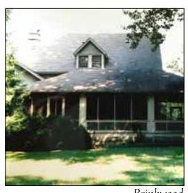
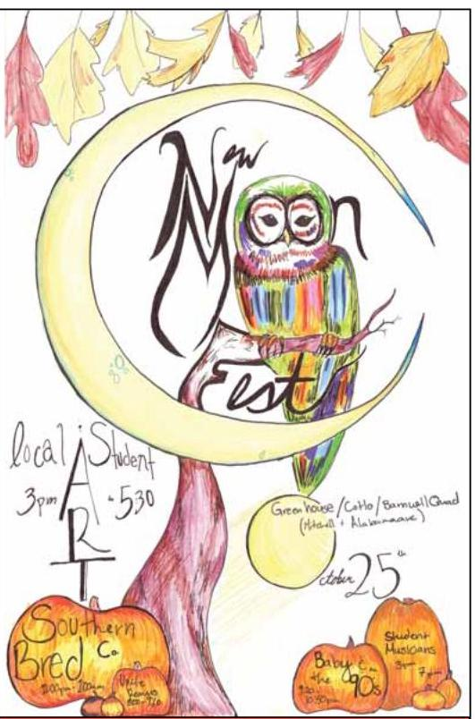
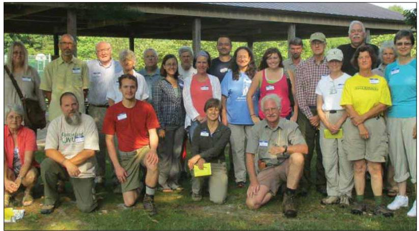
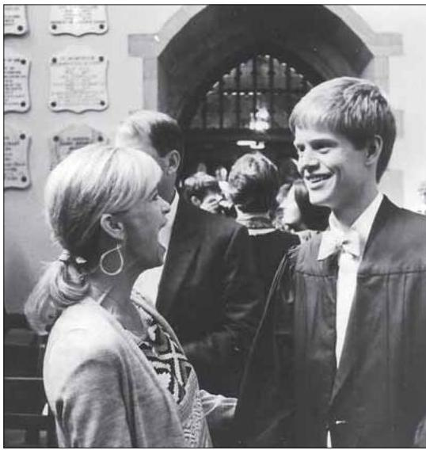
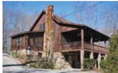
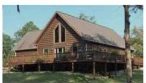
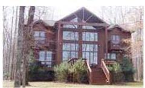
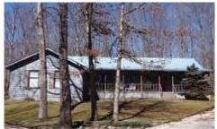

The Sewanee MESSENGER Mountain

Vol. XXX No. 38 Friday, October 24, 2014

# Sir Fazle Hasan Abed: ACall for Empathy

by Leslie Lytle, Messenger Staff Writer

For the poor to rise out of poverty, "there must be a consensus between the poor and the elite, a functional elite who understand the poor and their needs," insists Sir Fazle Hasan Abed, founder and chairperson of BRAC, a nonprofit formed in 1972 to aid refugees returning after the Bangladesh war for independence. On Oct. 17, Sir Abed delivered the Founder's Day address at the University.

Sir Fazle Hasan Abed

In 40 years, Abed's highly successful and unique approach to ending poverty made BRAC the world's largest developmental with more than sixmillionmem-bers, 100,000 employees and an annual budget over \$7 million.

$\mathrm{Y}$ as $\mathrm{m}$ e e n Mohiuddin, Sewanee's Ralph Owen Distinguished Professor of Economics, brought Sir Abed to the attention of the University. Serving as a consultant for the World Food Program, Mohiuddin evaluated BRAC in conjunction with a study that examined vulnerable and disaster-affected populations. Sharing a belief in the effectiveness of microfinance loans to aid the poor, Mohiuddin and Abed went on to collaborate on poverty relief efforts. In 2010, when Mohiuddin founded the Social Entrepreneurship Education program, Sewanee students began visiting Bangladesh to learn about BRAC firsthand.

Born into a prominent family in a region of British India (now part of Bangladesh), Abed became profoundly aware of the frailty of human life in 1970, when a devastating cyclone killed 300,000 Bangladeshis. Abed made survival the top priority when he formed the Bangladesh Rehabilitation Assistance Committee to aid in the refugee relief effort. BRAC addressed basic needs: plows and draft animals for farmers, nets and boats for fisherman, and shelter. BRAC (Continued on page 8)

## Byamugisha to Preach and Talk About Kampala

The Rev. Canon Gideon Byamugisha, an Anglican priest from Uganda and venues this week.

On Sunday, Oct. 26, he will be the preacher at the 8 a.m. and 11 a.m. services in All Saints' Chapel.

At 4:30 p.m., on Monday, Oct. 27, there will be a panel discussion of "Ugandan Stories: Faculty and Student Experiences in Kampala, 2014." This will be in Convocation Hall.

Sewanee students and faculty who worked in Uganda with the Friends of Canon Gideon Foundation during summer 2014 will discuss their experi-Panel Talks About the Percys at Brinkwood

Brinkwood

Sewanee School of Letters and Rivendell Writers' Colony will present a panel discussion, "The Percys at Brinkwood and Beyond," at 4:30 p.m., Wednesday, Oct. 29, in Gailor Auditorium. Howorth, owner of Square Books in Oxford, Miss. On the panel will be John Grammer, director of the Sewanee School of Letters; Wyatt Prunty, director of the Sewanee Writers' Conference; and Billy Percy, nephew of Walker Percy.

"We're truly fortunate to have such an accomplished panel of Percyschol-ars and experts. Rivendell is proud to sponsor events which highlight the history and literary accomplishments of the Percy family," said Carmen Thompson, director of Rivendell Writers' Colony.

Rivendell Writers' Colony adjoins the historical Brinkwood property once owned by William Alexander Percy, and later his novelist cousin, Walker Percy.

"Brinkwood, Sewanee and Lost lives of William Alexander Percy and his cousin, Walker, but large parts in both their imaginations," said Gram-mer. "Why was this? The panel should be a great chance to shed light on the question." For more information go to <www.rivendellwriterscolony.org> or <letters.sewanee.edu/readings>.

## Details for Upcoming Election on Nov. 4

## Council Candidates Named, Early Voting, Photo IDs

The Tuesday, Nov. 4, general election is 10 days away. Voters will need a celebrate on election night.

Early voting for the general election is at the Franklin County Election Commission, 839 Dinah Shore Blvd., Winchester. The office is open 8 a.m.-noon on Saturday, Oct. 25; and 8:30 a.m.-4:30 p.m., weekdays until Thursday, Oct. 30.

For the election of new members to the Sewanee Community Council, early voters should go to the Provost’s Office, 8 a.m.-noon, and 1:30-4:30 p.m., weekdays, Oct. 24-Oct. 30.

In Sewanee voters will be selecting seven new members of the Community Council. and Paul Evans are the candidates for two seats. Armour is seeking re-election to represent this district.

In District 1, David Coe is running unopposed for re-election. In District 2, Bill Barton and Theresa Shackelford are running for the two vacancies; Shack-elford is an incumbent in District 2. In District 4, Dennis Meeks and Andrew Sampson are both unopposed in their bid to return to the Council.

The Franklin County general election ballot includes: governor, U.S. Senate, U.S. House of Representatives 4th Congressional District, Tennessee House of Representatives 39th District, and four amendments to the Tennessee state constitution [see the Oct. 17 issue of the Messenger for details about the pro-franklincotn.us/departments/election commission/>.

A photo ID is required to vote early at the Franklin County Election Commission, and on Nov. 4 at polling places. Since 2011 all voters in Tennessee are required to show a current government-issued photo ID: acceptable IDs are a current driver's license or DMV-issued ID card, military ID, or U.S. passport; school-issued IDs, library cards, birth certificates or other forms of ID do not meet the requirement.

The voting rights committee of the Cumberland Center for Justice and Peace (CCJP) is offering assistance for registered voters who do not currently have a valid ID. Registered voters with fixed or low incomes may be able to get an ID for

After the polls close, CCJP is hosting its annual election night party and potluck, 7-9 p.m., Tuesday, Nov. 4, at the home of Susan Holmes and Greg Maynard, 230 Tennessee Ave. Please bring a dish or snack and drink to share throughout the evening as the group watches the election results on television. For more information contact Charles Whitmer at (931) 636-7527 or email <charles.whitmer@gmail.com>. ences. Canon Gideon will also answer opportunities with his organization during summer 2015.

"Side by Side by Sondheim" performers (including, from left) Elise Anderson, Kalynn Harrington and Sarah High delight audiences in the new show. The musical revue continues at the Tennessee Williams Center with performances at 7:30 p.m., today (Friday) and Saturday, Oct. 24-25. Admission is free; reservations are encouraged by email, <mcook@sewanee.edu>. Photo by Lyn Hutchinson

In 1992, Byamugisha became the first religious leader in Africa to state publicly that he had tested positive for HIV. In 2000 he helped found the Africa Network of Religious Leaders Living with or Personally Affected by HIV/AIDS and is currently the executive director of the Friends of Canon a nonprofit organization dedicated to reducing the spread of HIV and AIDS and reducing stigma and shame related to this disease.

In 2009, Byamugisha received the 26th annual Niwano Peace Prize "in recognition of his work to uphold the dignity and human rights of people living with HIV/AIDS." In 2012, he received the Cross of St. Augustine for his distinguished service in the Anglican Communion. This month, he was one of the keynote speakers at the Thistle Farms National Conference in Nashville.

For more information about Canon Gideon and his work go to <www. focagifo.org $/ >$ . Civic Association Learns Housing Sewanee History

Group Debates Classifieds Use Policies

by Leslie Lytle, Messenger Staff Writer

At the Oct. 15 Sewanee Civic Association dinner meeting, the membership reviewed responses to a survey taken by the group about the use policy of the Classifieds email list. After hearing diverse opinions about the number of weekly posts by for-profit businesses, the membership voted to leave the policy unchanged. Following the business portion of the meeting, Dixon Myers talked to the group about Housing Sewanee, a local nonprofit formed to build affordable homes for low-income residents in the community.

The Civic Association administers the Sewanee Classifieds email list. Forty percent of Classifieds users responded to the use-policy survey. At issue were for-profit businesses. An overwhelming majority, 92 percent, agreed with the no-political-messaging rule. Results were mixed on the use by for-profit businesses rule, but the largest number of those responding preferred only one post per week by for-profit businesses, fewer than the three posts the policy allows. After much discussion, no changes were made: the no-political-messaging rule and three-posts-per-week by businesses rule remain in effect. For detailed survey results see the Civic Association website, <www.sewaneecivic. wordpress.com>.

Dixon Myers, coordinator of outreach ministries at the University, described how Housing Sewanee works to address the problem of substandard (Continued on page 4)

---

P.O. Box 296

Sewanee, TN 37375

---

The St. Andrew's-Sewanee School Players (above) will present "Godzilla," (today) Friday-Sunday, Oct. 24-26, in McCrory Hall for the Performing Arts. Friday and Saturday performances are at 7 p.m.; Sunday’s performance is at $4\mathrm{p}.\mathrm{m}$ . The show will contribute to the mythology of Godzilla with the creation of a live theater reinterpretation of "Gojira" and "Godzilla, King of the Monsters." The production features bold movement-theater and a 35-member ensemble aesthetic that includes every cast member playing roles and serving as stagehands. The play recreates the joy of a good horror film, while reflecting a bit of Japanese culture and the American culture of the 1950s. Admission is \$10 for adults and \$7 for children under 10. SAS students attend free.

---

THE SEWANEE MOUNTAIN MESSENGER 418 St. Mary's Ln. P.O. Box 296 Sewanee, Tennessee 37375 Phone (931) 598-9949 Fax (931) 598-9685 Email news@sewaneemessenger.com Phoebe Bates www.sewaneemessenger.com Jean Yeatman John Shackelford

Laura L. Willis, editor/publisher John Bordley

Janet B. Graham, advertising director/publisher Virginia Craighill April H. Minkler, office manager Patrick Dean Ray Minkler, circulation manager Buck Gorrell Kevin Cummings, staff writer/sports editor Sandra Gabrielle, proofreader Francis Walter

Geraldine H. Piccard, editor/publisher emerita Pat Wiser

Published as a public service to the Sewanee community. 3,700 copies are printed on Fridays, 47 times a year, and distributed to 26 Sewanee-area locations for pickup free of charge.

from the University of the South (print production) and the Sewanee Community Chest. SUBSCRIPTIONS \$75 first class.

All material in the Sewanee Mountain Messenger and on its website are copyrighted and may not be published or redistributed without written permission.

---

Community

## MORE COMMUNITY CENTER HISTORY

## To the Editor:

Thanks for the article on the Community Center [in the Oct. 17, 2014, issue of the Messenger]. I would like to add that Ronn Carpenter became president of the Community Center (CC) board just after he retired. The CC was then in arrears, and the board members lent personal money to pay the bills. Ronn also paid for a concert by Jim and Inge Wood, with admission monies deposited in the CC account.

It was after that concert, to which Sewanee ladies had to walk in sharp Forster, and a sidewalk appeared. Ruth and John Wendling refurbished the restroom. Ronn helped Lisa get nonprofit status. He also worked with John and Charlie Zammit and others, installing new windows, which were bought one at a time. Elizabeth Koella donated the message board and decorated the CC for holidays and other time we hired Rachel Petropoulos who has been a wonderful manager.

We also had a concert with The Good Ol' Boys and Bob Townsend. Bob sold his $\mathrm{{CD}}$ of mountain tunes and gave us a cut. He and Robin Gottfried led weekly music jams that attracted folks from all over. The CC hosted a town meeting with Rep. Lincoln Davis, standing room only. Mary Priestley and myself painted the foyer and doors, with donated paint. We also painted the sign on the Senior side with paint provided by the Senior Center. Ronn installed it.

Jill Carpenter, Sewanee Letters

## WHAT HAPPENED TO THE SIXTHAMENDMENT? To the Editor:

In August of 2013 Tom Wagner of Cowan was arrested and charged with a felony having to do with child pornography. A very serious charge Hishouse was raided, and he was taken to the Franklin County Jail and later to the Silverdale Detention Facility in Chattanooga. At the time of the arrest, the media reported it as if a trial had been conducted, and he was guilty.

It has been more than a year now, and a man in his 70 s has spent that time living in the same punitive con-of metal doors never stops. Where daily existence has to be negotiated among sometimes fickle guards and imprisoned members of street gangs. There has been no trial. But there has been plenty of punishment. Strange circumstances indeed, for a citizen who is, supposedly, in the eyes of the law, innocent until proven guilty. Mr. his \$150,000 bond. The jails are full of a lot of poor people awaiting trial.

I have been making pastoral calls to Tom during this time. What happened to the right to a speedy trial guaranteed in the Sixth Amendment of the Constitution? There is no room in our society for child pornography. No argument there. And nobody wants a trial more than Mr. Wagner does. But charge. Andy Gay Cowan Shop and dine locally!

## FATE OF REBEL'S REST To the Editor:

I know many of us are concerned about the fate of our beloved Rebel's Rest, and we want to make sure all options are thoroughly explored before any hasty and irreversible decisions are made.

One thing that can be done, and that has not yet been done, is a consultation with the Tennessee State Historic Preservation Office. This is a public office that provides consultations for free, with no obligations. They make evaluations and tell you what you can do, and how to do it, but they a man named Dan Brown who is more than willing to come look at Rebel's Rest. His background is with the Vieux Carre Commission in New Orleans, and he has extensive experience in assisting building owners in understanding the resilience of historic structures. Louis Jackson is another contact there. Here's how you can help: or regent, tell the vice-chancellor you would like an opinion from the Tennessee State Historic Preservation Office before any final decisions are made affecting Rebel's Rest.

2) If you know any trustees or regents, tell them you would like to hear from the Tennessee State Historic Preservation Office before any final decisions are made affecting Rebel's Rest. vice-chancellor and tell him you would like to hear from the Tennessee State Historic Preservation Office before any final decisions are made. Lisa Rung, Sewanee House Announces

## Semester Plans

The Community Engagement House on the Sewanee campus has adopted the theme "Belonging to Each Other" for this semester.

The mission of the Community Engagement House, also known as CoHo, is to promote a seamless community among college and seminary students, faculty, and staff, as well as residents open to all, facilitating networking and providing a physical meeting place for organizations devoted to serving the community at large. It is located at the corner of Alabama and Mitchell avenues.

Upcoming events include:

Saturday, Oct. 25-New Moon Festival and Block Party [see page 11].

Monday, Nov. 3-Noteworthy night; 7 p.m.

Tuesday, Nov. 11—Coffee and conversation with Sherry Guyear; 6 p.m.

Saturday, Nov. 15-UGAv. Auburn football game-watching party; at kickoff. Tuesday, Dec. 2-Coffee and conversation with Gerald Smith; 6 p.m.

Thursday, Dec. 11—Reading Day, doughnuts in Spencer Quad; noon.

MESSENGER HOURS

Monday, Tuesday & Wednesday 9a.m. $- 5\mathrm{p.m}$ . Thursday—Production Day 9 a.m. until pages are completed Friday—Circulation Day Closed

Wine Dinner 6 p.m., Saturday, Nov. 15 5 wines, 4 courses Reserve your table now!

Mark your calendars! Upcoming Wine Dinner December 13 Tallulah's Wine Lounge (931) 924-3869 ~ www.monteagleinn.com ~ 204 West Main St.

r--------------- TOMMY C. CAMPBELL FOR YOUR IMPROVEMENTS Call (931) 592-2687 Free Estimates - 20 Years Experience DRIVEWAY WORK - GRAVEL HAULING - DOZER & BACKHOE plus Land Clearing $\cdot$ Concrete Work $\cdot$ Water Lines $\cdot$ Garage Slabs - Sidewalks - Porches & Decks - Topsoil & Fill Dirt Roofing $\cdot$ Additions to House $\cdot$ Septic Tanks &Field Lines ._____

JUJGARAGE COMPLETE AUTO REPAIR - Import & Domestic - Computerized 4-Wheel Alignments - Shocks & Struts ● Tune-ups ● Brakes - Our Work is Guaranteed. Jerry Nunley - OVER 26 YEARS EXPERIENCE. Owner 598-5470 Hwy 41-A between Sewanee & Monteagle ● Monday-Friday 7:30-5:30

Serving Where Called

Please keep the following individuals, their families and all those who are serving our country in your thoughts and prayers:

Cole Adams

Michael Evan Brown

Mary Cameron Buck Lisa Coker Jennifer Lynn Cottrell James Gregory Cowan Nathaniel P. Gallagher Nathaniel Andrew Garner Peter Green Tanner Hankins Robert S. Lauderdale Dakota Layne Byron A. Massengill Alan Moody Brian Norcross Christopher Norcross Michael Parmley Lindsey Parsons Peter Petropoulos Troy (Nick) Sepulveda Melissa Smartt J. Wesley Smith Tyler Walker Jeffery Alan Wessel Nick Worley

If you know of others in our Mountain family who are serving our country, please give their names to American Legion and Auxiliary member Louise Irwin, 598-5864. SALONS? CATERING? CAREP EXCERCISE MOVERSP DAYCAREP Find them all at www. TheMountainNow.com. Click on Services.

Upcoming Meetings

## Coffee With the Coach on Monday

Coffee with the Coach will meet at 9 a.m., Monday, Oct. 27, at the Blue Chair Tavern for free coffee and conversation with Sewanee basketball coach Bubba Smith. For more information call 598-0159.

## Monday Sewanee Garden Club Meeting

The Sewanee Garden Club will meet at 1:30 p.m., Monday, Oct. and his apple orchard on Breakfield Road. Refreshments will feature items made with apples; there will also be tasting samples from local orchards. For more information contact Flournoy Rogers at 598-0733 or email <fsrogers@wildblue.net>.

## Tims Ford Council Gather on Monday

The Tims Ford Council will meet at 6 p.m., Monday, Oct. 27, in the Franklin County Annex Building in Winchester. Judy Taylor and Dave Van Buskirk will present a program about the Franklin County Chamber of Commerce. Dennis English will have an update on the marina project.

## SUD Board Meets on Tuesday

The Sewanee Utility District board of commissioners will meet at 5 p.m., Tuesday, Oct. 28, at the SUD office. The agenda is: approval of the October 2014 agenda; approval of the September 2014 minutes (as distributed); general manager's report and financial report; unfinished business-update on the constructed wetlands study; new business-upcoming election, budget process, back flow prevention discussion announcements. The next meeting is scheduled for Tuesday, Nov. 25.

## Area Rotary Club Meetings

The Grundy County Rotary Club meets at 11:30 a.m., Tuesdays, at Dutch Maid Bakery in Tracy City. On Oct. 28 the speaker will be David Ramsey, executive director of DuBose Conference Center.

The Monteagle Sewanee Club meets 8-9 a.m., Thursdays at the Sewanee Inn.

## Holiday Cards for Heroes Workshop on Wednesday

Local members of the Nashville Chapter of Middle Tennessee Decorative Artists invite community members to a Holiday CardMaking Workshop, 9:30 a.m.-12:30 p.m., Wednesday, Oct. 29, at the DREMC community room, 1738 Decherd Blvd., Decherd. The American Red Cross Holiday Mail for Heroes program lets people send a card of thanks and support to members of the Armed Forces. For more information call Pat Hitchcox at (931) 691-5514 or email <paintingpat@live.com>.

## EQB Gathers at St. Mary's Sewanee

The EQB Club will meet at noon, Wednesday, Oct. 29, at St. Mary's Sewanee for lunch and conversation.

## Reservations Due on Oct. 31 for Next ECWMeeting

The Episcopal Church Women will meet at noon, Monday, Nov. 3, in St. Mark's Hall of the new Otey Claiborne Parish House for of Biblical Women."

The deadline for reservations for the catered lunch (\$10) is 6 p.m., Friday, Oct. 31; call Peggy Lines at 598-5863 or email <plines@se wanee.edu>. Vegetarian meals are available if requested.

Though it is certainly not required, women could wear something purple to the meeting in appreciation of Lydia, the wealthy Gentile businesswoman and seller of valued purple fabrics and dyes, who was converted by Paul in 50 A.D. Marcia Mary Cook will do a dramatic presentation of this remarkable woman. Cook is an assistant professor of theatre arts at the University of the South, as well as a spiritual

All interested women of the area are invited to join in the spiritual enrichment and fellowship of ECW.

## Woman's Club Lunch Reservations Due on Oct. 31

Reservations for the next meeting of the Sewanee Woman's Club are due by Oct. 31. The meeting will be at noon, Monday, Nov. 10, at the DuBose Conference Center. John Shackelford will talk on a Thanksgiving theme about his experiences as a tennis coach, a father of four daughters and a longtime resident of Sewanee.

The menu for lunch (\$13.25) is green salad, Angela's award-winning chili and trimmings, and gingerbread with lemon sauce. To make a reservation call Pixie Dozier at 598-5869 or email Marianna Handler at <mariannah@earthlink.net>.

There is an optional social hour at 11:30 a.m, lunch is served at noon, around 1 p.m. Vegetarian meals and child care are available; please request these when making a reservation.

## Academy for Lifelong Learning Gathers on Nov. 13

The Academy for Lifelong Learning welcomes Jeffrey Thompson on Thursday, Nov. 13, for his talk about "Modern Art: Origins and Ideas." Thompson is an assistant professor of art history and chair of film studies at Sewanee. The talk begins at noon at St. Mary's Sewanee. Lunch choices are Caesar salad or ham and swiss sandwich, but must be reserved in advance by calling 598-5342. For more information contact Debbie Kandul at (931) 924-3542.

Sewanee Elementary School celebrated Winchester Podiatry World Milk Day during lunchtime recently. Cafeteria manager Chasity Williams treated the students to sticker "milk mus-

King, Brooklyn Grandmason and Ellie PA CHARLES D. GANIME, DPM Board Certified in Foot Surgery Most Insurance Accepted, Including TennCare We are at 155 Hospital Road, Suite I, in Winchester. www.winchesterpodiatry.com 931-968-9191 Roberts.

## “Go Pink” at Hair Depot

Hair Depot is "going pink" for the Russell L. Leonard month of October in support of breast cancer awareness.

Participants can have their hair

streaked pink or their nails painted Attorney at Law pink for a minimum \$5 donation. All proceeds from this event will be dis-

ributed locally this year. Office: (931) 962-0447

Danielle Hensley challenges local Fax: (931) 962-1816

businesses to contribute 10 percent 315 North High Street Toll-Free (877) 962-0435 of the total amount the Hair Depot Winchester, TN 37398 rleonard@netcomsouth.com raises in this effort.

Stop by the Hair Depot, 17 Lake O'Donnell Rd., or call Danielle at 598- 0033 for more information.

## University Job Opportunities

Exempt Positions: Area Coordinator; Assistant Director of University Archives and Special Collections; Associate University Registrar for Technology and Operations; Business Analyst, Advancement Services; IT Administrator, School of Theology; Manager of Sewanee Catering; Programmer/Analyst 1; Treasurer/Chief Financial Officer.

Non-Exempt Positions: Cook, vice Worker, Sewanee Dining; Catering Service Supervisor, Sewanee Dining; Police Officer (part-time).

To apply online or learn more go to <http://hr.sewanee.edu/job_post ings> or call 598-1381. One-Stop Transportation Information: dial 511 SEWANEE'S NEW MOON FESTIVAL A Community Art and Organization Fair! Celebrate the Liberal Arts and the beginning of fall! Free Admission! Saturday October 25th - Intersection of Alabama and Mitchell Ave, Sewanee, TN Art and Community Fair 3-5:30pm; Cookout 5-7pm Local Bands 3-8pm

Tea on the Mountain For a leisurely luncheon

or an elegant afternoon tea 11:30 to 4 Thursday through Saturday

DINNERS BY RESERVATION

(931) 592-4832

298 Colyar Street, US 41, Tracy City

Concert Series featuring Uncle Remus, Baby in the 90's and Southern Bred Co: 8pm-1am

Obituaries

## Judith "Judy" Basse

Judith "Judy" Lynne Nickles Basse, age 81, of Hermitage, Tenn., died on Oct. 19, 2014. A native of Ponca City, Okla., she was preceded in death by her husband, Robert W. "Bob" Basse. She was past manager of the Tennessee State Fair, past president of the Nashville Area Chamber of Com-Downtown Kiwanis Club and served as the executive secretary of the Tennessee Association of Fairs.

She is survived by her daughters, Janet (Tim) Graham of Sewanee and Karen (Buck) Buckner of Hermitage; and five grandchildren, including Laura Beth Graham and David Graham, formerly of Sewanee.

A funeral service will be at 2:30 Price United Methodist Church in Nashville with the Rev. Melisa Der-seweh and Rev. Joel Emerson officiating. Visitation will be 4-6 p.m., Friday, Oct. 24, at Hermitage Funeral Home and one hour prior to the service at the church. Interment will follow in Hermitage Memorial Gardens.

Expressions of sympathy are suggested to the Tennessee 4-H Foun-ture Club, Andrew Price Methodist Church or McKendree Golden Cross Fund. Condolences may be offered at <www.hermitagefh.com>.

## Debra Renee Smith

Debra Renee Smith, age 60 of Decherd, died on Oct. 16, 2014, at her residence. She was born in Cleveland, Ohio, to Ray and Phalda (Throneberry) Smith.

She is survived by her sons, Trey (April) Hodosi of Estill Springs and Ray Hodosi of Cowan; sister, Dena grandchildren and many others.

Services were on Oct. 18 in the funeral home chapel. For complete obituary go to <www.moorecortner. com>.

## All Saints' Chapel

The Rev. Canon Gideon Byamugisha will be the preacher at both the 8 a.m. and 11 a.m. services on Sunday, Oct. 26, in All Saints' Chapel. He is an Anglican priest from Uganda and a former Brown Foundation Fellow at the University. [See story on page 1 for more information.]

Growing in Grace, All Saints' Chapel's contemporary worship service, will meet at $6 : {30}\mathrm{p}.\mathrm{m}$ ., Sunday, Oct. 26, in Grace features a student-led worship team.

The Catechumenate will meet at 7 p.m., Wednesday, Oct. 29, in the Women's Center. Coffee and dessert will be served. Based around fellowship, study, openness and conversation, the Catechumenate serves as a foundational piece for the Christian faith, as well as a forum for discussion for people of all backgrounds. All are welcome.

For more information about Growing in Grace or the Catechumenate, contact University lay chaplain Rob McAlister by email, <rob.mcalister@sewanee.edu>.

## Bible Baptist Church

Bible Baptist Church in Monteagle will have Homecoming and Motorcycle Sunday at 10 a.m., Sunday, Oct. 26. Buddy Meeks will be the special guest singer, and the chaplain of the Christian Motorcycle Association will be the guest speaker. Lunch will be served after the worship service, and there will be no evening service that day. The church is located at 360 Wells St., Monteagle. For more information contact Pastor James Taylor at (423) 322-4922 or Greg Finch, music director, at (423) 451-0133.

## Christ Church, Monteagle

On Sunday, Oct. 26, members of Christ Church will present the new play "Moses and the Burning Bush." All are welcome; lunch will be served after the 10:30 a.m. service.

## Otey Memorial Parish

Otey Parish's Faith and Film series continues at 6:30 p.m., today (Friday) in Brooks Hall. Shelley Cammack is the host. She will show "The Railway Man," a 2013 film star-War II British officer who sets out to confront the man who tormented him in a Japanese labor camp. This film is rated R for disturbing prisoner of war violence. Light refreshments and conversation will follow the film.

On Sunday, Oct. 25, Otey will have an inter-generational event at 10 a.m., between services. As they prepare for All Saint's Sunday on Nov. 2, adults and youth can color crosses in honor of or in memory of the saints in their lives. There will also be grocery packing at CAC. The "Speaking Christian" book study, the Lectionary Class and Godly Play to 4 years old from 8:30 a.m. until after coffee hour.

Otey will celebrate the Feast of St. Simon and St. Jude, at noon, Tuesday, Oct. 28, with Holy Eucharist Rite I.

If your church is in our circulation area and would like to be listed below, please send service times, address and contact information to <news@ sewaneemessenger.com> or call 598-9949.

## Civic Association (from page 1)

appalled by the prevalence of dilapidated homes in certain areas. "Parts of the community were embarrassing," Myers said.

They explored an affiliation with Habitat for Humanity, but there were issues of concern: Habitat had no experience working with leased land (such as on the Domain), and Habitat was interested in a three-county effort. Myers wanted to address the housing problem in the Sewanee community.

Since 1993, Housing Sewanee has built 15 homes, ten on the Domain and five off the Domain. The clients include senior citizens, single mothers and trailers. One project was a rebuild of a home that burned.

Myers said that the two top predictors of a young person going to college are whether the parents are college-educated and if the family owns its own home. He was happy to report that the son of a single mother aided by Housing Sewanee 10 years ago became the family's first college graduate.

Volunteers, often University students, do most of the labor on Housing Sewanee homes. Housing Sewanee is financed by Community Chest gifts (a Civic Association project), mortgage repayments, selling concessions at football games, summer groups who want to become part of the Housing Sewanee experience and pay to help build a home, and donations by individu-Sewanee, TN 37375.

It costs Housing Sewanee about \$50,000 to build a home, with the structure valued at approximately \$90,000 on completion. Clients pay for their homes with a 30-year, no-interest mortgage. For homes on the Domain, the lease fee and ground rent are waived for the first 10 years.

"When we select a family, it's a gamble," Myers conceded, acknowledging sometimes clients get in a financial bind and can't make their payments on time. But for Myers, taking risks is part of what Housing Sewanee is about. He once told the Housing Sewanee board, "If we're not building houses for risky situations, we're not doing our job."

In other business, the Civic Association voted to approve Cameron Swallow as secretary and Aaron Welch as member-at-large. The Civic Association's next meeting is Nov. 19.

ST.MARY'S SEWANEE Call (931) 598-5342 or (800) 728-1659 www.StMarysSewanee.org <reservations@

## UPCOMING RETREATS  Three-day Advent Centering  Prayer Retreat

Friday, December 12-Sunday, December 14 The Rev. Tom Ward, presenter

St. Mary’s Hall, \$350 (single); New building, \$450 (single); Commuter, \$250

## The Sacramental Vision of Emily Dickinson

February 13-15 Victor Judge, presenter (single); Commuter, \$250

Email your church news! Send it to <news@sewanee messenger.com>.

## Weekdays, Oct. 24-31

7:00 am Morning Prayer, St. Mary's Convent (Oct. 24, 28-31)

7:30 am Morning Prayer, Otey

8:00 am Holy Eucharist, St. Mary's Convent (Oct. 24, 28-31)

8:10 am Morning Prayer, Chapel of the Apostles

8:30 am Morning Prayer, St. Augustine's

11:00 am Holy Eucharist, Chapel of the Apostles (Oct. 29)

12:00 pm Holy Eucharist Rite I, St. Simon/St.Jude, Otey (Oct.28)

12:30 pm Noon Prayer, St. Mary's Convent (Oct. 24, 28-31)

4:00 pm Evening Prayer, St. Augustine's

$4 : {30}\mathrm{{pm}}$ Evening Prayer, Otey

5:00 pm Evening Prayer, St. Mary's Convent (Oct. 24, 28-31)

## Saturday, Oct. 25

7:30 am Morning Prayer, St. Mary's Convent

8:00 am Holy Eucharist, St. Mary's Convent

10:00 am Monteagle 7th Day Adventist Sabbath School

11:00 am Monteagle 7th Day Adventist Worship Service

5:00 pm Mass, Good Shepherd Catholic, Decherd

Sunday, Oct. 26

All Saints' Chapel

11:00 am Holy Eucharist

6:30 pm Growing in Grace

Bible Baptist Church, Monteagle

10:00 am Morning Service-Homecoming and Motorcycle Sunday followed by lunch

Christ Church, Monteagle

10:30 am Holy Eucharist

10:45 am Children's Sunday School

12:50 pm Christian Formation Class

Christ Church Episcopal, Alto

11:00 am Holy Eucharist

11:00 am Children's Sunday School

Christ Church Episcopal, Tracy City

11:00 am Holy Eucharist

11:00 am Children's Sunday School

Church of the Holy Comforter, Monteagle

9:00 am Holy Eucharist

Cowan Fellowship Church

10:00 am Sunday School

11:00 am Worship Service

Cumberland Presbyterian Church, Sewanee

10:00 am Sunday School

Decherd United Methodist Church

9:45 am Sunday School

10:50 am Worship

Epiphany Episcopal Church, Sherwood

10:30 am Children's Sunday School

10:45 am Holy Eucharist

First United Methodist Church, Tracy City

8:30 am Worship Service

9:45 am Sunday School

11:00 am Worship Service

$6 : {00}\mathrm{{pm}}$ Bible study, prayer meeting

First United Methodist Church, Winchester

8:30 am Worship Service

9:00 am Contemporary Worship Service

9:45 am Sunday School

11:00 am Worship Service

## CHURCH CALENDAR

$6 : {00}\mathrm{{pm}}$ Youth Activities

Good Shepherd Catholic Church, Decherd

10:30 am Mass

Grace Fellowship

10:30 am Sunday School/Worship Service

10:00 am Sunday School

11:00 am Worship Service

$5 : {00}\mathrm{{pm}}$ Evening Worship Service

Midway Baptist Church

10:00 am Sunday School

11:00 am Morning Service

$6 : {00}\mathrm{{pm}}$ Evening Service

Midway Church of Christ

11:00 am Morning Service

$6 : {00}\mathrm{{pm}}$ Evening Service

Morton Memorial United Methodist, Monteagle

9:45 am Sunday School

11:00 am Worship Service

New Beginnings Church, Jump Off

10:30 am Worship Service

Otey Memorial Parish

10:00 am Godly Play/Adult Formation Classes

11:00 am Morning Prayer with Holy Eucharist

Pelham United Methodist Church

9:45 am Sunday School

11:00 am Worship Service

St. Agnes' Episcopal, Cowan

11:00 am Holy Eucharist Rite I

St. James Episcopal

8:00 am Mass

St. Mary's Convent

8:00 am Holy Eucharist

5:00 pm Evensong

Sewanee Church of God

10:00 am Sunday School

11:00 am Morning Service

6:00 pm Evening Service

9:30 am Meeting, 598-5031

Tracy City First Baptist Church

9:45 am Sunday School

10:45 am Morning Worship

5:30 pm Youth

$6 : {00}\mathrm{{pm}}$ Evening Worship

Trinity Episcopal, Winchester

9:00 am Holy Eucharist

10:00 am Children's Sunday School

Wednesday, Oct. 29

6:00 am Morning Prayer, Cowan Fellowship

12:00 pm Holy Eucharist, Christ Church, Monteagle

5:30 pm Evening Worship, Bible Baptist, Monteagle

5:30 pm Youth Fellowship, 1st United Methodist, Tracy

6:00 pm Evening Worship, Midway Baptist Church

6:00 pm Youth (AWANA), Tracy City First Baptist

6:30 pm Evening Prayer, Trinity Episcopal, Winchester

7:00 pm Evening Worship, Harrison Chapel, Midway

7:00 pm Adult Christian Ed, Epiphany, Sherwood

7:00 pm Evening Worship, Tracy City First Baptist Upcoming Lectures

## Franklin County Historical Society

The lecture series, "Characters of the County" will continue at 4 p.m., Sunday, Oct. 26 with a talk by John Lynch on "A. S. Colyer: Founder of Franklin County Industry." Arts. Lynch is a member of Franklin County Historical Society.

Amy-Jill Levine

The School of Theology's "Theology Uncorked" will feature Amy-Jill Levine at 3:30 p.m., Friday, Oct. 31, in Hargrove Auditorium topic is "Understanding Jesus for Christian Preaching."

Amy-Jill Levine

Levine is a well-known Jewish New Testament scholar, celebrated for her ability to relate to today's audiences. She is professor of Jewish studies at Vanderbilt University Divinity School and College of Arts and Sciences.

Lauren Templeton

Lauren Templeton C'98, founder and president of a Chattanooga-based hedge fund, will be the Advent semester Bryan Viewpoints Speaker Series lecturer. Her talk on "Behavioral Finance: The Psychology of Investing," will be at 4:30 p.m., Thursday, Nov. 6, in Gailor Auditorium.

Lauren Templeton

Her firm, Lauren Templeton Investments, practices the tenets of value investing, the methodology used by her great-uncle, John sponsored by the Babson Center for Global Commerce; it is free and open to the public.

LOG CABIN: Bring the whole family! 2856 sq. ft. on the first and second floor and a 1960 sq. ft. finished basement with an outside entrance. Beautiful garden spot. Located across from the Assembly on 6th close to town. \$230,000. Reduced! \$379,000.

WATERFALL PROPERTY. 30 acres on the bluff with an amazing waterfall. True storybook setting.

SNAKE POND RD. 30 beautifully wooded acres on tric, Internet. All usable land. Highway 156, Jump Off. \$200,000.

SHADOW ROCK DR. 1.18-acre charming building lot. The front is a meadow. The back has beautiful on it. \$89,000. trees. \$23,000. http://ursewanee.com/ UNIVERSITY REALTY SEWANEE TENNESSEE

The Friends of South Cumberland State Park (FSC) and the Savage Gulf Preservation League are hosting the fourth annual "Take a Walk on the Wild Side" on Sunday, Nov. 2, at Stone Door and the Beersheba Springs Hotel.

"We are excited to be hosting our fall event in Beersheba Springs and Ty Burnette, FSC president. "All interested in learning about the Friends' initiatives in land preservation and environmental education and ways to get involved to support the state park and its rangers are encouraged to join us."

The event starts at $1\mathrm{p.m.}$ , with a short hike to Stone Door in Savage Gulf, one of the 10 areas that make up the South Cumberland State Park. Ranger Aaron will lead the hour-long hike to the fabled rock formation and overlook, a walk of about 20 minutes each way. The hike begins at the Stone Door parking lot, 1183 Stone Door Rd., Beersheba Springs.

"Whether you hike it or not," all are invited, $3 - 4 : {30}$ p.m., to the historic Beersheba Springs Hotel for refreshments, a chance to celebrate the new Gulf Preservation League (which is now a chapter of the FSC), and learn about plans for the park and volunteer opportunities. The hotel is located at 58 Hege Ave., Beersheba Springs. No RSVP is required.

For more information, contact Margaret Matens at (931) 924-2623 or email to <margaretmatens@gmail.com>.

---

You Could Be Reading Your Ad Here! GREAT readership...

reasonable rates!

Phone 598-9949

---

514 LAUTZENHEISER PLACE. Single-story brick home, spacious 2 bedrooms 2 baths, fireplace, beautiful yard, w/qazebo, 2-car qarage, across the street

CLIFFTOPS RESORT. Amazing creek running through this 5-acre lot adjoining Kirby Smith Point and the University property. Private and secluded on a private road. Ready to build. \$79,000.

94 MAXON LANE. Wonderful bright home on master suite, formal dining, great kitchen, upstairs loft, downstairs apartment or office w/fireplace, large back deck, fenced-in yard and so much more!

93 ACRES ON THE BLUFF. Many creeks,

SEWANEE SUMMIT. 60 acres, build on it or hunt

91 University Ave. Sewanee (931) 598-9244 Ed Hawkins (866) 334-2954 Lynn Stubblefield (423) 838-8201

## FSC Hosts “Walk on the Wild Side”

The steps at Stone Door, a dramatic rock formation on the edge of Savage Gulf near Beersheba Springs. Photo by Rick Dreves

The Sewanee Symphony Orchestra and The Sewanee Jazz Ensemble Friday, October 31, 7:30pm

Guerry Auditorium University of the South

Free and Open to Public Wear your costumes!

Monteagle. \$328,900 Sewanee. \$179,000 Hollow Rd., Sewanee. \$440,000 Home of Dr. Ed Kirven MLS 1553768 - 324 Rattlesnake Springs Monteagle. \$239,000

MLS 1358150 - 100 Tomlinson Lane, Clifftops. \$172,000 MLS 1487540 - 109 Wiggins Creek, Sewanee. \$598,000 Sewanee. \$449,000 MLS 1522506 - 2461 Clifftops Ave., Monteagle. \$394,900 MLS 1542948 - 7829 Sewanee Hwy., Cowan. \$119,000 BLUFF - MLS 1562244 - 1899 Jackson Pt. Rd., Sewanee. \$365,000 53 Valley View Rd., Monteagle. \$449,000 Monteagle. \$149,900 MLS 1516929 - 706 Old Sewanee Rd. MLS 1547630 - 645 Nickajack Trail, Sewanee. \$349,000 BLUFF - MLS 1494787 - 253 Vanderbilt Lane, Sewanee. \$1,298,000

##

LOOKSAIBOOKS

by Pat Wiser for Friends of du Pont Library

"The Mockingbird Next Door" by Marja Mills (Penguin, 2014) is the interesting and well-told story of Mills' time with Harper Lee, author small circle of friends between 2001 and 2006. Although Harper Lee said she did not willingly participate in nor authorize the book, Mills' reply that she did research and wrote with the "full knowledge and agreement" of both sisters, was verified by the cogent Alice, who practiced law until she was 101. Reading the book left me convinced that Harper and Alice Lee did invite Mills into their lives and were aware that a book would someday be the result.

"The Mockingbird Next Door" is not a biography of Harper Lee. Mills produced a memoir of direct experience with her subjects and of her own struggles with lupus during that time. Her narrative is or-personality, with stories of family and career gleaned from conversations with Harper, Alice and their friends. Reviewers who call it "slight" are looking for more, I believe. I treasure Harper Lee's masterpiece and my signed copy from her visit to Sewanee during the 40 th anniversary of "To Kill a Mockingbird" in 2000. I was delighted with this up-close visit.

"To Kill a Mockingbird" was chosen for "One Book, One Chicago" in 2001. Mills first met the Lee sisters when she went to Monroeville, Ala., on assignment for the Chicago Tribune. After two days interviewing residents, she hesitantly approached their door. Alice invited her in and showed her around the modest house, calling it "a warehouse for books," Nelle, the name Harper preferred.

The next morning brought a surprising phone call from Nelle Harper Lee: "You made quite an impression on Miss Alice. I wonder if we might meet." She made it clear that the ensuing conversation was not an interview. They talked about the town, about the movie version of her novel, about Gregory Peck, who played Atticus, modeled after Lee's father. Mills later got permission to use the stories showing Nelle's deep affection for Peck, whom she got to know during the filming.

After several more visits, with the Lee sisters' encouragement and help, Mills rented the house next door to them for 18 months. The well-suited to her troublesome lupus flare-ups. "Beyond a shared passion for stories... I had a lot in common with this gray-haired crew... Their joints hurt too. They didn't have the energy they once had. ...These were my people."

The texture of their days emerged: Mornings began with Nelle asking, "You pourin' [coffee]?"Nelle and Marja went to exercise class and the laundromat together. Mills' poor Southern vocabulary ("What's a meat and three?") amused the sisters. A highlight of many days was feeding the ducks at the nearby lake, the sisters summoning the birds who spent summers at his aunt's Monroeville home. The boy with the fertile mind was the perfect model for "Mockingbird's" Dill, the fictional playmate whom the character Scout called a "pocket Merlin." Capote refused to deny that he co-wrote "To Kill a Mockingbird," though most people think he didn't write it.

It is true that Mills got to know Nelle — as much as she let anyone but her inner circle know her - and it is true that Mills sometimes seems to hold back, partly because of her subject's strong sense of privacy. Nelle occasionally said, "Here we go again," when Mills grasped her pencil. Or Nelle would give "the look," signaling no interview. Nelle made ally saying, "Put this in your notes." These episodes came only when another person was speaking about town or tradition. Mills respected Nelle's wishes for off-the-record talk, and writes that Alice was more forthcoming, especially with family history; she wanted their story told while they could tell it themselves.

After a debilitating stroke in 2007, Nelle moved into a nursing home. Alice resides in a different facility. They are 88 and 102 years old, respectively. I am glad that an eager chronicler appeared at their door in time to learn more about the inspiration for what she calls "our best-loved

“The Mockingbird Next Door” is available at duPont Library.

## Tell them you saw it here.

Peter Keeble • 931-598-0777 plateauproductions76@gmail.com Records - Radio - Video Concerts - Festivals - Clubs AUDIO PRODUCTION/ ENGINEERING Studio - Live Mixing Multi-Track Recording

ARTIST-WRITER

DEVELOPMENT

Production $\cdot$ Publishing $\cdot$ Management CONSULTING Design - Development - Management

Participants in the year-long Tennessee Naturalist Program (above), which is sponsored by the Friends of South Cumberland State Park, are learning about the park in a series of 10 four-hour classes, in the South Cumberland State Park or on the Sewanee campus. The Friends of South Cumberland sponsors one of five TNP chapters across the state.

Senior Center News

The Center Needs You!

We're glad you're reading the Messenger!

The Senior Center delivers meals on a regular basis to community members around Sewanee. They need two new volunteer drivers: one to make deliveries on Wednesdays during deliver meals on alternate Tuesdays. For more information call the center at 598-0771.

## Senior Menus

The Sewanee Senior Center serves lunch at noon on weekdays. The suggested donation is $\$ 3$ (50 or older) or \$5 (under 50). Please call by 9 a.m. to order lunch. If you make a reservation for lunch but do not come eat, please be prepared to pay for your meal. Menus Henley's Electric & Plumbing may vary.

Oct. 27: Open-faced roast beef,

mashed potatoes, slaw, dessert. Randall K. Henley Oct.28: Chicken Parmesan, pasta,

salad, garlic bread, dessert. More Than 25 Years' Experience Oct.29: Beefynacho salad, dessert. Oct. 30: Ham, mashed potatoes, 598-5221 or cell 636-3753 green beans, roll, dessert.

Oct. 31: Meat loaf, mashed potatoes, peas, roll, dessert.

## Participation at the Center

The Sewanee Senior Center does Sernicola’s

not charge any membership fee. All Steaks, seafood, pastas, homestyle persons 50 or older who take part in pizza, hot lunch buffet, plus a any of the activities are considered 22-item fresh and healthy salad bar. members. The center is located at 5 Ball Homemade desserts! To reserve a meal or for more information, call 598-0771. Open *Tuesday-Saturday • Lunch 11-2 • Dinner 5-8:30 *Closed on 3rd Tuesday for DAV

piggly wiggly -

Sewanee student Mark McAlister and his mother, Lib, celebrate his gowning at the Oct. 17 Founders' Day Convocation. Photo by Lyn Hutchinson

## Abed (from page 1)

built 10,000 houses in the first year.

Quick to realize that along with a stable food supply, health care and education figured prominently in the equation, Abed made a long-term commitment to end poverty that described it, "power relations, who gets what and why, and why some get more."

As a senior executive and head of finance for Shell Oil Company in the 1960s, Abed learned, "It was possible to be big and still be effective, possible to be responsive to the needs of the staff without being bureau-sent anthropologists and sociologists into village communities to study how poor people behaved and how they perceived famine, sanitation, hygiene and credit.

When developing a relief program, BRAC begins with a limited population, honing its effectiveness and efficiency, and then expands the program to the entire country. In a project to reduce infant mortality by teaching women how to treat diarrhea, the negative attitudes of men impeded the program's success. BRAC sent workers to meet one-on-one with men in village markets and places where men congregated, successfully turning the tide of negative opinion.

To develop productivity and income in Bangladesh, BRAC func-a company to process surplus milk into butter and cheese, and opening a department store to sell handmade garments fashioned by village women.

Evaluating the effectiveness of making microfinance loans to women wanting to start a business but lacking capital, BRAC discovered the "poorest of the poor" didn't benefit from loans, because they were margin-nity. BRAC responded with the "ultra-poor program," offering participants cash grants, rather than loans, and providing health care and education to reintegrate the grant recipients into village life. BRAC also began making loans to the "missing middle," those not poor enough for microfinance loans, but not sufficiently financially

# Unique Mountain Properties

---

77 KENTUCKY AVE. On the Domain. Brick home, walking distance to UOS amenities. Brick, metal roof. ${1400}\mathrm{{sf}}$ , 3/2. MLS#1583957. \$149,900.

CLIFFTOPS LAKEFRONT. 2230 Westlake. 2 docks, ramp, gazebo, large deck, partial stone. Long water frontage. 3875 sf, 4BR, 3.5BA. MLS#1534145. \$669,000.

816 LAKE O'DONNELL RD. Sewanee. Walk to Mtn. Goat Trail. All-brick home, well-maintained. Screened \$144,900.

2056 LAUREL LAKE DR. Mountain cabin sits high above a small lake. Basement adds 816 sf. w/full bath. 1776 sf, 2/3. MLS#1555745. \$184,900.

IN THE HEART OF CLIFFTOPS. ter suite. Stone fireplace. 5.35 secluded acres. 3BR. 2.5BA. 2048 sf. MLS#1455290. \$329,000.

2063 LAUREL LAKE DR. Custom brow rim home. Two garages. Wrap decks, bonus room. Natural wood throughout. 2.3 acres, 2134 sf, 2/2.5.

607 LONG VIEW LANE. Monteagle. tures. Wood flooring. 1612 sf, 2/2. MLS#1552038. \$289,000.

2460 CASTLEROCK COURT. Extraordinary geothermal brow-view home. suites on the main level. 2 guest BR and bonus room upstairs. 3881 sf, 4/3.5. MLS#1518851. \$990,000.

CLOUDS ARE WAKING! Brow rim. 1931 Laurel Lake Dr. Brick w/ 1633 sf finished basement. Upstairs 2BR, 2BA, 1648 sf. Total 3281 sf. MLS#1550562. \$329,000.

Rift. On a peninsula, this beautiful Robertson-Vaughn home has water views on 3 sides. 2451 sf, 3/3.5. MLS#1530963. \$649,000.

---

EAGLE BLUFF ESTATES. Great view lots for $\$ {59},{000}$ or less. Wooded homesites from \$19,900. Utilities, gated, hard surface streets. Don't miss your chance to own a piece of the mountain!

2306 WESTLAKE AVENUE. Private dock. Great room, stone fireplace, porch. 2377 sf. 3/2.5 on one level. MLS#1554601. \$590,000. CLIFFTOPS. 2331 Lakeshore Dr. Spacious one-level home w/over 500 ft lake frontage. Sun porch facing lake, gazebo, meditation bench MLS#1565259. \$625,000.

1804 CLIFFTOPS AVE. Brow rim home. Natural wood and views throughout. Decks, porches, stone fireplace. 4151 sf, 6/4. MLS#1580699. \$1,069,000

710 AZALEA COURT IN CLIFFTOPS. Crafted by Mollica Construction. Master on the main. Impressive kitchen. 2040 sf, 3/2. MLS#1563326. \$419,000. New master bath, granite counters, screened porch, decks, hot tub. Split plan on one level. Great family retreat. 2753 sf, 3/2.5. MLS#1524154. \$329,000. race, hot tub, fireplaces. Great room/ gathering room. 2 or 3BR, 2BA, 1916 sf +porches. MLS#1572091. \$309,000. BRATTON IN SEWANEE. 36 Lake Bratton Lane. 3273 sf. 4/3, stone fireplace. Large closets, den. 896 sf apt. w/tenant for extra income. MLS#1480668. \$449,000. stable to qualify for bank loans.

Dr. Aviator-like view, sitting on a point! 4/3 main house. Guest apt. 2/1. Pool. Vacation rental potential. MLS#1531518. \$649,000.

361 SADDLETREE LANE. Sewanee. Custom Mollica home. Open plan. Rumsford fireplace. 1736 sf, 3/3. MLS#1560095. \$439,000.

Abed started BRAC with the proceeds from the sale of his home in London, earning him the trust of donors. BRAC's success record soon showed it to be a good investment, and other donors were quick to follow.

Abed is convinced gender equality is key to eradicating poverty. Women microfinance loans. But financial assistance is not enough, Abed insists, stressing "the importance of how the elite behave toward those who have less."

More than 90 percent of children in Bangladesh now attend school, thanks in large parts to BRAC's efforts. Abed wants to incorporate "empathy training" in education, so the young be a "functional elite" who understand the poor and their needs.

Asked how he would address poverty in the United States, Abed said, "To break the cycle you must start with the children, provide them with a quality education and give them a sense of purpose."

## Leadership Franklin County Welcomes New ClassMembers

by Philip Lorenz Special to the Messenger

Eighteen high school juniors and 20 adult members of the 2015 Leadership Franklin County class have begun together.

"One of our goals with this class is to encourage a mentoring relationship between the high school students and the adults in the class," said Judy Taylor, Franklin County Chamber of Commerce executive director." It is more than just learning the nuts and bolts of how our community works. It is also about forging mentoring beyond the class's graduation date in February of 2015.

Leadership Franklin County "is the perfect vehicle for learning about the inner workings of both business and local government," said John Jackson, a real estate agent with Remax Mountain Views Realty. "The mixture of both young and older students alin today's society."

He added, "I was most surprised to learn that nearly 500 individuals had completed the leadership course over the last 18 years."

The annual class covers a wide range of topics, including leadership skills, Franklin County history and education, local government, economic and community development, courts and public safety, community needs and services and state government. For more information call 967-9788.

The Gnarled Oak A

Furniture refinishing, chair caning, seat weaving and furniture repair Victorian Sea Captain's Desk

Flat Branch Community 2222 Flat Branch Spur

Tracy City, Tennessee 37387 (931) 592-9680 Bill Childers, Prop.

## Competent, Caring, Friendly, Fair- We're Here for You!

Deb Banks, Realtor, 931-235-3385, dbanks@realtracs.com Dee Hargis, Broker, 931-808-8948, aunderhill@blomand.net Heather Olson, Realtor, 804-839-3659, heatheromom@yahoo.com Ray Banks, Broker-Owner, 931-235-3365, rbanks564@gmail.com Jeanette S. Banks, Broker, 931-235-8235, banksnjb@gmail.com Monteagle Sewanee, REALTORS ${}^{\circledR }$ View these and other quality homes and building sites at www.monteaglerealtors.com Then call 931-924-7253

## Local Students Earn Honors at SAS

The following local students in Franklin, Grundy and Marion counties have been named to the Honors Lists at St. Andrew's-Sewanee School for the most recent grading period. Overall, 83 students, including 35 boarding and 48 day students, achieved academic distinction for the first quarter.

Students who earn an average of 93 or above with no grade below 83 are named to the High Honors List for academic achievement. Students with are named to the Honors List. Satisfactory completion of afternoon programs is required for students to be eligible for the Honor Roll.

High Honors Andrew Bachman Lydia Angus Erin Berner-Coe Jackson Berkhouse Allison Bruce Hannah Dempsey Carolyn Bruce Anna Fox Ethan Evans Jack Haight Levi Higgins Madison Gilliam Seth Horton Sadie Graves Camila Hwang-Carlos Daniel McNair Sarah Johnson Ashton Milford Lexie Laurendine Eva Miller Abby Mainzer Shalon Mooney Sarah Mainzer Nathan Olson Sarah Simons Fritz Stine Sierra Mushett Sophie Swallow Tommy Oliver Kyra Wilson Genevieve Rogers Jack Simons Honors Sam Smith Dustin Stensby Rachel Alvarez Lyndsey Wall Lauren Arnold

Fifth-grade students from Sewanee Elementary visited St. Andrew's-Sewanee School on Oct. 21 for demonstrations in a science lab. "Chemystery" focused on experiments around the theme of Halloween. After watching the high school students, the fifth-graders got to conduct their own experiments.

## Hueske Named Conference Swimmer of the Week

Sewanee women's swimming student-athlete Caty Hueske has been named the Southern AthleticAssociation (SAA) Women's Swimmer of the Week, the league announced on Oct. 20.

The sophomore recorded three individual wins against Centre, Birmingham-Southern, and Washington & Lee. She won the 100 and 200 backstroke events, along with a victory in the 200 IM. Additionally, she currently leads the country with the fastest 200 backstroke (2:09.64) time by more than two seconds. She also ranks second in the 100 backstroke (1:00.31) and fifth in the 200 IM (2:15.16). the conference after earning 52 points, fifth among all females, in the league SES Menus Oct. 27–Oct. 31 LUNCH

## WHEN IS SPRING BREAK NEXTYEARP

Area school calendars can be found on the home page of www.TheMountainNow.com.

MON: Sliced turkey, gravy, green beans, steamed carrots, Mandarin oranges, fruit juice, roll.

TUE: Taco, cheese cup, peanut butter and jelly sandwich, refried beans, buttered corn, lettuce and tomato cup, salsa, fresh apples, canned peaches, tortilla chips.

WED: Pizza, dipping sauce, salad, sweet potato fries, cranberries, fresh fruit, cookie.

THU: Turkey sub, grilled cheese sandwich, potato wedges, Caesar salad, vegetable soup,

fresh fruit, canned diced pears. FRI: Chicken nuggets, turkey chef salad, mashed potatoes, gravy, white beans, broccoli, canned pineapple tidbits, fruit

BREAKFAST

Each day, students select one or two items

Caty Hueske

MON: Toast with peanut butter, pancake and sausage stick,

TUE: Biscuit, egg patty, ham slice, gravy, jelly.

WED: Yogurt, graham crackers, peanut butter and jelly sandwich.

THU: Breakfast bar, breakfast pizza.

FRI: Cinnamon roll or chicken slider.

In the 2013-14 season, Hueske was named SAANewcomer of the Year in Options available every breakfast: Assorted cereal, assorted fruit and meet in Birmingham. juice, milk varieties. Menus subject to change. L _ _ _ _ _ _

Professors, teachers, veterans & U.S. military:

10% OFF THE ALREADY

## LOW SHELF PRICES AT MONTEAGLE WINE & SPIRITS

This includes all sizes, even pints and half pints. The only exceptions are 50mls and already greatly reduced sale and closeout items. We are fully stocked and ready to give you the best prices in the area.

Now carrying beer, cigarettes & soda! MONTEAGLE WINE & SPIRITS

507 W. Main St. • Monteagle • (931) 924-8888 Just past McDonald's - Free ATM Service facebook.com/monteaglewineandspirits Open Mon-Thu 9 am to 10 pm; Fri & Sat 9 am to 11 pm

## Help US put our space to good use.

Organizations in the Sewanee Mountain Messenger's circulation area with ${501}\left( \mathrm{c}\right) \left( 3\right)$ tax-exempt status or those that have received funds from the Sewanee Community Chest are eligible

for one FREE quarter page ad per calendar year!

Call 598-9949 for details or email

ads@sewaneemessenger.com.

Tell them you saw it here.

AFFORDABLE Home Repair

Remodeling $\cdot$ Additions $\cdot$ Decks $\cdot$ Painting House/Floor Leveling and More Experienced & Honest 423-593-3385 FOGGY MOUNTAIN CAFÉ Sunday Brunch 11-2 Fine Dining Tuesday-Thursday 5-9 Friday and Saturday 5-10 Full Liguor Mahogany Bar Happy Hour Tuesday-Friday 5-6 accompanied by jazz bassist Tisha Simeral this Friday & Saturday 15344 Sewanee Hwy 931.598.5770 for Reservations One of Tennessee's Rising Star Award Winners for Best New Business MICHELLE M. BENJAMIN, JD Attorney & Counselor at Law 102 FIRST AVENUE, NORTH WINCHESTER, TENNESSEE 37398 (931) 962-0006 (931) 598-9767

THEINSATIABLE CRITIC

by Elizabeth Ellis

It's Halloween, and it's time to break out the candy corn, costumes and great gothic horror films! The Sewanee Union Theatre offers a witches' brew of features for spooks young and old, with sci-fi adventure, creepy vampires and one loveable, tap-dancing Frankenstein.

Sir Toby, the Critic's valiant sidekick

Every good critic needs a good rating system, and stars are so overused. There's nothing on movie each week is rated from one to five Tobys. The more Tobys it has, the better it is.

## Jersey Boys

7:30 p.m. - Friday-Sunday, Oct. 24-26

Who loves you, pretty baby? Who hasn't heard or hummed along to a tune made famous by the Four Seasons? Based on the Tony-award-winning hit Broadway show, heavy hitter Clint Eastwood takes on directing this story about the tumultuous rise of one of the most recognizable doo-wop groups in America. Vincent Piazza, best known for his role as Lucky Luciano on HBO's "Boardwalk Empire," plays tough-talkin' band member Tommy DeVito, and John Lloyd Young (who also appeared on Broadway) plays the inimitable Frankie Valli with the falsetto of gold. As is often the case with stage with a general consensus that the musical performances encompass some of the film's brightest moments. Of course, it helps to be a fan of the group! Rated R for language; there's also some heavy life events discussed throughout, such as infidelity, sexual innuendo and the death of a child.

## Nosferatu the Vampyre

Free • 7:30 p.m. •Tuesday, Oct. 28 1979 . PG - 107 minutes

Long before vampires sparkled and acted like sullen teenagers, they were a dark force to contend with. This German film takes our favorite pain in the neck to a whole new level of creepy, remaking the 1922 silent film of the same title. Largely following the plot of Bram Stoker's Dracula, Nosferatu takes over a small German village, reaching out to his victims with long, white fingers with cruel tips at the end. As the film progresses, Nosferatu becomes more physically desiccated as he attempts to spread his influence throughout the rest of the world. Crit-monster of literature to the rise of the Nazi party in Germany. It won the Outstanding Single Achievement award for production design at the 1979 Berlin International Film Festival and has become a classic of the horror genre. Rated PG, there are violent scenes of bloodshed and intense cinematic sequences that parents should be advised to take into consideration with small children.

## Young Frankenstein

Free $\cdot  7 : {30}$ p.m. $\cdot$ Wednesday, Oct. 29 1974 . PG - 106 minutes

"No no no, it's pronounced Fronk-en-STEEN." This classic Mel Brook's spoof on the classic horror tale by Mary Shelley is filmed in glorious black and white and is a great alternative for audiences looking for something on the lighter side this Halloween. Gene Wilder plays the grandson of Dr. Frankenstein, an eminent neurosurgeon who initially scoffs at his grandfather's work, calling it "doo-doo." He changes his castle, as well as the shady characters that live within it. The monster he creates (played brilliantly by Peter Boyle) turns out to be a sensitive soul that much prefers a night out on the town in tux and tails rather than ransacking local villages. Rated PG for sexually suggestive humor, "Young Frankenstein" is a great graveyard romp for the whole family. Guardians of the Galaxy 7:30 p.m. - Thursday-Sunday, Oct. 30-Nov. 2 with a 2 p.m., Saturday matinee PG-13 -121 minutes An outlaw, a raccoon, a 理科课程 tree, an exiled warrioress and a warrior out for revenge. A more motley crew one could not imagine, and yet they are bound by a common problem - each are ultimately alone, until they discover one carried off into space, with only his backpack, walkman, headphones and his "Awesome Mix Vol. 1" to remind him of home. Quill finds himself part of a rag-tag group of renegades after stealing an orb that Ronan, a powerful villain, wants badly. What sets this film apart from other sci-fi thrill rides is the powerful connections the characters create with one another, the impact of which lasts long after the adventure is over. Rated PG-13 for intense sequences of sci-fi violence and action, and for some language.

You can find my in-depth review of "Guardians" on my blog at <theinsatiablecritic.blogspot.com>.

## Franklin CountyArt Guild Member Show Opens

The Annual Franklin County Art Guild Member Show will host an artist's reception, 5-8 p.m., today (Friday), Oct. 24, at Artisan Depot in Cowan.

"Dark Autumn" by M.L. Gallagher

This exhibit showcases the diversity of the talent and work of members of the guild with diverse subjects and themes in a wide variety of media.

The Artisan Depot is operated by the Franklin County Arts Guild and is located at Cowan. Gallery hours are 12-5 p.m. on Thursdays and Fridays, and 11 a.m.- 5 p.m. on Saturdays.

The Franklin County Arts Guild is an organization of local artists and friends who are interested in promoting the visual and performing arts in Franklin County. The Guild works to promote and provide art education and awareness for all ages. The Franklin County Arts Guild also provides a scholarship for a promising high school senior planning to study art or art education at the university level. For more information go to <www.fcaguild.wordpress.com> or call Diana Lamb at (931) 308-4130.

## IONA Weekend Events

IONA: Art Sanctuary welcomes readings and art today through Sunday, read poetry by Thomas Hardy and Philip Larkin.

Aaron Carlos will perform a dramatic reading. Aaron has a master's in acting from the University of North Carolina, Chapel Hill, where he performed in various Haymakers Production Company productions.

James C. Davidheiser will give a dramatic presentation of the fairy tale "Rumpelstilzchen" and talk about German fairy tales will be in the gallery, which is also open 1-3 p.m., Saturday, Oct. 25.

At 2 p.m., Sunday, Oct. 26, University students who are members of the Sewanee Poetry Club will read from their works. Members include Kirk Murphy, Ellen Boyette, Evan Elam, Miranda Callahan, Nathaniel Nelson, Sara Kachelman, Michelle Provost, Margaret Lebow, Rebecca Hannigan, Spencer Hupp, and John Russell.

Looking ahead, on Sewanee Homecoming weekend, Nov. 7-9, there will be poetry and art by Cathy Carlisi of Atlanta, photography by Dee Davis of Nashville, and prints and drawings by Adam Carlos of Telluride, Colo.

IONA is located at 630 Garner-town Rd., off Sherwood Road.

Email <ads@sewanee

messenger.com>

Madia Cooper

## Master Class in West African Dance

Madia Cooper, professor of dance at Middle Tennessee State University, will offer a master class in African dance at 1 p.m., Saturday, Oct. 25, in

The class will focus on traditional West African dances and songs from Ghana, Liberia, Guinea and Senegal. Participants will be introduced also to vocabulary of the African Diaspora and Caribbean cultures. Live drumming will accompany the dancers. The class is free, and all are welcome to attend. It is sponsored by the theatre arts department and the Office of Multi-contact Courtney World at 598-3263 or by email <coworld@sewanee.edu>.

---

865-604-0864 e-mail highlanderrug@gmail.com

---

Put this space to work for your business. Phone 598-9949 or email <ads@sewaneemessenger.com>