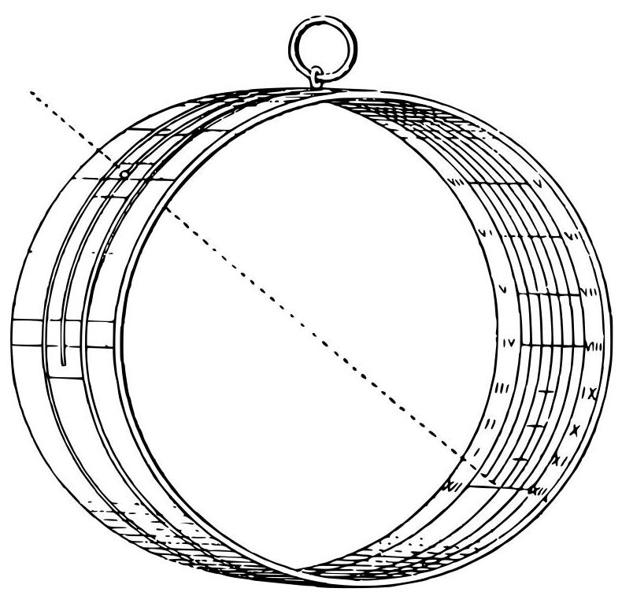

miracles which take place on fixed dates - ex. gr. the liquefaction of the blood of S. Januarius - occurred according to the new calendar, the papal decree was presumed to have a divine sanction-Deo ipso huic correctioni Gregorianae subscribente - and was accepted as a necessary evil.

In England a bill to carry out the same reform was introduced in 1584 , but was withdrawn after being read a second time; and the change was not finally effected till 1752 , when eleven days were omitted from that year. In Roman Catholic countries the new style was adopted in 1582. In Scotland the change was made in 1600. In the German Lutheran States it was made in 1700. In England, as I have said above, it was introduced in 1752; and in Ireland it was made in 1782. It is well known that the Greek Church still adheres to the Julian calendar.

The Mohammedan year contains 12 lunar months, or 354 $\frac{1}{3}$ days, and thus has no connection with the seasons.

The Gregorian change in the calendar was introduced in order to keep Easter at the right time of year. The date of Easter depends on that of the vernal equinox, and as the Julian calendar made the year of an average length of 365.25 days instead of 365.242216 days, the vernal equinox came earlier and earlier in the year, and in 1582 had regreded to within about ten days of February.

The rule for determining Easter is as follows*. In 325 the Nicene Council decreed that the Roman practice should be followed; and after 463 (or perhaps, 530) the Roman practice required that Easter-day should be the first Sunday after the full moon which occurs on or next following the vernal equinox - full moon being assumed to occur on the fourteenth day from the day of the preceding new moon (though as a matter of fact it occurs on an average after an interval of rather more than ${14}\frac{3}{4}$ days), and the vernal equinox being assumed to fall on March 21 (though as a matter of fact it sometimes falls on March 22).

This rule and these assumptions were retained by Gregory on the ground that it was inexpedient to alter a rule with which so many traditions were associated; but, in order to save disputes as to the exact instant of the occurrence of the new moon, a mean sun and a mean moon defined by Clavius were used in applying the rule. One consequence of using this mean sun and mean moon and giving an artificial definition of full moon is that it may happen, as it did in 1818 and 1845, that the actual full moon occurs on Easter Sunday. In the British Act, 24 Geo. II. cap. 23, the explanatory clause which defines full moon is omitted, but practically full moon has been interpreted to mean the Roman ecclesiastical full moon; hence the Anglican and Roman rules are the same. Until 1774 the German Lutheran States employed the actual sun and moon. Had full moon been taken to mean the fifteenth day of the moon, as is the case in the civil calendar, then the rule might be given in the form that Easter-day is the Sunday on or next after the calendar full moon which occurs next after March 21.

---

* De Morgan, Companion to the Almanac, London, 1845, pp. 1-36; Ibid., 1846, pp. 1-10.

---

Assuming that the Gregorian calendar and tradition are used, there still remains one point in this definition of Easter which might lead to different nations keeping the feast at different times. This arises from the fact that local time is introduced. For instance the difference of local time between Rome and London is about 50 minutes. Thus the instant of the first full moon next after the vernal equinox might occur in Rome on a Sunday morning, say at 12.30 a.m., while in England it would still be Saturday evening, 11.40 p.m., in which case our Easter would be one week earlier than at Rome. Clavius foresaw the difficulty, and the Roman Communion all over the world keep Easter on that day of the month which is determined by the use of the rule at Rome. But presumably the British Parliament intended time to be determined by the Greenwich meridian, and if so the Anglican and Roman dates for Easter might differ by a week; whether such a case has ever arisen or been discussed I do not know, and I leave to ecclesiastics to say how it should be settled.

The usual method of calculating the date on which Easter-day falls in any particular year is involved, and possibly the following simple rule* may be unknown to some of my readers.

Let $m$ and $n$ be numbers as defined below. (i) Divide the number of the year by4,7,19; and let the remainders be $a, b, c$ , respectively. (ii) Divide ${19c} + m$ by 30, and let $d$ be the remainder. (iii) Divide ${2a} + {4b} + {6d} + n$ by 7, and let $e$ be the remainder. (iv) Then the Easter full moon occurs $d$ days after March 21; and Easter-day is the $\left( {{22} + d + e}\right)$ th of March or the $\left( {d + e - 9}\right)$ th day of April, except that if the calculation gives $d = {29}$ and $e = 6$ (as happens in 1981) then Easter-day is on April 19 and not on April 26, and if the calculation gives $d = {28}, e = 6$ , and also $c > {10}$ (as happens in 1954) then Easter-day is on April 18 and not on April 25, that is, in these two cases Easter falls one week earlier than the date given by the rule. These two exceptional cases cannot occur in the Julian calendar, and in the Gregorian calendar they occur only very rarely. It remains to state the values of $m$ and $n$ for the particular period. In the Julian calendar we have $m = {15}, n = 6$ . In the Gregorian calendar we have, from 1582 to 1699 inclusive, $m = {22}, n = 2$ ; from 1700 to ${1799}, m = {23}, n = 3$ ; from 1800 to ${1899}, m = {23}, n = 4$ ; from 1900 to ${2099}, m = {24}, n = 5$ ; from 2100 to 2199, $m = {24}, n = 6$ ; from 2200 to 2299, $m = {25}, n = 0$ ; from 2300 to ${2399}, m = {26}, n = 1$ ; and from 2400 to 2499, $m = {25}$ , $n = 1$ . Thus for the year 1908 we have $m = {24}, n = 5$ ; hence $a = 0$ , $b = 4, c = 8;d = {26}$ ; and $e = 2$ : therefore Easter Sunday will be on the 19th of April. After the year 4200 the form of the rule will have to be slightly modified.

---

* It is due to Gauss, and his proof is given in Zach's Monatliche Correspondenz, August, 1800, vol. II, pp. 221-230.

---

The dominical letter and the golden number of the ecclesiastical calendar can be at once determined from the values of $b$ and $c$ . The epact, that is, the moon's age at the beginning of the year, can be also easily calculated from the above data in any particular case; the general formula was given by Delambre, but its value is required so rarely by any but professional astronomers and almanack-makers that it is unnecessary to quote it here.

We can evade the necessity of having to recollect the values of $m$ and $n$ by noticing that, if $N$ is the given year, and if $\{ N/x\}$ denotes the integral part of the quotient when $N$ is divided by $x$ , then $m$ is the remainder when ${15} + \xi$ is divided by 30, and $n$ is the remainder when $6 + \eta$ is divided by 7 : where, in the Julian calendar, $\xi  = 0$ , and $\eta  = 0$ ; and, in the Gregorian calendar, $\xi  = \{ N/{100}\}  - \{ N/{400}\}  - \{ N/{300}\}$ , and $\eta  = \{ N/{100}\}  - \{ N/{400}\}  - 2$ .

If we use these values of $m$ and $n$ , and if we put for $a, b, c$ , their values, namely, $a = N - 4\{ N/4\} , b = N - 7\{ N/7\} , c = N - {19}\{ N/{19}\}$ , the rule given on the preceding page takes the following form. "Divide ${19N} - \{ N/{19}\}  + {15} + \xi$ by 30, and let the remainder be $d$ . Next divide $6\left( {N + d + 1}\right)  - \{ N/4\}  + \eta$ by 7, and let the remainder be $e$ . Then Easter full moon is on the $d$ th day after March 21, and Easter-day is on the $\left( {{22} + d + e}\right)$ th of March or the $\left( {d + e - 9}\right)$ th of April as the case may be; except that if the calculation gives $d = {29}$ , and $e = 6$ , or if it gives $d = {28}, e = 6$ , and $c > {10}$ , then Easter-day is on the $\left( {d + e - {16}}\right)$ th of April."

Thus, if $N = {1899}$ , we divide ${19}\left( {1899}\right)  - {99} + {15} + \left( {{18} - 4 - 6}\right)$ by 30, which gives $d = 5$ , and then we proceed to divide $6\left( {{1899} + 5 + 1}\right)  - {474}$ $+ \left( {{18} - 4 - 2}\right)$ by 7, which gives $e = 6$ : therefore Easter-day is on April 2 .

The above rules cover all the cases worked out with so much labour by Clavius and others*.

I may add here a rule, quoted by Zeller, for determining the day of the week corresponding to any given date. Suppose that the $p$ th day of the $q$ th month of the year $N$ anno domini is the $r$ th day of the week, reckoned from the preceding Saturday. Then $r$ is the remainder when $p + {2q} + \{ 3\left( {q + 1}\right) /5\}  + N + \{ N/4\}  - \eta$ is divided by 7 ; provided January and February are reckoned respectively as the 13th and 14th months of the preceding year.

For instance, Columbus first landed in the New World on Oct. 12, 1492. Here $p = {12}, q = {10}, N = {1492},\eta  = 0$ . If we divide ${12} + {20} + 6$ +1492 + 373 by 7 we get $r = 6$ ; hence it was on a Friday. Again, Charles I was executed on Jan. 30,1649. Here $p = {30}, q = {13}$ , $N = {1648},\eta  = 0$ , and we find $r = 3$ ; hence it was on a Tuesday. As another example, the battle of Waterloo was fought on June 18, 1815. Here $p = {18}, q = 6, N = {1815},\eta  = {12}$ , and we find $r = 1$ ; hence it took place on a Sunday.

I proceed now to give a short account of some of the means of measuring time which were formerly in use.

Of devices for measuring time, the earliest of which we have any positive knowledge are the styles or gnomons erected in Egypt and Asia Minor. These were sticks placed vertically in a horizontal piece of ground, and surrounded by three concentric circles, such that every two hours the end of the shadow of the stick passed from one circle to another. Some of these have been found at Pompeii and Tusculum.

The sun-dial is not very different in principle. It consists of a rod or style fixed on a plate or dial; usually, but not necessarily, the style is placed so as to be parallel to the axis of the earth. The shadow of the style cast on the plate by the sun falls on lines engraved there which are marked with the corresponding hours.

---

* Most of the above-mentioned facts about the calendar are taken from Delambre's Astronomie, Paris, 1814, vol. III, chap. xxxviii; and his Histoire de l'astronomie moderne, Paris, 1821, vol. I, chap. i: see also A. De Morgan, The Book of Almanacs, London, 1851; S. Butcher, The Ecclesiastical Calendar, Dublin, 1877; and C. Zeller, Acta Mathematica, Stockholm, 1887, vol. IX, pp. 131-136: on the chronological details see J.L. Ideler, Lehrbuch der Chronologie, Berlin, 1831.

---

The earliest sun-dial, of which I have read, is that made by Berosus in 540 B.C. One was erected by Meton at Athens in 433 B.C. The first sun-dial at Rome was constructed by Papirius Cursor in 306 B.C. Portable sun-dials, with a compass fixed in the face, have been long common in the East as well as in Europe. Other portable instruments of a similar kind were in use in medieval Europe, notably the sun-rings, hereafter described, and the sun-cylinders*.

I believe it is not generally known that a sun-dial can be so constructed that the shadow will, for a short time near sunrise and sunset, move backwards on the dial ${}^{ \dagger  }$ . This was discovered by Nonez. The explanation is as follows. Every day the sun appears to describe a circle round the pole, and the line joining the point of the style to the sun describes a right cone whose axis points to the pole. The section of this cone by the dial is the curve described by the extremity of the shadow, and is a conic. In our latitude the sun is above the horizon for only part of the twenty-four hours, and therefore the extremity of the shadow of the style describes only a part of this conic. Let $Q{Q}^{\prime }$ be the arc described by the extremity of the shadow of the style from sunrise at $Q$ to sunset at ${Q}^{\prime }$ , and let $S$ be the point of the style and $F$ the foot of the style, i.e. the point where the style meets the plane of the dial. Suppose that the dial is placed so that the tangents drawn from $F$ to the conic $Q{Q}^{\prime }$ are real, and that $P$ and ${P}^{\prime }$ , the points of contact of these tangents, lie on the arc $Q{Q}^{\prime }$ . If these two conditions are fulfilled, then the shadow will regrede through the angle ${QFP}$ as its extremity moves from $Q$ to $P$ , it will advance through the angle ${PF}{P}^{\prime }$ as its extremity moves from $P$ to ${P}^{\prime }$ , and it will regrede through the angle ${P}^{\prime }F{Q}^{\prime }$ as its extremity moves from ${P}^{\prime }$ to ${Q}^{\prime }$ .

If the sun's apparent diurnal path crosses the horizon-as always happens in temperate and tropical latitudes - and if the plane of the dial is horizontal, the arc $Q{Q}^{\prime }$ will consist of the whole of one branch of a hyperbola, and the above conditions will be satisfied if $F$ is within the space bounded by this branch of the hyperbola and its asymptotes. As a particular case, in a place of latitude ${12}^{ \circ  }\mathrm{N}$ . on a day when the sun is in the northern tropic (of Cancer) the shadow on a dial whose face is horizontal and style vertical will move backwards for about two hours between sunrise and noon.

---

* Thus Chaucer in the Shipman's Tale, "by my chilindre it is prime of day," and Lydgate in the Siege of Thebes, "by my chilyndre I gan anon to see... that it drew to nine."

† Ozanam, 1803 edition, vol. III, p. 321; 1840 edition, p. 529.

---

If, in the case of a given sun-dial placed in a certain position, the conditions are not satisfied, it will be possible to satisfy them by tilting the sun-dial through an angle properly chosen. This was the rationalistic explanation, offered by the French encyclopaedists, of the miracle recorded in connection with Isaiah and Hezekiah*. Suppose, for instance, that the style is perpendicular to the face of the dial. Draw the celestial sphere. Suppose that the sun rises at $M$ and culminates at $N$ , and let $L$ be a point between $M$ and $N$ on the sun’s diurnal path. Draw a great circle to touch the sun’s diurnal path ${MLN}$ at $L$ , let this great circle cut the celestial meridian in $A$ and ${A}^{\prime }$ , and of the arcs ${AL},{A}^{\prime }L$ suppose that ${AL}$ is the less and therefore is less than a quadrant. If the style is pointed to $A$ , then, while the sun is approaching $L$ , the shadow will regrede, and after the sun passes $L$ the shadow will advance. Thus if the dial is placed so that a style which is normal to it cuts the meridian midway between the equator and the tropic, then between sunrise and noon on the longest day the shadow will move backwards through an angle

$$
{\sin }^{-1}\left( {\cos \omega \sec \frac{1}{2}\omega }\right)  - {\cot }^{-1}\left\{  {\sin \omega \cos \left( {l - \frac{1}{2}\omega }\right) {\left( {\cos }^{2}l - {\sin }^{2}\omega \right) }^{-\frac{1}{2}}}\right\}  ,
$$

where $l$ is the latitude of the place and $\omega$ is the obliquity of the ecliptic.

The above remarks refer to the sun-dials in ordinary use. In 1892 General Oliver brought out in London a dial with a solid style, the section of the style being a certain curve whose form was determined empirically by the value of the equation of time as compared with the sun’s declination ${}^{ \dagger  }$ . The shadow of the style on the dial gives the local mean time, though of course in order to set the dial correctly at any place the latitude of the place must be known: the dial may be also set so as to give the mean time at any other locality whose longitude relative to the place of observation is known.

The sun-ring or ring-dial is another instrument for measuring solar time ${}^{ \ddagger  }$ . One of the simplest type is figured in the accompanying diagram.

---

* 2 Kings, chap. xx, vv. 9-11.

† An account of this sun-dial with a diagram was given in Knowledge, July 1, 1892, pp. 133, 134.

‡ See Ozanam, 1803 edition, vol. III, p. 317; 1840 edition, p. 526.

---

The sun-ring consists of a thin brass band, about a quarter of an inch wide, bent into the shape of a circle, which slides between two fixed circular rims - the radii of the circles being about one inch. At one point of the band there is a hole; and when the ring is suspended from a fixed point attached to the rims so that it hangs in a vertical plane containing the sun, the light from the sun shines through this hole and makes a bright speck on the opposite inner or concave surface of the ring. On this surface the hours are marked, and, if the ring is properly adjusted, the spot of light will fall on the hour which indicates the solar time. The adjustment for the time of year is made as follows. The rims between which the band can slide are marked on their outer or convex side with the names of the months, and the band containing the hole must be moved between the rims until the hole is opposite to that month for which the ring is being used.

For determining times near noon the instrument is reliable, but for other hours in the day it is accurate only if the time of year is properly chosen, usually near one of the equinoxes. This defect may be corrected by marking the hours on a curved brass band affixed to the concave surface of the rims. I possess two specimens of rings of this kind. These rings were distributed widely. Of my two specimens, one was bought in the Austrian Tyrol and the other in London. Astrolabes and sea-rings can be used as sun-rings.

Clepsydras or water-clocks, and hour-glasses or sand-clocks, afford other means of measuring time. The time occupied by a given amount of some liquid or sand in running through a given orifice under the same conditions is always the same, and by noting the level of the liquid which has run through the orifice, or which remains to run through it, a measure of time can be obtained.

The burning of graduated candles gives another way of measuring time, and we have accounts of those used by Alfred the Great for the purpose. Incense sticks were used by the Chinese in a similar way.

Modern clocks and watches* comprise a train of wheels turned by a weight, spring, or other motive power, and regulated by a pendulum, balance, fly-wheel, or other moving body whose motion is periodic and time of vibration constant. The direction of rotation of the hands of a clock was selected originally so as to make the hands move in the same direction as the shadow on a sun-dial whose face is horizontal - the dial being situated in our hemisphere.

The invention of clocks with wheels is attributed by tradition to Pacificus of Verona, circ. 850, and also to Gerbert, who is said to have made one at Magdeburg in 996: but there is reason to believe that these were sun-clocks. The earliest wheel-clock of which we have historical evidence was one sent by the Sultan of Egypt in 1232 to the Emperor Frederick II, though there seems to be no doubt that they had been made in Italy at least fifty years earlier.

The oldest clock in England of which we know anything was one erected in 1288 in or near Westminster Hall out of a fine imposed on a corrupt Lord Chief Justice. The bells, and possibly the clock, were staked by Henry VIII on a throw of dice and lost, but the site was marked by a sun-dial, destroyed about sixty years ago, and bearing the inscription Discite justiciam moniti. In 1292 a clock was erected in Canterbury Cathedral at a cost of $\pounds {30}$ . One erected at Glastonbury Abbey in 1325 is at present in the Kensington Museum and is in regular action. Another made in 1326 for St Alban's Abbey showed the astronomical phenomena, and seems to have been one of the earliest clocks that did so. One put up at Dover in 1348 is still in good working order. The clocks at Peterborough and Exeter were of about the same date, and portions of them remain in situ. Most of these early clocks were regulated by horizontal balances: pendulums being then unknown. Of the elaborate clocks of a later date, that at Strasburg made by Dasy-podius in 1571, and that at Lyons constructed by Lippeus in 1598, are especially famous: the former was restored in 1842, though in a manner which destroyed most of the ancient works.

---

* See Clock and Watch Making by Lord Grimthorpe, 7th edition, London, 1883.

---

In 1370, Vick constructed a clock for Charles V with a weight as motive power and a vibrating escapement - a great improvement on the rough time-keepers of an earlier date.

The earliest clock regulated by a pendulum seems to have been made in 1621 by a clockmaker named Harris, of Covent Garden, London, but the theory of such clocks is due to Huygens*. Galileo had discovered previously the isochronism of a pendulum, but did not apply it to the regulation of the motion of clocks. Hooke made such clocks, and possibly discovered independently this use of the pendulum: he invented or re-invented the anchor pallet.

A watch may be defined as a clock which will go in any position. Watches, though of a somewhat clumsy design, were made at Nuremberg by P. Hele early in the sixteenth century - the motive power being a ribbon of steel, wound round a spindle, and connected at one end with a train of wheels which it turned as it unwound - and possibly a few similar time-pieces had been made in the previous century. By the end of the sixteenth century they were not uncommon. At this time they were usually made in the form of fanciful ornaments such as skulls, or as large pendants, but about 1620 the flattened oval form was introduced, rendering them more convenient to carry in a pocket or about the person. In the seventeenth century their construction was greatly improved, notably by the introduction of the spring balance by Huygens in 1674, and independently by Hooke in 1675 both mathematicians having discovered that small vibrations of a coiled spring, of which one end is fixed, are practically isochronous. The fusee had been used by R. Zech of Prague in 1525, but was re-invented by Hooke.

Clocks and watches are usually moved and regulated in the manner indicated above. Other motive powers and other devices for regulating the motion may be met with occasionally. Of these I may mention a clock in the form of a cylinder, usually attached to another weight as in Atwood's machine, which rolls down an inclined plane so slowly that it takes twelve hours to roll down, and the highest point of the face always marks the proper hour*.

---

Horologium Oscillatorium, Paris, 1673.

---

A water-clock made on a somewhat similar plan is described by Ozanam ${}^{ \dagger  }$ as one of the sights of Paris at the beginning of the last century. It was formed of a hollow cylinder divided into various compartments each containing some mercury, so arranged that the cylinder descended with uniform velocity between two vertical pillars on which the hours were marked at equidistant intervals.

Other ingenious ways of concealing the motive power have been described in the columns of La Nature ${}^{ \ddagger  }$ . Of such mysterious timepieces the following are not uncommon examples, and probably are known to most readers of this book. One kind of clock consists of a glass dial suspended by two thin wires; the hands however are of metal, and the works are concealed in them or in the pivot. Another kind is made of two sheets of glass in a frame containing a spring which gives to the hinder sheet a very slight oscillatory motion-imperceptible except on the closest scrutiny-and each oscillation moves the hands through the requisite angles. Some so-called perpetual motion timepieces were described above on pages 77-78. Lastly, I have seen in France a clock the hands of which were concealed at the back of the dial, and carried small magnets; pieces of steel in the shape of insects were placed on the dial, and, following the magnets, served to indicate the time.

The position of the sun relative to the points of the compass determines the solar time. Conversely, if we take the time given by a watch as being the solar time - and it will differ from it by only a few minutes at the most - and we observe the position of the sun, we can find the points of the compass ${}^{§}$ . To do this it is sufficient to point the hour-hand to the sun, and then the direction which bisects the angle between the hour and the figure XII will point due south. For instance, if it is four o'clock in the afternoon, it is sufficient to point the hour-hand (which is then at the figure IIII) to the sun, and the figure II on the watch will indicate the direction of south. Again, if it is eight

---

* Ozanam, 1803 edition, vol. II, p. 39; 1840 edition, p. 212; or La Nature, Jan. 23, 1892, pp. 123, 124.

† Ozanam, 1803 edition, vol. II, p. 68; 1840 edition, p. 225.

$\ddagger$ See especially the volumes issued in 1874,1877, and 1878.

§ The rule is given by W.H. Richards, Military Topography, London, 1883, p. 31, though it is not stated quite correctly. I do not know who first enunciated it.

---