The solutions of ${z}^{6} =  - 8$ are shown on the Argand diagram in Figure 4.

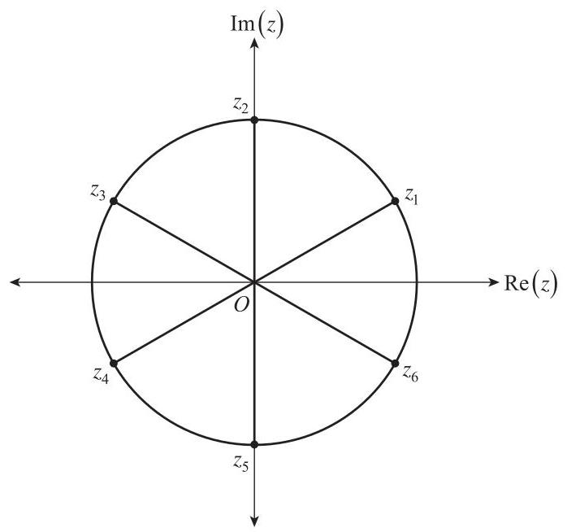

Figure 4

(a) (i) By using De Moivre’s theorem or otherwise, write the solutions ${z}_{1},{z}_{2},{z}_{3},{z}_{4},{z}_{5},{z}_{6}$ in ${rcis\theta }$ form below.

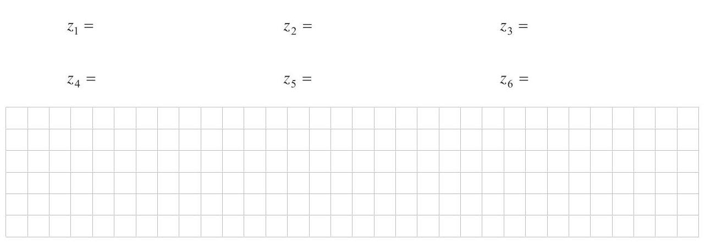

(2 marks)

(ii) Show that $\left| {{z}_{1} - {z}_{6}}\right|  = \sqrt{2}$ . page 12 of 16

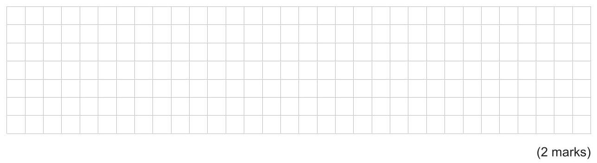

Figure 5 shows a triangle formed by joining $O,{z}_{1}$ , and ${z}_{6}$ , and a hexagon formed by joining ${z}_{1},{z}_{2},{z}_{3},{z}_{4},{z}_{5},{z}_{6}$ .

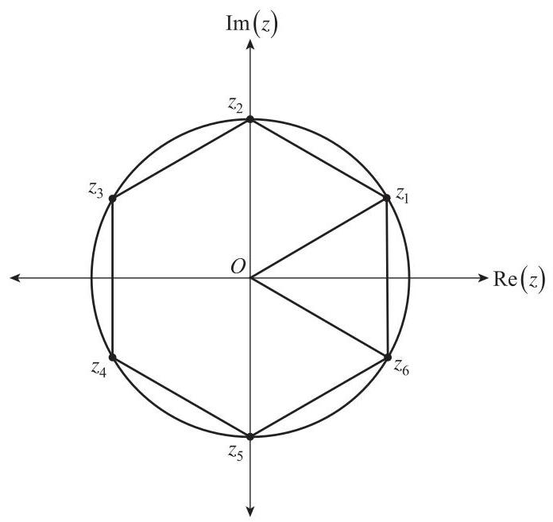

Figure 5

(b) (i) Show that the area of the triangle $O{z}_{1}{z}_{6}$ is $\frac{\sqrt{3}}{2}$ . (2 marks)

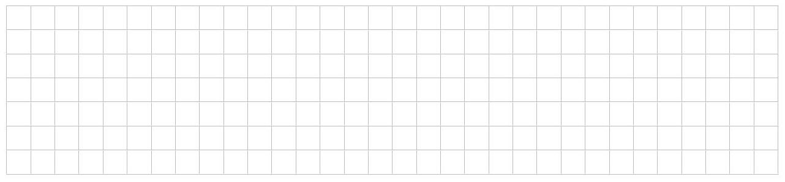

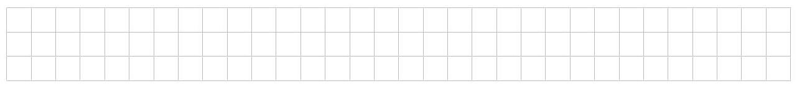

(1 mark)

(c) The solutions of ${z}^{6} = k$ , where $k$ is a real constant, form a hexagon of area $9\sqrt{3}$ . Find a value for $k$ . (1 mark)

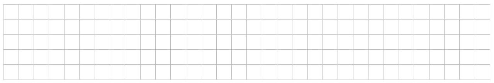

(9 marks)

Consider the function $f\left( x\right)  = \sin x\ln \left( {\cos x}\right)$ , where $\cos x > 0$ .

(a) Using integration by parts, show that

$$
\int \sin x\ln \left( {\cos x}\right) {dx} =  - \cos x\ln \left( {\cos x}\right)  + \cos x + c\text{, where}c\text{is a real constant.}
$$

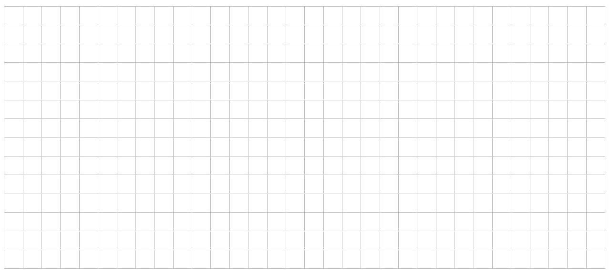

(2 marks)

(b) Hence, show that ${\int }_{0}^{\frac{\pi }{3}}\sin x\ln \left( {\cos x}\right) {dx} = \frac{1}{2}\ln 2 - \frac{1}{2}$ .

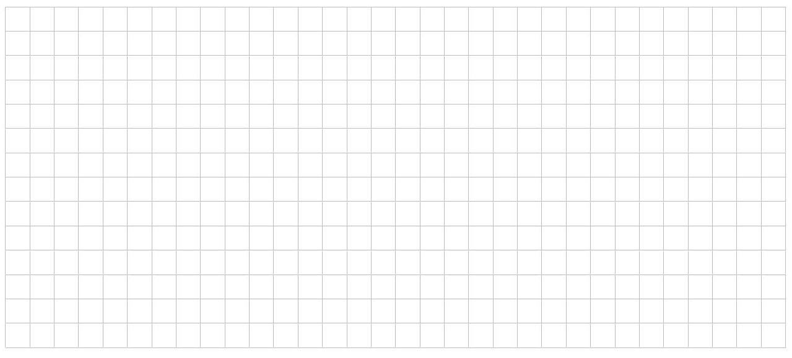

(3 marks)

Figure 6 shows the graph of $f\left( x\right)  = \sin x\ln \left( {\cos x}\right)$ for $- \frac{\pi }{2} < x < \frac{\pi }{2}$ .

The point $P$ is on the curve of $y = f\left( x\right)$ , where $x = \frac{\pi }{3}$ .

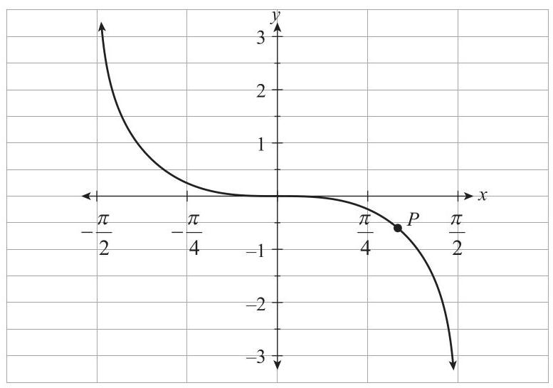

Figure 6

(c) On Figure 6, clearly draw and label the graph of $y = f\left( \left| x\right| \right)$ for $- \frac{\pi }{2} < x < \frac{\pi }{2}$ .(2 marks)

(d) Hence, find the exact area bounded by the curves $y = f\left( x\right)$ and $y = f\left( \left| x\right| \right)$ , and the vertical lines

$$
x = \frac{\pi }{3}\text{ and }x =  - \frac{\pi }{3}.
$$

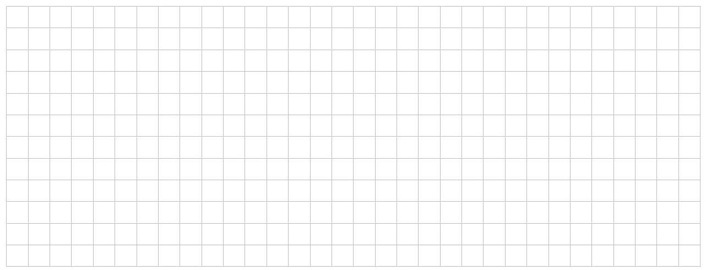

(2 marks)

You may write on this page if you need more space to finish your answers to any of the questions in this question booklet. Make sure to label each answer carefully (e.g. 5(b)(i) continued).

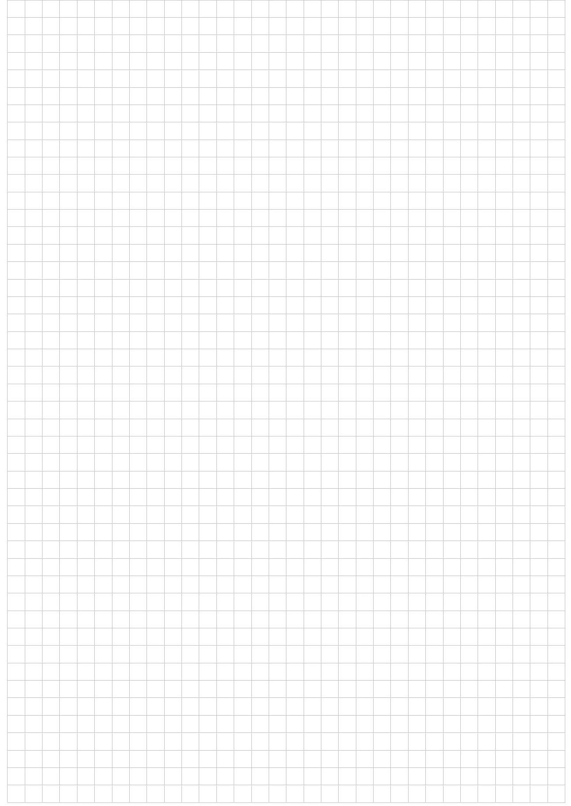

## Specialist Mathematics 2024

## Question booklet 2

Questions 8 to 10 (45 marks)

- Answer all questions

- Write your answers in this question booklet

- You may write on pages 5, 9, and 12 if you need more space

- Allow approximately 65 minutes

- Approved calculators may be used - complete the box below

Copy the information from your SACE label here Graphics calculator

A circle ${\left( x - \pi \right) }^{2} + {\left( y - 1\right) }^{2} = 1$ is drawn on Figure 7 below.

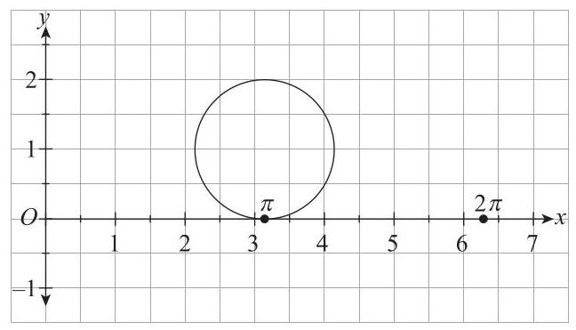

Figure 7

A parametric curve has the equations below.

$$
\left\{  {\begin{array}{l} x\left( t\right)  = t - \sin t \\  y\left( t\right)  = 1 - \cos t \end{array}\text{ for }0 \leq  t \leq  {2\pi }}\right.
$$

(a) Sketch the parametric curve on the axes in Figure 7 above.(3 marks)

(b) (i) Find $\frac{dy}{dx}$ for the circle.

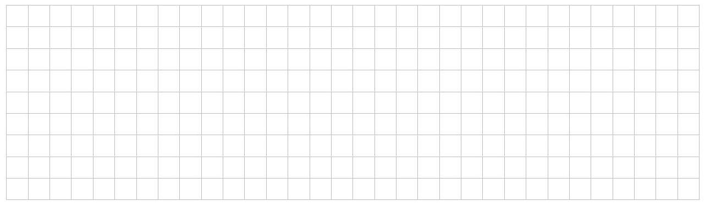

(2 marks)

(ii) Find $\frac{dy}{dx}$ for the parametric curve drawn in part (a) in terms of $t$ .

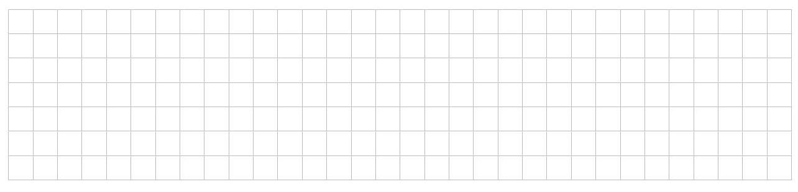

(2 marks)

(c) Hence, show that both curves have a common horizontal tangent at $P\left( {\pi ,2}\right)$ .

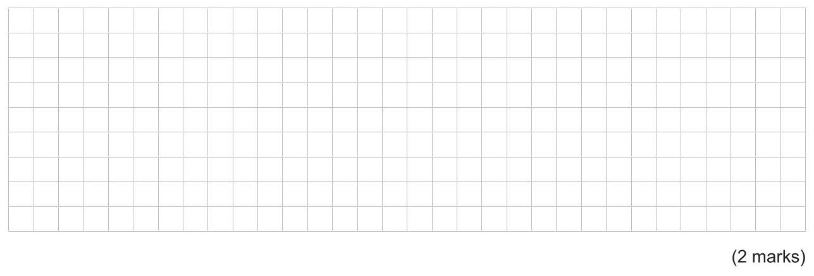

(d) From part (a), notice that the length of arc ${OP} >$ length of the line ${OP}$ .

Consider the triangle ${OPA}$ , where $A$ is $\left( {{2\pi },0}\right)$ .

Using the triangle inequality, show that the length of the parametric curve from 0 to ${2\pi }$ is greater

than the circumference of the circle.

Question 8 continues on page 4.

(e) (i) Show that the length of the parametric curve from $t = 0$ to $t = {2\pi }$ is given by ${\int }_{0}^{2\pi }2\sin \left( \frac{t}{2}\right) {dt}$ .

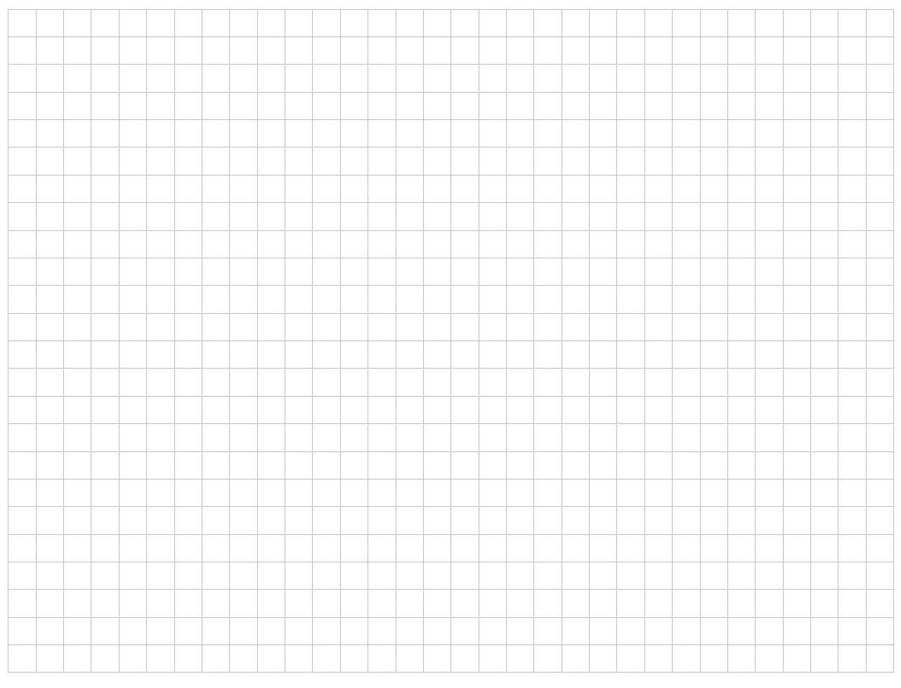

(ii) Hence, find the length of the parametric curve. (1 mark)

<table><tr><td/><td/><td/><td/><td/><td/><td/><td/><td/><td/><td/><td/><td/><td/><td/><td/><td/><td/><td/><td/><td/><td/><td/><td/><td/><td/><td/><td/><td/><td/><td/></tr><tr><td/><td/><td/><td/><td/><td/><td/><td/><td/><td/><td/><td/><td/><td/><td/><td/><td/><td/><td/><td/><td/><td/><td/><td/><td/><td/><td/><td/><td/><td/><td/></tr><tr><td/><td/><td/><td/><td/><td/><td/><td/><td/><td/><td/><td/><td/><td/><td/><td/><td/><td/><td/><td/><td/><td/><td/><td/><td/><td/><td/><td/><td/><td/><td/></tr></table>

You may write on this page if you need more space to finish your answers to any of the questions in this question booklet. Make sure to label each answer carefully (e.g. 8(e)(i) continued).

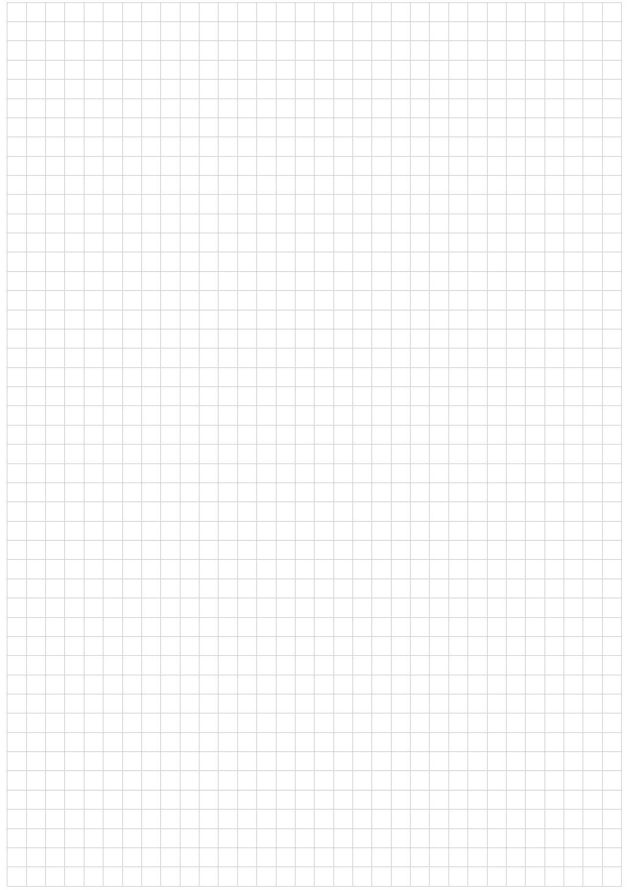

